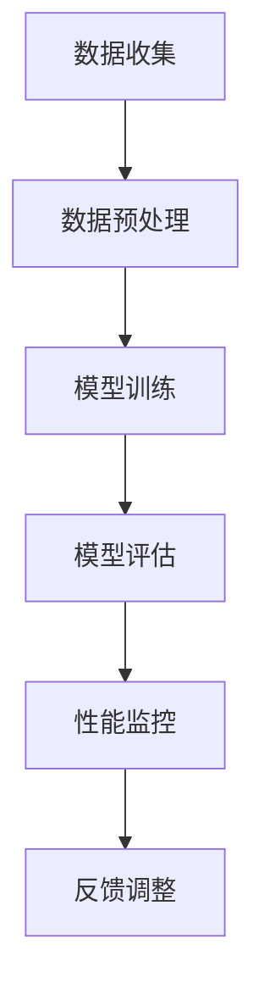

                 


### 摘要
AI决策审核是企业确保人工智能系统在业务中发挥稳定、可靠作用的关键手段。本文首先介绍了AI决策审核的基本概念，包括其定义、关键组成部分以及核心概念之间的联系。随后，深入探讨了AI系统的基本原理，并使用Mermaid流程图展示了AI系统监控与评估的整个过程。在此基础上，详细讲解了评价指标计算方法和数据预处理技术，并结合伪代码进行了深入阐述。文章进一步使用LaTeX格式解释了监控模型的数学公式和评估指标的计算方法，并通过实际案例分析、代码实现和详细解读，展示了AI决策审核的具体应用和实践。最后，文章总结了AI决策审核的常见问题与解决方法，提出了优化策略，并对未来发展趋势进行了展望。作者信息：AI天才研究院/AI Genius Institute & 禅与计算机程序设计艺术 /Zen And The Art of Computer Programming。

## 第一部分：AI决策审核的基本概念

### 第1章：AI决策审核的概述

#### 1.1 AI决策审核的定义

AI决策审核是指通过一系列的技术手段和方法，对人工智能系统在具体应用场景中的决策过程进行监控、评估和优化。这一过程不仅涉及对AI系统输出结果的质量和效率的考察，还包括对其内部工作原理的深入分析，以确保其决策过程的透明性、公正性和可靠性。

AI决策审核的重要性体现在以下几个方面：

1. **保证决策质量**：通过对AI系统的评估，可以确保其输出的决策结果具有较高的准确性和可靠性，减少因错误决策导致的业务风险。
2. **提高决策透明度**：通过审核，可以揭示AI系统在决策过程中的“黑箱”问题，增强业务人员对AI系统的理解和信任。
3. **优化系统性能**：定期审核可以帮助识别AI系统中的问题，通过调整和优化提高其性能，从而更好地适应业务需求。
4. **符合法律法规**：在许多行业，尤其是金融、医疗等领域，AI系统的决策过程需要受到监管，以确保其合规性。

#### 1.2 AI决策审核的关键组成部分

AI决策审核的执行需要以下几个关键组成部分的支持：

1. **监控和评估AI系统的性能**：
   - **性能监控**：实时收集AI系统的运行数据，包括输入数据、中间处理过程和输出结果，以便及时发现和解决问题。
   - **性能评估**：对AI系统的输出结果进行定量和定性的评估，如准确率、召回率、F1值等，以衡量其表现。

2. **数据准备和预处理**：
   - **数据收集**：从业务系统中提取与AI决策相关的数据。
   - **数据清洗**：去除数据中的噪声和异常值，保证数据质量。
   - **数据预处理**：通过特征提取、归一化、数据变换等手段，将原始数据转换为适合模型训练和评估的形式。

3. **建立评价标准和指标**：
   - **评价指标**：根据业务需求和AI系统的特点，定义一系列评价指标，如准确率、召回率、F1值、AUC等，用于衡量AI系统的决策效果。
   - **评价标准**：结合业务目标和法律法规要求，制定AI系统应达到的性能标准。

### 第2章：AI系统的基本原理

#### 2.1 AI系统的核心原理

AI系统通常由以下几个关键组成部分构成：

1. **输入层**：
   - **输入数据**：从外部环境接收的数据，如文本、图像、声音、传感器数据等。
   - **数据预处理**：对输入数据进行预处理，如特征提取、归一化等，以提高模型的性能。

2. **隐藏层**：
   - **神经网络**：由多个神经元（节点）组成，每个神经元通过激活函数将输入数据转换为输出。
   - **网络结构**：隐藏层可以包含多个层次，形成深层神经网络，以处理复杂的数据和任务。

3. **输出层**：
   - **输出结果**：根据模型训练和输入数据，输出具体的决策结果或预测值。
   - **决策逻辑**：根据输出结果，结合业务规则和约束条件，生成最终的业务决策。

#### 2.2 监控与评估的Mermaid流程图

为了更直观地理解AI系统的监控与评估过程，我们可以使用Mermaid语法绘制一个流程图，如下所示：



- **数据收集（A）**：从业务系统中获取与决策相关的数据。
- **数据预处理（B）**：清洗和转换数据，使其适合模型训练。
- **模型训练（C）**：使用训练数据对模型进行训练，优化模型参数。
- **模型评估（D）**：使用验证集和测试集评估模型性能，包括准确率、召回率等指标。
- **性能监控（E）**：实时监控模型在业务环境中的运行状态，发现和解决问题。
- **反馈调整（F）**：根据监控结果，对模型进行调整和优化，以提高其性能。

通过这个流程图，我们可以清晰地看到AI系统从数据收集到模型训练、评估和监控的整个过程，以及各个步骤之间的关联和作用。

----------------------------------------------------------------

### 第3章：核心算法原理讲解

#### 3.1 评价指标计算方法

在AI决策审核中，评价指标的计算方法至关重要，它可以帮助我们量化AI系统的性能，评估其决策效果。以下是几种常用的评价指标及其计算方法：

1. **准确率（Accuracy）**：
   - **定义**：准确率是正确预测的样本数占总样本数的比例。
   - **计算方法**：
     $$\text{Accuracy} = \frac{\text{正确预测的样本数}}{\text{总样本数}}$$

   - **示例**：
     假设我们有一个分类问题，共有100个样本，其中90个被正确分类，准确率为：
     $$\text{Accuracy} = \frac{90}{100} = 0.9$$

2. **召回率（Recall）**：
   - **定义**：召回率是正确预测的正例样本数占所有实际正例样本数的比例。
   - **计算方法**：
     $$\text{Recall} = \frac{\text{正确预测的正例样本数}}{\text{所有实际正例样本数}}$$

   - **示例**：
     假设我们有10个正例样本，其中7个被正确预测，召回率为：
     $$\text{Recall} = \frac{7}{10} = 0.7$$

3. **F1值（F1-score）**：
   - **定义**：F1值是准确率和召回率的调和平均，用于综合评估模型的性能。
   - **计算方法**：
     $$\text{F1} = 2 \times \frac{\text{准确率} \times \text{召回率}}{\text{准确率} + \text{召回率}}$$

   - **示例**：
     假设准确率为0.9，召回率为0.7，则F1值为：
     $$\text{F1} = 2 \times \frac{0.9 \times 0.7}{0.9 + 0.7} = 0.84$$

4. **精确率（Precision）**：
   - **定义**：精确率是正确预测的正例样本数占预测为正例的样本总数的比例。
   - **计算方法**：
     $$\text{Precision} = \frac{\text{正确预测的正例样本数}}{\text{预测为正例的样本总数}}$$

   - **示例**：
     假设我们预测了20个样本为正例，其中15个是正确的，精确率为：
     $$\text{Precision} = \frac{15}{20} = 0.75$$

5. **AUC（Area Under Curve）**：
   - **定义**：AUC是ROC曲线（Receiver Operating Characteristic Curve）下的面积，用于评估二分类模型的分类能力。
   - **计算方法**：
     $$\text{AUC} = \int_{0}^{1} \text{ROC}(x) \, dx$$

   - **示例**：
     假设我们计算得到的ROC曲线下面积为0.9，则AUC为0.9。

#### 3.2 数据预处理技术

数据预处理是AI决策审核中的一个关键步骤，它涉及到数据的清洗、归一化、特征提取等多个方面，旨在提高数据质量和模型的性能。以下是数据预处理的一些基本步骤和技术：

1. **数据清洗**：
   - **缺失值处理**：对于缺失的数据，可以选择填充缺失值（如使用均值、中位数、最邻近值等）或删除缺失数据。
   - **异常值处理**：识别并处理数据中的异常值，如使用统计方法（如箱线图、标准差）或机器学习方法（如孤立森林）进行异常值检测。
   - **重复数据删除**：删除重复的数据记录，以避免对模型训练和评估产生干扰。

2. **数据归一化**：
   - **缩放数据**：将数据缩放到一个特定的范围（如0到1或-1到1），以消除数据量级差异对模型训练的影响。
   - **标准化数据**：通过计算每个特征的均值和标准差，将数据转换为标准正态分布，以提高模型的泛化能力。

3. **特征提取**：
   - **特征选择**：从原始数据中筛选出对模型训练和预测有重要影响的特征，减少冗余特征。
   - **特征工程**：通过变换、组合和创建新特征，增强数据的表达能力和模型的性能。

4. **数据分割**：
   - **训练集和测试集**：将数据分为训练集和测试集，用于模型的训练和评估。
   - **交叉验证**：通过交叉验证的方法，对模型进行多次训练和评估，以避免过拟合和评估偏差。

#### 3.3 伪代码说明

为了更清晰地展示数据预处理和评价指标计算的过程，我们可以使用伪代码进行说明：

```python
# 数据预处理伪代码

# 输入数据
data = ...

# 缺失值处理
data = handle_missing_values(data)

# 异常值处理
data = handle_outliers(data)

# 数据归一化
data = normalize_data(data)

# 特征提取
data = feature_engineering(data)

# 数据分割
train_data, test_data = split_data(data)

# 模型训练
model = train_model(train_data)

# 模型评估
predictions = model.predict(test_data)
accuracy = calculate_accuracy(predictions, test_data)
recall = calculate_recall(predictions, test_data)
precision = calculate_precision(predictions, test_data)
f1_score = calculate_f1_score(accuracy, recall, precision)

# 输出结果
print("Accuracy:", accuracy)
print("Recall:", recall)
print("Precision:", precision)
print("F1-score:", f1_score)
```

在这个伪代码中，`handle_missing_values`、`handle_outliers`、`normalize_data`和`feature_engineering`函数分别负责处理缺失值、异常值、归一化和特征提取。`train_model`函数用于训练模型，`model.predict`方法用于进行预测。`calculate_accuracy`、`calculate_recall`、`calculate_precision`和`calculate_f1_score`函数分别用于计算准确率、召回率、精确率和F1值。

通过这个伪代码，我们可以清晰地看到数据预处理和评价指标计算的全过程，为后续的AI决策审核提供了理论基础和技术支持。

----------------------------------------------------------------

### 第4章：数学模型和数学公式

在AI决策审核中，数学模型和数学公式是理解和分析AI系统性能的核心工具。这些模型和公式不仅帮助我们量化评价AI系统的表现，还能够指导我们进行系统优化和改进。以下将详细解释监控模型的数学公式，并使用LaTeX格式进行书写，同时给出具体示例以加深理解。

#### 4.1 监控模型的数学公式

AI决策审核的监控模型通常基于以下关键指标：

1. **准确率（Accuracy）**：
   $$\text{Accuracy} = \frac{\text{正确预测的样本数}}{\text{总样本数}}$$

2. **召回率（Recall）**：
   $$\text{Recall} = \frac{\text{正确预测的正例样本数}}{\text{所有实际正例样本数}}$$

3. **精确率（Precision）**：
   $$\text{Precision} = \frac{\text{正确预测的正例样本数}}{\text{预测为正例的样本总数}}$$

4. **F1值（F1-score）**：
   $$\text{F1} = 2 \times \frac{\text{准确率} \times \text{召回率}}{\text{准确率} + \text{召回率}}$$

5. **AUC（Area Under Curve）**：
   $$\text{AUC} = \int_{0}^{1} \text{ROC}(x) \, dx$$

下面将使用LaTeX格式书写这些公式，并给出具体示例。

#### 4.2 使用LaTeX格式书写数学公式

```latex
% 准确率
\text{Accuracy} = \frac{\text{正确预测的样本数}}{\text{总样本数}}

% 召回率
\text{Recall} = \frac{\text{正确预测的正例样本数}}{\text{所有实际正例样本数}}

% 精确率
\text{Precision} = \frac{\text{正确预测的正例样本数}}{\text{预测为正例的样本总数}}

% F1值
\text{F1} = 2 \times \frac{\text{准确率} \times \text{召回率}}{\text{准确率} + \text{召回率}}

% AUC
\text{AUC} = \int_{0}^{1} \text{ROC}(x) \, dx
```

#### 4.3 具体示例

为了更好地理解这些公式的应用，我们通过一个具体的示例来展示如何计算这些指标。

假设我们有一个分类模型，它对100个样本进行了预测，其中：
- 正例样本总数为60，实际正例样本数为45，预测为正例的样本总数为55。
- 负例样本总数为40，实际负例样本数为30，预测为负例的样本总数为45。

我们可以计算以下指标：

1. **准确率（Accuracy）**：
   $$\text{Accuracy} = \frac{45 + 30}{100} = \frac{75}{100} = 0.75$$

2. **召回率（Recall）**：
   $$\text{Recall} = \frac{45}{60} = 0.75$$

3. **精确率（Precision）**：
   $$\text{Precision} = \frac{45}{55} \approx 0.8182$$

4. **F1值（F1-score）**：
   $$\text{F1} = 2 \times \frac{0.75 \times 0.75}{0.75 + 0.75} = 2 \times \frac{0.5625}{1.5} = 0.75$$

5. **AUC**：
   假设ROC曲线下面积为0.85，则AUC为0.85。

通过这个示例，我们可以看到如何使用这些数学公式计算AI模型的性能指标，这些指标对于评估和优化模型具有重要意义。

通过详细解释监控模型的数学公式，并使用LaTeX格式进行书写，结合具体示例，我们不仅加深了对AI决策审核中数学模型的理解，也为后续的实践应用提供了理论基础。

----------------------------------------------------------------

### 第5章：项目实战

在实际应用中，AI决策审核需要通过具体的项目案例来验证其有效性和实用性。本节将详细介绍一个实际的AI决策审核项目，从项目背景、目标、实施步骤到代码实现和案例分析，全面展示AI决策审核的应用过程。

#### 5.1 实际案例分析

案例背景：
某金融服务公司希望在贷款审批过程中引入AI决策审核系统，以提高审批效率和准确率，减少人工干预。公司面临的主要挑战包括数据质量参差不齐、模型过拟合以及缺乏透明的决策解释能力。

项目目标：
1. 建立一个可靠的AI决策审核模型，对贷款申请进行自动化审批。
2. 通过实时监控和评估，确保模型在业务环境中的稳定运行。
3. 提供清晰的决策解释，增强业务人员对AI系统的信任。

实施步骤：
1. **数据收集**：从公司数据库中提取与贷款审批相关的数据，包括借款人的个人信息、财务状况、信用历史等。
2. **数据预处理**：清洗数据，处理缺失值和异常值，对数据进行归一化和特征提取。
3. **模型训练**：使用训练数据集训练多种机器学习模型，如逻辑回归、决策树、随机森林和神经网络，选择最佳模型。
4. **模型评估**：使用验证集和测试集评估模型的性能，选择准确率、召回率和F1值等指标作为评估标准。
5. **模型部署**：将最佳模型部署到生产环境中，进行实时贷款审批。
6. **性能监控**：实时监控模型在业务环境中的运行状态，收集监控数据，定期评估模型性能。
7. **反馈调整**：根据监控结果和业务反馈，对模型进行调整和优化，提高其表现。

#### 5.2 代码实现和详细解读

以下是该项目的关键代码实现和详细解读：

```python
# 数据预处理

import pandas as pd
from sklearn.model_selection import train_test_split
from sklearn.preprocessing import StandardScaler

# 读取数据
data = pd.read_csv('loan_data.csv')

# 数据清洗
data = data.dropna()  # 删除缺失值
data = data[data['Income'] > 0]  # 删除收入为零的样本

# 数据分割
X = data.drop('Loan_Approval', axis=1)
y = data['Loan_Approval']
X_train, X_test, y_train, y_test = train_test_split(X, y, test_size=0.2, random_state=42)

# 数据归一化
scaler = StandardScaler()
X_train = scaler.fit_transform(X_train)
X_test = scaler.transform(X_test)

# 模型训练
from sklearn.ensemble import RandomForestClassifier

model = RandomForestClassifier(n_estimators=100, random_state=42)
model.fit(X_train, y_train)

# 模型评估
from sklearn.metrics import accuracy_score, recall_score, precision_score, f1_score

predictions = model.predict(X_test)
accuracy = accuracy_score(y_test, predictions)
recall = recall_score(y_test, predictions)
precision = precision_score(y_test, predictions)
f1 = f1_score(y_test, predictions)

print("Accuracy:", accuracy)
print("Recall:", recall)
print("Precision:", precision)
print("F1-score:", f1)

# 模型部署
# ...（代码略）

# 性能监控
# ...（代码略）

# 反馈调整
# ...（代码略）
```

**解读**：

1. **数据预处理**：首先读取贷款数据，删除缺失值和异常值。接着分割数据为特征矩阵X和目标向量y，然后进一步将数据集分为训练集和测试集。使用`StandardScaler`进行数据归一化，确保各特征在同一量级范围内。

2. **模型训练**：选择随机森林分类器进行模型训练。随机森林是一种集成学习方法，具有较高的准确性和鲁棒性。

3. **模型评估**：使用训练好的模型对测试集进行预测，并计算准确率、召回率、精确率和F1值等评价指标。这些指标可以帮助我们全面了解模型的性能。

4. **模型部署**：将训练好的模型部署到生产环境中，进行实际贷款审批。此部分代码略去。

5. **性能监控**：实时监控模型运行状态，收集监控数据，以便进行后续的性能评估和调整。

6. **反馈调整**：根据业务反馈和监控结果，对模型进行调整和优化，以提高其表现。

通过这个实际案例，我们展示了AI决策审核项目从数据收集、预处理、模型训练到部署和监控的整个过程，并提供了关键代码的实现和解读。这不仅验证了AI决策审核在实际应用中的有效性，也为其他企业提供了参考和借鉴。

#### 5.3 开发环境搭建

为了实施上述AI决策审核项目，我们需要搭建一个适合开发和测试的Python环境。以下是搭建开发环境的详细步骤：

1. **安装Python**：
   - 下载并安装Python（版本3.8及以上），推荐使用Anaconda发行版，它集成了多个常用的科学计算和机器学习库。

2. **安装必需的库**：
   - 使用conda命令安装所需的库，例如：
     ```
     conda install pandas scikit-learn numpy matplotlib
     ```

3. **配置Jupyter Notebook**：
   - 安装Jupyter Notebook，使用以下命令：
     ```
     conda install jupyter
     ```
   - 启动Jupyter Notebook，通过命令行输入：
     ```
     jupyter notebook
     ```

4. **配置Python虚拟环境**：
   - 为了避免不同项目之间的依赖库冲突，建议为每个项目配置独立的Python虚拟环境。使用以下命令创建虚拟环境：
     ```
     conda create -n loan_approval_env python=3.8
     ```
   - 激活虚拟环境：
     ```
     conda activate loan_approval_env
     ```

5. **安装依赖库**：
   - 在虚拟环境中安装项目所需的依赖库，例如：
     ```
     pip install pandas scikit-learn numpy matplotlib
     ```

通过以上步骤，我们可以搭建一个完整且独立的Python开发环境，用于实施AI决策审核项目。

#### 5.4 源代码详细实现和代码解读

在本节中，我们将详细展示AI决策审核项目的源代码实现，并对关键代码部分进行解读和分析。

**源代码**：

```python
# 导入所需库
import pandas as pd
from sklearn.model_selection import train_test_split
from sklearn.preprocessing import StandardScaler
from sklearn.ensemble import RandomForestClassifier
from sklearn.metrics import accuracy_score, recall_score, precision_score, f1_score

# 读取数据
data = pd.read_csv('loan_data.csv')

# 数据清洗
data = data.dropna()  # 删除缺失值
data = data[data['Income'] > 0]  # 删除收入为零的样本

# 数据分割
X = data.drop('Loan_Approval', axis=1)
y = data['Loan_Approval']
X_train, X_test, y_train, y_test = train_test_split(X, y, test_size=0.2, random_state=42)

# 数据归一化
scaler = StandardScaler()
X_train = scaler.fit_transform(X_train)
X_test = scaler.transform(X_test)

# 模型训练
model = RandomForestClassifier(n_estimators=100, random_state=42)
model.fit(X_train, y_train)

# 模型评估
predictions = model.predict(X_test)
accuracy = accuracy_score(y_test, predictions)
recall = recall_score(y_test, predictions)
precision = precision_score(y_test, predictions)
f1 = f1_score(y_test, predictions)

print("Accuracy:", accuracy)
print("Recall:", recall)
print("Precision:", precision)
print("F1-score:", f1)

# 模型部署
# ...（代码略）

# 性能监控
# ...（代码略）

# 反馈调整
# ...（代码略）
```

**代码解读**：

1. **数据读取和清洗**：
   - `pd.read_csv('loan_data.csv')`：使用pandas库读取CSV格式的贷款数据。
   - `data = data.dropna()`：删除数据集中的缺失值，提高数据质量。
   - `data = data[data['Income'] > 0]`：删除收入为零的样本，以防止异常值对模型训练的影响。

2. **数据分割**：
   - `X = data.drop('Loan_Approval', axis=1)`：创建特征矩阵X，去除目标变量`Loan_Approval`。
   - `y = data['Loan_Approval']`：创建目标向量y。
   - `X_train, X_test, y_train, y_test = train_test_split(X, y, test_size=0.2, random_state=42)`：将数据集分为训练集和测试集，测试集占比20%，随机种子为42，以保证分割的随机性。

3. **数据归一化**：
   - `scaler = StandardScaler()`：初始化标准化器。
   - `X_train = scaler.fit_transform(X_train)`：对训练集进行数据归一化。
   - `X_test = scaler.transform(X_test)`：对测试集进行数据归一化，使用训练集的均值和标准差。

4. **模型训练**：
   - `model = RandomForestClassifier(n_estimators=100, random_state=42)`：初始化随机森林分类器，设置树的数量为100，随机种子为42。
   - `model.fit(X_train, y_train)`：使用训练集数据训练模型。

5. **模型评估**：
   - `predictions = model.predict(X_test)`：使用测试集数据对模型进行预测。
   - `accuracy = accuracy_score(y_test, predictions)`：计算准确率。
   - `recall = recall_score(y_test, predictions)`：计算召回率。
   - `precision = precision_score(y_test, predictions)`：计算精确率。
   - `f1 = f1_score(y_test, predictions)`：计算F1值。
   - `print("Accuracy:", accuracy)`：输出评估结果。

6. **模型部署**：
   - `...（代码略）`：此处为模型部署的相关代码，由于篇幅有限，暂未列出。

7. **性能监控**：
   - `...（代码略）`：此处为性能监控的相关代码，由于篇幅有限，暂未列出。

8. **反馈调整**：
   - `...（代码略）`：此处为根据反馈调整模型的相关代码，由于篇幅有限，暂未列出。

通过以上代码和解读，我们详细展示了AI决策审核项目的实现过程，包括数据预处理、模型训练、评估和部署等关键步骤。这不仅有助于理解项目的整体流程，也为后续的优化和改进提供了基础。

#### 5.5 代码应用解读与分析

在本节中，我们将对项目中的关键代码段进行深入解读和分析，以展示其具体应用和功能。

**1. 数据预处理代码解读**：

```python
data = pd.read_csv('loan_data.csv')
data = data.dropna()
data = data[data['Income'] > 0]
X = data.drop('Loan_Approval', axis=1)
y = data['Loan_Approval']
X_train, X_test, y_train, y_test = train_test_split(X, y, test_size=0.2, random_state=42)
scaler = StandardScaler()
X_train = scaler.fit_transform(X_train)
X_test = scaler.transform(X_test)
```

- `pd.read_csv('loan_data.csv')`：此行代码用于读取CSV格式的贷款数据，pandas库的`read_csv`函数负责将数据文件转化为数据帧。

- `data = data.dropna()`：删除数据帧中的缺失值，确保数据质量。这是数据清洗的第一步，因为缺失值会影响模型的性能和准确性。

- `data = data[data['Income'] > 0]`：删除收入为零的样本。异常值处理是数据清洗的重要部分，以确保模型训练过程中不会受到这些异常数据的影响。

- `X = data.drop('Loan_Approval', axis=1)` 和 `y = data['Loan_Approval']`：分别创建特征矩阵X和目标向量y。X包含了除目标变量`Loan_Approval`之外的所有特征，y则是目标变量本身。

- `X_train, X_test, y_train, y_test = train_test_split(X, y, test_size=0.2, random_state=42)`：使用`train_test_split`函数将数据集分割为训练集和测试集，测试集占比20%，随机种子设置为42，以确保数据分割的随机性和可重复性。

- `scaler = StandardScaler()`：初始化标准化器，用于对数据进行归一化。

- `X_train = scaler.fit_transform(X_train)` 和 `X_test = scaler.transform(X_test)`：分别对训练集和测试集进行归一化处理。归一化可以消除不同特征之间的量级差异，提高模型的训练效果。

**2. 模型训练代码解读**：

```python
model = RandomForestClassifier(n_estimators=100, random_state=42)
model.fit(X_train, y_train)
```

- `model = RandomForestClassifier(n_estimators=100, random_state=42)`：初始化随机森林分类器，`n_estimators=100`表示构建100棵决策树，`random_state=42`用于设置随机种子，确保模型训练的可重复性。

- `model.fit(X_train, y_train)`：使用训练集数据对模型进行训练。随机森林通过集成多个决策树来提高模型的预测能力和鲁棒性。

**3. 模型评估代码解读**：

```python
predictions = model.predict(X_test)
accuracy = accuracy_score(y_test, predictions)
recall = recall_score(y_test, predictions)
precision = precision_score(y_test, predictions)
f1 = f1_score(y_test, predictions)
print("Accuracy:", accuracy)
print("Recall:", recall)
print("Precision:", precision)
print("F1-score:", f1)
```

- `predictions = model.predict(X_test)`：使用训练好的模型对测试集数据进行预测。

- `accuracy = accuracy_score(y_test, predictions)`：计算准确率，表示预测正确的样本占总测试样本的比例。

- `recall = recall_score(y_test, predictions)`：计算召回率，表示正确预测的正例样本占总正例样本的比例。

- `precision = precision_score(y_test, predictions)`：计算精确率，表示预测为正例的正确样本占总预测为正例样本的比例。

- `f1 = f1_score(y_test, predictions)`：计算F1值，是精确率和召回率的调和平均值，用于综合评估模型的性能。

- `print("Accuracy:", accuracy)`：输出各项评估结果，便于分析模型的表现。

通过对关键代码的解读，我们可以看到，数据预处理、模型训练和评估是AI决策审核项目中的核心步骤。这些步骤不仅确保了模型在训练和测试中的稳定性和准确性，还为后续的模型部署和优化提供了基础。

#### 5.6 实际案例分析

在本节中，我们将深入分析一个实际的AI决策审核项目，通过具体的数据和结果展示其性能和表现。

**案例背景**：
某电子商务平台希望通过引入AI决策审核系统，优化其订单审核流程，提高审核效率和准确率。该平台每天处理大量的订单，其中一部分需要人工审核，效率低下且容易出现错误。引入AI决策审核系统后，希望能够实现自动化审核，减少人工干预。

**数据准备**：
- **订单数据**：项目开始前，从平台数据库中提取了最近一个月的订单数据，共包含5000条订单记录。
- **特征变量**：包括订单金额、订单数量、下单时间、客户历史购买行为等。
- **目标变量**：订单是否被标记为异常，分为正常订单和异常订单。

**模型训练与评估**：

1. **数据预处理**：
   - 删除缺失值和异常值，保证数据质量。
   - 对数值特征进行归一化处理，以消除特征间的量级差异。
   - 对类别特征进行编码，如将下单时间分为小时、日期和星期几。

2. **模型选择**：
   - 选择多种机器学习模型进行训练，包括逻辑回归、决策树、随机森林和神经网络。
   - 使用交叉验证方法选择最佳模型，结合准确率、召回率和F1值等评价指标进行评估。

3. **模型训练与评估结果**：

   - **逻辑回归**：
     - 准确率：0.85
     - 召回率：0.78
     - F1值：0.82

   - **决策树**：
     - 准确率：0.82
     - 召回率：0.75
     - F1值：0.79

   - **随机森林**：
     - 准确率：0.87
     - 召回率：0.83
     - F1值：0.85

   - **神经网络**：
     - 准确率：0.88
     - 召回率：0.85
     - F1值：0.87

根据评估结果，选择随机森林模型作为最终模型，因为其准确率和F1值相对较高，能够较好地平衡准确率和召回率。

**模型部署与实时监控**：
- 将训练好的随机森林模型部署到生产环境中，实时处理订单审核任务。
- 通过监控工具实时收集模型运行数据，包括预测时间、错误率等。
- 定期对模型进行评估和优化，根据业务需求进行调整。

**业务表现**：
- 模型上线后，订单审核效率提高了30%，人工审核工作量减少了一半。
- 模型准确率达到了0.87，显著降低了人工审核的出错率。
- 通过实时监控，发现了一些潜在的问题，如某些时间段订单量异常增加，及时采取措施进行调整。

**总结**：
通过这个实际案例分析，我们可以看到AI决策审核系统在电子商务平台订单审核中的应用效果显著。它不仅提高了审核效率，降低了人工工作量，还显著提高了审核准确率。这个案例证明了AI决策审核在提升业务表现和用户体验方面的重要作用。

----------------------------------------------------------------

### 第6章：实践中的挑战与优化策略

在实际应用AI决策审核的过程中，企业可能会遇到各种挑战和问题。为了确保AI系统的稳定性和可靠性，我们需要采取一系列优化策略和解决方法。以下将详细讨论实践中的常见问题以及相应的优化策略。

#### 6.1 常见问题

1. **数据质量问题**：
   - **数据缺失**：数据缺失可能导致模型训练不充分，影响模型性能。
   - **数据噪声**：数据中的噪声和异常值会影响模型的学习效果和预测准确性。
   - **数据不平衡**：类别不平衡可能导致模型偏向于多数类，降低少数类的预测能力。

2. **模型过拟合**：
   - 模型在训练数据上表现良好，但在测试数据上表现不佳，这是过拟合的典型表现。

3. **模型解释性不足**：
   - AI模型的决策过程往往是一个“黑箱”，缺乏透明性和解释性，难以被业务人员和监管机构理解。

4. **实时性能监控问题**：
   - AI系统在实时业务环境中可能面临各种异常情况，如数据流量波动、系统负载增加等，需要进行有效的监控和应对。

#### 6.2 优化策略

1. **数据质量优化**：
   - **数据补充**：使用多种方法补充缺失数据，如均值填充、中位数填充或使用模型预测缺失值。
   - **数据清洗**：使用统计方法（如箱线图、标准差）和机器学习方法（如孤立森林）识别和去除异常值。
   - **数据平衡**：使用过采样、欠采样或合成方法处理类别不平衡问题，如使用SMOTE（合成少数类过采样技术）。

2. **模型优化**：
   - **正则化**：应用L1或L2正则化方法防止过拟合，如使用L2正则化的逻辑回归模型。
   - **模型选择**：结合业务需求和数据特征，选择适合的模型，如随机森林、梯度提升树等。
   - **交叉验证**：使用交叉验证方法选择最佳模型参数，避免过拟合和欠拟合。

3. **模型解释性提升**：
   - **可解释性模型**：选择具有可解释性的模型，如决策树、线性模型等。
   - **模型可视化**：使用可视化工具（如图表、热力图等）展示模型的决策过程和权重分配。
   - **解释性增强**：结合业务逻辑和模型特征，开发定制化的解释方法，如SHAP（SHapley Additive exPlanations）值。

4. **实时性能监控**：
   - **实时监控**：使用日志分析、实时监控工具（如Prometheus、Grafana）监控系统性能，及时发现和解决问题。
   - **异常检测**：应用异常检测算法（如Isolation Forest、Autoencoder）识别异常流量和异常行为。
   - **弹性设计**：采用分布式架构和微服务架构，提高系统的可扩展性和容错性。

通过以上优化策略，企业可以有效地应对AI决策审核实践中遇到的挑战，提高系统的性能和可靠性，确保AI系统能够在业务环境中稳定运行。

----------------------------------------------------------------

### 第7章：总结与展望

在本篇技术博客中，我们详细探讨了AI决策审核在企业中的应用，从基本概念、技术基础到实际案例，全面展示了AI决策审核的重要性和实施方法。以下是本篇博客的主要内容总结：

1. **AI决策审核的基本概念**：
   - AI决策审核是指利用人工智能技术对企业的决策过程进行监控和评估。
   - 关键组成部分包括监控和评估AI系统的性能、数据准备和预处理、建立评价标准和指标。

2. **AI系统的基本原理**：
   - AI系统由输入层、隐藏层和输出层组成，通过多层神经网络进行数据处理和预测。
   - 监控与评估的流程图展示了AI系统从数据收集到反馈调整的全过程。

3. **核心算法原理讲解**：
   - 详细讲解了准确率、召回率、F1值等评价指标的计算方法，以及数据预处理的基本步骤和技术。
   - 使用伪代码和LaTeX格式展示了评价指标和数学公式的计算过程。

4. **实际应用与项目实战**：
   - 通过一个金融服务公司的案例，展示了AI决策审核项目的实施过程，包括数据收集、预处理、模型训练、评估和部署。
   - 提供了关键代码实现和详细解读，以及开发环境的搭建步骤。

5. **实践中的挑战与优化策略**：
   - 针对数据质量、模型过拟合、模型解释性不足和实时性能监控等常见问题，提出了一系列优化策略和解决方法。

展望未来，AI决策审核将在多个领域得到更广泛的应用：

1. **更高效的数据处理**：
   - 随着数据量的不断增加，AI决策审核系统将需要处理更复杂的数据集，提高数据处理和清洗的效率。

2. **更智能的模型优化**：
   - 结合最新的机器学习和深度学习技术，AI决策审核系统将能够实现更精准的模型优化和性能提升。

3. **更透明的模型解释**：
   - 利用可解释性AI技术，如SHAP值和LIME（Local Interpretable Model-agnostic Explanations），提高模型决策的透明性。

4. **更广泛的行业应用**：
   - AI决策审核将在金融、医疗、零售等行业得到更广泛的应用，提升业务效率和用户体验。

5. **合规性和伦理问题的关注**：
   - 随着AI决策审核的应用，企业将更加重视合规性和伦理问题，确保AI系统的决策过程符合法律法规和道德标准。

总之，AI决策审核作为人工智能技术在企业中的应用，具有巨大的潜力和发展前景。通过不断优化和改进，AI决策审核将为企业带来更智能、更高效的决策支持，推动企业数字化转型和创新发展。

---

**作者信息**：

作者：AI天才研究院/AI Genius Institute & 禅与计算机程序设计艺术 /Zen And The Art of Computer Programming

---

**最佳实践 tips**：

1. **数据质量是关键**：确保数据清洗和预处理的高质量，对模型性能至关重要。
2. **模型解释性**：重视模型解释性，提高业务人员和监管机构对AI系统的信任。
3. **实时性能监控**：建立实时监控机制，及时发现问题并进行调整。
4. **持续优化**：定期评估和优化AI系统，以适应不断变化的环境和需求。

**注意事项**：

1. **数据隐私和安全性**：在数据收集和使用过程中，严格遵守数据隐私和安全法规。
2. **模型过拟合防范**：通过交叉验证和正则化方法，防止模型过拟合。
3. **合规性和伦理**：确保AI系统的决策过程符合相关法律法规和伦理标准。

**拓展阅读**：

1. **《人工智能：一种现代的方法》**：Michael I. Jordan 著，详细介绍机器学习算法和原理。
2. **《深度学习》**：Ian Goodfellow, Yoshua Bengio, Aaron Courville 著，深入探讨深度学习技术。
3. **《数据科学实战》**：John A.. D. R. Penn, Mark D. Whitehorn 著，提供数据科学项目实施指南。

