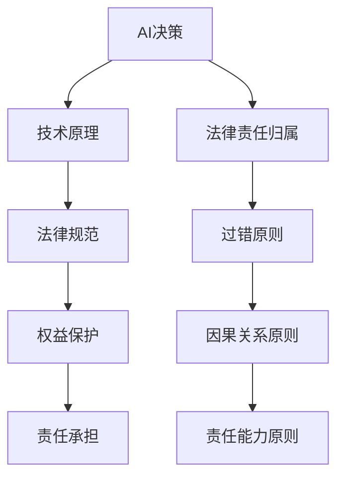

                 

## AI决策的法律责任归属问题研究

### 关键词：
- **AI决策**、**法律责任**、**责任归属**、**侵权责任**、**合同法**、**刑法**

### 摘要：

随着人工智能技术的迅猛发展，AI决策逐渐渗透到社会生活的各个方面，从医疗诊断、金融风险评估到自动驾驶等。然而，AI决策在带来巨大便利的同时，也引发了诸多法律问题，尤其是法律责任归属问题。本文旨在探讨AI决策的法律责任归属问题，从核心概念、理论基础、法律体系、案例分析、挑战与解决方案、立法与政策建议以及技术对策等多个方面，全面剖析这一复杂议题。通过本文的研究，希望能够为法律界、技术界和监管部门提供有益的参考，推动形成合理的法律框架，以规范AI决策行为，保障各方合法权益。

## 引言

人工智能（AI）作为现代科技的重要组成部分，正在深刻改变着人类社会的生活方式和工作模式。从早期的规则系统到现代的深度学习算法，AI技术取得了飞速进展。AI决策作为AI技术的核心应用之一，已经在多个领域展现出强大的潜力。例如，在医疗领域，AI可以辅助医生进行疾病诊断和治疗方案推荐；在金融领域，AI能够帮助金融机构进行风险评估和欺诈检测；在交通领域，自动驾驶技术的应用有望大幅降低交通事故率。

然而，AI决策的广泛应用也带来了诸多挑战，特别是在法律责任归属方面。AI决策系统在执行任务时，可能会出现错误、失误，甚至导致人身伤害或财产损失。在这种背景下，如何确定AI决策的法律责任归属，成为法律界、技术界和社会公众共同关注的问题。

本文旨在探讨AI决策的法律责任归属问题，通过对核心概念、理论基础、法律体系、案例分析、挑战与解决方案、立法与政策建议以及技术对策的深入分析，力求为这一问题提供系统的理论和实践参考。具体来说，本文将包括以下内容：

1. **核心概念与联系**：介绍AI决策和法律责任归属的基本概念，阐述它们之间的内在联系。
2. **理论基础**：探讨AI决策原理、法律原则与责任分配理论。
3. **法律体系中的AI决策**：分析AI决策在侵权责任、合同法和刑法中的法律问题。
4. **案例分析**：分析国内外关于AI决策法律责任的典型案例。
5. **法律挑战与解决方案**：探讨AI决策过程中面临的隐私保护、数据责任和透明性问题，并提出解决方案。
6. **立法与政策建议**：分析当前立法现状，提出政策建议。
7. **技术对策与风险管理**：讨论如何通过技术手段实现法律合规性设计和风险管理。
8. **总结与展望**：总结本文的主要观点，展望未来发展趋势。

通过本文的研究，希望能够为法律界、技术界和监管部门提供有益的参考，推动形成合理的法律框架，以规范AI决策行为，保障各方合法权益。

## 核心概念与联系

为了深入探讨AI决策的法律责任归属问题，我们首先需要明确几个关键概念：AI决策、法律责任归属，以及它们之间的相互关系。

### AI决策

AI决策是指利用人工智能技术，通过对数据的分析和处理，自主做出决策的过程。AI决策的核心在于机器学习（Machine Learning，ML）和深度学习（Deep Learning，DL）算法，这些算法能够从大量数据中提取特征，进行模式识别和预测。与人类决策相比，AI决策具有以下特点：

1. **高效性**：AI决策能够在短时间内处理大量数据，进行复杂的计算和分析，远远超过人类处理数据的速度。
2. **准确性**：通过不断学习和优化算法，AI决策可以逐步提高决策的准确性，减少错误率。
3. **自主性**：AI决策系统能够独立运行，不需要人工干预，从而实现自动化决策。

AI决策的应用范围广泛，包括但不限于医疗诊断、金融风险评估、自动驾驶、智能家居等。在这些应用场景中，AI决策不仅提高了工作效率，还带来了许多潜在的风险和法律责任问题。

### 法律责任归属

法律责任归属是指确定在特定事件中，责任应当由哪些主体承担的法律规则。在传统法律体系中，法律责任归属通常基于过错原则、因果关系原则和责任能力原则。然而，随着AI技术的发展，AI决策的法律责任归属问题变得尤为复杂。以下是几个关键点：

1. **过错原则**：传统法律体系中，过错是确定责任的重要依据。但在AI决策中，由于AI系统的自主性和复杂性，很难判断是否存在过错。
2. **因果关系原则**：因果关系是确定责任的重要依据之一。AI决策中的因果关系往往涉及多个变量和不确定性因素，使得因果关系判定变得更加复杂。
3. **责任能力原则**：在传统法律体系中，责任能力是决定责任承担的重要条件。对于AI决策系统，责任能力的问题更加突出，因为它们没有法律主体的资格。

### 核心概念之间的联系

AI决策和法律责任归属之间的联系主要体现在以下几个方面：

1. **技术原理与法律规范**：AI决策的技术原理决定了其在法律框架下的应用方式和潜在风险。例如，AI决策系统的算法复杂性和数据依赖性，直接影响其决策的准确性和可靠性，进而影响法律责任归属的判断。
2. **行为与责任**：AI决策系统的行为本质上是一种技术行为，但这种行为可能会对现实世界产生实际影响，从而引发法律责任。例如，自动驾驶车辆发生交通事故，就需要判断是由车辆制造商、软件供应商还是用户承担责任。
3. **权益保护与责任承担**：AI决策的广泛应用涉及到多个主体的权益，包括用户、开发者、供应商等。如何平衡这些权益，确保各方承担责任，是法律责任归属问题的关键。

为了更好地理解这些核心概念之间的关系，我们可以使用Mermaid流程图来展示：



通过这个流程图，我们可以清晰地看到AI决策、法律责任归属以及相关法律原则之间的逻辑关系。在接下来的章节中，我们将进一步探讨AI决策原理、法律原则与责任分配理论，以期为解决AI决策的法律责任归属问题提供理论基础。

## AI决策原理

### 机器学习和深度学习

AI决策的核心在于机器学习（Machine Learning，ML）和深度学习（Deep Learning，DL）算法。这些算法能够使计算机从数据中学习，进行复杂的模式识别和预测，从而实现自主决策。

#### 机器学习（ML）

机器学习是一种通过算法使计算机从数据中学习，做出预测或决策的技术。ML的基本原理是利用已有的数据集，通过训练算法模型，使模型能够识别数据中的规律和模式。机器学习的主要类型包括：

1. **监督学习（Supervised Learning）**：监督学习通过输入和输出对模型进行训练，使模型能够预测新的输入数据。常见的监督学习算法有线性回归、逻辑回归和支持向量机（SVM）等。
2. **无监督学习（Unsupervised Learning）**：无监督学习不依赖于已标记的数据集，通过分析数据自身的特征和结构，发现数据中的模式和规律。常见的无监督学习算法有聚类（Clustering）和主成分分析（PCA）等。
3. **半监督学习（Semi-Supervised Learning）**：半监督学习结合了监督学习和无监督学习的特点，使用部分标记数据和大量未标记数据来训练模型。

#### 深度学习（DL）

深度学习是机器学习的一种特殊形式，通过多层神经网络（Neural Networks）模拟人脑的神经元结构，对大量数据进行分析和分类。深度学习的关键在于“深度”，即网络的层数较多，能够捕捉更复杂的数据特征。

1. **卷积神经网络（Convolutional Neural Networks，CNN）**：CNN是一种用于图像识别和处理的深度学习模型，通过卷积层、池化层和全连接层等结构，实现对图像的逐层特征提取和分类。
2. **循环神经网络（Recurrent Neural Networks，RNN）**：RNN是一种用于序列数据处理（如自然语言处理）的神经网络模型，通过循环结构处理序列数据中的前后依赖关系。
3. **生成对抗网络（Generative Adversarial Networks，GAN）**：GAN是一种由生成器和判别器组成的对抗性模型，通过不断博弈，生成逼真的数据样本。

#### 伪代码示例

以下是一个简单的线性回归模型的伪代码示例，用于预测房屋价格：

```python
# 线性回归模型伪代码

# 初始化模型参数
theta = [0, 0]

# 训练模型
for i in range(iterations):
    # 计算损失函数
    loss = 0
    for (x, y) in training_data:
        prediction = theta[0] * x + theta[1]
        loss += (prediction - y) ** 2
    
    # 更新模型参数
    theta[0] -= learning_rate * (2 * x * loss)
    theta[1] -= learning_rate * (2 * y * loss)

# 预测房屋价格
def predict_price(x):
    return theta[0] * x + theta[1]

# 测试预测
test_price = predict_price(test_x)
```

通过这个伪代码示例，我们可以看到线性回归模型的训练和预测过程。在实际应用中，模型可能会更加复杂，涉及多种算法和技术。

#### 数学模型和公式

在机器学习和深度学习中，常用的数学模型和公式包括：

1. **损失函数**：用于评估模型预测的误差，常见的损失函数有均方误差（MSE）和交叉熵（Cross Entropy）。
2. **梯度下降**：用于优化模型参数，梯度下降算法的核心思想是沿着损失函数的梯度方向更新参数。
3. **反向传播**：用于多层神经网络的训练，通过计算输出层的误差，反向传播误差到输入层，更新各层的参数。

以下是一个简化的反向传播算法的数学公式：

$$\Delta{z}_{l} = \frac{\partial{L}}{\partial{z}_{l}}$$

$$\Delta{w}_{l} = \Delta{z}_{l} \cdot a_{l-1}$$

$$w_{l} = w_{l} - \alpha \cdot \Delta{w}_{l}$$

其中，$L$表示损失函数，$z_l$表示第$l$层的输出，$w_l$表示第$l$层的权重，$a_{l-1}$表示前一层激活值，$\alpha$表示学习率。

通过这些数学模型和公式，我们可以更好地理解和应用机器学习和深度学习算法。

### 应用场景

AI决策的应用场景广泛，包括但不限于以下领域：

1. **医疗诊断**：利用AI技术，辅助医生进行疾病诊断，如癌症筛查、遗传病预测等。
2. **金融风险评估**：通过分析历史数据，预测金融市场的走势，帮助金融机构进行投资决策和风险控制。
3. **自动驾驶**：利用深度学习技术，实现车辆的自主驾驶，提高行车安全性和效率。
4. **智能客服**：利用自然语言处理技术，实现智能客服系统，提供24/7的客户服务。
5. **智能家居**：利用AI技术，实现家电的智能化管理，提高家居生活的舒适度和便利性。

### 举例说明

假设一个自动驾驶系统在行驶过程中，由于算法错误导致车辆偏离车道，引发交通事故。在这种情况下，我们需要判断责任归属：

1. **AI决策错误**：由于自动驾驶系统的算法存在缺陷，导致其做出错误决策。
2. **数据不准确**：自动驾驶系统依赖的数据存在误差，导致决策错误。
3. **开发者责任**：自动驾驶系统的开发者未能充分测试和优化算法，导致系统存在缺陷。

在这种情况下，责任归属可能涉及多个主体，包括自动驾驶系统制造商、数据提供方和开发者。如何合理划分责任，需要结合具体情况进行判断。

通过上述分析，我们可以看到，AI决策涉及到多个技术原理和应用场景，其法律责任的归属问题复杂且多样。在接下来的章节中，我们将进一步探讨法律原则和责任分配理论，为解决AI决策的法律责任归属问题提供理论基础。

## 法律原则与责任分配理论

在探讨AI决策的法律责任归属问题时，理解法律原则和责任分配理论至关重要。传统法律体系中的过错原则、因果关系原则和责任能力原则为判断责任提供了基础。然而，随着AI技术的发展，这些原则在应用过程中面临着新的挑战。

### 过错原则

过错原则是指责任承担者必须对其行为产生的后果负责，这一原则在传统法律体系中占据核心地位。在AI决策的背景下，过错原则的应用变得复杂。由于AI系统具有自主性，其决策过程并不是直接由人类控制的，因此判断是否存在过错变得困难。以下是一些具体的挑战：

1. **算法缺陷**：AI系统可能因为算法缺陷而导致错误决策，但这并不一定意味着开发者存在主观过错。如何界定算法缺陷和开发者主观过错之间的界限，成为法律界关注的焦点。
2. **数据依赖**：AI决策高度依赖数据，如果数据存在偏差或错误，AI系统可能会做出错误决策。在这种情况下，判断开发者是否对数据质量负有责任，需要综合考虑多种因素。

### 因果关系原则

因果关系原则是指责任承担者必须对其行为直接导致的后果负责。在AI决策中，因果关系原则的适用同样面临挑战。以下是一些具体问题：

1. **多因素影响**：AI决策通常涉及多个变量，每个变量都可能对决策结果产生影响。在这种复杂环境下，确定特定因素与结果之间的因果关系变得复杂。
2. **间接影响**：AI决策的结果可能通过多个环节间接影响现实世界，例如，自动驾驶系统的错误决策可能导致交通事故，但具体原因可能涉及多个因素，包括传感器故障、算法缺陷等。

### 责任能力原则

责任能力原则是指责任承担者必须具有相应的责任能力。在传统法律体系中，通常认为自然人和法人具有责任能力。然而，对于没有法律主体资格的AI系统，如何判断其责任能力成为一大难题。以下是一些具体挑战：

1. **AI系统的自主性**：AI系统具有自主决策能力，但这种能力并不等同于法律主体资格。如何界定AI系统的责任能力，需要法律界和技术界共同探讨。
2. **责任转移**：在涉及多个主体的AI决策过程中，如何合理划分责任，确保各方承担相应责任，是一个重要问题。在这种情况下，责任能力的判断变得尤为重要。

### AI决策中的挑战与解决方案

在AI决策的法律责任归属问题上，存在多个挑战。以下是一些可能的解决方案：

1. **完善法律框架**：通过立法手段，明确AI决策的法律责任归属规则，为司法实践提供明确指导。例如，可以制定专门针对AI决策的法律条款，明确开发者、数据提供方和用户等各方的责任。
2. **技术合规性设计**：在AI系统开发过程中，注重法律合规性，确保系统的设计和运行符合相关法律法规要求。例如，通过数据质量控制、算法透明性和可解释性设计，减少法律风险。
3. **多方合作**：在涉及多个主体的AI决策过程中，通过多方合作，共同承担法律责任。例如，可以建立责任分担机制，明确各方的责任范围和责任承担方式。
4. **标准化与规范化**：制定统一的技术标准和规范，确保AI系统的设计和应用符合行业规范，减少法律风险。

通过完善法律框架、注重技术合规性设计、多方合作和标准化与规范化，可以有效地应对AI决策中的法律责任归属挑战，为AI技术的健康发展提供法律保障。

## 法律体系中的AI决策

AI决策的广泛应用不仅带来了技术进步，也引发了诸多法律问题，特别是在侵权责任、合同法和刑法等方面。以下将分别探讨AI决策在这些法律领域中的具体应用和法律问题。

### AI决策与侵权责任

侵权责任是指因行为人的侵权行为导致他人权益受损，依法应当承担的责任。AI决策在侵权责任中的法律问题主要体现在以下几个方面：

1. **产品责任**：在产品责任方面，如果AI决策系统作为产品的一部分，因缺陷导致用户权益受损，制造商和开发者可能需要承担侵权责任。例如，自动驾驶车辆的传感器或算法出现故障，导致交通事故，制造商和开发者可能需要承担责任。

2. **侵权行为**：AI决策系统可能在运行过程中侵犯他人权益，例如，通过不当的监控或数据收集行为侵犯隐私权。在这种情况下，侵权责任法可能适用，开发者或运营者可能需要承担责任。

3. **责任认定**：在AI决策导致侵权的情况下，如何认定责任主体和责任范围是一个复杂的问题。传统法律体系中的过错原则、因果关系原则等原则在AI决策中的适用性受到挑战，需要新的法律规则和判例来指导。

### AI决策与合同法

合同法是规范合同关系的基本法律，AI决策在合同法中的法律问题主要包括以下几个方面：

1. **合同的签订和履行**：AI决策系统可以作为合同一方主体参与合同签订和履行。例如，金融交易中的自动撮合系统，通过AI算法自动匹配买方和卖方，实现交易。在这种情况下，需要明确AI决策系统的法律地位和合同责任。

2. **智能合约**：智能合约是一种基于区块链技术的自动化合同执行机制，利用AI算法实现合同的自动履行。智能合约在执行过程中可能涉及法律问题，例如合同条款的合法性、智能合约的透明性和可解释性等。

3. **责任分配**：在涉及AI决策的合同关系中，如何合理划分合同责任也是一个重要问题。例如，如果AI决策系统在合同履行过程中出现错误，导致合同无法履行或损失产生，合同各方如何分担责任需要明确。

### AI决策与刑法

刑法是规范犯罪行为的基本法律，AI决策在刑法中的法律问题主要包括以下几个方面：

1. **犯罪行为**：AI决策系统可能因程序错误或设计缺陷导致犯罪行为。例如，自动驾驶车辆可能因算法错误发生交通事故，构成交通肇事罪。在这种情况下，需要判断AI决策系统本身是否具有犯罪主体资格，或者是否应由开发者或运营者承担责任。

2. **责任能力**：对于没有法律主体资格的AI决策系统，如何判断其责任能力是一个复杂的问题。刑法中的责任能力原则通常适用于自然人和法人，但AI系统不具备这种能力。在这种情况下，需要通过法律规则和判例来明确责任承担主体。

3. **监管与规制**：为了防止AI决策系统被用于犯罪目的，需要建立健全的监管和规制机制。例如，通过立法明确AI决策系统的法律责任，加强对AI技术的监管，防止滥用和技术风险。

### 综述

AI决策在侵权责任、合同法和刑法等领域引发了诸多法律问题。侵权责任方面，需要明确AI决策系统的产品责任和侵权行为责任；合同法方面，需要规范智能合约的应用和责任分配；刑法方面，需要判断AI决策系统的犯罪行为和责任能力。为了应对这些挑战，需要完善相关法律法规，制定明确的法律规则，并通过司法实践不断丰富和发展法律理论。

## 案例分析

为了更深入地理解AI决策的法律责任归属问题，本节将分析几个具有代表性的案例，包括国际案例和国内案例。通过这些案例分析，我们将探讨在实际法律环境中，AI决策责任归属的判断过程及其法律适用。

### 国际案例分析

#### 案例一：特斯拉自动驾驶致死案

2018年，一名特斯拉Model S车主在自动驾驶模式下行驶时发生交通事故，导致一名行人死亡。这一事件引起了全球的关注，成为AI决策法律责任归属的典型案例。

**案情概述**：
- 特斯拉的自动驾驶系统在事故发生时处于“自动驾驶”模式，车辆未能及时刹车。
- 调查结果显示，事故发生时，特斯拉的自动驾驶系统未能正确识别行人。

**法律分析**：
- 在这起案件中，特斯拉和车主都需要承担责任。特斯拉作为自动驾驶系统的开发者，需要对系统的安全性和性能负责；车主作为用户，需要遵守操作规程，确保在自动驾驶模式下正确使用系统。
- 美国一些州已经开始对自动驾驶车辆进行立法，明确自动驾驶车辆的责任分配。例如，加利福尼亚州规定，在自动驾驶模式下，车辆制造商和车主共同承担法律责任。
- 最终，特斯拉面临了巨额赔偿和多项法律诉讼。这一案例表明，在AI决策法律责任归属问题上，需要综合考虑技术缺陷、用户行为和法律规定。

#### 案例二：谷歌自动驾驶测试车事故案

2018年，谷歌的自动驾驶测试车在美国加州发生交通事故，导致一名行人死亡。这是自动驾驶技术发展过程中发生的首起致命事故，引发了广泛的争议和法律讨论。

**案情概述**：
- 在事故发生时，谷歌的自动驾驶测试车与一辆低速行驶的货车发生碰撞，导致行人死亡。
- 调查结果显示，谷歌的自动驾驶系统未能及时识别和反应。

**法律分析**：
- 在这起案件中，谷歌作为自动驾驶系统的开发者，需要对系统的安全性负责。美国加州当局对谷歌进行了调查，并提出了多项违规指控，包括未能确保自动驾驶系统的安全性。
- 加州法律规定，自动驾驶车辆在测试阶段必须有人类驾驶员在车内监控，但在实际操作中，谷歌未能严格遵守这一规定。
- 最终，谷歌面临了罚款和其他法律后果，这一案例强调了自动驾驶系统在测试和应用阶段的法律责任问题。

### 国内案例分析

#### 案例一：百度AI驾驶测试案

2019年，百度自动驾驶测试车在中国北京发生交通事故，导致一名行人受伤。这一事件引发了国内对AI决策法律责任归属的讨论。

**案情概述**：
- 百度自动驾驶测试车在测试过程中与一辆电动自行车发生碰撞，导致行人受伤。
- 调查结果显示，自动驾驶系统未能及时识别和避开障碍物。

**法律分析**：
- 在这起案件中，百度作为自动驾驶系统的开发者，需要对系统的安全性和性能负责。同时，行人也需要对自身行为负责。
- 中国的自动驾驶相关法律法规相对较少，因此在责任认定上存在一定难度。一些专家建议，应通过立法明确自动驾驶车辆的责任归属，以规范行业发展。
- 最终，百度接受了相关处罚，并进行了公开道歉。这一案例表明，在自动驾驶技术发展过程中，法律框架的完善至关重要。

#### 案例二：蚂蚁金服智能投顾纠纷案

2020年，蚂蚁金服的智能投顾产品因投资建议导致投资者损失，引发了法律纠纷。

**案情概述**：
- 蚂蚁金服的智能投顾产品根据用户风险偏好和财务状况，为投资者提供投资建议。
- 一些投资者根据智能投顾的建议进行投资，结果出现了亏损。

**法律分析**：
- 在这起案件中，投资者和蚂蚁金服之间产生了纠纷。投资者认为智能投顾的建议存在缺陷，蚂蚁金服则认为其提供了合理的投资建议。
- 合同法和相关金融法规适用于这起纠纷。根据合同法，智能投顾作为服务提供方，需要对提供的投资建议负责。然而，智能投顾的决策过程高度依赖算法和数据分析，如何判断建议的合理性和有效性成为关键。
- 最终，法院根据合同法和相关司法解释，明确了投资者和智能投顾产品之间的责任划分。这一案例表明，在智能投顾等金融科技应用中，法律框架的完善和司法实践的积累至关重要。

### 综述

通过上述案例分析，我们可以看到，AI决策在不同法律领域中的法律责任归属问题复杂多样。在国际案例中，自动驾驶车辆事故引发了广泛的争议和法律讨论；在国内案例中，智能投顾等金融科技应用也引发了法律纠纷。这些案例表明，在AI决策的法律责任归属问题上，需要综合考虑技术发展、法律规定和司法实践。通过完善法律法规和加强司法实践，可以为AI技术的健康发展提供法律保障。

### 法律挑战与解决方案

随着人工智能技术的迅猛发展，AI决策在法律层面面临着诸多挑战。这些挑战主要集中在隐私保护、数据责任和透明性等方面。为了应对这些挑战，我们需要采取一系列解决方案，确保AI决策在法律框架内运行。

#### 隐私保护

隐私保护是AI决策中最为重要的挑战之一。AI决策通常依赖于大量个人数据，这些数据包括个人身份信息、行为习惯、健康状况等。如果这些数据遭到泄露或滥用，将严重侵犯个人隐私权。

**挑战**：
1. **数据收集与处理**：AI决策系统在收集和处理数据时，可能未能充分保护个人隐私。例如，数据泄露事件频发，导致用户隐私泄露。
2. **数据共享与传输**：在AI决策过程中，数据需要在不同的系统和服务之间传输和共享，增加了数据泄露的风险。

**解决方案**：
1. **数据加密**：采用先进的加密技术，确保数据在传输和存储过程中得到加密保护。
2. **隐私保护算法**：开发和应用隐私保护算法，如差分隐私（Differential Privacy），在数据分析过程中保护个人隐私。
3. **合规性审查**：建立严格的数据合规性审查机制，确保AI决策系统在数据收集、处理和传输过程中遵守相关法律法规。

#### 数据责任

数据责任是指AI决策系统在数据依赖过程中可能产生的法律责任问题。由于AI决策系统高度依赖数据，数据的质量和来源直接影响到决策的准确性和可靠性。

**挑战**：
1. **数据质量**：如果数据存在错误、不完整或过时，可能导致AI决策错误，进而引发法律责任。
2. **数据来源**：数据来源不明确或不可靠，可能导致数据责任归属不清。

**解决方案**：
1. **数据质量管理**：建立数据质量管理机制，确保数据的质量和准确性。例如，通过数据清洗和数据校验技术，提高数据的可靠性。
2. **透明性设计**：提高数据来源的透明性，确保数据来源的可追溯性。例如，在AI决策系统中引入透明性设计，使决策过程透明化，便于责任认定。
3. **责任分担**：在涉及多个主体的AI决策过程中，通过责任分担机制明确各方的责任范围。例如，建立责任分担协议，明确数据提供方、数据使用者和其他相关方的责任。

#### 透明性与可解释性

AI决策系统的透明性和可解释性是法律界关注的另一个重要问题。由于AI决策过程高度复杂，普通用户往往难以理解其决策逻辑和结果，这可能导致法律责任的归属和认定困难。

**挑战**：
1. **决策过程不透明**：AI决策系统内部的决策过程和算法逻辑通常复杂且不透明，普通用户难以理解。
2. **责任认定困难**：在AI决策导致损失时，责任认定过程因缺乏透明性而变得更加复杂。

**解决方案**：
1. **可解释性设计**：在AI决策系统中引入可解释性设计，使决策过程和算法逻辑透明化。例如，通过可视化技术和解释性算法，使决策过程易于理解和解释。
2. **透明性报告**：建立透明性报告机制，定期对AI决策系统的运行情况进行分析和报告，确保决策过程的透明性。
3. **法律合规性审查**：加强对AI决策系统的法律合规性审查，确保其在运行过程中符合相关法律法规要求。

通过上述解决方案，我们可以有效应对AI决策在法律层面面临的挑战，确保AI技术在法律框架内健康发展。在未来的发展中，需要持续关注和解决这些挑战，为AI技术的广泛应用提供坚实的法律基础。

### 立法与政策建议

为了有效应对AI决策带来的法律责任归属问题，立法和政策建议显得尤为重要。以下将从全球和中国两个角度，分析当前的立法现状，并提出相应的政策建议。

#### 全球立法现状

在国际上，许多国家和地区已经开始关注AI决策的法律责任问题，并制定了相应的法律法规或政策指导。

1. **欧盟**：欧盟在2018年通过了《通用数据保护条例》（GDPR），明确了数据隐私保护的原则和责任。此外，欧盟委员会还发布了《人工智能白皮书》，提出了关于AI决策的伦理和法律框架，强调确保AI系统的透明性、可靠性和公平性。

2. **美国**：美国各州和联邦政府都在积极制定相关法律，以规范AI决策的应用。例如，加利福尼亚州通过了《自动驾驶车辆法案》，明确了自动驾驶车辆的责任归属和合规要求。联邦层面，美国交通部发布了《自动驾驶车辆政策指南》，为自动驾驶技术的发展提供了政策框架。

3. **中国**：中国也在积极推进AI决策的法律监管。2021年，中国发布了《智能社会治理》白皮书，提出了关于智能社会治理的基本原则和方向。同时，中国科技部等部门发布了《新一代人工智能发展规划》，明确了人工智能发展的战略目标和路径。

#### 政策建议

基于全球立法现状，以下提出一些政策建议：

1. **建立统一的法律框架**：建议制定一部涵盖AI决策所有应用领域的统一法律框架，明确AI决策的法律责任归属规则。这一法律框架应包括侵权责任、合同法、刑法等方面的具体规定，确保各方在AI决策中的责任清晰。

2. **加强数据隐私保护**：数据隐私保护是AI决策中的重要问题。建议加强数据隐私保护立法，明确数据收集、处理和使用的规范，建立数据泄露事件的应急响应机制。

3. **促进透明性和可解释性**：为了提高AI决策的透明性和可解释性，建议制定相关标准和规范，确保AI系统的设计和运行符合透明性要求。同时，建立透明性报告机制，定期对AI决策系统的运行情况进行公开和评估。

4. **加强行业监管**：建议加强对AI决策行业的监管，确保AI系统的合规性。通过建立独立的监管机构，加强对AI技术的审查和监督，确保其符合法律法规要求。

5. **推动国际合作**：在全球范围内，加强国际合作，共同制定AI决策的国际法律标准和规则。通过国际合作，推动全球范围内的AI决策法律监管体系的建立，确保AI技术的健康发展。

#### 中国立法现状与建议

在中国，虽然已经在AI决策方面进行了初步的立法尝试，但仍需要进一步完善。

1. **立法现状**：中国已经出台了一些关于AI决策的法规和政策，如《新一代人工智能发展规划》和《智能社会治理》白皮书。但这些法规和政策主要侧重于发展战略和政策引导，缺乏具体的法律条款和实施细则。

2. **立法建议**：
   - **完善法律法规**：建议在《中华人民共和国侵权责任法》、《中华人民共和国合同法》和《中华人民共和国刑法》等现有法律的基础上，增加关于AI决策的专门条款，明确AI决策的法律责任归属。
   - **建立数据隐私保护法**：建议制定《数据隐私保护法》，明确数据收集、处理和使用的规范，保护个人隐私。
   - **推动行业标准**：建议推动相关行业制定AI决策的技术标准和规范，确保AI系统的设计和运行符合法律法规要求。
   - **加强监管**：建议加强AI决策的监管，通过立法明确监管机构的职责和权限，加强对AI决策系统的审查和监督。

通过完善法律法规、加强数据隐私保护、促进透明性和可解释性、加强行业监管以及推动国际合作，我们可以为AI决策的法律责任归属问题提供有效的解决方案，确保AI技术的健康发展。

### 技术对策与风险管理

在AI决策的法律责任归属问题中，技术对策与风险管理起着至关重要的作用。通过合理的技术设计和有效的风险管理策略，可以在一定程度上降低法律风险，确保AI决策系统的合规性和可靠性。以下将详细探讨如何通过技术手段实现法律合规性设计，以及如何在AI决策中实施有效的风险管理策略。

#### 技术合规性设计

1. **透明性设计**：为了提高AI决策系统的透明性，可以在系统设计中引入可解释性算法和可视化工具，使得决策过程和算法逻辑易于理解和解释。例如，可以使用LIME（Local Interpretable Model-agnostic Explanations）等技术，为每个决策提供详细的解释。

2. **数据加密与隐私保护**：在数据收集、处理和传输过程中，采用先进的加密技术，如区块链、零知识证明等，确保数据的安全性和隐私性。此外，可以应用差分隐私（Differential Privacy）算法，在数据分析过程中保护个人隐私。

3. **数据质量管理**：建立严格的数据质量管理机制，通过数据清洗、数据校验等技术手段，确保数据的质量和准确性。同时，记录数据来源和数据处理流程，以提高数据透明性和可追溯性。

4. **伦理框架集成**：在AI决策系统中集成伦理框架，确保决策过程符合道德和伦理要求。例如，通过设置伦理约束条件，避免AI决策系统做出可能引发道德争议的行为。

#### 风险管理策略

1. **风险评估与控制**：在AI决策系统的开发和应用过程中，进行全面的风险评估，识别潜在的法律风险和操作风险。通过风险矩阵和风险控制策略，制定具体的风险控制措施，确保AI决策系统在法律框架内运行。

2. **持续监控与审计**：建立持续的监控和审计机制，对AI决策系统的运行情况进行实时监控和定期审计。通过日志记录和异常检测技术，及时发现和处理异常情况，降低法律风险。

3. **合规性审查与报告**：定期进行合规性审查，确保AI决策系统符合相关法律法规要求。建立报告机制，及时向监管部门报告AI决策系统的运行情况和合规性状况。

4. **应急预案与应急响应**：制定应急预案，应对可能出现的法律风险和操作风险。在出现法律纠纷或事故时，迅速启动应急响应机制，采取有效的应对措施，降低损失。

#### 案例研究

以下通过一个案例，探讨如何通过技术对策和风险管理策略应对AI决策中的法律风险。

**案例背景**：某金融科技公司开发了一款智能投顾系统，用于根据用户的风险偏好和财务状况提供投资建议。

**合规性设计**：
1. **透明性设计**：系统集成了LIME技术，为每个投资建议提供详细的解释，使客户能够理解投资决策的依据。
2. **数据加密与隐私保护**：采用区块链技术对用户数据进行加密存储，确保数据的安全性和隐私性。
3. **数据质量管理**：通过数据清洗和校验技术，确保数据的准确性和完整性。

**风险管理策略**：
1. **风险评估与控制**：在系统开发过程中，进行风险评估，识别潜在的法律风险，如投资建议的合规性、数据隐私保护等。制定相应的风险控制措施，如设置风险阈值、进行实时监控等。
2. **持续监控与审计**：建立持续的监控和审计机制，对系统运行情况进行实时监控和定期审计。通过日志记录和异常检测技术，及时发现和处理异常情况。
3. **合规性审查与报告**：定期进行合规性审查，确保系统符合相关法律法规要求。向监管部门报告系统的运行情况和合规性状况。
4. **应急预案与应急响应**：制定应急预案，如出现法律纠纷或数据泄露事件，迅速启动应急响应机制，采取有效的应对措施，降低损失。

通过上述技术对策和风险管理策略，该智能投顾系统在法律合规性和风险管理方面取得了显著成效，为其他金融科技企业提供了一定的借鉴意义。

### 总结与展望

在本文中，我们全面探讨了AI决策的法律责任归属问题，从核心概念、理论基础、法律体系、案例分析、挑战与解决方案、立法与政策建议以及技术对策等多个方面进行了深入分析。通过这些探讨，我们得出以下主要观点：

1. **AI决策的法律责任归属问题复杂且重要**：随着AI技术的广泛应用，AI决策在带来巨大便利的同时，也引发了诸多法律问题，特别是法律责任归属问题。如何合理确定AI决策的法律责任归属，成为法律界、技术界和社会公众共同关注的重要议题。

2. **传统法律原则在AI决策中的适用性面临挑战**：在AI决策的法律责任归属问题上，传统的过错原则、因果关系原则和责任能力原则在应用过程中面临新的挑战。AI决策的自主性、复杂性和数据依赖性，使得这些原则的适用变得更加复杂。

3. **需要完善法律法规和政策框架**：为了有效应对AI决策的法律责任归属问题，我们需要通过立法和政策手段，建立完善的法律法规和政策框架。这包括制定涵盖AI决策所有应用领域的统一法律框架，明确侵权责任、合同法和刑法等方面的具体规定。

4. **技术对策与风险管理策略至关重要**：通过技术手段实现法律合规性设计和风险管理策略，可以在一定程度上降低AI决策的法律风险。这包括透明性设计、数据加密与隐私保护、数据质量管理、伦理框架集成等。

5. **多方合作与全球协作至关重要**：在AI决策的法律责任归属问题上，需要政府、企业、学术界和社会各界的多方合作，共同推动法律框架的建立和完善。同时，全球协作也至关重要，通过国际合作，共同制定AI决策的国际法律标准和规则，确保全球范围内的AI技术健康发展。

未来，AI决策的法律责任归属问题将继续是法律和科技领域的重要研究课题。随着AI技术的不断进步，相关法律问题和挑战也将不断出现。我们需要持续关注和解决这些问题，为AI技术的健康发展提供坚实的法律保障。同时，通过多方合作和全球协作，推动全球范围内的AI决策法律框架的建立和完善，为人类社会的可持续发展做出贡献。

### 拓展阅读

为了更全面地了解AI决策的法律责任归属问题，以下推荐几本相关领域的经典书籍，供进一步学习和研究：

1. **《人工智能伦理与法律》（AI Ethics & Law）** - 由知名学者尼克·博斯特罗姆（Nick Bostrom）所著，本书深入探讨了人工智能伦理和法律问题，包括责任归属、隐私保护和算法歧视等。

2. **《人工智能的未来》（The Future of Humanity: Terraforming Mars, Interstellar Travel, Immortality, and Our Destiny Beyond Earth）** - 由知名物理学家雷·库兹韦尔（Ray Kurzweil）所著，本书详细介绍了人工智能技术的发展趋势及其对社会和法律的影响。

3. **《算法的伦理学》（The Ethics of Algorithms）** - 由计算机科学家以及伦理学家克里斯·阿内特（Chris Anthes）所著，本书探讨了算法如何影响社会公平、隐私保护和责任归属等伦理问题。

4. **《深度学习伦理》（Deep Learning Ethics）** - 由计算机科学家及AI伦理学者迈克尔·J·图斯利（Michael J. Tsur）所著，本书探讨了深度学习技术的伦理问题，包括透明性、可解释性和责任归属等。

5. **《智能社会的法律挑战》（Legal Challenges of the Smart Society）** - 由国际人工智能与法律协会（AAAI）组织编写，本书汇集了多篇关于AI决策法律问题的研究论文，涵盖了侵权责任、隐私保护和刑法等多个方面。

通过阅读这些书籍，可以更深入地理解AI决策的法律责任归属问题，为相关研究和实践提供有益的参考。

