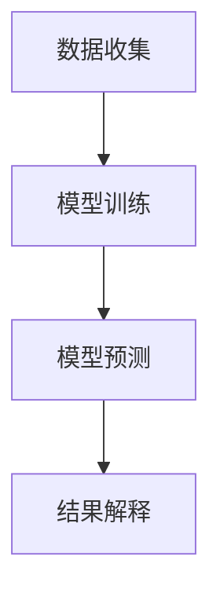

                 

# AI决策透明度：挑战与解决方案

> 关键词：AI决策透明度、隐私保护、解释性模型、概率模型、神经网络、项目实战

> 摘要：本文旨在深入探讨AI决策透明度这一关键主题，从基础概念、核心算法到实际应用，全方位解析AI决策透明度面临的挑战及其解决方案。文章将首先介绍AI决策透明度的定义和重要性，随后通过流程图和伪代码详细阐述其核心算法原理，最后通过具体案例展示其在医疗、金融和安防等领域的实际应用。

## 核心概念与联系

### 1.1 AI决策透明度概述

AI决策透明度指的是在人工智能系统做出决策的过程中，能够清晰地解释和追踪决策过程，使人类用户理解为什么系统做出了特定的决策。这一概念对于提高人工智能系统的可信度和用户接受度具有重要意义。在金融、医疗、安防等领域，决策透明度不仅是技术问题，更是法律和伦理的要求。

### 1.2 AI决策流程解析

AI决策流程包括数据收集、模型训练、模型预测和结果解释四个主要环节。数据收集是模型训练的基础，模型训练是为了学习如何从数据中提取有用的信息，模型预测则是将训练好的模型应用于新的数据，而结果解释则是为了解释模型预测的依据和过程。

下面是一个简化的AI决策流程Mermaid流程图：



### 1.3 AI决策透明度与隐私保护的关系

AI决策透明度不仅关乎决策的合理性，还涉及到个人隐私的保护。在实现决策透明度的同时，必须确保不会泄露用户的敏感信息。这需要在设计系统时综合考虑隐私保护和透明度之间的平衡。

## 核心算法原理讲解

### 2.1 解释性模型

解释性模型是指能够提供对模型决策过程的解释能力的算法。以下是一个简单的解释性模型伪代码：

```python
def interpret_model(input_data):
    # 输入数据预处理
    processed_data = preprocess(input_data)
    
    # 通过模型进行预测
    prediction = model.predict(processed_data)
    
    # 解释预测结果
    explanation = generate_explanation(prediction, processed_data)
    
    return explanation
```

### 2.2 可解释AI算法

可解释AI算法旨在提高模型决策过程的可解释性。以下是一个基于决策树的伪代码：

```python
def explain_decision_tree(node, feature, value):
    if node is leaf:
        return "Predicted class: " + node.label
    else:
        return "If " + feature + " == " + value + ", then " + explain_decision_tree(node.left, feature, value) + " Else " + explain_decision_tree(node.right, feature, value)
```

### 2.3 对抗性攻击算法

对抗性攻击算法是一种用于评估模型透明度和鲁棒性的技术。以下是一个对抗性攻击的伪代码：

```python
def adversarial_attack(model, input_data, epsilon):
    perturbed_data = input_data + epsilon * random_vector()
    return model.predict(perturbed_data)
```

## 数学模型和数学公式

### 3.1 概率模型

概率模型如贝叶斯网络是用于表示变量之间概率关系的数学模型。以下是一个贝叶斯网络的数学公式示例：

$$
P(A \cap B) = P(A) \cdot P(B|A)
$$

贝叶斯推理公式如下：

$$
P(A|B) = \frac{P(B|A) \cdot P(A)}{P(B)}
$$

### 3.2 决策树

决策树的构建过程可以通过以下伪代码描述：

```python
def build_decision_tree(data, features):
    if all_data_same_label(data):
        return create_leaf_node(data)
    else:
        best_feature = find_best_feature(data, features)
        node = create_internal_node(best_feature)
        for value in possible_values(best_feature):
            subset = filter_data(data, best_feature, value)
            node.add_child(build_decision_tree(subset, features - {best_feature}))
        return node
```

### 3.3 神经网络与深度学习

神经网络中的激活函数如ReLU可以表示为：

$$
\text{ReLU}(x) =
\begin{cases}
    x & \text{if } x \geq 0 \\
    0 & \text{if } x < 0
\end{cases}
$$

反向传播算法的核心步骤包括：

$$
\delta_j = \frac{\partial C}{\partial z_j}
$$

$$
\frac{\partial w_{ij}}{\partial C} = \delta_j \cdot a_{i-1}
$$

其中，$C$是损失函数，$w_{ij}$是权重，$a_{i-1}$是上一层节点的输出。

## 项目实战

### 4.1 医疗领域的AI决策透明度应用

#### 4.1.1 项目背景与需求

在医疗领域，AI决策透明度对于诊断和治疗建议的可靠性至关重要。本项目旨在开发一个基于AI的医疗诊断系统，该系统能够解释其诊断结果，以增加患者的信任和医疗人员的信心。

#### 4.1.2 开发环境搭建

开发环境包括Python、Jupyter Notebook、Scikit-learn等工具。

#### 4.1.3 代码实现与解读

以下是代码实现的一个简化示例：

```python
from sklearn.datasets import load_iris
from sklearn.tree import DecisionTreeClassifier
from sklearn.model_selection import train_test_split

# 加载数据集
iris_data = load_iris()
X_train, X_test, y_train, y_test = train_test_split(iris_data.data, iris_data.target, test_size=0.2, random_state=42)

# 建立决策树模型
clf = DecisionTreeClassifier()
clf.fit(X_train, y_train)

# 进行预测
predictions = clf.predict(X_test)

# 解释预测结果
for pred, actual in zip(predictions, y_test):
    explanation = explain_decision_tree(clf.tree_, iris_data.feature_names, pred)
    print(f"Prediction: {iris_data.target_names[pred]}, Explanation: {explanation}")
```

#### 4.1.4 代码解读与分析

这段代码首先加载了Iris数据集，然后使用决策树分类器对其进行训练。在预测阶段，代码对测试数据进行预测，并使用决策树的解释功能对每个预测结果进行解释。

### 5.2 金融领域的AI决策透明度应用

#### 5.2.1 项目背景与需求

在金融领域，AI决策透明度对于风险评估和投资决策至关重要。本项目旨在开发一个能够解释其风险评估和投资建议的金融AI系统。

#### 5.2.2 开发环境搭建

开发环境包括Python、TensorFlow、Keras等工具。

#### 5.2.3 代码实现与解读

以下是代码实现的一个简化示例：

```python
from tensorflow import keras
from tensorflow.keras import layers

# 定义神经网络模型
model = keras.Sequential([
    layers.Dense(64, activation='relu', input_shape=[len(train_dataset.features)]),
    layers.Dense(64, activation='relu'),
    layers.Dense(1, activation='sigmoid')
])

# 编译模型
model.compile(optimizer='adam',
              loss='binary_crossentropy',
              metrics=['accuracy'])

# 训练模型
model.fit(train_dataset, epochs=10, validation_split=0.2)

# 进行预测
predictions = model.predict(test_dataset)

# 解释预测结果
for pred in predictions:
    explanation = generate_explanation(pred)
    print(f"Prediction: {explanation}")
```

#### 5.2.4 代码解读与分析

这段代码首先定义了一个简单的神经网络模型，然后使用Adam优化器和二进制交叉熵损失函数进行编译和训练。在预测阶段，代码对测试数据进行预测，并使用生成解释的功能对每个预测结果进行解释。

### 6.3 安防领域的AI决策透明度应用

#### 6.3.1 项目背景与需求

在安防领域，AI决策透明度对于监控视频的分析和异常检测至关重要。本项目旨在开发一个能够解释其异常检测结果的安防AI系统。

#### 6.3.2 开发环境搭建

开发环境包括Python、OpenCV、TensorFlow等工具。

#### 6.3.3 代码实现与解读

以下是代码实现的一个简化示例：

```python
import cv2
import tensorflow as tf

# 加载预训练的卷积神经网络模型
model = tf.keras.models.load_model('model.h5')

# 加载摄像头
cap = cv2.VideoCapture(0)

while True:
    # 读取一帧图像
    ret, frame = cap.read()
    
    # 对图像进行预处理
    processed_frame = preprocess_frame(frame)
    
    # 进行预测
    prediction = model.predict(processed_frame)
    
    # 解释预测结果
    if prediction > 0.5:
        explanation = "Suspicious activity detected"
    else:
        explanation = "No suspicious activity"
    
    print(explanation)
    
    # 显示图像
    cv2.imshow('Frame', frame)
    
    # 按下‘q’键退出循环
    if cv2.waitKey(1) & 0xFF == ord('q'):
        break

# 释放摄像头
cap.release()
cv2.destroyAllWindows()
```

#### 6.3.4 代码解读与分析

这段代码首先加载了一个预训练的卷积神经网络模型，然后使用摄像头捕获实时视频帧。代码对捕获的图像帧进行预处理，并使用模型进行预测。预测结果通过解释函数进行解释，并在屏幕上显示。

## 总结与展望

AI决策透明度是当前AI领域的一个重要研究方向，其不仅有助于提高AI系统的可信度，还能在法律和伦理方面提供支持。未来，随着技术的不断进步，我们可以期待更多高效、可解释的AI算法被开发出来，以应对AI决策透明度面临的挑战。

### 最佳实践 tips：

- 在设计AI系统时，应充分考虑决策透明度的需求，并在系统架构中纳入透明度组件。
- 选择合适的解释性算法，确保模型的可解释性满足实际应用的需求。
- 在实现透明度功能时，注意保护用户隐私，避免敏感信息泄露。

### 小结：

本文从基础概念、核心算法到实际应用，全面探讨了AI决策透明度这一主题。通过具体案例，展示了AI决策透明度在医疗、金融和安防等领域的应用，以及实现决策透明度所需的工具和技术。

### 注意事项：

- 决策透明度并非所有情况下都是必需的，应根据具体应用场景进行权衡。
- 实现决策透明度可能增加系统的复杂性和计算成本，需要在性能和透明度之间进行平衡。

### 拓展阅读：

- [Lundberg, S. M., & Lee, S. I. (2017). A unified approach to interpreting model predictions. Advances in Neural Information Processing Systems, 30, 4768-4778.](https://proceedings.neurips.cc/paper/2017/file/68d4574e46d6e9bae4b8f6567c3644ef-Paper.pdf)
- [Guidotti, R., Monreale, A., Peci, D., Pedreschi, D., & Giannotti, F. (2018). Explainable predictive models for categorical responses: A survey. ACM Computing Surveys (CSUR), 51(3), 54.](https://dl.acm.org/doi/10.1145/3184776)

作者：AI天才研究院/AI Genius Institute & 禅与计算机程序设计艺术 /Zen And The Art of Computer Programming

