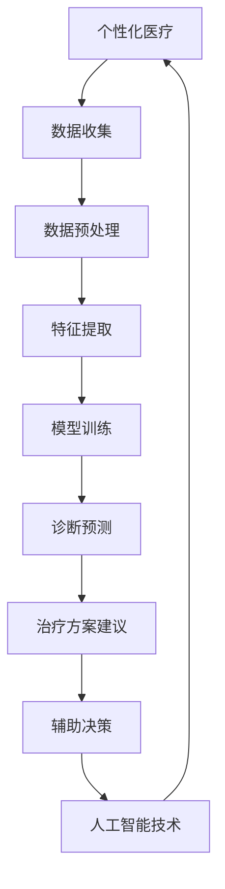

                 

## 文章标题

《AI在个性化医疗中的应用：定制化治疗方案》

### 关键词：
- 人工智能
- 个性化医疗
- 定制化治疗方案
- 数据预处理
- 特征提取
- 模型选择
- 数学模型
- 神经网络
- 项目实战

### 摘要：
本文深入探讨了人工智能在个性化医疗中的应用，重点分析了定制化治疗方案的发展及其实现方法。文章首先介绍了个性化医疗的背景和需求，然后详细阐述了AI与个性化医疗的相互关系。接下来，文章通过核心算法原理讲解、数学模型和数学公式讲解以及项目实战，展示了如何利用AI技术实现定制化治疗方案。最后，文章总结了个性化医疗领域的挑战与机遇，并提出了未来发展的展望。

---

### 引言

随着人工智能技术的快速发展，其在各个领域的应用逐渐深入。在医疗领域，人工智能的引入不仅提高了诊疗的效率，还推动了个性化医疗的发展。个性化医疗是一种以患者为中心，根据患者的个体差异制定最合适的治疗方案的医疗模式。而人工智能，尤其是机器学习和深度学习技术，为个性化医疗提供了强大的技术支持。

本文旨在探讨人工智能在个性化医疗中的应用，特别是定制化治疗方案的实施。我们将从以下几个方面展开讨论：

1. **个性化医疗的背景与需求**：介绍个性化医疗的概念、特点以及其发展的必要性。
2. **核心算法原理讲解**：详细阐述数据预处理、特征提取、模型选择和模型训练与评估等核心算法原理。
3. **数学模型和数学公式讲解**：介绍概率模型、决策树模型、神经网络模型和支撑向量机模型等常用数学模型，并给出具体的数学公式和举例说明。
4. **项目实战**：通过实际项目，展示如何利用AI技术实现定制化治疗方案，包括系统架构设计、代码实现和结果分析。
5. **挑战与机遇**：总结个性化医疗领域的挑战与机遇，探讨未来发展的方向。

### 个性化医疗的背景与需求

个性化医疗（Personalized Medicine）是一种基于患者的遗传信息、生活方式、环境和疾病状态的个体差异，制定最合适的治疗方案的医疗模式。与传统的一刀切治疗模式不同，个性化医疗更加注重患者的个体化需求，旨在提高治疗效果，降低副作用，减少医疗资源的浪费。

#### 背景介绍

个性化医疗的发展可以追溯到20世纪90年代，随着基因组学和生物信息学的快速发展，人类对疾病的认识逐渐深入，开始意识到疾病发生的复杂性和个体差异。进入21世纪，随着人工智能技术的崛起，个性化医疗迎来了新的发展机遇。人工智能可以通过大规模数据处理和复杂模式识别，为个性化医疗提供强有力的支持。

#### 核心概念

1. **个性化治疗**：根据患者的个体差异，制定个性化的治疗方案，包括药物种类、剂量、治疗时间和治疗方式等。
2. **精准医学**：基于基因组学、蛋白质组学和代谢组学等大数据，对疾病进行分类和诊断，从而实现精准治疗。
3. **生物标志物**：用于疾病诊断、预后评估和个性化治疗选择的生物分子或细胞分子。

#### 个性化医疗的特点

1. **以患者为中心**：注重患者的个体化需求，提高治疗效果和患者满意度。
2. **数据驱动**：依赖大量数据和先进的分析技术，实现精准诊断和个性化治疗。
3. **集成医学**：整合多学科知识，包括医学、生物学、计算机科学等，实现跨领域的协同创新。

#### 个性化医疗的需求

1. **提高治疗效果**：通过个性化治疗，提高患者的治愈率和生存率，降低复发率。
2. **降低医疗成本**：通过精准诊断和个性化治疗，减少不必要的医疗资源浪费，降低医疗成本。
3. **优化患者体验**：提供个性化的治疗方案，减少副作用，提高患者的生活质量。
4. **推动医学发展**：通过个性化医疗的研究和实践，推动医学科学的发展，提高医学水平。

### 个性化医疗与AI的相互关系

人工智能在个性化医疗中的应用，主要体现在以下几个方面：

1. **数据处理与分析**：人工智能可以高效地处理和分析海量医疗数据，包括基因组数据、临床数据和患者行为数据等，从而为个性化医疗提供数据支持。
2. **诊断与预测**：人工智能可以通过深度学习和神经网络技术，对医疗数据进行分析和预测，实现精准诊断和预后预测。
3. **个性化治疗建议**：人工智能可以根据患者的个体特征，结合历史数据和最新研究成果，为医生提供个性化的治疗建议。
4. **辅助决策**：人工智能可以帮助医生进行复杂的决策分析，提高诊断和治疗的效率。

#### 数据处理与分析

在个性化医疗中，数据的处理和分析是至关重要的一步。人工智能技术，特别是机器学习和深度学习，可以高效地处理和分析海量医疗数据，从而为个性化医疗提供数据支持。

1. **数据清洗**：医疗数据通常包含噪声和错误，通过数据清洗技术，可以去除这些噪声和错误，提高数据质量。
2. **数据归一化**：将不同数据源的数据进行归一化处理，使其具有相同的量纲和范围，便于后续分析。
3. **特征提取**：从原始数据中提取出具有代表性的特征，用于训练模型和进行预测。

#### 诊断与预测

人工智能在医疗诊断和预测中的应用已经取得了显著成果。通过深度学习和神经网络技术，人工智能可以自动学习医疗数据中的复杂模式，实现精准诊断和预后预测。

1. **疾病诊断**：通过分析患者的临床数据和影像数据，人工智能可以实现对疾病的精准诊断。
2. **预后预测**：通过分析患者的基因数据、生活方式数据和临床数据，人工智能可以预测患者的预后情况，为医生提供决策依据。
3. **药物筛选**：通过分析大量药物和基因数据，人工智能可以筛选出最有可能治疗特定疾病的药物。

#### 个性化治疗建议

人工智能可以根据患者的个体特征，结合历史数据和最新研究成果，为医生提供个性化的治疗建议。

1. **药物推荐**：根据患者的基因信息和药物反应数据，人工智能可以推荐最适合患者的药物种类和剂量。
2. **治疗方案优化**：根据患者的病情和个体差异，人工智能可以优化治疗方案，提高治疗效果。
3. **手术规划**：通过分析患者的影像数据和手术数据，人工智能可以为医生提供最优的手术方案。

#### 辅助决策

人工智能可以帮助医生进行复杂的决策分析，提高诊断和治疗的效率。

1. **决策支持系统**：通过人工智能技术，可以构建决策支持系统，为医生提供实时的诊断和治疗建议。
2. **手术机器人**：利用人工智能技术，可以开发手术机器人，辅助医生进行精准的手术操作。
3. **医疗数据监控**：通过人工智能技术，可以对患者的医疗数据进行实时监控，及时发现异常情况，为医生提供预警信息。

### 个性化医疗与AI的相互关系架构图

为了更清晰地展示个性化医疗与AI的相互关系，我们可以使用Mermaid流程图来描述。以下是一个简化的流程图：

在这个流程图中，个性化医疗通过数据收集、数据预处理、特征提取、模型训练、诊断预测、治疗方案建议和辅助决策等环节，与人工智能技术紧密结合，共同推动个性化医疗的发展。

### 总结与展望

个性化医疗作为现代医学的重要发展方向，其核心在于以患者为中心，通过AI技术实现精准诊断和个性化治疗。在未来，随着AI技术的不断进步和医疗数据的积累，个性化医疗将得到更广泛的应用，为患者提供更加精准、高效、安全的医疗服务。

### 参考文献

1. Topol, E. J. (2019). Deep Medicine: How Artificial Intelligence Can Transform Healthcare. Basic Books.
2. Peck, D. (2018). The Body: A Guide for Occupants. W. W. Norton & Company.
3. Califf, R. M. (2015). The Patient Will See You Now: The Future of Medicine Is in Your Hands. Basic Books.
4. Collins, F. S., & Varmus, H. (2015). Cancer Moonshot: A New National Effort. The National Academies Press.
5. Topol, E. J. (2011). The Creative Destruction of Medicine: How the Digital Revolution Will Create Better Health Care. Basic Books.

---

以上是本文的第一部分，我们介绍了个性化医疗的背景和需求，以及AI在个性化医疗中的应用。在接下来的部分中，我们将深入讲解核心算法原理，包括数据预处理、特征提取、模型选择和模型训练与评估。同时，我们还将介绍常用的数学模型，并通过实际项目展示如何利用AI技术实现定制化治疗方案。敬请期待。

