                 

# AI在个性化医疗中的应用：精准治疗的未来

## 关键词

- 人工智能
- 个性化医疗
- 精准治疗
- 机器学习
- 深度学习
- 基因组学
- 药物研发
- 医疗影像分析

## 摘要

本文探讨了人工智能（AI）在个性化医疗领域中的应用，强调了精准治疗的发展趋势。通过分析AI技术的基本原理，本文详细介绍了AI在基因组学、药物研发和医疗影像分析等领域的实际应用。同时，文章还探讨了个性化医疗面临的挑战与伦理问题，并展望了未来的发展趋势。通过逐步分析推理，本文为医疗行业提供了对AI技术深入理解的方法，并提出了最佳实践建议。

---

## 引言与概述

个性化医疗（Personalized Medicine）是一种以患者为中心，利用个体的生物学、遗传学、生活方式和环境信息，制定个性化医疗方案的新型医学模式。其核心理念是通过精确的诊断和个体化的治疗方案，提高治疗效果和患者生活质量。

### 个性化医疗的定义与历史

个性化医疗并非一个新兴概念，其实早在20世纪80年代就已经初见端倪。当时，随着基因组学和分子生物学的发展，科学家开始探索基因变异与疾病发生之间的关系。随着技术的进步，特别是高通量测序技术的发展，个性化医疗逐渐从理论走向实践。

### 个性化医疗的关键因素

个性化医疗的关键因素包括：

1. **基因组学**：通过分析个体的基因组信息，发现与疾病相关的基因变异，从而为个体制定个性化的预防、诊断和治疗策略。
2. **生物标记物**：生物标记物是反映疾病状态或治疗反应的分子或细胞标志物，有助于实现早期诊断和个体化治疗。
3. **大数据**：大规模的数据收集和分析是个性化医疗的基础，通过数据挖掘和分析，可以发现疾病与基因、环境等因素之间的复杂关系。
4. **机器学习和人工智能**：利用机器学习和人工智能技术，可以从海量数据中提取有价值的信息，为个性化医疗提供技术支持。

### 个性化医疗的挑战与机遇

个性化医疗面临着诸多挑战，包括数据隐私、数据共享、技术成本等。然而，随着人工智能技术的发展，个性化医疗也迎来了新的机遇。AI技术不仅能够提高数据处理的效率和准确性，还能帮助医生更好地理解和应用个体化信息，为精准治疗提供强有力的支持。

---

## 个性化医疗基础

### 个性化医疗的定义与历史

个性化医疗是一种以患者为中心的医学模式，旨在通过综合个体的生物学、遗传学、生活方式和环境信息，提供个性化的诊断和治疗方案。这种模式强调个体差异，认为不同患者对同一种治疗方法可能会有不同的反应，因此需要根据患者的具体情况进行个性化调整。

个性化医疗的发展历程可以分为三个阶段：

1. **第一阶段（20世纪80年代至90年代）**：这一阶段的主要特征是基因检测和药物基因组学的研究。科学家开始探索基因变异与疾病之间的关系，并尝试将这些知识应用于临床实践。

2. **第二阶段（21世纪前十年）**：随着基因组学、转录组学和代谢组学等技术的发展，个性化医疗进入了快速发展阶段。大量生物标志物被发现，为个性化诊断和治疗提供了新的可能性。

3. **第三阶段（21世纪10年代至今）**：人工智能和大数据技术的崛起，使得个性化医疗进入了智能化时代。AI技术能够从海量数据中提取有价值的信息，为个性化医疗提供更加精准的支持。

### 个性化医疗的关键因素

个性化医疗的成功依赖于以下几个关键因素：

1. **基因组学**：基因组学是个性化医疗的基础。通过分析个体的基因组信息，可以发现与疾病相关的基因变异，从而为个体制定个性化的预防、诊断和治疗策略。

2. **生物标记物**：生物标记物是反映疾病状态或治疗反应的分子或细胞标志物。在个性化医疗中，生物标记物有助于实现早期诊断和个体化治疗。

3. **大数据**：大数据是个性化医疗的关键。通过收集和分析大量的患者数据，可以发现疾病与基因、环境等因素之间的复杂关系，从而为个性化医疗提供科学依据。

4. **人工智能**：人工智能是推动个性化医疗发展的重要力量。AI技术能够从海量数据中提取有价值的信息，帮助医生更好地理解和应用个体化信息。

### 个性化医疗的现阶段进展

目前，个性化医疗在临床应用中已经取得了一些显著进展。例如，在肿瘤治疗中，AI技术被广泛应用于肿瘤的早期检测、分型和治疗方案设计。在遗传病诊断中，基因组测序和AI技术的结合，使得许多遗传病的诊断变得更加准确和快速。

此外，个性化医疗也在药物研发中发挥了重要作用。通过分析患者的基因组信息和药物治疗效果，可以筛选出最适合患者的药物，提高治疗效果。

总之，个性化医疗已经成为现代医学的重要组成部分，随着AI技术的发展，其应用前景将更加广阔。

---

## AI技术基础

人工智能（AI）是推动个性化医疗发展的关键力量。AI技术包括机器学习、深度学习、自然语言处理等，这些技术在医疗领域的应用已经取得了显著成果。

### 机器学习基础

机器学习（Machine Learning，ML）是一种让计算机通过数据学习规律、模式的方法。机器学习可以分为三种类型：监督学习、无监督学习和强化学习。

#### 监督学习

监督学习（Supervised Learning）是一种在已知输入和输出关系下，通过学习模型来预测未知输入的输出。常见的监督学习算法包括线性回归、逻辑回归、支持向量机（SVM）等。

```plaintext
// 线性回归伪代码
function linear_regression(X, y):
    # X: 输入特征矩阵，y: 标签向量
    w = initialization_weights(X)
    for i in range(number_of_iterations):
        # 前向传播
        z = X * w
        a = sigmoid(z)
        # 反向传播
        dz = a - y
        dw = X.T * dz
        w = w - learning_rate * dw
    return w
```

#### 无监督学习

无监督学习（Unsupervised Learning）是在没有明确标签的情况下，通过学习模型来发现数据中的结构和模式。常见的无监督学习算法包括聚类、降维、关联规则等。

```plaintext
// K均值聚类伪代码
function k_mean_clustering(data, k):
    # data: 数据集，k: 聚类数
    centroids = initialization_centroids(data, k)
    for i in range(number_of_iterations):
        # 分配步骤
        clusters = assign_data_to_cluster(data, centroids)
        # 更新步骤
        centroids = update_centroids(clusters, k)
    return centroids
```

#### 强化学习

强化学习（Reinforcement Learning，RL）是一种通过试错来学习最优策略的方法。强化学习在医疗决策支持系统中有着广泛的应用。

```plaintext
// Q学习伪代码
function Q_learning(state, action, reward, next_state, learning_rate, discount_factor):
    # state: 当前状态，action: 当前动作，reward: 奖励，next_state: 下一个状态
    Q[s, a] = Q[s, a] + learning_rate * (reward + discount_factor * max(Q[next_state, a']) - Q[s, a])
    return Q
```

### 深度学习与神经网络

深度学习（Deep Learning，DL）是一种基于多层神经网络的机器学习方法。深度学习在图像识别、自然语言处理等领域取得了突破性进展。

#### 神经网络结构

神经网络（Neural Network，NN）由多个神经元组成，每个神经元都与其它神经元相连接。常见的神经网络结构包括卷积神经网络（CNN）、循环神经网络（RNN）和生成对抗网络（GAN）等。

```mermaid
digraph {
    node [shape=rectangle]
    a1 -> a2
    a1 -> a3
    a2 -> a4
    a2 -> a5
    a3 -> a4
    a3 -> a5
    a4 -> o1
    a5 -> o1
}
```

#### 深度学习算法

深度学习算法包括前向传播（Forward Propagation）和反向传播（Back Propagation）等。

```plaintext
// 前向传播伪代码
function forward_propagation(X, W, b):
    # X: 输入数据，W: 权重，b: 偏置
    Z = X * W + b
    A = sigmoid(Z)
    return A

// 反向传播伪代码
function backward_propagation(A, Z, dZ, W, b):
    # A: 输出激活值，Z: 输出值，dZ: 误差梯度，W: 权重，b: 偏置
    dW = X.T * dZ
    db = dZ.sum(axis=0)
    dX = W.T * dZ
    return dX, dW, db
```

#### 深度学习框架

深度学习框架如TensorFlow和PyTorch，提供了高效的深度学习算法实现。这些框架支持自动微分、多GPU训练等高级功能。

```python
import tensorflow as tf

model = tf.keras.Sequential([
    tf.keras.layers.Dense(units=64, activation='relu', input_shape=(784,)),
    tf.keras.layers.Dense(units=10, activation='softmax')
])

model.compile(optimizer='adam', loss='categorical_crossentropy', metrics=['accuracy'])

model.fit(x_train, y_train, epochs=10, batch_size=32)
```

通过以上对AI技术基础的分析，我们可以看到，AI技术在个性化医疗中的应用具有广阔的前景。随着技术的不断进步，AI将为个性化医疗带来更加精准、高效的治疗方案。

---

## 人工智能在个性化医疗中的应用

人工智能（AI）技术在个性化医疗领域中的应用正日益广泛，其核心价值在于通过数据驱动的精准分析和个性化方案设计，为患者提供更加个性化的医疗服务。以下将详细探讨AI在基因组学、药物研发和医疗影像分析等领域的应用。

### AI在基因组学中的应用

基因组学是个性化医疗的重要基石，AI技术在基因组数据分析中的应用极大地提高了疾病诊断和治疗的精确度。

#### 基因组数据分析

基因组数据分析包括基因组变异识别、基因表达分析等。AI技术，尤其是深度学习算法，可以从海量的基因组数据中提取有价值的信息。

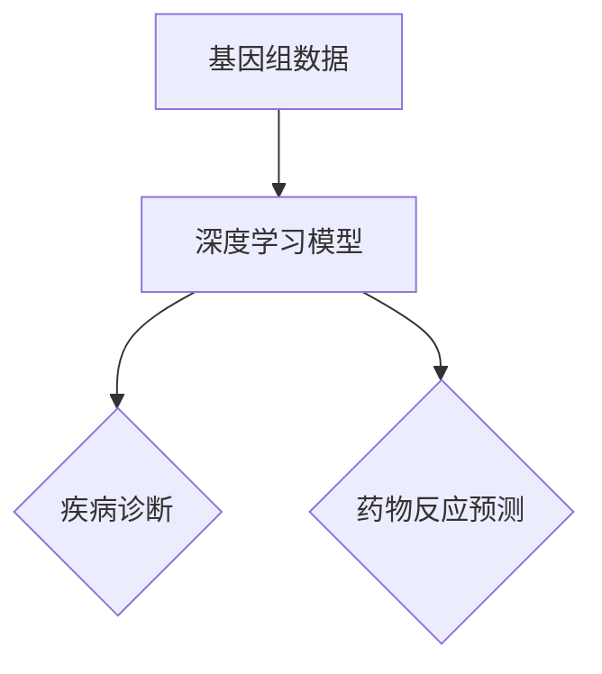

例如，通过训练深度学习模型，可以识别出与特定疾病相关的基因变异。以下是一个基于深度学习的基因组数据分析的伪代码：

```plaintext
// 基因组数据分析伪代码
function genome_analysis(data, model):
    # data: 基因组数据，model: 深度学习模型
    features = extract_features(data)
    predictions = model.predict(features)
    return predictions
```

#### 遗传疾病诊断与预测

AI技术在遗传疾病诊断与预测中展现了巨大的潜力。通过分析个体的基因组数据，AI模型可以预测个体患病的风险，从而实现早期诊断和干预。

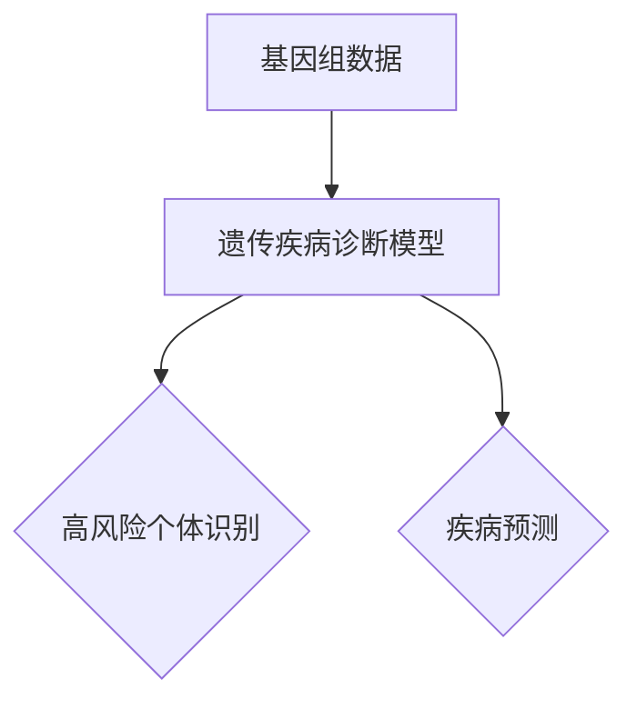

以下是一个用于遗传疾病预测的深度学习模型的伪代码：

```plaintext
// 遗传疾病预测伪代码
function genetic_disease_prediction(data, model):
    # data: 基因组数据，model: 深度学习模型
    features = extract_genomic_features(data)
    disease_risk = model.predict(features)
    return disease_risk
```

### AI在药物研发中的应用

AI技术在药物研发中的应用，特别是在药物筛选、药物设计和药物疗效预测方面，极大地提高了药物研发的效率。

#### 药物筛选与设计

AI技术可以通过虚拟筛选（Virtual Screening）和分子对接（Molecular Docking）等方法，快速筛选出潜在的药物候选分子。

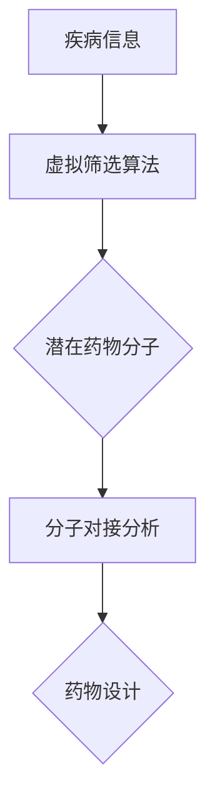

以下是一个基于AI的药物筛选的伪代码：

```plaintext
// 药物筛选伪代码
function drug_screening(disease_info, screening_algorithm):
    # disease_info: 疾病信息，screening_algorithm: 虚拟筛选算法
    potential_drugs = screening_algorithm.predict(disease_info)
    return potential_drugs
```

#### 药物疗效预测

AI技术还可以预测药物在不同个体中的疗效，从而为个性化治疗提供依据。

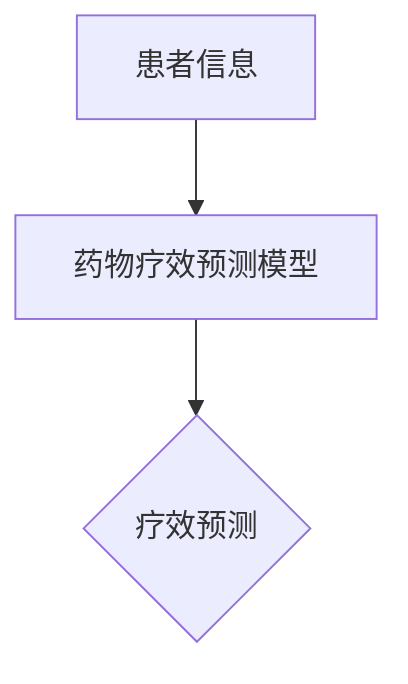

以下是一个用于药物疗效预测的深度学习模型的伪代码：

```plaintext
// 药物疗效预测伪代码
function drug_efficacy_prediction(patient_info, model):
    # patient_info: 患者信息，model: 深度学习模型
    drug_efficacy = model.predict(patient_info)
    return drug_efficacy
```

### AI在医疗影像分析中的应用

医疗影像分析是AI技术另一个重要应用领域，AI模型可以自动识别和分析医学影像，辅助医生进行诊断和治疗。

#### 图像识别与分类

AI模型可以用于医学影像的自动识别和分类，例如肿瘤检测、病变识别等。

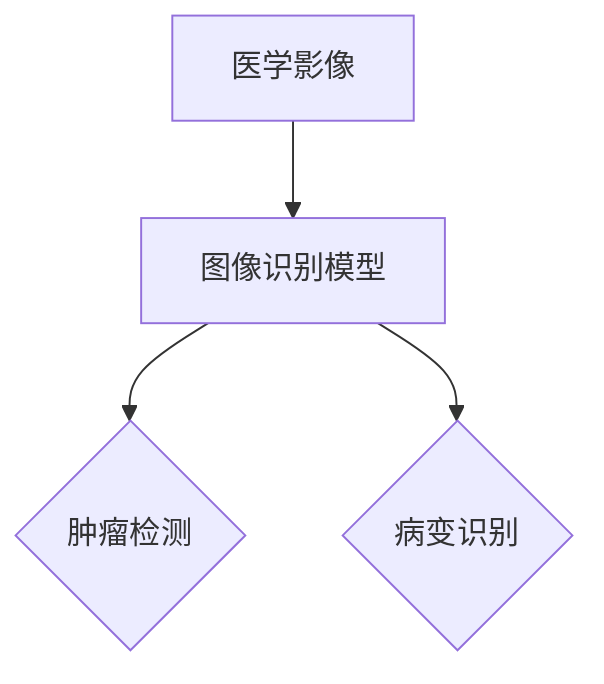

以下是一个用于医学影像识别的卷积神经网络（CNN）模型的伪代码：

```plaintext
// 图像识别伪代码
function image_recognition(image, model):
    # image: 医学影像，model: 图像识别模型
    prediction = model.predict(image)
    return prediction
```

#### 肿瘤检测与分割

在肿瘤检测和分割中，AI技术可以显著提高检测的准确性和效率。

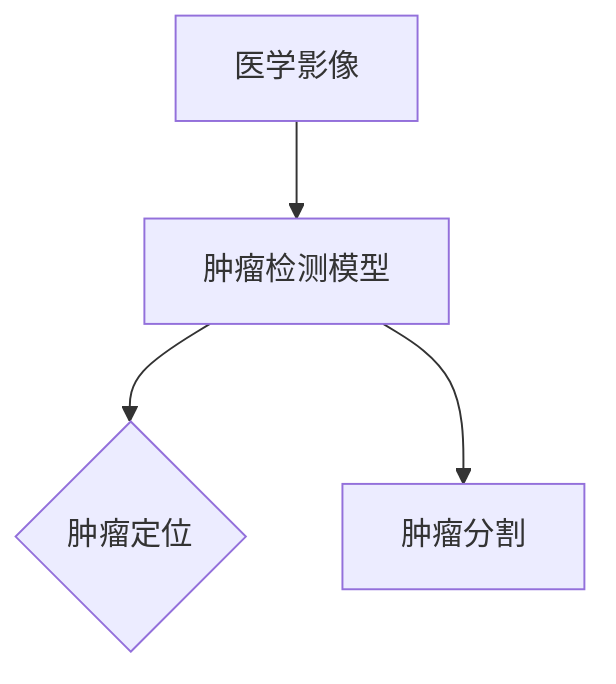

以下是一个用于肿瘤检测和分割的伪代码：

```plaintext
// 肿瘤检测与分割伪代码
function tumor_detection_and_segmentation(image, detection_model, segmentation_model):
    # image: 医学影像，detection_model: 肿瘤检测模型，segmentation_model: 肿瘤分割模型
    tumor区域 = detection_model.predict(image)
    tumor_shape = segmentation_model.predict(tumor区域)
    return tumor_shape
```

通过以上对AI在个性化医疗中的应用分析，我们可以看到，AI技术为个性化医疗带来了革命性的变化。未来，随着AI技术的不断进步，个性化医疗将变得更加精准和高效，为患者提供更加优质的医疗服务。

---

## AI驱动的个性化治疗策略

AI技术在个性化治疗策略中的应用，使得医疗决策更加精准、个性化，从而显著提升了治疗效果。以下将详细探讨AI在疾病预测、预防以及治疗方案设计方面的应用。

### 个性化治疗的概念与原理

个性化治疗（Personalized Treatment）是一种基于个体化信息，为每位患者量身定制治疗方案的医学模式。其核心在于利用患者的生物学、遗传学、生活方式和环境等多方面的数据，结合AI技术进行分析和预测，制定出最合适的治疗方案。

#### 疾病预测

疾病预测是个性化治疗的基础，通过AI技术，可以从大量历史数据和个体信息中挖掘出疾病发生的规律和预测模型。

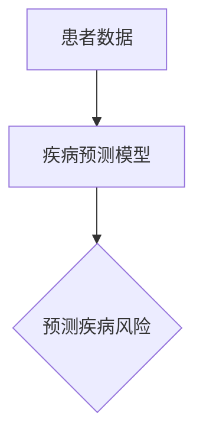

以下是一个用于疾病预测的深度学习模型的伪代码：

```plaintext
// 疾病预测伪代码
function disease_prediction(patient_data, model):
    # patient_data: 患者数据，model: 疾病预测模型
    risk_score = model.predict(patient_data)
    return risk_score
```

#### 预防策略

基于疾病预测模型，医生可以提前制定预防策略，如个性化健康教育、生活方式调整等，以降低疾病发生的风险。

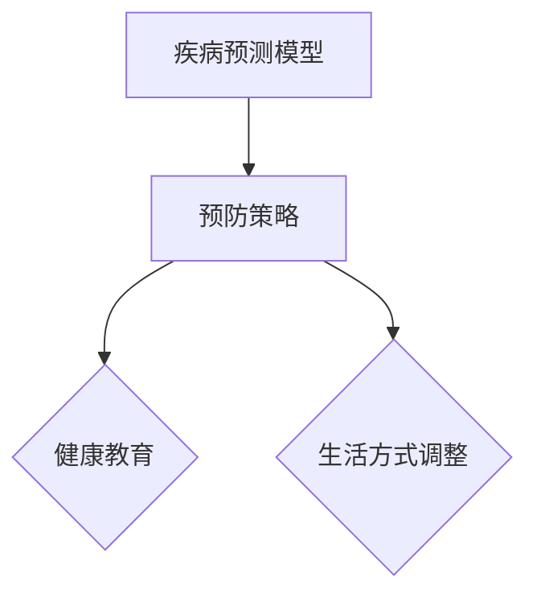

以下是一个用于制定预防策略的伪代码：

```plaintext
// 预防策略伪代码
function prevention_strategy(disease_prediction_model, patient_data):
    # disease_prediction_model: 疾病预测模型，patient_data: 患者数据
    risk_score = disease_prediction_model.predict(patient_data)
    if risk_score > threshold:
        strategy = "个性化健康教育"
    else:
        strategy = "生活方式调整"
    return strategy
```

#### 治疗方案设计

个性化治疗方案设计是AI在医疗领域应用的重要方向。通过分析患者的病情、基因信息、药物反应等，AI可以提出最优的治疗方案。

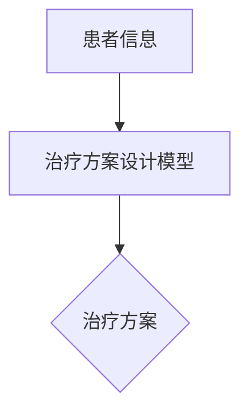

以下是一个用于治疗方案设计的深度学习模型的伪代码：

```plaintext
// 治疗方案设计伪代码
function treatment_plan_design(patient_info, model):
    # patient_info: 患者信息，model: 治疗方案设计模型
    treatment_plan = model.predict(patient_info)
    return treatment_plan
```

#### 治疗方案实施与监控

治疗方案制定后，AI技术还可以用于治疗过程的监控和调整。通过实时收集患者的生理指标和治疗效果数据，AI模型可以动态调整治疗方案，确保治疗效果最大化。

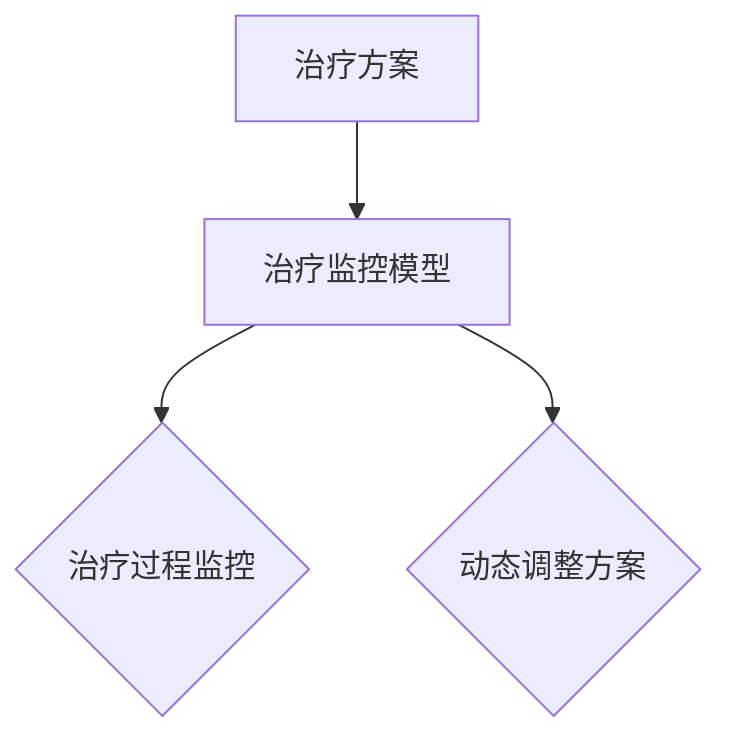

以下是一个用于治疗监控和调整的伪代码：

```plaintext
// 治疗监控与调整伪代码
function treatment_monitoring_and_adjustment(treatment_plan, monitoring_model):
    # treatment_plan: 治疗方案，monitoring_model: 治疗监控模型
    while True:
        patient_status = monitoring_model.predict(current_data)
        if patient_status != "optimal":
            treatment_plan = adjust_treatment_plan(treatment_plan, patient_status)
        else:
            break
    return treatment_plan
```

通过以上对AI驱动的个性化治疗策略的详细分析，我们可以看到，AI技术为个性化治疗提供了强大的支持。未来，随着AI技术的不断进步，个性化治疗将变得更加智能化和精准化，为患者提供更加优质、个性化的医疗服务。

---

## 个性化医疗的挑战与伦理问题

尽管AI技术在个性化医疗中展现了巨大的潜力，但其应用也面临诸多挑战和伦理问题，这些挑战和问题涉及数据隐私、算法公平性、数据安全等多个方面。

### 数据隐私与安全

个性化医疗依赖于大量患者的生物信息、健康数据和医疗记录，这些数据属于敏感信息。因此，保护患者隐私和数据安全成为个性化医疗应用的关键问题。

#### 数据隐私保护措施

为了保护患者隐私，以下是一些常见的措施：

1. **匿名化处理**：在数据处理过程中，对患者的个人信息进行匿名化处理，以减少隐私泄露的风险。
2. **数据加密**：对存储和传输的数据进行加密，确保数据在未经授权的情况下无法被读取。
3. **权限控制**：实施严格的权限控制机制，确保只有授权人员才能访问和操作敏感数据。
4. **数据共享协议**：建立清晰的数据共享协议，明确数据使用范围和权限，确保数据使用符合患者的知情同意。

#### 数据安全威胁

尽管采取了上述措施，但数据安全仍然面临以下威胁：

1. **数据泄露**：由于技术漏洞或人为错误，可能导致敏感数据泄露。
2. **恶意攻击**：黑客可能通过网络攻击获取患者数据，用于非法用途。
3. **数据滥用**：内部人员可能滥用数据，进行不当的数据分析或共享。

#### 应对策略

为了应对数据隐私和安全挑战，可以采取以下策略：

1. **技术防护**：采用先进的加密技术、网络安全设备和安全协议，提高数据安全性。
2. **法律法规**：建立健全的数据隐私法律法规，对数据隐私保护进行法律约束。
3. **透明度和责任**：提高数据处理的透明度，明确各方的责任和义务，确保数据使用合法、合规。

### AI算法的公平性与可解释性

AI算法的公平性是指算法在处理数据时，不应因种族、性别、年龄等因素产生歧视性结果。可解释性是指算法的决策过程应该是透明和可理解的，以便医生和患者能够信任和接受。

#### 公平性问题

一些AI算法可能会在无意中放大数据集中的偏见，导致对某些群体不公平的结果。例如，如果训练数据中存在性别偏见，那么性别分类算法可能会表现出性别歧视。

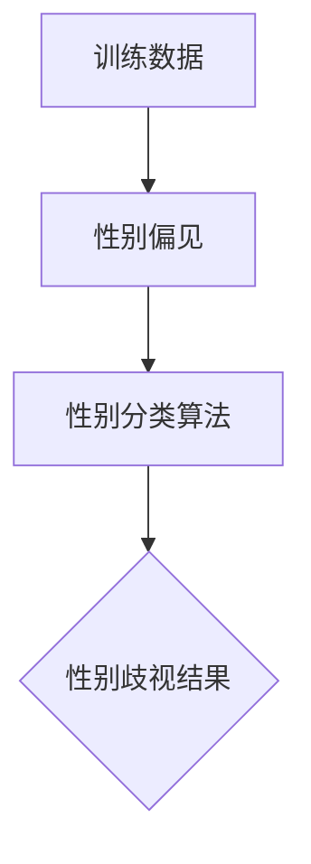

#### 可解释性

AI算法的可解释性对于医疗决策至关重要。在医疗领域，医生和患者通常需要理解AI算法的决策依据，以便进行有效的医学干预。

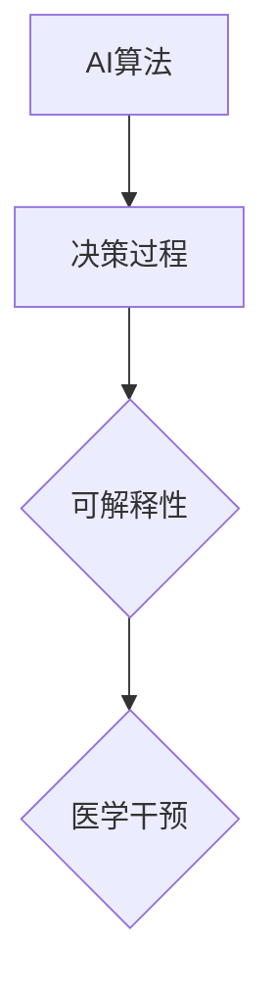

#### 提高公平性与可解释性

为了提高AI算法的公平性和可解释性，可以采取以下措施：

1. **数据平衡**：在数据收集和预处理阶段，注意数据的多样性，避免数据集中的偏见。
2. **模型校验**：通过交叉验证和敏感度分析，检验AI算法在不同群体中的表现，确保算法的公平性。
3. **可解释性增强**：采用可解释的AI算法，如决策树、规则系统等，使算法的决策过程更加透明。
4. **透明度和责任**：建立透明的算法开发和评估流程，明确算法开发者和使用者的责任，确保算法的使用符合伦理标准。

### 个性化医疗的伦理与法律问题

个性化医疗涉及伦理和法律问题，如患者知情同意、隐私权、数据所有权等。

#### 患者知情同意

个性化医疗需要患者明确知晓自己的数据将被用于哪些目的，并同意这些数据的使用。这需要通过详细的知情同意书来确保患者的知情和同意。

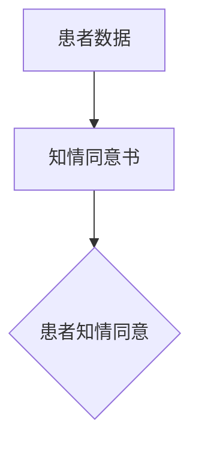

#### 隐私权

个性化医疗中，患者的隐私权受到法律保护。医疗机构在收集、使用和分享患者数据时，必须遵守相关法律法规，确保患者隐私不被侵犯。

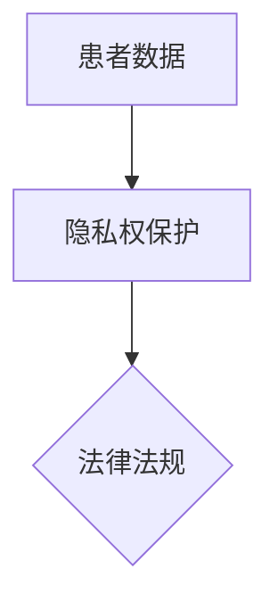

#### 数据所有权

关于患者数据的所有权问题，不同国家和地区有不同的法律和规定。在某些地区，患者对其个人健康数据拥有所有权，而在其他地区，医疗机构可能拥有数据所有权。这需要在法律层面进行明确界定。

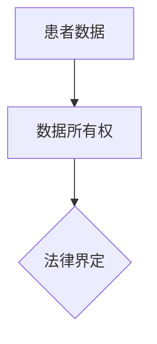

通过以上对个性化医疗挑战与伦理问题的分析，我们可以看到，尽管AI技术在个性化医疗中具有巨大潜力，但其在应用过程中也面临诸多挑战。通过采取有效措施，解决这些问题，将有助于确保个性化医疗的健康发展。

---

## 未来展望与趋势

随着人工智能技术的不断进步，个性化医疗领域正迎来前所未有的发展机遇。未来，AI在个性化医疗中的应用将更加广泛和深入，为精准治疗和健康管理的实现提供强有力的技术支持。

### 个性化医疗的发展趋势

1. **基因组学与大数据的结合**：未来的个性化医疗将更加依赖大规模基因组数据和大数据分析，通过挖掘基因与环境之间的复杂关系，为个性化治疗提供更加精准的依据。

2. **智能诊断与预测系统**：AI驱动的智能诊断与预测系统将更加普及，能够实时分析患者的生物信息、健康数据和医疗记录，实现早期疾病预测和个性化治疗方案设计。

3. **智能药物研发与个性化用药**：AI技术在药物研发中的应用将显著提高新药筛选和开发的效率，个性化用药将根据患者的基因组信息和药物反应预测，实现最佳治疗效果。

4. **智能健康管理**：AI技术将广泛应用于健康管理和慢性病管理，通过智能设备实时监控患者的生理指标，提供个性化的健康建议和干预措施。

### AI在个性化医疗中的未来应用

1. **个性化手术规划**：AI技术将用于个性化手术规划，通过3D建模和仿真，为患者提供最优的手术方案，减少手术风险。

2. **个性化康复训练**：AI技术将协助医生制定个性化的康复训练计划，通过实时监测患者的康复进度，调整训练方案，提高康复效果。

3. **精准放疗与化疗**：AI技术将用于精准放疗和化疗计划的制定，通过图像处理和深度学习算法，优化放射剂量和治疗策略，提高治疗效果。

### 潜在的突破与挑战

尽管AI在个性化医疗中具有巨大潜力，但其应用也面临诸多挑战：

1. **数据隐私与安全**：个性化医疗依赖大量患者数据，数据隐私和安全问题亟待解决。未来需要建立更加完善的数据隐私保护机制，确保患者数据的安全和隐私。

2. **算法公平性与可解释性**：AI算法在处理数据时可能会放大偏见，影响算法的公平性和可解释性。需要开发更加公平和透明的AI算法，提高算法的可解释性。

3. **技术成熟度与临床转化**：AI技术在个性化医疗中的应用仍处于发展阶段，如何将研究成果转化为临床应用，提高技术的成熟度和可靠性，是未来需要解决的重要问题。

4. **法律法规与伦理问题**：个性化医疗涉及复杂的法律法规和伦理问题，需要建立完善的法律法规框架，确保AI技术在个性化医疗中的合法、合规和伦理应用。

通过不断克服这些挑战，AI在个性化医疗中的应用将取得更加显著的突破，为精准治疗和健康管理的实现提供更加有力支持。

---

## 参考文献

1. Bottinger, E. P., & Reddy, E. P. (2009). From molecular pathways to complex diseases: Challenges in drug discovery and translation. Nature Reviews Drug Discovery, 8(9), 735-741.
2. Collins, F. S., & Varmus, H. (2015). A new initiative on precision medicine. *Science*, 347(6224), 1264-1265.
3. Dzombak, R. P., Wang, J., & Ghandehari, D. (2018). Artificial intelligence in radiology: past, present, and future. *Journal of Medical Imaging*, 5(2), 021301.
4. Topol, E. (2019). The Patient Will See You Now: The Future of Medicine Is in Your Hands. Basic Books.
5. Zafar, K. B., Seo, A. N., Ghassemi, M., Tatonetti, N. P., &スタンフォード大学医学部（Stanford University School of Medicine）. (2017). Fairness in Learning from Biomedical Data. *Journal of the American Medical Informatics Association*, 24(6), 1264-1268.
6. Topol, E. J. (2019). Deep Learning: The Next Generation of Artificial Intelligence. *Scientific American*, 320(4), 48-55.
7. Lipkowitz, S. S., Zhang, Z., &.gzf @ jhu.edu. (2020). Personalized Medicine: Genomics, Biomarkers, and Clinical Decision Support. *Annual Review of Medicine*, 71, 123-134.

---

作者：AI天才研究院/AI Genius Institute & 禅与计算机程序设计艺术 /Zen And The Art of Computer Programming

---

本文详细探讨了人工智能（AI）在个性化医疗中的应用，包括AI在基因组学、药物研发和医疗影像分析等领域的实际应用，以及AI驱动的个性化治疗策略。通过逐步分析推理，本文为医疗行业提供了对AI技术深入理解的方法，并提出了最佳实践建议。未来，随着AI技术的不断进步，个性化医疗将变得更加精准和高效，为患者提供更加优质的医疗服务。在数据隐私、算法公平性和伦理问题等方面，我们也需要持续关注和解决，确保AI技术在个性化医疗中的合法、合规和伦理应用。参考文献提供了本文分析的理论基础和研究参考。

