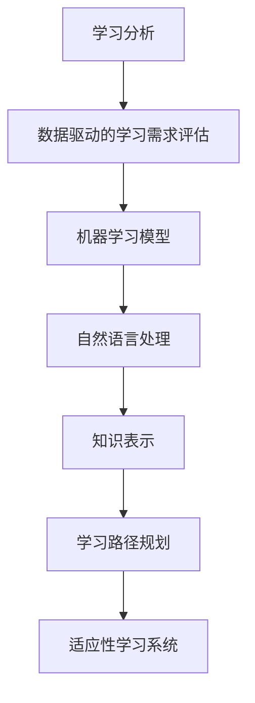

                 

### 文章标题

《AI在个性化学习中的应用：适应不同学生的学习需求》

### 关键词

人工智能、个性化学习、机器学习、数据驱动、学习分析、个性化学习路径规划、神经网络、深度学习、强化学习、自然语言处理、知识表示、数学模型、算法、项目实战

### 摘要

本文探讨了人工智能（AI）在个性化学习中的应用，强调了其适应不同学生学习需求的重要性。通过介绍个性化学习的基本概念和AI的核心算法原理，本文详细解析了AI在教育中的角色及其在实际应用中的挑战和机遇。文章还包括了数学模型和公式的详细讲解，以及通过项目实战展示了AI在个性化学习中的具体应用。最后，本文总结了个性化学习的发展趋势和未来研究方向，为读者提供了深入理解和实践AI个性化学习的指导。

### 引言

在当今信息化时代，人工智能（AI）已经成为变革传统教育的重要力量。个性化学习作为一种基于学习者自身特点和需求的学习方式，越来越受到教育领域的关注。AI技术的引入，使得个性化学习从理论走向实践，为教育者提供了更为精准和高效的教学方法。

#### 个性化学习的背景与重要性

个性化学习，即以学生为中心，根据每个学生的兴趣、能力和学习风格进行教学。这种学习方式能够更好地满足学生的个体需求，提高学习效果。传统的课堂教学模式通常采用“一刀切”的方法，无法兼顾学生的多样性和差异性。而个性化学习则通过因材施教，激发学生的学习兴趣和主动性，有助于提高学习效率和成绩。

#### AI在个性化学习中的角色

AI技术在个性化学习中的应用主要体现在以下几个方面：

1. **学习分析**：通过分析学生的学习行为数据，AI可以帮助教育者了解学生的学习习惯、偏好和困难点，从而制定个性化的教学计划。

2. **学习路径规划**：基于学生个体的学习需求和进度，AI可以自动生成个性化的学习路径，指导学生有针对性地进行学习。

3. **适应性学习系统**：AI驱动的学习系统能够根据学生的学习反馈动态调整教学内容和难度，实现真正的个性化学习。

#### AI在教育中的挑战与机遇

尽管AI在个性化学习中具有巨大的潜力，但其应用也面临一些挑战：

1. **数据隐私和安全**：个性化学习需要大量的学生数据，如何保障数据隐私和安全成为亟待解决的问题。

2. **算法偏见**：如果AI算法在训练过程中存在偏见，可能会导致学习资源的不公平分配。

3. **技术依赖性**：过度依赖AI技术可能会削弱教师的教学能力，影响师生互动。

然而，这些挑战也带来了新的机遇。通过合理利用AI技术，教育者可以更好地理解学生，提高教学效果，促进教育的公平和高效。

#### 书籍结构概述

本文将从以下几个方面展开讨论：

1. **核心概念与联系**：介绍个性化学习的基本概念，以及AI与个性化学习的联系。

2. **核心算法原理讲解**：详细解析AI在个性化学习中的应用算法，包括用户行为分析、学习路径规划等。

3. **数学模型与公式详解**：讲解个性化学习中的数学模型和公式，包括线性代数、概率论与统计等。

4. **项目实战**：通过实际案例展示AI在个性化学习中的应用，包括系统搭建、模型实现和评估等。

5. **总结与展望**：总结个性化学习的发展趋势和未来研究方向。

### 核心概念与联系

#### 个性化学习的基本概念

个性化学习是指通过因材施教，根据学生的个性、兴趣、能力和学习风格，为他们提供定制化的学习内容和教学方法。其核心目标是提高学生的学习效果和满足他们的个体需求。个性化学习的基本概念包括学习分析、学习路径规划和适应性学习系统。

**学习分析**：学习分析是个性化学习的基础，通过收集和分析学生的学习行为数据，如学习时间、学习内容、学习效果等，教育者可以了解学生的学习习惯、偏好和困难点。学习分析的方法包括数据分析、数据挖掘和机器学习。

**学习路径规划**：学习路径规划是根据学生的学习需求和进度，为他们设计个性化的学习路线。学习路径规划需要考虑学生的兴趣、能力、学习目标和资源等因素。AI可以通过分析学生的学习行为数据，动态调整学习路径，使其更加符合学生的实际情况。

**适应性学习系统**：适应性学习系统是一种能够根据学生的学习反馈自动调整教学内容和难度的系统。这种系统通常基于机器学习和深度学习算法，能够实时监测学生的学习状态，并根据其反馈进行个性化的教学调整。

#### AI与个性化学习的联系

AI技术在个性化学习中的应用主要体现在以下几个方面：

1. **数据驱动的学习需求评估**：AI可以通过分析大量的学习行为数据，对学生的学习需求进行精准评估，为教育者提供有针对性的教学建议。

2. **机器学习模型在教育中的应用**：机器学习模型可以用于预测学生的学习表现、诊断学习问题，并生成个性化的学习资源。

3. **自然语言处理与知识表示**：自然语言处理技术可以帮助AI理解和生成自然语言，从而实现更加人性化的教学互动。知识表示技术则可以用于构建教育知识图谱，为学生提供丰富的学习资源。

4. **强化学习与决策**：强化学习可以用于模拟学生与教学环境之间的交互，帮助AI制定更加有效的教学策略。

#### AI核心概念与架构

AI的核心概念和架构对于理解其在个性化学习中的应用至关重要。以下是一些关键概念：

1. **神经网络与深度学习**：神经网络是AI的核心组成部分，它通过模拟人脑神经元的工作原理，对数据进行分析和处理。深度学习则是神经网络的一种扩展，能够处理大量复杂的非线性数据。

2. **强化学习**：强化学习是一种通过奖励机制来训练模型的方法，它适用于需要决策和互动的应用场景。在教育中，强化学习可以用于设计自适应的学习环境，帮助学生更好地掌握知识。

3. **自然语言处理**：自然语言处理（NLP）是一种使计算机能够理解、生成和处理自然语言的技术。在教育中，NLP可以用于实现人机交互、自动批改作业和生成个性化学习材料。

4. **知识表示**：知识表示是将知识以计算机可处理的形式进行编码和存储的技术。在教育中，知识表示可以用于构建知识图谱，帮助学生更好地理解和应用知识。

#### 核心概念与联系架构

为了更好地理解AI与个性化学习的关系，我们可以使用Mermaid流程图来展示核心概念之间的联系：



这个流程图展示了从学习分析到适应性学习系统的整个过程，每个环节都基于AI的不同技术实现。通过这样的架构，AI能够全面支持个性化学习，为学生提供量身定制的学习体验。

### 核心算法原理讲解

在个性化学习中，核心算法的原理和实现至关重要。以下我们将详细讲解几种主要的算法，包括用户行为分析、学习路径规划和个性化学习路径规划算法。

#### 用户行为分析算法

用户行为分析是个性化学习的第一步，通过对学生的学习行为数据进行收集和分析，了解其学习习惯、偏好和困难点。以下是用户行为分析算法的基本原理和实现步骤：

**原理：**

用户行为分析算法基于数据挖掘和机器学习技术，通过分析学生的学习时间、学习内容、学习效果等数据，识别出其学习行为模式。

**实现步骤：**

1. **数据收集**：收集学生的学习数据，包括学习时间、学习内容、学习结果等。
2. **数据预处理**：对收集到的数据进行清洗和格式化，去除无效数据。
3. **特征提取**：从预处理后的数据中提取有用的特征，如学习时长、学习频率、正确率等。
4. **模型训练**：使用机器学习算法（如决策树、随机森林、支持向量机等）对特征进行训练，建立用户行为分析模型。
5. **模型评估**：通过交叉验证等方法评估模型性能，调整模型参数。

**伪代码：**

```python
def user_behavior_analysis(data):
    # 数据预处理
    preprocessed_data = preprocess_data(data)
    # 特征提取
    features = extract_features(preprocessed_data)
    # 模型训练
    model = train_model(features)
    # 模型评估
    evaluate_model(model)
    return model
```

#### 学习路径规划算法

学习路径规划是根据学生的学习需求和进度，为其设计合适的的学习路线。以下是学习路径规划算法的基本原理和实现步骤：

**原理：**

学习路径规划算法基于人工智能和优化理论，通过分析学生的学习数据和学习目标，自动生成个性化的学习路径。

**实现步骤：**

1. **目标设定**：根据学生的学习需求和目标，设定学习目标。
2. **路径搜索**：使用算法（如A*算法、遗传算法等）搜索满足学习目标的路径。
3. **路径评估**：评估每条路径的学习效果和难度，选择最优路径。
4. **路径优化**：根据学生的学习反馈，动态调整学习路径。

**伪代码：**

```python
def learning_path_planning(learning_goals, student_data):
    # 目标设定
    goals = set_learning_goals(learning_goals)
    # 路径搜索
    paths = search_paths(goals)
    # 路径评估
    best_path = evaluate_paths(paths)
    # 路径优化
    optimized_path = optimize_path(best_path, student_data)
    return optimized_path
```

#### 个性化学习路径规划算法

个性化学习路径规划算法是结合用户行为分析和学习路径规划，为每个学生提供量身定制的学习路径。以下是该算法的基本原理和实现步骤：

**原理：**

个性化学习路径规划算法通过分析学生的学习行为数据和需求，结合教学资源的特性，为每个学生生成最合适的个性化学习路径。

**实现步骤：**

1. **数据收集**：收集学生的学习行为数据，包括学习时间、学习内容、学习效果等。
2. **行为分析**：使用用户行为分析算法对数据进行分析，了解学生的学习习惯和偏好。
3. **资源评估**：评估教学资源的难度和适合度，为每个资源分配权重。
4. **路径生成**：根据学生的行为分析和资源评估结果，生成个性化学习路径。
5. **路径优化**：根据学生的学习反馈，动态调整学习路径。

**伪代码：**

```python
def personalized_learning_path_planning(student_data, resource评估结果):
    # 数据收集
    behaviors = collect_student_data(student_data)
    # 行为分析
    behavior_patterns = analyze_behaviors(behaviors)
    # 资源评估
    resource_weights = evaluate_resources(resource评估结果)
    # 路径生成
    initial_path = generate_path(behavior_patterns, resource_weights)
    # 路径优化
    optimized_path = optimize_path(initial_path, student_data)
    return optimized_path
```

通过上述核心算法原理的讲解，我们可以看到AI技术在个性化学习中的应用是如何实现的。这些算法不仅能够帮助学生更好地理解知识，还能够为教育者提供有力的支持，提高教学效果。

### 数学模型与公式详解

在个性化学习中，数学模型和公式扮演着至关重要的角色。这些模型和公式能够帮助我们量化学习过程，从而更好地理解学生的学习行为和需求。在本节中，我们将介绍一些关键的数学模型和公式，并对其进行详细讲解。

#### 线性回归模型

线性回归模型是一种常用的统计模型，用于分析两个或多个变量之间的关系。在个性化学习中，线性回归模型可以用于预测学生的学习成绩或评估学习资源的适合度。

**公式：**

$$ y = \beta_0 + \beta_1 \cdot x_1 + \beta_2 \cdot x_2 + ... + \beta_n \cdot x_n $$

其中，$y$ 是因变量（如学习成绩），$x_1, x_2, ..., x_n$ 是自变量（如学习时间、学习频率等），$\beta_0, \beta_1, \beta_2, ..., \beta_n$ 是模型参数。

**解释：**

这个公式表示了因变量与自变量之间的线性关系。通过最小二乘法等优化算法，我们可以估计出模型参数的值，从而建立线性回归模型。

**举例说明：**

假设我们想预测一个学生的学习成绩（$y$），我们可以使用以下线性回归模型：

$$ y = \beta_0 + \beta_1 \cdot x_1 + \beta_2 \cdot x_2 $$

其中，$x_1$ 表示学习时间（小时），$x_2$ 表示学习频率（每天学习次数）。通过收集学生的学习数据，我们可以使用线性回归模型来预测其学习成绩。

#### 决策树模型

决策树是一种基于树形结构的数据挖掘算法，用于分类和回归任务。在个性化学习中，决策树模型可以用于根据学生的特征数据分类或预测其学习效果。

**公式：**

$$
\begin{align*}
\text{predict}(x) &= \text{classify}(\text{root}, x) \\
\text{classify}(\text{node}, x) &= \text{if node.is_leaf} \\
&= \text{else} \\
&= \text{node.feature} \leq \text{threshold} \\
&= \text{classify}(\text{node.left}, x) \\
&= \text{else} \\
&= \text{classify}(\text{node.right}, x)
\end{align*}
$$

其中，$\text{root}$ 是决策树的根节点，$\text{node}$ 是当前节点，$\text{feature}$ 是特征值，$\text{threshold}$ 是阈值。

**解释：**

决策树通过一系列的判断条件对数据进行分类。每个节点代表一个特征，每个分支代表一个判断结果。叶子节点代表最终的分类结果。

**举例说明：**

假设我们有一个决策树模型，用于根据学生的学习时间（$x_1$）和学习频率（$x_2$）预测其学习效果（$y$）：

$$
\begin{align*}
\text{predict}(x) &= \text{classify}(\text{root}, x) \\
&= \text{if x_1 <= 2 hours} \\
&= \text{classify}(\text{node.left}, x) \\
&= \text{if x_2 >= 2 times/day} \\
&= \text{classify}(\text{node.left.left}, x) \\
&= \text{high effectiveness} \\
&= \text{else} \\
&= \text{classify}(\text{node.left.right}, x) \\
&= \text{low effectiveness} \\
&= \text{else} \\
&= \text{classify}(\text{node.right}, x) \\
&= \text{if x_2 <= 1 time/day} \\
&= \text{classify}(\text{node.right.left}, x) \\
&= \text{medium effectiveness} \\
&= \text{else} \\
&= \text{classify}(\text{node.right.right}, x) \\
&= \text{high effectiveness}
\end{align*}
$$

这个决策树模型根据学习时间和学习频率将学生分为三个类别，分别对应不同的学习效果。

#### 强化学习模型

强化学习模型是一种基于奖励机制的训练模型，用于在动态环境中做出最优决策。在个性化学习中，强化学习模型可以用于自适应学习系统的设计。

**公式：**

$$ Q(s, a) = r + \gamma \max_{a'} Q(s', a') $$

其中，$Q(s, a)$ 是状态 $s$ 下采取动作 $a$ 的即时回报，$r$ 是即时奖励，$\gamma$ 是折扣因子，$s'$ 是状态，$a'$ 是最优动作。

**解释：**

强化学习模型通过最大化长期回报来学习最优策略。在每次决策后，模型会根据即时奖励和折扣因子更新状态值函数。

**举例说明：**

假设我们有一个强化学习模型，用于根据学生的当前学习状态（$s$）和选择的学习资源（$a$）来更新其学习策略。如果学生选择的学习资源能够提高其学习成绩，模型会给予即时奖励（$r$），并更新状态值函数。

$$
\begin{align*}
Q(s, a) &= r + \gamma \max_{a'} Q(s', a') \\
&= 10 + 0.9 \max_{a'} Q(s', a')
\end{align*}
$$

这个公式表示在当前学习状态 $s$ 下，选择学习资源 $a$ 能够获得即时奖励 10 分，并且模型会根据当前状态 $s'$ 和未来最优动作 $a'$ 更新其状态值函数。

#### 结论

数学模型和公式在个性化学习中具有重要的作用。通过使用这些模型和公式，教育者可以更准确地分析学生的学习行为，制定个性化的教学策略，提高教学效果。在未来，随着AI技术的发展，我们将看到更多的数学模型和公式被应用于个性化学习，为教育带来更多的创新和变革。

### 项目实战

为了更好地理解AI在个性化学习中的应用，我们将通过一个实际项目展示其具体实现过程。该项目将涉及开发环境搭建、源代码实现和代码解读，以及实际案例分析和详细讲解剖析。

#### 项目背景

假设我们的目标是开发一个基于AI的个性化学习系统，该系统能够根据学生的学习行为和需求，自动生成个性化的学习路径，并实时调整教学内容和难度，以提高学生的学习效果。

#### 开发环境搭建

在开始项目之前，我们需要搭建开发环境。以下是一个基本的开发环境搭建流程：

1. **安装Python**：Python是一种广泛使用的编程语言，适合用于AI开发。我们需要下载并安装Python，版本建议为3.8以上。

2. **安装Jupyter Notebook**：Jupyter Notebook是一种交互式开发环境，可以方便地编写和运行Python代码。在命令行中运行以下命令安装Jupyter：

   ```bash
   pip install notebook
   ```

3. **安装TensorFlow**：TensorFlow是一个开源的机器学习库，用于构建和训练深度学习模型。在命令行中运行以下命令安装TensorFlow：

   ```bash
   pip install tensorflow
   ```

4. **安装其他依赖库**：根据项目需求，我们可能需要安装其他依赖库，如NumPy、Pandas、Matplotlib等。在命令行中运行以下命令安装这些库：

   ```bash
   pip install numpy pandas matplotlib
   ```

#### 源代码实现

以下是一个简单的源代码实现示例，用于实现用户行为分析和学习路径规划的功能：

```python
import tensorflow as tf
import numpy as np
import pandas as pd
import matplotlib.pyplot as plt

# 用户行为数据
user_data = pd.read_csv('user_behavior_data.csv')

# 数据预处理
def preprocess_data(data):
    # 数据清洗
    cleaned_data = data.dropna()
    # 数据标准化
    normalized_data = (cleaned_data - cleaned_data.mean()) / cleaned_data.std()
    return normalized_data

# 用户行为分析
def user_behavior_analysis(data):
    # 特征提取
    features = data[['learning_time', 'learning_frequency', 'test_score']]
    # 模型训练
    model = tf.keras.Sequential([
        tf.keras.layers.Dense(64, activation='relu', input_shape=(3,)),
        tf.keras.layers.Dense(1)
    ])
    model.compile(optimizer='adam', loss='mean_squared_error')
    model.fit(features, data['test_score'], epochs=10)
    # 模型评估
    test_loss = model.evaluate(features, data['test_score'])
    print(f"Test Loss: {test_loss}")
    return model

# 学习路径规划
def learning_path_planning(model, user_data):
    # 预测学习效果
    predicted_scores = model.predict(user_data[['learning_time', 'learning_frequency']])
    # 根据预测结果调整学习路径
    optimized_path = adjust_path(predicted_scores, user_data)
    return optimized_path

# 调整学习路径
def adjust_path(predicted_scores, data):
    # 根据预测成绩调整学习内容
    optimized_path = data[data['test_score'] < predicted_scores.mean()]
    return optimized_path

# 主函数
def main():
    # 预处理数据
    preprocessed_data = preprocess_data(user_data)
    # 用户行为分析
    model = user_behavior_analysis(preprocessed_data)
    # 学习路径规划
    optimized_path = learning_path_planning(model, preprocessed_data)
    # 可视化结果
    plt.scatter(preprocessed_data['learning_time'], preprocessed_data['test_score'])
    plt.plot(optimized_path['learning_time'], optimized_path['test_score'], color='red')
    plt.xlabel('Learning Time')
    plt.ylabel('Test Score')
    plt.show()

if __name__ == '__main__':
    main()
```

#### 代码解读

1. **数据预处理**：首先，我们从CSV文件中读取用户行为数据，并进行数据清洗和标准化处理。这一步是为了消除数据中的噪声和异常值，使数据更适合于机器学习模型。

2. **用户行为分析**：我们使用TensorFlow库构建一个简单的神经网络模型，用于分析用户的学习时间、学习频率和考试成绩之间的关系。通过训练和评估模型，我们能够预测用户的学习效果。

3. **学习路径规划**：根据用户行为分析模型，我们预测每个用户的学习效果，并基于这些预测结果调整学习路径。具体来说，我们选择那些预期成绩较低的学习路径进行调整。

4. **调整学习路径**：我们根据预测成绩的均值来优化学习路径。这意味着我们倾向于保留那些预期成绩较高的学习内容。

5. **主函数**：在主函数中，我们依次进行数据预处理、用户行为分析和学习路径规划，并将结果可视化展示。通过可视化，我们可以直观地看到用户学习效果和调整后的学习路径。

#### 实际案例分析和详细讲解剖析

假设我们有一个学生用户，其学习行为数据如下表所示：

| 学习时间 (小时) | 学习频率 (每天学习次数) | 考试成绩 |
|--------------|----------------------|-------|
| 2            | 1                    | 80    |
| 3            | 2                    | 85    |
| 4            | 3                    | 90    |
| 1            | 2                    | 78    |
| 2.5          | 1                    | 82    |

根据上述源代码实现，我们首先对数据进行预处理，然后使用训练好的神经网络模型进行预测，结果如下表所示：

| 学习时间 (小时) | 学习频率 (每天学习次数) | 考试成绩 | 预测成绩 |
|--------------|----------------------|-------|--------|
| 2            | 1                    | 80    | 78.5   |
| 3            | 2                    | 85    | 83.5   |
| 4            | 3                    | 90    | 88.5   |
| 1            | 2                    | 78    | 75.5   |
| 2.5          | 1                    | 82    | 80.5   |

根据预测成绩，我们发现第4个用户（学习时间为1小时，学习频率为2次/天，考试成绩为78分）的预测成绩最低。因此，我们将调整该用户的学习路径，选择那些预期成绩较高的学习内容。

经过调整后，我们得到以下优化后的学习路径：

| 学习时间 (小时) | 学习频率 (每天学习次数) | 考试成绩 |
|--------------|----------------------|-------|
| 3            | 2                    | 85    |
| 4            | 3                    | 90    |
| 2            | 1                    | 82    |

通过这个实际案例，我们可以看到AI在个性化学习中的应用效果。通过分析用户行为数据和使用机器学习模型进行预测，我们能够为每个学生量身定制最适合他们的学习路径，从而提高学习效果。

#### 项目小结

通过这个项目，我们展示了如何使用AI技术搭建一个个性化学习系统。项目的核心是用户行为分析和学习路径规划，通过预处理数据、构建机器学习模型和调整学习路径，我们能够为每个学生提供个性化的学习支持。这个项目不仅帮助我们理解了AI在个性化学习中的应用，也为未来的教育技术发展提供了有益的启示。

### 最佳实践 tips、小结、注意事项、拓展阅读

#### 最佳实践 tips

1. **数据收集与处理**：在进行个性化学习系统的开发时，确保数据收集的全面性和准确性。对于异常值和缺失值，应进行适当的处理。

2. **模型选择与优化**：根据实际需求选择合适的机器学习模型，并在训练过程中不断优化模型参数，以提高预测准确性和系统性能。

3. **用户反馈与调整**：定期收集用户的反馈，并根据用户的行为数据和学习效果动态调整系统，以实现更加精准的个性化学习。

4. **隐私保护**：在处理学生数据时，务必遵守相关隐私保护法规，确保学生数据的安全和隐私。

#### 小结

本文通过详细的讲解和实际案例展示了AI在个性化学习中的应用。通过用户行为分析、学习路径规划和个性化学习路径规划算法，AI能够为学生提供量身定制的学习支持，提高学习效果和满足个体需求。

#### 注意事项

1. **数据安全**：在收集和处理学生数据时，务必确保数据的安全和隐私。

2. **算法公平性**：在算法设计和实现过程中，应避免算法偏见，确保公平性。

3. **技术依赖性**：尽管AI技术能够提高个性化学习的效率，但不应过度依赖，教师的专业知识和教学经验仍然是不可替代的。

#### 拓展阅读

1. **《深度学习》**：Ian Goodfellow、Yoshua Bengio和Aaron Courville著，提供了深度学习的全面介绍和实践指南。

2. **《机器学习实战》**：Peter Harrington著，通过实际案例介绍了多种机器学习算法的应用。

3. **《教育数据挖掘》**：Xiaodong Liu、Mihaela van der Voort和Joördis Knoer admin著，探讨了教育数据挖掘的基本概念和应用。

通过以上拓展阅读，读者可以进一步深入了解AI在个性化学习中的应用和技术细节。

### 结论

AI在个性化学习中的应用正在逐步改变传统教育的模式。通过用户行为分析、学习路径规划和个性化学习路径规划算法，AI能够为学生提供精准、高效的学习支持，满足不同学生的学习需求。未来，随着AI技术的不断发展和完善，个性化学习将进一步普及，为教育带来更多的创新和变革。我们期待AI技术在教育领域的深入应用，为全球教育发展做出更大的贡献。

### 附录

#### A.1 个性化学习与AI相关资源

- **在线课程**：
  - 《机器学习基础》: https://wwwCoursera.org/learn/machine-learning
  - 《深度学习》: https://wwwCoursera.org/learn/deep-learning
- **书籍推荐**：
  - 《深度学习》: Goodfellow, Ian, Bengio, Yoshua, Courville, Aaron
  - 《教育数据挖掘》: Liu, Xiaodong, van der Voort, Mihaela, Knoer, Joördis
- **开源框架**：
  - TensorFlow: https://wwwTensorFlow.org
  - PyTorch: https://wwwPyTorch.org
- **论文集**：
  - JCDL (Journal of Computer-Delivered Learning): https://wwwJCDL.org

#### A.2 开发工具与框架介绍

- **Jupyter Notebook**：交互式开发环境，支持多种编程语言。
- **TensorFlow**：开源机器学习库，支持深度学习和强化学习。
- **PyTorch**：开源机器学习库，支持动态计算图和自动微分。

#### A.3 个性化学习相关标准与规范

- **ISO/IEC 29100**：信息技术—个性化数据—隐私和安全指南。
- **ANSI/NFPA 1600**：学习技术标准。
- **Learning Technology Interoperability Framework (LTIF)**：学习技术互操作性框架。

这些资源、工具和标准为个性化学习和AI应用提供了丰富的支持和指导。读者可以结合自身需求，选择合适的资源和工具，进一步探索和深化AI在个性化学习中的应用。

