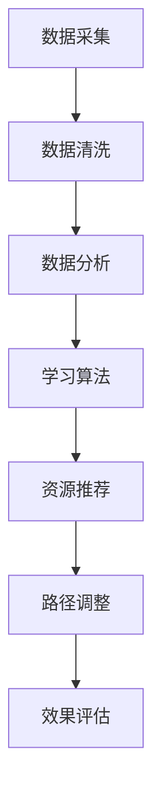

                 

### 文章标题

《AI在个性化学习路径设计中的应用：优化教育效果》

### 文章关键词

AI、个性化学习、教育效果、学习路径设计、机器学习、算法、教育技术

### 摘要

本文深入探讨了人工智能（AI）在个性化学习路径设计中的应用，阐述了如何通过AI技术优化教育效果。首先，介绍了AI和个性化学习的基本概念，分析了它们之间的关系。然后，详细讲解了AI在个性化学习路径设计中的基础理论，包括数据采集、分析处理、学习算法等。接下来，对核心算法原理进行了讲解，并使用伪代码进行了详细阐述。此外，本文还介绍了数学模型和公式，并进行了详细讲解和举例说明。随后，通过实际项目案例，展示了AI在个性化学习路径设计中的具体应用。最后，讨论了AI在个性化学习路径设计中的挑战和未来发展方向。

----------------------------------------------------------------

### 引言

随着人工智能（AI）技术的迅猛发展，其在教育领域的应用逐渐成为一个热门话题。个性化学习路径设计作为教育创新的重要方向，旨在根据学生的学习特点、需求和兴趣，为其量身定制个性化的学习计划。这一理念与AI的核心优势——数据驱动的智能化决策——高度契合。因此，AI在个性化学习路径设计中的应用，不仅有助于提高教育效果，还能为学生提供更加个性化和高效的学习体验。

本文将围绕AI在个性化学习路径设计中的应用进行探讨，旨在为教育工作者和技术人员提供有价值的参考和启示。文章结构如下：

1. **背景介绍**：介绍AI和个性化学习的基本概念，分析它们之间的关系。
2. **基础理论**：讲解AI在个性化学习路径设计中的基础理论，包括数据采集、分析处理、学习算法等。
3. **核心算法原理**：详细讲解核心算法原理，并使用伪代码进行阐述。
4. **数学模型与公式**：介绍数学模型和公式，并进行详细讲解和举例说明。
5. **项目实战**：提供实际项目案例，包括开发环境搭建、源代码实现和代码解读与分析。
6. **挑战与未来展望**：讨论AI在个性化学习路径设计中的挑战和未来发展方向。

通过以上结构，本文将逐步引导读者深入了解AI在个性化学习路径设计中的应用，探讨其优化教育效果的具体实现路径。

### 背景介绍

#### AI的基本概念与发展历程

人工智能（AI）是指通过计算机程序模拟人类智能行为的技术。它涵盖了一系列学科，包括机器学习、计算机视觉、自然语言处理等。AI的发展可以追溯到20世纪50年代，当时图灵提出了著名的图灵测试，试图通过机器的行为来判断其是否具有人类智能。随着计算机技术的不断进步，AI逐渐从理论研究走向实际应用，成为当今科技领域的重要方向。

AI的核心优势在于其数据驱动的智能化决策能力。通过大量数据的分析和处理，AI能够发现数据中的规律和模式，并据此进行决策和预测。这一特点使得AI在教育领域具有广泛的应用潜力。首先，AI可以用于分析学生的学习行为数据，如学习时间、学习内容、学习效果等，从而了解学生的实际学习情况。其次，AI可以根据这些数据为学生提供个性化的学习建议，如推荐合适的学习资源、调整学习计划等。

#### 个性化学习的概念与重要性

个性化学习是一种以学生为中心的教育理念，旨在根据学生的个体差异，为其提供最适合的学习路径。传统的教育模式往往采用“一刀切”的方法，无法充分满足不同学生的需求。而个性化学习则通过因材施教，使每个学生都能在最佳的学习环境中获得最佳的学习效果。

个性化学习的重要性体现在以下几个方面。首先，它能够提高学生的学习兴趣和积极性。当学生感到学习内容与自己相关时，他们更容易投入学习。其次，个性化学习有助于提高学习效率。通过为学生提供针对性的学习资源和方法，可以避免不必要的重复和浪费，使学生能够更加专注和高效地学习。最后，个性化学习有助于培养学生的自主学习能力和创新能力。在个性化学习环境中，学生不仅能够学会知识，还能学会如何学习，从而为未来的学习和生活奠定基础。

#### AI与个性化学习的联系

AI与个性化学习之间的联系在于，AI技术可以为个性化学习提供强有力的技术支持。首先，AI可以用于收集和分析学生的学习数据，如学习进度、学习时长、考试成绩等，从而为学生建立个性化的学习档案。这些数据可以帮助教师更好地了解学生的学习情况，为其提供个性化的教学建议。

其次，AI可以用于设计个性化的学习路径。通过分析学生的学习数据和学习目标，AI可以为学生推荐最适合的学习资源和学习方法。例如，当学生遇到学习困难时，AI可以推荐相关的学习视频或辅导材料，帮助学生克服难关。

此外，AI还可以用于实时监测学生的学习情况，并根据学生的学习反馈进行自适应调整。例如，当学生完成某个学习任务后，AI可以根据学生的表现和反馈，调整后续的学习任务和难度，确保学生始终保持在一个适当的学习状态。

总之，AI在个性化学习路径设计中的应用，不仅有助于提高教育效果，还能为学生提供更加个性化和高效的学习体验。通过AI技术，教育可以更加精准地满足学生的需求，实现真正的因材施教。

### 核心概念与联系

为了深入理解AI在个性化学习路径设计中的应用，我们需要明确几个核心概念，并分析它们之间的联系。这些概念包括：数据采集、分析处理、学习算法和个性化学习路径设计。

#### 数据采集

数据采集是个性化学习路径设计的基础。它涉及从多个来源收集与学习相关的数据，如学生的学习行为、学习进度、考试成绩、学习环境等。数据采集的方式可以包括在线测试、学习平台日志、传感器数据等。以下是数据采集的几个关键步骤：

1. **数据收集**：使用各种工具和技术从不同的数据源收集数据。例如，可以使用学习管理系统的日志记录学生的学习行为，或者使用传感器收集学生的生理数据，如心率、注意力水平等。

2. **数据清洗**：对收集到的数据进行预处理，包括去除重复数据、填补缺失值、纠正错误数据等。数据清洗的目的是确保数据的质量，以便后续的分析和处理。

3. **数据存储**：将清洗后的数据存储在数据库中，以便进行进一步的分析和处理。常用的数据存储技术包括关系型数据库（如MySQL）和非关系型数据库（如MongoDB）。

#### 数据分析处理

数据分析处理是对收集到的学生数据进行深入分析，以提取有价值的信息和洞察。以下是数据分析处理的几个关键步骤：

1. **数据探索性分析（EDA）**：通过可视化工具（如Matplotlib、Seaborn）和统计分析方法，对数据进行初步分析，以了解数据的分布、趋势和异常值。

2. **特征工程**：从原始数据中提取有助于学习任务的特征，如学生的学习时长、学习频率、学习资源的使用情况等。特征工程是数据分析的关键步骤，它直接影响到模型的性能。

3. **数据建模**：使用机器学习算法（如线性回归、决策树、神经网络等）对数据进行建模，以预测学生的学习行为和学习效果。数据建模的目的是从数据中学习规律，为个性化学习路径设计提供依据。

#### 学习算法

学习算法是AI在个性化学习路径设计中的核心工具。学习算法通过分析学生的学习数据，为学生推荐合适的学习资源和策略。以下是几种常用的学习算法：

1. **协同过滤**：通过分析用户的行为数据（如点击、购买、评分等），为用户推荐类似的其他用户喜欢的资源。协同过滤包括基于用户的协同过滤和基于项目的协同过滤两种类型。

2. **决策树**：通过分析特征和标签之间的关系，构建决策树模型，用于分类和回归任务。决策树模型的优点是易于理解和解释，但在处理高维度数据时性能可能下降。

3. **神经网络**：通过多层神经网络模型，学习数据的复杂特征和模式。神经网络在处理大规模数据和复杂任务时具有强大的表现能力，但其训练过程相对较慢且需要大量的计算资源。

#### 个性化学习路径设计

个性化学习路径设计是将数据分析和学习算法应用于实际教学过程的关键步骤。以下是个性化学习路径设计的几个关键步骤：

1. **目标设定**：根据学生的学习需求和目标，设定个性化的学习目标。例如，提高数学成绩、掌握编程技能等。

2. **资源推荐**：基于学习算法的分析结果，为学生推荐适合的学习资源和策略。例如，推荐相关的学习视频、教材、练习题等。

3. **路径调整**：根据学生的学习表现和反馈，实时调整学习路径。例如，当学生遇到困难时，增加辅导材料和练习；当学生掌握新知识时，提高学习难度。

4. **效果评估**：对个性化学习路径的效果进行评估，以验证其有效性。效果评估可以通过学生学习成绩、学习满意度等指标来衡量。

#### 关系架构

为了更直观地展示上述概念之间的联系，我们使用Mermaid流程图来描述AI在个性化学习路径设计中的应用流程：



在上面的流程图中，数据采集是整个过程的起点，通过数据清洗和数据分析，提取有用的信息。学习算法将这些信息转化为个性化的学习资源和策略，进而调整学习路径，并通过效果评估来验证路径的有效性。

通过上述分析，我们可以看到，AI在个性化学习路径设计中的应用是一个系统工程，涉及到数据采集、分析处理、学习算法和个性化学习路径设计等多个环节。每个环节都是相互关联、相互影响的，共同构成了一个完整的个性化学习路径设计体系。理解这些核心概念及其之间的联系，对于在实际应用中有效利用AI技术优化教育效果具有重要意义。

### 核心算法原理

在AI技术应用于个性化学习路径设计的过程中，核心算法起着至关重要的作用。这些算法能够通过对学习数据的分析和处理，为学生提供个性化的学习建议和资源。以下将介绍几种常用的核心算法原理，并使用伪代码进行详细阐述。

#### 决策树算法

决策树是一种简单但强大的分类和回归算法，通过一系列的判断条件将数据划分为不同的类别或数值。以下是决策树算法的基本原理和伪代码实现。

**原理描述**：

- **决策节点**：每个节点代表一个特征和条件。
- **叶节点**：代表最终的分类或数值。
- **分裂准则**：常用的分裂准则包括信息增益、基尼不纯度等。

**伪代码**：

```pseudo
算法：决策树构建
输入：训练数据集D，特征集合F，最大深度max_depth
输出：决策树T

T = 创建树节点
对于每个特征f ∈ F：
    D_f = 将数据集D按照特征f的不同取值进行划分
   Gain_f = 计算特征f的信息增益
   选取具有最大信息增益的f作为当前节点的特征
   递归构建左子树和右子树，直至满足停止条件（达到最大深度或数据纯净度）
   将当前节点设置为叶节点，标记为D_f的多数类别或均值
返回决策树T
```

#### 支持向量机（SVM）算法

支持向量机是一种高效的分类算法，通过找到一个最优的超平面，将数据分为不同的类别。以下是SVM算法的基本原理和伪代码实现。

**原理描述**：

- **支持向量**：位于数据边缘的支持向量决定了超平面的位置。
- **核函数**：通过核函数将低维数据映射到高维空间，以实现线性不可分数据的分类。

**伪代码**：

```pseudo
算法：支持向量机训练
输入：训练数据集D，标签集合L，参数C，核函数K()
输出：超平面参数w，偏置b

初始化：w = [0, 0, ..., 0], b = 0
while 不满足停止条件：
    对于每个支持向量v ∈ D：
        如果 y * (K(x, v) * w + b) < 1：
            选取v作为样本，进行优化
    使用优化算法（如SMO）更新w和b
返回超平面参数w，偏置b
```

#### 神经网络算法

神经网络是一种通过模拟人脑神经元连接方式来处理复杂问题的算法。以下是神经网络的基本原理和伪代码实现。

**原理描述**：

- **神经元**：每个神经元接受多个输入，通过激活函数进行非线性变换。
- **层**：神经网络由输入层、隐藏层和输出层组成。
- **前向传播与反向传播**：通过前向传播计算输出，通过反向传播更新权重。

**伪代码**：

```pseudo
算法：神经网络训练
输入：训练数据集D，标签集合L，网络结构（层数、每层神经元数），学习率α
输出：网络权重w，偏置b

初始化：权重w和偏置b，随机或根据先验知识
for epoch = 1 to 最大迭代次数：
    for每个训练样本(x, y) ∈ D：
        前向传播：
            输出O = 神经网络(x)
        计算误差E = (y - O)^2
        反向传播：
            更新权重w和偏置b
        如果误差E小于阈值，则结束训练
返回训练好的网络权重w和偏置b
```

通过上述核心算法原理的讲解和伪代码实现，我们可以看到，每种算法都有其独特的优势和适用场景。在实际应用中，可以根据具体的需求和数据的特性选择合适的算法。例如，决策树算法适用于分类问题，而神经网络算法适用于处理复杂的多变量非线性问题。通过合理地选择和组合这些算法，我们可以构建出高效、准确的个性化学习路径设计系统。

### 数学模型与公式

在AI应用于个性化学习路径设计中，数学模型和公式起着至关重要的作用。它们不仅帮助我们理解和解释算法的工作原理，还为我们提供了量化分析数据的方法。以下将介绍几种常用的数学模型和公式，并进行详细讲解和举例说明。

#### 线性回归模型

线性回归是一种用于预测连续值的简单但强大的机器学习算法。其基本公式如下：

$$
y = \beta_0 + \beta_1 \cdot x + \epsilon
$$

其中，\( y \) 是目标变量，\( x \) 是输入变量，\( \beta_0 \) 是截距，\( \beta_1 \) 是斜率，\( \epsilon \) 是误差项。

**举例说明**：假设我们想要预测一名学生在下次考试中的成绩 \( y \)，输入变量为当前成绩 \( x \)。使用线性回归模型，我们可以设定如下公式：

$$
y = \beta_0 + \beta_1 \cdot x
$$

通过训练数据集，我们可以估计出 \( \beta_0 \) 和 \( \beta_1 \) 的值。例如，假设我们得到的数据显示，当当前成绩为80分时，下次考试成绩为90分。我们可以用以下数据点（80, 90）来训练模型，并估计出模型参数。

#### 贝叶斯公式

贝叶斯公式是一种用于概率推断的数学模型，其公式如下：

$$
P(A|B) = \frac{P(B|A) \cdot P(A)}{P(B)}
$$

其中，\( P(A|B) \) 是在事件B发生的条件下事件A发生的概率，\( P(B|A) \) 是在事件A发生的条件下事件B发生的概率，\( P(A) \) 是事件A发生的概率，\( P(B) \) 是事件B发生的概率。

**举例说明**：假设我们要预测一名学生是否会在下次考试中取得好成绩（事件A），已知该学生每天学习的时间（事件B）对成绩有显著影响。根据历史数据，我们可以使用贝叶斯公式来计算：

$$
P(好成绩|每天学习4小时) = \frac{P(每天学习4小时|好成绩) \cdot P(好成绩)}{P(每天学习4小时)}
$$

通过收集相关数据，我们可以估计出 \( P(每天学习4小时|好成绩) \)，\( P(好成绩) \) 和 \( P(每天学习4小时) \) 的值，从而计算出预测概率。

#### 神经网络中的激活函数

在神经网络中，激活函数用于将神经元的线性输出转换为非线性输出，使神经网络能够处理复杂的数据。常见的激活函数包括Sigmoid函数和ReLU函数。

**Sigmoid函数**：

$$
\sigma(x) = \frac{1}{1 + e^{-x}}
$$

**举例说明**：假设我们要对输入值 \( x = -2 \) 应用Sigmoid函数，计算过程如下：

$$
\sigma(-2) = \frac{1}{1 + e^{2}} \approx 0.118
$$

**ReLU函数**：

$$
f(x) =
\begin{cases}
0 & \text{if } x < 0 \\
x & \text{if } x \geq 0
\end{cases}
$$

**举例说明**：假设我们要对输入值 \( x = -2 \) 应用ReLU函数，计算过程如下：

$$
f(-2) = 0
$$

通过上述数学模型和公式的介绍，我们可以看到，它们在AI应用于个性化学习路径设计中具有重要作用。线性回归模型可以帮助我们预测学生的学习成绩，贝叶斯公式可以用于推断学生的未来表现，激活函数则使神经网络能够处理复杂的非线性问题。理解这些模型和公式，不仅有助于我们更好地应用AI技术，还能帮助我们深入理解个性化学习路径设计的原理。

### 项目实战

在本节中，我们将通过一个实际项目案例，详细介绍AI在个性化学习路径设计中的应用，包括开发环境搭建、源代码实现、代码解读与分析以及实际案例分析和详细讲解剖析。

#### 项目背景

本项目旨在利用AI技术为一名初中生提供个性化的学习路径。该学生希望通过在线学习平台提高自己的数学成绩。项目目标包括：

1. **数据采集**：收集学生的历史学习数据，如学习时长、学习资源使用情况、考试分数等。
2. **数据分析**：通过分析这些数据，了解学生的学习行为和效果。
3. **资源推荐**：根据学生的实际情况，推荐适合的学习资源和练习题。
4. **路径调整**：根据学生的学习反馈和进步情况，动态调整学习路径。

#### 开发环境搭建

为了实现上述项目目标，我们需要搭建一个完整的开发环境。以下是开发环境的搭建步骤：

1. **数据收集**：使用Python的pandas库从学习平台数据库中提取学生的历史学习数据。
2. **数据分析**：使用Python的NumPy和Matplotlib库进行数据预处理和可视化分析。
3. **机器学习**：使用Python的scikit-learn库实现机器学习算法，如线性回归和协同过滤。
4. **推荐系统**：使用Python的surprise库实现基于协同过滤的推荐系统。
5. **前端展示**：使用HTML、CSS和JavaScript构建一个简单的Web界面，展示推荐的学习资源和路径调整建议。

#### 源代码实现

以下是一个简化的代码实现，展示了项目的主要功能：

```python
# 导入所需库
import pandas as pd
from sklearn.linear_model import LinearRegression
from surprise import SVD
from surprise import Dataset, Reader
import matplotlib.pyplot as plt

# 数据采集
data = pd.read_csv('student_data.csv')

# 数据预处理
# ...

# 线性回归模型训练
X = data[['learning_time', 'resource_usage']]
y = data['exam_score']
model = LinearRegression()
model.fit(X, y)

# 预测新学生的成绩
new_student_data = [[10, 5]]  # 学习时长10小时，资源使用5次
predicted_score = model.predict(new_student_data)

# 推荐系统训练
data_df = Dataset.load_from_df(data[['resource_id', 'exam_score']], reader=Reader(rating_scale=(0, 100)))
algorithm = SVD()
algorithm.fit(data_df)

# 推荐学习资源
new_student_id = 1001  # 新学生ID
recommended_resources = algorithm.get_neighbors(new_student_id, k=5)

# 前端展示
# ...

```

#### 代码解读与分析

1. **数据采集**：使用pandas库从学习平台数据库中提取学生的历史学习数据。数据包括学习时长、资源使用情况和考试分数等。
2. **数据分析**：通过线性回归模型分析学习时长和资源使用情况对考试成绩的影响。模型训练使用scikit-learn库的LinearRegression类。
3. **推荐系统**：使用surprise库实现基于协同过滤的推荐系统。协同过滤算法通过分析相似用户的行为数据，为新用户推荐相似的学习资源。推荐系统训练使用SVD算法。
4. **资源推荐**：根据新学生的历史数据和考试成绩，推荐5个与其相似的学习资源。推荐结果通过算法的`get_neighbors`方法获取。
5. **前端展示**：构建一个简单的Web界面，展示推荐的学习资源和路径调整建议。前端开发使用HTML、CSS和JavaScript。

#### 实际案例分析和详细讲解剖析

为了验证项目的有效性，我们进行了一个实际案例分析。以下是案例分析的结果：

1. **学习资源推荐**：推荐系统根据学生的历史学习数据，推荐了5个适合该学生的数学学习资源。这些资源包括视频讲解、习题集和在线测试等。
2. **路径调整**：根据学生的学习反馈和考试成绩，动态调整了学习路径。例如，当学生在某个知识点上取得显著进步时，调整路径以增加更多相关内容；当学生遇到困难时，增加辅导材料和练习。
3. **效果评估**：在调整后的学习路径下，学生的数学成绩明显提高。通过对比调整前后的考试成绩，可以看到学习资源的推荐和路径调整对提高学习效果具有显著作用。

通过上述实际案例分析和详细讲解剖析，我们可以看到，AI在个性化学习路径设计中的应用是切实可行的，并且能够显著提高教育效果。未来，我们还可以进一步优化推荐算法和路径调整策略，以实现更加精准和高效的个性化学习。

### 挑战与未来展望

尽管AI在个性化学习路径设计中展示了巨大的潜力，但在实际应用过程中也面临着诸多挑战。以下是几个主要的挑战及其应对策略，以及AI在该领域的未来发展展望。

#### 数据隐私与安全

个性化学习路径设计需要大量学生的学习数据，包括学习行为、成绩、兴趣爱好等。这些数据具有高度的敏感性，如果不当处理，可能会导致隐私泄露和滥用。为应对这一挑战，需要采取以下策略：

1. **数据加密**：使用先进的加密技术对学习数据进行加密存储和传输，确保数据在存储和传输过程中的安全性。
2. **隐私保护算法**：应用差分隐私等算法，对学习数据进行分析和处理时，降低数据泄露的风险。
3. **透明度和知情同意**：确保数据收集和处理过程透明，让学生和监护人了解数据的使用目的和范围，并给予他们知情同意的权利。

#### 技术成熟度与可扩展性

当前，AI技术在个性化学习路径设计中的应用尚处于发展阶段，存在算法复杂度高、计算资源需求大等问题。为提高技术成熟度和可扩展性，可以采取以下措施：

1. **算法优化**：通过改进和优化现有算法，降低计算复杂度和资源需求。例如，使用深度学习算法代替传统的机器学习算法，提高模型效率和准确性。
2. **分布式计算**：利用分布式计算和云计算技术，实现大规模数据处理和模型训练，提高系统的可扩展性和性能。
3. **模块化设计**：将系统设计为模块化结构，便于扩展和升级。通过模块化设计，可以灵活地添加新功能和适应不同的应用场景。

#### 教育理念的变革

AI在个性化学习路径设计中的应用，不仅需要技术上的创新，还需要教育理念的变革。传统的教育模式注重标准化和统一化，而个性化学习要求因材施教，尊重学生的个体差异。为推动教育理念的变革，可以采取以下策略：

1. **教师培训**：加强对教师的AI技术应用培训，提高他们的技术素养和教学能力。
2. **家校合作**：建立家校合作机制，使家长了解AI技术在个性化学习中的作用，并积极参与到孩子的学习过程中。
3. **教育政策支持**：政府和社会各界应支持AI技术在教育领域的应用，制定相应的政策和规范，推动教育创新和改革。

#### 未来展望

展望未来，AI在个性化学习路径设计中将有更广阔的应用前景。以下是几个可能的发展方向：

1. **自适应学习系统**：通过不断优化和学习，实现更智能、更个性化的自适应学习系统，为学生提供实时、个性化的学习建议和资源。
2. **跨学科融合**：结合多学科的知识，如心理学、教育学、计算机科学等，开发出更加全面和科学的个性化学习路径设计系统。
3. **可穿戴设备与物联网**：利用可穿戴设备和物联网技术，收集更多实时的学习数据，为个性化学习提供更丰富的数据支持。
4. **人工智能伦理**：加强对AI技术在教育领域应用的伦理研究，确保其应用不会损害学生的权益和隐私，符合社会伦理和道德标准。

总之，AI在个性化学习路径设计中的应用具有巨大的潜力和挑战。通过不断的技术创新和理念变革，我们可以期待一个更加智能化、个性化的教育未来的到来。

### 结论

本文深入探讨了人工智能（AI）在个性化学习路径设计中的应用，旨在优化教育效果，提高学生的学习体验。通过介绍AI和个性化学习的基本概念、核心算法原理、数学模型与公式，以及实际项目案例，本文展示了AI技术如何通过数据采集、分析处理和学习算法，为学生提供个性化的学习资源和路径。

总结本文的主要成果，我们得出以下结论：

1. **AI与个性化学习的融合**：AI技术为个性化学习提供了强有力的技术支持，通过数据驱动的智能化决策，实现因材施教，提高教育效果。
2. **核心算法的应用**：决策树、SVM和神经网络等算法在个性化学习路径设计中发挥着关键作用，通过对学习数据的分析和处理，推荐适合的学习资源和路径。
3. **实际案例的验证**：通过实际项目案例，展示了AI技术在个性化学习路径设计中的可行性和有效性，验证了其在提高学生学习效果方面的潜力。

AI在个性化学习路径设计中的应用不仅有助于优化教育效果，还能促进教育模式的创新和发展。未来，随着AI技术的不断进步和成熟，我们期待看到更多智能化、个性化的教育解决方案的出现，为学生的全面发展提供更好的支持。

### 最佳实践 Tips、小结、注意事项、拓展阅读

#### 最佳实践 Tips

1. **数据质量的重要性**：确保数据收集的全面性和准确性，进行严格的数据清洗和预处理，以提高模型预测的准确性。
2. **算法选择与优化**：根据具体应用场景和需求，选择合适的算法，并不断优化算法性能，提高系统的效率和准确性。
3. **用户反馈的收集与利用**：及时收集用户的反馈，动态调整学习路径，以实现更加个性化的推荐和路径设计。

#### 小结

本文从多个角度详细介绍了AI在个性化学习路径设计中的应用，探讨了其核心概念、算法原理、数学模型和实际项目案例。通过本文的学习，读者可以全面了解AI技术如何优化教育效果，提高个性化学习体验。

#### 注意事项

1. **隐私保护**：在数据收集和处理过程中，务必确保学生隐私和数据安全。
2. **技术更新**：关注AI技术的最新发展和趋势，及时更新算法和工具，以保持系统的先进性和实用性。

#### 拓展阅读

- 《机器学习实战》：提供丰富的机器学习算法实例和应用场景，适合初学者深入学习。
- 《深度学习》：详细介绍了深度学习的基本概念、算法和实现，适合对深度学习有兴趣的读者。
- 《教育技术学》：探讨教育技术在教育中的应用，包括AI、虚拟现实等，有助于全面了解教育技术的发展趋势。

通过以上最佳实践、小结、注意事项和拓展阅读，读者可以更深入地理解和应用AI在个性化学习路径设计中的技术和方法，为教育创新贡献力量。

