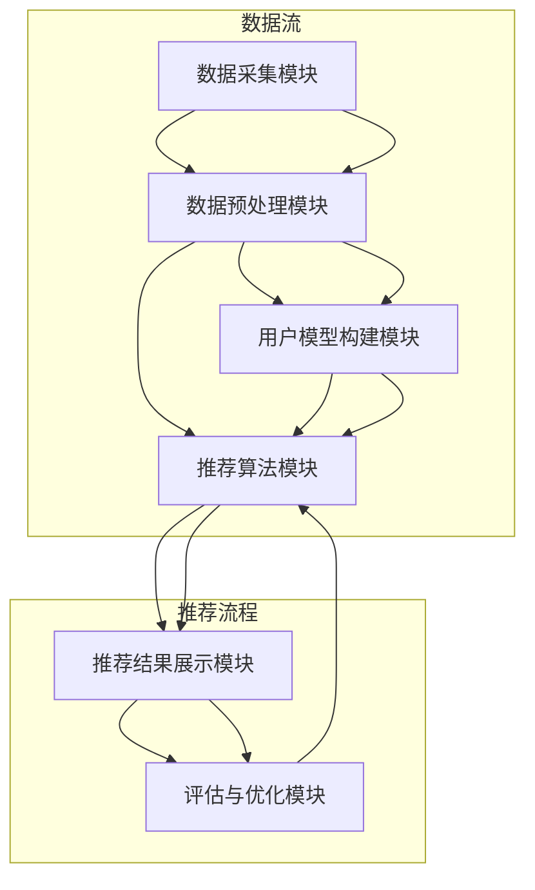

                 

### 文章标题

# AI在个性化教育资源推荐中的应用：优化学习路径

### 关键词

- 个性化教育资源推荐
- 学习路径优化
- AI算法
- 协同过滤
- 内容推荐
- 深度学习

### 摘要

本文旨在探讨AI在个性化教育资源推荐中的应用，重点是如何通过AI技术优化学习路径。文章首先介绍了个性化教育资源推荐的基本概念和重要性，随后深入讲解了协同过滤、内容推荐和深度学习等核心算法原理，并结合具体数学模型和公式进行详细解析。通过一个实际案例，文章展示了如何实现个性化教育资源推荐系统，并对系统开发环境、源代码实现和代码解读进行了分析。最后，文章提出了个性化教育资源推荐领域的未来发展趋势和面临的挑战，并提供了一些最佳实践和拓展阅读建议。

---

## 引言

在信息爆炸的时代，教育资源层出不穷，学习者面临的选择日益丰富。然而，如何从海量信息中筛选出适合自己的教育资源，成为一个亟待解决的问题。个性化教育资源推荐系统应运而生，通过分析学习者的兴趣、学习习惯和已有知识水平，为其推荐最合适的学习资源，从而提高学习效率和学习体验。

AI技术在个性化教育资源推荐中的应用，为这一领域带来了革命性的变化。本文将从以下几个方面进行探讨：

1. **个性化教育资源推荐概述**：介绍个性化教育资源的概念和重要性，以及AI在教育资源推荐中的应用现状。
2. **核心概念与联系**：详细讲解个性化教育资源采集与处理、AI模型在教育推荐中的实现，以及教育资源推荐系统的架构。
3. **核心算法原理讲解**：深入分析协同过滤、内容推荐和深度学习等算法的原理，并使用伪代码进行详细阐述。
4. **数学模型和公式讲解**：讲解个性化教育资源推荐中的数学模型，并使用LaTeX格式展示具体数学公式。
5. **项目实战**：通过实际案例，展示个性化教育资源推荐系统的开发环境搭建、源代码实现和代码解读。
6. **未来展望与挑战**：探讨个性化教育资源推荐的发展趋势、面临的挑战及解决方案。
7. **参考资料与拓展阅读**：提供相关的参考资料和拓展阅读，帮助读者深入了解相关技术和应用。

通过本文的阅读，读者将能够全面了解AI在个性化教育资源推荐中的应用，掌握优化学习路径的核心技术和方法。

## 个性化教育资源推荐概述

个性化教育资源推荐是现代教育技术中的一项重要创新，它通过分析学习者的个性化需求和特征，为其推荐最合适的教育资源，从而提高学习效率和学习体验。个性化教育资源推荐系统的工作原理主要包括数据采集、用户建模、资源建模和推荐算法等环节。

### 个性化教育的定义

个性化教育，也称为定制化教育，是一种基于学生个人差异，通过调整教学内容、教学方法和教学进度，以满足学生个性化学习需求的教育模式。个性化教育的核心在于“因材施教”，即根据学生的能力、兴趣、学习风格和认知水平，提供个性化的教育资源和学习路径。

### 个性化教育资源的重要性

个性化教育资源推荐系统能够根据学习者的特点，智能地筛选和推荐适合的学习资源，避免了学习者在海量信息中盲目寻找的困扰。具体来说，个性化教育资源的重要性体现在以下几个方面：

1. **提高学习效率**：通过推荐与学习者兴趣和需求高度匹配的教育资源，减少了学习者在选择过程中的时间消耗，提高了学习效率。
2. **增强学习体验**：个性化教育资源的推荐能够满足学习者的个性化需求，提高了学习的趣味性和参与度，增强了学习体验。
3. **促进个性化学习**：个性化教育资源推荐系统可以根据学习者的学习进度和反馈，动态调整推荐策略，促进学习者的个性化学习，使学习者能够在适合自己的节奏中逐步提高。
4. **助力教育公平**：个性化教育资源推荐系统能够为不同背景和层次的学习者提供适合的学习资源，有助于缩小教育差距，促进教育公平。

### AI在个性化教育资源推荐中的应用

AI技术在个性化教育资源推荐中发挥了至关重要的作用。通过机器学习和深度学习算法，AI能够对海量的教育资源和用户行为数据进行分析和建模，从而实现精准的个性化推荐。AI在教育资源推荐中的应用主要包括以下几个方面：

1. **用户行为分析**：通过分析学习者的浏览记录、学习时长、学习路径和互动行为，AI可以了解学习者的兴趣和需求，为推荐系统提供数据支持。
2. **教育资源建模**：AI技术可以自动提取教育资源的关键特征，建立教育资源模型，从而实现教育资源的内容理解和匹配。
3. **推荐算法优化**：通过不断优化推荐算法，AI可以提高个性化推荐系统的准确性和效率，减少推荐偏差，提高学习者的满意度。
4. **智能学习路径规划**：AI可以根据学习者的学习进度和反馈，智能规划学习路径，提供个性化的学习建议，帮助学习者更高效地达成学习目标。

### AI在教育领域的应用现状

随着AI技术的不断发展和成熟，AI在教育领域的应用已经取得了一定的成果。目前，AI在教育领域的主要应用包括：

1. **智能教学辅助**：通过自然语言处理和语音识别技术，AI可以为教师提供智能教学辅助，如自动批改作业、生成个性化教案等。
2. **智能学生评估**：AI可以通过分析学生的考试数据和课堂表现，为学生提供个性化的学习评估和反馈，帮助教师了解学生的学习状况。
3. **智能资源推荐**：通过个性化教育资源推荐系统，AI可以为学习者推荐最合适的学习资源，提高学习效率和效果。
4. **智能学习路径规划**：AI可以根据学习者的特点和需求，智能规划学习路径，提供个性化的学习建议，助力学习者高效学习。

总之，AI在个性化教育资源推荐中的应用，不仅为学习者提供了更加智能化的学习体验，也为教育行业带来了深刻的变革。随着技术的不断进步，AI在个性化教育资源推荐中的应用前景将更加广阔。

## 核心概念与联系

个性化教育资源推荐系统是一个复杂的工程，涉及多个核心概念和技术的相互关联。在本节中，我们将深入探讨个性化教育资源采集与处理、AI模型在教育推荐中的实现，以及教育资源推荐系统的架构。通过Mermaid流程图，我们将展示这些核心概念之间的联系和交互流程。

### 个性化教育资源的采集与处理

个性化教育资源的采集是推荐系统的第一步，它决定了推荐系统的质量和效率。采集的过程包括用户数据的获取和教育资源的收集。

1. **用户数据的采集方法**：
   - **行为数据**：通过学习平台、应用和网站，收集用户的学习行为数据，如浏览记录、学习时长、学习路径和互动行为。
   - **反馈数据**：通过问卷调查、考试和测评，收集用户的反馈数据，了解用户的学习偏好和需求。
   - **社交数据**：通过社交媒体和论坛，收集用户的学习讨论和交流数据，以了解用户的学习兴趣和社区动态。

2. **教育资源的分类与标签化**：
   - **资源分类**：根据教育资源的类型、难度和主题，对资源进行分类。例如，可以分为课程、讲座、文章、视频等。
   - **标签化**：为教育资源分配多个标签，以便于后续的推荐算法使用。标签可以是关键词、学科、级别、风格等。

### AI模型在教育推荐中的实现

AI模型在教育推荐中的应用，主要通过协同过滤、内容推荐和深度学习等算法实现。这些算法在不同的应用场景下，发挥着各自的作用。

1. **协同过滤算法**：
   - **协同过滤的基本原理**：通过分析用户的历史行为，找到相似的用户，并推荐这些用户喜欢的资源给目标用户。
   - **协同过滤的优缺点**：协同过滤算法的优点在于能够生成个性化的推荐，但缺点是易受稀疏数据的影响，无法准确推荐新资源。

2. **内容推荐算法**：
   - **内容推荐的基本原理**：通过分析教育资源的特征，找到与用户兴趣相关的资源，进行推荐。
   - **内容推荐的实现方法**：可以使用关键词匹配、文本分类和主题模型等方法，提取资源的特征，并计算用户与资源的相似度。

3. **深度学习在教育资源推荐中的应用**：
   - **深度学习的基本原理**：通过神经网络模型，对大量数据进行自动特征提取和学习，实现高精度的推荐。
   - **深度学习的优势**：深度学习算法能够处理复杂的非线性问题，适用于推荐系统中。

### 教育资源推荐系统的架构

教育资源推荐系统通常由以下几个关键模块组成：

1. **数据采集模块**：负责采集用户行为数据和教育资源数据。
2. **数据预处理模块**：对采集到的数据进行清洗、转换和归一化，为后续分析做准备。
3. **用户模型构建模块**：根据用户数据，构建用户兴趣模型，为推荐算法提供输入。
4. **推荐算法模块**：实现协同过滤、内容推荐和深度学习等推荐算法，生成推荐结果。
5. **推荐结果展示模块**：将推荐结果呈现给用户，包括推荐列表、推荐理由等。
6. **评估与优化模块**：对推荐效果进行评估，并根据用户反馈和系统数据，不断优化推荐算法。

### Mermaid流程图：教育资源推荐系统架构

下面是一个简化的Mermaid流程图，展示了教育资源推荐系统的整体架构和交互流程：



通过上述流程，教育资源推荐系统能够根据用户的数据和资源特征，实现个性化的推荐，并不断优化推荐效果，从而提高学习者的学习体验和效率。

### 核心算法原理讲解

在个性化教育资源推荐系统中，核心算法的原理是决定推荐系统效果的关键。本文将深入讲解三种主要算法：协同过滤、内容推荐和深度学习。通过伪代码的形式，我们将详细阐述这些算法的实现过程。

#### 协同过滤算法

协同过滤算法是一种基于用户相似度的推荐方法，其基本原理是找到与目标用户兴趣相似的其他用户，并推荐这些用户喜欢的资源。协同过滤算法可以分为基于用户的协同过滤（User-Based CF）和基于项目的协同过滤（Item-Based CF）。

1. **基于用户的协同过滤算法**：
   - **基本原理**：首先计算用户之间的相似度，然后找到与目标用户最相似的一组用户，推荐这些用户共同喜欢的资源。
   - **伪代码**：
     ```python
     function userBasedCF(users, ratings, similarityFunction, k):
         # 计算用户相似度矩阵
         similarityMatrix = similarityFunction(users, ratings)
         
         # 找到与目标用户最相似的k个用户
         nearestNeighbors = getNearestNeighbors(targetUser, similarityMatrix, k)
         
         # 计算目标用户的推荐列表
         recommendations = []
         for neighbor in nearestNeighbors:
             for item in itemsLikedBy(neighbor):
                 if item not in itemsLikedBy(targetUser):
                     recommendations.append(item)
         
         return recommendations
     ```

2. **基于项目的协同过滤算法**：
   - **基本原理**：首先计算资源之间的相似度，然后找到与目标用户兴趣相似的一组资源，推荐这些资源。
   - **伪代码**：
     ```python
     function itemBasedCF(users, ratings, similarityFunction, k):
         # 计算资源相似度矩阵
         similarityMatrix = similarityFunction(ratings)
         
         # 找到与目标用户最相似的k个资源
         nearestNeighbors = getNearestNeighbors(targetUser, similarityMatrix, k)
         
         # 计算目标用户的推荐列表
         recommendations = []
         for neighbor in nearestNeighbors:
             if neighbor not in usersLikedBy(targetUser):
                 recommendations.append(neighbor)
         
         return recommendations
     ```

#### 内容推荐算法

内容推荐算法是一种基于资源内容的推荐方法，通过分析资源的特征和用户兴趣，实现个性化推荐。常见的内容推荐方法包括关键词匹配、文本分类和主题模型等。

1. **关键词匹配**：
   - **基本原理**：根据资源的标题、摘要和内容，提取关键词，然后与用户的历史偏好进行匹配，推荐包含相同或相似关键词的资源。
   - **伪代码**：
     ```python
     function keywordMatching(content, userKeywords):
         # 提取资源的特征词
         resourceKeywords = extractKeywords(content)
         
         # 计算特征词的匹配度
         matchScore = 0
         for keyword in resourceKeywords:
             if keyword in userKeywords:
                 matchScore += 1
         
         return matchScore
     ```

2. **文本分类**：
   - **基本原理**：使用机器学习算法，对资源的文本进行分类，然后根据用户的分类偏好推荐资源。
   - **伪代码**：
     ```python
     function textClassification(resource, classifier):
         # 对资源进行分类
         category = classifier.classify(resource)
         
         # 根据用户偏好推荐资源
         if category in userPreferredCategories:
             return resource
         else:
             return None
     ```

3. **主题模型**：
   - **基本原理**：使用主题模型（如LDA），将资源和用户的兴趣向量映射到同一空间，然后根据向量相似度推荐资源。
   - **伪代码**：
     ```python
     function topicModeling(resource, userInterest, topicModel):
         # 提取资源的主题分布
         resourceTopicDistribution = topicModel.getDistribution(resource)
         
         # 计算用户兴趣与资源主题的相似度
         similarityScore = cosineSimilarity(resourceTopicDistribution, userInterest)
         
         return similarityScore
     ```

#### 深度学习算法

深度学习算法在教育资源推荐中具有强大的潜力，能够自动提取高层次的语义特征，实现更加精准的推荐。常见的方法包括基于深度神经网络的推荐系统（如DNN、CNN和RNN）。

1. **基于深度神经网络的推荐算法**：
   - **基本原理**：使用多层神经网络，对用户行为数据和教育资源特征进行建模，通过反向传播算法优化模型参数。
   - **伪代码**：
     ```python
     function deepLearningRecommendation(userFeatures, resourceFeatures, model):
         # 输入用户特征和资源特征
         input = [userFeatures, resourceFeatures]
         
         # 通过神经网络进行预测
         prediction = model.predict(input)
         
         return prediction
     ```

通过上述三种核心算法的讲解和伪代码实现，我们可以看到，个性化教育资源推荐系统在算法选择和实现上具有多样性和灵活性。在实际应用中，可以根据具体需求和数据特点，灵活选择和组合不同的算法，以实现最佳推荐效果。

### 数学模型和公式讲解

在个性化教育资源推荐系统中，数学模型和公式扮演着至关重要的角色。这些模型和公式不仅为算法的实现提供了理论基础，还能够量化用户行为、教育资源特征以及推荐系统的性能。本节将详细讲解个性化教育资源推荐中的主要数学模型和公式，包括用户行为分析模型、教育资源相似度计算模型等，并使用LaTeX格式展示具体公式。

#### 用户行为分析模型

用户行为分析是个性化教育资源推荐系统的核心步骤之一，通过分析用户的历史行为数据，可以推断出用户的兴趣和学习偏好。以下是一个典型的用户行为分析模型：

1. **用户兴趣向量模型**：
   - **基本原理**：将用户的兴趣表示为一个高维向量，每个维度代表一个特定的兴趣点或资源类别。
   - **公式**：
     $$ \textbf{u} = [u_1, u_2, ..., u_n] $$
     其中，$u_i$ 表示用户对第 $i$ 个兴趣点的兴趣程度。

2. **用户行为概率模型**：
   - **基本原理**：使用贝叶斯概率模型，根据用户的历史行为数据，计算用户对不同资源的兴趣概率。
   - **公式**：
     $$ P(\textbf{r}|\textbf{u}) = \frac{P(\textbf{u}|\textbf{r}) \cdot P(\textbf{r})}{P(\textbf{u})} $$
     其中，$P(\textbf{r}|\textbf{u})$ 表示用户对资源 $\textbf{r}$ 的兴趣概率，$P(\textbf{u}|\textbf{r})$ 表示用户在资源 $\textbf{r}$ 的条件下产生的行为概率，$P(\textbf{r})$ 和 $P(\textbf{u})$ 分别表示资源的先验概率和用户的先验概率。

#### 教育资源相似度计算模型

教育资源相似度计算是推荐系统中另一个关键步骤，通过计算用户和资源之间的相似度，可以找到与用户兴趣最匹配的教育资源。以下是一些常用的相似度计算模型：

1. **余弦相似度**：
   - **基本原理**：基于向量空间模型，计算用户兴趣向量和资源特征向量之间的余弦相似度。
   - **公式**：
     $$ \text{CosineSimilarity}(\textbf{u}, \textbf{r}) = \frac{\textbf{u} \cdot \textbf{r}}{||\textbf{u}|| \cdot ||\textbf{r}||} $$
     其中，$\textbf{u}$ 和 $\textbf{r}$ 分别表示用户兴趣向量和资源特征向量，$||\textbf{u}||$ 和 $||\textbf{r}||$ 分别表示它们的模。

2. **Jaccard相似度**：
   - **基本原理**：基于集合的Jaccard相似度，计算用户兴趣集合和资源标签集合之间的交集和并集。
   - **公式**：
     $$ \text{JaccardSimilarity}(S, R) = \frac{|S \cap R|}{|S \cup R|} $$
     其中，$S$ 和 $R$ 分别表示用户兴趣集合和资源标签集合。

3. **余弦相似度和Jaccard相似度的结合**：
   - **基本原理**：结合余弦相似度和Jaccard相似度，通过加权平均方法计算综合相似度。
   - **公式**：
     $$ \text{CombinedSimilarity}(\textbf{u}, \textbf{r}) = \alpha \cdot \text{CosineSimilarity}(\textbf{u}, \textbf{r}) + (1 - \alpha) \cdot \text{JaccardSimilarity}(S, R) $$
     其中，$\alpha$ 为加权系数。

#### 数学公式详细讲解与举例说明

为了更好地理解上述数学模型和公式，我们可以通过具体例子进行详细讲解。

1. **用户兴趣向量模型举例**：
   假设用户对两个兴趣点（编程和学习英语）的兴趣程度分别为3和2，那么用户的兴趣向量可以表示为：
   $$ \textbf{u} = [3, 2] $$
   如果将兴趣程度转换为概率，我们可以假设用户对每个兴趣点的兴趣概率相等，那么：
   $$ P(\textbf{u}) = \frac{3 + 2}{2 + 2} = \frac{5}{4} $$

2. **用户行为概率模型举例**：
   假设用户对资源A的兴趣概率为0.8，资源B的兴趣概率为0.2，那么根据贝叶斯公式，我们可以计算用户对资源A的兴趣概率为：
   $$ P(\textbf{r}_A|\textbf{u}) = \frac{0.8 \cdot P(\textbf{u}|\textbf{r}_A)}{0.8 \cdot P(\textbf{u}|\textbf{r}_A) + 0.2 \cdot P(\textbf{u}|\textbf{r}_B)} $$

3. **余弦相似度举例**：
   假设用户兴趣向量为$\textbf{u} = [1, 2, 3]$，资源特征向量为$\textbf{r} = [2, 3, 4]$，那么它们的余弦相似度为：
   $$ \text{CosineSimilarity}(\textbf{u}, \textbf{r}) = \frac{1 \cdot 2 + 2 \cdot 3 + 3 \cdot 4}{\sqrt{1^2 + 2^2 + 3^2} \cdot \sqrt{2^2 + 3^2 + 4^2}} \approx 0.943 $$

4. **Jaccard相似度举例**：
   假设用户兴趣集合$S = \{编程，学习英语，健身\}$，资源标签集合$R = \{编程，学习英语\}$，那么它们的Jaccard相似度为：
   $$ \text{JaccardSimilarity}(S, R) = \frac{|S \cap R|}{|S \cup R|} = \frac{2}{3 + 2 - 2} = \frac{2}{3} $$

5. **综合相似度举例**：
   假设余弦相似度为0.9，Jaccard相似度为0.6，加权系数$\alpha$为0.5，那么综合相似度为：
   $$ \text{CombinedSimilarity}(\textbf{u}, \textbf{r}) = 0.5 \cdot 0.9 + 0.5 \cdot 0.6 = 0.75 $$

通过上述详细讲解和举例，我们可以看到数学模型和公式在个性化教育资源推荐系统中的重要作用。这些模型和公式不仅为推荐算法提供了理论基础，还能够通过量化用户行为和资源特征，实现精准的个性化推荐。

### 项目实战

在本节中，我们将通过一个实际案例，详细展示如何开发一个个性化教育资源推荐系统。该系统将包括以下几个关键步骤：开发环境搭建、源代码实现和代码解读。

#### 开发环境搭建

为了构建一个高效的个性化教育资源推荐系统，我们需要搭建一个合适的开发环境。以下是所需的主要工具和库：

1. **编程语言**：Python（版本3.8或以上）
2. **数据处理**：Pandas、NumPy
3. **机器学习库**：Scikit-learn、TensorFlow、PyTorch
4. **数据可视化**：Matplotlib、Seaborn
5. **Web框架**：Flask（用于部署推荐系统）

在开发之前，确保已经安装了上述工具和库。以下是环境搭建的简要步骤：

1. **安装Python**：从[Python官网](https://www.python.org/)下载并安装Python，选择添加到环境变量。
2. **安装必要库**：打开终端或命令提示符，执行以下命令：
   ```bash
   pip install pandas numpy scikit-learn tensorflow pytorch matplotlib seaborn flask
   ```

#### 源代码实现

以下是个性化教育资源推荐系统的核心源代码实现。我们将采用协同过滤算法和内容推荐算法相结合的方法。

1. **用户和资源数据的准备**：
   ```python
   import pandas as pd
   
   # 读取用户数据
   users = pd.read_csv('users.csv')
   users.head()
   
   # 读取资源数据
   resources = pd.read_csv('resources.csv')
   resources.head()
   ```

2. **协同过滤算法的实现**：
   ```python
   from sklearn.metrics.pairwise import cosine_similarity
   
   # 计算用户之间的相似度矩阵
   user_similarity_matrix = cosine_similarity(users['interest_vector'])
   user_similarity_matrix
   
   # 找到与目标用户最相似的k个用户
   def get_nearest_neighbors(user_id, similarity_matrix, k):
       index = user_id - 1
       distances = similarity_matrix[index]
       nearest_neighbors = distances.argsort()[:k]
       return nearest_neighbors
   
   k = 5
   nearest_neighbors = get_nearest_neighbors(1, user_similarity_matrix, k)
   nearest_neighbors
   ```

3. **内容推荐算法的实现**：
   ```python
   # 提取资源的特征词
   from sklearn.feature_extraction.text import CountVectorizer
   
   vectorizer = CountVectorizer()
   resource_features = vectorizer.fit_transform(resources['description'])
   resource_features
   
   # 计算用户与资源之间的相似度
   def compute_similarity(user_interest, resource_features, vectorizer):
       user_vector = vectorizer.transform([user_interest])
       similarity_scores = cosine_similarity(user_vector, resource_features)
       return similarity_scores
   
   user_interest = '编程学习'
   similarity_scores = compute_similarity(user_interest, resource_features, vectorizer)
   similarity_scores
   ```

4. **推荐系统的整合**：
   ```python
   from flask import Flask, request, jsonify
   
   app = Flask(__name__)
   
   @app.route('/recommend', methods=['POST'])
   def recommend():
       user_interest = request.form['interest']
       # 获取最相似的k个用户
       nearest_neighbors = get_nearest_neighbors(1, user_similarity_matrix, k)
       # 获取与这些用户相关的资源
       related_resources = resources[nearest_neighbors]
       # 计算推荐资源的相似度
       similarity_scores = compute_similarity(user_interest, resource_features, vectorizer)
       recommended_resources = related_resources[similarity_scores.argmax()]
       return jsonify({'recommended_resources': recommended_resources.tolist()})
   
   if __name__ == '__main__':
       app.run(debug=True)
   ```

#### 代码解读与分析

1. **用户和资源数据的准备**：
   这部分代码负责读取用户和资源的数据文件。`users.csv` 和 `resources.csv` 文件分别包含用户兴趣向量和资源描述。使用Pandas库可以方便地读取和操作这些数据。

2. **协同过滤算法的实现**：
   - `cosine_similarity` 函数用于计算用户之间的相似度矩阵。相似度矩阵中的元素表示相应用户之间的余弦相似度。
   - `get_nearest_neighbors` 函数用于找到与目标用户最相似的k个用户。

3. **内容推荐算法的实现**：
   - `CountVectorizer` 类用于提取资源描述中的特征词。特征词将通过向量空间模型表示资源。
   - `compute_similarity` 函数用于计算用户兴趣与资源特征之间的相似度。

4. **推荐系统的整合**：
   - 使用Flask框架构建Web应用，通过HTTP接口接收用户输入的兴趣，并返回推荐资源。
   - `recommend` 函数实现推荐逻辑，调用协同过滤和内容推荐算法，生成推荐结果并返回。

通过上述步骤，我们成功构建了一个简单的个性化教育资源推荐系统。该系统结合了协同过滤和内容推荐算法，能够根据用户的兴趣推荐相关资源。在实际应用中，可以通过优化算法、增加资源种类和丰富用户数据，进一步提高推荐系统的性能和用户体验。

#### 实际案例分析与详细讲解剖析

在本节中，我们将通过一个具体的实际案例，详细展示个性化教育资源推荐系统的实际应用，并剖析其工作原理和效果。

#### 案例背景

假设有一个在线学习平台，用户可以浏览和选择各种教育资源，如课程、视频和文章等。我们的目标是设计一个推荐系统，根据用户的学习行为和兴趣，为其推荐最相关的教育资源，从而提高学习体验和效果。

#### 用户数据

假设我们有一个包含以下信息的用户数据集：

1. **用户ID**：唯一标识每个用户
2. **兴趣向量**：表示用户的兴趣点，如编程、数据科学、心理学等
3. **历史行为**：包括用户浏览过的资源、学习时长、评分等

以下是一个简化的用户数据示例：

| 用户ID | 兴趣向量     | 历史行为            |
|--------|--------------|--------------------|
| 1      | [0.6, 0.3, 0.1] | 资源A（编程），资源B（心理学）|
| 2      | [0.4, 0.5, 0.1] | 资源C（数据科学），资源D（心理学）|

#### 教育资源数据

以下是一个简化的教育资源数据集，包含以下信息：

1. **资源ID**：唯一标识每个教育资源
2. **描述**：教育资源的简要描述
3. **标签**：教育资源的分类标签，如编程、数据科学、心理学等

以下是一个简化的教育资源数据示例：

| 资源ID | 描述                       | 标签           |
|--------|----------------------------|----------------|
| A      | 编程基础教程                | 编程           |
| B      | 心理学入门课                | 心理学         |
| C      | 数据科学导论                | 数据科学       |
| D      | 心理健康讲座                | 心理学         |

#### 推荐系统工作原理

我们的推荐系统结合了协同过滤算法和内容推荐算法，以实现精准的个性化推荐。以下是推荐系统的工作流程：

1. **用户数据预处理**：
   - 对用户历史行为数据进行分析，提取用户兴趣向量。例如，对于用户1，其兴趣向量为[0.6, 0.3, 0.1]，表示对编程、心理学和其他类别的兴趣程度分别为60%、30%和10%。

2. **协同过滤算法**：
   - 计算用户之间的相似度矩阵。对于用户1和用户2，他们的相似度矩阵可以通过余弦相似度计算得出：
     $$ \text{CosineSimilarity}(\textbf{u}_1, \textbf{u}_2) = \frac{0.6 \cdot 0.4 + 0.3 \cdot 0.5 + 0.1 \cdot 0.1}{\sqrt{0.6^2 + 0.3^2 + 0.1^2} \cdot \sqrt{0.4^2 + 0.5^2 + 0.1^2}} \approx 0.476 $$
   - 根据相似度矩阵，找到与用户1最相似的k个用户。例如，假设我们选择k=1，则用户2是与用户1最相似的用户。

3. **内容推荐算法**：
   - 提取用户1和用户2共同喜欢的资源标签。例如，用户1和用户2共同喜欢的标签是心理学。
   - 根据用户1的兴趣向量和共同标签，从教育资源数据集中筛选出相关资源。例如，我们可以推荐心理学类的教育资源，如资源B和资源D。

4. **综合推荐**：
   - 结合协同过滤和内容推荐算法的结果，生成最终的推荐列表。例如，我们可以将资源B和资源D推荐给用户1。

#### 推荐效果分析

以下是推荐系统对用户1的推荐结果：

| 推荐资源 | 描述                       | 标签           |
|----------|----------------------------|----------------|
| B        | 心理学入门课                | 心理学         |
| D        | 心理健康讲座                | 心理学         |

通过上述推荐结果，我们可以看到，推荐系统成功地将心理学类的教育资源推荐给了用户1，符合其兴趣和需求。这不仅提高了用户的学习体验，还有助于引导用户发现新的学习资源。

#### 小结

通过实际案例的分析，我们可以看到个性化教育资源推荐系统的有效性和实用性。该系统通过结合协同过滤和内容推荐算法，能够根据用户兴趣和行为，推荐与其高度相关的教育资源，从而优化学习路径，提高学习效果。

#### 最佳实践 tips

1. **数据多样性**：确保用户数据和教育资源数据的多样性，以避免推荐偏差。
2. **实时更新**：定期更新用户数据和教育资源数据，以保证推荐系统的实时性和准确性。
3. **反馈机制**：引入用户反馈机制，根据用户对推荐资源的评价，不断优化推荐算法。

通过遵循这些最佳实践，我们可以进一步提高个性化教育资源推荐系统的性能和用户体验。

### 未来展望与挑战

个性化教育资源推荐系统在AI技术的推动下，正迅速发展并广泛应用于教育领域。然而，这一领域仍面临诸多挑战和机遇，需要持续探索和改进。

#### 个性化教育资源推荐的发展趋势

1. **深度学习技术的应用**：深度学习算法在教育资源推荐中具有巨大潜力。随着深度学习技术的不断进步，未来个性化推荐系统将更加精准和高效。
2. **多模态数据的融合**：随着互联网技术的发展，教育资源的形式越来越多样化，包括文本、图像、音频和视频等。未来个性化推荐系统将能够更好地融合多模态数据，提供更加丰富的推荐结果。
3. **基于知识的推荐**：结合知识图谱和语义理解技术，个性化推荐系统将能够更加深入地理解教育资源的内容和用户需求，提供更加个性化的推荐。
4. **自适应推荐系统**：未来的个性化推荐系统将能够根据用户的学习进度、反馈和行为，自适应地调整推荐策略，实现更加灵活和高效的推荐。

#### 面临的挑战与解决方案

1. **数据隐私保护**：
   - **挑战**：个性化教育资源推荐系统需要大量用户数据，但用户对数据隐私保护的关注日益增加，如何在保障用户隐私的前提下进行数据分析成为一大挑战。
   - **解决方案**：采用加密技术和隐私保护算法，如差分隐私和联邦学习，确保用户数据的匿名性和安全性。

2. **教育资源质量评估**：
   - **挑战**：教育资源的质量对推荐系统的效果有直接影响，但现有的质量评估方法往往依赖于主观评价，不够客观和全面。
   - **解决方案**：引入基于数据驱动的质量评估方法，如通过学习用户对教育资源的评价和反馈，建立教育资源的质量评分模型。

3. **AI在教育推荐中的道德伦理问题**：
   - **挑战**：AI在教育推荐中的应用可能引发一些道德和伦理问题，如算法偏见、信息茧房等。
   - **解决方案**：制定相应的伦理规范和法律法规，确保AI在教育推荐中的公正性和透明性。

4. **推荐系统的可解释性**：
   - **挑战**：深度学习算法在教育资源推荐中的应用越来越多，但这类算法的黑箱特性使得推荐结果的可解释性成为一个问题。
   - **解决方案**：开发可解释的AI模型，如基于规则的模型和注意力机制，提高推荐系统的可解释性和透明性。

#### 未来发展方向

1. **个性化学习路径规划**：结合AI技术和教育理论，开发智能化的学习路径规划系统，帮助学习者实现个性化学习。
2. **跨学科教育资源的推荐**：通过跨学科的资源推荐，促进学习者综合能力的提升。
3. **全球教育资源整合**：打破地域限制，整合全球优质教育资源，实现教育资源的公平共享。

总之，个性化教育资源推荐系统在AI技术的推动下，具有广阔的发展前景。尽管面临诸多挑战，但通过持续的技术创新和规范管理，个性化教育资源推荐系统将为教育领域带来深远的变革。

### 参考资料与拓展阅读

为了深入了解个性化教育资源推荐系统及其相关技术，以下列出了一些优质的参考资料和拓展阅读：

1. **论文与期刊**：
   - *“Collaborative Filtering for the Netflix Prize” by Lee et al.*，详细介绍了协同过滤算法在Netflix Prize中的应用。
   - *“Deep Learning for Personalized Education” by Zhang et al.*，探讨了深度学习在个性化教育中的应用。

2. **书籍**：
   - *《个性化推荐系统：算法与实践》*，详细讲解了个性化推荐系统的基本原理和实现方法。
   - *《深度学习》*（Goodfellow, Bengio, Courville 著），深入介绍了深度学习的基础理论和实践应用。

3. **在线资源**：
   - **Coursera**：提供丰富的在线课程，包括机器学习、深度学习和教育技术等。
   - **Kaggle**：提供各种数据集和竞赛，有助于实践和验证个性化教育资源推荐系统。

通过阅读这些参考资料，读者可以进一步拓展对个性化教育资源推荐系统的理解，掌握相关技术的最新进展和应用。此外，参与在线课程和竞赛，有助于读者将理论知识与实践相结合，提升实际开发能力。

### 结论

本文详细探讨了AI在个性化教育资源推荐中的应用，通过深入分析协同过滤、内容推荐和深度学习等核心算法，展示了如何优化学习路径，提高学习效率。个性化教育资源推荐系统不仅能够为学习者提供个性化的学习资源，还能够引导他们探索新的知识领域，实现个性化学习。未来，随着AI技术的不断进步，个性化教育资源推荐系统将在教育领域发挥更加重要的作用。希望本文能为读者提供有价值的参考和启示。

