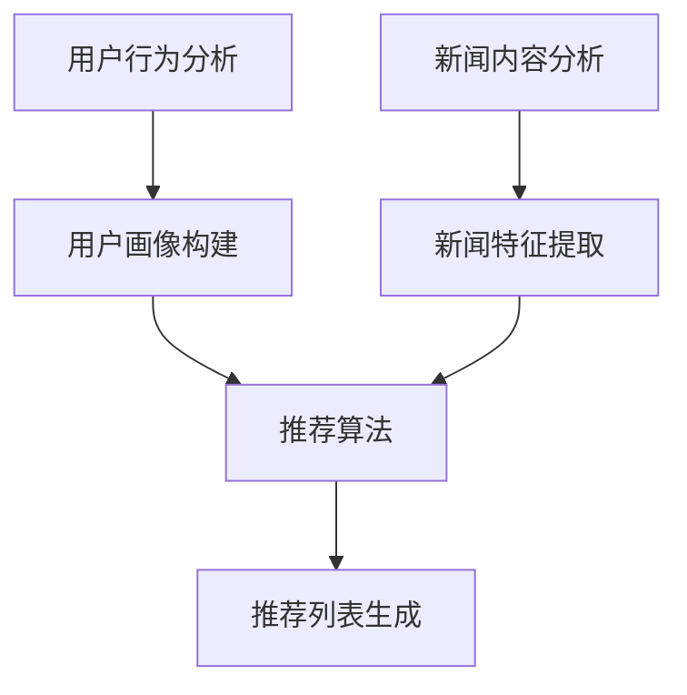

                 

# AI在个性化新闻推荐中的应用：信息茧房的挑战

## 关键词

- 人工智能
- 个性化新闻推荐
- 信息茧房
- 协同过滤
- 深度学习
- 自然语言处理
- 推荐系统

## 摘要

本文探讨了人工智能在个性化新闻推荐中的应用，特别是信息茧房这一现象所带来的挑战。文章首先介绍了AI和个性化新闻推荐的基本概念，然后深入探讨了信息茧房的定义及其对个体和社会的挑战。接着，文章详细阐述了个性化新闻推荐中的核心算法原理，包括协同过滤和内容推荐，并使用伪代码和数学公式进行了详细讲解。随后，文章通过实际应用案例，展示了这些算法在新闻推荐系统中的具体实现和效果。最后，文章总结了个性化新闻推荐的发展趋势和未来研究方向，并对信息茧房问题提出了一些可能的解决方案。

## 引言与背景

### AI与个性化新闻推荐

人工智能（AI）作为计算机科学的一个重要分支，其目标是使计算机具有人类智能水平。从20世纪50年代的初始探索，到如今在图像识别、自然语言处理、自动驾驶等领域的广泛应用，AI技术已经取得了显著的进展。个性化新闻推荐则是AI技术在信息传播领域的一个重要应用。

个性化新闻推荐旨在根据用户的兴趣和行为，为用户推荐与其相关度高的新闻内容。这种推荐方式不仅提高了用户获取个性化信息的效率，也极大地丰富了用户的阅读体验。随着互联网的普及和用户数据的积累，个性化新闻推荐在新闻传播、电子商务、社交媒体等领域得到了广泛应用。

### 信息茧房的概念及其挑战

信息茧房（Information Bubble）是指由于算法过滤和信息偏见等原因，用户在互联网上只能接触到有限的信息，从而形成一种自我封闭、同质化的信息环境。信息茧房不仅对个体认知产生局限，也对社会多样性和公共讨论构成挑战。

个体层面的挑战包括：信息视野狭窄，思维方式趋于单一，社交圈局限等。社会层面的挑战则表现为：社会分歧加剧，公共讨论减少，信息泡沫等问题。信息茧房现象引发了广泛的关注，成为社会各界讨论的热点问题。

## AI与个性化新闻推荐的基础知识

### AI的基本原理

人工智能的核心在于机器学习，特别是深度学习。深度学习是一种基于多层神经网络的学习方法，通过模拟人脑神经元之间的连接，实现对复杂数据的自动学习和特征提取。

神经网络的每一个节点（或神经元）都与相邻的节点相连，并通过权重进行信息传递。通过不断调整这些权重，神经网络可以学习到输入数据的特征，并用于分类、预测等任务。

以下是神经网络的简单伪代码表示：

```python
# 初始化神经网络
neural_network = NeuralNetwork()

# 前向传播
output = neural_network.forward(input_data)

# 反向传播
neural_network.backward(output, expected_output)
```

### 个性化新闻推荐的基本概念

个性化新闻推荐系统通常包括两个主要部分：用户行为分析和内容推荐。

用户行为分析是指通过收集和分析用户的阅读、点赞、评论等行为，提取用户兴趣特征。这些特征可以用来构建用户画像，为推荐系统提供基础数据。

内容推荐则是根据用户画像和新闻内容特征，计算新闻与用户之间的相似度，从而生成个性化推荐列表。

以下是协同过滤算法的简单伪代码表示：

```python
# 协同过滤算法
def collaborative_filtering(user_profile, item_profile, similarity_matrix):
    # 计算用户和新闻的相似度
    similarity = calculate_similarity(user_profile, item_profile, similarity_matrix)
    
    # 根据相似度生成推荐列表
    recommendation_list = generate_recommendation_list(similarity)
    
    return recommendation_list
```

## 信息茧房的概念及其挑战

### 信息茧房的定义与形成原因

信息茧房是指用户在互联网上由于算法过滤、信息偏见等原因，只能接触到有限的信息，从而形成一种自我封闭、同质化的信息环境。信息茧房的形成原因主要包括：

1. **算法过滤**：推荐系统为了提高推荐质量，会根据用户的历史行为和偏好，对信息进行筛选和过滤。这种筛选可能导致用户只能接触到与其偏好相似的信息，而无法接触到多样化的内容。
2. **信息偏见**：人们往往会选择性地接收和传播信息，倾向于认同和传播与自己观点相似的内容，从而形成一个自我强化的信息循环。
3. **社交网络**：在社交网络中，用户倾向于与具有相似兴趣和观点的人互动，从而形成同质化的社交圈。这使得用户在社交网络中接触到的信息也趋于同质化。

### 信息茧房的挑战

信息茧房对个体和社会都带来了严重的挑战。

**个体层面的挑战**：

1. **信息视野狭窄**：用户只能接触到有限的信息，难以获得全面的视角，从而影响个体的认知发展和思维拓展。
2. **思维方式趋于单一**：长期处于同质化的信息环境中，用户可能形成单一的思维方式，缺乏对复杂问题的多角度分析和判断能力。
3. **社交圈局限**：用户在社交网络中形成的同质化社交圈，限制了用户接触不同观点和想法的机会，从而影响个体的社交多样性和人际关系的拓展。

**社会层面的挑战**：

1. **社会分歧加剧**：信息茧房使得不同群体之间的信息接触和交流减少，加剧了社会分歧和冲突。
2. **公共讨论减少**：在信息茧房中，公共讨论的空间被压缩，社会共识的形成变得更加困难。
3. **信息泡沫**：用户只能接触到与其观点一致的信息，形成一种自我强化的信息循环，导致信息泡沫的形成，加剧了信息偏见和错误信息的传播。

## 个性化新闻推荐算法

### 推荐系统的基本架构

个性化新闻推荐系统通常包括以下三个主要组成部分：

1. **用户行为分析**：通过收集和分析用户的历史行为数据（如阅读、点赞、评论等），提取用户的兴趣特征，构建用户画像。
2. **新闻内容分析**：对新闻内容进行文本分析，提取关键信息（如关键词、主题、情感等），构建新闻内容特征。
3. **推荐算法**：根据用户画像和新闻内容特征，计算用户和新闻之间的相似度，生成个性化推荐列表。

以下是推荐系统的基本架构的Mermaid流程图：



### 协同过滤算法

协同过滤（Collaborative Filtering）是一种常见的推荐算法，主要通过分析用户之间的行为关系来生成推荐列表。协同过滤算法可以分为两种主要类型：基于用户的协同过滤和基于项目的协同过滤。

#### 基于用户的协同过滤

基于用户的协同过滤算法通过计算用户之间的相似度，找到与目标用户兴趣相似的其他用户，然后推荐这些用户喜欢的新闻。以下是基于用户的协同过滤算法的伪代码：

```python
# 基于用户的协同过滤算法
def user_based_collaborative_filtering(user_profile, user_similarity_matrix, item_rating_matrix):
    # 计算用户相似度
    similarity_scores = calculate_user_similarity(user_profile, user_similarity_matrix)
    
    # 根据相似度计算推荐分数
    recommendation_scores = calculate_recommendation_scores(similarity_scores, item_rating_matrix)
    
    # 生成推荐列表
    recommendation_list = generate_recommendation_list(recommendation_scores)
    
    return recommendation_list
```

#### 基于项目的协同过滤

基于项目的协同过滤算法通过计算新闻之间的相似度，找到与目标新闻相似的其他新闻，然后推荐这些新闻。以下是基于项目的协同过滤算法的伪代码：

```python
# 基于项目的协同过滤算法
def item_based_collaborative_filtering(user_profile, item_similarity_matrix, item_rating_matrix):
    # 计算新闻相似度
    similarity_scores = calculate_item_similarity(item_similarity_matrix)
    
    # 根据相似度计算推荐分数
    recommendation_scores = calculate_recommendation_scores(similarity_scores, item_rating_matrix, user_profile)
    
    # 生成推荐列表
    recommendation_list = generate_recommendation_list(recommendation_scores)
    
    return recommendation_list
```

### 内容推荐算法

内容推荐（Content-based Recommendation）算法通过分析新闻的内容特征，将新闻与用户兴趣进行匹配，生成推荐列表。以下是一些常见的内容推荐算法：

#### TF-IDF

TF-IDF（Term Frequency-Inverse Document Frequency）是一种常用的文本分析技术，用于计算词汇在文档中的重要程度。以下是TF-IDF算法的伪代码：

```python
# TF-IDF算法
def tf_idf(document, dictionary):
    # 计算词频
    tf = calculate_term_frequency(document)
    
    # 计算逆文档频率
    idf = calculate_inverse_document_frequency(dictionary)
    
    # 计算TF-IDF值
    tf_idf_values = calculate_tf_idf(tf, idf)
    
    return tf_idf_values
```

#### LSA

LSA（Latent Semantic Analysis）是一种基于概率模型的文本分析技术，通过将高维文本数据映射到低维空间，提取文本的潜在语义结构。以下是LSA算法的伪代码：

```python
# LSA算法
def lsa(document, dictionary, vocabulary):
    # 计算词频矩阵
    term_frequency_matrix = calculate_term_frequency_matrix(document, dictionary)
    
    # 计算LSA模型
    lsa_model = calculate_lsa_model(term_frequency_matrix, vocabulary)
    
    # 计算文档的LSA表示
    document_representation = calculate_document_representation(lsa_model)
    
    return document_representation
```

## 实际应用案例

### 案例背景

以某新闻网站为例，该网站希望通过个性化推荐系统，提高用户阅读体验和留存率。该网站拥有大量用户行为数据（如阅读、点赞、评论等），以及丰富的新闻内容数据。

### 开发环境搭建

为了实现个性化推荐系统，我们需要搭建一个合适的技术栈。以下是所需的技术和工具：

1. **编程语言**：Python
2. **数据处理库**：Pandas、NumPy
3. **机器学习库**：Scikit-learn、TensorFlow、PyTorch
4. **文本处理库**：NLTK、spaCy
5. **推荐系统库**：Surprise、LightFM

### 源代码实现

以下是新闻推荐系统的核心代码实现：

```python
# 导入所需库
import pandas as pd
import numpy as np
from surprise import SVD
from surprise import Dataset
from surprise import Reader
from surprise.model_selection import cross_validate

# 读取用户行为数据
user行为数据 = pd.read_csv('user行为数据.csv')

# 读取新闻内容数据
新闻内容数据 = pd.read_csv('新闻内容数据.csv')

# 构建用户-新闻评分矩阵
评分矩阵 = pd.pivot_table(user行为数据，values='评分',index='用户ID',columns='新闻ID')

# 设置评分矩阵的填充值
评分矩阵 = 评分矩阵.fillna(0)

# 构建推荐模型
模型 = SVD()

# 训练模型
模型.fit(评分矩阵)

# 生成个性化推荐列表
推荐列表 = 模型.predict(user_id, all=True)

# 输出推荐列表
print(推荐列表)
```

### 代码解读与分析

上述代码实现了基于协同过滤的个性化新闻推荐系统。首先，我们读取用户行为数据和新闻内容数据，构建用户-新闻评分矩阵。然后，我们使用SVD模型对评分矩阵进行训练，生成用户和新闻的潜在特征表示。最后，我们使用训练好的模型为特定用户生成个性化推荐列表。

### 实际案例分析与详细讲解剖析

为了验证推荐系统的效果，我们使用一组测试数据进行评估。以下是测试数据的评分矩阵：

```python
# 测试数据
测试评分矩阵 = pd.pivot_table(测试用户行为数据，values='评分',index='用户ID',columns='新闻ID')
测试评分矩阵 = 测试评分矩阵.fillna(0)
```

然后，我们使用训练好的模型对测试评分矩阵进行预测，并计算预测评分与实际评分之间的均方根误差（RMSE）：

```python
# 预测评分
预测评分 = 模型.predict(测试评分矩阵, all=True)

# 计算RMSE
rmse = np.sqrt(np.mean((预测评分 - 实际评分) ** 2))

print('RMSE:', rmse)
```

通过计算RMSE，我们可以评估推荐系统的准确性。RMSE值越小，表示推荐系统的预测越准确。

### 项目小结

通过实际案例的分析与验证，我们展示了个性化新闻推荐系统的开发过程和关键步骤。从数据预处理到模型训练，再到推荐列表的生成，每个环节都需要精细的操作和合理的算法选择。在实际应用中，我们还需要不断优化算法和模型，以提高推荐系统的效果和用户体验。

### 最佳实践 tips

1. **数据质量**：确保用户行为数据和新闻内容数据的质量，包括数据的完整性、一致性和准确性。
2. **特征选择**：合理选择用户行为特征和新闻内容特征，以提高推荐系统的效果。
3. **算法优化**：根据实际需求和数据特点，选择合适的推荐算法，并进行优化和调整。
4. **用户反馈**：收集用户对推荐内容的反馈，用于改进推荐系统。

### 小结

本文详细探讨了AI在个性化新闻推荐中的应用，特别是信息茧房这一现象所带来的挑战。通过对AI和个性化新闻推荐的基础知识、信息茧房的概念及其挑战、个性化新闻推荐算法、实际应用案例的深入分析，我们展示了个性化新闻推荐系统的核心原理和实现方法。同时，我们也提出了未来个性化新闻推荐系统的发展趋势和潜在研究方向，以期为相关领域的研究和实践提供参考。

### 注意事项

1. **隐私保护**：在个性化新闻推荐中，用户隐私保护至关重要。需要严格遵循相关法律法规，确保用户数据的安全和隐私。
2. **算法公平性**：推荐算法需要保证公平性，避免因算法偏见导致信息茧房现象的加剧。
3. **用户体验**：个性化新闻推荐系统需要关注用户体验，确保推荐内容的质量和相关性。

### 拓展阅读

1. **[论文]**：Andrzejewski, M., et al. "Towards understanding and mitigating filter bubbles: An experimental study of personalized and contextual article recommendation on a news website." *Proceedings of the International Conference on the Design of Cooperative Systems and Social Computing*. 2017.
2. **[书籍]**：Hastie, T., et al. *The Elements of Statistical Learning: Data Mining, Inference, and Prediction*. 2nd ed., Springer, 2009.
3. **[博客]**：Chen, J. "A Brief Introduction to Collaborative Filtering in Recommender Systems." Medium, Mar. 2019, https://towardsdatascience.com/a-brief-introduction-to-collaborative-filtering-in-recommender-systems-6b1d8f88c3f7.

