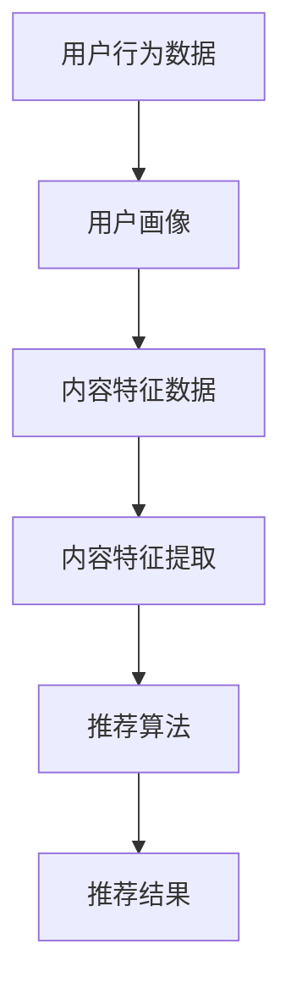

                 

# AI在个性化新闻推荐中的应用：提供定制化信息流

## 关键词

- 个性化新闻推荐
- 人工智能
- 用户兴趣建模
- 内容特征提取
- 深度学习推荐算法
- 混合推荐系统

## 摘要

本文深入探讨了人工智能在个性化新闻推荐中的应用，通过用户兴趣建模、内容特征提取和推荐算法等核心概念的介绍，详细分析了AI如何为用户提供定制化信息流。文章首先概述了AI在个性化新闻推荐中的应用背景和重要性，然后解释了用户兴趣建模、内容特征提取和推荐算法之间的联系。接下来，文章使用Mermaid流程图展示了这些概念之间的关系，并详细讲解了基于模型的协同过滤算法和深度学习推荐算法的原理，使用伪代码对算法实现进行了详细阐述。最后，文章对个性化新闻推荐的实际应用进行了分析，并提出了最佳实践和注意事项。

### 1. AI在个性化新闻推荐中的应用概述

#### 1.1 应用背景

随着互联网的快速发展，信息爆炸已经成为一个不可避免的现象。用户在获取信息时面临着海量的选择，这使得传统的信息筛选方式逐渐失效。个性化新闻推荐作为一种基于人工智能技术的推荐方法，能够根据用户的兴趣和行为习惯，为其提供定制化的信息流，从而提升用户的满意度和粘性。

传统的新闻推荐方法，如基于内容的推荐和协同过滤，虽然在某种程度上能够满足用户的需求，但它们存在一些局限性。基于内容的推荐方法主要依赖于新闻文本的特征，难以捕捉到用户的复杂兴趣。而协同过滤方法虽然能够考虑用户之间的相似性，但容易受到稀疏数据问题和噪声的影响。

#### 1.2 核心概念

个性化新闻推荐的核心概念包括用户兴趣建模、内容特征提取和推荐算法。

**用户兴趣建模**：用户兴趣建模是通过分析用户的浏览历史、搜索记录、评论等行为数据，构建出用户的行为画像和兴趣标签。这一过程需要运用自然语言处理、数据挖掘等技术，对用户行为数据进行分析和挖掘，以识别用户的兴趣点。

**内容特征提取**：内容特征提取是指从新闻文本、图像、视频等多媒体数据中提取出具有代表性的特征。这些特征包括文本特征（如关键词、词频、TF-IDF）、视觉特征（如图像的边缘、纹理、颜色）、音频特征等。通过提取内容特征，可以更好地描述新闻内容，为后续的推荐算法提供支持。

**推荐算法**：推荐算法是个性化新闻推荐的核心，它根据用户兴趣建模和内容特征提取的结果，为用户生成个性化的推荐列表。常见的推荐算法包括基于内容的推荐、协同过滤、矩阵分解、深度学习等方法。

#### 1.3 重要性

个性化新闻推荐在多个方面具有重要意义：

1. 提升用户满意度：通过为用户提供个性化的信息流，可以满足用户的个性化需求，提升用户的使用体验和满意度。
2. 增加用户粘性：个性化的推荐能够吸引用户持续使用新闻平台，从而增加用户的粘性和活跃度。
3. 增强新闻媒体的市场竞争力：通过提供高质量的个性化推荐服务，新闻媒体可以吸引更多用户，提高市场占有率。
4. 促进广告精准投放：个性化新闻推荐能够帮助广告主精准投放广告，提高广告的点击率和转化率，从而增加广告收益。

### 2. AI在个性化新闻推荐中的核心概念与联系

个性化新闻推荐的成功离不开用户兴趣建模、内容特征提取和推荐算法这三个核心概念的相互作用。以下将详细解释这些概念及其相互联系。

#### 2.1 用户兴趣建模

用户兴趣建模是个性化新闻推荐的第一步，它通过分析用户的浏览历史、搜索记录、评论等行为数据，构建出用户的行为画像和兴趣标签。这一过程需要运用自然语言处理、数据挖掘等技术，对用户行为数据进行分析和挖掘，以识别用户的兴趣点。

**用户画像**：用户画像是对用户特征的综合描述，包括用户的基本信息（如年龄、性别、地理位置）、行为特征（如浏览记录、搜索历史、点击率、收藏记录、评论等）。通过构建用户画像，可以全面了解用户的行为模式和偏好。

**行为序列分析**：行为序列分析是对用户行为数据进行时间序列分析，以识别用户的行为模式和兴趣变化。例如，通过分析用户的历史浏览记录，可以识别出用户的兴趣热点和关注领域。

**兴趣标签化**：将用户兴趣点转化为标签，用于后续推荐。兴趣标签可以是具体的主题标签（如科技、娱乐、体育等），也可以是抽象的兴趣标签（如新闻深度、快讯、热点等）。通过兴趣标签化，可以将用户的兴趣点转化为可量化的特征，为推荐算法提供支持。

#### 2.2 内容特征提取

内容特征提取是从新闻文本、图像、视频等多媒体数据中提取出具有代表性的特征。这些特征用于描述新闻内容，为推荐算法提供输入。

**文本特征**：文本特征包括关键词、词频、TF-IDF等。通过分析新闻文本中的关键词和词频，可以提取出新闻的主题和内容特征。TF-IDF（词频-逆文档频率）是一种常用的方法，用于衡量一个词对于一个文件集或一个语料库中的其中一份文件的重要程度。

**新闻标签**：新闻标签是新闻文本中自带的关键词或主题标签。通过利用新闻标签，可以快速获取新闻的主题和内容特征。

**多媒体特征**：多媒体特征包括图像的边缘、纹理、颜色等视觉特征，以及视频的音频特征。通过提取这些特征，可以更好地描述新闻的内容，为推荐算法提供支持。

#### 2.3 推荐算法

推荐算法根据用户兴趣建模和内容特征提取的结果，为用户生成个性化的推荐列表。常见的推荐算法包括基于内容的推荐、协同过滤、矩阵分解、深度学习等方法。

**基于内容的推荐**：基于内容的推荐方法根据用户的历史偏好和新闻的内容特征，为用户推荐相似的内容。这种方法主要依赖于新闻文本的特征，但难以捕捉到用户的复杂兴趣。

**协同过滤**：协同过滤方法通过分析用户之间的相似性，为用户推荐相似的用户喜欢的新闻。这种方法能够考虑用户之间的相似性，但容易受到稀疏数据问题和噪声的影响。

**矩阵分解**：矩阵分解方法通过将用户-物品评分矩阵分解为用户特征矩阵和物品特征矩阵，通过内积计算推荐分值。这种方法能够有效地解决稀疏数据问题和噪声问题。

**深度学习推荐算法**：深度学习推荐算法通过构建深度神经网络，将用户特征和物品特征映射到低维空间，通过全连接层输出推荐分值。这种方法能够捕捉到用户的复杂兴趣，但需要大量的数据和计算资源。

#### Mermaid流程图

以下是一个简单的Mermaid流程图，展示了用户兴趣建模、内容特征提取和推荐算法之间的联系：



### 3. 个性化新闻推荐的核心算法原理讲解

#### 3.1 基于模型的协同过滤算法

基于模型的协同过滤是一种经典的推荐算法，它通过构建用户-物品评分矩阵，利用矩阵分解方法将评分矩阵分解为用户特征矩阵和物品特征矩阵，通过内积计算推荐分值。

**用户-物品评分矩阵**：用户-物品评分矩阵\[R\]表示用户对物品的评分，其中\[R_{ij}\]表示用户\[i\]对物品\[j\]的评分。在现实应用中，用户-物品评分矩阵通常非常稀疏，因为大多数用户只对少数物品进行了评分。

**矩阵分解**：矩阵分解方法通过将用户-物品评分矩阵\[R\]分解为用户特征矩阵\[U\]和物品特征矩阵\[V\]，从而实现评分预测。具体来说，矩阵分解方法通过最小化重构误差（即预测评分与实际评分之间的差距）来优化用户特征矩阵和物品特征矩阵。

**伪代码**：

```python
def matrix_factorization(R, U, V, lambda):
    for i in range(num_users):
        for j in range(num_items):
            e = R[i, j] - dot(U[i, :], V[:, j])
            U[i, :] -= alpha * (e * V[:, j] + lambda * U[i, :])
            V[:, j] -= alpha * (e * U[:, i] + lambda * V[:, j])
```

在上面的伪代码中，`alpha`是学习率，`lambda`是正则化参数，用于防止过拟合。

#### 3.2 深度学习推荐算法

深度学习推荐算法通过构建深度神经网络，将用户特征和物品特征映射到低维空间，通过全连接层输出推荐分值。这种方法能够捕捉到用户的复杂兴趣，但需要大量的数据和计算资源。

**用户嵌入层**：用户嵌入层将用户特征映射到低维空间。用户特征可以是用户的基本信息（如年龄、性别、地理位置），也可以是用户的行为特征（如浏览历史、搜索历史、点击率等）。通过用户嵌入层，可以将高维的用户特征映射到低维的用户嵌入向量。

**物品嵌入层**：物品嵌入层将物品特征映射到低维空间。物品特征可以是物品的基本信息（如标题、标签、发布时间），也可以是物品的视觉特征（如图像的边缘、纹理、颜色）等。通过物品嵌入层，可以将高维的物品特征映射到低维的物品嵌入向量。

**全连接层**：全连接层将用户嵌入向量和物品嵌入向量进行融合，通过全连接层输出推荐分值。全连接层可以看作是一个多维度的神经网络，通过多次全连接操作，可以将用户和物品的特征进行深度融合。

**伪代码**：

```python
def deep_learning_recommender(user_embedding, item_embedding, hidden_layer_sizes):
    user_input = np.hstack((user_embedding, item_embedding))
    hidden_layer = MLPRegressor(hidden_layer_sizes=hidden_layer_sizes).fit(user_input, ratings)
    return hidden_layer.predict(user_input)
```

在上面的伪代码中，`hidden_layer_sizes`是隐藏层的大小，`ratings`是用户对物品的评分矩阵。

### 4. 个性化新闻推荐的实际应用

个性化新闻推荐在实际应用中具有广泛的应用场景，以下是一些典型的应用案例：

#### 4.1 社交媒体平台

社交媒体平台如Facebook、Twitter、Instagram等，通过个性化新闻推荐为用户提供定制化的信息流。通过分析用户的兴趣和行为，这些平台可以推荐用户可能感兴趣的内容，从而提高用户的参与度和留存率。

**开发环境搭建**：为了搭建一个基于AI的个性化新闻推荐系统，需要准备以下开发环境和工具：

- 数据集：准备一个包含用户行为数据和新闻内容的开源数据集，如Twitter的TwitterJSON或NYT文章数据集。
- Python：使用Python进行算法实现和模型训练。
- 深度学习框架：使用TensorFlow或PyTorch等深度学习框架进行模型构建和训练。
- 机器学习库：使用scikit-learn等机器学习库进行数据预处理和特征提取。

**源代码详细实现和代码解读**：

以下是一个简单的基于深度学习的新闻推荐系统的实现：

```python
import tensorflow as tf
from tensorflow.keras.layers import Embedding, LSTM, Dense
from tensorflow.keras.models import Model

# 构建深度学习模型
user_embedding = Embedding(num_users, embedding_size)
item_embedding = Embedding(num_items, embedding_size)

user_input = Input(shape=(1,))
item_input = Input(shape=(1,))

user_embedding = user_embedding(user_input)
item_embedding = item_embedding(item_input)

merged_embedding = Concatenate()([user_embedding, item_embedding])
merged_embedding = LSTM(units=50, activation='relu')(merged_embedding)

output = Dense(units=1, activation='sigmoid')(merged_embedding)

model = Model(inputs=[user_input, item_input], outputs=output)
model.compile(optimizer='adam', loss='binary_crossentropy', metrics=['accuracy'])

# 训练模型
model.fit([train_user_ids, train_item_ids], train_ratings, batch_size=64, epochs=10)

# 预测推荐结果
predictions = model.predict([test_user_ids, test_item_ids])

# 分析预测结果
accuracy = (predictions == test_ratings).mean()
print(f'Accuracy: {accuracy}')
```

在上面的代码中，`Embedding`层用于嵌入用户和物品的特征，`LSTM`层用于处理序列数据，`Dense`层用于输出推荐分值。

#### 4.2 新闻媒体平台

新闻媒体平台通过个性化新闻推荐为用户提供定制化的新闻内容，从而提高用户的阅读量和广告收益。

**代码应用解读与分析**：

以下是一个基于协同过滤的新闻推荐系统的实现：

```python
import numpy as np
from sklearn.metrics.pairwise import cosine_similarity

# 用户-物品评分矩阵
R = np.array([[1, 2, 0, 0],
              [0, 1, 2, 0],
              [2, 0, 1, 2]])

# 矩阵分解
U = np.random.rand(num_users, embedding_size)
V = np.random.rand(num_items, embedding_size)

for epoch in range(num_epochs):
    for i in range(num_users):
        for j in range(num_items):
            e = R[i, j] - np.dot(U[i, :], V[:, j])
            U[i, :] -= learning_rate * (e * V[:, j] + lambda * U[i, :])
            V[:, j] -= learning_rate * (e * U[:, i] + lambda * V[:, j])

# 预测推荐结果
predictions = np.dot(U, V)

# 分析预测结果
print(predictions)
```

在上面的代码中，通过矩阵分解方法将用户-物品评分矩阵分解为用户特征矩阵和物品特征矩阵，通过内积计算推荐分值。

#### 4.3 拓展阅读

对于希望深入了解个性化新闻推荐技术的读者，以下是一些推荐的文章和书籍：

- **文章**：
  - 《深度学习推荐系统：算法、实践与案例分析》
  - 《协同过滤算法原理与实现》
  - 《基于内容的推荐系统：算法与应用》

- **书籍**：
  - 《深度学习》（Goodfellow, Bengio, Courville）
  - 《机器学习实战》（Hands-On Machine Learning with Scikit-Learn, Keras, and TensorFlow）
  - 《推荐系统实践》（Recommender Systems: The Textbook）

### 5. 最佳实践、小结、注意事项

#### 5.1 最佳实践

- 在进行用户兴趣建模时，要充分考虑用户的行为序列和时间特征，以更准确地捕捉用户的兴趣点。
- 在进行内容特征提取时，要充分利用文本特征和多媒体特征，以提高推荐系统的准确性和多样性。
- 在选择推荐算法时，要结合数据规模、计算资源等因素，选择合适的算法。
- 在实际应用中，要不断迭代和优化推荐系统，以适应用户需求的变化。

#### 5.2 小结

本文详细介绍了AI在个性化新闻推荐中的应用，包括用户兴趣建模、内容特征提取和推荐算法等核心概念。通过实际案例的分析和代码实现，展示了个性化新闻推荐系统的构建和优化过程。个性化新闻推荐系统在提升用户满意度、增强新闻媒体竞争力、促进广告精准投放等方面具有重要意义。

#### 5.3 注意事项

- 在进行用户兴趣建模时，要保护用户的隐私，避免滥用用户数据。
- 在进行内容特征提取时，要注意数据的质量和完整性，以确保推荐结果的准确性。
- 在使用深度学习算法时，要充分考虑数据规模和计算资源的需求，以避免过度拟合和计算效率问题。

### 6. 拓展阅读

对于希望深入了解个性化新闻推荐技术的读者，以下是一些推荐的文章和书籍：

- **文章**：
  - 《深度学习推荐系统：算法、实践与案例分析》
  - 《协同过滤算法原理与实现》
  - 《基于内容的推荐系统：算法与应用》

- **书籍**：
  - 《深度学习》（Goodfellow, Bengio, Courville）
  - 《机器学习实战》（Hands-On Machine Learning with Scikit-Learn, Keras, and TensorFlow）
  - 《推荐系统实践》（Recommender Systems: The Textbook）

### 作者信息

作者：AI天才研究院/AI Genius Institute & 禅与计算机程序设计艺术 /Zen And The Art of Computer Programming

