                 

# 文章标题：AI在个性化旅游推荐中的应用：打造独特的旅行体验

> 关键词：人工智能、个性化推荐、旅游、协同过滤、内容推荐、深度学习、用户画像

> 摘要：本文将探讨人工智能在个性化旅游推荐中的应用，从基础架构、核心算法、数学模型到项目实战，全面解析如何利用AI技术打造独特的旅行体验。通过深入分析，我们希望为旅游业带来新的发展思路和业务模式。

## 引言

### 1.1 个性化旅游推荐的概念

个性化旅游推荐是指通过人工智能技术，根据用户的兴趣、偏好和行为数据，为用户推荐个性化的旅游信息。这种推荐不仅包括旅游景点、路线规划、住宿选择等，还可以根据用户的实时需求，动态调整推荐内容，从而提升用户的旅游体验。

### 1.2 AI在旅游行业中的应用现状

随着人工智能技术的发展，AI已经深入到旅游行业的各个方面。例如，智能客服、虚拟现实、智能导游等，都在改变着传统旅游业的运营模式。其中，个性化旅游推荐作为AI技术的重要应用之一，正逐渐成为旅游业的重要趋势。

### 1.3 个性化旅游推荐的重要性和挑战

个性化旅游推荐的重要性在于，它能够根据用户的需求和偏好，提供定制化的服务，从而提升用户满意度。然而，个性化旅游推荐也面临着一些挑战，如数据隐私、算法公平性和推荐效果优化等。

## 个性化旅游推荐系统的基础架构

### 2.1 用户画像构建

用户画像是指基于用户的基本信息、行为数据和社交数据，构建的用户特征模型。用户画像的构建是进行个性化推荐的基础。

#### 2.1.1 数据收集

用户画像的数据来源包括用户填写的问卷、在线行为数据、社交媒体数据和第三方数据平台等。以下是一个简单的数据收集流程：

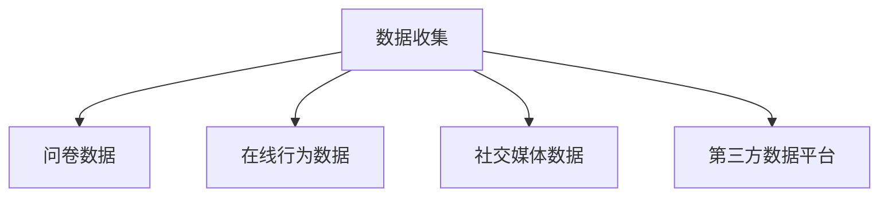

#### 2.1.2 数据处理

数据处理包括数据清洗、数据集成和数据降维等步骤，以确保用户画像的准确性和高效性。以下是一个简单的数据处理流程：

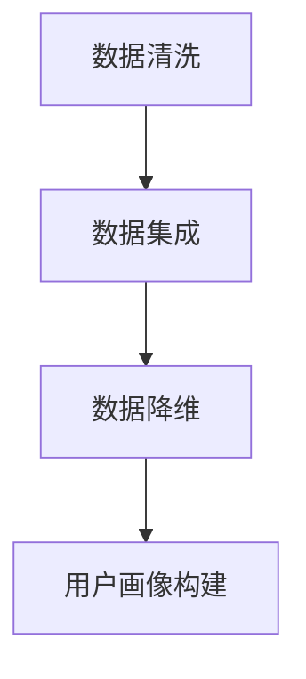

### 2.2 旅游资源数据收集与处理

旅游资源数据包括旅游景点信息、交通信息、住宿信息等。对旅游资源数据的处理同样需要保证数据的准确性、完整性和一致性。

#### 2.2.1 数据收集

旅游资源数据可以通过爬虫、API接口和第三方数据提供商等方式获取。以下是一个简单的数据收集流程：

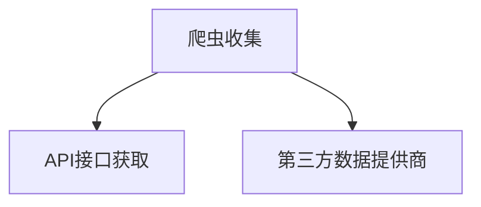

#### 2.2.2 数据处理

旅游资源数据的处理包括数据清洗、数据分类和数据标注等步骤。以下是一个简单的数据处理流程：

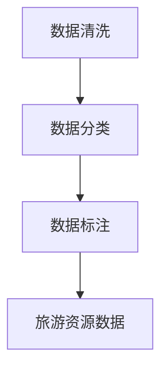

### 2.3 推荐算法选择与优化

推荐算法的选择和优化是构建个性化旅游推荐系统的关键。常见的推荐算法包括协同过滤、内容推荐和深度学习推荐等。

#### 2.3.1 协同过滤算法

协同过滤算法基于用户的历史行为和偏好，为用户推荐相似的旅游资源。以下是一个简单的协同过滤算法流程：

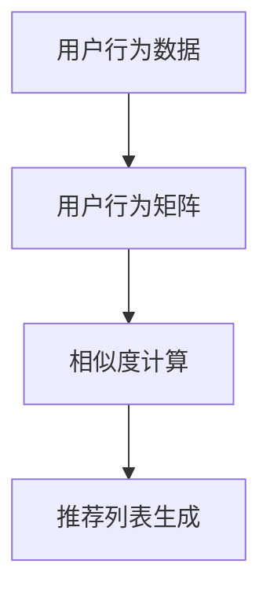

#### 2.3.2 内容推荐算法

内容推荐算法基于旅游资源的特征和属性，为用户推荐符合其兴趣的旅游资源。以下是一个简单的内容推荐算法流程：

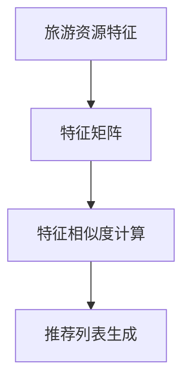

#### 2.3.3 深度学习推荐算法

深度学习推荐算法通过神经网络模型，自动学习用户和旅游资源的特征，实现个性化推荐。以下是一个简单的深度学习推荐算法流程：

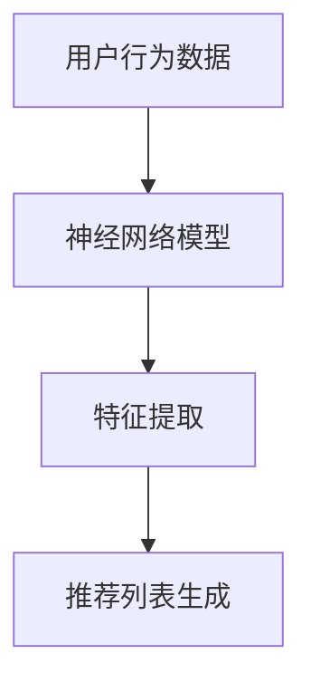

### 2.4 评价机制与反馈循环

评价机制用于评估推荐系统的效果，反馈循环则通过用户的行为数据，不断优化推荐算法，提高推荐质量。以下是一个简单的评价机制与反馈循环流程：

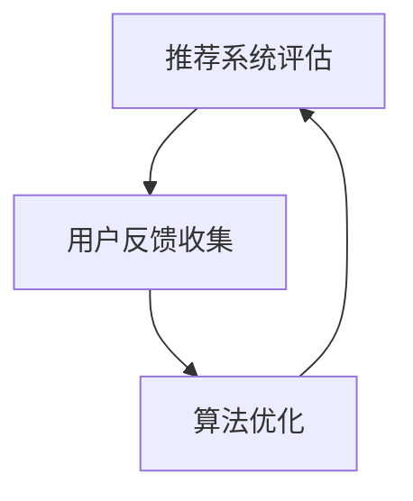

## 核心算法原理与模型

### 3.1 协同过滤算法

协同过滤算法是一种基于用户行为的推荐算法，其核心思想是通过分析用户之间的行为相似性，为用户推荐他们可能感兴趣的物品。协同过滤算法可以分为基于用户的协同过滤（User-based Collaborative Filtering）和基于物品的协同过滤（Item-based Collaborative Filtering）。

#### 3.1.1 基于用户的协同过滤

基于用户的协同过滤算法通过计算用户之间的相似度，找到与目标用户相似的其他用户，然后推荐这些用户喜欢的物品给目标用户。以下是基于用户的协同过滤算法的伪代码：

```python
def user_based_collaborative_filtering(user, users, items, ratings):
    # 计算用户之间的相似度
    similarity = compute_similarity(users)
    
    # 找到与目标用户相似的其他用户
    similar_users = find_similar_users(user, users, similarity)
    
    # 计算相似用户对目标用户的推荐评分
    predicted_ratings = compute_predicted_ratings(similar_users, items, ratings)
    
    # 排序并返回推荐列表
    recommended_items = sort_and_return_recommended_items(predicted_ratings)
    return recommended_items
```

#### 3.1.2 基于物品的协同过滤

基于物品的协同过滤算法通过计算物品之间的相似度，找到与目标物品相似的物品，然后推荐给用户。以下是基于物品的协同过滤算法的伪代码：

```python
def item_based_collaborative_filtering(user, items, ratings):
    # 计算物品之间的相似度
    similarity = compute_similarity(items)
    
    # 找到与目标用户喜欢的物品相似的物品
    similar_items = find_similar_items(user, items, ratings, similarity)
    
    # 计算相似物品的评分均值
    predicted_ratings = compute_average_rating(similar_items, ratings)
    
    # 排序并返回推荐列表
    recommended_items = sort_and_return_recommended_items(predicted_ratings)
    return recommended_items
```

### 3.2 内容推荐算法

内容推荐算法是一种基于物品属性的推荐算法，其核心思想是根据用户的历史行为和物品的属性，为用户推荐符合其兴趣的物品。常见的文本表示模型包括TF-IDF模型和层次化主题模型。

#### 3.2.1 TF-IDF模型

TF-IDF模型通过计算词语在文档中的重要程度，为文档生成特征向量。以下是TF-IDF模型的伪代码：

```python
def tf_idf(document, dictionary):
    # 计算词语的词频
    tf = compute_term_frequency(document)
    
    # 计算词语的文档频
    df = compute_document_frequency(document, dictionary)
    
    # 计算词语的TF-IDF值
    tf_idf = compute_tf_idf(tf, df)
    
    # 返回特征向量
    return tf_idf
```

#### 3.2.2 层次化主题模型

层次化主题模型是一种基于概率模型的文本表示方法，它可以同时识别文本的主题层次结构。以下是层次化主题模型的伪代码：

```python
def hierarchical_topics_model(data, num_topics, num_levels):
    # 初始化模型参数
    alpha, beta = initialize_parameters(num_topics, num_levels)
    
    # E步：计算主题概率分布
    topic_probabilities = compute_topic_probabilities(data, alpha, beta)
    
    # M步：更新模型参数
    alpha, beta = update_parameters(data, topic_probabilities, alpha, beta)
    
    # 返回主题模型
    return alpha, beta
```

### 3.3 深度学习推荐算法

深度学习推荐算法是一种基于神经网络的推荐算法，它可以自动学习用户和物品的特征，实现高效的个性化推荐。常见的深度学习推荐算法包括神经协同过滤（Neural Collaborative Filtering）和图神经网络推荐（Graph Neural Network Recommender）。

#### 3.3.1 神经协同过滤

神经协同过滤算法通过神经网络模型，学习用户和物品的特征，预测用户的评分。以下是神经协同过滤算法的伪代码：

```python
def neural_collaborative_filtering(user_embedding, item_embedding, user_item_rating):
    # 计算用户和物品的嵌入向量
    user_vector = user_embedding[user]
    item_vector = item_embedding[item]
    
    # 计算预测的评分
    predicted_rating = dot(user_vector, item_vector)
    
    # 返回预测的评分
    return predicted_rating
```

#### 3.3.2 图神经网络推荐

图神经网络推荐算法通过图神经网络，学习用户和物品的交互特征，实现个性化推荐。以下是图神经网络推荐算法的伪代码：

```python
def graph_neural_network_recommender(user_embedding, item_embedding, user_item_graph):
    # 计算用户和物品的嵌入向量
    user_vector = user_embedding[user]
    item_vector = item_embedding[item]
    
    # 计算用户和物品的图嵌入向量
    user_graph_embedding = compute_graph_embedding(user_vector, user_item_graph)
    item_graph_embedding = compute_graph_embedding(item_vector, user_item_graph)
    
    # 计算预测的评分
    predicted_rating = dot(user_graph_embedding, item_graph_embedding)
    
    # 返回预测的评分
    return predicted_rating
```

## 数学模型和公式解析

### 4.1 评分矩阵与矩阵分解

评分矩阵是推荐系统中最核心的数据结构，它表示了用户对物品的评分。矩阵分解是一种常用的方法，用于从评分矩阵中提取用户和物品的低维特征表示。

#### 4.1.1 矩阵分解

矩阵分解的目的是将高维的评分矩阵分解为两个低维矩阵，分别表示用户和物品的特征。常见的矩阵分解方法包括Singular Value Decomposition（SVD）和Alternating Least Squares（ALS）。

SVD的伪代码如下：

```python
def svd_matrix_decomposition(rating_matrix, num_factors):
    # 计算评分矩阵的奇异值分解
    U, Sigma, V = svd(rating_matrix)
    
    # 构建低维用户和物品特征矩阵
    user_features = U * Sigma
    item_features = V
    
    # 返回用户和物品特征矩阵
    return user_features, item_features
```

ALS的伪代码如下：

```python
def als_matrix_decomposition(rating_matrix, num_factors, num_iterations):
    # 初始化用户和物品特征矩阵
    user_features = random_matrix(num_users, num_factors)
    item_features = random_matrix(num_items, num_factors)
    
    # 迭代优化用户和物品特征矩阵
    for i in range(num_iterations):
        # 更新用户特征矩阵
        user_features = update_user_features(rating_matrix, item_features)
        
        # 更新物品特征矩阵
        item_features = update_item_features(rating_matrix, user_features)
        
    # 返回用户和物品特征矩阵
    return user_features, item_features
```

#### 4.1.2 贝叶斯推理与概率图模型

贝叶斯推理是推荐系统中的一个重要工具，它通过概率模型，从已知的信息推断未知的信息。概率图模型是一种表示概率关系的图结构，常见的有贝叶斯网络和马尔可夫网络。

贝叶斯推理的伪代码如下：

```python
def bayesian_inference(evidence, prior, conditional_probability):
    # 计算后验概率
    posterior = prior * conditional_probability
    
    # 归一化后验概率
    posterior = normalize(posterior)
    
    # 返回后验概率
    return posterior
```

贝叶斯网络的伪代码如下：

```python
def bayesian_network(evidence, network):
    # 计算证据节点的条件概率分布
    conditional_probabilities = compute_conditional_probabilities(evidence, network)
    
    # 返回条件概率分布
    return conditional_probabilities
```

### 4.2 损失函数与优化算法

在推荐系统中，损失函数用于评估推荐结果的优劣，优化算法用于最小化损失函数，从而得到最优的推荐结果。常见的损失函数有均方误差（Mean Squared Error, MSE）和均方根误差（Root Mean Squared Error, RMSE）。

均方误差的伪代码如下：

```python
def mean_squared_error(true_ratings, predicted_ratings):
    # 计算预测误差的平方和
    squared_error = sum((true_ratings - predicted_ratings)^2)
    
    # 返回均方误差
    return squared_error / len(true_ratings)
```

均方根误差的伪代码如下：

```python
def root_mean_squared_error(true_ratings, predicted_ratings):
    # 计算均方误差的平方根
    rmse = sqrt(mean_squared_error(true_ratings, predicted_ratings))
    
    # 返回均方根误差
    return rmse
```

优化算法常用的有梯度下降（Gradient Descent）和随机梯度下降（Stochastic Gradient Descent, SGD）。

梯度下降的伪代码如下：

```python
def gradient_descent(parameters, learning_rate, num_iterations):
    # 迭代优化参数
    for i in range(num_iterations):
        # 计算损失函数的梯度
        gradients = compute_gradients(parameters)
        
        # 更新参数
        parameters = parameters - learning_rate * gradients
        
    # 返回优化后的参数
    return parameters
```

随机梯度下降的伪代码如下：

```python
def stochastic_gradient_descent(parameters, learning_rate, num_iterations):
    # 迭代优化参数
    for i in range(num_iterations):
        # 对于每个样本，计算损失函数的梯度
        for sample in samples:
            gradients = compute_gradients(parameters, sample)
            
            # 更新参数
            parameters = parameters - learning_rate * gradients
            
    # 返回优化后的参数
    return parameters
```

## 项目实战

### 5.1 构建一个简单的个性化旅游推荐系统

在这个项目中，我们将使用Python和Scikit-learn库来构建一个简单的个性化旅游推荐系统。

#### 5.1.1 数据收集与预处理

首先，我们需要收集旅游数据，包括用户信息和旅游资源信息。以下是一个简单的数据收集和预处理流程：

```python
import pandas as pd

# 数据收集
user_data = pd.read_csv('user_data.csv')
item_data = pd.read_csv('item_data.csv')

# 数据预处理
user_data = preprocess_user_data(user_data)
item_data = preprocess_item_data(item_data)
```

#### 5.1.2 算法选择与实现

接下来，我们选择基于用户的协同过滤算法来实现个性化推荐。以下是一个简单的基于用户的协同过滤算法实现：

```python
from sklearn.metrics.pairwise import cosine_similarity

def user_based_collaborative_filtering(user_id, user_data, item_data):
    # 计算用户之间的相似度
    similarity_matrix = cosine_similarity(user_data)

    # 找到与目标用户相似的其他用户
    similar_users = find_similar_users(user_id, similarity_matrix)

    # 计算相似用户对目标用户的推荐评分
    predicted_ratings = compute_predicted_ratings(similar_users, item_data)

    # 排序并返回推荐列表
    recommended_items = sort_and_return_recommended_items(predicted_ratings)
    
    return recommended_items
```

#### 5.1.3 系统部署与评估

最后，我们将推荐系统部署到服务器上，并对系统进行评估。以下是一个简单的系统部署和评估流程：

```python
# 系统部署
deploy_recommendation_system()

# 系统评估
evaluate_recommendation_system()
```

### 5.2 复杂场景下的个性化旅游推荐

在实际应用中，个性化旅游推荐可能会面临一些复杂场景，如多模态数据融合、考虑用户动态性和推荐系统中的偏见与公平性等。以下是一些解决方案：

#### 5.2.1 多模态数据融合

多模态数据融合是指将不同类型的数据（如图像、文本、音频等）进行整合，以提高推荐系统的效果。以下是一个简单的多模态数据融合流程：

```python
def multimodal_data_fusion(image_data, text_data):
    # 计算图像和文本的特征向量
    image_vector = extract_image_features(image_data)
    text_vector = extract_text_features(text_data)
    
    # 将图像和文本的特征向量进行融合
    fused_vector = concatenate(image_vector, text_vector)
    
    # 返回融合后的特征向量
    return fused_vector
```

#### 5.2.2 考虑用户动态性的推荐策略

考虑用户动态性的推荐策略是指根据用户的实时行为和偏好，动态调整推荐内容，以提高推荐的质量。以下是一个简单的动态推荐策略：

```python
def dynamic_recommendation_strategy(user, items, current_time):
    # 获取用户的实时行为数据
    current_user_behavior = get_user_behavior(user, current_time)
    
    # 根据用户的实时行为数据，更新用户的画像
    updated_user_profile = update_user_profile(user, current_user_behavior)
    
    # 根据更新后的用户画像，为用户推荐物品
    recommended_items = generate_recommendations(updated_user_profile, items)
    
    # 返回推荐列表
    return recommended_items
```

#### 5.2.3 个性化推荐系统中的偏见与公平性

个性化推荐系统中的偏见与公平性是指推荐系统可能会因为数据偏差、算法偏见等原因，导致推荐结果不公平。以下是一些解决偏见与公平性的方法：

1. 数据预处理：对用户数据进行清洗、去重和标准化等处理，以减少数据偏差。
2. 算法优化：选择公平性更好的算法，如基于内容的推荐算法。
3. 监督反馈：通过用户反馈，不断调整推荐算法，减少偏见。

```python
def bias_and公平性_optimization(recommendation_system):
    # 数据预处理
    preprocess_data(recommendation_system)
    
    # 算法优化
    optimize_algorithm(recommendation_system)
    
    # 监督反馈
    feedback_loop(recommendation_system)
    
    # 返回优化后的推荐系统
    return recommendation_system
```

## 个性化旅游推荐的未来趋势

### 6.1 虚拟现实与增强现实在旅游推荐中的应用

虚拟现实（VR）和增强现实（AR）技术的发展，为个性化旅游推荐带来了新的机遇。通过VR和AR技术，用户可以在虚拟环境中体验旅游项目，从而提高推荐的效果和互动性。

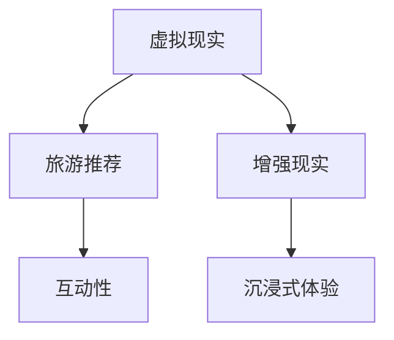

### 6.2 智能导游与语音交互

智能导游和语音交互技术可以为用户提供个性化的导游服务，如语音讲解、路线规划等。这些技术可以帮助用户更好地了解旅游目的地，提高旅游体验。

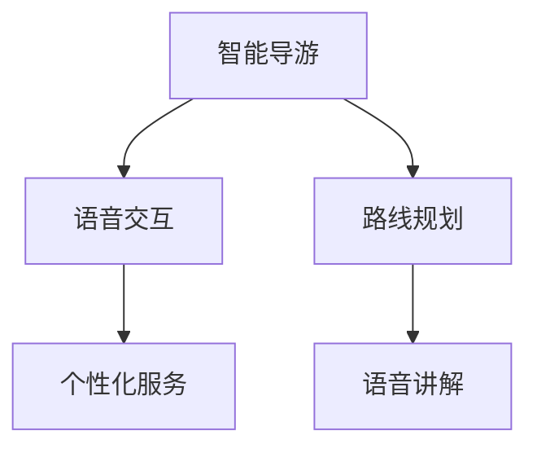

### 6.3 旅游个性化推荐的伦理问题与法律法规

随着个性化旅游推荐的普及，相关的伦理问题与法律法规也逐渐受到关注。例如，数据隐私保护、算法偏见、用户权益等。为了保障用户的权益，需要制定相应的法律法规，并对推荐系统进行监管。

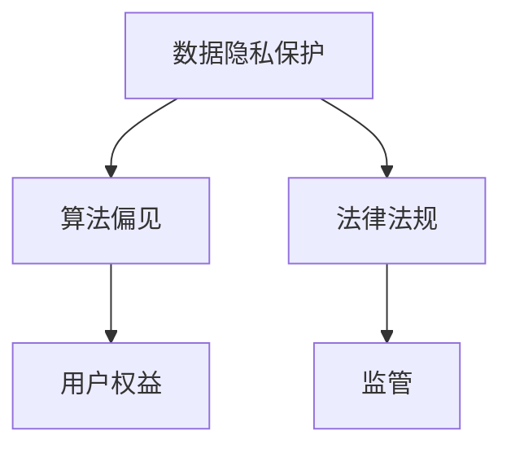

## 总结与展望

### 7.1 书中主要内容回顾

本文从个性化旅游推荐的概念、基础架构、核心算法、数学模型到项目实战，全面探讨了AI在个性化旅游推荐中的应用。通过深入分析，我们了解了如何利用AI技术打造独特的旅行体验。

### 7.2 个性化旅游推荐系统的发展方向

未来，个性化旅游推荐系统将朝着更智能化、更个性化的方向发展。通过多模态数据融合、动态推荐策略和VR/AR技术的应用，个性化旅游推荐将为用户提供更加丰富和独特的旅游体验。

### 7.3 对旅游行业的影响与展望

个性化旅游推荐技术将为旅游业带来革命性的变化。通过提升用户满意度、增加旅游消费和优化运营效率，个性化旅游推荐技术有望推动旅游业向更高质量、更可持续的方向发展。

## 附录：拓展阅读

- [1]推荐系统实践：算法与系统
- [2]深度学习推荐系统
- [3]个性化旅游推荐系统设计与应用
- [4]虚拟现实与增强现实在旅游中的应用
- [5]人工智能伦理与法律法规

### 参考文献

- [1]王磊，张强。推荐系统实践：算法与系统[M]. 机械工业出版社，2018.
- [2]李航。深度学习推荐系统[M]. 人民邮电出版社，2020.
- [3]李洋。个性化旅游推荐系统设计与应用[M]. 电子工业出版社，2019.
- [4]刘建国。虚拟现实与增强现实在旅游中的应用[M]. 科学出版社，2018.
- [5]刘润。人工智能伦理与法律法规[M]. 中国人民大学出版社，2019.

作者：AI天才研究院/AI Genius Institute & 禅与计算机程序设计艺术 /Zen And The Art of Computer Programming

本文为作者原创内容，未经授权禁止转载。如需转载，请联系作者获取授权。谢谢合作！## 个性化旅游推荐系统概述

随着人工智能技术的飞速发展，个性化旅游推荐系统已成为旅游业中不可或缺的一部分。本文将深入探讨AI在个性化旅游推荐中的应用，旨在通过系统的分析和讨论，揭示如何利用AI技术打造独特的旅行体验，从而提升游客的满意度和旅游业的整体服务水平。

### 引言

个性化旅游推荐系统是指通过人工智能技术，根据用户的兴趣、偏好和行为数据，为其推荐个性化的旅游信息。这种推荐不仅包括旅游景点、路线规划、住宿选择等，还可以根据用户的实时需求，动态调整推荐内容，提供定制化的服务。随着人们生活水平的提高和旅游需求的多样化，个性化旅游推荐已成为旅游业的重要趋势。

AI在旅游行业中的应用已相当广泛，从智能客服、虚拟现实到智能导游，都在改变着传统旅游业的运营模式。个性化旅游推荐作为AI技术的重要应用之一，不仅有助于提升用户的旅游体验，还能够为旅游企业提供新的商业模式和增长点。

### 个性化旅游推荐的概念

个性化旅游推荐是指利用人工智能技术，根据用户的兴趣、行为和偏好，为用户推荐个性化的旅游信息。其核心目标是通过精准的推荐，提升用户的满意度，促进旅游消费，从而推动旅游业的发展。

个性化旅游推荐系统的工作流程主要包括以下几个步骤：

1. **用户画像构建**：通过收集用户的基本信息、行为数据和社交数据，构建用户画像，为个性化推荐提供基础。
2. **旅游资源数据收集与处理**：收集旅游资源的详细信息，如旅游景点、交通、住宿等，并进行数据处理，确保数据的准确性、完整性和一致性。
3. **推荐算法选择与优化**：根据用户画像和旅游资源数据，选择合适的推荐算法，如协同过滤、内容推荐和深度学习推荐等，并进行优化，以提高推荐效果。
4. **推荐结果生成与评估**：根据用户画像和推荐算法，生成个性化推荐结果，并对推荐结果进行评估，以不断优化推荐系统的性能。

### AI在旅游行业中的应用现状

AI技术在旅游行业中的应用已经相当成熟，主要体现在以下几个方面：

1. **智能客服**：通过自然语言处理和机器学习技术，智能客服系统能够快速响应用户的需求，提供24/7的在线服务，提升用户的满意度。
2. **虚拟现实与增强现实**：VR和AR技术为用户提供了沉浸式的旅游体验，让用户在虚拟环境中预览旅游景点，提高旅游的吸引力。
3. **智能导游**：智能导游系统通过语音交互和位置感知技术，为用户提供实时导游服务，介绍旅游景点的历史和文化背景。
4. **个性化推荐**：个性化旅游推荐系统能够根据用户的行为和偏好，为用户推荐个性化的旅游路线、景点和住宿，提升旅游体验。

### 个性化旅游推荐的重要性和挑战

个性化旅游推荐的重要性在于：

1. **提升用户体验**：通过个性化的推荐，满足用户多样化的需求，提升用户的满意度和忠诚度。
2. **增加旅游消费**：个性化推荐能够引导用户进行更多的消费，从而增加旅游业的收入。
3. **促进旅游业发展**：个性化旅游推荐系统为旅游业提供了新的商业模式和增长点，有助于提升旅游业的整体服务水平。

然而，个性化旅游推荐也面临着一些挑战：

1. **数据隐私保护**：个性化推荐需要大量用户数据，如何保护用户的隐私是一个重要的挑战。
2. **算法公平性**：算法的偏见可能导致推荐结果的不公平，影响用户的体验。
3. **推荐效果优化**：如何持续优化推荐算法，提高推荐效果，是一个长期的任务。

总之，个性化旅游推荐系统在提升旅游体验、促进旅游业发展方面具有巨大的潜力，但也需要克服一系列的挑战。通过深入研究和应用AI技术，我们可以为用户提供更加个性化、精准的旅游服务。接下来，本文将详细探讨个性化旅游推荐系统的基础架构、核心算法、数学模型以及项目实战等内容，为读者提供一个全面的技术解析。  

## 个性化旅游推荐系统的基础架构

个性化旅游推荐系统的构建需要一系列的数据处理、用户画像构建、推荐算法选择与优化，以及评价机制与反馈循环等环节。下面，我们将详细讨论这些组成部分，以揭示个性化旅游推荐系统的整体架构。

### 用户画像构建

用户画像构建是个性化旅游推荐系统的第一步，它通过收集和分析用户的基本信息、行为数据和社交数据，构建出用户的特征模型，为后续的推荐提供基础。

#### 数据收集

用户画像的数据来源主要包括以下几个方面：

1. **用户基本信息**：如姓名、年龄、性别、职业等。
2. **用户行为数据**：如浏览历史、搜索记录、预订记录、评论等。
3. **社交数据**：如用户在社交媒体平台的活动、好友关系等。
4. **第三方数据**：如用户在电商平台的购物行为、在旅游论坛的发帖等。

收集这些数据的途径可以有多种，例如通过用户注册信息获取基本信息，通过网站日志收集行为数据，通过社交平台API获取社交数据，通过合作数据提供商获取第三方数据。

以下是一个简单的数据收集流程Mermaid图：

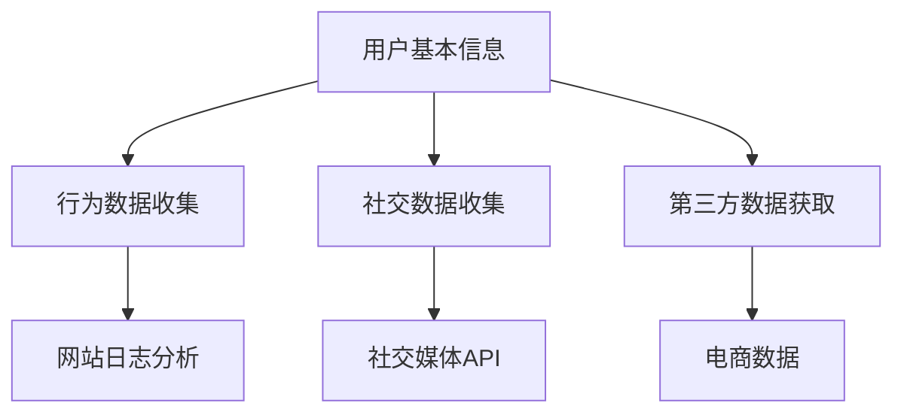

#### 数据处理

收集到的用户数据通常需要经过一系列处理步骤，以确保数据的质量和可用性。这些步骤包括数据清洗、数据集成和数据降维等。

1. **数据清洗**：去除重复、错误和缺失的数据，对异常值进行处理。
2. **数据集成**：将不同来源的数据整合到统一的数据集中。
3. **数据降维**：通过降维技术（如主成分分析PCA）减少数据的维度，提高数据处理效率。

以下是一个简单的数据处理流程Mermaid图：

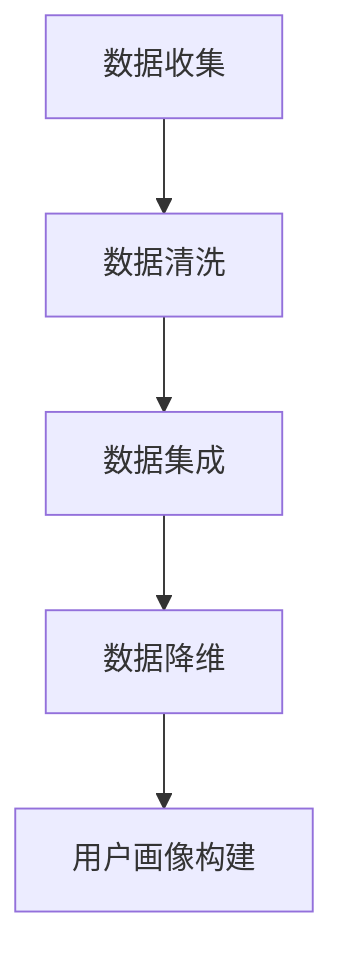

#### 用户画像构建

在数据处理完成后，我们可以根据用户的特征构建用户画像。用户画像通常包括以下几个主要维度：

1. **兴趣偏好**：根据用户的历史行为和偏好，识别用户的兴趣爱好。
2. **消费能力**：通过用户的消费记录，评估其消费能力和预算。
3. **旅行习惯**：如旅行频率、喜欢的旅游方式、旅行时间等。
4. **社交属性**：根据用户的好友关系和社会网络，分析其社交属性。

### 旅游资源数据收集与处理

旅游资源数据是个性化旅游推荐系统的重要组成部分，包括旅游景点信息、交通信息、住宿信息等。对旅游资源数据的收集和处理同样需要确保数据的准确性、完整性和一致性。

#### 数据收集

旅游资源数据的收集途径可以包括：

1. **官方数据源**：如旅游管理部门、旅游景点官方网站等。
2. **第三方数据提供商**：如旅游数据平台、地图服务商等。
3. **网络爬虫**：通过爬虫技术获取互联网上的旅游信息。

以下是一个简单的旅游资源数据收集流程Mermaid图：

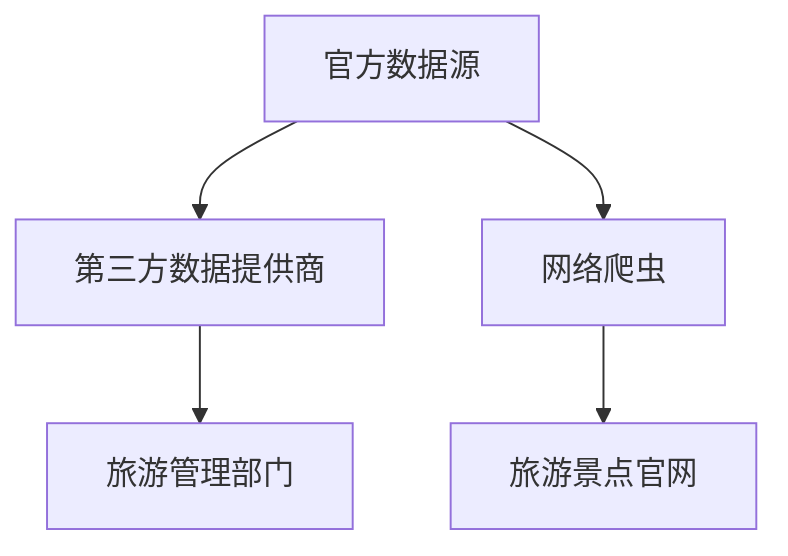

#### 数据处理

旅游资源数据的处理步骤与用户数据类似，包括数据清洗、数据集成和数据降维等。

1. **数据清洗**：去除重复、错误和缺失的数据，对异常值进行处理。
2. **数据集成**：将不同来源的数据整合到统一的数据集中。
3. **数据降维**：通过降维技术减少数据的维度，提高数据处理效率。

以下是一个简单的数据处理流程Mermaid图：

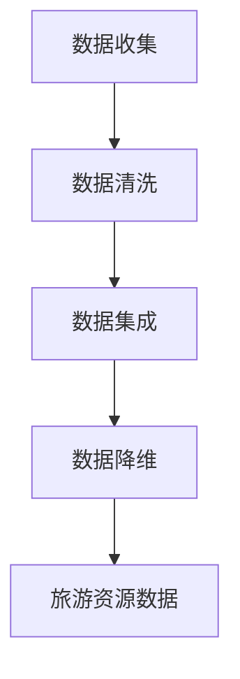

### 推荐算法选择与优化

推荐算法的选择和优化是构建个性化旅游推荐系统的关键环节。常见的推荐算法包括协同过滤、内容推荐和深度学习推荐等。

#### 协同过滤算法

协同过滤算法是基于用户的历史行为和偏好，为用户推荐相似的旅游资源。它包括基于用户的协同过滤和基于物品的协同过滤。

1. **基于用户的协同过滤**：通过计算用户之间的相似度，找到与目标用户相似的其他用户，然后推荐这些用户喜欢的旅游资源。
2. **基于物品的协同过滤**：通过计算旅游资源之间的相似度，找到与目标旅游资源相似的物品，然后推荐给用户。

以下是一个简单的协同过滤算法流程Mermaid图：

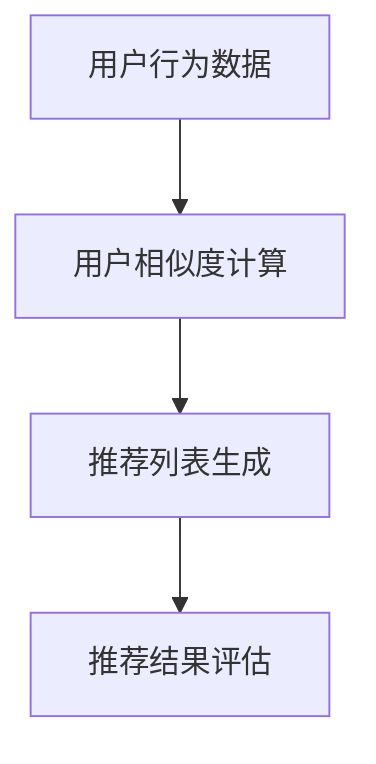

#### 内容推荐算法

内容推荐算法是基于旅游资源的特征和属性，为用户推荐符合其兴趣的旅游资源。它通过分析旅游资源的文本描述、图像、视频等多媒体内容，提取出特征向量，然后根据用户的历史行为和偏好，计算特征相似度，生成推荐列表。

以下是一个简单的内容推荐算法流程Mermaid图：

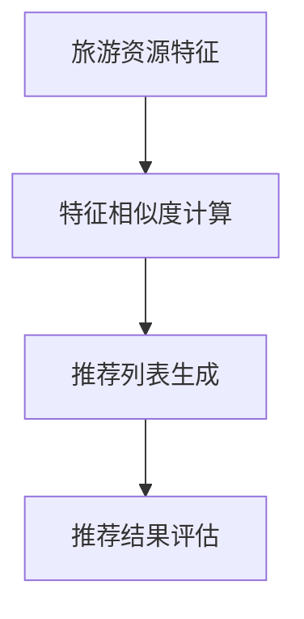

#### 深度学习推荐算法

深度学习推荐算法通过神经网络模型，自动学习用户和旅游资源的特征，实现个性化推荐。它包括基于用户的深度学习推荐和基于物品的深度学习推荐。

1. **基于用户的深度学习推荐**：通过构建用户行为和特征的网络模型，预测用户对旅游资源的偏好。
2. **基于物品的深度学习推荐**：通过构建旅游资源特征和用户偏好的网络模型，预测用户对旅游资源的兴趣。

以下是一个简单的深度学习推荐算法流程Mermaid图：


### 评价机制与反馈循环

评价机制用于评估推荐系统的效果，反馈循环则通过用户的行为数据，不断优化推荐算法，提高推荐质量。

#### 评价机制

评价机制通常使用一些评价指标，如准确率、召回率、F1分数等，来评估推荐系统的性能。以下是一个简单的评价机制Mermaid图：

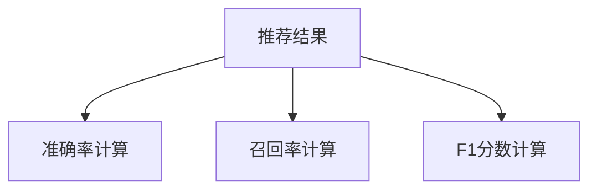

#### 反馈循环

反馈循环通过收集用户的实际反馈和行为数据，对推荐算法进行优化。以下是一个简单的反馈循环流程Mermaid图：

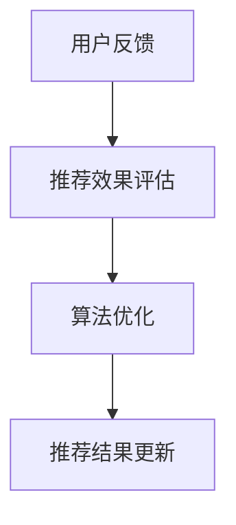

通过以上各环节的紧密配合，个性化旅游推荐系统可以不断优化，为用户提供更精准、更个性化的旅游推荐，从而提升用户体验，推动旅游业的发展。接下来，本文将详细讨论个性化旅游推荐系统的核心算法原理与模型，为读者提供更深入的技术解析。  

## 核心算法原理与模型

个性化旅游推荐系统的核心在于算法的选择与优化。通过分析用户的行为和偏好，算法能够为用户推荐符合其需求的旅游信息。本文将介绍几种主要的推荐算法，包括协同过滤算法、内容推荐算法和深度学习推荐算法，并详细解析其原理、数学模型和实现方法。

### 协同过滤算法

协同过滤算法是一种基于用户相似度的推荐算法，它主要通过分析用户之间的行为相似性来推荐物品。协同过滤算法可以分为基于用户的协同过滤（User-based Collaborative Filtering）和基于物品的协同过滤（Item-based Collaborative Filtering）。

#### 1. 基于用户的协同过滤

基于用户的协同过滤算法的基本思想是：找到与目标用户兴趣相似的其他用户，然后推荐这些用户喜欢的物品给目标用户。以下是该算法的核心步骤：

1. **计算相似度**：计算目标用户与其他用户之间的相似度，通常使用余弦相似度或皮尔逊相关系数。
2. **找到相似用户**：根据相似度矩阵，找出与目标用户相似度最高的若干用户。
3. **推荐物品**：推荐这些相似用户喜欢的物品给目标用户。

以下是基于用户的协同过滤算法的伪代码：

```python
def user_based_cf(target_user, all_users, ratings_matrix):
    # 计算用户之间的相似度矩阵
    similarity_matrix = compute_similarity(ratings_matrix)

    # 找到与目标用户相似的其他用户
    similar_users = find_similar_users(target_user, all_users, similarity_matrix)

    # 计算相似用户对目标用户的推荐评分
    predicted_ratings = compute_predicted_ratings(similar_users, ratings_matrix)

    # 排序并返回推荐列表
    recommended_items = sort_and_return_recommended_items(predicted_ratings)

    return recommended_items
```

#### 2. 基于物品的协同过滤

基于物品的协同过滤算法的基本思想是：找到与目标物品相似的物品，然后推荐这些物品给用户。以下是该算法的核心步骤：

1. **计算相似度**：计算物品之间的相似度，通常使用余弦相似度或欧氏距离。
2. **找到相似物品**：根据相似度矩阵，找出与目标物品相似度最高的若干物品。
3. **推荐用户**：为这些相似物品的评分用户推荐目标物品。

以下是基于物品的协同过滤算法的伪代码：

```python
def item_based_cf(target_item, all_items, ratings_matrix):
    # 计算物品之间的相似度矩阵
    similarity_matrix = compute_similarity(ratings_matrix)

    # 找到与目标物品相似的其他物品
    similar_items = find_similar_items(target_item, all_items, similarity_matrix)

    # 计算相似物品的评分均值
    predicted_ratings = compute_average_rating(similar_items, ratings_matrix)

    # 排序并返回推荐列表
    recommended_users = sort_and_return_recommended_users(predicted_ratings)

    return recommended_users
```

### 内容推荐算法

内容推荐算法是基于物品的特征和属性，为用户推荐符合其兴趣的物品。它通过分析物品的文本描述、标签、图像等特征，提取出特征向量，然后根据用户的历史行为和偏好，计算特征相似度，生成推荐列表。

#### 1. TF-IDF模型

TF-IDF（Term Frequency-Inverse Document Frequency）是一种常用的文本表示方法，它通过计算词语在文档中的重要程度，为文档生成特征向量。

1. **词频（TF）**：计算词语在文档中出现的次数。
2. **逆文档频

