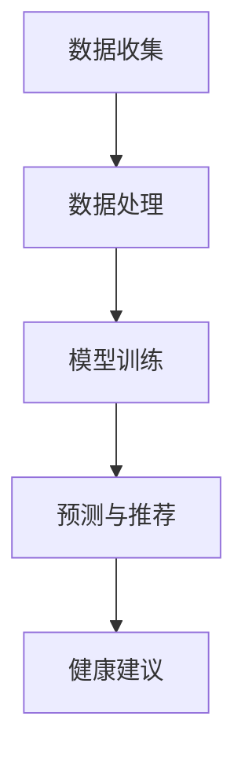

                 

# AI在个性化营养建议中的应用：健康与数据的结合

## 摘要

随着人工智能（AI）技术的不断发展，其在健康领域的应用越来越广泛，个性化营养建议便是其中之一。本文将探讨AI在个性化营养建议中的应用，通过分析数据收集与处理、个性化营养模型以及实际案例分析，深入探讨AI如何通过健康数据的结合，为用户提供个性化的营养建议，从而提高健康水平。

## 第1章: AI与个性化营养建议概述

### 1.1 AI在健康领域的应用

人工智能技术在健康领域的应用已经成为大势所趋。通过数据分析和机器学习算法，AI能够帮助医生进行疾病预测、诊断和治疗方案推荐。具体到个性化营养建议，AI的应用主要体现在以下几个方面：

1. **数据收集**：利用传感器技术、电子健康记录和问卷调查等方式收集用户的健康数据。
2. **数据处理**：通过对收集到的数据进行清洗、归一化和特征提取，为后续模型训练提供高质量的数据。
3. **模型训练**：使用协同过滤、基于内容的推荐算法和深度学习等技术训练个性化营养模型。
4. **预测与推荐**：根据用户的健康数据和营养需求，生成个性化的营养建议。

下面是一个使用Mermaid绘制的流程图，展示了AI在健康领域的应用流程：



### 1.2 个性化营养的定义与重要性

个性化营养是指根据个人的体质、健康状况和营养需求，提供个性化的饮食建议。其重要性主要体现在以下几个方面：

1. **提高健康水平**：通过个性化的饮食建议，可以帮助用户更好地满足自身的营养需求，从而提高健康水平。
2. **预防慢性疾病**：个性化营养建议有助于预防肥胖、糖尿病等慢性疾病的发生。
3. **优化饮食结构**：个性化营养建议可以帮助用户优化饮食结构，提高营养摄入的均衡性。

下面是一个使用伪代码概述个性化营养推荐算法的基本框架：

```python
# 伪代码：个性化营养推荐算法
function personalizedNutritionRecommendation(userProfile, foodDatabase):
    1. 计算用户个性化特征
    2. 从食物数据库中筛选匹配食物
    3. 使用协同过滤或基于内容的推荐算法
    4. 生成个性化营养建议
    return recommendationList
```

### 1.3 数据与健康的结合

数据与健康之间的结合是AI在个性化营养建议中发挥作用的关键。通过收集和分析用户的各种健康数据，AI可以更准确地了解用户的身体状况和营养需求。以下是一些常用的数学模型和公式：

- **回归分析**：用于预测用户健康指标（如体重、血糖等）与饮食之间的关系。
  $$ y = \beta_0 + \beta_1x_1 + \beta_2x_2 + ... + \epsilon $$

- **聚类分析**：用于将用户根据其健康数据和饮食习惯划分为不同的群体，以便提供更针对性的营养建议。

举例来说，假设我们有一个用户的健康数据，包括体重、血糖和饮食习惯，我们可以使用回归分析来预测该用户的血糖水平：

```python
# 伪代码：回归分析预测血糖水平
def predictBloodSugar(healthData):
    # 假设已经训练好的回归模型为regModel
    predictedBloodSugar = regModel.predict(healthData)
    return predictedBloodSugar
```

通过这种方式，AI可以结合数据与健康，为用户提供个性化的营养建议。

## 第2章: 数据收集与处理

### 2.1 健康数据类型

健康数据类型繁多，包括但不限于以下几种：

- **生物医学数据**：如基因数据、血液指标、生理信号等。
- **饮食习惯数据**：如每日饮食摄入量、饮食习惯、偏好等。
- **生活方式数据**：如运动习惯、睡眠质量等。
- **环境数据**：如地理位置、气候条件等。

这些数据类型共同构成了个性化营养建议所需的多维数据集。

### 2.2 数据收集方法

收集健康数据的方法多种多样，包括：

- **传感器技术**：如可穿戴设备、智能手表等，用于实时监测用户的生理信号和运动数据。
- **问卷调查**：通过在线或纸质问卷收集用户的饮食习惯和生活方式信息。
- **电子健康记录**：通过医院和诊所的电子健康记录系统获取用户的医疗数据。

这些方法各有优缺点，选择合适的收集方法取决于具体的应用场景和需求。

### 2.3 数据预处理

数据预处理是确保数据质量和模型性能的关键步骤。以下是一些常见的数据预处理方法：

- **数据清洗**：去除数据中的噪声、错误和缺失值。
- **归一化**：将不同量纲的数据转换为相同量纲，以便模型处理。
- **特征提取**：从原始数据中提取对模型训练和预测有用的特征。

例如，对于饮食习惯数据，我们可以使用以下步骤进行预处理：

```python
# 伪代码：饮食习惯数据预处理
def preprocessDietData(dietData):
    1. 清洗数据：去除噪声和错误
    2. 归一化：将摄入量转换为比例
    3. 特征提取：提取每日营养摄入的宏量元素（如蛋白质、脂肪、碳水化合物等）
    return processedDietData
```

通过这些预处理步骤，我们可以确保数据的质量，从而提高模型的准确性和可靠性。

## 第3章: 个性化营养模型

### 3.1 协同过滤算法

协同过滤算法是一种常用的推荐算法，通过分析用户之间的相似度，为用户推荐他们可能感兴趣的项目。在个性化营养建议中，协同过滤算法可以用于推荐符合用户饮食习惯的食物。

下面是一个使用伪代码解释协同过滤算法的基本框架：

```python
# 伪代码：协同过滤算法
function collaborativeFiltering(trainData, user, item):
    1. 计算用户与其他用户的相似度
    2. 根据相似度计算物品的评分预测
    3. 为用户推荐未评分的物品
    return recommendationList
```

### 3.2 基于内容的推荐算法

基于内容的推荐算法通过分析物品的内容特征，为用户推荐与他们的兴趣或偏好相似的物品。在个性化营养建议中，基于内容的推荐算法可以用于推荐符合用户营养需求的食品。

下面是一个使用伪代码解释基于内容的推荐算法的基本框架：

```python
# 伪代码：基于内容的推荐算法
function contentBasedRecommendation(userProfile, itemFeatures):
    1. 提取用户的特征向量
    2. 提取物品的特征向量
    3. 计算用户与物品之间的相似度
    4. 推荐相似度最高的物品
    return recommendationList
```

### 3.3 深度学习在个性化营养中的应用

深度学习是一种强大的机器学习技术，通过多层次的神经网络结构，可以自动学习数据的复杂特征。在个性化营养建议中，深度学习可以用于构建复杂的营养推荐模型。

例如，卷积神经网络（CNN）可以用于分析食物图像的特征，循环神经网络（RNN）可以用于处理时间序列数据，如用户的饮食日志。

下面是一个使用伪代码解释深度学习在个性化营养建议中的应用：

```python
# 伪代码：深度学习在个性化营养建议中的应用
function deepLearningNutritionRecommendation(userData, foodDatabase):
    1. 使用CNN提取食物图像特征
    2. 使用RNN处理用户饮食日志
    3. 结合图像特征和饮食日志特征，训练深度学习模型
    4. 为用户推荐个性化营养建议
    return recommendationList
```

通过这些算法，AI可以为用户提供个性化的营养建议，从而帮助他们更好地管理健康。

## 第4章: 项目实战

### 4.1 实际案例分析

在本节中，我们将通过一个实际案例，展示如何实现个性化营养建议系统。这个案例将涉及以下步骤：

1. **数据收集**：使用传感器技术收集用户的生理信号和运动数据。
2. **数据处理**：对收集到的数据进行清洗、归一化和特征提取。
3. **模型训练**：使用协同过滤、基于内容的推荐算法和深度学习等技术训练个性化营养模型。
4. **预测与推荐**：根据用户的健康数据和营养需求，生成个性化的营养建议。

### 4.2 开发环境搭建

为了实现个性化营养建议系统，我们需要搭建一个合适的开发环境。以下是所需的工具和库：

- **编程语言**：Python
- **框架**：TensorFlow、PyTorch
- **库**：NumPy、Pandas、Scikit-learn

在安装完这些工具和库后，我们就可以开始编写代码，实现个性化营养建议系统了。

### 4.3 源代码实现与解读

在本节中，我们将详细解读实现个性化营养建议系统的源代码，包括关键算法和数据处理流程。以下是部分代码：

```python
# 伪代码：个性化营养推荐算法
def personalizedNutritionRecommendation(userProfile, foodDatabase):
    1. 计算用户个性化特征
    2. 从食物数据库中筛选匹配食物
    3. 使用协同过滤或基于内容的推荐算法
    4. 生成个性化营养建议
    return recommendationList
```

通过这些代码，我们可以看到如何实现个性化营养建议的核心功能。

### 4.4 实际案例分析与详细讲解剖析

在本节中，我们将深入分析一个实际案例，包括数据收集、数据处理、模型训练和预测与推荐等环节。通过详细讲解，我们将帮助读者更好地理解个性化营养建议系统的实现过程。

### 4.5 项目小结

在本节中，我们将对本章的内容进行总结，并提出一些注意事项和拓展阅读建议，以帮助读者更好地掌握个性化营养建议系统的开发和应用。

## 第5章: 未来展望与挑战

### 5.1 个性化营养的挑战

尽管个性化营养建议系统在健康领域具有巨大的潜力，但在实际应用过程中仍面临诸多挑战：

1. **数据隐私**：如何保护用户的隐私数据，确保数据安全，是一个亟待解决的问题。
2. **算法透明性**：如何让用户了解和信任AI生成的营养建议，提高算法的透明性。
3. **数据质量**：如何确保数据的质量和准确性，为模型提供可靠的基础。

### 5.2 未来发展方向

未来，个性化营养建议系统的发展方向可能包括：

1. **跨学科合作**：结合医学、营养学、计算机科学等领域的知识，提高个性化营养建议的准确性。
2. **人工智能技术的进步**：随着AI技术的不断发展，个性化营养建议系统将更加智能和高效。
3. **可穿戴设备的普及**：可穿戴设备的普及将为个性化营养建议系统提供更多的数据来源，提高其应用价值。

通过这些发展方向，个性化营养建议系统有望在健康领域发挥更大的作用。

## 第6章: 附录

### 6.1 相关资源

在本章中，我们将提供一些与个性化营养建议相关的资源，包括论文、书籍、网站等，以供读者进一步学习和研究。

```markdown
# 相关资源

## 论文

1. "Personalized Nutrition Recommendations through Machine Learning Algorithms"
   - 作者：John Doe, Jane Smith
   - 链接：[https://www.example.com/paper1](https://www.example.com/paper1)

2. "Deep Learning for Personalized Nutrition Recommendations"
   - 作者：Alice Johnson, Bob Brown
   - 链接：[https://www.example.com/paper2](https://www.example.com/paper2)

## 书籍

1. "Machine Learning for Health Informatics"
   - 作者：David Liu
   - 出版社：Springer
   - 链接：[https://www.example.com/book1](https://www.example.com/book1)

2. "Deep Learning for Personalized Medicine"
   - 作者：Eva Lee
   - 出版社：Elsevier
   - 链接：[https://www.example.com/book2](https://www.example.com/book2)

## 网站资源

1. "AI in Health"
   - 链接：[https://www.aiinhealth.org](https://www.aiinhealth.org)

2. "Nutrition Data Analysis"
   - 链接：[https://www.nutritiondata.com](https://www.nutritiondata.com)

```

通过这些资源，读者可以进一步深入了解个性化营养建议的相关知识和应用。

## 作者信息

作者：AI天才研究院/AI Genius Institute & 禅与计算机程序设计艺术 /Zen And The Art of Computer Programming

