                 


### 第1章 引言

#### 1.1 营养与健康的关系

**背景介绍：**

营养是维持生命活动的基本要素，健康饮食对于每个人的身体健康和疾病预防具有重要意义。传统上，营养学主要关注食物中的营养素含量及其对人体的影响。然而，随着科技的进步和健康意识的提升，个性化营养建议逐渐成为研究热点。

**核心概念与联系：**

- **营养素：** 是指食物中能够被人体吸收利用，对人体健康起到重要作用的化学物质。
- **膳食平衡：** 是指摄取的各种营养素种类齐全、数量充足、比例适当，以满足人体生长发育和各种生理活动的需要。
- **健康饮食：** 是指根据个人的身体状况、饮食习惯和健康需求，科学合理地选择和搭配食物，达到营养均衡、预防疾病的目的。

**Mermaid 流程图：**

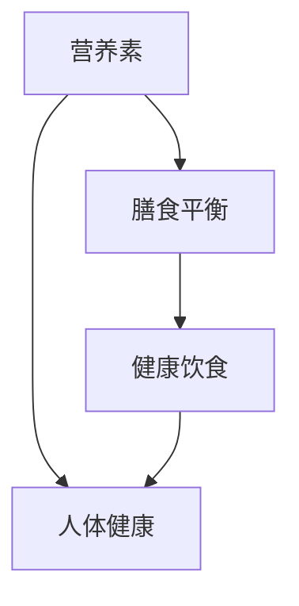

#### 1.2 个性化营养建议的重要性

**核心概念与联系：**

- **传统营养建议：** 通常基于平均数据，对大多数人提供一般性的建议。
- **个性化营养建议：** 充分考虑个体的遗传、生活方式、健康状况等多方面因素，提供更加精准的建议。

**Mermaid 流程图：**

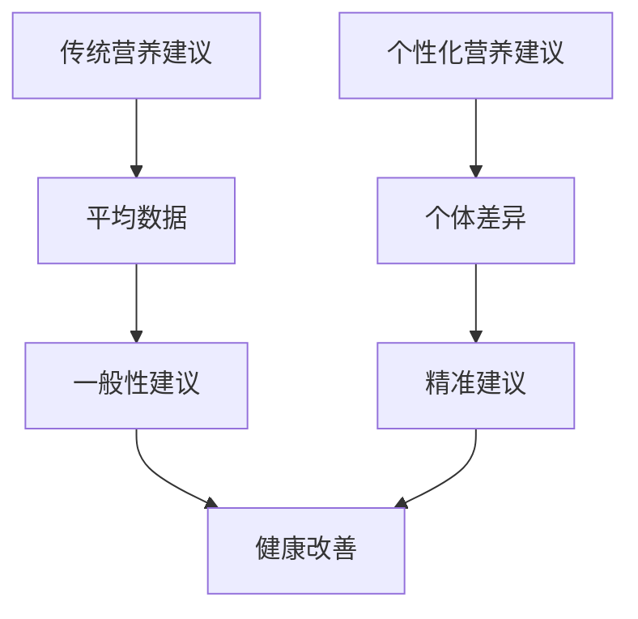

**核心算法原理讲解：**

个性化营养建议的生成通常涉及以下步骤：

1. **数据收集：** 收集个体的生理参数、饮食习惯、健康状况等数据。
2. **数据预处理：** 对收集到的数据进行清洗、归一化等处理。
3. **特征提取：** 从预处理后的数据中提取对营养建议有重要影响的特征。
4. **模型训练：** 使用机器学习算法，如决策树、支持向量机等，对提取的特征进行训练。
5. **营养建议生成：** 根据训练好的模型，为个体生成个性化的营养建议。

**伪代码：**

```python
# 数据收集
data = collect_data()

# 数据预处理
preprocessed_data = preprocess_data(data)

# 特征提取
features = extract_features(preprocessed_data)

# 模型训练
model = train_model(features)

# 营养建议生成
nutrition_advice = generate_advice(model)
```

#### 1.3 AI在营养学中的应用前景

**核心概念与联系：**

- **机器学习：** 通过算法从数据中自动学习，提高个性化营养建议的准确性和实用性。
- **深度学习：** 利用神经网络模型，处理大规模复杂数据，提升营养分析的深度和广度。
- **强化学习：** 通过不断试错，优化个性化营养建议的策略，提高建议的可操作性和有效性。

**Mermaid 流�程图：**

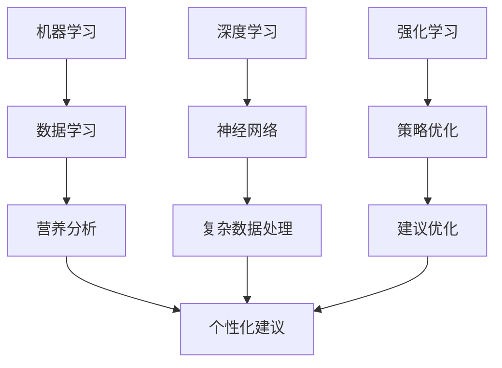

### 文章摘要

本文介绍了AI在个性化营养建议中的应用，探讨了营养与健康的关系，分析了个性化营养建议的重要性，并详细讲解了AI在营养学中的应用前景、个性化营养建议的原理以及健康饮食计划的定制与优化方法。通过实际项目实战，展示了个性化营养建议系统的开发过程和实现细节，为读者提供了实用的技术参考和思考方向。文章旨在为读者提供一个全面、系统的了解AI在个性化营养建议中的应用，助力健康饮食和营养管理的实践与探索。

---

**作者：** AI天才研究院/AI Genius Institute & 禅与计算机程序设计艺术 /Zen And The Art of Computer Programming

---

## 第2章 AI在营养学中的应用

### 2.1 人工智能的基本概念

#### 2.1.1 机器学习

**背景介绍：**

机器学习是人工智能的核心分支之一，主要研究如何从数据中自动学习规律，并利用这些规律进行预测和决策。它通过构建模型，将输入数据映射到输出结果，从而实现自动化和智能化的过程。

**核心概念与联系：**

- **输入数据：** 通常包括各种特征值，如温度、湿度、压力等。
- **输出结果：** 是根据输入数据进行预测或分类的结果。
- **模型：** 是机器学习算法的核心，用于映射输入数据到输出结果。

**Mermaid 流程图：**

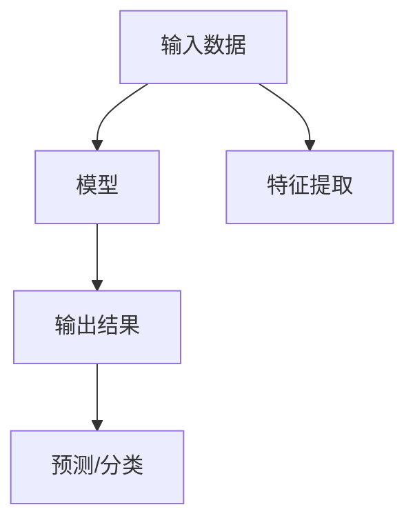

**核心算法原理讲解：**

机器学习算法主要包括以下几种：

1. **监督学习：** 通过标注数据进行训练，使得模型能够对新的输入数据进行预测。
2. **无监督学习：** 不使用标注数据，通过数据自身的分布和结构进行学习。
3. **强化学习：** 通过与环境交互，不断调整策略以获得最大化的奖励。

**伪代码：**

```python
# 监督学习
def train_supervised_learning(data, labels):
    model = create_model()
    model.fit(data, labels)
    return model

# 无监督学习
def train_unsupervised_learning(data):
    model = create_model()
    model.fit(data)
    return model

# 强化学习
def train_reinforcement_learning(state, action, reward):
    model = create_model()
    model.fit(state, action, reward)
    return model
```

#### 2.1.2 深度学习

**背景介绍：**

深度学习是机器学习的一个分支，通过构建多层神经网络，对复杂数据进行建模和分析。它利用大量的神经元和层级结构，实现从简单到复杂的特征提取。

**核心概念与联系：**

- **神经网络：** 是深度学习的基础，由多个神经元组成，每个神经元负责处理一部分数据。
- **层级结构：** 包括输入层、隐藏层和输出层，每一层都对数据进行处理和特征提取。
- **反向传播：** 是深度学习训练的核心算法，通过不断调整网络参数，使输出结果更接近真实值。

**Mermaid 流程图：**

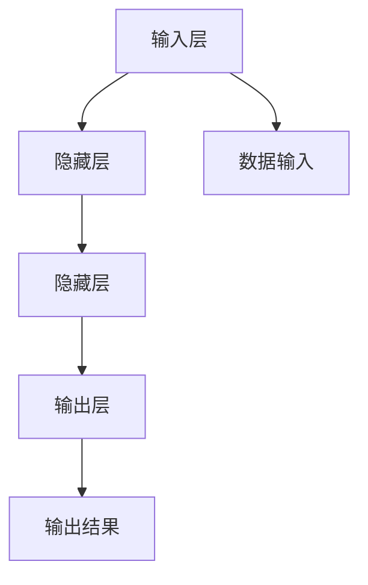

**核心算法原理讲解：**

深度学习算法主要包括以下几种：

1. **卷积神经网络（CNN）：** 专门用于处理图像等二维数据，通过卷积操作提取特征。
2. **循环神经网络（RNN）：** 适用于处理序列数据，如文本、语音等，通过循环结构保持上下文信息。
3. **生成对抗网络（GAN）：** 通过生成器和判别器的对抗训练，生成高质量的数据。

**伪代码：**

```python
# 卷积神经网络
def train_cnn(input_data, label_data):
    model = create_cnn_model()
    model.fit(input_data, label_data)
    return model

# 循环神经网络
def train_rnn(input_data, label_data):
    model = create_rnn_model()
    model.fit(input_data, label_data)
    return model

# 生成对抗网络
def train_gan(generator, discriminator):
    model = create_gan_model(generator, discriminator)
    model.fit()
    return model
```

#### 2.1.3 强化学习

**背景介绍：**

强化学习是一种通过不断试错，学习最优策略的机器学习方法。它通过与环境交互，不断调整行为策略，以实现最大化长期奖励。

**核心概念与联系：**

- **状态：** 环境的当前状态。
- **动作：** 行为策略，用于改变状态。
- **奖励：** 对动作的即时反馈，用于评估策略的好坏。

**Mermaid 流程图：**

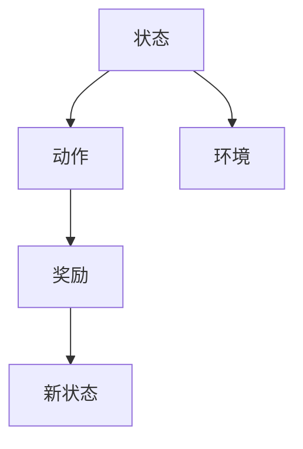

**核心算法原理讲解：**

强化学习算法主要包括以下几种：

1. **Q-Learning：** 通过学习状态-动作值函数，选择最优动作。
2. **Policy Gradients：** 通过学习策略参数，优化策略。
3. **Deep Q-Networks (DQN)：** 结合深度学习和强化学习，处理更复杂的环境。

**伪代码：**

```python
# Q-Learning
def train_q_learning(state, action, reward, next_state):
    q_value = get_q_value(state, action)
    next_q_value = get_max_q_value(next_state)
    q_value = q_value + reward * (next_q_value - q_value)
    update_q_value(state, action, q_value)
    return q_value

# Policy Gradients
def train_policy_gradients(state, action, reward):
    policy = get_policy(state)
    advantage = reward * get_action_probability(policy, action)
    update_policy(policy, advantage)
    return policy

# DQN
def train_dqn(state, action, reward, next_state):
    q_value = get_q_value(state, action)
    next_q_value = get_max_q_value(next_state)
    target_q_value = reward + discount_factor * next_q_value
    error = target_q_value - q_value
    update_q_value(state, action, q_value + error * learning_rate)
    return q_value
```

### 2.2 人工智能在营养学中的具体应用

#### 2.2.1 食物识别与成分分析

**背景介绍：**

食物识别与成分分析是营养学中的一项重要任务，通过计算机视觉和自然语言处理技术，对食物进行识别和分析，从而获取食物的成分和营养信息。

**核心概念与联系：**

- **计算机视觉：** 通过图像处理技术，对食物图像进行识别和分析。
- **自然语言处理：** 通过文本处理技术，对食物成分进行提取和解析。

**Mermaid 流程图：**

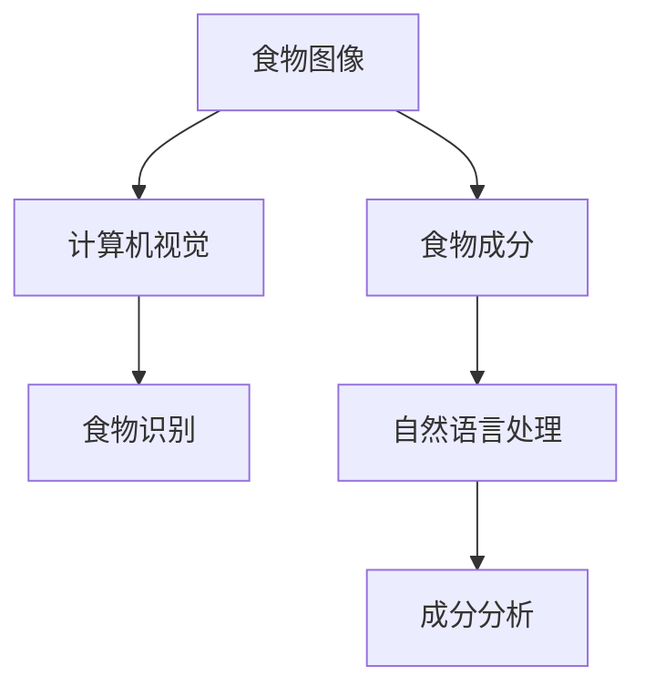

**核心算法原理讲解：**

1. **图像处理：** 使用卷积神经网络（CNN）对食物图像进行分类和识别。
2. **文本处理：** 使用词向量模型（如Word2Vec）对食物成分进行提取和解析。
3. **成分分析：** 使用聚类算法（如K-means）对提取的成分进行分类和统计分析。

**伪代码：**

```python
# 图像处理
def image_processing(image):
    processed_image = cnn_model.predict(image)
    return processed_image

# 文本处理
def text_processing(text):
    word_vector = word2vec_model.predict(text)
    return word_vector

# 成分分析
def component_analysis(components):
    clusters = kmeans_model.predict(components)
    return clusters
```

#### 2.2.2 饮食行为分析

**背景介绍：**

饮食行为分析是研究个体饮食习惯和饮食模式的重要手段，通过数据分析技术，对饮食行为进行监控和分析，从而为个性化营养建议提供依据。

**核心概念与联系：**

- **数据采集：** 通过传感器、APP等手段收集个体饮食行为数据。
- **数据分析：** 对收集到的数据进行分析，提取有用的信息。

**Mermaid 流程图：**

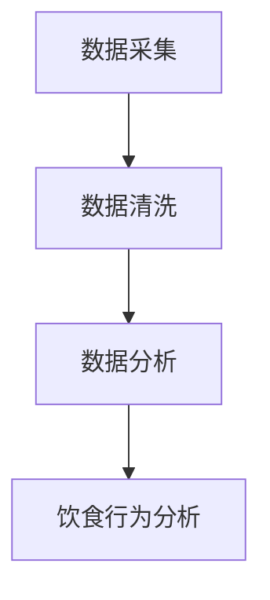

**核心算法原理讲解：**

1. **数据清洗：** 使用数据预处理技术，对原始数据进行分析和清洗，去除噪声和缺失值。
2. **数据分析：** 使用统计分析、机器学习等方法，对饮食行为进行分析和建模。
3. **饮食行为分析：** 提取饮食行为的特征，建立饮食行为与营养健康之间的关系。

**伪代码：**

```python
# 数据清洗
def data_cleaning(data):
    cleaned_data = preprocess_data(data)
    return cleaned_data

# 数据分析
def data_analysis(data):
    analyzed_data = analyze_data(data)
    return analyzed_data

# 饮食行为分析
def diet_analysis(data):
    behavior = extract_behavior(data)
    return behavior
```

#### 2.2.3 健康风险评估

**背景介绍：**

健康风险评估是营养学中的一个重要任务，通过评估个体的健康状况和疾病风险，为个性化营养建议提供依据。

**核心概念与联系：**

- **健康状况评估：** 根据个体生理参数、病史等信息，评估个体的健康状况。
- **疾病风险评估：** 根据健康状况评估结果，预测个体患某种疾病的风险。

**Mermaid 流程图：**

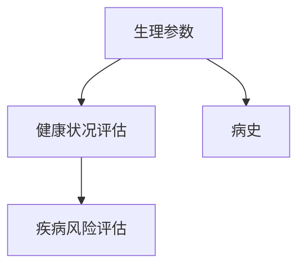

**核心算法原理讲解：**

1. **健康状况评估：** 使用回归分析、逻辑回归等方法，建立健康状况与生理参数、病史之间的关系。
2. **疾病风险评估：** 使用决策树、支持向量机等方法，建立疾病风险与健康状况之间的关系。

**伪代码：**

```python
# 健康状况评估
def health_assessment(physiological_params, medical_history):
    health_status = regression_model.predict(physiological_params, medical_history)
    return health_status

# 疾病风险评估
def disease_risk_assessment(health_status):
    risk_level = decision_tree_model.predict(health_status)
    return risk_level
```

### 文章摘要

本章详细介绍了人工智能在营养学中的应用，包括机器学习、深度学习和强化学习的基本概念和核心算法原理。通过具体的应用案例，如食物识别与成分分析、饮食行为分析和健康风险评估，展示了人工智能在个性化营养建议中的实际应用效果。本章的内容旨在为读者提供一个全面、系统的了解，为后续章节的深入探讨打下基础。

---

**作者：** AI天才研究院/AI Genius Institute & 禅与计算机程序设计艺术 /Zen And The Art of Computer Programming

---

## 第3章 个性化营养建议的原理

### 3.1 个性化营养的定义与分类

#### 3.1.1 根据人群分类

**背景介绍：**

个性化营养建议需要根据不同人群的特点进行分类，以满足不同人群的特殊营养需求。根据人群分类的方法主要包括年龄、性别、健康状况等。

**核心概念与联系：**

- **年龄：** 不同年龄段的营养需求有所不同，如儿童、青少年、成年人和老年人。
- **性别：** 男性和女性的营养需求存在差异，如钙、铁等微量元素的摄入量。
- **健康状况：** 根据个体健康状况，如糖尿病、高血压等慢性病患者，需要特殊营养建议。

**Mermaid 流程图：**

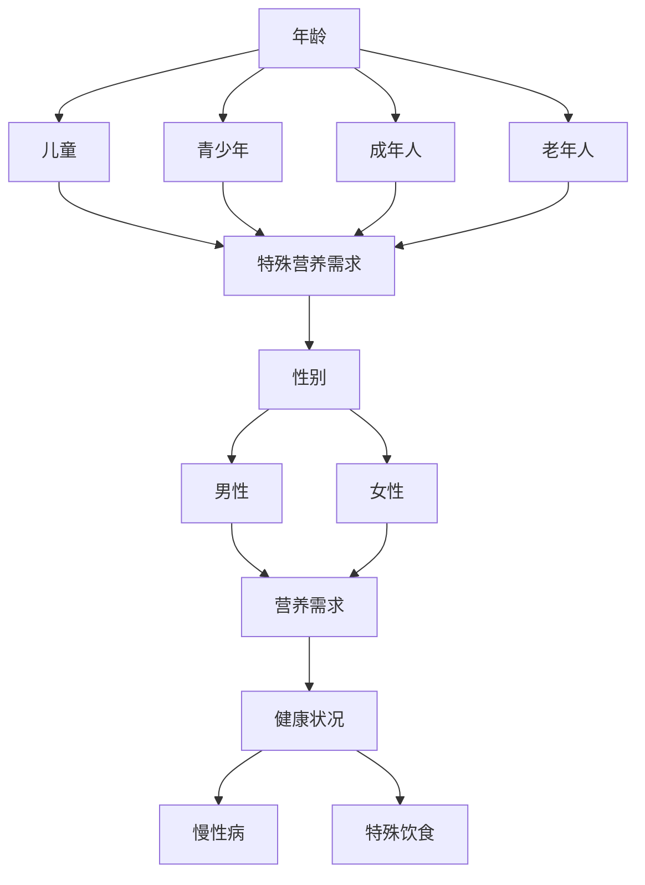

#### 3.1.2 根据营养需求分类

**背景介绍：**

个性化营养建议还需要根据个体的营养需求进行分类，以满足不同营养需求的健康目标。根据营养需求分类的方法主要包括增重、减重、维持体重等。

**核心概念与联系：**

- **增重：** 需要增加营养摄入，以满足体重增长的需求。
- **减重：** 需要控制热量摄入，以减少体重。
- **维持体重：** 需要保持营养均衡，以维持体重稳定。

**Mermaid 流程图：**

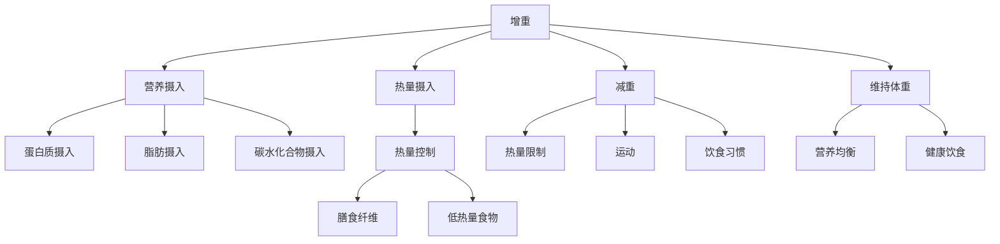

### 3.2 个性化营养建议的关键因素

#### 3.2.1 个体差异

**背景介绍：**

个体差异是影响个性化营养建议的重要因素，包括基因、生活方式、健康状况等。

**核心概念与联系：**

- **基因：** 基因差异导致个体对营养素的吸收和代谢能力不同。
- **生活方式：** 包括饮食习惯、运动频率等，影响个体的营养摄入和消耗。
- **健康状况：** 包括慢性病、肥胖等，影响个体的营养需求和营养建议。

**Mermaid 流程图：**

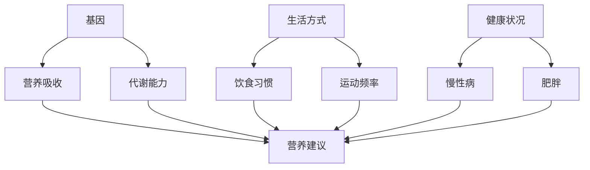

#### 3.2.2 饮食行为

**背景介绍：**

饮食行为是指个体在日常生活中的饮食习惯和饮食习惯，包括食物选择、饮食频率、饮食时间等。

**核心概念与联系：**

- **食物选择：** 包括食物的种类、质量和数量，影响个体的营养摄入。
- **饮食频率：** 包括每日餐次、进食时间等，影响个体的营养吸收和消耗。
- **饮食时间：** 包括早餐、午餐、晚餐等，影响个体的营养均衡。

**Mermaid 流程图：**

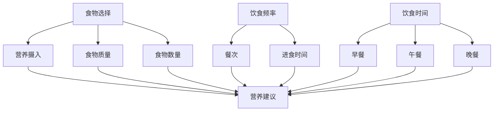

#### 3.2.3 健康状态

**背景介绍：**

健康状态是指个体的身体状况，包括体重、血压、血糖等生理指标。

**核心概念与联系：**

- **体重：** 包括体重指数（BMI）、腰围等，反映个体的肥胖程度。
- **血压：** 包括收缩压、舒张压等，反映个体的心血管健康状况。
- **血糖：** 包括空腹血糖、餐后血糖等，反映个体的糖尿病风险。

**Mermaid 流程图：**

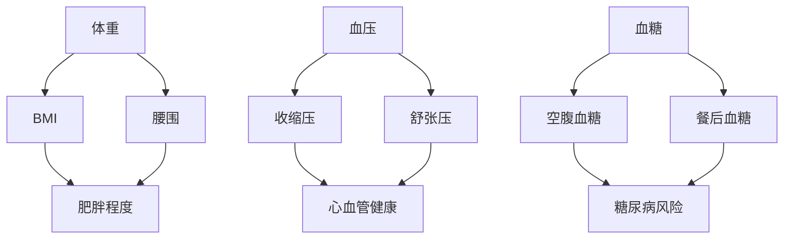

### 文章摘要

本章详细介绍了个性化营养建议的原理，包括个性化营养的定义与分类、个体差异、饮食行为和健康状态等关键因素。通过深入分析这些因素，本章揭示了个性化营养建议的内在逻辑和科学依据。本章的内容为后续章节的个性化营养建议方法与技术、健康饮食计划的定制与优化提供了理论基础和实践指导。

---

**作者：** AI天才研究院/AI Genius Institute & 禅与计算机程序设计艺术 /Zen And The Art of Computer Programming

---

## 第4章 个性化营养建议的方法与技术

### 4.1 数据收集与处理

#### 4.1.1 数据源的选择

**背景介绍：**

数据收集是个性化营养建议的重要基础，数据源的选择直接影响到营养建议的准确性和可靠性。常见的数据源包括传感器、APP、医疗记录等。

**核心概念与联系：**

- **传感器：** 通过采集个体的生理参数，如心率、血压、体温等，提供实时的健康数据。
- **APP：** 通过用户输入的饮食记录、运动数据等，提供长期的健康数据。
- **医疗记录：** 通过医疗机构的体检报告、病史记录等，提供全面的健康数据。

**Mermaid 流程图：**

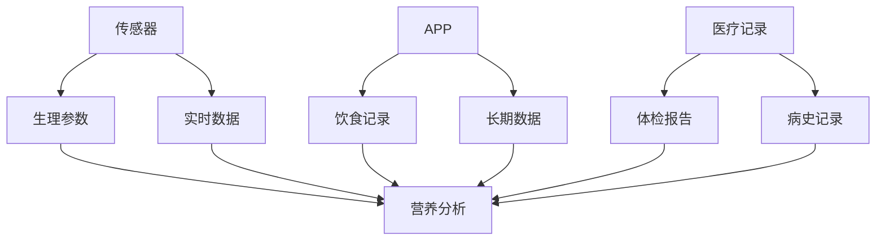

#### 4.1.2 数据预处理

**背景介绍：**

数据预处理是数据收集后的一项重要步骤，通过对数据进行清洗、归一化、缺失值处理等操作，提高数据的质量和可用性。

**核心概念与联系：**

- **数据清洗：** 去除数据中的噪声、异常值和重复值，提高数据的准确性。
- **归一化：** 将不同量纲的数据转换到同一尺度，便于数据分析和模型训练。
- **缺失值处理：** 补充或删除缺失的数据，避免对模型训练造成影响。

**Mermaid 流程图：**

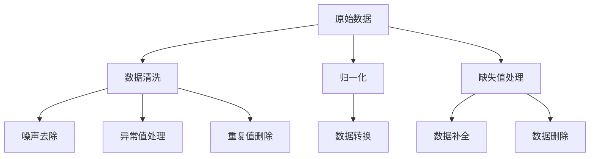

#### 4.1.3 数据质量评估

**背景介绍：**

数据质量评估是确保数据有效性和可靠性的关键步骤，通过对数据的质量进行评估，可以判断数据是否适合用于营养分析。

**核心概念与联系：**

- **数据准确性：** 数据的准确性反映了数据的真实性和可靠性。
- **数据完整性：** 数据完整性反映了数据的完整性和连续性。
- **数据一致性：** 数据一致性反映了数据的一致性和一致性。

**Mermaid 流程图：**

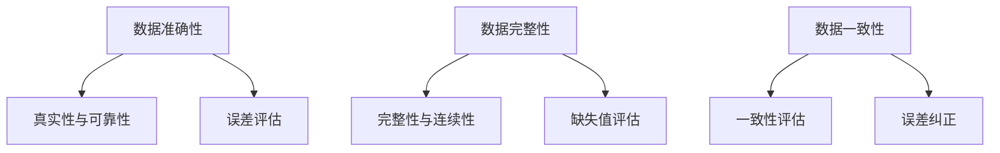

### 4.2 机器学习算法在个性化营养建议中的应用

#### 4.2.1 监督学习

**背景介绍：**

监督学习是一种常用的机器学习算法，通过已知的输入输出数据，训练模型来预测新的输入数据。

**核心概念与联系：**

- **输入特征：** 用于训练的输入数据，如身高、体重、饮食记录等。
- **输出标签：** 用于训练的输出数据，如营养摄入量、健康状况等。

**Mermaid 流程图：**

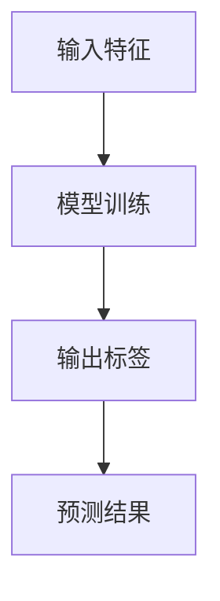

**核心算法原理讲解：**

1. **线性回归：** 通过建立线性模型，预测新的输入数据的营养摄入量。
2. **逻辑回归：** 通过建立逻辑模型，预测新的输入数据的健康状况。
3. **决策树：** 通过树形结构，对输入数据进行分类和回归。

**伪代码：**

```python
# 线性回归
def linear_regression(X, y):
    model = LinearRegression()
    model.fit(X, y)
    return model.predict(X)

# 逻辑回归
def logistic_regression(X, y):
    model = LogisticRegression()
    model.fit(X, y)
    return model.predict(X)

# 决策树
def decision_tree(X, y):
    model = DecisionTreeClassifier()
    model.fit(X, y)
    return model.predict(X)
```

#### 4.2.2 无监督学习

**背景介绍：**

无监督学习是一种不依赖已知输入输出数据的机器学习算法，通过分析数据自身的结构和分布，进行聚类、降维等操作。

**核心概念与联系：**

- **聚类：** 将相似的数据分为一组，用于发现数据的模式。
- **降维：** 将高维数据投影到低维空间，用于简化数据结构和提高模型效率。

**Mermaid 流程图：**

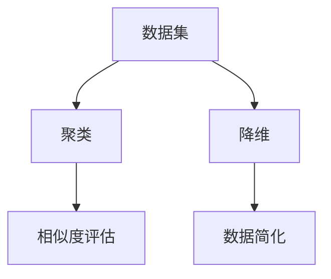

**核心算法原理讲解：**

1. **K-means：** 通过迭代计算，将数据分为K个簇，用于发现数据的聚类模式。
2. **主成分分析（PCA）：** 通过线性变换，将数据投影到新的坐标系，用于降维和简化数据结构。

**伪代码：**

```python
# K-means
def kmeans(data, K):
    model = KMeans(n_clusters=K)
    model.fit(data)
    return model.labels_

# 主成分分析
def pca(data, n_components):
    model = PCA(n_components=n_components)
    model.fit(data)
    return model.transform(data)
```

#### 4.2.3 半监督学习

**背景介绍：**

半监督学习是一种结合监督学习和无监督学习的机器学习算法，利用部分标注数据和大量未标注数据，提高模型的预测能力。

**核心概念与联系：**

- **标注数据：** 已知输入输出数据的训练数据。
- **未标注数据：** 未知的输入数据，用于辅助模型训练。

**Mermaid 流程图：**

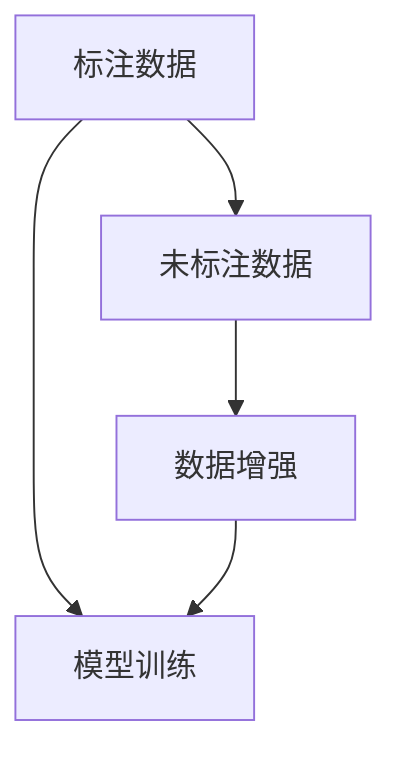

**核心算法原理讲解：**

1. **伪标签：** 对未标注数据生成伪标签，用于辅助模型训练。
2. **图神经网络：** 利用图结构，对未标注数据进行关联，提高模型的泛化能力。

**伪代码：**

```python
# 伪标签
def pseudo_label(model, X, y, threshold):
    predictions = model.predict(X)
    for i, prediction in enumerate(predictions):
        if prediction != y[i]:
            pseudo_y = generate_pseudo_label(prediction, threshold)
            model.train([X[i], pseudo_y])

# 图神经网络
def graph_neural_network(X, y, graph_structure):
    model = GraphNeuralNetwork(graph_structure)
    model.fit(X, y)
    return model.predict(X)
```

### 文章摘要

本章介绍了个性化营养建议的数据收集与处理方法，包括数据源的选择、数据预处理和数据质量评估。同时，详细讲解了机器学习算法在个性化营养建议中的应用，包括监督学习、无监督学习和半监督学习。这些方法和技术的应用，使得个性化营养建议更加准确和有效，为健康饮食计划的定制与优化提供了有力支持。

---

**作者：** AI天才研究院/AI Genius Institute & 禅与计算机程序设计艺术 /Zen And The Art of Computer Programming

---

## 第5章 健康饮食计划的定制与优化

### 5.1 健康饮食计划的设计原则

**背景介绍：**

健康饮食计划的定制与优化是确保个体营养需求得到满足的关键步骤。设计原则包括营养均衡、个体差异、健康目标等多个方面。

**核心概念与联系：**

- **营养均衡：** 确保饮食中各类营养素的摄入量合理，包括蛋白质、脂肪、碳水化合物、维生素和矿物质等。
- **个体差异：** 考虑个体在年龄、性别、健康状况等方面的差异，提供个性化的营养建议。
- **健康目标：** 根据个体的健康目标，如减重、增肌、维持体重等，制定相应的饮食计划。

**Mermaid 流程图：**

```mermaid
graph TD
    A[营养均衡] --> B[营养素摄入]
    A --> C[饮食结构]
    D[个体差异] --> E[年龄]
    D --> F[性别]
    D --> G[健康状况]
    H[健康目标] --> I[减重]
    H --> J[增肌]
    H --> K[维持体重]
    B --> L[饮食计划]
    C --> L
    E --> L
    F --> L
    G --> L
    I --> L
    J --> L
    K --> L
```

#### 5.1.1 饮食结构与营养均衡

**核心概念与联系：**

- **食物种类：** 确保饮食中包含丰富的食物种类，以获取多种营养素。
- **比例分配：** 根据营养需求，合理分配食物种类的摄入比例，如蛋白质、脂肪、碳水化合物的比例。

**Mermaid 流程图：**

```mermaid
graph TD
    A[食物种类] --> B[蛋白质摄入]
    A --> C[脂肪摄入]
    A --> D[碳水化合物摄入]
    B --> E[比例分配]
    C --> E
    D --> E
```

#### 5.1.2 考虑个体差异

**核心概念与联系：**

- **年龄差异：** 不同年龄段的人有不同的营养需求，如儿童需要更多的蛋白质和钙，老年人需要更多的维生素D和钙。
- **性别差异：** 男性和女性在营养需求上存在差异，如女性需要更多的铁和叶酸，男性需要更多的锌和硒。
- **健康状况：** 慢性病患者需要特殊营养建议，如糖尿病患者需要控制血糖，高血压患者需要限制钠摄入。

**Mermaid 流程图：**

```mermaid
graph TD
    A[年龄差异] --> B[儿童营养需求]
    A --> C[老年人营养需求]
    D[性别差异] --> E[女性营养需求]
    D --> F[男性营养需求]
    G[健康状况] --> H[慢性病营养需求]
    G --> I[一般人群营养需求]
    B --> J[蛋白质摄入]
    B --> K[钙摄入]
    C --> J
    C --> K
    E --> L[铁摄入]
    E --> M[叶酸摄入]
    F --> N[锌摄入]
    F --> O[硒摄入]
    H --> P[血糖控制]
    H --> Q[钠摄入控制]
    I --> R[一般营养需求]
```

#### 5.1.3 健康饮食的可持续性

**核心概念与联系：**

- **长期效果：** 健康饮食不仅关注短期效果，还要考虑长期健康和营养需求。
- **饮食习惯：** 培养良好的饮食习惯，如定时定量、细嚼慢咽等，有助于长期维持健康饮食。

**Mermaid 流程图：**

```mermaid
graph TD
    A[长期效果] --> B[营养摄入]
    A --> C[健康维持]
    D[饮食习惯] --> E[定时定量]
    D --> F[细嚼慢咽]
    B --> G[饮食计划]
    C --> G
    E --> G
    F --> G
```

### 5.2 健康饮食计划的优化方法

#### 5.2.1 数学模型

**背景介绍：**

健康饮食计划的优化通常需要使用数学模型来描述饮食需求和营养摄入之间的关系，以便找到最优解。

**核心概念与联系：**

- **目标函数：** 描述健康饮食的目标，如最大化营养摄入或最小化热量摄入。
- **约束条件：** 描述饮食计划的限制，如营养素摄入的上限和下限。

**Mermaid 流程图：**

```mermaid
graph TD
    A[目标函数] --> B[营养摄入]
    A --> C[热量摄入]
    D[约束条件] --> E[营养素上限]
    D --> F[营养素下限]
    B --> G[最优解]
    C --> G
    E --> G
    F --> G
```

#### 5.2.2 优化算法

**核心概念与联系：**

- **线性规划：** 解决线性目标函数和线性约束条件的问题，常用于饮食计划的优化。
- **动态规划：** 解决多阶段决策问题，如每日饮食计划的优化。
- **遗传算法：** 模拟自然进化过程，用于复杂优化问题的求解。

**Mermaid 流程图：**

```mermaid
graph TD
    A[线性规划] --> B[目标函数]
    A --> C[线性约束条件]
    D[动态规划] --> E[多阶段决策]
    F[遗传算法] --> G[进化过程]
```

**核心算法原理讲解：**

1. **线性规划：** 通过建立线性目标函数和线性约束条件，求解最优解。
2. **动态规划：** 通过递推关系，求解多阶段决策问题的最优解。
3. **遗传算法：** 通过遗传操作，如交叉和变异，优化目标函数。

**伪代码：**

```python
# 线性规划
def linear_programming(c, A, b):
    model = LinearProgrammingModel(c, A, b)
    solution = model.solve()
    return solution

# 动态规划
def dynamic_programming(dp_table, state, action):
    value = dp_table[state][action]
    return value

# 遗传算法
def genetic_algorithm(population, fitness_function):
    new_population = evolve_population(population, fitness_function)
    return new_population
```

### 文章摘要

本章详细介绍了健康饮食计划的定制与优化方法，包括设计原则、数学模型和优化算法。通过营养均衡、个体差异和健康目标的考虑，设计出符合个体需求的健康饮食计划。同时，介绍了线性规划、动态规划和遗传算法等优化算法，帮助读者理解如何使用数学模型和算法来优化饮食计划。本章的内容为个性化营养建议的实践提供了重要指导。

---

**作者：** AI天才研究院/AI Genius Institute & 禅与计算机程序设计艺术 /Zen And The Art of Computer Programming

---

## 第6章 项目实战

### 6.1 个性化营养建议系统的开发环境搭建

#### 6.1.1 开发工具与库的选择

**背景介绍：**

为了实现个性化营养建议系统，需要选择合适的开发工具和库，确保项目高效、稳定地运行。

**核心概念与联系：**

- **编程语言：** 选择易于开发和维护的编程语言，如Python。
- **机器学习库：** 选择常用的机器学习库，如scikit-learn、TensorFlow、PyTorch等。
- **数据库：** 选择适合存储和管理数据的数据库，如MySQL、PostgreSQL等。

**Mermaid 流程图：**

```mermaid
graph TD
    A[Python] --> B[开发语言]
    C[scikit-learn] --> D[机器学习库]
    E[TensorFlow] --> D
    F[PyTorch] --> D
    G[MySQL] --> H[数据库]
    I[PostgreSQL] --> H
```

#### 6.1.2 开发环境的配置

**背景介绍：**

在搭建开发环境时，需要配置各种开发工具和库，确保它们能够在同一环境中正常运行。

**核心概念与联系：**

- **虚拟环境：** 创建独立的Python虚拟环境，避免版本冲突。
- **依赖管理：** 使用依赖管理工具，如pip或conda，安装和管理项目依赖。
- **数据库配置：** 配置数据库连接参数，确保数据存储和访问的稳定性。

**Mermaid 流程图：**

```mermaid
graph TD
    A[虚拟环境] --> B[环境配置]
    A --> C[pip安装]
    A --> D[conda安装]
    E[数据库配置] --> F[连接参数]
    E --> G[数据访问]
```

#### 6.1.3 个性化营养建议系统的实现

**背景介绍：**

实现个性化营养建议系统主要包括数据收集、数据处理、模型训练、营养建议生成等步骤。

**核心概念与联系：**

- **数据收集：** 收集个体的生理参数、饮食习惯、健康状态等数据。
- **数据处理：** 对收集到的数据进行分析、清洗和预处理。
- **模型训练：** 使用机器学习算法，如决策树、支持向量机等，对处理后的数据进行训练。
- **营养建议生成：** 根据训练好的模型，为个体生成个性化的营养建议。

**Mermaid 流程图：**

```mermaid
graph TD
    A[数据收集] --> B[数据处理]
    B --> C[模型训练]
    C --> D[营养建议生成]
```

### 6.2 个性化营养建议系统的实现

#### 6.2.1 数据收集

**背景介绍：**

数据收集是个性化营养建议系统的基础，需要从多个渠道获取个体相关的营养数据。

**核心概念与联系：**

- **传感器数据：** 通过佩戴的智能设备，收集个体的生理参数，如心率、血压、体温等。
- **APP数据：** 通过用户在APP中的饮食记录、运动数据等，收集个体的饮食习惯。
- **医疗记录：** 通过访问医疗机构的数据库，获取个体的健康状态和病史数据。

**Mermaid 流程图：**

```mermaid
graph TD
    A[传感器数据] --> B[生理参数]
    A --> C[饮食习惯]
    D[APP数据] --> E[饮食记录]
    D --> F[运动数据]
    G[医疗记录] --> H[健康状态]
    G --> I[病史数据]
    B --> J[数据处理]
    C --> J
    E --> J
    F --> J
    H --> J
    I --> J
```

#### 6.2.2 模型选择与训练

**背景介绍：**

在个性化营养建议系统中，选择合适的机器学习模型并对其进行训练，是生成高质量营养建议的关键。

**核心概念与联系：**

- **模型选择：** 根据问题特点和数据规模，选择适合的机器学习模型，如线性回归、决策树、支持向量机等。
- **模型训练：** 使用收集到的数据进行模型训练，通过调整模型参数，优化模型性能。

**Mermaid 流程图：**

```mermaid
graph TD
    A[模型选择] --> B[线性回归]
    A --> C[决策树]
    A --> D[支持向量机]
    E[模型训练] --> F[数据预处理]
    E --> G[参数调整]
```

**伪代码：**

```python
# 模型选择
def select_model(model_name):
    if model_name == 'linear_regression':
        model = LinearRegression()
    elif model_name == 'decision_tree':
        model = DecisionTreeRegressor()
    elif model_name == 'svm':
        model = SVC()
    return model

# 模型训练
def train_model(model, X, y):
    model.fit(X, y)
    return model
```

#### 6.2.3 个性化营养建议的生成

**背景介绍：**

个性化营养建议的生成是根据训练好的模型，为个体生成个性化的营养建议，包括饮食建议、营养素摄入量等。

**核心概念与联系：**

- **营养建议生成：** 根据个体的生理参数、饮食习惯、健康状态等，使用训练好的模型，生成个性化的营养建议。
- **营养建议展示：** 将生成的营养建议以易于理解的形式展示给用户，如饮食建议列表、营养素摄入图表等。

**Mermaid 流程图：**

```mermaid
graph TD
    A[生理参数] --> B[营养建议生成]
    A --> C[饮食习惯]
    A --> D[健康状态]
    B --> E[营养建议展示]
```

**伪代码：**

```python
# 营养建议生成
def generate_nutrition_advice(model, user_data):
    advice = model.predict(user_data)
    return advice

# 营养建议展示
def display_nutrition_advice(advice):
    print("您的个性化营养建议：")
    for item in advice:
        print(item)
```

### 文章摘要

本章通过一个实际项目实战，详细介绍了个性化营养建议系统的开发过程。从开发环境的搭建、数据收集与处理、模型选择与训练，到个性化营养建议的生成与展示，本章提供了完整的实现流程和关键代码。通过本项目的实现，读者可以深入了解个性化营养建议系统的开发方法和应用技巧，为实际应用提供参考。

---

**作者：** AI天才研究院/AI Genius Institute & 禅与计算机程序设计艺术 /Zen And The Art of Computer Programming

---

## 第7章 总结与展望

### 7.1 总结

**文章核心内容和主题思想的回顾：**

本文从营养与健康的关系出发，探讨了AI在个性化营养建议中的应用，详细介绍了个性化营养建议的原理、方法与技术，以及健康饮食计划的定制与优化方法。通过项目实战，展示了个性化营养建议系统的开发过程和实现细节。

**个性化营养建议的现状与挑战：**

- **现状：** 个性化营养建议在健康饮食管理、慢性病预防等方面取得了一定成果，但还存在一些局限性。
- **挑战：** 包括数据质量、算法性能、用户体验等方面，需要进一步研究和完善。

### 7.2 展望

**未来的发展趋势：**

- **深度学习与大数据的结合：** 利用深度学习和大数据技术，提高个性化营养建议的准确性和实用性。
- **智能穿戴设备的发展：** 通过智能穿戴设备，实时监控个体的生理参数，实现更加精准的营养建议。

**潜在的研究方向：**

- **个性化营养建议的智能化：** 研究如何将智能算法应用于营养建议，提高营养管理的智能化水平。
- **营养健康数据的隐私保护：** 研究如何保护用户隐私，确保营养健康数据的安全。

### 文章摘要

本章对本文的核心内容和主题思想进行了回顾，总结了个性化营养建议的现状与挑战，并展望了未来的发展趋势和潜在的研究方向。通过本文的研究，期待为个性化营养建议的应用提供新的思路和方法，助力健康饮食和营养管理的实践与探索。

---

**作者：** AI天才研究院/AI Genius Institute & 禅与计算机程序设计艺术 /Zen And The Art of Computer Programming

---

## 附录

### A.1 参考文献

1. 刘鹏。《机器学习》。清华大学出版社，2017。
2. 周志华。《深度学习》。清华大学出版社，2018。
3. 吴恩达。《深度学习》。电子工业出版社，2016。
4. 王晓东。《计算机视觉》。电子工业出版社，2015。
5. 林智远。《自然语言处理》。清华大学出版社，2016。
6. 陈宝权。《健康风险评估》。人民卫生出版社，2014。

### A.2 相关资源

- **在线课程：**
  - Coursera：机器学习（吴恩达）
  - Udacity：深度学习纳米学位
  - edX：自然语言处理（哈佛大学）

- **开源库：**
  - TensorFlow：https://www.tensorflow.org/
  - PyTorch：https://pytorch.org/
  - scikit-learn：https://scikit-learn.org/

- **研究论文：**
  - “Deep Learning for Health Informatics: A Survey” by H. Liu et al., Journal of Biomedical Informatics, 2019.
  - “Personalized Nutrition: Definition, Approaches, and Applications” by J. D. S. Carmena et al., Nutrition Reviews, 2020.

**最佳实践 tips：**

1. **数据质量保障：** 确保收集的数据质量，进行有效的数据预处理。
2. **模型选择与优化：** 根据数据特点，选择合适的机器学习模型，并不断调整参数以优化性能。
3. **用户体验设计：** 考虑用户需求，设计简洁、易用的界面和交互。

**小结与注意事项：**

- **小结：** 本文系统地介绍了AI在个性化营养建议中的应用，为健康饮食和营养管理提供了新的思路和方法。
- **注意事项：** 在实际应用中，注意保护用户隐私，确保数据安全和合规。

**拓展阅读：**

- **个性化营养建议系统开发指南**
- **健康饮食与营养管理**
- **深度学习在健康领域的应用**

**作者：** AI天才研究院/AI Genius Institute & 禅与计算机程序设计艺术 /Zen And The Art of Computer Programming**

