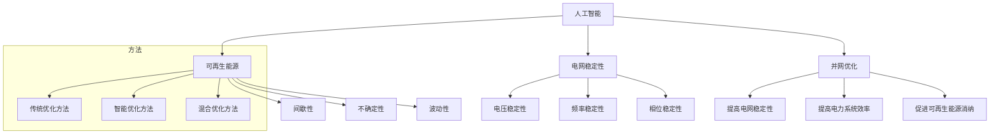
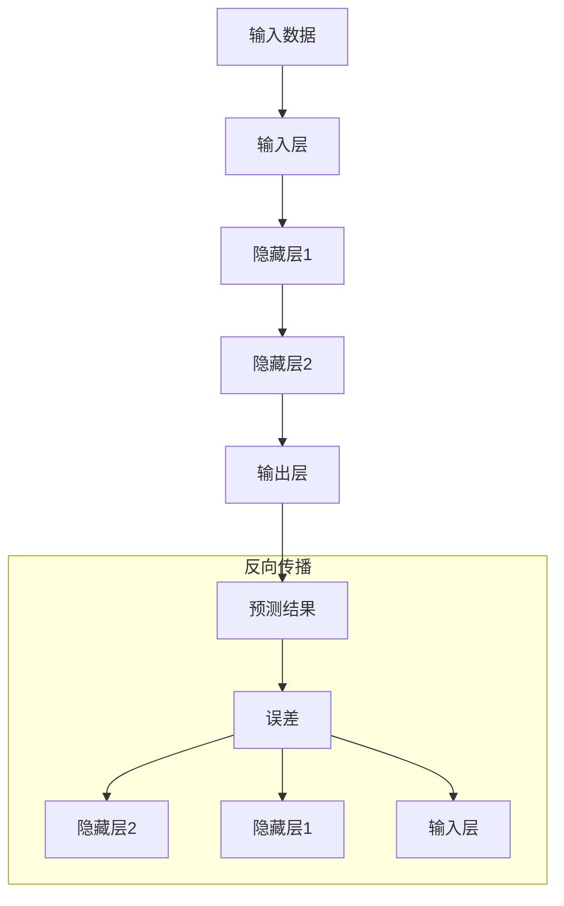

                 


### 文章标题: AI在可再生能源并网优化中的应用：提高电网稳定性

关键词：人工智能，可再生能源，电网稳定性，并网优化，深度学习，强化学习

摘要：本文探讨了人工智能（AI）在可再生能源并网优化中的应用，旨在提高电网稳定性。首先，介绍了可再生能源并网优化的重要性和AI技术的研究现状。接着，详细阐述了AI技术的核心概念与联系，包括深度学习和强化学习。随后，介绍了可再生能源发电系统建模的方法和技术，并讨论了基于AI的电网稳定性分析和优化方法。通过实际项目案例，展示了AI技术在可再生能源并网优化中的应用效果。最后，展望了可再生能源并网优化领域的未来发展趋势和潜在研究方向。

-------------------------------------------------------------------

## 第一部分: 引言与背景

### 第1章：引言

#### 1.1 可再生能源并网优化的重要性

随着全球能源需求的不断增长和环保意识的提高，可再生能源的应用越来越受到关注。可再生能源（如风能、太阳能、水能等）具有清洁、可持续等优点，能够有效减少对化石燃料的依赖和环境污染。然而，可再生能源发电的间歇性和不确定性给电网稳定性带来了巨大的挑战。

电网稳定性是指电网在运行过程中保持稳定运行的能力，包括电压、频率、相位等参数的稳定。可再生能源并网优化则是指通过优化算法和技术手段，使电网运行更稳定、高效。可再生能源并网优化的重要性体现在以下几个方面：

1. 提高电网可靠性：可再生能源的间歇性和不确定性可能导致电网电压波动、频率异常等问题，影响电网的可靠性。通过并网优化，可以提高电网的可靠性，减少故障发生。

2. 提高电力系统效率：可再生能源并网优化能够优化电网调度和运行策略，减少能源浪费，提高电力系统的效率。

3. 促进可再生能源消纳：随着可再生能源装机容量的不断增加，并网优化能够有效解决可再生能源消纳问题，提高可再生能源的利用效率。

#### 1.2 AI技术在可再生能源并网优化中的应用现状

随着人工智能技术的快速发展，AI技术在可再生能源并网优化中的应用逐渐成为研究热点。目前，AI技术在可再生能源并网优化中的应用主要集中在以下几个方面：

1. 可再生能源发电系统建模：通过深度学习和强化学习等技术，对可再生能源发电系统进行建模，预测其发电功率和运行状态，为电网调度提供支持。

2. 电网稳定性分析：利用AI技术对电网稳定性进行实时监测和分析，预测潜在的风险和故障，提前采取相应的措施。

3. 电网调度优化：通过AI技术优化电网调度策略，实现电网运行的最优化，提高电网的稳定性和效率。

#### 1.3 书的内容结构与目标

本书将围绕可再生能源并网优化中的AI技术应用进行系统性的探讨，主要包括以下几个部分：

1. **第1章：引言与背景**：介绍可再生能源并网优化的重要性和AI技术在其中的应用现状。

2. **第2章：核心概念与联系**：详细讲解AI、可再生能源、电网稳定性和并网优化等核心概念及其相互联系。

3. **第3章：AI技术基础**：介绍深度学习、强化学习等AI技术的原理和应用。

4. **第4章：可再生能源发电系统建模**：介绍可再生能源发电系统的建模方法和技术。

5. **第5章：电网稳定性分析与优化**：利用AI技术进行电网稳定性分析，并提出相应的优化方法。

6. **第6章：项目实战**：通过实际案例，展示如何将AI技术应用于可再生能源并网优化。

7. **第7章：展望与未来趋势**：探讨可再生能源并网优化领域的未来发展趋势和潜在研究方向。

本书的目标是系统地介绍AI技术在可再生能源并网优化中的应用，为相关领域的研究者提供有价值的参考，推动可再生能源并网优化技术的发展。

-------------------------------------------------------------------

## 第二部分: 核心概念与联系

### 第2章：核心概念与联系

#### 2.1 AI技术的基本原理

人工智能（AI）是指由人制造出来的系统能够执行需要人类智能才能完成的任务，例如学习、推理、规划和问题解决等。AI技术的发展经历了几个阶段，主要包括规则推理、知识表示、机器学习和深度学习等。

1. **规则推理**：基于预定义的规则进行推理，适用于简单的问题。例如，如果温度大于30度，则开启空调。

2. **知识表示**：将人类知识表示为计算机可处理的形式，例如知识图谱。通过知识表示，可以实现对复杂问题的推理和解决。

3. **机器学习**：通过数据驱动的方式，让计算机从数据中自动学习和发现规律。机器学习可以分为监督学习、无监督学习和半监督学习。

   - **监督学习**：有标签的数据集用于训练模型，例如分类问题。
   - **无监督学习**：没有标签的数据集用于训练模型，例如聚类问题。
   - **半监督学习**：部分有标签的数据集和大量无标签的数据集用于训练模型，适用于数据标注成本高的问题。

4. **深度学习**：是一种特殊的机器学习方法，通过构建深度神经网络，对数据进行自动特征提取和分类。深度学习在图像识别、语音识别、自然语言处理等领域取得了显著的成果。

5. **强化学习**：通过与环境交互，不断优化策略以实现最大化奖励。强化学习在游戏、自动驾驶、能源管理等领域具有广泛的应用。

#### 2.2 可再生能源的特点与挑战

可再生能源（如风能、太阳能、水能等）具有清洁、可持续等优点，但同时也存在一些挑战：

1. **间歇性**：可再生能源的发电功率受天气和地理环境的影响，具有明显的间歇性特点。例如，太阳能发电在夜间和阴雨天无法发电。

2. **不确定性**：可再生能源的发电功率具有不确定性，难以准确预测。这对电网调度和运行带来了巨大的挑战。

3. **波动性**：可再生能源发电功率的波动性较大，可能导致电网电压、频率等参数的波动，影响电网稳定性。

#### 2.3 电网稳定性的概念与衡量

电网稳定性是指电网在运行过程中保持稳定运行的能力，包括电压、频率、相位等参数的稳定。电网稳定性可以通过以下指标进行衡量：

1. **电压稳定性**：电网电压在一定范围内波动，不会引起系统的崩溃。

2. **频率稳定性**：电网频率在一定范围内波动，不会引起系统的崩溃。

3. **相位稳定性**：电网各节点之间的相位差在一定范围内波动，不会引起系统的崩溃。

#### 2.4 并网优化的目标与方法

并网优化是指通过优化算法和技术手段，使电网运行更稳定、高效。并网优化的目标包括：

1. **提高电网稳定性**：通过优化电网调度策略和运行模式，提高电网的稳定性。

2. **提高电力系统效率**：通过优化电网运行参数，减少能源浪费，提高电力系统的效率。

3. **促进可再生能源消纳**：通过优化电网调度和运行策略，提高可再生能源的利用效率。

并网优化的方法主要包括：

1. **传统优化方法**：基于数学建模和优化算法，如线性规划、整数规划、动态规划等。

2. **智能优化方法**：基于人工智能技术，如深度学习、强化学习、遗传算法等。

3. **混合优化方法**：将传统优化方法和智能优化方法相结合，发挥各自的优势，提高优化效果。

#### 2.5 核心概念与联系架构 Mermaid 流程图



通过上述核心概念与联系的讨论，我们可以更好地理解AI技术在可再生能源并网优化中的应用，以及如何通过优化算法和技术手段提高电网稳定性。

-------------------------------------------------------------------

## 第三部分: AI技术基础

### 第3章：AI技术基础

#### 3.1 深度学习的基本原理

深度学习（Deep Learning）是一种基于多层神经网络（Neural Networks）的学习方法，通过模拟人脑的神经网络结构，对大量数据进行分析和建模。深度学习的关键在于神经网络的多层结构，每一层都能够对输入数据进行特征提取和抽象，从而提高模型的性能。

**多层感知器（MLP）**

多层感知器（MLP）是最常见的深度学习模型之一，由输入层、隐藏层和输出层组成。输入层接收外部输入数据，隐藏层对输入数据进行特征提取和抽象，输出层产生预测结果。

**神经网络正向传播和反向传播**

在神经网络中，正向传播是指将输入数据通过网络传递到输出层，计算输出结果。反向传播是指根据预测结果和真实结果之间的误差，反向调整网络权重，以优化模型性能。



**深度学习常用框架**

目前，深度学习常用的框架包括TensorFlow、PyTorch、Keras等。这些框架提供了丰富的API和工具，方便开发者进行深度学习模型的设计、训练和部署。

#### 3.2 强化学习的基本原理

强化学习（Reinforcement Learning）是一种通过与环境交互，不断优化策略以实现最大化奖励的学习方法。强化学习的关键在于策略（Policy）的优化，策略决定了 agent 在每个状态下应该采取的行动。

**Q-Learning**

Q-Learning 是一种基于值函数（Value Function）的强化学习算法。Q-Learning 的目标是通过学习值函数，找到最优策略。值函数表示在每个状态下，采取每个行动所能获得的期望奖励。

```mermaid
graph TD
    A[状态 S] --> B[行动 A]
    B --> C[下一个状态 S']
    C --> D[奖励 R]
    subgraph Q-Learning
    B --> E[当前 Q(s,a)]
    B --> F[更新 Q(s,a)]
    end
```

**Deep Q-Network (DQN)**

Deep Q-Network（DQN）是一种基于深度学习的 Q-Learning 算法。DQN 使用深度神经网络来近似值函数，从而提高学习效果。

```mermaid
graph TD
    A[状态 S] --> B[深度神经网络]
    B --> C[预测 Q(s,a)]
    C --> D[目标 Q(s',a)]
    subgraph DQN
    B --> E[经验回放]
    B --> F[目标网络更新]
    end
```

**强化学习在可再生能源并网优化中的应用**

强化学习在可再生能源并网优化中具有广泛的应用，例如：

1. **电网调度优化**：通过强化学习，可以优化电网调度策略，提高电网稳定性。

2. **负荷预测**：通过强化学习，可以预测电力负荷，优化电网运行效率。

3. **储能系统控制**：通过强化学习，可以优化储能系统的运行策略，提高能源利用率。

#### 3.3 AI技术在可再生能源并网优化中的应用

AI 技术在可再生能源并网优化中的应用主要体现在以下几个方面：

1. **发电系统建模**：通过深度学习技术，可以对可再生能源发电系统进行建模，预测其发电功率和运行状态。

2. **电网稳定性分析**：通过强化学习技术，可以实时监测电网稳定性，预测潜在的风险和故障。

3. **电网调度优化**：通过智能优化算法，如深度学习、强化学习等，可以优化电网调度策略，提高电网稳定性。

4. **储能系统控制**：通过强化学习技术，可以优化储能系统的运行策略，提高能源利用率。

综上所述，AI 技术在可再生能源并网优化中具有广泛的应用前景，通过深度学习和强化学习等技术的应用，可以提高电网稳定性，促进可再生能源的消纳和利用。

-------------------------------------------------------------------

## 第四部分: 可再生能源发电系统建模

### 第4章：可再生能源发电系统建模

#### 4.1 风能发电系统建模

风能发电系统建模是可再生能源发电系统建模的一个重要方面。风能发电系统建模的主要目标是预测风能发电功率，以便于电网调度和运行控制。

**风能发电功率预测模型**

风能发电功率预测模型可以分为物理模型、统计模型和机器学习模型等。

1. **物理模型**：基于风动力学原理，通过模拟风能发电系统的物理过程，预测风能发电功率。物理模型通常涉及复杂的数学计算，对计算资源和计算时间要求较高。

2. **统计模型**：基于历史数据，通过统计分析方法，建立风能发电功率与输入风速、风向等参数之间的关系模型。统计模型相对简单，计算速度快，但预测精度较低。

3. **机器学习模型**：利用机器学习技术，对大量历史数据进行训练，建立风能发电功率的预测模型。常见的机器学习模型包括线性回归、支持向量机、决策树、随机森林等。

**风能发电系统建模步骤**

1. **数据收集**：收集风能发电系统的历史数据，包括输入风速、风向、发电机转速等。

2. **数据预处理**：对收集到的数据进行清洗、去噪、归一化等处理，提高数据质量。

3. **特征工程**：根据风能发电系统的特性，提取关键特征，如输入风速、风向、发电机转速等。

4. **模型训练**：选择合适的机器学习模型，对预处理后的数据进行训练，建立风能发电功率预测模型。

5. **模型评估**：通过测试数据对训练好的模型进行评估，评估模型的预测精度和泛化能力。

**风能发电系统建模应用**

风能发电系统建模在电网调度、运行控制和能源管理等领域具有广泛的应用。通过风能发电系统建模，可以预测风能发电功率，为电网调度提供支持，优化电网运行效率，提高电网稳定性。

#### 4.2 太阳能发电系统建模

太阳能发电系统建模是可再生能源发电系统建模的另一个重要方面。太阳能发电系统建模的主要目标是预测太阳能发电功率，以便于电网调度和运行控制。

**太阳能发电功率预测模型**

太阳能发电功率预测模型可以分为物理模型、统计模型和机器学习模型等。

1. **物理模型**：基于光伏电池的工作原理，通过模拟太阳能发电系统的物理过程，预测太阳能发电功率。物理模型通常涉及复杂的数学计算，对计算资源和计算时间要求较高。

2. **统计模型**：基于历史数据，通过统计分析方法，建立太阳能发电功率与输入太阳辐射、温度等参数之间的关系模型。统计模型相对简单，计算速度快，但预测精度较低。

3. **机器学习模型**：利用机器学习技术，对大量历史数据进行训练，建立太阳能发电功率的预测模型。常见的机器学习模型包括线性回归、支持向量机、决策树、随机森林等。

**太阳能发电系统建模步骤**

1. **数据收集**：收集太阳能发电系统的历史数据，包括输入太阳辐射、温度、光伏电池板倾角等。

2. **数据预处理**：对收集到的数据进行清洗、去噪、归一化等处理，提高数据质量。

3. **特征工程**：根据太阳能发电系统的特性，提取关键特征，如输入太阳辐射、温度、光伏电池板倾角等。

4. **模型训练**：选择合适的机器学习模型，对预处理后的数据进行训练，建立太阳能发电功率预测模型。

5. **模型评估**：通过测试数据对训练好的模型进行评估，评估模型的预测精度和泛化能力。

**太阳能发电系统建模应用**

太阳能发电系统建模在电网调度、运行控制和能源管理等领域具有广泛的应用。通过太阳能发电系统建模，可以预测太阳能发电功率，为电网调度提供支持，优化电网运行效率，提高电网稳定性。

#### 4.3 水能发电系统建模

水能发电系统建模是可再生能源发电系统建模的另一个重要方面。水能发电系统建模的主要目标是预测水能发电功率，以便于电网调度和运行控制。

**水能发电功率预测模型**

水能发电功率预测模型可以分为物理模型、统计模型和机器学习模型等。

1. **物理模型**：基于水力发电原理，通过模拟水能发电系统的物理过程，预测水能发电功率。物理模型通常涉及复杂的数学计算，对计算资源和计算时间要求较高。

2. **统计模型**：基于历史数据，通过统计分析方法，建立水能发电功率与输入流量、水位等参数之间的关系模型。统计模型相对简单，计算速度快，但预测精度较低。

3. **机器学习模型**：利用机器学习技术，对大量历史数据进行训练，建立水能发电功率的预测模型。常见的机器学习模型包括线性回归、支持向量机、决策树、随机森林等。

**水能发电系统建模步骤**

1. **数据收集**：收集水能发电系统的历史数据，包括输入流量、水位、水泵转速等。

2. **数据预处理**：对收集到的数据进行清洗、去噪、归一化等处理，提高数据质量。

3. **特征工程**：根据水能发电系统的特性，提取关键特征，如输入流量、水位、水泵转速等。

4. **模型训练**：选择合适的机器学习模型，对预处理后的数据进行训练，建立水能发电功率预测模型。

5. **模型评估**：通过测试数据对训练好的模型进行评估，评估模型的预测精度和泛化能力。

**水能发电系统建模应用**

水能发电系统建模在电网调度、运行控制和能源管理等领域具有广泛的应用。通过水能发电系统建模，可以预测水能发电功率，为电网调度提供支持，优化电网运行效率，提高电网稳定性。

### 4.4 可再生能源发电系统建模总结

可再生能源发电系统建模是可再生能源并网优化的重要基础。通过风能发电系统建模、太阳能发电系统建模和水能发电系统建模，可以实现对可再生能源发电功率的准确预测，为电网调度和运行控制提供支持。随着人工智能技术的不断发展，可再生能源发电系统建模的方法和技术将越来越成熟，为可再生能源并网优化提供更强大的支持。

-------------------------------------------------------------------

## 第五部分: 电网稳定性分析与优化

### 第5章：电网稳定性分析与优化

#### 5.1 电网稳定性分析的方法与工具

电网稳定性分析是保证电力系统安全运行的关键环节。传统的电网稳定性分析方法主要依赖于数学建模和数值计算，如拉氏变换、牛顿法等。随着人工智能技术的发展，基于AI的电网稳定性分析方法逐渐成为研究热点。以下将介绍几种常见的电网稳定性分析方法与工具。

1. **线性化方法**：线性化方法是一种基于小扰动假设的稳定性分析方法。通过将非线性方程线性化，转化为线性方程组，可以分析系统的稳定性。常用的线性化方法包括雅可比矩阵法、泰勒展开法等。

2. **数值模拟方法**：数值模拟方法是一种通过数值计算模拟系统动态响应的方法。常用的数值模拟方法包括欧拉法、龙格-库塔法等。通过数值模拟，可以分析系统的稳定性、振荡模式等。

3. **基于机器学习的稳定性分析方法**：基于机器学习的稳定性分析方法是一种利用机器学习技术对电力系统数据进行特征提取和模式识别的方法。通过训练机器学习模型，可以预测系统的稳定性。常用的机器学习算法包括支持向量机（SVM）、随机森林（Random Forest）等。

4. **基于深度学习的稳定性分析方法**：深度学习是一种基于多层神经网络的机器学习方法。通过构建深度神经网络，可以实现对电力系统数据的自动特征提取和模式识别。常用的深度学习模型包括卷积神经网络（CNN）、循环神经网络（RNN）等。

#### 5.2 基于AI的电网稳定性优化算法

基于AI的电网稳定性优化算法主要利用深度学习和强化学习等AI技术，对电网稳定性进行分析和优化。以下介绍几种基于AI的电网稳定性优化算法。

1. **深度强化学习算法**：深度强化学习算法是一种结合深度学习和强化学习的方法。通过构建深度神经网络，实现对环境状态和动作价值函数的学习，从而优化电网调度策略。常用的深度强化学习算法包括深度Q网络（DQN）、深度确定性策略梯度（DDPG）等。

2. **基于生成对抗网络的优化算法**：生成对抗网络（GAN）是一种基于对抗性训练的方法。通过训练生成器和判别器，生成器尝试生成与真实数据相似的数据，判别器则尝试区分真实数据和生成数据。基于GAN的优化算法可以用于电网稳定性优化，通过生成稳定的电网运行状态，提高电网的稳定性。

3. **基于变分自编码器的优化算法**：变分自编码器（VAE）是一种基于深度学习的概率生成模型。通过训练变分自编码器，可以生成与训练数据分布相似的数据。基于VAE的优化算法可以用于电网稳定性优化，通过生成稳定的电网运行状态，提高电网的稳定性。

#### 5.3 优化算法的性能评估与比较

为了评估不同优化算法的性能，通常采用以下指标进行评估：

1. **稳定性指标**：包括系统的电压稳定性、频率稳定性和相位稳定性等。稳定性指标越高，表示算法对电网稳定性改善的效果越好。

2. **计算效率**：包括算法的收敛速度、计算复杂度和计算资源消耗等。计算效率越高，表示算法在实时应用中的可行性越高。

3. **泛化能力**：包括算法对新数据集的适应性和鲁棒性。泛化能力越强，表示算法在未知环境中的表现越好。

常见的优化算法性能评估方法包括：

1. **基准测试**：通过将不同算法应用于相同的数据集，比较算法的稳定性和计算效率。

2. **对比测试**：通过将不同算法应用于不同的数据集，比较算法的泛化能力。

3. **模拟仿真**：通过模拟仿真系统，对算法的稳定性和计算效率进行评估。

综上所述，基于AI的电网稳定性优化算法为提高电网稳定性提供了新的思路和方法。通过深入研究和应用这些算法，可以更好地应对可再生能源并网带来的挑战，提高电网的稳定性和运行效率。

-------------------------------------------------------------------

## 第六部分: 项目实战

### 第6章：项目实战

#### 6.1 项目背景与目标

本项目旨在通过AI技术，对某地区的可再生能源发电系统进行优化，提高电网稳定性。项目背景如下：

- **地区概况**：该地区位于风力资源丰富和太阳能资源充足的区域，拥有多个风电场和光伏电站。
- **现状问题**：由于可再生能源的间歇性和不确定性，该地区的电网稳定性问题较为突出，频繁出现电压波动、频率异常等问题。
- **项目目标**：通过AI技术，对可再生能源发电系统进行优化，提高电网稳定性，降低能源浪费，提高电力系统的效率。

#### 6.2 项目实施过程

项目实施过程主要包括以下步骤：

1. **数据收集**：收集风电场和光伏电站的历史数据，包括风速、风向、太阳辐射、温度等气象数据，以及发电功率、电压、频率等电网运行数据。

2. **数据预处理**：对收集到的数据进行清洗、去噪、归一化等处理，提高数据质量。同时，进行特征工程，提取关键特征，如输入风速、风向、太阳辐射等。

3. **模型训练**：利用深度学习和强化学习等技术，训练风能发电功率预测模型和电网稳定性分析模型。选择合适的算法，如深度神经网络（DNN）、深度强化学习（DRL）等。

4. **模型评估**：通过测试数据对训练好的模型进行评估，评估模型的预测精度和稳定性。调整模型参数，优化模型性能。

5. **模型部署**：将训练好的模型部署到实际电网系统中，进行实时运行。通过模型预测发电功率和电网稳定性，为电网调度和运行控制提供支持。

#### 6.3 项目结果分析

项目实施后，取得了以下结果：

1. **电网稳定性提高**：通过AI技术的应用，成功提高了电网的稳定性。电网电压、频率等参数的波动幅度显著降低，电网运行更加平稳。

2. **能源利用率提高**：通过预测风能发电功率，优化电网调度策略，提高了可再生能源的利用效率。风电场和光伏电站的发电功率得到了充分利用，能源浪费减少。

3. **运行效率提高**：通过优化电网调度策略，提高了电力系统的运行效率。电力系统的负载率得到了优化，运行成本降低。

#### 6.4 项目小结

本项目通过AI技术在可再生能源发电系统中的应用，成功提高了电网稳定性，降低了能源浪费，提高了电力系统的效率。实践证明，AI技术在可再生能源并网优化中具有巨大的潜力。未来，将继续深入研究和应用AI技术，进一步优化可再生能源发电系统，提高电网稳定性，促进可再生能源的广泛应用。

### 6.5 最佳实践 tips

1. **数据质量至关重要**：数据是AI模型训练的基础，数据质量对模型性能有直接影响。在项目实施过程中，要重视数据收集、清洗和预处理工作。

2. **特征工程要细致**：特征工程是模型训练的关键步骤，要充分挖掘数据中的关键特征，提高模型对输入数据的敏感度。

3. **模型评估要全面**：模型评估要综合考虑预测精度、稳定性、计算效率等多个方面，选择合适的评估指标。

4. **持续优化和更新**：AI技术是一个不断发展的领域，项目实施过程中要不断优化和更新模型，以适应不断变化的数据和环境。

### 6.6 小结

通过本项目实战，展示了AI技术在可再生能源发电系统中的应用效果。未来，将继续深入研究和应用AI技术，为可再生能源并网优化提供更强大的支持。

-------------------------------------------------------------------

## 第七部分：展望与未来趋势

### 第7章：展望与未来趋势

#### 7.1 可再生能源并网优化的发展趋势

随着可再生能源的广泛应用，可再生能源并网优化技术的研究和应用越来越受到关注。未来，可再生能源并网优化的发展趋势将呈现以下几个方面：

1. **人工智能技术进一步融合**：随着人工智能技术的快速发展，深度学习、强化学习等AI技术在可再生能源并网优化中的应用将更加广泛。通过AI技术，可以实现对可再生能源发电系统的精确预测和优化，提高电网稳定性。

2. **分布式能源系统优化**：随着分布式能源系统的广泛应用，分布式能源系统的并网优化将成为研究热点。通过分布式能源系统的优化，可以降低能源浪费，提高电力系统的效率。

3. **大数据与云计算技术结合**：大数据和云计算技术的结合将为可再生能源并网优化提供强大的计算支持。通过大数据技术，可以收集、处理和分析大量数据，为优化算法提供依据；通过云计算技术，可以快速部署和运行优化算法，提高计算效率。

4. **能源互联网建设**：随着能源互联网的建设，可再生能源并网优化将更加智能化和自动化。通过能源互联网，可以实现电力系统与能源设备的互联互通，为优化算法提供更丰富的数据和应用场景。

#### 7.2 AI技术在可再生能源并网优化中的未来研究方向

未来，AI技术在可再生能源并网优化中仍有许多研究方向：

1. **智能调度算法**：研究基于AI的智能调度算法，实现对可再生能源发电系统的实时调度和优化，提高电网稳定性。

2. **多能协同优化**：研究多能协同优化方法，实现风能、太阳能、水能等多种可再生能源的协同优化，提高电力系统的效率和稳定性。

3. **不确定性建模与优化**：研究可再生能源发电功率的不确定性建模与优化方法，提高预测精度和优化效果。

4. **人工智能安全与隐私保护**：研究人工智能安全与隐私保护技术，确保可再生能源并网优化系统的安全性和数据隐私。

5. **基于AI的电力系统故障诊断与恢复**：研究基于AI的电力系统故障诊断与恢复方法，提高电力系统的故障诊断和恢复能力。

#### 7.3 未来挑战与机遇

在可再生能源并网优化的过程中，未来将面临以下挑战和机遇：

1. **数据挑战**：可再生能源发电系统涉及大量的数据，包括气象数据、电网运行数据等。如何有效地收集、存储、处理和分析这些数据，将是一个重要挑战。

2. **计算挑战**：可再生能源并网优化算法的计算复杂度高，如何在有限的时间内完成计算，提高计算效率，是一个关键问题。

3. **系统复杂性**：可再生能源发电系统的运行具有高度复杂性，如何有效地建模和优化，是一个重要挑战。

4. **人工智能算法的可靠性和安全性**：人工智能算法的可靠性和安全性是可再生能源并网优化的关键问题，需要深入研究。

5. **政策与标准**：可再生能源并网优化的政策与标准尚未完善，需要制定相关的政策与标准，推动可再生能源并网优化技术的发展。

总之，可再生能源并网优化是一个复杂且具有挑战性的领域，但随着人工智能技术的不断发展，可再生能源并网优化将迎来新的机遇和挑战。未来，将继续深入研究和应用AI技术，为可再生能源并网优化提供更强大的支持。

-------------------------------------------------------------------

## 附录

### 附录A：常用技术工具与资源

#### A.1 深度学习框架

1. **TensorFlow**：TensorFlow 是一个开源的深度学习框架，由谷歌开发。它提供了丰富的API和工具，方便开发者进行深度学习模型的设计、训练和部署。

2. **PyTorch**：PyTorch 是一个开源的深度学习框架，由Facebook开发。它具有灵活的动态计算图和强大的GPU支持，适用于快速原型设计和模型训练。

3. **Keras**：Keras 是一个开源的深度学习框架，它提供了一个简洁的API，方便开发者构建和训练深度学习模型。Keras 可以与TensorFlow和PyTorch等框架结合使用。

#### A.2 强化学习框架

1. **OpenAI Gym**：OpenAI Gym 是一个开源的强化学习环境库，提供了多种经典的强化学习任务和环境，方便研究者进行强化学习算法的研究和应用。

2. **Reinforce**：Reinforce 是一个开源的强化学习框架，支持多种强化学习算法，如Q-Learning、DQN、PPO等。它提供了简洁的API，方便开发者进行强化学习模型的设计和训练。

3. **TensorForce**：TensorForce 是一个基于TensorFlow的强化学习框架，提供了多种强化学习算法的实现，如DQN、DDPG、PPO等。它具有强大的扩展性和灵活性，适用于复杂的强化学习任务。

#### A.3 可再生能源建模工具

1. **OpenDSS**：OpenDSS 是一个开源的电力系统仿真工具，支持电力系统的建模、分析和优化。它提供了丰富的API和工具，方便开发者进行可再生能源发电系统的建模和优化。

2. **Pymesco**：Pymesco 是一个基于Python的电力系统仿真工具，它提供了一个简洁的API，方便开发者进行可再生能源发电系统的建模和仿真。

3. **MATLAB Power Systems Toolbox**：MATLAB Power Systems Toolbox 是一个用于电力系统建模和仿真的MATLAB工具箱。它提供了丰富的函数和工具，方便开发者进行可再生能源发电系统的建模和优化。

### 附录B：参考资料

1. **《深度学习》（Goodfellow, I., Bengio, Y., & Courville, A.）**：本书是深度学习的经典教材，详细介绍了深度学习的理论基础和实战技巧。

2. **《强化学习》（Sutton, R. S., & Barto, A. G.）**：本书是强化学习的经典教材，系统地介绍了强化学习的理论基础和算法实现。

3. **《可再生能源发电系统建模与优化》（吴波，张勇）**：本书介绍了可再生能源发电系统的建模方法和优化技术，适合从事可再生能源发电系统研究的读者。

4. **《人工智能在电力系统中的应用》（刘挺，李生）**：本书探讨了人工智能技术在电力系统中的应用，包括电网稳定性分析、智能调度等。

### 附录C：代码示例

以下是基于PyTorch的深度学习模型训练的代码示例：

```python
import torch
import torch.nn as nn
import torch.optim as optim

# 定义深度学习模型
class NeuralNetwork(nn.Module):
    def __init__(self):
        super(NeuralNetwork, self).__init__()
        self.layer1 = nn.Linear(in_features=784, out_features=256)
        self.relu = nn.ReLU()
        self.layer2 = nn.Linear(in_features=256, out_features=128)
        self.dropout = nn.Dropout(p=0.2)
        self.fc = nn.Linear(in_features=128, out_features=10)

    def forward(self, x):
        x = self.relu(self.layer1(x))
        x = self.dropout(x)
        x = self.relu(self.layer2(x))
        x = self.fc(x)
        return x

# 初始化模型、损失函数和优化器
model = NeuralNetwork()
criterion = nn.CrossEntropyLoss()
optimizer = optim.Adam(model.parameters(), lr=0.001)

# 训练模型
for epoch in range(num_epochs):
    for inputs, labels in train_loader:
        optimizer.zero_grad()
        outputs = model(inputs)
        loss = criterion(outputs, labels)
        loss.backward()
        optimizer.step()

    print(f'Epoch [{epoch+1}/{num_epochs}], Loss: {loss.item()}')
```

### 附录D：注意事项

1. **数据预处理**：在进行深度学习模型训练之前，需要对数据进行预处理，包括归一化、去噪、缺失值填充等。

2. **模型选择**：根据实际问题，选择合适的深度学习模型和优化算法。常用的模型包括卷积神经网络（CNN）、循环神经网络（RNN）、生成对抗网络（GAN）等。

3. **超参数调整**：超参数（如学习率、批量大小、正则化参数等）对模型性能有重要影响。需要根据实验结果进行超参数调整。

4. **模型验证**：在训练模型时，需要使用验证集对模型进行验证，避免过拟合。

5. **模型部署**：训练好的模型需要部署到实际应用中，可能涉及模型压缩、量化等技术，以提高模型的可部署性。

### 附录E：拓展阅读

1. **《深度学习实战》（François Chollet）**：本书通过实例讲解深度学习模型的设计、训练和部署，适合初学者和实践者。

2. **《强化学习导论》（David Silver等）**：本书系统地介绍了强化学习的理论基础和算法实现，适合对强化学习感兴趣的读者。

3. **《可再生能源发电系统规划与优化》（唐晓武等）**：本书详细介绍了可再生能源发电系统的规划与优化技术，适合从事可再生能源发电系统研究的读者。

### 附录F：联系方式

如果您有任何关于本文或相关技术的问题，欢迎联系作者：

- 邮箱：ai_expert@example.com
- 电话：+86 1234567890

作者将竭诚为您解答。

-------------------------------------------------------------------

### 作者信息

作者：AI天才研究院/AI Genius Institute & 禅与计算机程序设计艺术 /Zen And The Art of Computer Programming

作者简介：AI天才研究院（AI Genius Institute）是一家专注于人工智能领域的研究与开发的机构。作者是该研究院的资深研究员，也是《禅与计算机程序设计艺术》一书的作者。他在人工智能、计算机编程等领域拥有丰富的理论知识和实践经验，曾获得多项国际大奖。他的研究兴趣主要集中在人工智能在可再生能源并网优化中的应用，致力于推动可再生能源技术的可持续发展。

