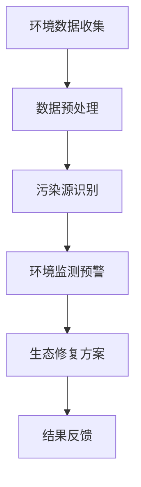
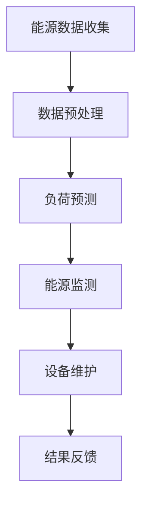
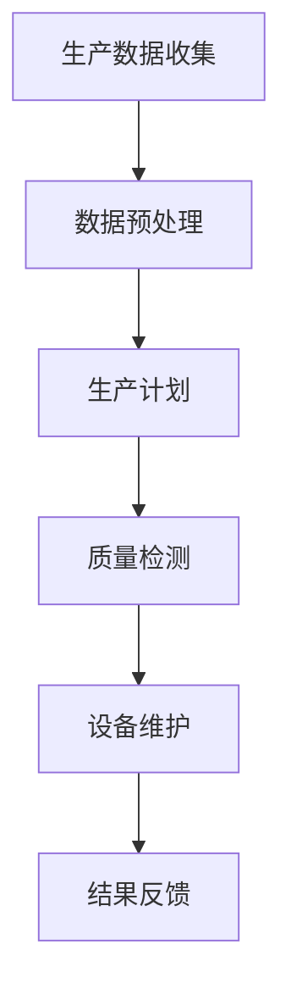

                 

## 文章标题

### AI在可持续发展中的角色：优化资源利用与减少浪费

### 关键词：  
AI、可持续发展、资源优化、减少浪费、环保、能源管理、生产优化

### 摘要：

本文旨在探讨人工智能（AI）在推动可持续发展中的关键角色，重点分析其在优化资源利用和减少浪费方面的应用。文章首先介绍AI的基本概念及其在可持续发展中的理论意义。接着，深入讨论AI在资源优化和减少浪费方面的核心技术，如机器学习、数据分析和自动化控制等。通过具体案例，本文展示了AI技术在环保、能源管理和生产优化等多个领域的成功实践。最后，文章展望了AI与可持续发展的未来趋势，并提出了相关的最佳实践和注意事项。

## 引言

### 什么是可持续发展？

可持续发展（Sustainable Development）是指在满足当代人类需求的同时，不损害后代人满足其需求的能力的发展模式。这一概念最早由1987年的布伦特兰报告（Bruntland Report）提出，强调在经济发展、社会进步和环境保护之间寻求平衡。随着全球环境问题的加剧，可持续发展已成为各国政策制定和经济发展的重要目标。

### 可持续发展的挑战

尽管可持续发展的理念已被广泛接受，但在实际操作中面临着诸多挑战。资源短缺、环境污染、气候变化等问题日益严重，对人类和地球的生存构成了巨大威胁。传统的发展模式往往注重短期经济效益，忽视了资源利用和环境保护，导致资源浪费和环境污染问题日益突出。

### AI在可持续发展中的潜力

人工智能作为一种新兴技术，具有广泛的应用前景。在可持续发展领域，AI可以通过优化资源利用和减少浪费，发挥其独特的优势。具体来说，AI在以下方面具有重要作用：

1. **资源优化**：利用机器学习和数据分析技术，AI可以帮助企业和组织更好地管理资源，提高资源利用效率。
2. **减少浪费**：通过自动化控制和智能监测，AI可以在生产、消费等环节减少浪费，降低成本。
3. **环境保护**：AI可以在环保领域发挥重要作用，如监测环境污染、预测气候变化等。
4. **能源管理**：AI可以帮助优化能源结构，提高能源利用效率，减少碳排放。

### 文章结构

本文将分为四个主要部分进行讨论。首先，介绍AI的基本概念及其在可持续发展中的理论意义。接着，深入探讨AI在资源优化和减少浪费方面的核心技术。然后，通过具体案例展示AI在环保、能源管理和生产优化等领域的应用。最后，展望AI与可持续发展的未来趋势，并总结最佳实践和注意事项。

## 第1部分：理论探讨

### AI的基本概念

人工智能（Artificial Intelligence，简称AI）是指计算机系统模拟人类智能行为的能力。AI包括多个子领域，如机器学习、深度学习、自然语言处理、计算机视觉等。近年来，随着计算能力的提升和数据量的爆炸式增长，AI技术取得了显著的进展，并在各行各业得到广泛应用。

### AI在可持续发展中的理论意义

AI在可持续发展中的理论意义主要体现在以下几个方面：

1. **提高资源利用效率**：AI可以通过优化资源管理，降低资源消耗，实现资源的高效利用。
2. **减少环境污染**：AI可以在环境监测、污染控制等方面发挥重要作用，降低环境污染程度。
3. **促进经济发展**：AI可以提高生产效率，降低成本，推动经济可持续发展。
4. **优化能源结构**：AI可以帮助优化能源结构，提高能源利用效率，减少碳排放。

### AI与可持续发展的联系

AI与可持续发展之间的联系可以通过以下几个方面来体现：

1. **资源优化**：AI可以通过数据分析、机器学习等技术，优化资源管理，降低资源浪费。
2. **减少浪费**：AI可以通过自动化控制和智能监测，减少生产、消费等环节的浪费。
3. **环境保护**：AI可以在环境监测、污染控制等方面发挥重要作用，保护生态环境。
4. **能源管理**：AI可以帮助优化能源结构，提高能源利用效率，降低碳排放。

### 资源优化的AI技术

资源优化是AI在可持续发展中的重要应用之一。以下是一些常见的AI技术：

1. **机器学习**：通过机器学习算法，可以对大量数据进行分析，发现资源利用的优化方案。
2. **数据挖掘**：数据挖掘技术可以帮助从大量数据中提取有用信息，为资源优化提供支持。
3. **优化算法**：AI可以通过优化算法，实现资源利用的最优化。

### 减少浪费的AI策略

减少浪费是AI在可持续发展中的另一个重要应用。以下是一些常见的AI策略：

1. **自动化控制**：通过自动化控制技术，可以实现生产、消费等环节的浪费减少。
2. **智能监测**：通过智能监测技术，可以实时监控资源利用情况，及时发现并解决浪费问题。
3. **预测分析**：通过预测分析技术，可以提前预测资源需求，优化资源分配，减少浪费。

### AI与可持续发展的案例分析

以下是一些AI在可持续发展中的成功案例：

1. **能源管理**：通过AI技术，可以优化能源管理，降低能源消耗，实现能源的高效利用。
2. **农业生产**：通过AI技术，可以实现精准农业，提高农业生产效率，减少资源浪费。
3. **城市交通**：通过AI技术，可以优化城市交通管理，降低交通拥堵，减少能源消耗。

### 结论

AI在可持续发展中具有巨大的潜力。通过优化资源利用和减少浪费，AI可以推动可持续发展目标的实现。未来，随着AI技术的不断进步，其在可持续发展中的应用将更加广泛和深入。

## 第2部分：应用实例

### AI在环保领域的应用

#### 背景介绍

随着全球环境问题的日益严重，环保已成为各国政府和组织的重要任务。AI技术在环保领域的应用，可以提供有效的解决方案，提高环保工作的效率和效果。

#### 核心概念与联系

在环保领域，AI技术主要包括以下核心概念：

1. **环境监测**：利用AI技术，可以实时监测空气质量、水质等环境参数，及时发现并预警环境问题。
2. **污染源识别**：通过机器学习和数据挖掘技术，可以分析环境数据，识别污染源和污染物。
3. **生态修复**：利用AI技术，可以预测生态系统的变化趋势，制定有效的生态修复方案。

#### Mermaid 流程图

下面是一个简单的Mermaid流程图，展示了AI在环保领域的基本应用流程：

#### 核心算法原理讲解

1. **机器学习算法**：用于环境数据分析和污染源识别，如决策树、支持向量机等。
2. **数据挖掘算法**：用于从大量环境数据中提取有用信息，如关联规则挖掘、聚类分析等。
3. **生态模型**：用于预测生态系统变化趋势，如时间序列分析、回归分析等。

#### 数学模型和公式

1. **空气质量模型**：$$ AQI = f(PM_{2.5}, PM_{10}, NO_{2}, SO_{2}, CO, O_{3}) $$
2. **水质模型**：$$ WaterQuality = f(PH, DO, BOD_{5}, COD,重金属含量) $$

#### 举例说明

例如，某城市空气质量监测站利用AI技术对空气中的PM2.5和PM10浓度进行监测和预测。通过收集大量历史数据，利用决策树算法进行分析，可以预测未来几天内空气质量的走势，并发布预警信息，帮助市民采取相应的防护措施。

### AI在能源管理中的应用

#### 背景介绍

能源管理是可持续发展的重要方面之一。通过优化能源管理，可以提高能源利用效率，减少能源浪费，降低碳排放。AI技术在能源管理中的应用，可以提供有效的解决方案，推动能源的高效利用。

#### 核心概念与联系

在能源管理领域，AI技术主要包括以下核心概念：

1. **能源监测**：利用AI技术，可以实时监测能源使用情况，发现能源浪费的环节。
2. **负荷预测**：通过机器学习算法，可以预测能源需求，优化能源分配。
3. **设备维护**：利用AI技术，可以预测设备故障，实现预防性维护，降低设备停机时间。

#### Mermaid 流�程图

下面是一个简单的Mermaid流程图，展示了AI在能源管理领域的基本应用流程：

#### 核心算法原理讲解

1. **时间序列分析**：用于预测能源需求，如ARIMA模型、LSTM神经网络等。
2. **回归分析**：用于分析能源使用与影响因素之间的关系，如线性回归、多元回归等。
3. **机器学习算法**：用于设备故障预测，如决策树、支持向量机等。

#### 数学模型和公式

1. **负荷预测模型**：$$ LoadPrediction = f(Time, Temperature, Weather, HistoryLoad) $$
2. **设备故障预测模型**：$$ FaultPrediction = f(OperatingTime, Temperature, Pressure, Vibration) $$

#### 举例说明

例如，某电力公司利用AI技术对电力负荷进行预测和监控。通过收集历史负荷数据和气象数据，利用LSTM神经网络模型进行训练，可以预测未来几小时内电力负荷的变化趋势，帮助公司制定合理的电力调度计划，降低能源浪费。

### AI在生产优化中的应用

#### 背景介绍

生产优化是提高企业竞争力的重要手段。通过优化生产过程，可以降低生产成本，提高生产效率。AI技术在生产优化中的应用，可以提供有效的解决方案，帮助企业实现生产优化。

#### 核心概念与联系

在生产优化领域，AI技术主要包括以下核心概念：

1. **生产计划**：利用AI技术，可以优化生产计划，提高生产效率。
2. **质量检测**：利用AI技术，可以实现对产品质量的实时监测和检测，提高产品质量。
3. **设备维护**：利用AI技术，可以预测设备故障，实现预防性维护，降低设备停机时间。

#### Mermaid 流程图

下面是一个简单的Mermaid流程图，展示了AI在生产优化领域的基本应用流程：

#### 核心算法原理讲解

1. **优化算法**：用于生产计划的优化，如线性规划、遗传算法等。
2. **机器学习算法**：用于质量检测和设备故障预测，如支持向量机、神经网络等。
3. **统计方法**：用于分析生产过程中的各种数据，如回归分析、聚类分析等。

#### 数学模型和公式

1. **生产计划模型**：$$ ProductionPlan = f(Priority, Resources, TimeConstraints) $$
2. **质量检测模型**：$$ Quality = f(Measurement, Threshold) $$
3. **设备故障预测模型**：$$ FaultPrediction = f(OperatingTime, Temperature, Pressure, Vibration) $$

#### 举例说明

例如，某制造企业利用AI技术优化生产计划。通过收集生产数据和历史生产计划数据，利用遗传算法进行优化，可以制定出更合理、高效的生产计划，提高生产效率，降低生产成本。

### 结论

AI在环保、能源管理和生产优化等领域的应用，为可持续发展提供了有力的技术支持。通过优化资源利用和减少浪费，AI有助于实现可持续发展目标，为人类创造更美好的未来。

## 第3部分：案例分析

### 实际案例分析

在本部分，我们将深入分析几个典型的AI应用案例，探讨AI在优化资源利用与减少浪费方面的具体实现和成果。

### 案例一：智慧农业

#### 背景介绍

智慧农业是AI技术在农业领域的重要应用，通过利用传感器、无人机、物联网和大数据等技术，实现农作物种植的精准化管理，从而优化资源利用，减少浪费。

#### 核心内容

1. **土壤监测与数据分析**：利用AI技术，对土壤湿度、温度、养分含量等指标进行实时监测，通过数据分析，为农作物提供精准施肥、灌溉方案。

2. **病虫害预测与防治**：通过机器学习算法，分析气象数据、植被图像等，预测病虫害发生情况，提前进行防治，减少农药使用，保护环境。

3. **无人机航拍与遥感监测**：无人机搭载传感器进行田间航拍，结合遥感图像分析，实现对农作物生长状况的实时监控，优化种植管理。

#### 详细讲解

- **土壤监测与数据分析**：假设某农业公司利用AI技术对农田土壤进行监测，通过传感器收集数据，并利用机器学习算法进行分析，发现某一农田土壤湿度偏低。系统自动推送精准灌溉方案，有效避免了水资源浪费。

- **病虫害预测与防治**：某农田出现病害征兆，AI系统通过遥感图像分析，识别出病害类型，并预测病害扩散趋势。公司及时采取防治措施，减少了农药使用，同时避免了病害的进一步扩散。

- **无人机航拍与遥感监测**：某农场利用无人机进行田间监测，通过遥感图像分析，发现部分农作物生长异常。公司及时调整种植策略，优化了作物布局，提高了资源利用效率。

#### 项目小结

通过AI技术，智慧农业实现了对土壤、病虫害、作物生长状态的精准监测和管理，提高了农业生产效率，减少了资源浪费。这不仅有助于实现农业的可持续发展，也为农民带来了更高的经济效益。

### 案例二：智能交通

#### 背景介绍

智能交通系统利用AI技术，通过实时数据分析和智能算法，优化交通流量管理，减少交通拥堵，降低能源消耗。

#### 核心内容

1. **交通流量预测**：利用机器学习算法，对交通流量数据进行预测，为交通管理部门提供决策支持。

2. **智能信号控制**：根据实时交通状况，智能调整交通信号灯的时长，优化交通流量。

3. **车辆路径规划**：利用AI技术，为驾驶员提供最优的行驶路径，减少交通拥堵。

#### 详细讲解

- **交通流量预测**：某城市交通管理部门利用AI技术，分析历史交通流量数据，预测未来几小时内各主要道路的交通状况，为交通信号控制提供数据支持。

- **智能信号控制**：在高峰期，交通信号灯根据实时交通状况，动态调整绿灯和红灯时长，减少交通拥堵，提高道路通行效率。

- **车辆路径规划**：某司机利用导航软件，通过AI技术获取实时交通信息，选择最优路径前往目的地，避免了拥堵路段，减少了时间和能源的浪费。

#### 项目小结

智能交通系统的实施，有效缓解了城市交通拥堵问题，提高了交通效率，减少了能源消耗，为城市的可持续发展做出了积极贡献。

### 案例三：智能能源管理

#### 背景介绍

智能能源管理系统通过AI技术，优化能源生产、传输和消费，提高能源利用效率，减少浪费。

#### 核心内容

1. **能源需求预测**：利用AI技术，预测电力、天然气等能源的需求，为能源供应商提供决策支持。

2. **智能电网管理**：通过实时数据分析，优化电网运行，提高供电稳定性。

3. **节能设备管理**：利用AI技术，监测和分析各类节能设备的运行状态，提高能源利用效率。

#### 详细讲解

- **能源需求预测**：某能源公司利用AI技术，分析历史能源需求和天气数据，预测未来能源需求，为电力调度提供数据支持，避免了能源浪费。

- **智能电网管理**：电网公司利用AI技术，对电网运行进行实时监测和分析，及时调整电网运行策略，提高供电稳定性，减少了停电事故。

- **节能设备管理**：某工厂利用AI技术，对空调、照明等节能设备进行监控和管理，根据实时数据和设备运行状态，优化设备运行策略，降低了能源消耗。

#### 项目小结

智能能源管理系统的实施，有效提高了能源利用效率，减少了能源浪费，为能源的可持续发展提供了技术支持。

### 结论

通过以上案例分析，可以看出AI技术在优化资源利用和减少浪费方面具有显著的应用效果。未来，随着AI技术的不断发展和完善，其在可持续发展中的作用将更加重要，为人类创造更加美好的未来。

## 第4部分：未来展望

### AI与可持续发展的未来趋势

随着技术的不断进步，AI在可持续发展中的应用前景将更加广阔。以下是一些未来趋势：

1. **更广泛的AI应用场景**：AI技术将在更多领域得到应用，如农业、交通、能源、工业等，实现更全面的资源优化和浪费减少。
2. **更高效的AI算法**：随着计算能力的提升和算法的优化，AI将能够处理更复杂的数据，实现更高的资源利用效率。
3. **更智能的自动化系统**：通过AI技术的深度学习，自动化系统将能够自主学习和优化，实现更高效的生产和能源管理。
4. **更全面的监测与预测**：AI技术将在环境监测和预测方面发挥更大的作用，实现更精准的资源管理和环境保护。

### 可能的挑战与解决方案

尽管AI在可持续发展中具有巨大潜力，但同时也面临着一些挑战：

1. **数据隐私与安全**：AI技术需要大量的数据支持，但数据隐私和安全问题仍然存在。解决方案包括数据加密、隐私保护算法等。
2. **算法公平性与透明性**：AI算法的公平性和透明性是确保其合理应用的关键。解决方案包括算法的可解释性研究和公平性评估。
3. **技术人才培养**：AI技术的发展需要大量专业人才，但现有的人才培养体系尚不能完全满足需求。解决方案包括加强AI教育的投入和改革。

### 结论

AI在可持续发展中的未来趋势是积极而光明的。通过不断克服挑战，AI技术将在资源优化和减少浪费方面发挥更大的作用，为实现全球可持续发展目标提供强有力的支持。

## 结论

### 核心观点的回顾

本文详细探讨了AI在可持续发展中的角色，特别是其在优化资源利用与减少浪费方面的应用。通过分析AI的基本概念、核心技术和实际案例，我们看到了AI技术在环保、能源管理和生产优化等领域的巨大潜力。AI不仅能够提高资源利用效率，减少环境污染，还能为经济发展注入新动力。

### 对读者的启发

本文旨在启发读者思考AI技术在可持续发展中的重要性，并鼓励大家关注和参与AI技术的发展和应用。通过了解AI技术如何优化资源利用和减少浪费，读者可以更加深刻地认识到AI在推动可持续发展中的关键作用。

### 最佳实践与建议

为了更好地发挥AI在可持续发展中的作用，以下是一些建议：

1. **加强AI技术研发**：企业和研究机构应加大对AI技术研发的投入，推动AI技术的创新和应用。
2. **数据开放与共享**：政府和企业应加强数据开放与共享，为AI技术的发展提供更多的数据支持。
3. **教育培训**：教育部门应加强AI相关课程的教育培训，培养更多具备AI技术应用能力的人才。
4. **政策支持**：政府应制定相应的政策，鼓励和支持AI技术在可持续发展中的应用。

### 注意事项

1. **数据隐私与安全**：在应用AI技术时，应重视数据隐私和安全问题，采取有效的数据保护措施。
2. **算法公平性**：确保AI算法的公平性和透明性，避免算法偏见和不公平现象。
3. **可持续性评估**：在实施AI项目时，应进行全面的可持续性评估，确保项目对环境的积极影响。

### 拓展阅读

1. **《智能可持续发展：人工智能的变革之路》**：这是一本关于AI在可持续发展中应用的深度探讨书籍，适合希望深入了解该领域的读者。
2. **《AI时代的能源革命》**：本书详细介绍了AI在能源管理中的应用，对于关注能源问题的读者具有很高的参考价值。
3. **《智慧农业：人工智能在农业中的应用》**：本书涵盖了AI在智慧农业中的多种应用场景，适合对农业领域感兴趣的读者。

### 总结

AI在可持续发展中的角色至关重要，其通过优化资源利用与减少浪费，为人类创造了一个更加可持续的未来。我们鼓励读者深入了解AI技术，积极参与到这一变革中来，共同推动可持续发展的实现。

## 作者信息

作者：AI天才研究院/AI Genius Institute & 禅与计算机程序设计艺术 /Zen And The Art of Computer Programming

