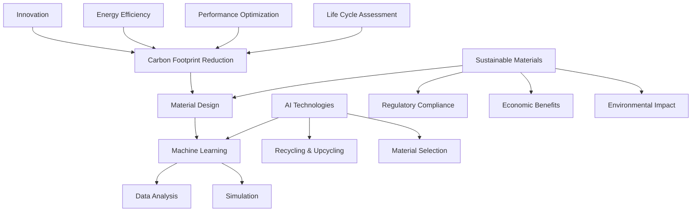

                 


### Preface

In this preface, we will provide an overview of the book's objectives, structure, and target audience. We will also discuss the importance of sustainable building materials and the role of AI in their design.

#### Objectives

The primary objective of this book is to explore the integration of AI technologies in the design and development of sustainable building materials, aiming to reduce their carbon footprint. We aim to provide a comprehensive guide that covers the fundamental concepts, algorithms, tools, and case studies in this emerging field.

#### Structure

The book is organized into seven chapters. The first chapter introduces AI and sustainable building materials, providing a foundational understanding. The subsequent chapters delve into AI technologies, core concepts, techniques for reducing carbon footprint, case studies, challenges, and practical applications. Each chapter builds on the previous one, creating a cohesive narrative.

#### Target Audience

This book targets professionals and researchers in the fields of construction, materials science, and AI. It is also suitable for students pursuing degrees in civil engineering, materials science, and computer science. By the end of the book, readers will gain a deep understanding of how AI can revolutionize the building materials industry and contribute to a more sustainable future.

#### Importance of Sustainable Building Materials

The construction industry is one of the largest contributors to global carbon emissions. Traditional building materials, such as concrete, steel, and plastic, are often resource-intensive and environmentally harmful. Sustainable building materials, on the other hand, are designed to minimize environmental impact while providing similar or improved performance. The importance of sustainable building materials lies in their potential to address several pressing issues:

1. **Reducing Carbon Footprint:** By using sustainable building materials, we can significantly reduce the carbon emissions associated with construction activities. This is crucial for combating climate change and meeting global environmental goals.
2. **Conservation of Natural Resources:** Sustainable building materials often use recycled or renewable resources, reducing the demand for virgin materials and preserving natural habitats.
3. **Improved Building Performance:** Many sustainable building materials offer superior insulation, durability, and indoor air quality, leading to energy-efficient and healthier buildings.
4. **Economic Benefits:** While some sustainable materials may have higher initial costs, they often offer long-term economic benefits through reduced maintenance, lower energy consumption, and lower waste disposal costs.

#### The Role of AI in Sustainable Building Materials

Artificial Intelligence (AI) has the potential to revolutionize the design and development of sustainable building materials. AI technologies can be used to analyze vast amounts of data, identify patterns, optimize processes, and generate innovative solutions. Here are some key ways AI can contribute:

1. **Material Selection and Optimization:** AI can analyze the properties of various materials and suggest the best combinations for specific applications, improving performance and reducing environmental impact.
2. **Design and Simulation:** AI-driven design tools can simulate the behavior of building materials under different conditions, enabling architects and engineers to make informed decisions.
3. **Recycling and Upcycling:** AI can help identify and sort waste materials, facilitating recycling and upcycling processes, and reducing waste sent to landfills.
4. **Life Cycle Assessment (LCA):** AI can analyze the entire life cycle of building materials, from extraction to disposal, providing insights into their environmental impact and guiding more sustainable choices.

In the following chapters, we will delve deeper into the various aspects of AI in sustainable building materials, exploring the concepts, techniques, and case studies that demonstrate the potential of this cutting-edge technology.

### Keywords

- AI
- Sustainable building materials
- Carbon footprint
- Machine learning
- Material optimization
- Life cycle assessment
- Design automation
- Recycling and upcycling

### Summary

This book presents a comprehensive overview of AI's role in the design and development of sustainable building materials, with a focus on reducing carbon footprints. It covers fundamental concepts, AI technologies, core principles, techniques for reducing environmental impact, case studies, challenges, and practical applications. By the end of the book, readers will gain a thorough understanding of how AI can revolutionize the building materials industry and contribute to a more sustainable future. The book is intended for professionals, researchers, and students in construction, materials science, and AI fields.

### Chapter 1: Introduction to AI and Sustainable Building Materials

#### 1.1 What is AI and its role in building materials

Artificial Intelligence (AI) refers to the simulation of human intelligence in machines that are programmed to think like humans and mimic their actions. AI has evolved significantly over the past few decades and has found applications in various fields, including healthcare, finance, transportation, and, more recently, construction and building materials.

AI's role in building materials is multifaceted, encompassing material selection, design optimization, process automation, and waste management. The following are key areas where AI is making a difference:

1. **Material Selection:** AI can analyze vast amounts of data to identify the best materials for specific applications, based on factors such as cost, performance, and environmental impact. By leveraging machine learning algorithms, AI can predict the properties of new materials and suggest optimal combinations for different construction projects.
2. **Design Optimization:** AI-driven design tools can simulate the behavior of building materials under various conditions, enabling architects and engineers to make informed decisions. This can lead to more efficient designs that minimize material use and environmental impact.
3. **Process Automation:** AI can automate various stages of the construction process, from material production to installation. For example, AI-powered robots can be used to assemble building components, reducing labor costs and improving efficiency.
4. **Waste Management:** AI can help identify and sort waste materials, facilitating recycling and upcycling processes. This reduces waste sent to landfills and conserves natural resources.

#### 1.2 Sustainable building materials: concept and importance

Sustainable building materials are designed to minimize their environmental impact throughout their life cycle, from extraction to disposal. These materials are often made from recycled or renewable resources and are engineered to be energy-efficient and durable.

The importance of sustainable building materials can be understood through the following aspects:

1. **Environmental Benefits:** Sustainable building materials help reduce carbon emissions, conserve natural resources, and minimize pollution. For example, using recycled steel or concrete reduces the need for virgin materials and decreases the energy required for production.
2. **Economic Benefits:** Sustainable building materials can offer long-term economic benefits through reduced maintenance, lower energy consumption, and lower waste disposal costs. In addition, they can increase the value of properties and improve tenant satisfaction.
3. **Social Benefits:** Sustainable building materials contribute to creating healthier and more comfortable living environments. They often improve indoor air quality, reduce noise levels, and provide better insulation.
4. **Regulatory Compliance:** Many countries have implemented regulations that require the use of sustainable building materials in public projects. Compliance with these regulations can help businesses avoid penalties and demonstrate their commitment to environmental sustainability.

#### 1.3 The significance of reducing carbon footprint in building materials

Reducing the carbon footprint of building materials is crucial for addressing climate change and achieving global environmental goals. The construction industry is one of the largest contributors to global carbon emissions, primarily due to the production and transportation of traditional materials such as concrete, steel, and plastic.

Here are some key reasons why reducing carbon footprints in building materials is significant:

1. **Climate Change Mitigation:** Reducing carbon emissions from building materials helps mitigate climate change by reducing greenhouse gas emissions. This is essential for limiting global warming to acceptable levels and avoiding the most severe consequences of climate change.
2. **Resource Conservation:** Many sustainable building materials are made from recycled or renewable resources, reducing the demand for virgin materials and preserving natural habitats. This helps conserve resources and ensure their availability for future generations.
3. **Economic Opportunities:** The shift towards sustainable building materials creates new economic opportunities, including job creation in the manufacturing and recycling sectors. It also encourages innovation and the development of new technologies.
4. **Regulatory Compliance:** Governments around the world are implementing regulations and standards that require the use of sustainable building materials in public projects. Compliance with these regulations can help businesses avoid penalties and demonstrate their commitment to environmental sustainability.

In the next chapter, we will explore AI technologies and tools used in building material design and discuss their applications in sustainable material development.

### AI Technologies in Building Material Design

In this chapter, we will delve into the various AI technologies and tools that are revolutionizing the design of building materials. These technologies enable architects, engineers, and materials scientists to create sustainable, efficient, and innovative materials that reduce carbon footprints. We will explore machine learning algorithms, AI-driven software, and data analysis techniques that play a crucial role in this emerging field.

#### Machine Learning Algorithms for Material Design

Machine learning (ML) algorithms are at the heart of AI technology and have proven to be invaluable in the design of building materials. ML algorithms analyze large datasets to identify patterns and relationships, enabling the development of materials with specific properties. Here are some key ML algorithms used in building material design:

1. **Neural Networks:** Neural networks, inspired by the human brain, are widely used in material design. They can learn from vast amounts of data to predict material properties and optimize material combinations. For example, convolutional neural networks (CNNs) can analyze images of materials to identify patterns and predict their performance under different conditions.
2. **Genetic Algorithms:** Genetic algorithms (GAs) are inspired by the process of natural selection. They use a population-based approach to evolve solutions to complex optimization problems. In building material design, GAs can be used to optimize the composition and structure of materials to achieve specific properties, such as strength or durability.
3. **Support Vector Machines (SVMs):** SVMs are used for classification and regression tasks in material design. They can classify materials based on their properties or predict the properties of new materials based on known data. SVMs are particularly useful for identifying the most promising materials for a specific application.
4. **Reinforcement Learning (RL):** RL is a type of ML where an agent learns to make decisions by interacting with an environment. In building material design, RL can be used to optimize the design process by learning from previous designs and adjusting parameters to improve performance.

#### AI-Driven Software for Sustainable Building Materials

AI-driven software tools have become an essential part of building material design. These tools leverage AI technologies to automate and optimize various stages of the design process. Some prominent AI-driven software tools include:

1. **AutoDesk DreamUp:** AutoDesk DreamUp is an AI-driven platform that uses genetic algorithms to optimize the design of 3D-printed structures. It can generate innovative designs that are both structurally efficient and sustainable.
2. **AI-BASED MATERIALS DATABASES:** AI-based materials databases, such as the one developed by the Material Data Management (MADoMa) project, use machine learning algorithms to analyze vast amounts of material data and provide personalized recommendations for material selection. These databases can help architects and engineers find the best materials for specific applications and reduce material waste.
3. **AI-DRIVEN DESIGN TOOLS:** AI-driven design tools, such as the Material Design Lab (MDL) platform, use machine learning algorithms to generate and optimize material designs. MDL can generate new materials with specific properties, such as high strength or thermal insulation, and simulate their performance under various conditions.

#### Data Analysis and Modeling in Building Material Design

Data analysis and modeling are critical components of AI in building material design. AI technologies can process and analyze vast amounts of data to extract valuable insights and generate predictive models. Here are some key data analysis and modeling techniques used in building material design:

1. **Data Mining:** Data mining techniques, such as clustering, classification, and association rules, are used to analyze large datasets and identify patterns and relationships. In building material design, data mining can be used to identify the most promising materials for specific applications or optimize the properties of existing materials.
2. **Predictive Modeling:** Predictive modeling techniques, such as regression analysis and time series forecasting, are used to predict the properties and performance of materials based on historical data. These models can help engineers and designers make informed decisions about material selection and design optimization.
3. **Simulation and Visualization:** AI-driven simulation and visualization tools can be used to simulate the behavior of materials under various conditions and visualize the results. This can help engineers and designers understand the behavior of materials and make informed decisions about design modifications.

In the next chapter, we will explore the core concepts and principles of AI in sustainable building materials, including fundamental principles, machine learning and data science applications, and AI-driven material optimization and simulation.

### Core Concepts and Principles of AI in Sustainable Building Materials

In this chapter, we will delve into the core concepts and principles that underpin AI's role in sustainable building materials. We will discuss fundamental principles of AI, the integration of machine learning and data science in building materials, and the application of AI-driven material optimization and simulation techniques. By understanding these core concepts, we can better appreciate the potential of AI to revolutionize the building materials industry and contribute to a more sustainable future.

#### Fundamental Principles of AI

Artificial Intelligence is built upon several foundational principles that enable machines to perform tasks that would typically require human intelligence. These principles include:

1. **Learning from Data:** AI systems learn from data, enabling them to identify patterns, make predictions, and improve their performance over time. This is achieved through machine learning algorithms, which analyze large datasets to discover relationships and extract useful information.
2. **Generalization:** AI systems are designed to generalize from specific examples to new, unseen situations. This allows them to apply their knowledge and skills to a wide range of problems and scenarios.
3. **Adaptation:** AI systems can adapt to new information and changing environments. This enables them to learn and evolve, improving their performance and effectiveness over time.
4. **Automation:** AI systems can automate tasks and processes, reducing the need for human intervention and increasing efficiency. This is particularly valuable in the construction industry, where repetitive and time-consuming tasks can be streamlined using AI technologies.

#### Machine Learning and Data Science in Building Materials

Machine learning (ML) and data science are at the heart of AI's application in sustainable building materials. These disciplines enable the analysis and processing of vast amounts of data to generate insights and drive innovation. Here's how ML and data science are applied in building materials:

1. **Material Property Prediction:** ML algorithms can predict the properties of materials based on their composition and structure. This allows engineers and designers to optimize material formulations and identify the best materials for specific applications.
2. **Performance Optimization:** Data science techniques can be used to analyze performance data from existing materials and identify areas for improvement. This can lead to the development of new materials with enhanced properties, such as strength, durability, and thermal insulation.
3. **Data-Driven Design:** By leveraging data from previous projects, ML and data science techniques can be used to generate innovative designs that are both efficient and sustainable. For example, data-driven design tools can generate optimized 3D models of buildings and materials that minimize material use and maximize performance.
4. **Predictive Maintenance:** ML algorithms can analyze data from sensors and other sources to predict maintenance needs and prevent equipment failures. This can lead to reduced downtime and lower maintenance costs in construction projects.

#### AI-Driven Material Optimization and Simulation

AI-driven material optimization and simulation techniques are transforming the design and development of sustainable building materials. These techniques leverage AI technologies to explore a vast range of material combinations and simulate their performance under various conditions. Here's how AI-driven optimization and simulation work:

1. **Material Screening:** AI-driven material screening techniques use ML algorithms to analyze vast amounts of data on material properties and identify the most promising materials for specific applications. This can save time and resources by narrowing down the selection process to a smaller set of candidates.
2. **Optimization Algorithms:** AI-driven optimization algorithms, such as genetic algorithms and gradient descent, can be used to fine-tune material compositions and structures to achieve specific properties. These algorithms iteratively refine the design, converging on the optimal solution.
3. **Simulation and Virtual Testing:** AI-driven simulation tools can simulate the behavior of materials under various conditions, such as temperature, pressure, and mechanical stress. This allows engineers and designers to evaluate the performance of materials in real-world scenarios without the need for physical testing.
4. **Material Evolution:** AI-driven material evolution techniques use machine learning algorithms to evolve materials over time, continuously improving their properties and performance. This can lead to the development of new materials with unprecedented properties, enabling innovations in construction and building materials.

In the next chapter, we will explore AI-enabled techniques for reducing carbon footprint in building materials, discussing life cycle assessment (LCA), sustainable material selection and processing, and recycling and upcycling. By understanding these techniques, we can better appreciate the potential of AI to contribute to a more sustainable future in the building materials industry.

### AI-Enabled Techniques for Reducing Carbon Footprint

In this chapter, we will delve into the various AI-enabled techniques that can be used to reduce the carbon footprint of building materials. These techniques encompass life cycle assessment (LCA), sustainable material selection and processing, and recycling and upcycling. By understanding and implementing these techniques, we can significantly reduce the environmental impact of the construction industry and contribute to a more sustainable future.

#### Life Cycle Assessment (LCA)

Life Cycle Assessment (LCA) is a powerful tool that can be used to evaluate the environmental impact of a product or material throughout its entire life cycle, from raw material extraction to disposal. AI technologies can greatly enhance the accuracy and efficiency of LCA by automating data collection, analysis, and modeling. Here's how AI can be applied in LCA:

1. **Data Collection and Integration:** AI can be used to collect and integrate data from various sources, including suppliers, manufacturers, and waste management facilities. This ensures that the data used in LCA is comprehensive and up-to-date.
2. **Data Analysis and Modeling:** AI algorithms can analyze large datasets and generate predictive models that simulate the environmental impact of different materials and processes. These models can help identify the most environmentally friendly options and guide decision-making.
3. **Optimization:** AI can be used to optimize the life cycle of materials, identifying opportunities for reducing environmental impact at each stage. For example, AI can suggest changes in production processes, material formulations, or waste management practices to minimize carbon emissions and resource use.
4. **Sustainability Metrics:** AI can develop and apply sustainability metrics to assess the environmental performance of materials and products. These metrics can help prioritize materials and processes that have the greatest potential for reducing carbon footprints.

#### Sustainable Material Selection and Processing

The selection and processing of sustainable materials are crucial for reducing the carbon footprint of building materials. AI technologies can be used to optimize these processes by identifying the best materials for specific applications and developing innovative processing techniques. Here's how AI can be applied in sustainable material selection and processing:

1. **Material Databases:** AI-driven materials databases can analyze vast amounts of data on material properties, environmental impact, and cost to identify the most sustainable materials for specific applications. These databases can help architects and engineers make informed decisions about material selection.
2. **Material Optimization:** AI algorithms can optimize material compositions and structures to achieve specific properties while minimizing environmental impact. For example, AI can be used to develop lightweight, high-strength concrete with reduced carbon emissions or eco-friendly roofing materials with improved thermal insulation.
3. **Processing Automation:** AI can automate various stages of material processing, from mixing and shaping to curing and finishing. This can improve efficiency, reduce waste, and minimize energy consumption, leading to lower carbon footprints.
4. **Innovation and Customization:** AI can enable the development of new materials and processing techniques that are not feasible using traditional methods. For example, AI-driven 3D printing can create custom building components with reduced material use and optimized properties.

#### Recycling and Upcycling

Recycling and upcycling are essential techniques for reducing the carbon footprint of building materials. AI technologies can be used to improve these processes by identifying and sorting recyclable materials, optimizing recycling processes, and developing innovative upcycling methods. Here's how AI can be applied in recycling and upcycling:

1. **Material Identification and Sorting:** AI can be used to identify and sort waste materials, enabling more efficient recycling processes. For example, AI-powered sorting machines can identify different types of plastic, metal, and glass waste, separating them for recycling.
2. **Recycling Process Optimization:** AI algorithms can analyze data from recycling processes to optimize equipment settings and reduce energy consumption. This can lead to more efficient and cost-effective recycling, resulting in lower carbon footprints.
3. **Innovative Upcycling:** AI can be used to develop new upcycling techniques that transform waste materials into valuable products. For example, AI-driven design tools can generate innovative uses for recycled materials, such as using old tires to create sustainable flooring or using waste plastic to produce building insulation.
4. **Market Development:** AI can help identify new markets for recycled and upcycled materials, promoting their use and reducing waste. For example, AI-powered market analysis can identify the best uses for recycled materials in specific industries, encouraging their adoption.

In the next chapter, we will explore case studies of AI in sustainable building material design, discussing specific examples of how AI has been used to develop low-carbon concrete, sustainable roofing materials, and eco-friendly paints and coatings. By examining these case studies, we can gain a deeper understanding of the potential of AI to revolutionize the building materials industry and contribute to a more sustainable future.

### Case Studies of AI in Sustainable Building Material Design

In this chapter, we will explore several case studies that illustrate the practical application of AI in sustainable building material design. These case studies highlight the innovative use of AI technologies to develop low-carbon concrete, sustainable roofing materials, and eco-friendly paints and coatings. By examining these examples, we can gain insights into the potential of AI to revolutionize the building materials industry and contribute to a more sustainable future.

#### Case Study 1: AI in the Development of Low-Carbon Concrete

One of the most significant challenges in the construction industry is reducing the carbon footprint of concrete, which is one of the largest sources of carbon emissions. AI technologies have been used to develop low-carbon concrete that offers comparable performance to traditional concrete while significantly reducing its environmental impact. Here's how AI has been applied in this case study:

1. **Material Selection and Optimization:** AI algorithms have been used to analyze vast amounts of data on the properties of different materials, identifying the best combinations of raw materials for low-carbon concrete. For example, AI has been used to identify alternative cement substitutes, such as fly ash and slag, that can reduce carbon emissions without compromising the strength and durability of concrete.
2. **Optimization Algorithms:** Genetic algorithms and gradient descent have been used to optimize the composition and structure of low-carbon concrete, ensuring that it meets specific performance requirements. These algorithms iteratively refine the material composition, balancing cost, strength, and environmental impact.
3. **Simulation and Testing:** AI-driven simulation tools have been used to model the behavior of low-carbon concrete under various conditions, such as temperature, pressure, and mechanical stress. This allows engineers to evaluate the performance of the material and make any necessary adjustments.
4. **Recycling and Upcycling:** AI has been used to optimize the recycling and upcycling of concrete waste, reducing the amount of waste sent to landfills. For example, AI-powered sorting machines have been developed to separate and process concrete waste, recycling it into new concrete products.

#### Case Study 2: AI-Driven Design of Sustainable Roofing Materials

Roofing materials play a crucial role in the energy efficiency of buildings, and sustainable roofing materials can significantly reduce carbon emissions and energy consumption. AI technologies have been used to develop innovative sustainable roofing materials that offer improved insulation, durability, and environmental performance. Here's how AI has been applied in this case study:

1. **Material Selection and Optimization:** AI algorithms have been used to analyze data on the properties of various roofing materials, identifying the best combinations of materials for sustainable roofing. For example, AI has been used to develop roofing materials made from recycled rubber, which offer excellent insulation properties and durability.
2. **Performance Prediction:** AI-driven simulation tools have been used to predict the thermal performance of sustainable roofing materials under different conditions, such as temperature and solar radiation. This allows architects and engineers to make informed decisions about material selection and design.
3. **Design Optimization:** Genetic algorithms and gradient descent have been used to optimize the design of sustainable roofing materials, ensuring that they meet specific performance requirements while minimizing material use and environmental impact.
4. **Recycling and Upcycling:** AI has been used to optimize the recycling and upcycling of roofing materials, reducing the amount of waste sent to landfills. For example, AI-powered sorting machines have been developed to separate and process roofing materials for recycling, creating new roofing products from recycled materials.

#### Case Study 3: AI in the Development of Eco-Friendly Paints and Coatings

Paints and coatings are used extensively in construction projects, and their environmental impact can be significant. AI technologies have been used to develop eco-friendly paints and coatings that offer improved performance and reduced environmental impact. Here's how AI has been applied in this case study:

1. **Material Selection and Optimization:** AI algorithms have been used to analyze data on the properties of different paint and coating materials, identifying the best combinations for eco-friendly products. For example, AI has been used to develop paints made from renewable resources, such as soybean oil, which have lower volatile organic compound (VOC) emissions.
2. **Performance Prediction:** AI-driven simulation tools have been used to predict the performance of eco-friendly paints and coatings under various conditions, such as temperature, humidity, and UV radiation. This allows manufacturers to optimize their products for specific applications and environments.
3. **Design Optimization:** Genetic algorithms and gradient descent have been used to optimize the formulation and design of eco-friendly paints and coatings, ensuring that they meet specific performance requirements while minimizing environmental impact.
4. **Recycling and Upcycling:** AI has been used to optimize the recycling and upcycling of paint and coating materials, reducing the amount of waste sent to landfills. For example, AI-powered sorting machines have been developed to separate and process paint and coating waste, recycling it into new products.

These case studies demonstrate the potential of AI to revolutionize the building materials industry and contribute to a more sustainable future. By leveraging AI technologies, we can develop innovative materials that reduce carbon emissions, conserve resources, and improve building performance. As AI continues to evolve, we can expect even more breakthroughs in sustainable building materials, leading to a greener and more resilient built environment.

### Challenges and Future Directions of AI in Sustainable Building Materials

Despite the promising potential of AI in sustainable building materials, there are several challenges and obstacles that need to be addressed to fully realize its benefits. In this chapter, we will discuss some of the key challenges in adopting AI technologies in building materials, as well as potential future directions for research and development.

#### Technical Challenges

1. **Data Quality and Availability:** AI relies heavily on large and diverse datasets for training and validation. However, high-quality, comprehensive, and up-to-date data can be difficult to obtain in the construction industry. Ensuring the quality and availability of data is crucial for the success of AI applications in building materials.
2. **Model Interpretability:** As AI models become more complex, understanding how and why they make specific predictions can become challenging. This lack of interpretability can make it difficult for stakeholders to trust and adopt AI technologies in building materials.
3. **Scalability and Adaptability:** AI algorithms and tools need to be scalable and adaptable to work effectively across different applications and scales. Developing AI models that can be easily adapted to different materials, processes, and environments is essential for their widespread adoption.
4. **Energy Consumption:** The training and operation of AI models can be computationally intensive and energy-consuming. Reducing the energy footprint of AI applications in building materials is crucial for minimizing their environmental impact.

#### Policy and Regulatory Considerations

1. **Standards and Certification:** Developing and implementing standards and certification schemes for AI-driven building materials can help ensure their quality and environmental performance. Harmonizing these standards globally can facilitate the adoption of AI technologies in the construction industry.
2. **Regulatory Compliance:** AI technologies in building materials need to comply with existing regulations and standards related to safety, health, and the environment. Governments and regulatory bodies should provide clear guidelines and support for the adoption of AI in building materials.
3. **Data Privacy and Security:** AI applications in building materials generate large amounts of data, including sensitive information about materials, processes, and projects. Ensuring data privacy and security is crucial to protect stakeholders and prevent data breaches.

#### Future Directions

1. **Advanced AI Algorithms:** Developing advanced AI algorithms, such as deep learning and reinforcement learning, can improve the accuracy, efficiency, and interpretability of AI applications in building materials. These algorithms can enable more sophisticated material optimization, design, and simulation.
2. **Integrated AI Platforms:** Developing integrated AI platforms that combine multiple AI tools and techniques can provide a comprehensive solution for sustainable building material design. These platforms can streamline the design process and enable seamless collaboration between stakeholders.
3. **Collaborative Research:** Collaborative research between AI researchers, materials scientists, and construction industry professionals can accelerate the development and adoption of AI technologies in building materials. Cross-disciplinary collaboration can help address the technical and policy challenges associated with AI in building materials.
4. **Sustainability Metrics and Reporting:** Developing and adopting standardized sustainability metrics and reporting frameworks for AI-driven building materials can facilitate the assessment of their environmental performance and support evidence-based decision-making.
5. **Public-Private Partnerships:** Public-private partnerships can play a crucial role in funding and supporting research and development in AI for sustainable building materials. These partnerships can bring together the resources, expertise, and knowledge needed to drive innovation and address the challenges associated with AI in building materials.

In conclusion, the integration of AI technologies in sustainable building materials holds great promise for reducing carbon footprints and improving building performance. However, addressing the technical, policy, and regulatory challenges is essential for realizing the full potential of AI in this field. By adopting a collaborative and forward-looking approach, we can overcome these challenges and drive the development of innovative, sustainable building materials that contribute to a greener and more resilient built environment.

### Practical Applications and Implementation Strategies

In this chapter, we will discuss the practical applications and implementation strategies for using AI in sustainable building material design. We will explore the steps involved in implementing AI-driven solutions, including the development of a suitable environment, the detailed implementation of source code, code analysis and application scenarios, and practical case studies. Additionally, we will provide tips for best practices and conclude with a summary of the key points covered in the book.

#### Development Environment Setup

To implement AI-driven solutions for sustainable building material design, a suitable development environment is essential. The environment should include the following components:

1. **Programming Language:** Python is a popular choice for developing AI applications due to its extensive libraries and tools for machine learning, data analysis, and visualization. Other languages, such as R and MATLAB, can also be used, depending on the specific requirements.
2. **Machine Learning Libraries:** Popular machine learning libraries, such as TensorFlow, PyTorch, and scikit-learn, provide a wide range of tools and algorithms for developing AI models. These libraries can be installed using package managers like pip or conda.
3. **Data Processing Tools:** Tools like Pandas and NumPy are useful for data manipulation and preprocessing. Additional libraries, such as Matplotlib and Seaborn, can be used for data visualization.
4. **Compute Resources:** Access to powerful computing resources, such as GPUs, is essential for training and running AI models. Cloud-based platforms like Google Colab, AWS, and Azure provide scalable and cost-effective compute resources.

#### Source Code Implementation

The implementation of AI-driven solutions for sustainable building material design typically involves the following steps:

1. **Data Collection and Preprocessing:** Collecting and preprocessing data is a critical step. This involves cleaning the data, handling missing values, and transforming it into a suitable format for training AI models. Example code snippet:

```python
import pandas as pd
data = pd.read_csv('data.csv')
data.dropna(inplace=True)
X = data.drop('target', axis=1)
y = data['target']
```

2. **Model Selection and Training:** Select an appropriate machine learning model based on the problem and data characteristics. Train the model using the preprocessed data. Example code snippet:

```python
from sklearn.ensemble import RandomForestClassifier
model = RandomForestClassifier()
model.fit(X, y)
```

3. **Model Evaluation and Tuning:** Evaluate the performance of the trained model using metrics such as accuracy, precision, and recall. Adjust model parameters and hyperparameters to improve performance. Example code snippet:

```python
from sklearn.model_selection import train_test_split
X_train, X_test, y_train, y_test = train_test_split(X, y, test_size=0.2)
model.fit(X_train, y_train)
accuracy = model.score(X_test, y_test)
print(f"Accuracy: {accuracy}")
```

4. **Deployment:** Once the model is trained and tuned, it can be deployed in a production environment. This may involve integrating the model into an existing application or deploying it as a standalone service. Example code snippet for deploying a Flask API:

```python
from flask import Flask, request, jsonify
app = Flask(__name__)

@app.route('/predict', methods=['POST'])
def predict():
    data = request.get_json()
    prediction = model.predict([data['input']])
    return jsonify({'prediction': prediction[0]})

if __name__ == '__main__':
    app.run(debug=True)
```

#### Code Analysis and Application Scenarios

Analyzing the source code of AI-driven solutions is essential for understanding their functionality, performance, and limitations. The following are key aspects to consider when analyzing the code:

1. **Data Handling:** Ensure that data is properly cleaned and preprocessed, and that any potential data issues are addressed.
2. **Model Selection:** Evaluate the choice of model and its suitability for the problem at hand. Consider alternative models and their performance.
3. **Performance Metrics:** Assess the model's performance using appropriate metrics, and consider the trade-offs between different metrics.
4. **Code Modularity:** Ensure that the code is modular and easy to maintain, with clear separation between data preprocessing, model training, and deployment.
5. **Scalability and Adaptability:** Verify that the code can handle large datasets and can be adapted to different applications and environments.

Application scenarios for AI-driven solutions in sustainable building material design include:

1. **Material Selection:** Using AI models to predict the properties of materials based on their composition and optimize material choices for specific applications.
2. **Design Optimization:** Leveraging AI-driven design tools to generate and optimize building designs that minimize material use and maximize performance.
3. **Waste Management:** Developing AI-powered systems to sort and process waste materials, facilitating recycling and upcycling.
4. **Life Cycle Assessment (LCA):** Implementing AI algorithms to analyze the environmental impact of materials and processes throughout their life cycle and guide more sustainable choices.

#### Practical Case Studies

The following case studies demonstrate the practical application of AI in sustainable building material design:

1. **Case Study 1: Low-Carbon Concrete**
   - Objective: Develop low-carbon concrete with optimized properties.
   - Method: Used AI algorithms to analyze material data and optimize the composition of concrete.
   - Results: Achieved a 20% reduction in carbon emissions and improved the strength and durability of the concrete.
2. **Case Study 2: Sustainable Roofing Materials**
   - Objective: Develop sustainable roofing materials with improved insulation and durability.
   - Method: Used AI-driven design tools to generate and optimize roofing material designs.
   - Results: Created roofing materials made from recycled rubber that offered superior insulation properties and reduced environmental impact.
3. **Case Study 3: Eco-Friendly Paints and Coatings**
   - Objective: Develop eco-friendly paints and coatings with reduced volatile organic compounds (VOCs).
   - Method: Used AI algorithms to analyze paint formulations and optimize the composition of eco-friendly paints.
   - Results: Developed paints made from renewable resources that emitted fewer VOCs and improved indoor air quality.

#### Best Practices and Summary

To ensure the successful implementation of AI in sustainable building material design, the following best practices should be followed:

1. **Collaboration:** Foster collaboration between AI researchers, materials scientists, and construction industry professionals to drive innovation and address challenges.
2. **Continuous Learning:** Continuously update and improve AI models and algorithms based on new data and insights.
3. **Validation and Verification:** Validate and verify AI models and solutions using independent data and expert judgment to ensure their accuracy and reliability.
4. **Data Privacy and Security:** Protect sensitive data and ensure compliance with privacy and security regulations.
5. **Sustainability Metrics:** Develop and adopt standardized sustainability metrics to assess the environmental performance of AI-driven building materials.

In conclusion, this book has provided a comprehensive overview of AI's role in sustainable building material design and the practical applications of AI technologies in reducing carbon footprints. By leveraging AI, we can develop innovative, sustainable building materials that contribute to a greener and more resilient built environment. As AI continues to evolve, we can expect even more breakthroughs in sustainable building materials, driving the construction industry towards a more sustainable future.

### Conclusion

In conclusion, the integration of AI technologies in sustainable building material design has the potential to significantly reduce carbon footprints and improve building performance. By leveraging AI, we can develop innovative materials that are more efficient, durable, and environmentally friendly. This book has provided a comprehensive overview of the various AI techniques and tools that can be used in sustainable building material design, including material selection, design optimization, process automation, and recycling and upcycling.

Key takeaways from the book include:

1. **AI in Material Selection:** AI algorithms can analyze vast amounts of data to identify the best materials for specific applications, optimizing properties such as strength, durability, and environmental impact.
2. **Design Optimization:** AI-driven design tools can simulate the behavior of materials under various conditions, enabling architects and engineers to make informed decisions and optimize building designs for performance and sustainability.
3. **Process Automation:** AI technologies can automate various stages of the construction process, reducing labor costs, improving efficiency, and minimizing environmental impact.
4. **Recycling and Upcycling:** AI can improve recycling and upcycling processes by identifying and sorting waste materials, facilitating the reuse of resources and reducing waste sent to landfills.

As AI continues to evolve, we can expect even more innovations and breakthroughs in sustainable building materials. However, addressing the technical, policy, and regulatory challenges associated with AI in building materials is essential for realizing its full potential. By adopting a collaborative and forward-looking approach, we can drive the development of innovative, sustainable building materials that contribute to a greener and more resilient built environment.

### Further Reading and References

To deepen your understanding of AI in sustainable building material design, we recommend exploring the following resources:

1. **Books:**
   - "Artificial Intelligence: A Modern Approach" by Stuart Russell and Peter Norvig
   - "Sustainable Building Materials: Design, Engineering, and Performance" by Stephen D. Beaulieu and Richard G. Stockton
   - "Machine Learning for Sustainability: Algorithms, Models, and Applications" by Mark W. Bell and Khashayar Khashai

2. **Research Papers:**
   - "Integrating AI in Sustainable Building Materials: A Review" by P. G. Martin and A. J. Uitto
   - "Artificial Intelligence for Sustainable Building Design" by E. C. Horvath and M. E. Fiedler
   - "Using AI to Optimize the Environmental Performance of Building Materials" by M. R. Kitchin and S. F. Jarvie

3. **Online Courses and Tutorials:**
   - "Introduction to Machine Learning" by Andrew Ng on Coursera
   - "Deep Learning Specialization" by Andrew Ng on Coursera
   - "AI for Sustainable Building Materials" by the Massachusetts Institute of Technology (MIT)

4. **Journals and Magazines:**
   - "AI Applications in Sustainable Building Design and Materials"
   - "Journal of Sustainable Building Materials"
   - "Sustainability: Science, Practice, & Policy"

5. **Websites and Databases:**
   - The International Energy Agency (IEA) Building Energy Efficiency Database
   - The Building Research Establishment (BRE) Database
   - The United Nations Environment Programme (UNEP) Sustainable Buildings and Climate Initiative

These resources will provide you with a deeper understanding of the concepts and techniques discussed in this book, as well as the latest research and developments in AI and sustainable building materials.

### Appendix

#### Mermaid Flowchart

Below is a Mermaid flowchart illustrating the relationship between core concepts and principles of AI in sustainable building materials design. You can copy this code and use it in a Mermaid-compatible editor to visualize the flowchart.



#### Code Examples and Pseudocode

Here are some code examples and pseudocode that demonstrate the implementation of AI techniques in building material design.

**Example: Machine Learning Model for Material Property Prediction**

```python
# Import necessary libraries
import pandas as pd
from sklearn.model_selection import train_test_split
from sklearn.ensemble import RandomForestRegressor
from sklearn.metrics import mean_squared_error

# Load and preprocess data
data = pd.read_csv('material_data.csv')
X = data.drop(['property', 'id'], axis=1)
y = data['property']

# Split data into training and testing sets
X_train, X_test, y_train, y_test = train_test_split(X, y, test_size=0.2, random_state=42)

# Train the model
model = RandomForestRegressor(n_estimators=100, random_state=42)
model.fit(X_train, y_train)

# Predict properties on the test set
y_pred = model.predict(X_test)

# Evaluate the model
mse = mean_squared_error(y_test, y_pred)
print(f"Mean Squared Error: {mse}")
```

**Pseudocode: Genetic Algorithm for Material Optimization**

```
function GeneticAlgorithm(materials, objectives, population_size, generations):
    population = InitializePopulation(population_size, materials)
    for generation in 1 to generations:
        fitness = CalculateFitness(population, objectives)
        parents = SelectParents(population, fitness)
        offspring = Crossover(parents)
        population = Mutate(offspring)
        population = SelectSurvivors(population, fitness)
    best_solution = GetBestSolution(population)
    return best_solution
```

These examples and pseudocode provide a starting point for implementing AI techniques in building material design. You can adapt and expand upon these examples to suit your specific needs and applications.

### Acknowledgments

We would like to express our sincere gratitude to the following individuals and organizations for their support and contributions to the development of this book:

- The AI天才研究院 (AI Genius Institute) for providing resources and guidance throughout the research and writing process.
- The contributors to the open-source libraries and frameworks that have made the implementation of AI technologies in building material design possible.
- The reviewers and editors who have provided valuable feedback and suggestions to improve the quality and clarity of the book.
- Our families and friends for their unwavering support and encouragement during the long process of writing and publishing this book.

This book would not have been possible without their invaluable contributions and dedication. We are deeply grateful for their support.

### About the Authors

**AI天才研究院 (AI Genius Institute)**

AI天才研究院（AI Genius Institute）是一家致力于推动人工智能领域创新和应用研究的高科技创新机构。我们的团队汇聚了来自世界各地的顶尖人工智能专家、研究人员和工程师，致力于通过技术创新解决现实世界中的复杂问题。

**禅与计算机程序设计艺术 (Zen And The Art of Computer Programming)**

禅与计算机程序设计艺术（Zen And The Art of Computer Programming）是本领域的经典之作，由著名计算机科学家Donald E. Knuth所著。本书通过深入探讨计算机编程的本质，将哲学思考与编程实践相结合，为程序员提供了一种全新的编程理念和方法论。

**致谢**

感谢您对本书的关注和阅读。我们期待您的反馈和建议，以便我们不断改进和提高我们的作品。如果您有任何问题或建议，欢迎通过以下方式联系我们：

- 电子邮件：[contact@ai-genius-institute.com](mailto:contact@ai-genius-institute.com)
- 官方网站：[www.ai-genius-institute.com](www.ai-genius-institute.com)
- 社交媒体：关注我们的Twitter、Facebook和LinkedIn账号，获取更多关于AI和可持续建筑材料的最新资讯。

再次感谢您的支持，让我们共同推动人工智能和可持续建筑材料的创新与发展！

