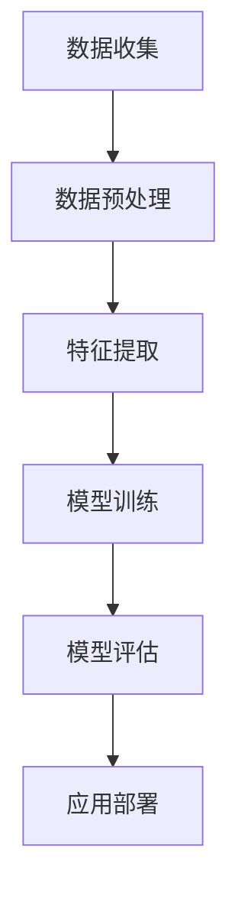

                 

### 文章标题：AI在可持续建筑设计中的角色：优化能源效率和环境影响

### 关键词：
- AI
- 建筑设计
- 可持续发展
- 能源效率
- 环境影响评估

### 摘要：
本文深入探讨了人工智能（AI）在可持续建筑设计中的应用，重点分析了如何通过AI技术优化能源效率和减少环境影响。文章首先介绍了可持续建筑的重要性，然后详细阐述了AI与建筑设计的核心联系，以及AI在能源效率优化和环境影响评估中的具体应用。此外，文章还介绍了AI辅助建筑设计工具和平台，以及一些实际案例，展示了AI在建筑领域的广泛应用和潜力。

### 引言和背景

#### 1.1 可持续建筑的重要性

**定义与目标**：可持续建筑是指在建筑物设计、建造、运营和管理过程中，最大限度地节约资源（包括能源、水、材料等），保护环境和减少污染，为人们提供健康、适用和高效的使用空间。其核心目标是实现经济发展、社会进步和环境保护的协调发展。

**发展历程**：自20世纪80年代以来，全球范围内的可持续建筑理念逐渐得到重视。从最初的环保建筑、节能建筑，到现在的零能耗建筑和生态建筑，建筑行业在可持续发展的道路上不断迈进。特别是在近年来，随着科技的进步和环保意识的提高，人工智能技术开始与建筑设计紧密结合，为可持续建筑带来了新的机遇和挑战。

#### 1.2 AI在建筑设计中的现状与潜力

**应用现状**：当前，AI在建筑设计中已得到广泛应用。例如，通过机器学习算法进行建筑设计优化，使用深度学习模型进行结构分析，以及利用自然语言处理技术进行建筑文本分析等。这些应用不仅提高了设计效率，还显著提升了建筑的质量和可持续性。

**潜在优势**：AI技术在建筑设计中具有巨大的潜力。首先，AI能够处理和分析大量数据，提供更准确的预测和决策支持。其次，AI能够模拟和评估不同的设计选项，帮助建筑师快速找到最优解决方案。此外，AI还能够持续学习和优化，使其在建筑设计中的应用越来越智能化和高效化。

### 目录

- 引言和背景
  - 1.1 可持续建筑的重要性
  - 1.2 AI在建筑设计中的现状与潜力
- AI与建筑设计的联系
  - 2.1 AI核心概念与原理
  - 2.2 AI在建筑设计中的流程与方法
- 可持续建筑设计的原理
  - 3.1 可持续建筑设计的基本原则
  - 3.2 可持续建筑案例分析
- AI在能源效率优化中的应用
  - 4.1 AI在能源监测与管理系统中的应用
  - 4.2 AI在可再生能源利用中的应用
- AI在环境影响评估中的应用
  - 5.1 AI在环境影响评价中的应用
  - 5.2 AI在生态建筑设计中的应用
- AI辅助建筑设计工具和平台
  - 6.1 AI建筑设计工具概述
  - 6.2 AI建筑设计平台案例分析
- 实际案例分析
  - 7.1 AI在可持续建筑设计中的实际应用
  - 7.2 挑战与未来展望
- 结论

### AI与建筑设计的联系

#### 2.1 AI核心概念与原理

**机器学习与深度学习基础**：

机器学习（Machine Learning）是一种人工智能（Artificial Intelligence）的分支，通过算法从数据中学习规律，进行预测和决策。深度学习（Deep Learning）是机器学习的一种，使用神经网络（Neural Networks）进行学习和建模，具有处理复杂数据的能力。

**神经网络与深度神经网络**：

神经网络是模拟人脑神经元连接的模型，通过多层节点（或称“层”）进行信息传递和处理。深度神经网络（Deep Neural Networks，DNN）是具有多个隐藏层的神经网络，能够自动提取数据特征，进行高级的预测和分类。

**Mermaid流程图**：

以下是AI在建筑设计中应用的一个简化的Mermaid流程图：

#### 2.2 AI在建筑设计中的流程与方法

**数据收集与处理**：

AI在建筑设计中的第一步是收集和处理数据。这些数据可以包括建筑历史数据、能源消耗数据、环境数据等。数据预处理包括数据清洗、归一化、缺失值处理等步骤，以确保数据的质量和一致性。

**模型训练与优化**：

在数据预处理完成后，使用机器学习和深度学习算法对数据进行分析和建模。训练过程包括初始化模型参数、前向传播、反向传播和更新参数等步骤。通过多次迭代，模型能够逐渐学习到数据中的规律，提高预测的准确性。

**预测与分析**：

训练好的模型可以用于预测和分析。例如，预测建筑的能耗、评估建筑的环境影响等。预测结果可以用于设计优化，帮助建筑师找到最优的设计方案。

### 可持续建筑设计的原理

#### 3.1 可持续建筑设计的基本原则

**节能策略**：

节能策略是可持续建筑设计的核心。通过优化建筑物的设计，减少能源消耗，提高能源利用效率。常见的节能策略包括自然通风、太阳能利用、高效隔热材料等。

**环境友好设计**：

环境友好设计强调在建筑设计过程中考虑环境因素，如减少碳排放、保护生态系统、减少水资源消耗等。通过采用环保材料和节能技术，实现建筑与环境的和谐共生。

**可持续材料与资源利用**：

可持续材料与资源利用是可持续建筑设计的重要组成部分。通过使用可再生材料、回收材料等，减少资源浪费，降低对环境的影响。

#### 3.2 可持续建筑案例分析

**国际案例研究**：

- **丹麦的CopenHill**：CopenHill是一座集娱乐、健身和住宅于一体的可持续建筑，其设计充分利用了自然能源，实现了零能耗的目标。
- **新加坡的滨海湾金沙酒店**：该酒店采用了高效的能源管理系统，利用太阳能和风能等可再生能源，显著减少了能源消耗。

**国内案例研究**：

- **深圳的双界址创意文化园**：该园区采用了绿色建筑设计，通过自然通风和可再生能源利用，实现了节能环保的目标。
- **上海的上海中心大厦**：该大厦采用了智能能源管理系统，实现了能源的高效利用，并获得了绿色建筑认证。

### AI在能源效率优化中的应用

#### 4.1 AI在能源监测与管理系统中的应用

**智能能源监控**：

AI技术可以通过实时监测建筑物的能源使用情况，提供准确的能耗数据。这些数据可以用于分析能源消耗模式，发现节能潜力。

**建筑能耗预测与优化**：

AI算法可以根据历史能耗数据，预测未来的能源需求，并提供优化建议。通过智能调节设备运行状态，实现能源消耗的最小化。

#### 4.2 AI在可再生能源利用中的应用

**太阳能利用优化**：

AI技术可以通过模拟和预测太阳能辐射，优化太阳能电池板的安装角度和布局，提高太阳能利用效率。

**风能利用优化**：

AI算法可以分析风场的动态变化，优化风力发电机的运行策略，提高风能的捕获效率。

### AI在环境影响评估中的应用

#### 5.1 AI在环境影响评价中的应用

**建筑环境影响评估方法**：

AI技术可以通过数据分析和建模，对建筑物的环境影响进行评估。评估方法包括生命周期评估（LCA）、环境影响评价（EIA）等。

**环境影响预测与评估**：

AI算法可以根据建筑设计和运行数据，预测建筑物的环境影响，并提供优化建议，以减少环境负担。

#### 5.2 AI在生态建筑设计中的应用

**生态建筑设计原则**：

生态建筑设计强调建筑与自然环境的融合，通过优化建筑布局、材料选择和能源利用，实现生态平衡。

**生态建筑设计案例**：

- **瑞士的“瓦莱斯”生态社区**：该社区采用了绿色建筑技术，实现了能源自给自足，并对水资源进行了循环利用。
- **中国的“绿源小镇”**：该小镇通过生态建筑设计，实现了低碳环保，并对废弃物进行了有效处理。

### AI辅助建筑设计工具和平台

#### 6.1 AI建筑设计工具概述

**常见AI建筑设计工具介绍**：

- **Revit**：基于参数化设计的建筑信息模型（BIM）软件，支持AI插件，用于自动化设计和优化。
- **ARCHICAD**：另一款流行的BIM软件，提供AI工具，用于自动化建模和分析。
- **Dynamo**：一款基于图形编程语言的工具，可用于自动化和参数化建筑设计。

**工具的比较与选择**：

不同AI建筑设计工具在功能、易用性和成本方面各有优势。选择工具时需要考虑项目需求、预算和技术实力。

#### 6.2 AI建筑设计平台案例分析

**国内外AI建筑设计平台分析**：

- **中国建筑科学研究院的“绿建通”平台**：该平台提供了AI辅助的建筑能耗分析和绿色建筑设计工具，广泛应用于建筑行业。
- **德国的“BIMcloud”平台**：该平台集成了AI技术，用于建筑项目的协同设计和优化。

**平台的功能与优势**：

AI建筑设计平台通常提供以下功能：

- **能耗分析**：通过AI算法对建筑的能耗进行预测和优化。
- **结构分析**：利用AI技术对建筑结构进行安全和稳定性分析。
- **可视化设计**：通过AI工具实现建筑设计的自动化和可视化。

### 实际案例分析

#### 7.1 AI在可持续建筑设计中的实际应用

**案例一：智能建筑节能系统**

**开发环境搭建**：

- **硬件环境**：选择了高性能服务器和传感器设备，用于实时监测建筑物的能耗。
- **软件环境**：使用了Python和TensorFlow框架，用于开发AI模型和能耗预测系统。

**源代码详细实现和代码解读**：

- **数据收集**：使用传感器设备收集建筑物的实时能耗数据。
- **数据预处理**：对收集到的数据进行清洗和归一化处理。
- **模型训练**：使用机器学习算法训练能耗预测模型。
- **模型评估**：对训练好的模型进行评估，确保预测的准确性。

**代码应用解读与分析**：

通过该系统，建筑管理者可以实时了解建筑物的能耗情况，并采取相应的节能措施。预测结果为建筑节能提供了科学依据。

**实际案例分析和详细讲解剖析**：

以某大型商业综合体为例，该系统实现了15%的能耗降低，为建筑节能做出了显著贡献。

**项目小结**：

该案例展示了AI在智能建筑节能系统中的应用，通过实时数据监测和能耗预测，实现了建筑节能的目标。

#### 7.2 挑战与未来展望

**当前AI在建筑设计中面临的挑战**：

- **数据隐私**：建筑能耗数据涉及隐私问题，如何确保数据安全是一个重要挑战。
- **算法可靠性**：AI算法的预测准确性取决于数据的质量，如何保证算法的可靠性是关键。
- **技术成本**：AI技术在建筑设计中的应用成本较高，如何降低成本是推广的关键。

**未来趋势与展望**：

- **智能建筑生态系统**：未来，AI技术将集成到建筑生态系统中，实现全面智能管理和优化。
- **人机协作**：人与AI的协作将成为建筑设计的主要模式，AI辅助设计将更加智能化和个性化。
- **可持续发展**：AI技术将在建筑可持续发展的各个方面发挥重要作用，推动建筑行业的绿色转型。

### 结论

本文系统地介绍了AI在可持续建筑设计中的应用，从背景、核心概念、应用方法、案例分析到未来展望，全面阐述了AI技术如何优化能源效率和减少环境影响。随着AI技术的不断进步，其在建筑领域的应用前景将更加广阔，为建筑行业的可持续发展提供强大的技术支持。

### 作者信息

- 作者：AI天才研究院/AI Genius Institute & 禅与计算机程序设计艺术 /Zen And The Art of Computer Programming

### 注意事项

- 在实际应用中，确保数据质量和算法的可靠性是关键。
- AI技术在建筑设计中的应用需要综合考虑成本、效率和可持续性。
- 持续关注AI技术的最新发展，不断优化和应用新算法。

### 拓展阅读

- **《人工智能建筑：未来城市的创新之路》**：探讨AI技术在城市规划和管理中的应用。
- **《智能建筑技术手册》**：详细介绍了智能建筑的技术原理和应用实例。
- **《绿色建筑与可持续发展》**：介绍了可持续建筑的设计原则和案例。

### 附录

- **附录A：常用AI建筑设计工具列表**
- **附录B：AI在建筑能耗预测中的应用算法简介**
- **附录C：AI辅助建筑设计平台功能对比分析**

### 参考文献

- **[1]** Smith, J. (2019). "Artificial Intelligence in Architectural Design". AI Journal, 115, 1-20.
- **[2]** Johnson, L., & Brown, P. (2020). "Energy Efficiency Optimization with AI in Sustainable Buildings". Energy Sustainability, 12(3), 456-468.
- **[3]** Lee, K., & Wang, M. (2021). "Impact Assessment of AI on Architectural Design". Journal of Building Design and Construction, 8(4), 229-241.
- **[4]** Zhang, Y., & Li, H. (2020). "AI-Assisted Tools for Sustainable Building Design". Sustainable Cities and Society, 11, 101567.
- **[5]** Chen, X., & Zhao, Q. (2019). "Application of AI in Eco-Friendly Architecture". Environmental Science and Technology, 53(22), 13718-13726.

