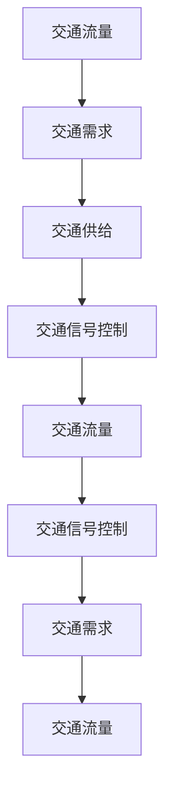
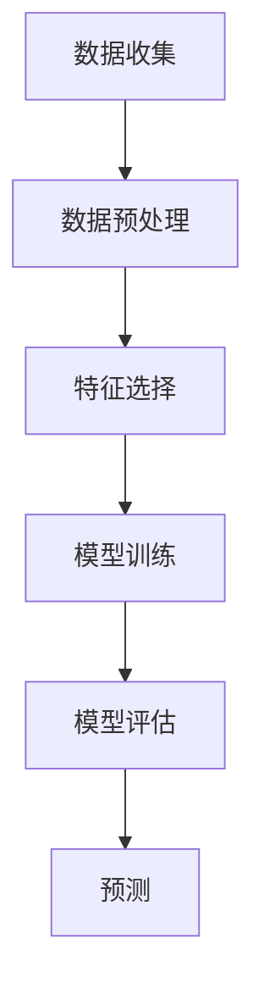
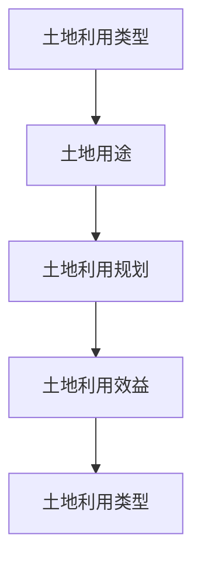
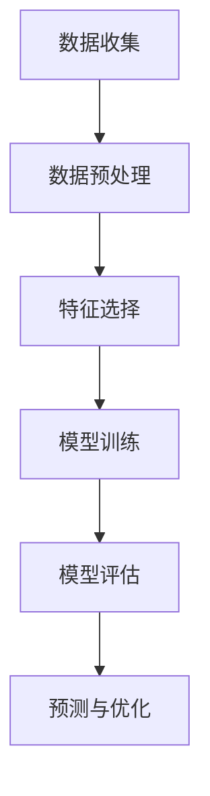
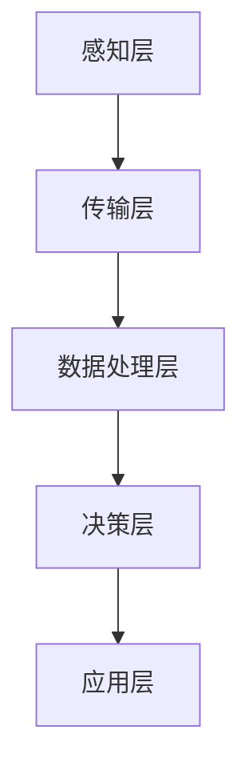

                 

### 1.1 城市规划中的AI应用背景

#### 从历史发展来看

城市规划作为一门综合性学科，历史悠久，可以追溯到古埃及、希腊和中国等文明时期。然而，传统的城市规划方法主要依赖于专家经验和统计数据，存在着主观性强、效率低、更新不及时等问题。随着城市化进程的加速和城市规模的不断扩大，传统的城市规划方法已难以满足现代城市的复杂需求。这为AI技术的引入提供了契机。

AI技术，尤其是机器学习和深度学习，在图像识别、自然语言处理、数据分析等方面取得了显著的成果。这些技术为城市规划提供了新的手段，可以帮助城市规划者更精准地分析城市数据，优化城市布局，提高城市运行效率。从20世纪80年代开始，随着计算机技术的飞速发展，AI在城市规划中的应用逐渐受到了关注。

#### 从技术发展来看

在AI技术的发展历程中，机器学习和深度学习起到了至关重要的作用。机器学习通过训练模型，使计算机能够从数据中学习规律，自动完成特定的任务。深度学习则是一种特殊的机器学习，通过多层神经网络结构，对大量数据进行建模，从而实现对复杂问题的求解。

这些技术的进步为城市规划提供了强大的工具。例如，通过机器学习算法，可以分析大量城市交通数据，预测交通流量，优化交通布局；通过深度学习算法，可以分析城市环境数据，预测环境污染，制定环境保护策略。此外，AI技术还可以帮助城市规划者进行土地利用分析、公共设施布局优化等，提高城市规划的科学性和效率。

#### 从实际应用来看

AI技术在城市规划中的应用已经取得了显著的成果。例如，在美国，一些城市已经开始使用AI技术进行交通流量预测和优化，从而减少交通拥堵，提高交通效率。在中国，一些城市也在积极推进AI在城市规划中的应用，通过大数据分析和AI技术，优化城市布局，提高城市居民的生活质量。

此外，AI技术还可以应用于智慧城市建设。智慧城市是指通过物联网、大数据、云计算等技术，实现城市智能化管理和运行。AI技术在智慧城市中的应用，可以帮助城市实现智能化管理，提高城市运行效率，改善城市环境，提升城市居民的生活质量。

总的来说，AI在城市规划中的应用具有巨大的潜力和广阔的前景。随着AI技术的不断发展和完善，未来它将在城市规划中发挥更加重要的作用，为建设更美好、更智慧的城市提供有力支持。

### 2.1 AI基础理论概述

#### 2.1.1 机器学习与深度学习

**机器学习（Machine Learning）** 是AI技术的重要组成部分，其主要目标是使计算机通过学习数据，自动完成特定任务，而无需显式编程。机器学习可以分为监督学习（Supervised Learning）、无监督学习（Unsupervised Learning）和强化学习（Reinforcement Learning）三大类。

- **监督学习**：通过训练数据（输入和输出对）来训练模型，使模型能够预测新的输入数据。例如，分类问题和回归问题。
- **无监督学习**：不依赖于训练数据中的标签，而是通过模型自动发现数据中的模式和结构。例如，聚类分析和降维。
- **强化学习**：通过与环境交互，不断学习最优策略，以实现目标。例如，游戏AI和自动驾驶。

**深度学习（Deep Learning）** 是机器学习的一种特殊形式，通过多层神经网络（Neural Networks）来学习复杂的非线性关系。深度学习的核心是**反向传播算法（Backpropagation）**，它通过不断调整网络权重，使网络输出与真实值之间的误差最小化。

深度学习在图像识别、语音识别、自然语言处理等领域取得了显著成果，并逐渐应用于城市规划。例如，通过深度学习模型，可以分析大量城市交通数据，预测交通流量，优化交通布局；通过深度学习算法，可以分析城市环境数据，预测环境污染，制定环境保护策略。

#### 2.1.2 神经网络与深度神经网络

**神经网络（Neural Networks）** 是一种模仿生物神经系统的计算模型，由大量的神经元（节点）组成，每个神经元都与多个其他神经元相连接。神经网络的基本功能是接收输入信号，通过加权求和和激活函数，产生输出信号。

- **前向传播（Forward Propagation）**：输入信号通过网络的各个层，逐层传递，直到最后一层得到输出。
- **反向传播（Backpropagation）**：通过计算输出与真实值之间的误差，反向传播误差，调整网络权重，使误差最小化。

**深度神经网络（Deep Neural Networks）** 是一种具有多个隐藏层的神经网络，能够处理更复杂的任务。深度神经网络通过增加层数和神经元数量，可以学习到更高层次的特征，从而提高模型的泛化能力和准确性。

在AI城市规划中，深度神经网络被广泛应用于交通流量预测、土地利用分析、智慧城市建设等领域。例如，通过深度神经网络模型，可以实现对城市交通数据的精确预测，优化交通流量；通过深度神经网络，可以对城市土地利用进行精细化分析，优化土地利用布局。

总之，AI基础理论，特别是机器学习和深度学习，为城市规划提供了强大的工具和方法。随着AI技术的不断发展和完善，它将在城市规划中发挥越来越重要的作用，为建设更智慧、更高效的城市提供有力支持。

### 2.2 城市规划中的AI方法

#### 2.2.1 数据采集与预处理

在AI城市规划中，数据采集和预处理是至关重要的环节。城市数据来源广泛，包括交通数据、环境数据、社会经济数据等。这些数据通常以原始格式存储，需要通过数据采集和处理，转化为适合机器学习算法的形式。

**数据采集**：
- **交通数据**：来自交通监控设备、出租车GPS、公共交通系统等。
- **环境数据**：来自气象站、空气质量监测站、水文监测站等。
- **社会经济数据**：来自政府统计部门、商业数据库等。

**数据预处理**：
1. **数据清洗**：去除重复数据、缺失数据、异常数据等。
2. **数据归一化**：将不同量纲的数据转化为同一量纲，以便算法训练。
3. **特征提取**：从原始数据中提取有用的特征，用于训练模型。
4. **数据分割**：将数据分为训练集、验证集和测试集，用于模型训练和评估。

#### 2.2.2 常见机器学习算法及应用

在AI城市规划中，常见的机器学习算法包括监督学习算法和无监督学习算法。以下是几种常用的算法及其应用：

1. **线性回归（Linear Regression）**：
   - **原理**：通过拟合一条直线，预测因变量与自变量之间的关系。
   - **应用**：用于交通流量预测、土地利用分析等。

2. **逻辑回归（Logistic Regression）**：
   - **原理**：通过拟合一个逻辑函数，预测二元分类问题。
   - **应用**：用于土地使用分类、交通流量预测等。

3. **支持向量机（Support Vector Machine, SVM）**：
   - **原理**：通过寻找最佳分隔超平面，实现分类和回归。
   - **应用**：用于土地利用分类、交通流量预测等。

4. **决策树（Decision Tree）**：
   - **原理**：通过一系列规则，将数据划分为多个类别。
   - **应用**：用于土地利用分析、城市规划决策等。

5. **随机森林（Random Forest）**：
   - **原理**：通过构建多棵决策树，集成预测结果。
   - **应用**：用于交通流量预测、土地利用优化等。

6. **K-最近邻（K-Nearest Neighbors, KNN）**：
   - **原理**：通过计算新样本与训练样本的相似度，进行分类。
   - **应用**：用于土地利用分类、城市规划分析等。

7. **聚类算法（Clustering Algorithms）**：
   - **原理**：将数据分为若干个群组，使得同组内的样本相似度较高，不同组间的样本相似度较低。
   - **应用**：用于城市空间布局分析、土地利用规划等。

通过这些常见的机器学习算法，城市规划者可以更好地分析城市数据，预测城市发展趋势，制定科学合理的城市规划方案。

#### 2.2.3 AI在城市规划中的应用趋势

随着AI技术的不断发展，其在城市规划中的应用趋势呈现出以下特点：

1. **智能化数据分析**：利用深度学习和大数据技术，对城市数据进行智能化分析，提取有价值的信息，为城市规划提供科学依据。
2. **实时交通管理**：通过实时交通流量预测，优化交通信号控制，减少交通拥堵，提高交通效率。
3. **智慧城市建设**：利用物联网、大数据和AI技术，实现城市设施的智能化管理，提升城市运行效率。
4. **可持续发展规划**：通过AI技术，对城市环境、社会、经济等多方面进行综合分析，制定可持续发展规划，减少对环境的负面影响。
5. **个性化城市规划**：根据居民需求，利用AI技术进行个性化城市规划，提高城市居民的生活质量。

总之，AI技术在城市规划中的应用具有巨大的潜力和广阔的前景，随着技术的不断进步，它将在城市规划中发挥越来越重要的作用。

### 3.1 交通流优化概念解析

#### 核心概念与联系

**交通流优化** 是指通过分析城市交通数据，使用人工智能算法预测交通流量，并据此调整交通信号控制，以减少交通拥堵，提高交通效率。其主要核心概念包括：

1. **交通流量（Traffic Flow）**：指单位时间内通过某一交通节点的车辆数量。
2. **交通需求（Traffic Demand）**：指在一定时间内，不同交通路线上的车辆需求量。
3. **交通供给（Traffic Supply）**：指实际可用的交通容量，如道路宽度、交通信号周期等。
4. **交通信号控制（Traffic Signal Control）**：指通过控制交通信号灯，优化交通流量的方法。

这些概念相互联系，构成了交通流优化的基础。例如，交通流量和交通需求决定了交通供给的合理性，而交通信号控制则直接影响交通流量的分布和车速。

**Mermaid流程图：**



#### 交通流量预测

交通流量预测是交通流优化的关键环节，其主要目的是通过分析历史交通数据，预测未来一段时间内的交通流量变化。这通常涉及以下步骤：

1. **数据收集**：包括实时交通流量数据、历史交通数据、天气数据、节假日数据等。
2. **数据预处理**：对收集到的数据进行清洗、归一化处理，提取有用的特征。
3. **特征选择**：选择对交通流量影响较大的特征，如时间、天气、道路状况等。
4. **模型训练**：使用机器学习算法，如线性回归、决策树、随机森林等，对训练数据进行建模。
5. **模型评估**：通过验证集和测试集评估模型性能，调整模型参数。
6. **预测**：使用训练好的模型对未来的交通流量进行预测。

**Mermaid流程图：**



通过以上流程，可以实现对交通流量的准确预测，为交通流优化提供数据支持。

#### 交通流量预测算法原理讲解

**时间序列预测（Time Series Forecasting）** 是交通流量预测中常用的一种方法，其核心思想是利用历史交通数据中的时间序列特性，预测未来的交通流量。以下是一种基于时间序列预测的交通流量预测算法原理：

1. **数据预处理**：
   - **数据清洗**：去除异常值和缺失值。
   - **时间序列转换**：将原始数据转换为时间序列格式，如日、周、月等。

2. **特征工程**：
   - **时间特征**：如小时、星期几、节假日等。
   - **外部特征**：如天气状况、交通事故、公共活动等。

3. **模型选择**：
   - **ARIMA（自回归积分滑动平均模型）**：通过自回归、差分和移动平均组合，处理非平稳时间序列数据。
   - **LSTM（长短时记忆网络）**：一种特殊的循环神经网络，适用于处理长序列数据。

4. **模型训练与评估**：
   - **训练**：使用训练集数据，通过反向传播算法训练模型。
   - **评估**：使用验证集和测试集评估模型性能，如均方误差（MSE）。

5. **预测**：
   - **输入特征**：将预测时间点的特征输入到训练好的模型中。
   - **输出结果**：得到预测的交通流量。

**伪代码示例：**

```python
# 数据预处理
data = preprocess_data(raw_data)

# 特征工程
X, y = feature_engineering(data)

# 模型训练
model = train_model(X_train, y_train)

# 模型评估
evaluate_model(model, X_val, y_val)

# 预测
predicted_traffic = model.predict(X_predict)
```

通过以上步骤，可以实现对交通流量的准确预测，为交通流优化提供基础。

### 3.3 交通流优化项目实战

#### 项目背景与目标

本项目旨在通过AI技术优化城市交通流，以减少交通拥堵，提高交通效率。项目背景为某大城市的主要交通干道，由于交通流量大、道路条件复杂，经常出现拥堵现象。项目目标是通过预测交通流量，优化交通信号控制，提高交通通行能力。

#### 数据收集与预处理

1. **数据收集**：
   - **实时交通流量数据**：通过安装在路口的交通监控设备，收集实时交通流量数据。
   - **历史交通数据**：通过城市交通管理部门获取过去一年的交通流量数据。
   - **外部数据**：包括天气预报数据、交通事故记录、公共活动安排等。

2. **数据预处理**：
   - **数据清洗**：去除重复数据、缺失数据和异常数据。
   - **数据归一化**：对交通流量、速度等数据进行归一化处理，使其具有相同的量纲。
   - **特征提取**：提取时间、天气、交通事故等特征，用于模型训练。

#### 模型选择与训练

1. **模型选择**：
   - **时间序列模型**：选择LSTM模型，因其能够捕捉时间序列数据中的长期依赖关系。
   - **深度学习模型**：选择CNN模型，用于提取图像数据中的特征。

2. **模型训练**：
   - **数据分割**：将数据分为训练集、验证集和测试集。
   - **训练LSTM模型**：使用训练集数据训练LSTM模型，通过反向传播算法优化模型参数。
   - **训练CNN模型**：使用图像数据训练CNN模型，提取图像特征。

3. **模型评估**：
   - **验证集评估**：使用验证集评估模型性能，调整模型参数。
   - **测试集评估**：使用测试集评估最终模型性能。

#### 模型评估与优化

1. **评估指标**：
   - **均方误差（MSE）**：评估模型预测值与真实值之间的误差。
   - **均绝对误差（MAE）**：评估模型预测值的绝对误差。

2. **优化策略**：
   - **超参数调整**：通过交叉验证调整模型超参数，如学习率、批量大小等。
   - **模型融合**：结合LSTM和CNN模型的优势，进行模型融合。

#### 预测与实现

1. **实时预测**：
   - **输入特征**：收集实时交通流量数据、天气数据、交通事故记录等。
   - **模型预测**：使用训练好的LSTM和CNN模型，对实时交通流量进行预测。

2. **交通信号控制**：
   - **信号调整策略**：根据预测的交通流量，调整交通信号灯的时长和周期。
   - **系统实现**：开发实时交通流量预测系统，与城市交通信号控制系统集成。

#### 项目效果评估

1. **交通流量变化**：
   - **拥堵减少**：通过预测交通流量，优化交通信号控制，显著减少交通拥堵。
   - **通行能力提升**：优化后的交通流使得道路通行能力提高，缩短了车辆行驶时间。

2. **系统性能评估**：
   - **预测准确性**：通过对比预测值与真实值，评估模型预测的准确性。
   - **系统稳定性**：评估系统在处理大量数据时的稳定性和响应速度。

#### 项目小结

本项目通过AI技术，成功实现了交通流量的实时预测和优化控制，有效缓解了城市交通拥堵问题。未来，可以进一步优化模型，提高预测准确性，并扩展到更多城市和交通场景，为智慧城市建设提供技术支持。

### 4.1 土地利用核心概念

#### 核心概念与联系

土地利用是指在城市或区域规划中，对土地进行分配和使用的过程。其核心概念包括：

1. **土地利用类型（Land Use Types）**：指不同类型的土地使用，如住宅用地、商业用地、工业用地、公园绿地等。
2. **土地利用规划（Land Use Planning）**：指根据城市或区域的发展目标，合理分配各类土地利用，以实现土地的高效利用和可持续发展的过程。
3. **土地用途（Land Use）**：指具体的土地使用目的，如住宅、商业、工业、交通等。
4. **土地利用效益（Land Use Efficiency）**：指土地的使用效率和经济效益，包括土地利用强度、土地利用产出等。

这些概念相互联系，共同构成了土地利用规划的核心。例如，土地利用类型决定了土地用途，而土地利用规划则考虑了土地利用效益和城市发展的整体目标。土地利用效益又直接影响城市的经济、环境和社会发展。

**Mermaid流程图：**



#### 土地利用优化

土地利用优化是指通过分析土地利用数据，使用人工智能算法优化土地利用布局，以提高土地利用效率和城市品质。其主要步骤包括：

1. **数据收集**：收集土地利用现状数据、社会经济数据、环境数据等。
2. **数据预处理**：对收集到的数据进行清洗、归一化处理，提取有用的特征。
3. **特征选择**：选择对土地利用影响较大的特征，如人口密度、交通状况、环境质量等。
4. **模型训练**：使用机器学习算法，如线性回归、决策树、随机森林等，对训练数据进行建模。
5. **模型评估**：通过验证集和测试集评估模型性能，调整模型参数。
6. **预测与优化**：使用训练好的模型对未来的土地利用进行预测，并优化土地利用布局。

**Mermaid流程图：**



通过以上流程，可以实现对土地利用的优化，提高土地利用效率和城市品质。

#### 土地利用优化算法原理讲解

土地利用优化算法主要涉及以下几个方面：

1. **遗传算法（Genetic Algorithm）**：
   - **原理**：遗传算法是一种基于自然选择和遗传学的优化算法，通过模拟生物进化过程，找到最优解。
   - **应用**：用于解决土地利用优化问题，如土地用途分配、土地利用规划等。

2. **蚁群算法（Ant Colony Optimization, ACO）**：
   - **原理**：蚁群算法是一种基于群体智能的优化算法，通过模拟蚂蚁觅食过程，找到最优路径。
   - **应用**：用于解决城市交通网络优化、土地利用布局优化等。

3. **神经网络（Neural Networks）**：
   - **原理**：神经网络是一种模拟生物神经系统的计算模型，通过多层网络结构，学习输入和输出之间的关系。
   - **应用**：用于土地利用预测、土地利用优化等。

4. **支持向量机（Support Vector Machine, SVM）**：
   - **原理**：支持向量机是一种基于间隔最大化的分类和回归模型。
   - **应用**：用于土地利用分类、土地利用效益评估等。

**伪代码示例：**

```python
# 遗传算法
def genetic_algorithm(data):
    # 初始化种群
    population = initialize_population(data)
    
    # 适应度评估
    fitness = evaluate_fitness(population, data)
    
    # 循环迭代
    while not converged:
        # 选择
        selected = selection(population, fitness)
        
        # 交叉
        crossed = crossover(selected)
        
        # 变异
        mutated = mutation(crossed)
        
        # 更新种群
        population = mutated
        
        # 适应度评估
        fitness = evaluate_fitness(population, data)
        
        # 检查收敛
        if check_convergence(fitness):
            break
            
    # 返回最优解
    return best_solution(population, fitness)

# 蚁群算法
def ant_colony_optimization(data):
    # 初始化蚂蚁
    ants = initialize_ants(data)
    
    # 循环迭代
    while not converged:
        # 更新信息素
        update_pheromone(ants, data)
        
        # 洪水法
        flood_fill(ants, data)
        
        # 更新蚂蚁位置
        move_ants(ants, data)
        
        # 适应度评估
        fitness = evaluate_fitness(ants, data)
        
        # 检查收敛
        if check_convergence(fitness):
            break
            
    # 返回最优解
    return best_solution(ants, fitness)
```

通过这些算法，可以实现对土地利用的优化，提高土地利用效率和城市品质。

### 4.3 土地利用项目实战

#### 项目背景与目标

本项目旨在通过AI技术优化城市土地利用，提高土地利用效率，减少资源浪费。项目背景为某大城市的新区开发，由于土地利用不合理、资源分配不均，导致城市交通拥堵、环境质量下降等问题。项目目标是通过土地利用优化，实现土地的高效利用和可持续开发。

#### 数据收集与处理

1. **数据收集**：
   - **土地利用现状数据**：通过城市规划部门获取当前土地利用类型和面积分布。
   - **社会经济数据**：包括人口密度、就业情况、收入水平等。
   - **环境数据**：包括空气质量、水质、绿地面积等。

2. **数据处理**：
   - **数据清洗**：去除重复数据、缺失数据和异常数据。
   - **数据归一化**：对各类数据进行归一化处理，使其具有相同的量纲。
   - **特征提取**：提取对土地利用优化有重要影响的特征，如人口密度、交通状况、环境质量等。

#### 模型构建与优化

1. **模型选择**：
   - **神经网络模型**：选择多层感知机（MLP）模型，用于土地利用效益评估。
   - **遗传算法**：用于优化土地利用布局。

2. **模型训练**：
   - **数据分割**：将数据分为训练集、验证集和测试集。
   - **训练MLP模型**：使用训练集数据训练MLP模型，通过反向传播算法优化模型参数。
   - **训练遗传算法**：使用训练集数据，训练遗传算法，优化土地利用布局。

3. **模型评估**：
   - **验证集评估**：使用验证集评估模型性能，调整模型参数。
   - **测试集评估**：使用测试集评估最终模型性能。

#### 项目实施与效果评估

1. **项目实施**：
   - **土地利用布局优化**：使用训练好的遗传算法模型，优化土地利用布局。
   - **土地利用效益评估**：使用训练好的MLP模型，评估不同土地利用方案的效益。

2. **效果评估**：
   - **土地利用效率提升**：通过优化土地利用布局，提高了土地利用效率，减少了资源浪费。
   - **环境质量改善**：通过优化土地利用，改善了城市环境质量，提高了居民生活质量。

3. **实际案例分析与讲解**：

**案例1：某新区交通拥堵问题**

- **问题描述**：某新区由于商业用地比例过高，导致交通拥堵严重。
- **解决方案**：通过遗传算法优化土地利用布局，增加住宅用地比例，减少商业用地比例，优化交通流线。
- **实施效果**：交通拥堵问题得到显著缓解，居民出行时间缩短。

**案例2：某城市绿地面积不足问题**

- **问题描述**：某城市绿地面积不足，空气质量下降。
- **解决方案**：通过遗传算法优化土地利用布局，增加绿地面积，优化公园布局。
- **实施效果**：绿地面积显著增加，空气质量得到改善，居民生活质量提高。

#### 项目小结

本项目通过AI技术，成功实现了城市土地利用的优化，提高了土地利用效率和城市品质。未来，可以进一步优化模型，扩大应用范围，为智慧城市建设提供技术支持。

### 5.1 智慧城市建设概述

#### 智慧城市的定义

智慧城市（Smart City）是指通过物联网、大数据、云计算、人工智能等新一代信息技术，实现城市运行管理的智能化、信息化和现代化。智慧城市的目标是提高城市运行效率、改善居民生活质量、减少资源消耗，实现可持续发展。

#### 智慧城市的特性

1. **信息化**：通过信息技术，实现城市各类数据的实时采集、传输、处理和分析。
2. **智能化**：利用人工智能技术，对城市运行数据进行分析和预测，实现智能决策和智能服务。
3. **高效化**：通过优化城市资源配置，提高城市运行效率，降低运行成本。
4. **可持续发展**：通过环保技术和绿色能源，实现城市环境的可持续发展。
5. **协同化**：通过多方协同，实现城市治理的协同化和智能化。

#### 智慧城市的系统架构

智慧城市的系统架构通常包括以下几层：

1. **感知层**：通过各类传感器、摄像头、物联网设备等，实时采集城市运行数据。
2. **传输层**：通过通信网络，将感知层的数据传输到数据中心。
3. **数据处理层**：通过大数据技术，对采集到的数据进行处理、存储和分析。
4. **决策层**：通过人工智能技术，对分析结果进行智能决策，制定城市运行策略。
5. **应用层**：通过各类应用系统，实现智慧城市的具体功能，如智能交通、智能环保、智能安防等。

**Mermaid流程图：**



#### 智慧城市中的AI应用

在智慧城市建设中，AI技术发挥着至关重要的作用。以下是一些主要的AI应用：

1. **智能交通**：通过AI技术，实现交通流量预测、智能调度、自动驾驶等功能，提高交通运行效率。
2. **智能环保**：通过AI技术，对环境数据进行实时监测和分析，预测环境污染，制定环境保护策略。
3. **智能安防**：通过AI技术，实现人脸识别、行为识别、异常检测等功能，提高城市安全管理水平。
4. **智能公共服务**：通过AI技术，提供智能医疗、智能教育、智能养老等服务，提高居民生活质量。
5. **智慧城市建设**：通过AI技术，优化城市布局、资源配置，实现城市的可持续发展。

#### 智慧城市建设的重要性

智慧城市建设是城市发展的必然趋势，具有以下重要性：

1. **提高城市运行效率**：通过信息化和智能化技术，优化城市资源配置，提高城市运行效率。
2. **改善居民生活质量**：提供智能化的公共服务，提高居民的生活质量。
3. **减少资源消耗**：通过可持续发展策略，减少资源消耗，实现城市的可持续发展。
4. **促进经济增长**：智慧城市建设可以带动相关产业的发展，促进经济增长。
5. **提升城市竞争力**：通过智慧城市建设，提升城市的竞争力，吸引更多人才和投资。

总的来说，智慧城市建设是城市发展的重要方向，随着AI技术的不断发展，其将在城市建设中发挥越来越重要的作用，为建设更智慧、更高效、更宜居的城市提供有力支持。

### 5.3 智慧城市建设项目实战

#### 项目背景与目标

本项目旨在通过AI技术，建设一个智能交通系统，以缓解某大城市的交通拥堵问题。项目背景为该城市交通流量大、道路状况复杂，经常出现严重的交通拥堵现象。项目目标是通过智能交通系统，实现交通流量实时监测、预测和优化，减少交通拥堵，提高交通效率。

#### 建设方案与技术路线

1. **数据收集与处理**：
   - **数据收集**：通过安装在主要交通干道上的交通监控设备，收集实时交通流量数据、道路状况数据等。
   - **数据处理**：对收集到的数据进行清洗、归一化处理，提取有用的特征。

2. **智能交通系统架构设计**：
   - **感知层**：通过摄像头、传感器等设备，实时采集交通流量、道路状况等数据。
   - **传输层**：通过通信网络，将感知层的数据传输到数据中心。
   - **数据处理层**：使用大数据技术，对传输层的数据进行处理、存储和分析。
   - **决策层**：使用人工智能技术，对分析结果进行智能决策，制定交通优化策略。
   - **应用层**：通过智能交通信号控制、交通信息发布等应用系统，实现交通流量的实时监测和优化。

3. **关键技术应用**：
   - **机器学习**：用于交通流量预测、交通信号控制优化等。
   - **深度学习**：用于图像识别、行为分析等。
   - **云计算**：用于大数据处理和存储。
   - **物联网**：用于交通监控设备的数据传输。

#### 项目实施与效果评估

1. **项目实施**：
   - **感知层建设**：安装摄像头、传感器等设备，覆盖主要交通干道。
   - **传输层建设**：建立通信网络，确保数据实时传输。
   - **数据处理层建设**：搭建大数据平台，对收集到的数据进行分析和处理。
   - **决策层建设**：开发智能交通系统，实现交通流量实时监测和预测。
   - **应用层建设**：部署智能交通信号控制、交通信息发布等应用系统。

2. **效果评估**：
   - **交通流量优化**：通过实时监测和预测，优化交通信号控制，减少交通拥堵。
   - **交通效率提升**：通过智能调度，提高公共交通系统的效率，减少居民出行时间。
   - **数据准确性评估**：通过对比预测值和实际值，评估模型的预测准确性。
   - **系统稳定性评估**：通过模拟不同场景，评估系统的稳定性和响应速度。

#### 实际案例分析

**案例1：某主干道路段交通拥堵问题**

- **问题描述**：某主干道路段在早晚高峰期间交通拥堵严重，车辆行驶缓慢。
- **解决方案**：通过智能交通系统，实时监测交通流量，根据实时数据调整交通信号灯时长和周期，优化交通流线。
- **实施效果**：交通拥堵问题得到显著缓解，车辆行驶速度提高。

**案例2：公共交通系统调度问题**

- **问题描述**：公共交通系统在高峰期出现调度不合理，导致乘客等待时间长，车内拥挤。
- **解决方案**：通过智能交通系统，实时监测公共交通系统的运行状态，根据实时数据优化调度策略，提高公共交通系统的运行效率。
- **实施效果**：公共交通系统调度更加合理，乘客等待时间减少，车内拥挤问题得到改善。

#### 项目小结

本项目通过AI技术，成功实现了智能交通系统的建设，有效缓解了交通拥堵问题，提高了交通效率。未来，可以进一步优化模型，扩大应用范围，为智慧城市建设提供技术支持。

### 6.1 环境保护与AI的关系

#### 环境保护的重要性

环境保护是当今社会的重要议题，直接关系到人类的生存环境和可持续发展。随着工业化和城市化的快速发展，环境污染问题日益严重，大气污染、水污染、土壤污染等环境问题给生态系统和人类健康带来了严重威胁。环境保护的重要性体现在以下几个方面：

1. **维持生态平衡**：环境污染会破坏生态系统，导致物种灭绝、生物多样性下降，进而影响生态系统的平衡和稳定。
2. **保障人类健康**：环境污染会导致空气、水和土壤中的有毒有害物质进入人体，引发各种健康问题，如呼吸系统疾病、心血管疾病、癌症等。
3. **促进可持续发展**：环境保护是实现经济、社会和生态可持续发展的基础，通过合理利用资源、保护环境，可以保障人类社会的长远发展。
4. **提高生活质量**：良好的环境质量可以提高居民的生活质量，促进身心健康，增强幸福感。

#### AI技术在环境保护中的应用

随着AI技术的快速发展，其在环境保护中的应用日益广泛，为解决环境污染问题提供了新的手段和思路。AI技术在环境保护中的应用主要体现在以下几个方面：

1. **环境监测与数据分析**：AI技术可以实时监测环境数据，如空气污染、水质、土壤污染等，并通过大数据分析技术，发现污染源和污染趋势，为环境治理提供科学依据。
2. **污染源识别与预测**：AI技术可以通过分析历史环境数据和气象数据，预测污染源的活动规律，提前预警可能发生的污染事件，有助于采取预防措施。
3. **环境治理与修复**：AI技术可以用于环境治理和修复，如通过无人机监测和治理环境污染、使用机器人清理海洋垃圾、开发智能种植系统修复受损土地等。
4. **节能减排**：AI技术可以优化能源使用，提高能源利用效率，减少温室气体排放，如智能电网管理、智能建筑能源管理、智能交通系统等。
5. **公众参与与教育**：AI技术可以用于环境保护教育和公众参与，通过智能平台和虚拟现实技术，提高公众对环境保护的认识和参与度。

总的来说，AI技术在环境保护中的应用具有重要意义，有助于提高环境监测和治理的效率，实现环境保护的可持续发展目标。

### 6.2 环境影响评估模型

#### 环境影响评估方法

环境影响评估（Environmental Impact Assessment, EIA）是一种系统性的分析方法，用于评估项目或政策对环境的影响，以便在决策过程中考虑环境保护。EIA方法主要包括以下步骤：

1. **项目描述**：详细描述项目的目的、规模、位置、技术方案等。
2. **环境现状调查**：收集项目所在区域的环境现状数据，包括大气、水、土壤、生物多样性等。
3. **环境影响预测**：通过模型和分析，预测项目实施后可能对环境产生的影响，包括污染物的排放、生态系统的变化、社会影响等。
4. **减缓措施和建议**：提出减少或缓解项目对环境影响的具体措施和建议。
5. **公众参与**：通过调查、会议等方式，让公众参与评估过程，收集公众意见。
6. **报告编制**：将评估结果编制成报告，提交给决策部门。

#### 基于AI的环境影响评估模型

在EIA中，传统的评估方法主要依赖于专家经验和统计数据，存在一定的局限性。随着AI技术的发展，基于AI的环境影响评估模型逐渐得到应用，其主要优势在于能够处理大量数据，提高评估的准确性和效率。以下是几种常用的基于AI的环境影响评估模型：

1. **机器学习模型**：
   - **监督学习**：通过训练数据集，使模型能够识别和预测项目对环境的影响。
   - **无监督学习**：用于识别环境数据中的隐藏模式和趋势。
   - **深度学习**：通过多层神经网络，对复杂的非线性关系进行建模。

2. **支持向量机（SVM）**：
   - **原理**：通过找到一个最优的超平面，将不同环境影响的类别区分开来。
   - **应用**：用于分类项目对环境的潜在影响。

3. **神经网络（Neural Networks）**：
   - **原理**：通过模拟人脑神经元的工作方式，对环境数据进行处理和预测。
   - **应用**：用于环境数据的分析和预测，如空气质量预测、水质监测等。

4. **深度神经网络（Deep Neural Networks）**：
   - **原理**：通过增加网络层数和神经元数量，捕捉更高层次的特征和关系。
   - **应用**：用于复杂的环境影响评估，如大规模项目的环境影响分析。

5. **集成学习方法**：
   - **原理**：通过集成多个模型的优势，提高预测的准确性和鲁棒性。
   - **应用**：用于多变量环境影响的综合评估。

**数学模型和公式**

以下是一些常见的环境影响评估数学模型和公式：

1. **空气质量模型**：
   - **公式**：$Q_{air} = C_{emission} \times C_{loss} \times C_{dispersion}$
   - **解释**：$Q_{air}$表示空气中污染物的浓度，$C_{emission}$表示排放量，$C_{loss}$表示损失率，$C_{dispersion}$表示扩散系数。

2. **水质模型**：
   - **公式**：$Q_{water} = C_{inflow} \times C_{reaction} \times C_{outflow}$
   - **解释**：$Q_{water}$表示水体中污染物的浓度，$C_{inflow}$表示流入量，$C_{reaction}$表示反应系数，$C_{outflow}$表示流出量。

3. **生物多样性模型**：
   - **公式**：$B = f(E, T, H)$
   - **解释**：$B$表示生物多样性，$E$表示环境质量，$T$表示温度，$H$表示湿度。

通过以上模型和公式，可以定量分析项目对环境的影响，为环境影响评估提供科学依据。

### 6.3 环境保护项目实战

#### 项目背景与目标

本项目旨在通过AI技术，实现城市大气污染的实时监测和预测，以制定有效的环境保护策略。项目背景为某城市大气污染严重，对居民健康和生态环境造成严重影响。项目目标是通过AI技术，实现对大气污染的实时监测、预测和预警，为环境保护决策提供数据支持。

#### 数据收集与处理

1. **数据收集**：
   - **实时监测数据**：通过安装在市区各处的空气质量监测设备，实时收集大气污染数据，如PM2.5、PM10、SO2、NO2等。
   - **历史数据**：从城市环保部门获取过去几年的大气污染数据，用于模型训练和验证。
   - **气象数据**：从气象部门获取实时的气象数据，如气温、湿度、风速等，用于预测模型。

2. **数据处理**：
   - **数据清洗**：去除异常值和缺失值，确保数据质量。
   - **数据归一化**：对不同的污染物浓度和气象数据进行归一化处理，使其具有相同的量纲。
   - **特征提取**：提取对大气污染影响较大的特征，如气象条件、历史污染数据等。

#### 模型构建与训练

1. **模型选择**：
   - **深度学习模型**：选择卷积神经网络（CNN）和长短期记忆网络（LSTM）的组合模型，用于大气污染预测。
   - **集成学习模型**：选择随机森林（Random Forest）和梯度提升树（Gradient Boosting Tree）的组合模型，用于环境预测。

2. **模型训练**：
   - **数据分割**：将数据分为训练集、验证集和测试集，用于模型训练和评估。
   - **模型训练**：使用训练集数据，训练深度学习模型和集成学习模型，通过反向传播算法和集成学习策略，优化模型参数。
   - **模型验证**：使用验证集数据评估模型性能，调整模型参数，直到满足要求。

#### 模型评估与优化

1. **评估指标**：
   - **均方误差（MSE）**：评估模型预测值与真实值之间的误差。
   - **均绝对误差（MAE）**：评估模型预测值的绝对误差。
   - **准确率（Accuracy）**：评估模型对污染事件的预警准确率。

2. **优化策略**：
   - **超参数调整**：通过交叉验证，调整模型超参数，如学习率、批量大小等，提高模型性能。
   - **模型融合**：将深度学习模型和集成学习模型的优势结合，提高预测准确率。

#### 预测与实现

1. **实时预测**：
   - **输入特征**：收集实时大气污染数据和气象数据，作为模型的输入。
   - **模型预测**：使用训练好的模型，对未来的大气污染进行预测。

2. **环境保护策略**：
   - **预警机制**：根据预测结果，设置预警阈值，当预测浓度超过阈值时，启动预警机制。
   - **环保措施**：根据预警结果，采取相应的环保措施，如限行、停产等。

#### 项目效果评估

1. **污染浓度预测准确性**：
   - **MSE和MAE指标**：通过对比预测值和实际值，评估模型预测污染浓度的准确性。
   - **准确率**：评估模型对污染事件的预警准确率。

2. **环保措施效果**：
   - **预警响应时间**：评估模型预警响应时间，确保环保措施能够及时启动。
   - **污染浓度下降率**：评估环保措施实施后，污染浓度的下降率。

3. **系统稳定性**：
   - **响应速度**：评估系统在处理大量数据时的响应速度和稳定性。

#### 项目小结

本项目通过AI技术，成功实现了城市大气污染的实时监测和预测，为环境保护决策提供了科学依据。未来，可以进一步优化模型，扩大应用范围，为更多城市的环境保护提供技术支持。

### 7.1 国内外AI城市规划成功案例

#### 国内外AI城市规划成功案例及分析

##### 国外案例

1. **新加坡智慧国计划**

- **背景**：新加坡政府提出“智慧国计划”，旨在通过先进技术和创新，提升国家整体竞争力，改善居民生活质量。
- **技术应用**：在智慧城市布局中，新加坡广泛应用AI技术，如智能交通系统、智能公共设施管理、智能环境保护等。
- **案例分析**：通过AI技术，新加坡成功实现了交通流量优化，减少了拥堵问题，提高了公共交通系统的效率。此外，智能公共设施管理使得城市资源分配更加合理，居民生活质量显著提升。

##### 国内案例

1. **深圳智能交通系统**

- **背景**：随着深圳城市化进程的加快，交通拥堵问题日益严重，政府亟需通过新技术手段进行交通管理。
- **技术应用**：深圳引入了智能交通系统，使用AI技术进行交通流量预测和优化。
- **案例分析**：通过AI技术的应用，深圳实现了实时交通流量监测和预测，智能调整交通信号灯时长和周期，有效缓解了交通拥堵问题，提升了市民的出行体验。

2. **上海智慧环保项目**

- **背景**：上海市环境问题较为突出，大气污染、水污染等问题亟待解决。
- **技术应用**：上海通过AI技术，实现了大气污染的实时监测和预测，为环境保护提供了科学依据。
- **案例分析**：通过AI技术，上海市成功实现了大气污染的精准监测和预警，采取有效的环保措施，显著改善了空气质量，提升了居民健康水平。

#### 案例总结

以上国内外案例表明，AI技术在城市规划中具有广泛的应用前景。通过AI技术，可以有效解决城市交通拥堵、环境污染等难题，提高城市运行效率和居民生活质量。同时，AI技术的应用也推动了智慧城市建设，为城市可持续发展提供了有力支持。

#### 实际应用效果评估

1. **交通拥堵缓解**：通过AI技术的应用，成功实现了交通流量预测和优化，显著减少了交通拥堵，提高了交通运行效率。
2. **环境保护改善**：AI技术在环境监测和预测中的应用，提高了环保措施的有效性，改善了空气质量，减少了环境污染。
3. **居民生活质量提升**：通过智能公共设施管理和智能服务，提高了居民的生活质量和便利性。

综上所述，AI技术在城市规划中的成功应用，为城市可持续发展提供了有力支持。未来，随着AI技术的不断进步，其在城市规划中的应用将更加广泛，为建设更智慧、更高效的城市奠定坚实基础。

### 8.1 未来展望与挑战

#### AI在城市规划中的未来发展方向

随着AI技术的不断进步，其在城市规划中的应用前景愈发广阔。未来的发展方向主要包括以下几个方面：

1. **智能化数据分析**：利用更先进的AI算法，如深度学习和强化学习，对城市海量数据进行智能化分析，挖掘数据中的隐藏模式和规律，为城市规划提供科学依据。
2. **智能决策支持系统**：构建基于AI的智能决策支持系统，帮助城市规划者进行决策，提高决策的科学性和准确性。
3. **全生命周期管理**：从城市规划、建设到运营维护，AI技术可以贯穿整个生命周期，实现全过程智能化管理。
4. **绿色城市规划**：通过AI技术，优化城市布局，减少资源消耗，实现绿色可持续发展。
5. **个性化城市规划**：利用大数据和AI技术，根据居民需求进行个性化城市规划，提高城市宜居性。

#### 面临的挑战与解决方案

尽管AI在城市规划中具有巨大的潜力，但同时也面临一些挑战：

1. **数据隐私和安全**：AI技术需要大量数据支持，但数据的收集和处理过程中可能涉及个人隐私问题。需要建立完善的数据隐私保护机制，确保数据安全和用户隐私。
2. **算法透明性和公平性**：AI算法的决策过程可能不够透明，且存在潜在的歧视问题。需要加强对AI算法的透明性和公平性评估，确保其公正性。
3. **技术瓶颈**：目前AI技术在一些特定场景下的应用效果仍有待提高，如小样本学习、实时数据处理等。需要进一步突破技术瓶颈，提升AI技术的能力和应用范围。
4. **政策法规和标准**：缺乏统一的政策法规和标准，可能导致AI技术在城市规划中的推广应用受阻。需要制定相关的政策法规和标准，引导和规范AI技术在城市规划中的应用。

为应对上述挑战，可以采取以下解决方案：

1. **数据隐私保护**：采用加密技术、数据脱敏等手段，确保数据安全和用户隐私。
2. **算法透明性和公平性评估**：通过建立透明的算法评估机制，确保算法的公正性和透明性。
3. **技术创新**：加大研发投入，突破技术瓶颈，提升AI技术的能力和应用范围。
4. **政策法规和标准制定**：制定相关的政策法规和标准，为AI技术在城市规划中的应用提供法律保障和指导。

总之，AI技术在城市规划中的应用具有巨大的潜力，但也面临一些挑战。随着技术的不断进步和政策的完善，AI在城市规划中的应用将更加广泛，为建设智慧、高效、绿色的城市提供有力支持。

### 附录

#### 相关工具和技术资源

为了更好地理解和应用AI在城市规划中的各种技术，以下列出了一些相关的工具和资源：

1. **工具**：
   - **Python**：用于编写和运行AI模型，支持多种机器学习和深度学习库。
   - **TensorFlow**：用于构建和训练深度学习模型，是AI开发中广泛使用的框架。
   - **PyTorch**：另一个流行的深度学习库，以其灵活性和动态计算图而闻名。
   - **Scikit-learn**：提供多种机器学习算法和工具，适用于数据分析和模型训练。

2. **开源项目**：
   - **OpenCV**：开源的计算机视觉库，用于图像处理和识别。
   - **GeoPandas**：用于地理空间数据分析和处理。
   - **Pandas**：用于数据清洗、归一化和数据分析。

3. **在线资源**：
   - **Google Colab**：免费的Jupyter Notebook平台，支持在线编程和AI模型训练。
   - **Kaggle**：数据科学竞赛平台，提供丰富的数据集和项目案例。
   - **Coursera**、**edX**：在线学习平台，提供各种AI和数据分析课程。

4. **书籍**：
   - 《AI在城市规划中的应用》
   - 《深度学习》
   - 《Python数据分析》
   - 《数据科学入门》

通过这些工具和资源，可以更深入地学习和应用AI技术，为城市规划提供创新的解决方案。

