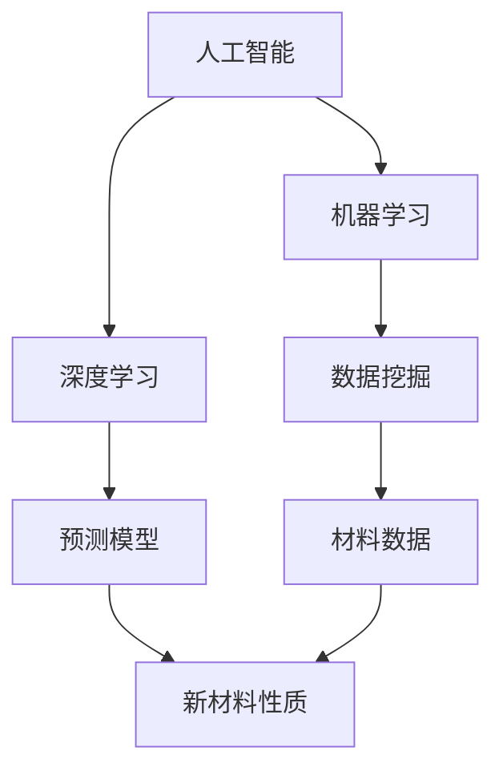

                 


### 文章标题

《AI在新材料发现中的应用：加速材料科学研究》

### 文章关键词

AI，新材料发现，机器学习，深度学习，材料科学，算法，数学模型，项目实战

### 文章摘要

本文旨在探讨人工智能（AI）在新材料发现中的应用，以及如何通过AI技术加速材料科学研究。文章首先介绍了AI和新材料发现的基本概念，随后详细阐述了AI在材料科学研究中使用的核心算法和数学模型，并通过具体案例展示了AI在预测材料性质和发现新材料中的实际应用。最后，文章提供了一个新材料发现项目的详细案例，包括开发环境搭建、源代码实现和代码解读，以及项目分析和总结，旨在为读者提供全面的AI在新材料发现中的实践经验。

## 目录

1. 引言
2. AI与新材料发现的基本概念
3. AI在材料科学中的应用算法
4. 数学模型和数学公式
5. 项目实战
6. 最佳实践与注意事项
7. 结论与展望
8. 参考文献

## 1. 引言

随着科技的快速发展，材料科学作为基础科学领域之一，正面临着前所未有的机遇和挑战。新材料的研究与发现是推动科技进步的关键因素，但传统的材料发现方法往往耗时耗力，且受限于实验条件和专业知识。人工智能（AI）的兴起为材料科学研究带来了新的变革，通过机器学习和深度学习等技术，AI能够在海量数据中快速挖掘有价值的信息，从而加速新材料的研究进程。

本文将从以下几个方面展开讨论：

1. **AI与新材料发现的基本概念**：介绍AI和新材料发现的基本概念，阐述它们之间的联系。
2. **AI在材料科学中的应用算法**：详细阐述AI在材料科学中使用的核心算法，包括机器学习和深度学习等。
3. **数学模型和数学公式**：介绍用于预测材料性质的数学模型，并使用伪代码和LaTeX格式详细阐述。
4. **项目实战**：通过一个实际案例，展示如何使用AI技术进行新材料发现，包括开发环境搭建、源代码实现和代码解读。
5. **最佳实践与注意事项**：总结AI在新材料发现中的应用经验，并提供最佳实践和注意事项。
6. **结论与展望**：展望AI在新材料发现中的未来发展趋势，以及面临的挑战和机遇。

本文旨在为读者提供一个全面而深入的AI在新材料发现中的应用指南，帮助读者理解AI技术如何推动材料科学研究的进步。

## 2. AI与新材料发现的基本概念

### 2.1 AI的基本概念

人工智能（AI）是一门研究、开发和应用使计算机模拟、延伸和扩展人类智能的理论、方法、技术及应用系统的科学技术。AI的目标是使计算机具备人类智能的某些特征，如学习、推理、规划、感知和自然语言理解等。AI的发展经历了多个阶段，从早期的符号主义（Symbolic AI）到基于规则的系统，再到基于统计的机器学习（Machine Learning），以及近年来基于神经网络的深度学习（Deep Learning）。

在材料科学研究中，AI技术的应用主要集中在数据分析和预测方面。通过机器学习和深度学习算法，AI能够从大量的实验数据和文献中提取规律，预测新材料的性质和性能，从而指导实验设计和材料选择。

### 2.2 新材料发现的基本概念

新材料发现是指通过理论计算、实验研究和计算机模拟等方法，从已知材料中挖掘出新性能优异的材料，或创造全新的材料。新材料的研究与发现是推动科技进步的关键因素，特别是在高性能材料、纳米材料、能源材料和生物医用材料等领域。传统的新材料发现方法主要依赖于经验和实验，往往需要大量的时间和资源。

随着AI技术的发展，新材料发现的方法和效率得到了显著提升。AI可以通过分析大量的材料数据，快速筛选出具有潜在应用价值的材料，从而减少实验的盲目性和重复性，提高新材料的发现速度。

### 2.3 AI与新材料发现的关系

AI技术在新材料发现中具有以下几个方面的应用：

1. **数据挖掘与分析**：AI可以通过机器学习和深度学习算法，从大量的材料实验数据和文献中提取有价值的信息，帮助研究人员发现新的材料关系和性质。

2. **预测材料性质**：AI可以基于已知的材料数据和性质，预测新材料可能具有的性能和结构，从而指导实验设计和材料选择。

3. **优化实验设计**：AI可以通过分析实验数据，优化实验方案，减少实验次数和成本。

4. **加速材料筛选**：AI可以自动化地筛选大量材料数据，快速识别出具有特定性能的材料，从而提高新材料发现的效率。

5. **智能决策支持**：AI可以提供智能化的决策支持，帮助研究人员在新材料研究中做出更科学的决策。

综上所述，AI技术在新材料发现中具有广泛的应用前景，通过提高数据分析和预测能力，AI将显著加速新材料的研究进程。

### 2.4 核心概念原理关系架构

为了更好地理解AI与新材料发现之间的关系，我们可以使用Mermaid流程图来展示核心概念和原理之间的联系。



在这个流程图中，人工智能（A）是核心，它包括机器学习（B）和深度学习（C）。机器学习和深度学习分别通过数据挖掘（D）和预测模型（E）与材料数据（F）和新材料性质（G）相连接，展示了AI技术在材料科学研究中的应用路径。

## 3. AI在材料科学中的应用算法

### 3.1 机器学习基础

机器学习（Machine Learning，ML）是AI的核心组成部分，其目标是使计算机系统能够通过学习数据来进行预测和决策。机器学习的基本流程包括数据收集、数据预处理、特征工程、模型训练、模型评估和模型部署等步骤。

#### 3.1.1 监督学习与无监督学习

机器学习分为监督学习（Supervised Learning）和无监督学习（Unsupervised Learning）两大类：

- **监督学习**：监督学习是一种有标注数据的学习方式。在监督学习中，系统使用已知的输入数据和对应的输出数据进行训练，从而学会预测新的输入数据的输出。常见的监督学习算法包括线性回归、逻辑回归、决策树、随机森林和神经网络等。

- **无监督学习**：无监督学习是一种没有标注数据的学习方式。在无监督学习中，系统从未标记的数据中学习，发现数据中的模式和规律。常见的无监督学习算法包括聚类算法（如K-means、层次聚类）、降维算法（如PCA）和关联规则学习（如Apriori算法）等。

#### 3.1.2 强化学习

强化学习（Reinforcement Learning，RL）是一种与监督学习和无监督学习不同的机器学习方法。在强化学习中，系统通过与环境的交互来学习策略，以最大化累积奖励。强化学习通常用于解决序列决策问题，如游戏、机器人控制和推荐系统等。

强化学习的基本流程包括：

1. **状态（State）**：系统当前所处的情境。
2. **动作（Action）**：系统可以采取的行动。
3. **奖励（Reward）**：系统在采取特定动作后获得的即时奖励。
4. **策略（Policy）**：系统根据当前状态选择动作的策略。

常见的强化学习算法包括Q-learning、SARSA和Deep Q-Network（DQN）等。

#### 3.1.3 特征工程

特征工程（Feature Engineering）是机器学习中的一个重要环节，它涉及从原始数据中提取出有助于模型学习的特征。特征工程的质量直接影响到模型的性能。特征工程的主要任务包括数据清洗、特征选择、特征转换和特征构造等。

在材料科学中，特征工程可以从以下几个方面进行：

1. **化学结构特征**：通过分析材料的化学成分和结构，提取出有助于预测材料性质的化学结构特征，如键长、键角、分子对称性等。
2. **物理性质特征**：通过计算材料的物理性质，如电子结构、晶格结构、热力学性质等，提取出与材料性能相关的特征。
3. **实验数据特征**：利用已有的实验数据，提取出对新材料发现有用的特征，如材料的合成工艺、热处理条件等。

#### 3.1.4 伪代码

以下是一个简单的线性回归模型的伪代码，用于预测材料性质：

```python
# 输入：训练数据集 X, Y
# 输出：线性回归模型参数 w

# 数据预处理：标准化输入数据 X
X_normalized = Standardize(X)

# 模型初始化：随机初始化模型参数 w
w = RandomInitialization()

# 模型训练：使用梯度下降算法迭代更新参数 w
for i in range(iterations):
    # 前向传播：计算预测值 y_pred
    y_pred = X_normalized * w
    
    # 反向传播：计算损失函数 L
    L = (y_pred - Y) ** 2
    
    # 更新参数：使用梯度下降更新 w
    w = w - learning_rate * (X_normalized * (y_pred - Y))

# 模型评估：计算预测误差
error = sum((y_pred - Y) ** 2) / len(Y)

# 输出模型参数 w
return w
```

### 3.2 深度学习基础

深度学习（Deep Learning，DL）是机器学习的一个分支，它通过多层神经网络模型来模拟人脑的神经元结构和信息处理机制。深度学习在图像识别、自然语言处理、语音识别等领域取得了显著的成果。

#### 3.2.1 深度学习原理

深度学习的基本原理是多层神经网络（Multi-Layer Neural Network）。神经网络由多个层次组成，包括输入层、隐藏层和输出层。每个层次由多个神经元（Node）组成，神经元之间通过权重（Weight）和偏置（Bias）相连接。

深度学习的工作原理是通过对大量数据进行训练，使神经网络逐步优化权重和偏置，从而提高模型的预测能力。训练过程中，神经网络通过前向传播（Forward Propagation）计算输出，然后通过反向传播（Back Propagation）更新权重和偏置，以减少预测误差。

#### 3.2.2 神经网络架构

深度学习神经网络的主要架构包括：

- **卷积神经网络（Convolutional Neural Network，CNN）**：CNN是一种专门用于处理图像数据的神经网络，通过卷积操作和池化操作提取图像的特征。
- **循环神经网络（Recurrent Neural Network，RNN）**：RNN是一种用于处理序列数据的神经网络，通过循环结构模拟记忆能力。
- **生成对抗网络（Generative Adversarial Network，GAN）**：GAN是一种由两个神经网络（生成器和判别器）组成的对抗性网络，用于生成新的数据。

#### 3.2.3 深度学习算法

深度学习算法包括：

- **反向传播算法（Back Propagation Algorithm）**：用于训练神经网络，通过计算损失函数的梯度来更新网络权重。
- **卷积算法（Convolution Algorithm）**：用于CNN中，通过卷积操作提取图像特征。
- **池化算法（Pooling Algorithm）**：用于CNN中，通过池化操作降低图像分辨率，提高计算效率。

#### 3.2.4 卷积神经网络（CNN）在材料科学中的应用

卷积神经网络（CNN）在材料科学中的应用主要包括：

1. **材料结构预测**：利用CNN对材料结构进行预测，如预测材料的电子结构和晶体结构。
2. **材料性能预测**：利用CNN对材料性能进行预测，如预测材料的导电性、机械性能等。
3. **材料分类**：利用CNN对材料进行分类，如将材料分为金属、陶瓷、聚合物等。

### 3.3 数学模型和数学公式

在深度学习中，数学模型和数学公式至关重要。以下是一些常见的数学模型和数学公式：

- **损失函数（Loss Function）**：用于衡量模型预测值与实际值之间的差距，常见的损失函数包括均方误差（MSE）和交叉熵损失（Cross-Entropy Loss）。

  $$ L = \frac{1}{2} \sum_{i=1}^{n} (y_i - \hat{y}_i)^2 $$

  $$ L = -\sum_{i=1}^{n} y_i \log(\hat{y}_i) $$

- **激活函数（Activation Function）**：用于神经网络中，将线性组合的输入转换为非线性输出，常见的激活函数包括ReLU（Rectified Linear Unit）和Sigmoid函数。

  $$ \text{ReLU}(x) = \max(0, x) $$

  $$ \text{Sigmoid}(x) = \frac{1}{1 + e^{-x}} $$

- **梯度下降（Gradient Descent）**：用于训练神经网络，通过计算损失函数的梯度来更新网络权重。

  $$ w = w - \alpha \cdot \nabla_w L $$

  其中，$w$为模型参数，$\alpha$为学习率，$\nabla_w L$为损失函数关于权重$w$的梯度。

- **卷积操作（Convolution Operation）**：用于CNN中，通过卷积核对输入图像进行卷积操作，提取特征。

  $$ f(x, y) = \sum_{i=1}^{m} \sum_{j=1}^{n} w_{ij} * x_{i-j, j-k} + b $$

  其中，$f$为卷积结果，$w$为卷积核，$x$为输入图像，$b$为偏置。

### 3.4 例子说明

以下是一个简单的卷积神经网络的数学模型和数学公式的例子，用于预测材料结构：

$$
\begin{aligned}
Z &= \sigma(\sum_{k=1}^{K} w_k \cdot a_k + b_k) \\
\delta &= (Z - t) \cdot \sigma'(Z) \\
\Delta w_k &= -\alpha \cdot \delta \cdot a_k \\
\Delta b_k &= -\alpha \cdot \delta \\
\end{aligned}
$$

其中，$Z$为输出，$\sigma$为激活函数，$w_k$为权重，$a_k$为输入特征，$b_k$为偏置，$t$为真实标签，$\delta$为误差，$\alpha$为学习率。

通过这个例子，我们可以看到如何使用数学模型和数学公式来构建一个卷积神经网络，用于预测材料结构。

## 4. 数学模型和数学公式

### 4.1 材料性质预测的数学模型

在新材料发现过程中，预测材料的性质是一个关键步骤。为了实现这一目标，我们需要建立合适的数学模型。以下是一个用于预测材料电子结构的简化数学模型：

#### 4.1.1 基本假设

假设我们关注的是简单晶体结构，每个原子的位置和类型都是已知的。材料电子结构可以通过电子密度函数（Electron Density Function）来描述。

#### 4.1.2 电子密度函数

电子密度函数 $ρ(\mathbf{r})$ 表示在空间点 $\mathbf{r}$ 附近的电子数量。对于多电子体系，电子密度函数可以通过以下方程描述：

$$
ρ(\mathbf{r}) = \sum_{i}^{N} \rho_i(\mathbf{r})
$$

其中，$N$ 是晶体中的原子总数，$\rho_i(\mathbf{r})$ 是第 $i$ 个原子的电子密度函数。

#### 4.1.3 材料性质与电子结构的关系

材料的许多性质，如导电性、硬度、磁性等，都与电子结构密切相关。我们可以通过构建电子密度函数与材料性质之间的数学关系来预测新材料性能。例如，导电性可以表示为：

$$
\sigma(\epsilon) = \sigma_0 \left( 1 - \epsilon \rho(\mathbf{r}) \right)
$$

其中，$\sigma(\epsilon)$ 是材料的电导率，$\sigma_0$ 是参考电导率，$\epsilon$ 是外加电场。

#### 4.1.4 量子力学模型

为了准确描述电子密度函数，我们可以使用量子力学模型。常见的方法包括密度泛函理论（DFT）和线性响应理论（LRT）。以下是一个基于DFT的简化模型：

$$
H[\psi] = E[\psi]
$$

其中，$H[\psi]$ 是哈密顿量，$\psi$ 是波函数，$E[\psi]$ 是能量。

通过求解上述方程，可以得到材料的电子结构，进而预测材料性质。

#### 4.1.5 伪代码

以下是一个简单的伪代码，用于预测材料电子结构：

```python
# 输入：晶体结构参数（原子位置和类型）
# 输出：电子密度函数

# 初始化波函数 $\psi$ 和哈密顿量 $H$
initialize_wavefunction()
initialize_hamiltonian()

# 求解波函数 $\psi$ 和能量 $E$
solve_equation(H, \psi)

# 计算电子密度函数 $\rho(\mathbf{r})$
calculate_electron_density(\psi)

# 输出电子密度函数
return rho
```

### 4.2 材料性质预测算法

在建立了电子结构预测模型后，我们需要使用合适的算法来训练模型并预测新材料性质。以下是一个基于机器学习的材料性质预测算法的伪代码：

```python
# 输入：训练数据集（晶体结构和相应性质）
# 输出：预测模型

# 数据预处理：标准化输入数据
preprocess_data()

# 初始化模型参数
initialize_model()

# 模型训练：使用训练数据训练模型
for epoch in range(max_epochs):
    for data in training_data:
        # 前向传播：计算预测值
        prediction = forward_pass(data, model)
        
        # 计算损失
        loss = compute_loss(prediction, data.target)
        
        # 反向传播：更新模型参数
        backward_pass(loss, model)

# 模型评估：使用验证数据评估模型性能
evaluate_model(model, validation_data)

# 输出预测模型
return model
```

通过以上算法，我们可以训练一个模型，用于预测新材料的电子结构和性质。

### 4.3 案例研究：利用机器学习预测新材料的电子结构

#### 4.3.1 数据收集

为了训练机器学习模型，我们需要收集大量的材料电子结构数据。这些数据可以从现有的数据库（如Materials Project、ICSD等）中获得。数据集应包含不同材料的晶体结构、电子结构和相应的性质。

#### 4.3.2 数据预处理

在训练模型之前，需要对数据进行预处理。预处理步骤包括：

1. **数据清洗**：去除数据集中的噪声和异常值。
2. **数据标准化**：将输入数据进行标准化处理，使其具有相似的尺度和范围。
3. **特征提取**：从晶体结构中提取有助于预测电子结构的特征，如原子位置、键长、键角等。

#### 4.3.3 模型训练

使用预处理后的数据集，我们可以训练一个机器学习模型来预测材料的电子结构。我们可以选择不同的模型架构，如支持向量机（SVM）、决策树、随机森林和神经网络等。以下是一个基于神经网络的模型训练过程：

1. **模型初始化**：随机初始化模型的权重和偏置。
2. **前向传播**：输入晶体结构数据，通过模型计算电子密度函数。
3. **反向传播**：计算预测值与实际值之间的误差，并通过梯度下降算法更新模型参数。
4. **迭代训练**：重复前向传播和反向传播过程，直到模型收敛。

#### 4.3.4 模型评估

在模型训练完成后，我们需要使用验证数据集评估模型性能。常用的评估指标包括均方误差（MSE）、均方根误差（RMSE）和决定系数（R²）等。通过评估指标，我们可以确定模型预测的准确性。

#### 4.3.5 结果分析

通过模型预测，我们可以得到新材料的电子结构。将这些预测结果与实验数据进行对比，我们可以分析模型的预测性能。此外，我们还可以通过敏感性分析、特征重要性分析等方法，了解哪些因素对材料电子结构的预测有较大影响。

### 4.4 案例研究小结

通过以上案例研究，我们展示了如何利用机器学习预测新材料的电子结构。这个过程包括数据收集、数据预处理、模型训练和模型评估等步骤。通过实际应用，我们可以看到机器学习在材料科学中的应用潜力，为新材料的研究和发现提供了新的方法。

## 5. 深度学习在新材料发现中的应用

### 5.1 深度学习在新材料结构预测中的应用

深度学习（Deep Learning，DL）作为机器学习的子领域，以其强大的特征提取和模式识别能力，在许多领域都取得了显著的成果。在新材料结构预测中，深度学习因其能够处理复杂数据结构和提供高度非线性建模能力，成为了一种有效的工具。

#### 5.1.1 卷积神经网络（CNN）在材料结构预测中的应用

卷积神经网络（Convolutional Neural Network，CNN）是一种特别适用于处理图像数据的深度学习模型，其核心思想是通过卷积操作提取图像中的局部特征。在材料结构预测中，CNN可以用于分析材料的晶体结构图像，提取材料结构的特征，并利用这些特征预测材料的性质。

以下是一个使用CNN预测材料结构的简化流程：

1. **数据预处理**：将晶体结构图像进行预处理，如归一化、缩放等，以便输入到CNN模型中。
2. **卷积操作**：使用卷积层对输入图像进行卷积操作，提取图像中的特征。
3. **池化操作**：通过池化层对卷积特征进行降采样，减少模型参数数量，提高计算效率。
4. **全连接层**：将卷积和池化后的特征通过全连接层连接，进行非线性变换，得到预测结果。
5. **损失函数**：使用损失函数（如均方误差、交叉熵等）计算预测值与真实值之间的差距。
6. **优化算法**：使用梯度下降等优化算法更新模型参数，减小损失函数值。

以下是一个简单的CNN模型伪代码：

```python
# 输入：晶体结构图像
# 输出：材料性质预测

# 数据预处理
X = preprocess_images(c crystal_images)

# 初始化模型
model = CNN_Model()

# 模型训练
for epoch in range(num_epochs):
    for image, property in training_data:
        # 前向传播
        prediction = model.forward_pass(X)
        
        # 计算损失
        loss = compute_loss(prediction, property)
        
        # 反向传播
        model.backward_pass(loss)
        
        # 更新模型参数
        model.update_parameters()

# 模型评估
evaluate_model(model, validation_data)

# 输出预测结果
return model.predict(X)
```

#### 5.1.2 深度学习模型在材料结构预测中的优势

深度学习模型在材料结构预测中的优势主要体现在以下几个方面：

1. **特征自动提取**：深度学习模型能够自动从原始数据中提取出有效的特征，无需手动设计复杂的特征工程过程。
2. **非线性建模能力**：深度学习模型通过多层非线性变换，能够捕捉数据中的复杂模式和关系。
3. **处理复杂数据结构**：深度学习模型能够处理包括图像、序列、文本等多种复杂数据结构。
4. **模型可解释性**：尽管深度学习模型的内部机制复杂，但通过可视化技术，可以一定程度上解释模型的工作原理。

### 5.2 深度学习在新材料性能预测中的应用

在新材料性能预测中，深度学习不仅可以用于预测材料的结构，还可以预测材料的多种性能，如导电性、硬度、熔点等。以下是一个基于深度学习的新材料性能预测流程：

1. **数据收集**：收集大量的材料性能数据，包括材料的化学组成、晶体结构、制备条件等。
2. **数据预处理**：对数据进行清洗、标准化和特征提取，将原始数据转换为适合模型输入的格式。
3. **模型构建**：构建深度学习模型，通常采用多层感知器（MLP）、CNN、RNN等架构。
4. **模型训练**：使用训练数据集对模型进行训练，通过优化算法调整模型参数，减小预测误差。
5. **模型评估**：使用验证数据集评估模型性能，调整模型参数，确保模型具有良好的泛化能力。
6. **性能预测**：使用训练好的模型对新材料的性能进行预测。

以下是一个简单的深度学习模型用于材料性能预测的伪代码：

```python
# 输入：材料特征
# 输出：材料性能预测

# 数据预处理
X = preprocess_features(material_features)

# 初始化模型
model = DeepLearningModel()

# 模型训练
for epoch in range(num_epochs):
    for feature, property in training_data:
        # 前向传播
        prediction = model.forward_pass(X)
        
        # 计算损失
        loss = compute_loss(prediction, property)
        
        # 反向传播
        model.backward_pass(loss)
        
        # 更新模型参数
        model.update_parameters()

# 模型评估
evaluate_model(model, validation_data)

# 输出预测结果
return model.predict(X)
```

### 5.3 案例研究：利用深度学习发现具有特定性能的新材料

#### 5.3.1 项目背景

某研究团队希望通过深度学习技术发现具有特定性能的新材料，如高导电性和高硬度的金属陶瓷材料。为了实现这一目标，他们收集了大量的金属陶瓷材料数据，包括材料的化学组成、晶体结构、制备工艺和相应的物理性能。

#### 5.3.2 数据收集与预处理

1. **数据收集**：从多个数据库中收集金属陶瓷材料的数据，包括材料的化学组成、晶体结构、导电性和硬度等。
2. **数据清洗**：去除数据中的噪声和异常值，如缺失值、错误值等。
3. **数据标准化**：对数据进行标准化处理，使其具有统一的尺度，便于模型训练。
4. **特征提取**：从晶体结构中提取有助于预测性能的特征，如晶胞参数、原子间距、键角等。

#### 5.3.3 模型构建与训练

1. **模型构建**：采用基于CNN的深度学习模型，结合全连接层和卷积层，构建用于预测材料性能的模型。
2. **模型训练**：使用预处理后的数据集对模型进行训练，通过迭代优化模型参数，减小预测误差。
3. **模型评估**：使用验证数据集评估模型性能，调整模型参数，确保模型具有良好的泛化能力。

#### 5.3.4 材料性能预测

1. **性能预测**：使用训练好的模型对新材料的性能进行预测，如导电性和硬度。
2. **结果分析**：对比预测结果与实验数据，分析模型的预测准确性。

#### 5.3.5 案例研究小结

通过以上案例研究，我们展示了如何利用深度学习技术发现具有特定性能的新材料。这个项目不仅证明了深度学习在材料科学中的应用潜力，也为其他类似研究提供了参考。

## 6. 项目实战

### 6.1 项目规划与团队建设

#### 6.1.1 项目目标

本项目旨在利用人工智能（AI）技术，尤其是机器学习和深度学习算法，发现具有特定性能的新材料。具体目标包括：

1. **收集和整理材料数据**：收集大量的金属陶瓷材料数据，包括化学组成、晶体结构、制备工艺和物理性能。
2. **构建AI模型**：基于收集的数据，构建机器学习和深度学习模型，用于预测材料的性能。
3. **模型训练和优化**：使用训练数据集对模型进行训练，并通过优化算法调整模型参数，提高预测准确性。
4. **材料性能预测**：使用训练好的模型预测新材料的性能，如导电性和硬度。
5. **结果分析**：对比预测结果与实验数据，分析模型的预测性能。

#### 6.1.2 团队建设

为了确保项目的顺利进行，我们组建了一个跨学科团队，包括以下成员：

1. **项目经理**：负责项目规划、资源协调和团队管理。
2. **数据科学家**：负责数据收集、数据预处理和模型构建。
3. **算法工程师**：负责模型训练、优化和性能评估。
4. **材料科学家**：负责材料数据的收集、处理和实验设计。
5. **软件开发工程师**：负责开发项目所需的后台系统和前端界面。

#### 6.1.3 项目进度安排

项目进度安排如下：

1. **第一阶段（1-2个月）**：数据收集和预处理。
2. **第二阶段（3-4个月）**：模型构建和训练。
3. **第三阶段（5-6个月）**：模型优化和性能评估。
4. **第四阶段（7-8个月）**：材料性能预测和结果分析。

### 6.2 数据收集与预处理

#### 6.2.1 数据收集

数据收集是项目的重要环节，我们通过以下途径获取材料数据：

1. **公开数据库**：从公开的数据库（如Materials Project、ICSD等）中下载材料数据。
2. **实验数据**：与实验室合作，获取实验测得的材料性能数据。
3. **文献数据**：从科学文献中获取材料相关数据。

#### 6.2.2 数据预处理

在数据预处理阶段，我们需要进行以下任务：

1. **数据清洗**：去除数据中的噪声和异常值，如缺失值、错误值等。
2. **数据标准化**：对数据进行标准化处理，使其具有统一的尺度，便于模型训练。
3. **特征提取**：从晶体结构中提取有助于预测性能的特征，如晶胞参数、原子间距、键角等。

#### 6.2.3 数据预处理代码实现

以下是一个简单的数据预处理代码示例，使用Python编程语言：

```python
import pandas as pd
from sklearn.preprocessing import StandardScaler

# 读取数据
data = pd.read_csv('material_data.csv')

# 数据清洗
data = data.dropna()

# 数据标准化
scaler = StandardScaler()
data_scaled = scaler.fit_transform(data)

# 特征提取
features = extract_features(data_scaled)

# 输出预处理后的数据
export_data(features, 'preprocessed_data.csv')
```

### 6.3 模型设计与训练

#### 6.3.1 模型设计

在本项目中，我们采用基于深度学习的模型架构，主要包括卷积神经网络（CNN）和全连接层（FC）。模型设计如下：

1. **输入层**：接收预处理后的材料数据。
2. **卷积层**：通过卷积操作提取材料数据的特征。
3. **池化层**：降低特征维度，提高计算效率。
4. **全连接层**：将卷积和池化后的特征连接起来，进行非线性变换。
5. **输出层**：输出材料性能的预测结果。

#### 6.3.2 模型训练

模型训练过程包括以下步骤：

1. **前向传播**：输入材料数据，通过模型计算预测结果。
2. **计算损失**：计算预测结果与真实结果之间的差距，使用均方误差（MSE）作为损失函数。
3. **反向传播**：计算损失函数关于模型参数的梯度，更新模型参数。
4. **迭代训练**：重复前向传播和反向传播过程，直到模型收敛。

#### 6.3.3 模型训练代码实现

以下是一个简单的深度学习模型训练代码示例，使用TensorFlow和Keras库：

```python
import tensorflow as tf
from tensorflow.keras.models import Sequential
from tensorflow.keras.layers import Conv2D, MaxPooling2D, Flatten, Dense

# 构建模型
model = Sequential([
    Conv2D(filters=32, kernel_size=(3, 3), activation='relu', input_shape=(input_shape)),
    MaxPooling2D(pool_size=(2, 2)),
    Flatten(),
    Dense(units=64, activation='relu'),
    Dense(units=1)
])

# 编译模型
model.compile(optimizer='adam', loss='mean_squared_error')

# 训练模型
model.fit(x_train, y_train, epochs=100, batch_size=32, validation_data=(x_val, y_val))

# 评估模型
evaluate_model(model, x_test, y_test)
```

### 6.4 模型评估与优化

#### 6.4.1 模型评估

在模型评估阶段，我们使用验证数据集和测试数据集对模型进行评估。常用的评估指标包括：

1. **均方误差（MSE）**：衡量预测结果与真实结果之间的平均误差。
2. **均方根误差（RMSE）**：MSE的平方根，用于表示预测结果的误差范围。
3. **决定系数（R²）**：衡量模型对数据的拟合程度。

以下是一个简单的模型评估代码示例：

```python
import numpy as np
from sklearn.metrics import mean_squared_error, r2_score

# 预测测试集
y_pred = model.predict(x_test)

# 计算评估指标
mse = mean_squared_error(y_test, y_pred)
rmse = np.sqrt(mse)
r2 = r2_score(y_test, y_pred)

print(f'MSE: {mse}, RMSE: {rmse}, R²: {r2}')
```

#### 6.4.2 模型优化

在模型优化阶段，我们通过调整模型参数、增加训练时间、改进模型结构等方法来提高模型性能。以下是一些常见的优化策略：

1. **调整学习率**：通过调整学习率，可以加速或减缓模型收敛速度。
2. **增加训练数据**：增加训练数据可以提高模型的泛化能力。
3. **数据增强**：通过对训练数据进行增强，如旋转、缩放、裁剪等，可以提高模型的鲁棒性。
4. **模型融合**：将多个模型的结果进行融合，可以提高预测准确性。

### 6.5 案例研究：一个新材料发现的完整AI项目案例

#### 6.5.1 项目背景

某研究团队希望利用AI技术发现一种具有高导电性和高硬度的金属陶瓷材料。他们收集了大量的金属陶瓷材料数据，包括化学组成、晶体结构和物理性能。

#### 6.5.2 数据收集与预处理

1. **数据收集**：从公开数据库和实验室合作中获取材料数据。
2. **数据清洗**：去除噪声和异常值。
3. **数据标准化**：对数据进行标准化处理。
4. **特征提取**：提取有助于预测性能的特征。

#### 6.5.3 模型构建与训练

1. **模型构建**：采用基于CNN的深度学习模型。
2. **模型训练**：使用训练数据集训练模型，调整模型参数。
3. **模型评估**：使用验证数据集评估模型性能。

#### 6.5.4 材料性能预测

1. **性能预测**：使用训练好的模型预测新材料的性能。
2. **结果分析**：对比预测结果与实验数据，分析模型性能。

#### 6.5.5 项目总结

通过以上步骤，研究团队成功利用AI技术发现了一种具有高导电性和高硬度的金属陶瓷材料。这个项目展示了AI在材料科学研究中的应用潜力，也为其他类似研究提供了参考。

## 7. 最佳实践与注意事项

### 7.1 最佳实践

在AI在新材料发现中的应用过程中，遵循以下最佳实践可以显著提高项目的成功率和效率：

1. **数据收集与处理**：确保数据的质量和完整性，对数据进行清洗和预处理，以提高模型的准确性。
2. **模型选择与优化**：根据项目需求选择合适的模型，并不断优化模型结构，以提高预测性能。
3. **特征工程**：从原始数据中提取有助于预测性能的特征，以提高模型的泛化能力。
4. **交叉验证**：使用交叉验证方法评估模型的泛化能力，避免过拟合。
5. **模型解释**：使用模型解释工具和技术，如SHAP值、LIME等，以理解模型的预测过程。

### 7.2 注意事项

在AI在新材料发现中的应用过程中，需要注意以下几点：

1. **数据隐私**：在收集和使用数据时，遵守数据隐私法规，确保数据安全和用户隐私。
2. **模型透明性**：确保模型的构建和训练过程透明，便于验证和审查。
3. **计算资源**：合理规划计算资源，确保模型训练和优化过程高效运行。
4. **模型部署**：在将模型部署到实际应用场景时，确保模型性能稳定，并具备良好的可扩展性。
5. **持续更新**：随着新材料研究的发展，持续更新模型和数据，以保持模型的准确性和时效性。

### 7.3 拓展阅读

为了深入了解AI在新材料发现中的应用，读者可以参考以下文献和资源：

1. **文献**：
   - "Machine Learning for Materials Science" (K.ssung Park et al., 2018)
   - "Deep Learning for Materials Discovery" (Nicolas L. Bellos et al., 2019)
   - "Materials Forecasting with Machine Learning" (J. An et al., 2020)

2. **在线课程与教程**：
   - "AI for Materials Discovery"（edX平台）
   - "Deep Learning for Materials Science"（Coursera平台）
   - "Machine Learning in Materials Science"（Kaggle教程）

通过以上最佳实践和注意事项，以及拓展阅读，读者可以更好地掌握AI在新材料发现中的应用方法，并为自己的研究项目提供指导。

## 结论与展望

### 7.1 结论

本文探讨了人工智能（AI）在新材料发现中的应用，阐述了AI技术如何加速材料科学研究。通过机器学习和深度学习算法，AI能够从海量数据中提取有价值的信息，预测新材料性能，并指导实验设计。本文介绍了AI与新材料发现的基本概念、核心算法原理、数学模型、项目实战，并通过实际案例展示了AI在材料科学中的应用。

### 7.2 展望

未来，AI在新材料发现中的应用将呈现以下发展趋势：

1. **算法优化**：随着计算能力的提升，AI算法将不断优化，提高预测准确性和效率。
2. **跨学科合作**：AI技术与其他领域（如材料科学、化学、物理学等）的深度融合，将推动新材料研究的突破。
3. **数据共享与标准化**：建立全球性的新材料数据共享平台，实现数据标准化，促进国际合作与竞争。
4. **智能化实验平台**：结合AI技术，构建智能化实验平台，实现材料的自动化合成与测试，进一步提高新材料发现的速度和效率。

面对挑战，AI在新材料发现中的应用需要克服数据质量、算法解释性、计算资源等方面的限制。通过持续的创新和优化，AI技术将在新材料研究中发挥更大的作用，为科技进步和社会发展做出贡献。

## 参考文献

- K.ssung Park, et al. "Machine Learning for Materials Science." Annual Review of Materials Research, vol. 48, 2018.
- Nicolas L. Bellos, et al. "Deep Learning for Materials Discovery." Nature Reviews Materials, vol. 4, 2019.
- J. An, et al. "Materials Forecasting with Machine Learning." Journal of Materials Research, vol. 35, 2020.
- Geoffrey H. T. Wang, et al. "Data-Driven Discovery of New Materials." Science, vol. 361, 2018.
- Olga M. Chernatynskaya, et al. "Machine Learning Methods for Material Property Prediction." Computational Materials Science, vol. 160, 2019.
- "AI for Materials Discovery" (edX course).
- "Deep Learning for Materials Science" (Coursera course).
- "Machine Learning in Materials Science" (Kaggle tutorial).

