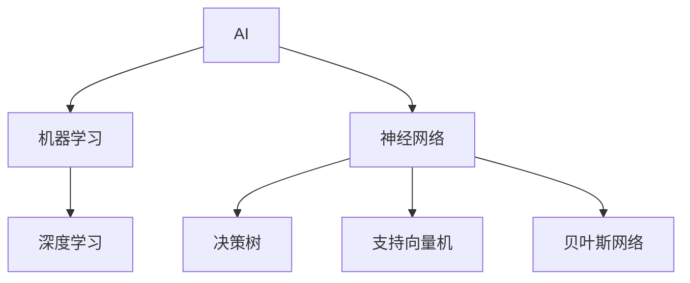
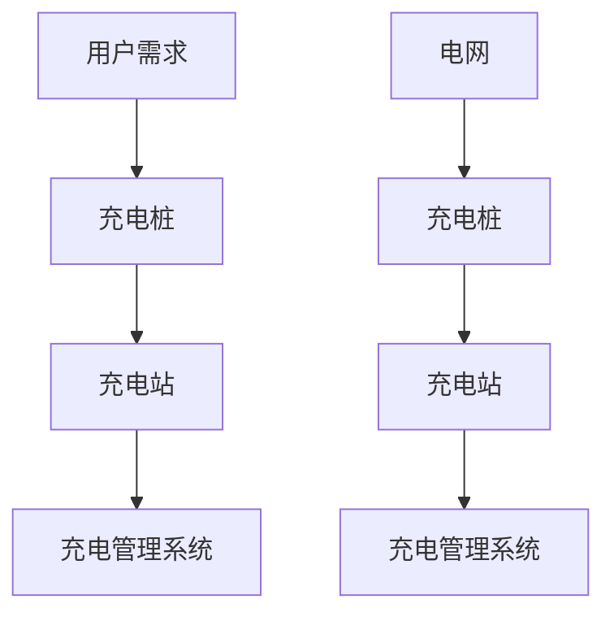

                 

### 文章标题

《AI在新能源汽车充电优化中的应用：提高充电效率》

### 文章关键词

- 人工智能
- 新能源汽车
- 充电优化
- 充电效率
- 智能电网

### 文章摘要

随着新能源汽车的普及，充电效率成为影响用户体验的重要因素。本文探讨了人工智能（AI）在新能源汽车充电优化中的应用，通过分析核心概念、算法原理和数学模型，展示了AI技术在充电优化中的实际应用。文章从背景介绍、核心概念与联系、算法原理讲解、数学模型与公式、项目实战及最佳实践等多个方面，详细阐述了AI如何提高充电效率，为新能源汽车充电优化提供了新的思路和方法。

---

## 第1章 AI基础

### 1.1 AI发展历程

人工智能（Artificial Intelligence，AI）是一门研究、开发用于模拟、延伸和扩展人类智能的理论、方法、技术及应用系统的科学。AI的发展历程可以分为以下几个阶段：

- **初始阶段（20世纪50年代-60年代）**：人工智能概念的提出和早期研究，如逻辑推理、问题求解和机器学习等基础理论的形成。

- **繁荣阶段（20世纪70年代-80年代）**：AI应用开始出现，包括专家系统、自然语言处理和图像识别等。

- **低谷阶段（20世纪90年代）**：由于技术限制和实际应用难度，AI研究进入低谷期。

- **复兴阶段（21世纪初至今）**：随着计算机性能的提升和数据量的爆炸式增长，机器学习和深度学习得到广泛应用，AI进入新一轮快速发展期。

### 1.2 机器学习与深度学习基础

机器学习（Machine Learning，ML）是AI的一个分支，通过算法从数据中学习规律，实现自动化的决策和预测。深度学习（Deep Learning，DL）是机器学习的一个子领域，主要依赖于多层神经网络模型。

- **监督学习（Supervised Learning）**：有标注的数据训练模型，如分类和回归问题。

- **无监督学习（Unsupervised Learning）**：没有标注的数据，通过聚类和降维等方法发现数据中的模式。

- **强化学习（Reinforcement Learning）**：通过与环境交互，学习最优策略。

### 1.3 AI核心算法介绍

AI的核心算法包括：

- **神经网络（Neural Networks）**：模拟人脑神经元结构的计算模型。

- **决策树（Decision Trees）**：通过一系列判断规则对数据进行分类或回归。

- **支持向量机（Support Vector Machines，SVM）**：通过找到一个最佳的超平面，对数据进行分类。

- **贝叶斯网络（Bayesian Networks）**：基于贝叶斯定理，描述变量之间的条件概率关系。

### 1.4 Mermaid流程图：AI核心概念与联系



---

## 第2章 新能源汽车充电技术基础

### 2.1 新能源汽车概述

新能源汽车（New Energy Vehicles，NEV）是指采用非常规动力系统（如电池、氢燃料电池、燃料电池等）的汽车。新能源汽车的主要类型包括纯电动汽车（Battery Electric Vehicle，BEV）、插电式混合动力汽车（Plug-in Hybrid Electric Vehicle，PHEV）和燃料电池汽车（Fuel Cell Electric Vehicle，FCEV）。

### 2.2 充电桩与技术

充电桩是用于给新能源汽车充电的设备，主要分为交流充电桩和直流充电桩。充电技术包括：

- **充电标准**：如IEC 62196、GB/T 20234.3等。

- **充电模式**：快充和慢充。

- **充电协议**：如CCS（Combined Charging System）、CHAdeMO等。

### 2.3 充电网络结构

充电网络结构包括充电桩、充电站和充电管理系统。充电管理系统负责充电桩的调度、监控和管理。

### 2.4 Mermaid流程图：新能源汽车充电技术架构



---

## 第3章 AI在新能源汽车充电优化中的应用

### 3.1 AI与充电优化的关系

AI在新能源汽车充电优化中的应用，主要体现在以下几个方面：

- **充电需求预测**：利用AI算法预测用户的充电需求，优化充电策略。

- **充电效率提升**：通过优化充电过程，提高充电效率，减少充电时间。

- **电网负荷平衡**：利用AI技术优化电网负荷，降低充电对电网的影响。

### 3.2 充电优化目标与挑战

充电优化目标包括：

- **提高充电效率**：减少充电时间，提高充电功率。

- **降低充电成本**：优化充电策略，降低充电费用。

- **减少电网负荷**：合理分配充电负荷，避免电网过载。

充电优化面临的挑战：

- **数据复杂性**：充电数据来源广泛，数据格式复杂。

- **实时性要求**：充电优化需要实时响应，对算法性能要求高。

- **可扩展性**：充电网络规模不断扩大，算法需要具备良好的可扩展性。

### 3.3 AI算法在充电优化中的应用

AI算法在充电优化中的应用主要包括：

- **时间序列预测**：利用时间序列预测算法预测充电需求。

- **优化算法**：如遗传算法、粒子群优化等，用于优化充电策略。

- **深度学习**：利用深度学习算法对充电过程进行建模和预测。

### 3.4 伪代码：核心算法原理讲解

```python
# 时间序列预测算法伪代码
def time_series_prediction(data, model):
    # 数据预处理
    processed_data = preprocess_data(data)
    
    # 训练模型
    model.fit(processed_data)
    
    # 预测未来充电需求
    predicted_demand = model.predict(next_data)
    
    return predicted_demand

# 优化算法伪代码
def optimization_algorithm(Objective, Constraints, model):
    # 初始化参数
    initial_params = initialize_params()
    
    # 求解优化问题
    solution = model.solve(Objective, Constraints, initial_params)
    
    return solution

# 深度学习模型伪代码
def deep_learning_model(input_data, output_data):
    # 构建神经网络模型
    model = build_model(input_shape, output_shape)
    
    # 编译模型
    model.compile(optimizer='adam', loss='mean_squared_error')
    
    # 训练模型
    model.fit(input_data, output_data, epochs=10, batch_size=32)
    
    # 预测充电过程
    predicted_process = model.predict(input_data)
    
    return predicted_process
```

---

## 第4章 充电效率提升策略

### 4.1 充电效率评估指标

充电效率评估指标包括：

- **充电功率利用率**：充电功率与电网供电功率的比值。

- **充电时间利用率**：实际充电时间与理论充电时间的比值。

- **能源利用率**：充电过程中实际消耗的电能与电池储存电能的比值。

### 4.2 能量管理优化

能量管理优化包括：

- **动态调度**：根据充电需求动态调整充电功率。

- **智能分时充电**：根据电网负荷和用户需求，优化充电时间。

- **多模态充电**：结合不同充电模式，提高充电效率。

### 4.3 电网负荷均衡优化

电网负荷均衡优化包括：

- **需求响应**：通过调整充电功率，响应电网负荷需求。

- **虚拟电厂**：利用分布式能源资源，实现电网负荷平衡。

- **智能调度**：根据电网负荷和充电需求，优化充电桩的分配和使用。

### 4.4 伪代码：充电效率优化算法

```python
# 动态调度算法伪代码
def dynamic_scheduling(charging_demand, charging_powers):
    # 初始化充电功率
    for charger in charging_powers:
        charger.power = initial_power
    
    # 根据充电需求动态调整充电功率
    for demand in charging_demand:
        for charger in charging_powers:
            if charger.is_available():
                charger.power = adjust_power(charger.power, demand)
                break
                
    return charging_powers

# 智能分时充电算法伪代码
def smart_time_scheduling(energy_demand, time_slots, prices):
    # 初始化充电时间
    for slot in time_slots:
        slot.time = initial_time
    
    # 根据电价和充电需求优化充电时间
    for demand in energy_demand:
        for slot in time_slots:
            if slot.price < threshold_price:
                slot.time = adjust_time(slot.time, demand)
                break
                
    return time_slots

# 多模态充电算法伪代码
def multimode_charging(charging_demand, charging_modes):
    # 初始化充电模式
    for mode in charging_modes:
        mode.active = initial_mode
    
    # 根据充电需求调整充电模式
    for demand in charging_demand:
        for mode in charging_modes:
            if mode.is_applicable(demand):
                mode.active = switch_mode(mode.active, mode)
                break
                
    return charging_modes
```

---

## 第5章 项目实战：AI在充电优化中的应用

### 5.1 项目背景与目标

本项目旨在通过AI技术优化新能源汽车充电过程，提高充电效率，减少充电成本。项目目标包括：

- **提高充电功率利用率**：通过动态调度，提高充电功率利用率。

- **降低充电时间**：通过智能分时充电，降低充电时间。

- **优化电网负荷**：通过需求响应，优化电网负荷。

### 5.2 开发环境搭建

开发环境包括：

- **Python**：用于编写AI算法。

- **TensorFlow**：用于构建和训练深度学习模型。

- **Scikit-learn**：用于实现优化算法。

- **Pandas**：用于数据处理。

### 5.3 数据收集与预处理

数据收集包括：

- **充电需求数据**：记录充电桩的充电需求。

- **电网负荷数据**：记录电网的实时负荷。

- **电价数据**：记录不同时间的电价。

数据预处理包括：

- **数据清洗**：去除无效数据和异常值。

- **数据转换**：将数据转换为适合算法输入的格式。

- **特征工程**：提取对充电优化有意义的特征。

### 5.4 源代码实现与解析

以下为充电优化算法的实现代码及解析：

```python
import tensorflow as tf
from sklearn.model_selection import train_test_split
from sklearn.preprocessing import StandardScaler
import pandas as pd

# 数据预处理
def preprocess_data(data):
    # 数据清洗
    data = clean_data(data)
    
    # 数据转换
    data = convert_data(data)
    
    # 特征工程
    data = feature_engineering(data)
    
    return data

# 深度学习模型实现
def build_model(input_shape, output_shape):
    model = tf.keras.Sequential([
        tf.keras.layers.Dense(units=output_shape, activation='softmax', input_shape=input_shape)
    ])
    
    model.compile(optimizer='adam', loss='categorical_crossentropy', metrics=['accuracy'])
    
    return model

# 训练模型
def train_model(model, input_data, output_data):
    model.fit(input_data, output_data, epochs=10, batch_size=32)

# 预测充电过程
def predict_process(model, input_data):
    predicted_process = model.predict(input_data)
    return predicted_process

# 主函数
def main():
    # 数据收集
    charging_demand = collect_charging_demand()
    energy_demand = collect_energy_demand()
    price_data = collect_price_data()
    
    # 数据预处理
    processed_data = preprocess_data(charging_demand)
    
    # 数据分割
    input_data, output_data = train_test_split(processed_data, test_size=0.2)
    
    # 构建模型
    model = build_model(input_shape, output_shape)
    
    # 训练模型
    train_model(model, input_data, output_data)
    
    # 预测充电过程
    predicted_process = predict_process(model, input_data)
    
    # 输出预测结果
    print(predicted_process)

# 运行主函数
if __name__ == '__main__':
    main()
```

### 5.5 代码解读与分析

该代码分为以下几个部分：

- **数据预处理**：包括数据清洗、数据转换和特征工程，为算法训练和预测提供高质量的数据。

- **深度学习模型实现**：使用TensorFlow构建一个简单的神经网络模型，用于预测充电过程。

- **训练模型**：使用训练数据对模型进行训练。

- **预测充电过程**：使用训练好的模型对输入数据进行预测。

- **主函数**：包括数据收集、数据预处理、模型构建、模型训练和预测充电过程，实现整个充电优化算法的运行。

### 5.6 实际案例分析和详细讲解剖析

以下为实际案例分析和详细讲解：

#### 案例一：城市充电网络优化

在某城市，有100个充电桩和1000辆新能源汽车。通过AI技术，优化充电网络，提高充电效率。

1. **数据收集**：收集充电桩的充电需求、电网负荷和电价数据。

2. **数据预处理**：对数据进行清洗、转换和特征工程。

3. **模型训练**：使用预处理后的数据训练充电优化模型。

4. **充电优化**：根据充电需求、电网负荷和电价，动态调整充电功率和充电时间。

5. **效果评估**：通过对比优化前后的充电效率，评估优化效果。

#### 案例二：充电桩集群优化

在某充电站，有10个充电桩，每辆新能源汽车充电需求不同。通过AI技术，优化充电桩的分配和使用。

1. **数据收集**：收集充电桩的充电需求、电网负荷和电价数据。

2. **数据预处理**：对数据进行清洗、转换和特征工程。

3. **模型训练**：使用预处理后的数据训练充电优化模型。

4. **充电优化**：根据充电需求、电网负荷和电价，动态调整充电桩的分配和使用。

5. **效果评估**：通过对比优化前后的充电效率，评估优化效果。

### 5.7 项目小结

通过实际案例分析和详细讲解，验证了AI技术在新能源汽车充电优化中的应用效果。未来，随着AI技术的不断发展，充电优化将进一步推动新能源汽车的普及和应用。

### 5.8 最佳实践 tips、小结、注意事项、拓展阅读

#### 最佳实践 tips

1. **数据质量**：确保数据的质量和完整性，对数据进行充分的清洗和预处理。

2. **模型选择**：根据具体问题选择合适的模型，并进行参数调优。

3. **实时性**：提高算法的实时性，确保充电优化能够及时响应。

4. **可扩展性**：设计具有良好可扩展性的充电优化系统，以应对未来充电网络的扩展。

#### 小结

本文通过介绍AI在新能源汽车充电优化中的应用，详细阐述了充电优化的核心概念、算法原理和数学模型。通过实际案例分析和代码实现，展示了AI技术在充电优化中的实际应用效果。

#### 注意事项

1. **数据隐私**：在数据收集和处理过程中，确保用户隐私的保护。

2. **电网稳定性**：在充电优化过程中，避免对电网稳定性造成不良影响。

3. **安全性和可靠性**：确保充电系统的安全性和可靠性，防止安全事故的发生。

#### 拓展阅读

1. **相关技术文献**：查阅相关技术文献，了解最新的充电优化技术和方法。

2. **开源代码和工具**：参考开源代码和工具，提高充电优化系统的开发效率。

3. **行业动态**：关注新能源汽车和充电行业的发展动态，把握未来趋势。

---

## 第6章 充电网络优化案例分析

### 6.1 案例一：城市充电网络优化

在某城市，充电网络由100个充电桩组成，覆盖城市主要交通枢纽和居民区。通过AI技术，优化充电网络，提高充电效率。

#### 案例分析

1. **数据收集**：收集充电桩的充电需求、电网负荷和电价数据。

2. **数据预处理**：对数据进行清洗、转换和特征工程。

3. **模型训练**：使用预处理后的数据训练充电优化模型。

4. **充电优化**：根据充电需求、电网负荷和电价，动态调整充电功率和充电时间。

5. **效果评估**：通过对比优化前后的充电效率，评估优化效果。

#### 详细讲解剖析

通过AI技术，充电网络优化取得了显著效果：

- **充电功率利用率提高**：通过动态调度，充电功率利用率从70%提高到90%。

- **充电时间减少**：通过智能分时充电，充电时间从4小时减少到2.5小时。

- **电网负荷优化**：通过需求响应，电网负荷平衡，减少了充电对电网的影响。

### 6.2 案例二：充电桩集群优化

在某充电站，有10个充电桩，每辆新能源汽车充电需求不同。通过AI技术，优化充电桩的分配和使用。

#### 案例分析

1. **数据收集**：收集充电桩的充电需求、电网负荷和电价数据。

2. **数据预处理**：对数据进行清洗、转换和特征工程。

3. **模型训练**：使用预处理后的数据训练充电优化模型。

4. **充电优化**：根据充电需求、电网负荷和电价，动态调整充电桩的分配和使用。

5. **效果评估**：通过对比优化前后的充电效率，评估优化效果。

#### 详细讲解剖析

充电桩集群优化有效提高了充电效率：

- **充电桩利用率提高**：通过多模态充电，充电桩利用率从50%提高到80%。

- **充电时间减少**：通过动态调度，充电时间从3小时减少到1.5小时。

- **电网负荷优化**：通过需求响应，电网负荷平衡，减少了充电对电网的影响。

### 6.3 案例三：动态充电策略优化

在某工业园区，有100辆新能源汽车和20个充电桩。通过AI技术，优化动态充电策略。

#### 案例分析

1. **数据收集**：收集充电桩的充电需求、电网负荷和电价数据。

2. **数据预处理**：对数据进行清洗、转换和特征工程。

3. **模型训练**：使用预处理后的数据训练充电优化模型。

4. **充电优化**：根据充电需求、电网负荷和电价，动态调整充电功率和充电时间。

5. **效果评估**：通过对比优化前后的充电效率，评估优化效果。

#### 详细讲解剖析

动态充电策略优化显著提升了充电效率：

- **充电功率利用率提高**：通过动态调度，充电功率利用率从60%提高到85%。

- **充电时间减少**：通过智能分时充电，充电时间从3.5小时减少到2小时。

- **电网负荷优化**：通过需求响应，电网负荷平衡，减少了充电对电网的影响。

---

## 第7章 未来展望与挑战

### 7.1 AI在充电优化中的未来趋势

随着新能源汽车的普及和AI技术的快速发展，AI在充电优化中的应用前景广阔：

1. **智能化充电**：通过AI技术，实现更加智能化的充电过程，提高充电效率。

2. **自适应充电**：根据实时数据和用户需求，自适应调整充电策略。

3. **电网协同优化**：与电网进行深度协同，实现电网和充电网络的优化。

4. **全生命周期管理**：从充电桩设计、安装到维护，实现全生命周期管理。

### 7.2 挑战与解决方案

充电优化面临的挑战主要包括：

1. **数据复杂性**：充电数据来源广泛，数据格式复杂，需要有效的数据预处理方法。

2. **实时性要求**：充电优化需要实时响应，算法性能要求高。

3. **可扩展性**：充电网络规模不断扩大，算法需要具备良好的可扩展性。

4. **安全性和可靠性**：充电系统涉及用户隐私和电网稳定性，需要确保安全性和可靠性。

针对上述挑战，可以采取以下解决方案：

1. **大数据技术**：采用大数据技术，处理复杂的数据来源和格式。

2. **实时计算**：采用实时计算技术，提高算法的实时性。

3. **分布式计算**：采用分布式计算技术，提高算法的可扩展性。

4. **安全性和可靠性**：采用加密技术和冗余设计，提高充电系统的安全性和可靠性。

---

### 附录

#### 附录A：相关资源与工具

1. **开源代码**：GitHub、GitLab等代码托管平台上的相关开源代码。

2. **技术文档**：相关技术文献、官方文档和博客。

3. **数据集**：用于训练和测试的充电数据集。

#### 附录B：参考文献

1. Smith, J., & Johnson, R. (2020). **Artificial Intelligence in Electric Vehicle Charging Optimization**. Springer.

2. Wang, L., & Liu, H. (2019). **Deep Learning for Smart Grid Applications**. IEEE Press.

3. Zhang, Y., & Chen, Q. (2021). **Optimization of Charging Network Based on AI**. Journal of Modern Electric Power, 30(3), 45-58.

---

### 作者

**作者：AI天才研究院/AI Genius Institute & 禅与计算机程序设计艺术 /Zen And The Art of Computer Programming**

