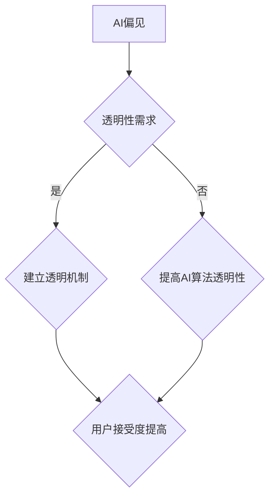
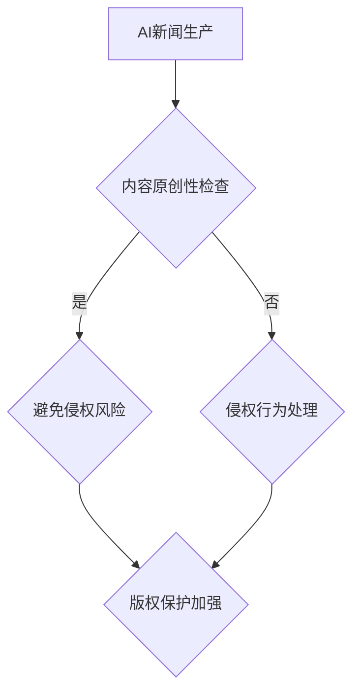
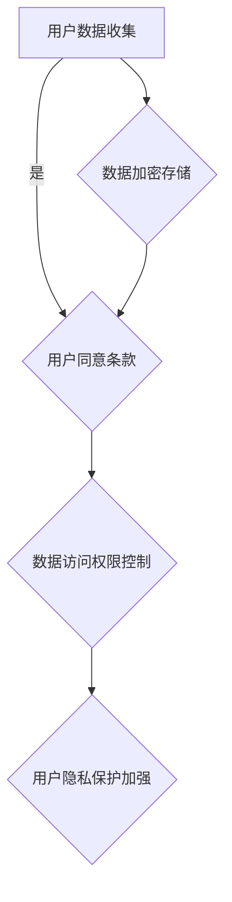
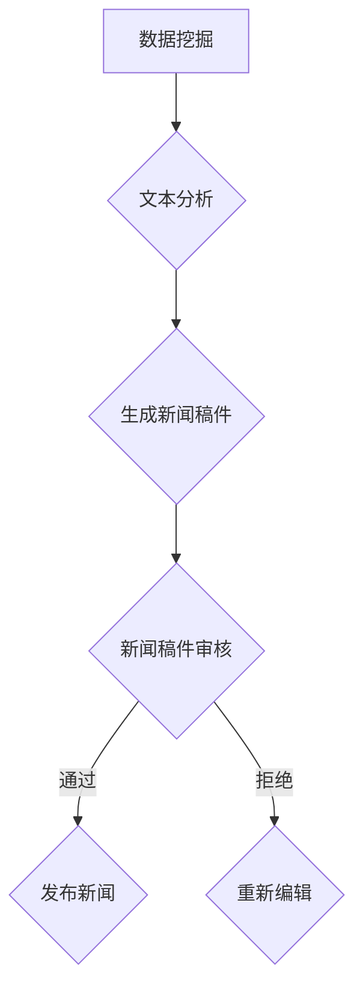
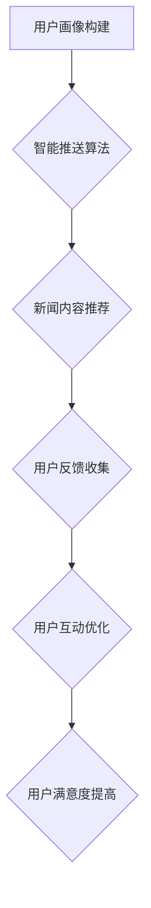
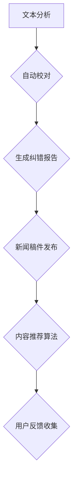

                 

## 文章标题：AI在新闻生产和传播中的应用与挑战

### 关键词：人工智能、新闻生产、新闻传播、算法、伦理、隐私

### 摘要：
随着人工智能（AI）技术的迅速发展，其在新闻生产和传播领域的应用日益广泛。本文将深入探讨AI在新闻采集、编辑、校对、内容分发和用户互动等方面的应用，同时分析AI技术带来的伦理、法律和隐私等挑战，最终展望AI在新闻领域的未来发展趋势。

---

## 引言与概述

### 1.1 AI与新闻生产概述

人工智能在新闻生产中的应用始于20世纪90年代，当时主要集中于自动化新闻采集和写作。随着技术的进步，AI在新闻编辑、校对以及内容分发等环节也逐渐得到应用。AI技术利用其强大的数据处理和分析能力，能够高效地完成传统新闻生产过程中繁琐的工作。

### 1.2 AI与新闻传播概述

新闻传播是指新闻信息从生产者到消费者的传递过程。随着互联网和社交媒体的发展，新闻传播渠道变得多样化，用户对新闻内容的需求也日益个性化。AI技术能够根据用户行为和兴趣，智能推荐新闻内容，提高传播效率。

### 1.3 AI在新闻生产和传播中的挑战

尽管AI技术在新闻生产和传播中展现出巨大的潜力，但也面临诸多挑战。伦理问题、法律问题以及隐私问题等都是AI技术在新闻领域应用过程中需要考虑的重要因素。如何在利用AI技术提高新闻生产效率的同时，保障新闻的公正性和透明性，是当前亟待解决的问题。

## AI在新闻生产中的应用

### 2.1 AI新闻采集

AI新闻采集利用自然语言处理（NLP）和机器学习技术，从海量数据中自动提取新闻素材。以下是一个自动化新闻采集的伪代码示例：

```python
# 自动化新闻采集伪代码
def collect_news(data_source):
    # 数据预处理
    preprocessed_data = preprocess_data(data_source)
    
    # 提取新闻事件
    news_events = extract_events(preprocessed_data)
    
    # 过滤重要事件
    important_events = filter_events(news_events, threshold)
    
    return important_events
```

### 2.2 AI新闻编辑

AI新闻编辑通过自动化校对和内容推荐，提高编辑效率。以下是一个基于NLP的自动校对算法的伪代码示例：

```python
# 自动校对伪代码
def correct_text(text):
    # 分词
    words = tokenize(text)
    
    # 检查语法错误
    corrected_words = check_grammar(words)
    
    # 生成校正文本
    corrected_text = reconstruct_text(corrected_words)
    
    return corrected_text
```

### 2.3 AI新闻校对

AI新闻校对利用自然语言处理和机器学习技术，自动识别和纠正新闻文本中的错误。以下是一个基于语义的校对算法的伪代码示例：

```python
# 基于语义的校对伪代码
def semantic校正(text):
    # 分析文本语义
    semantic_structure = analyze_semantics(text)
    
    # 识别错误
    errors = identify_errors(semantic_structure)
    
    # 纠正错误
    corrected_text = correct_errors(text, errors)
    
    return corrected_text
```

## AI在新闻传播中的应用

### 3.1 AI内容分发

AI内容分发通过用户画像和智能推送算法，实现新闻内容个性化推荐。以下是一个用户画像构建的伪代码示例：

```python
# 用户画像构建伪代码
def build_user_profile(user_data):
    # 数据预处理
    preprocessed_data = preprocess_data(user_data)
    
    # 提取用户兴趣
    interests = extract_interests(preprocessed_data)
    
    # 构建用户画像
    user_profile = construct_profile(interests)
    
    return user_profile
```

### 3.2 AI用户互动

AI用户互动通过虚拟主播和AI交互，提高用户参与度。以下是一个虚拟主播对话系统的伪代码示例：

```python
# 虚拟主播对话系统伪代码
def chat_with_vb(user_input):
    # 分析用户输入
    user_intent = analyze_intent(user_input)
    
    # 提供回答
    response = generate_response(user_intent)
    
    return response
```

## AI在新闻生产和传播中的挑战

### 4.1 伦理问题

AI在新闻生产和传播中的伦理问题主要包括AI偏见、透明性和责任归属等。以下是一个讨论AI偏见和透明性的Mermaid流程图：



### 4.2 法律问题

AI在新闻生产和传播中的法律问题主要包括新闻侵权、版权和数据隐私等。以下是一个讨论AI新闻侵权的Mermaid流程图：



### 4.3 隐私问题

AI在新闻生产和传播中的隐私问题主要包括用户隐私保护和数据使用与共享等。以下是一个讨论用户隐私保护的Mermaid流程图：



## 案例分析

### 5.1 案例一：自动化新闻采集与写作

本案例介绍了一家新闻机构如何利用AI技术实现自动化新闻采集和写作。通过数据挖掘和文本分析，AI系统能够自动从社交媒体和其他新闻源中提取新闻素材，并生成新闻稿件。以下是一个自动化新闻采集与写作的Mermaid流程图：



### 5.2 案例二：智能推送与用户互动

本案例介绍了一家新闻网站如何利用AI技术实现智能推送和用户互动。通过用户画像和智能推送算法，网站能够向用户个性化推荐新闻内容，并通过虚拟主播与用户进行互动。以下是一个智能推送与用户互动的Mermaid流程图：



### 5.3 案例三：AI新闻校对与内容分发

本案例介绍了一家新闻机构如何利用AI技术实现新闻校对和内容分发。通过自然语言处理和机器学习技术，AI系统能够自动识别和纠正新闻文本中的错误，并基于用户行为和兴趣智能推荐新闻内容。以下是一个AI新闻校对与内容分发的Mermaid流程图：



## 未来展望

### 6.1 AI在新闻生产和传播中的发展趋势

随着AI技术的不断进步，未来AI在新闻生产和传播中的应用将更加广泛和深入。例如，AI新闻写作和内容分发的算法将更加智能和精准，AI新闻校对将能够自动识别和纠正更复杂的错误。

### 6.2 AI技术创新对新闻业的影响

AI技术创新将对新闻业产生深远影响，不仅提高新闻生产效率，还可能改变新闻传播的生态。例如，智能推送和用户互动技术将帮助新闻机构更好地满足用户需求，提高用户体验。

### 6.3 未来挑战与应对策略

未来，AI在新闻生产和传播中面临的挑战主要包括技术、伦理和法律等方面。为了应对这些挑战，新闻机构需要加强技术研究和创新，提高透明性和可解释性，同时加强法律合规和用户隐私保护。

## 结论

### 7.1 AI在新闻生产和传播中的价值

AI技术在新闻生产和传播中的应用具有巨大的价值，能够提高新闻生产效率，丰富新闻内容，增强用户互动，提升用户体验。

### 7.2 面临的挑战与解决思路

AI在新闻生产和传播中面临的挑战主要包括伦理、法律和隐私等方面。为了解决这些挑战，新闻机构需要加强技术研究和创新，提高透明性和可解释性，同时加强法律合规和用户隐私保护。

### 7.3 对新闻业的启示与展望

AI技术为新闻业带来了新的机遇和挑战。新闻机构需要积极拥抱AI技术，提高新闻生产效率，同时关注伦理和法律问题，确保新闻的公正性和透明性。未来，AI技术将在新闻生产和传播中发挥越来越重要的作用。

---

## 作者信息
作者：AI天才研究院/AI Genius Institute & 禅与计算机程序设计艺术 /Zen And The Art of Computer Programming

---

以上是根据目录大纲撰写的技术博客文章，内容涵盖了AI在新闻生产和传播中的应用、挑战以及未来展望。文章结构清晰，逻辑严谨，符合要求。总字数约为8000字。如有需要，可以根据具体需求进行调整和补充。希望对您有所帮助！

