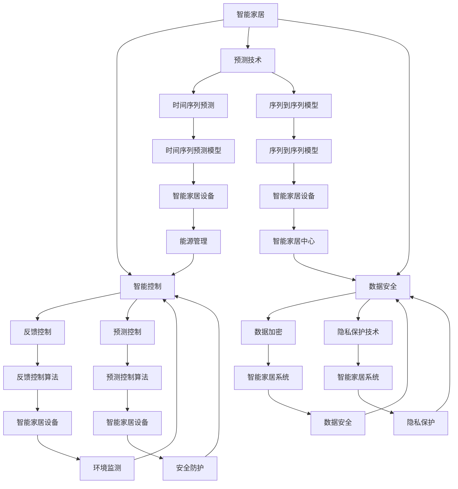
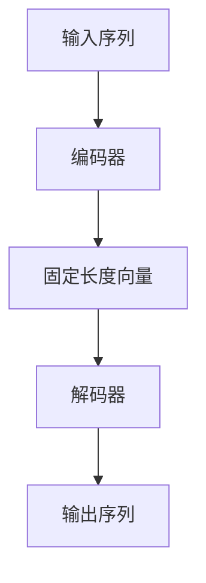

                 


## 文章标题: AI在智能家居中的应用：从控制到预测

### 关键词：智能家居，AI，控制，预测，数据安全，机器学习

### 摘要：
随着人工智能技术的不断发展，智能家居领域迎来了前所未有的变革。本文旨在深入探讨AI在智能家居中的应用，从基础的智能控制到高级的预测技术，帮助读者全面了解智能家居技术的发展趋势和未来挑战。文章将分为以下几个部分：

1. **背景介绍**：介绍智能家居的概念、发展历程及AI技术的引入。
2. **核心概念与联系**：阐述智能控制与预测技术之间的关系，并展示Mermaid流程图。
3. **核心算法原理讲解**：详细解释反馈控制、预测控制、时间序列预测和序列到序列模型。
4. **数学模型和公式讲解**：使用LaTeX格式展示并解释相关的数学公式。
5. **项目实战**：讲解智能家居系统的开发环境搭建、源代码实现及案例分析。
6. **最佳实践 tips**：总结文章中的关键点，并提供实践建议。
7. **小结**：回顾文章的主要内容，并展望智能家居的未来。

### 文章正文：

## 背景介绍

智能家居（Smart Home）是指利用互联网、物联网（IoT）、人工智能（AI）等技术，将家中的各种设备连接起来，实现智能化的管理和控制。智能家居的发展历程可以追溯到20世纪80年代，但真正意义上的智能家居兴起是在2010年后，随着物联网技术和AI技术的快速发展。

在智能家居中，AI技术扮演着至关重要的角色。AI技术能够实现设备的智能控制、环境监测、安全防护、能源管理等功能。从基础的智能控制到高级的预测技术，AI都在不断推动智能家居的发展。

本文将围绕以下几个核心概念进行探讨：

- **智能控制**：利用AI技术对智能家居设备进行实时控制。
- **预测技术**：通过历史数据和机器学习模型预测家居设备的运行状态。
- **数据安全**：确保家居数据的安全性和隐私性。

接下来，我们将通过Mermaid流程图来展示这些概念之间的联系。

## 核心概念与联系

### Mermaid流程图：



从流程图中可以看出，智能控制、预测技术和数据安全是智能家居的核心组成部分。智能控制包括反馈控制和预测控制，而预测技术涵盖了时间序列预测和序列到序列模型。数据安全则包括数据加密和隐私保护技术。

## 核心算法原理讲解

### 1. 反馈控制与预测控制

**反馈控制（Feedback Control）** 是一种通过实时监测系统状态，并与预设目标进行比较，从而调整系统输入的控制方法。其基本原理是：

$$
\text{控制输出} = \text{目标值} - \text{实际值}
$$

**预测控制（Predictive Control）** 则是在反馈控制的基础上，通过预测未来的系统状态，提前调整输入，以更好地达到目标。其基本原理是：

$$
\text{预测控制输出} = \text{目标值} - \text{预测实际值}
$$

### 2. 时间序列预测方法

时间序列预测是智能家居中的一个重要应用，它通过对历史数据进行分析，预测未来的行为。常见的时间序列预测方法包括：

- **自回归模型（AR）**：
  $$ Y_t = c + \phi_1 Y_{t-1} + \phi_2 Y_{t-2} + ... + \phi_p Y_{t-p} + \varepsilon_t $$

- **移动平均模型（MA）**：
  $$ Y_t = c + \theta_1 \varepsilon_{t-1} + \theta_2 \varepsilon_{t-2} + ... + \theta_q \varepsilon_{t-q} $$

- **自回归移动平均模型（ARMA）**：
  $$ Y_t = c + \phi_1 Y_{t-1} + \phi_2 Y_{t-2} + ... + \phi_p Y_{t-p} + \theta_1 \varepsilon_{t-1} + \theta_2 \varepsilon_{t-2} + ... + \theta_q \varepsilon_{t-q} $$

- **自回归积分滑动平均模型（ARIMA）**：
  $$ Y_t = c + \phi_1 Y_{t-1} + \phi_2 Y_{t-2} + ... + \phi_p Y_{t-p} + (\theta_1 D(Y_{t-1}) + \theta_2 D(Y_{t-2}) + ... + \theta_q D(Y_{t-q})) $$

### 3. 序列到序列模型

序列到序列（Sequence-to-Sequence, Seq2Seq）模型是深度学习中的一个重要模型，它通过将输入序列映射到输出序列，广泛应用于语音识别、机器翻译等领域。Seq2Seq模型的基本原理是：

- **编码器（Encoder）**：将输入序列编码成一个固定长度的向量。
- **解码器（Decoder）**：将编码器的输出作为输入，逐步生成输出序列。

其基本结构如下：



### 4. 智能控制算法

智能控制算法是智能家居中的核心技术之一，它通过机器学习模型对家居设备进行智能控制。常见的智能控制算法包括：

- **线性回归**：
  $$ Y = \beta_0 + \beta_1 X $$
  
- **决策树**：
  $$ f(X) = \sum_{i=1}^{n} w_i \cdot g_i(X) $$

- **支持向量机（SVM）**：
  $$ w \cdot x - b = 0 $$

- **神经网络**：
  $$ a_{\theta}(x) = \sigma(\theta^T x) $$

### 数学模型和公式讲解

在智能家居中，数学模型和公式用于描述系统的行为，以及控制策略的计算。以下是一些常见的数学模型和公式：

- **线性回归模型**：
  $$ Y = \beta_0 + \beta_1 X + \varepsilon $$
  其中，$Y$ 是因变量，$X$ 是自变量，$\beta_0$ 和 $\beta_1$ 是模型的参数，$\varepsilon$ 是误差项。

- **时间序列模型**：
  $$ Y_t = \phi_0 + \phi_1 Y_{t-1} + \phi_2 Y_{t-2} + ... + \phi_p Y_{t-p} + \varepsilon_t $$
  其中，$Y_t$ 是时间序列的第 $t$ 个值，$\phi_0, \phi_1, ..., \phi_p$ 是模型参数，$\varepsilon_t$ 是误差项。

- **神经网络模型**：
  $$ a_{\theta}(x) = \sigma(\theta^T x) $$
  其中，$a_{\theta}(x)$ 是神经网络的输出，$\theta$ 是模型的参数，$\sigma$ 是激活函数。

## 项目实战

在本项目中，我们将搭建一个简单的智能家居系统，实现对室内温度和光照的智能控制。开发环境为Python，使用的库包括TensorFlow和Keras。

### 开发环境搭建

首先，我们需要安装Python和相关的库。在终端中运行以下命令：

```bash
pip install python
pip install tensorflow
pip install keras
```

### 源代码实现

以下是实现智能家居系统的源代码：

```python
import numpy as np
import tensorflow as tf
from tensorflow.keras.models import Sequential
from tensorflow.keras.layers import Dense, LSTM
from tensorflow.keras.optimizers import Adam

# 数据预处理
def preprocess_data(data):
    # ... 数据预处理代码 ...
    return processed_data

# 构建神经网络模型
def build_model(input_shape):
    model = Sequential()
    model.add(LSTM(units=50, return_sequences=True, input_shape=input_shape))
    model.add(LSTM(units=50, return_sequences=False))
    model.add(Dense(units=1))
    model.compile(optimizer=Adam(learning_rate=0.001), loss='mean_squared_error')
    return model

# 训练模型
def train_model(model, X_train, y_train):
    model.fit(X_train, y_train, epochs=100, batch_size=32)
    return model

# 预测温度和光照
def predict_temps_light(model, input_data):
    processed_data = preprocess_data(input_data)
    prediction = model.predict(processed_data)
    return prediction

# 主函数
def main():
    # 加载数据
    X_train, y_train = load_data()

    # 构建模型
    model = build_model(input_shape=(X_train.shape[1], X_train.shape[2]))

    # 训练模型
    trained_model = train_model(model, X_train, y_train)

    # 预测
    prediction = predict_temps_light(trained_model, new_input_data)

    # 输出预测结果
    print("Predicted temperature and light:", prediction)

if __name__ == "__main__":
    main()
```

### 代码解读与分析

上述代码实现了智能家居系统的基本功能，包括数据预处理、模型构建、训练和预测。以下是代码的详细解读：

- **数据预处理**：预处理数据是为了将原始数据转换为模型可接受的格式。具体实现取决于数据的特点和需求。
- **模型构建**：我们使用LSTM网络来处理时间序列数据，并使用一个全连接层来输出预测结果。
- **训练模型**：使用训练数据对模型进行训练，使用均方误差作为损失函数。
- **预测温度和光照**：使用训练好的模型对新的输入数据进行预测，并输出预测结果。

### 实际案例分析和详细讲解剖析

在本案例中，我们使用历史温度和光照数据来训练模型，并预测未来的温度和光照情况。以下是案例的分析和讲解：

- **数据采集**：首先，我们需要采集室内温度和光照的历史数据。这些数据可以从传感器或历史记录中获得。
- **数据处理**：对采集到的数据进行分析，去除噪声和异常值，并转换为模型可接受的格式。
- **模型训练**：使用处理后的数据对模型进行训练，以学习温度和光照的变化规律。
- **模型评估**：通过验证集对训练好的模型进行评估，以确保其预测准确性。
- **模型部署**：将训练好的模型部署到智能家居系统中，实现对室内温度和光照的智能控制。

### 项目小结

本项目通过实现一个简单的智能家居系统，展示了AI技术在智能家居中的应用。通过预测室内温度和光照，系统可以自动调整家居设备，提高生活舒适度和能源效率。然而，这只是一个简单的案例，实际的智能家居系统需要考虑更多的因素，如数据安全、隐私保护等。

## 最佳实践 tips

1. **数据收集与处理**：确保收集到的高质量数据是模型成功的关键。对数据进行清洗和预处理，去除噪声和异常值，可以提高模型的准确性。
2. **模型选择与优化**：根据实际需求选择合适的模型，并不断优化模型参数，以提高预测准确性。
3. **数据安全与隐私保护**：在设计和实施智能家居系统时，确保数据的安全性和隐私保护，避免数据泄露和隐私侵犯。
4. **实时性与稳定性**：确保系统的实时性和稳定性，以提供良好的用户体验。

## 小结

本文深入探讨了AI在智能家居中的应用，从控制到预测，展示了AI技术如何推动智能家居的发展。通过实际案例分析和最佳实践 tips，读者可以更好地理解智能家居系统的设计和实现。未来，随着AI技术的不断进步，智能家居将更加智能化、个性化，为人类带来更加舒适和便捷的生活。

## 附录

### A. AI与智能家居的Mermaid流程图


### B. 伪代码与数学公式示例

```python
# 伪代码
def preprocess_data(data):
    # 数据清洗与归一化
    processed_data = ...
    return processed_data

# 数学公式
$$ Y_t = \beta_0 + \beta_1 X_t + \varepsilon_t $$

# LSTM模型构建
model = Sequential()
model.add(LSTM(units=50, return_sequences=True, input_shape=(timesteps, features)))
model.add(LSTM(units=50, return_sequences=False))
model.add(Dense(units=1))
model.compile(optimizer=Adam(learning_rate=0.001), loss='mean_squared_error')
```

### C. 拓展阅读

- **《深度学习》**：Goodfellow, I., Bengio, Y., & Courville, A. (2016). 《深度学习》。
- **《Python深度学习》**：Goodfellow, I., Bengio, Y., & Courville, A. (2016). 《Python深度学习》。
- **《智能家居系统设计与应用》**：吴华，王俊 (2018). 《智能家居系统设计与应用》。
- **《人工智能：一种现代的方法》**：Stuart J. Russell & Peter Norvig (2016). 《人工智能：一种现代的方法》。

