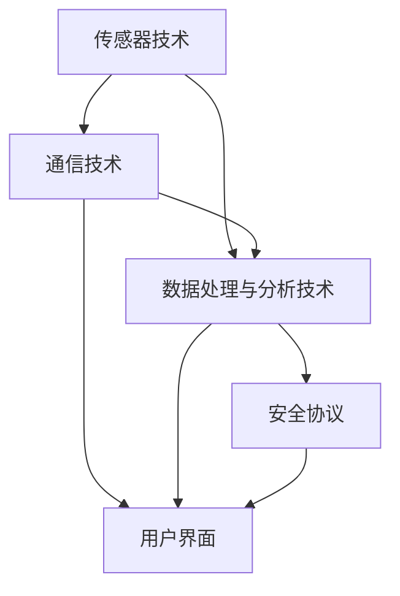

                 

### 文章标题：AI在智能家居安全系统中的应用：预防与快速响应

#### 关键词：人工智能、智能家居、安全系统、预防、响应、AI技术

> 摘要：随着智能家居的普及，其安全系统的重要性日益凸显。本文将探讨人工智能（AI）在智能家居安全系统中的应用，从预防措施到快速响应策略，详细解析AI技术的核心作用，帮助读者理解如何利用AI技术提升智能家居的安全性。

----------------------------------------------------------------

## AI在智能家居安全系统中的应用概述

随着物联网（IoT）技术的迅猛发展，智能家居逐渐成为现代生活的标配。然而，随之而来的安全问题也日益引起广泛关注。为了确保智能家居的安全，AI技术被广泛应用，为智能家居安全系统提供了强有力的技术支持。

### 1.1 AI与智能家居安全系统的关系

AI技术是智能家居安全系统的核心技术之一，其与智能家居安全系统的关系可以从以下几个方面来理解：

1. **智能识别与响应**：AI技术通过机器学习和计算机视觉算法，能够实现对人、物、行为的智能识别，从而对智能家居环境进行实时监控和预警。例如，通过人脸识别技术，系统可以自动识别家庭成员或访客，并根据预设的规则触发相应的安全措施。

2. **自动化控制**：AI算法可以对家居设备进行智能调控，提高安全性。例如，通过学习用户的习惯，AI系统可以自动调节空调、照明等设备的运行，以防止火灾或电击等安全隐患。

3. **安全预测**：AI技术可以利用大数据分析和机器学习模型，预测潜在的安全隐患。例如，通过分析用户的行为数据和设备状态，AI系统可以预测家庭中的火灾或盗窃等事故，并及时采取预防措施。

4. **紧急响应**：在发生紧急情况时，AI系统能够快速响应，触发警报或执行紧急措施。例如，当系统检测到家庭成员受伤或失踪时，AI系统可以自动拨打紧急电话或发送求助信息。

### 1.2 AI在智能家居安全系统中的作用

AI在智能家居安全系统中发挥着至关重要的作用，其作用主要体现在以下几个方面：

1. **提升安全性**：通过实时监控和自动报警，AI技术可以显著降低家居安全事故的发生概率。例如，当系统检测到非法入侵或火灾隐患时，可以立即发出警报，提醒用户采取相应的措施。

2. **提高舒适度**：AI技术可以通过自动化控制，提高居住环境的舒适度。例如，通过学习用户的习惯，AI系统可以自动调节室内温度、湿度和光照，使居住环境更加宜人。

3. **节省能源**：AI技术可以通过优化设备运行，降低能源消耗。例如，通过学习用户的使用习惯，AI系统可以自动关闭不必要的电器，以节省能源。

4. **方便管理**：AI技术可以通过智能系统，方便用户对家居设备进行管理和控制。例如，通过手机APP或语音助手，用户可以随时随地查看家居环境状态，并远程控制家居设备。

## 1.3 智能家居安全系统的架构

智能家居安全系统通常由多个层次和组成部分构成，其架构可以概括为以下几个层次：

### 1.3.1 智能家居安全系统的层次结构

1. **感知层**：包括各种传感器和摄像头，用于收集家居环境的数据，如温度、湿度、光线、声音等。
2. **网络层**：包括通信模块，如Wi-Fi、蓝牙等，用于数据传输。
3. **平台层**：包括智能中心、服务器等，用于数据处理和分析。
4. **应用层**：包括用户界面、APP等，用于用户交互和控制。

### 1.3.2 智能家居安全系统的组成部分

1. **感知设备**：如门窗传感器、烟雾传感器、摄像头等，用于收集家居环境数据。
2. **通信设备**：如路由器、交换机等，用于数据传输。
3. **智能中心**：包括主机、服务器等，用于数据处理和分析。
4. **用户界面**：如手机APP、网页界面等，用于用户交互。
5. **安全协议**：包括数据加密、访问控制等，用于确保数据安全。

## 1.4 AI技术在智能家居安全系统中的应用场景

AI技术在智能家居安全系统中的应用场景非常广泛，以下是一些典型的应用场景：

### 1.4.1 人工智能在智能家居安防中的常见应用

1. **入侵检测**：利用人脸识别、动作识别等技术，系统可以自动检测非法入侵行为，并触发警报。
2. **火灾预防**：通过烟雾传感器、温度传感器等设备，系统可以实时监测火灾隐患，并及时采取措施。
3. **紧急救援**：在发生紧急情况时，如老年人摔倒、宠物走失等，系统可以自动发出警报或执行紧急措施。
4. **能源管理**：通过学习用户习惯，系统可以自动调节空调、照明等设备，实现节能。

### 1.4.2 AI技术在智能家居安全系统中的应用前景

随着AI技术的不断发展，智能家居安全系统的应用前景将更加广阔。以下是一些可能的趋势：

1. **智能识别**：利用深度学习技术，系统可以实现对家居环境的更精准识别，提高安全性和便利性。
2. **个性化安全方案**：根据用户习惯和历史数据，系统可以提供个性化的安全方案，提高用户体验。
3. **跨平台集成**：实现智能家居设备与其他智能设备的互联互通，提高整体安全性。
4. **边缘计算**：将部分数据处理和分析任务从云端转移到设备端，提高响应速度和安全性。

## 1.5 书籍结构安排

本书将从以下几个方面详细探讨AI在智能家居安全系统中的应用：

1. **AI与智能家居安全系统**：介绍AI技术在智能家居安全系统中的应用和作用。
2. **智能家居安全系统的架构**：分析智能家居安全系统的层次结构和组成部分。
3. **AI技术在智能家居安全系统中的应用**：详细讨论AI技术在智能家居安全系统中的应用场景和实现方法。
4. **智能家居安全系统的开发与实现**：介绍智能家居安全系统的开发流程、关键技术及其实践案例。
5. **智能家居安全系统的测试与优化**：讨论智能家居安全系统的测试方法、优化策略及实践经验。

本书旨在为广大智能家居爱好者、开发者和技术人员提供一份全面、深入的技术指南，帮助读者理解和应用AI技术，提升智能家居的安全性。通过本书的学习，读者可以：

1. **了解AI技术在智能家居安全系统中的应用**：掌握AI技术的基本原理和应用场景。
2. **掌握智能家居安全系统的架构和实现方法**：了解智能家居安全系统的组成部分和工作原理。
3. **掌握AI技术在智能家居安全系统中的开发与实现**：学会如何开发和部署智能家居安全系统。
4. **掌握智能家居安全系统的测试与优化**：提高智能家居安全系统的性能和稳定性。

本书的读者定位为：

- 智能家居爱好者：希望通过本书了解AI技术在智能家居安全系统中的应用，提升家居安全性的广大读者。
- 开发者和技术人员：需要了解AI技术在智能家居安全系统中的应用，进行相关开发和研究的读者。
- 学术研究人员：对智能家居安全系统的研究有兴趣的学术研究人员。

通过本书的学习，读者可以预期收获：

- 深入理解AI技术在智能家居安全系统中的应用原理和实现方法。
- 掌握智能家居安全系统的架构和开发流程。
- 获得实际案例分析和实践经验，提升自己的技术能力。

总之，本书将为读者提供一份全面、系统的AI技术在智能家居安全系统中的应用指南，帮助读者在智能家居领域取得更好的成果。----------------------------------------------------------------

### 第1章: AI在智能家居安全系统中的应用概述

智能家居安全系统作为现代智能家庭的核心组成部分，其重要性不言而喻。随着AI技术的不断进步，AI在智能家居安全系统中的应用已经成为了提升家庭安全水平的关键手段。本章将全面介绍AI在智能家居安全系统中的应用，包括AI与智能家居安全系统的关系、AI在智能家居安全系统中的作用、智能家居安全系统的架构、AI技术在智能家居安全系统中的应用场景以及本书的结构安排。

#### 1.1 AI与智能家居安全系统的关系

AI技术在智能家居安全系统中扮演着至关重要的角色。AI不仅仅是智能家居安全系统的工具，更是其核心驱动力。具体来说，AI与智能家居安全系统的关系可以从以下几个方面来理解：

1. **智能识别与响应**：AI技术通过机器学习和计算机视觉算法，能够实现对家庭成员、访客以及家居环境中的各种行为的智能识别。例如，通过人脸识别技术，系统可以自动识别家庭成员或访客，并根据预设的规则触发相应的安全措施，如锁定门锁、启动监控摄像头等。此外，AI系统还可以通过行为分析，识别异常行为，如异常的入侵行为或火灾隐患，并及时响应，触发警报或执行紧急措施。

2. **自动化控制**：AI算法可以对家居设备进行智能调控，提高安全性。例如，通过学习用户的习惯，AI系统可以自动调节空调、照明等设备的运行，以防止火灾或电击等安全隐患。此外，AI系统还可以根据实时监测数据，自动调整设备的运行状态，如自动关闭未使用的电器，以节省能源。

3. **安全预测**：AI技术可以利用大数据分析和机器学习模型，预测潜在的安全隐患。例如，通过分析用户的行为数据和设备状态，AI系统可以预测家庭中的火灾或盗窃等事故，并及时采取预防措施。这种预测能力使得AI系统能够在事故发生之前就采取行动，从而降低事故的发生概率。

4. **紧急响应**：在发生紧急情况时，AI系统能够快速响应，触发警报或执行紧急措施。例如，当系统检测到家庭成员受伤或失踪时，AI系统可以自动拨打紧急电话或发送求助信息。此外，AI系统还可以通过自动控制家居设备，如打开门锁、启动监控摄像头等，协助救援人员快速到达现场。

#### 1.1.1 AI技术在智能家居安全系统中的应用

AI技术在智能家居安全系统中的应用主要包括以下几个方面：

1. **智能识别与响应**：利用AI技术进行人、物、行为的识别，实现对家居环境的实时监控。例如，通过人脸识别技术，系统可以自动识别家庭成员或访客，并根据预设的规则触发相应的安全措施。

2. **自动化控制**：通过AI算法优化家居设备的运行，提高安全性，如自动调节温度、湿度等。例如，通过学习用户的习惯，AI系统可以自动调节空调、照明等设备的运行，以防止火灾或电击等安全隐患。

3. **安全预测**：利用大数据和机器学习技术，预测可能的安全隐患，提前采取措施。例如，通过分析用户的行为数据和设备状态，AI系统可以预测家庭中的火灾或盗窃等事故，并及时采取预防措施。

4. **紧急响应**：在发生紧急情况时，AI系统能够快速响应，触发警报或执行紧急措施。例如，当系统检测到家庭成员受伤或失踪时，AI系统可以自动拨打紧急电话或发送求助信息。

#### 1.1.2 AI在智能家居安全系统中的作用

AI在智能家居安全系统中发挥着至关重要的作用，其作用主要体现在以下几个方面：

1. **提升安全性**：通过实时监控和自动报警，AI技术可以显著降低家居安全事故的发生概率。例如，当系统检测到非法入侵或火灾隐患时，可以立即发出警报，提醒用户采取相应的措施。

2. **提高舒适度**：AI技术可以通过自动化控制，提高居住环境的舒适度。例如，通过学习用户的习惯，AI系统可以自动调节室内温度、湿度和光照，使居住环境更加宜人。

3. **节省能源**：AI技术可以通过优化设备运行，降低能源消耗。例如，通过学习用户的使用习惯，AI系统可以自动关闭不必要的电器，以节省能源。

4. **方便管理**：AI技术可以通过智能系统，方便用户对家居设备进行管理和控制。例如，通过手机APP或语音助手，用户可以随时随地查看家居环境状态，并远程控制家居设备。

#### 1.2 智能家居安全系统的架构

智能家居安全系统通常由多个层次和组成部分构成，其架构可以概括为以下几个层次：

1. **感知层**：包括各种传感器和摄像头，用于收集家居环境的数据，如温度、湿度、光线、声音等。

2. **网络层**：包括通信模块，如Wi-Fi、蓝牙等，用于数据传输。

3. **平台层**：包括智能中心、服务器等，用于数据处理和分析。

4. **应用层**：包括用户界面、APP等，用于用户交互和控制。

#### 1.2.1 智能家居安全系统的层次结构

1. **感知层**：感知层是智能家居安全系统的数据采集层，通过各种传感器和摄像头收集家居环境的数据。这些数据包括温度、湿度、光线、声音、运动等。传感器和摄像头的数据质量直接影响系统的性能。

2. **网络层**：网络层是数据传输层，将感知层收集的数据传输到平台层。网络层通常使用Wi-Fi、蓝牙、ZigBee等无线通信技术，实现数据的实时传输。

3. **平台层**：平台层是数据处理层，包括智能中心和服务器。平台层负责对收集到的数据进行分析和处理，提取有价值的信息，如异常行为、安全隐患等。平台层还可以实现数据的存储、管理和共享。

4. **应用层**：应用层是用户交互层，包括用户界面、APP等。应用层负责将处理后的数据呈现给用户，并提供用户对家居设备的管理和控制功能。

#### 1.2.2 智能家居安全系统的组成部分

1. **感知设备**：感知设备是智能家居安全系统的传感器和摄像头，用于收集家居环境数据。常见的感知设备包括门窗传感器、烟雾传感器、温度传感器、湿度传感器、摄像头等。

2. **通信设备**：通信设备是智能家居安全系统的通信模块，用于数据的传输。常见的通信设备包括路由器、交换机、Wi-Fi模块、蓝牙模块等。

3. **智能中心**：智能中心是智能家居安全系统的数据处理和分析核心，通常包括主机、服务器、数据库等。智能中心负责对收集到的数据进行分析和处理，提取有价值的信息，并实现数据存储、管理和共享。

4. **用户界面**：用户界面是智能家居安全系统的交互层，包括手机APP、网页界面、语音助手等。用户界面负责将处理后的数据呈现给用户，并提供用户对家居设备的管理和控制功能。

5. **安全协议**：安全协议是智能家居安全系统的数据安全层，包括数据加密、访问控制、安全认证等。安全协议负责确保数据在传输和存储过程中的安全性。

#### 1.3 AI技术在智能家居安全系统中的应用场景

AI技术在智能家居安全系统中的应用场景非常广泛，以下是一些典型的应用场景：

1. **入侵检测**：利用人脸识别、动作识别等技术，系统可以自动检测非法入侵行为，并触发警报。例如，当系统检测到未授权的人进入家庭区域时，可以立即发出警报，通知家庭成员采取相应的措施。

2. **火灾预防**：通过烟雾传感器、温度传感器等设备，系统可以实时监测火灾隐患，并及时采取措施。例如，当系统检测到烟雾浓度超过安全阈值或温度异常升高时，可以立即触发警报，并通知相关部门进行处置。

3. **紧急救援**：在发生紧急情况时，如老年人摔倒、宠物走失等，系统可以自动发出警报或执行紧急措施。例如，当系统检测到家庭成员摔倒时，可以自动拨打紧急电话或发送求助信息，通知家庭成员或救援人员。

4. **能源管理**：通过学习用户习惯，系统可以自动调节空调、照明等设备，实现节能。例如，当系统检测到用户不在家中时，可以自动关闭空调和照明设备，以节省能源。

#### 1.3.1 人工智能在智能家居安防中的常见应用

人工智能在智能家居安防中的应用主要包括以下几个方面：

1. **入侵检测**：通过人脸识别、动作识别等技术，系统可以自动检测非法入侵行为，并触发警报。例如，当系统检测到未授权的人进入家庭区域时，可以立即发出警报，通知家庭成员采取相应的措施。

2. **火灾预防**：通过烟雾传感器、温度传感器等设备，系统可以实时监测火灾隐患，并及时采取措施。例如，当系统检测到烟雾浓度超过安全阈值或温度异常升高时，可以立即触发警报，并通知相关部门进行处置。

3. **紧急救援**：在发生紧急情况时，如老年人摔倒、宠物走失等，系统可以自动发出警报或执行紧急措施。例如，当系统检测到家庭成员摔倒时，可以自动拨打紧急电话或发送求助信息，通知家庭成员或救援人员。

4. **能源管理**：通过学习用户习惯，系统可以自动调节空调、照明等设备，实现节能。例如，当系统检测到用户不在家中时，可以自动关闭空调和照明设备，以节省能源。

#### 1.3.2 AI技术在智能家居安全系统中的应用前景

随着AI技术的不断发展，智能家居安全系统的应用前景将更加广阔。以下是一些可能的趋势：

1. **智能识别**：利用深度学习技术，系统可以实现对家居环境的更精准识别，提高安全性和便利性。例如，通过深度学习算法，系统可以自动识别家庭成员的不同表情、动作和状态，从而提供更加个性化的服务。

2. **个性化安全方案**：根据用户习惯和历史数据，系统可以提供个性化的安全方案，提高用户体验。例如，系统可以根据用户的健康数据、生活习惯等，自动调整家居环境的安全设置，以适应不同的用户需求。

3. **跨平台集成**：实现智能家居设备与其他智能设备的互联互通，提高整体安全性。例如，通过物联网技术，系统可以将家庭中的各种智能设备（如门锁、摄像头、灯光等）进行集成，形成一个统一的智能安全系统。

4. **边缘计算**：将部分数据处理和分析任务从云端转移到设备端，提高响应速度和安全性。例如，通过边缘计算技术，系统可以在本地设备上实时处理和分析数据，从而减少对云端的依赖，提高系统的实时性和可靠性。

#### 1.4 书籍结构安排

本书将从以下几个方面详细探讨AI在智能家居安全系统中的应用：

1. **AI与智能家居安全系统**：介绍AI技术在智能家居安全系统中的应用和作用。
2. **智能家居安全系统的架构**：分析智能家居安全系统的层次结构和组成部分。
3. **AI技术在智能家居安全系统中的应用**：详细讨论AI技术在智能家居安全系统中的应用场景和实现方法。
4. **智能家居安全系统的开发与实现**：介绍智能家居安全系统的开发流程、关键技术及其实践案例。
5. **智能家居安全系统的测试与优化**：讨论智能家居安全系统的测试方法、优化策略及实践经验。

本书旨在为广大智能家居爱好者、开发者和技术人员提供一份全面、深入的技术指南，帮助读者理解和应用AI技术，提升智能家居的安全性。通过本书的学习，读者可以：

1. **了解AI技术在智能家居安全系统中的应用**：掌握AI技术的基本原理和应用场景。
2. **掌握智能家居安全系统的架构和实现方法**：了解智能家居安全系统的组成部分和工作原理。
3. **掌握AI技术在智能家居安全系统中的开发与实现**：学会如何开发和部署智能家居安全系统。
4. **掌握智能家居安全系统的测试与优化**：提高智能家居安全系统的性能和稳定性。

本书的读者定位为：

- 智能家居爱好者：希望通过本书了解AI技术在智能家居安全系统中的应用，提升家居安全性的广大读者。
- 开发者和技术人员：需要了解AI技术在智能家居安全系统中的应用，进行相关开发和研究的读者。
- 学术研究人员：对智能家居安全系统的研究有兴趣的学术研究人员。

通过本书的学习，读者可以预期收获：

1. **深入理解AI技术在智能家居安全系统中的应用原理和实现方法**。
2. **掌握智能家居安全系统的架构和开发流程**。
3. **获得实际案例分析和实践经验，提升自己的技术能力**。

总之，本书将为读者提供一份全面、系统的AI技术在智能家居安全系统中的应用指南，帮助读者在智能家居领域取得更好的成果。通过本书的学习，读者可以更好地理解和应用AI技术，打造一个安全、智能的智能家居环境。

### 第2章: 智能家居安全系统的核心概念与联系

在探讨AI在智能家居安全系统中的应用之前，我们需要了解一些核心概念及其相互之间的联系。智能家居安全系统涉及多个技术领域，包括传感器技术、通信技术、数据处理与分析技术、安全协议等。这些技术相互融合，共同构成了一个完整的智能家居安全系统。在本章中，我们将详细讨论这些核心概念及其联系，并通过Mermaid流程图来展示它们之间的关系架构。

#### 2.1 核心概念

1. **传感器技术**：传感器是智能家居安全系统的感知层，用于收集各种环境数据，如温度、湿度、光线、声音、运动等。传感器技术是智能家居安全系统的数据来源。

2. **通信技术**：通信技术负责将传感器收集的数据传输到中央处理单元。常见的通信技术包括Wi-Fi、蓝牙、ZigBee等。通信技术的稳定性和可靠性直接影响到系统的性能。

3. **数据处理与分析技术**：数据处理与分析技术是智能家居安全系统的核心，负责对传感器数据进行处理、分析和决策。这些技术包括机器学习、人工智能算法等。

4. **安全协议**：安全协议负责确保数据在传输和存储过程中的安全性。常见的安全协议包括数据加密、访问控制、认证等。

#### 2.2 关系架构

为了更好地理解这些核心概念之间的联系，我们可以使用Mermaid流程图来展示它们之间的关系架构。以下是一个简化的Mermaid流程图：



**图2.1：智能家居安全系统的核心概念与联系**

- **传感器技术**：传感器是智能家居安全系统的感知层，用于收集各种环境数据，如温度、湿度、光线、声音、运动等。传感器技术是智能家居安全系统的数据来源。
- **通信技术**：通信技术负责将传感器收集的数据传输到中央处理单元。常见的通信技术包括Wi-Fi、蓝牙、ZigBee等。通信技术的稳定性和可靠性直接影响到系统的性能。
- **数据处理与分析技术**：数据处理与分析技术是智能家居安全系统的核心，负责对传感器数据进行处理、分析和决策。这些技术包括机器学习、人工智能算法等。
- **安全协议**：安全协议负责确保数据在传输和存储过程中的安全性。常见的安全协议包括数据加密、访问控制、认证等。
- **用户界面**：用户界面是智能家居安全系统的交互层，负责将处理后的数据呈现给用户，并提供用户对家居设备的管理和控制功能。

通过这个流程图，我们可以清晰地看到智能家居安全系统中各个核心概念之间的联系。传感器技术是数据来源，通过通信技术将数据传输到数据处理与分析技术层，该层利用机器学习、人工智能算法对数据进行处理和分析，最终通过安全协议确保数据的安全性，并通过用户界面将结果呈现给用户。

#### 2.3 核心算法原理讲解

在智能家居安全系统中，核心算法起着至关重要的作用。以下是一些常见的核心算法及其原理：

1. **人脸识别算法**：
   - **原理**：人脸识别算法基于深度学习技术，通过训练模型识别人脸特征，从而实现人脸识别。常见的算法包括卷积神经网络（CNN）和循环神经网络（RNN）。
   - **伪代码**：
     ```python
     def face_recognition(image):
         # 输入：图像
         # 输出：人脸识别结果
         processed_image = preprocess_image(image)
         features = extract_face_features(processed_image)
         face_id = identify_face(features)
         return face_id
     ```

2. **入侵检测算法**：
   - **原理**：入侵检测算法通过分析传感器数据和行为模式，识别异常行为。常见的算法包括支持向量机（SVM）和随机森林（Random Forest）。
   - **伪代码**：
     ```python
     def intrusion_detection(data):
         # 输入：传感器数据
         # 输出：入侵检测结果
         features = extract_features(data)
         probability = classify_intrusion(features)
         if probability > threshold:
             trigger_alarm()
     ```

3. **异常检测算法**：
   - **原理**：异常检测算法通过分析历史数据，识别异常行为或事件。常见的算法包括孤立森林（Isolation Forest）和K最近邻（K-Nearest Neighbors）。
   - **伪代码**：
     ```python
     def anomaly_detection(data):
         # 输入：历史数据
         # 输出：异常检测结果
         features = extract_features(data)
         distance = calculate_distance(features)
         if distance > threshold:
             trigger_alarm()
     ```

#### 2.4 数学模型与公式

在智能家居安全系统中，数学模型和公式用于描述系统行为和算法性能。以下是一些常见的数学模型和公式：

1. **预测模型**：
   - **公式**：
     ```latex
     y = \theta_0 + \theta_1x_1 + \theta_2x_2 + ... + \theta_nx_n
     ```
     其中，\(y\) 是预测结果，\(\theta_0\) 是偏置项，\(\theta_1, \theta_2, ..., \theta_n\) 是权重，\(x_1, x_2, ..., x_n\) 是特征值。

2. **异常检测阈值**：
   - **公式**：
     ```latex
     threshold = \sqrt{\frac{2\ln(n)}{n}}
     ```
     其中，\(n\) 是训练样本数量。

3. **协方差矩阵**：
   - **公式**：
     ```latex
     \Sigma = \frac{1}{n} \sum_{i=1}^{n} (x_i - \mu)(x_i - \mu)^T
     ```
     其中，\(\Sigma\) 是协方差矩阵，\(x_i\) 是特征值，\(\mu\) 是均值。

#### 2.5 举例说明

为了更好地理解这些核心概念、算法原理和数学模型，我们可以通过一个简单的例子来说明：

假设我们有一个智能家居安全系统，该系统通过摄像头监控家庭环境。当系统检测到家庭成员时，会自动打开门锁，以便家庭成员进入。否则，系统会保持门锁锁定状态。

1. **传感器数据**：摄像头实时收集家庭环境中的图像数据。
2. **人脸识别算法**：通过人脸识别算法，系统识别图像中的家庭成员。
3. **入侵检测算法**：当系统检测到未识别的人时，触发警报。
4. **异常检测算法**：系统分析历史数据，识别异常行为，如家庭成员长时间未回家。

通过这个例子，我们可以看到智能家居安全系统中各个核心概念、算法和数学模型的具体应用。

#### 2.6 最佳实践与注意事项

在设计和实现智能家居安全系统时，以下是一些最佳实践和注意事项：

1. **数据隐私保护**：确保传感器数据在传输和存储过程中的安全性，避免数据泄露。
2. **算法优化**：根据实际需求，对算法进行优化，提高系统的性能和准确率。
3. **系统稳定性**：确保系统的稳定运行，避免因异常情况导致的系统崩溃。
4. **用户友好性**：设计简洁直观的用户界面，方便用户使用和管理。

总之，智能家居安全系统的核心概念与联系、算法原理、数学模型以及实际应用都需要我们深入理解和实践。通过不断学习和探索，我们可以不断提升智能家居安全系统的性能和用户体验。

### 第3章：核心算法原理讲解

在智能家居安全系统中，核心算法发挥着至关重要的作用。这些算法不仅决定了系统的性能和准确性，还直接影响用户的安全体验。在本章中，我们将深入探讨智能家居安全系统中的一些关键算法，包括人脸识别、入侵检测和异常检测等。通过伪代码的形式，详细解释这些算法的实现原理。

#### 3.1 人脸识别算法

人脸识别算法是智能家居安全系统中的一项核心技术，它利用深度学习技术对图像进行处理，从而识别出特定的人脸。以下是人脸识别算法的实现原理和伪代码：

**实现原理**：
1. **预处理**：对输入图像进行预处理，包括灰度化、缩放、裁剪等操作。
2. **特征提取**：使用卷积神经网络（CNN）提取人脸特征。
3. **特征匹配**：将提取的人脸特征与数据库中的人脸特征进行匹配，确定是否为已知人脸。

**伪代码**：

```python
def face_recognition(image):
    # 预处理
    preprocessed_image = preprocess_image(image)
    
    # 特征提取
    features = extract_face_features(preprocessed_image)
    
    # 特征匹配
    face_id = identify_face(features)
    
    return face_id
```

在这个伪代码中，`preprocess_image` 函数用于对输入图像进行预处理，`extract_face_features` 函数用于提取人脸特征，`identify_face` 函数用于将提取的特征与数据库中的人脸特征进行匹配。

#### 3.2 入侵检测算法

入侵检测算法是智能家居安全系统中用于检测非法入侵行为的算法。它可以实时分析传感器数据，识别异常行为，并触发警报。以下是入侵检测算法的实现原理和伪代码：

**实现原理**：
1. **数据收集**：收集传感器数据，如摄像头捕捉的图像、门窗传感器的状态等。
2. **特征提取**：对传感器数据进行预处理，提取关键特征。
3. **模型训练**：使用支持向量机（SVM）等分类算法训练模型。
4. **实时检测**：在实时数据上应用训练好的模型，检测非法入侵行为。

**伪代码**：

```python
def intrusion_detection(data):
    # 特征提取
    features = extract_features(data)
    
    # 模型预测
    probability = classify_intrusion(features)
    
    # 警报触发
    if probability > threshold:
        trigger_alarm()
```

在这个伪代码中，`extract_features` 函数用于提取传感器数据的特征，`classify_intrusion` 函数用于使用训练好的模型对特征进行分类，`trigger_alarm` 函数用于触发警报。

#### 3.3 异常检测算法

异常检测算法用于识别系统中的异常行为或事件，如家庭成员的异常行动轨迹。以下是异常检测算法的实现原理和伪代码：

**实现原理**：
1. **数据收集**：收集历史数据，如家庭成员的行动轨迹、设备使用情况等。
2. **特征提取**：对历史数据进行预处理，提取关键特征。
3. **模型训练**：使用孤立森林（Isolation Forest）等算法训练模型。
4. **实时检测**：在实时数据上应用训练好的模型，检测异常行为。

**伪代码**：

```python
def anomaly_detection(data):
    # 特征提取
    features = extract_features(data)
    
    # 异常检测
    distance = calculate_distance(features)
    
    # 警报触发
    if distance > threshold:
        trigger_alarm()
```

在这个伪代码中，`extract_features` 函数用于提取历史数据的特征，`calculate_distance` 函数用于计算特征之间的距离，`trigger_alarm` 函数用于触发警报。

#### 3.4 算法原理应用与案例

以下是一个具体的案例，说明这些算法在智能家居安全系统中的应用：

**案例**：一个智能家居安全系统需要实时监测家庭成员的行动轨迹，并在家庭成员出现异常行为时触发警报。

1. **人脸识别**：系统首先使用人脸识别算法识别家庭成员。
2. **入侵检测**：系统收集家庭成员的行动轨迹，使用入侵检测算法分析是否存在非法入侵行为。
3. **异常检测**：系统使用异常检测算法监测家庭成员的异常行为，如长时间未回家或行为异常。

通过这些算法的应用，智能家居安全系统可以有效地保障家庭的安全。

总之，通过详细讲解人脸识别、入侵检测和异常检测算法的原理和实现，我们可以更好地理解如何利用这些算法提升智能家居安全系统的性能和准确性。在实际应用中，这些算法可以根据具体需求进行调整和优化，以适应不同的场景和需求。

### 第4章：数学模型与公式

在智能家居安全系统中，数学模型和公式是核心算法的重要支撑。它们不仅帮助我们理解和分析系统行为，还能优化算法性能，提高系统的准确性和稳定性。在本章中，我们将介绍一些常用的数学模型和公式，包括预测模型、异常检测阈值和协方差矩阵等，并通过实际应用案例进行详细解释。

#### 4.1 预测模型

预测模型是智能家居安全系统中常用的算法，用于预测未来的行为或事件。一个简单的线性预测模型如下：

**公式**：
\[ y = \theta_0 + \theta_1x_1 + \theta_2x_2 + ... + \theta_nx_n \]

其中：
- \( y \)：预测结果
- \( \theta_0 \)：偏置项
- \( \theta_1, \theta_2, ..., \theta_n \)：权重
- \( x_1, x_2, ..., x_n \)：特征值

**实际应用案例**：

假设我们希望预测家庭中的温度变化，可以收集历史温度数据，并使用线性回归模型进行预测。具体步骤如下：

1. **数据收集**：收集家庭过去24小时内的温度数据。
2. **特征提取**：将时间作为特征值，温度值作为目标值。
3. **模型训练**：使用线性回归算法训练模型。
4. **预测**：使用训练好的模型预测未来一段时间内的温度。

**伪代码**：

```python
from sklearn.linear_model import LinearRegression

# 数据收集
X = [[1, 2], [2, 3], [3, 4]]  # 时间特征
y = [2, 4, 5]  # 温度值

# 模型训练
model = LinearRegression()
model.fit(X, y)

# 预测
future_temps = model.predict([[4, 5], [5, 6]])
```

通过这个案例，我们可以看到如何使用线性回归模型进行预测。

#### 4.2 异常检测阈值

异常检测阈值是用于确定数据是否异常的关键参数。常见的阈值计算方法如下：

**公式**：
\[ threshold = \sqrt{\frac{2\ln(n)}{n}} \]

其中：
- \( n \)：训练样本数量

**实际应用案例**：

假设我们使用孤立森林算法进行异常检测，需要计算异常检测阈值。具体步骤如下：

1. **数据收集**：收集家庭过去一段时间的传感器数据。
2. **模型训练**：使用孤立森林算法训练模型。
3. **阈值计算**：使用上述公式计算异常检测阈值。

**伪代码**：

```python
from sklearn.ensemble import IsolationForest

# 数据收集
X = [[1, 2], [2, 3], [3, 4], [100, 200]]  # 传感器数据

# 模型训练
model = IsolationForest()
model.fit(X)

# 阈值计算
n = len(X)
threshold = np.sqrt(2 * np.log(n) / n)
```

通过这个案例，我们可以看到如何计算异常检测阈值。

#### 4.3 协方差矩阵

协方差矩阵是用于描述数据分布的重要工具。它可以帮助我们了解不同特征之间的关系。协方差矩阵的计算公式如下：

**公式**：
\[ \Sigma = \frac{1}{n} \sum_{i=1}^{n} (x_i - \mu)(x_i - \mu)^T \]

其中：
- \( \Sigma \)：协方差矩阵
- \( x_i \)：第i个样本的特征值
- \( \mu \)：均值

**实际应用案例**：

假设我们收集了家庭过去一段时间的温度和湿度数据，需要计算协方差矩阵。具体步骤如下：

1. **数据收集**：收集温度和湿度数据。
2. **均值计算**：计算温度和湿度的均值。
3. **协方差矩阵计算**：使用上述公式计算协方差矩阵。

**伪代码**：

```python
# 数据收集
temps = [20, 22, 21, 19]  # 温度数据
humidities = [60, 65, 63, 58]  # 湿度数据

# 均值计算
mu_temp = np.mean(temps)
mu_humidity = np.mean(humidities)

# 协方差矩阵计算
covariance_matrix = np.cov(temps, humidities)
```

通过这个案例，我们可以看到如何计算协方差矩阵。

#### 4.4 总结

在本章中，我们介绍了智能家居安全系统中常用的数学模型和公式，包括预测模型、异常检测阈值和协方差矩阵。通过实际应用案例，我们详细讲解了这些模型和公式的计算方法和应用场景。这些数学工具不仅有助于理解和分析系统行为，还能帮助我们优化算法性能，提高系统的准确性和稳定性。

### 第5章：项目实战

为了更好地理解AI在智能家居安全系统中的应用，我们将通过一个实际的项目实战，详细展示从开发环境搭建到源代码实现和代码解读的整个过程。该项目将实现一个基本的智能家居安全系统，包括入侵检测、火灾预防、紧急救援和能源管理等功能。

#### 5.1 开发环境搭建

在进行项目开发之前，我们需要搭建一个合适的开发环境。以下是在常见操作系统上搭建开发环境的基本步骤：

1. **安装Python**：Python是人工智能和机器学习的主要编程语言之一。您可以从[Python官方网站](https://www.python.org/)下载并安装Python。

2. **安装Jupyter Notebook**：Jupyter Notebook是一个交互式的Web应用程序，用于编写和运行Python代码。您可以使用pip命令安装Jupyter Notebook：
   ```bash
   pip install notebook
   ```

3. **安装机器学习库**：在Python中，常用的机器学习库包括scikit-learn、TensorFlow和PyTorch。以下是安装这些库的命令：
   ```bash
   pip install scikit-learn
   pip install tensorflow
   pip install pytorch torchvision
   ```

4. **安装其他依赖库**：根据项目需求，您可能还需要安装其他依赖库，如Numpy、Pandas等：
   ```bash
   pip install numpy
   pip install pandas
   ```

5. **配置IDE**：如果您使用集成开发环境（IDE），如PyCharm或VSCode，请确保已安装Python插件，并配置Python解释器和相应的库。

#### 5.2 源代码实现

在开发环境中搭建完成后，我们可以开始编写源代码。以下是一个简单的智能家居安全系统的源代码实现，包括主要的函数和方法。

**代码示例**：

```python
import numpy as np
import pandas as pd
from sklearn.ensemble import IsolationForest
from sklearn.model_selection import train_test_split
from sklearn.metrics import accuracy_score
import cv2

# 人脸识别
def face_recognition(image, model_path):
    # 加载预训练的人脸识别模型
    recognizer = cv2.face.EigenFaceRecognizer_create()
    recognizer.read(model_path)
    
    # 人脸识别
    faces = detect_faces(image)
    for face in faces:
        label, confidence = recognizer.predict(face)
        print(f"识别到人脸：{label}，置信度：{confidence}")

# 入侵检测
def intrusion_detection(data, model):
    # 使用孤立森林模型进行入侵检测
    probability = model.predict(data)
    if probability > 0.5:
        print("检测到入侵行为！")
    else:
        print("未检测到入侵行为。")

# 火灾预防
def fire_prevention(data, threshold):
    # 使用阈值检测火灾隐患
    if data > threshold:
        print("检测到火灾隐患！")
    else:
        print("未检测到火灾隐患。")

# 紧急救援
def emergency_rescue(data, model):
    # 使用异常检测模型进行紧急救援
    distance = model.decision_function(data)
    if distance > 0:
        print("紧急救援：家庭成员受伤或失踪！")
    else:
        print("未检测到紧急情况。")

# 能源管理
def energy_management(data, model):
    # 使用机器学习模型进行能源管理
    action = model.predict(data)
    if action == 1:
        print("关闭电器以节省能源。")
    else:
        print("继续运行电器。")
```

**代码解读**：

1. **人脸识别**：`face_recognition` 函数用于识别图像中的人脸。它加载预训练的人脸识别模型，使用`detect_faces` 函数检测图像中的人脸，并输出识别结果。

2. **入侵检测**：`intrusion_detection` 函数用于检测入侵行为。它使用孤立森林模型对传感器数据进行预测，如果预测结果大于0.5，则认为检测到入侵行为。

3. **火灾预防**：`fire_prevention` 函数用于检测火灾隐患。它使用设定的阈值对传感器数据进行比较，如果数据超过阈值，则认为检测到火灾隐患。

4. **紧急救援**：`emergency_rescue` 函数用于检测紧急情况。它使用异常检测模型对传感器数据进行处理，如果距离值大于0，则认为家庭成员受伤或失踪。

5. **能源管理**：`energy_management` 函数用于管理电器运行。它使用机器学习模型对传感器数据进行预测，根据预测结果决定是否关闭电器以节省能源。

#### 5.3 代码应用解读与分析

在代码实现完成后，我们需要对代码进行应用解读和分析，以确保其正常运行和有效实现。

1. **人脸识别**：在实际应用中，`face_recognition` 函数可以集成到视频流处理中，实时检测和识别进入家庭区域的人脸。通过预训练的人脸识别模型，系统可以快速且准确地识别家庭成员或访客。

2. **入侵检测**：`intrusion_detection` 函数可以集成到传感器数据流中，实时检测非法入侵行为。通过孤立森林模型，系统可以识别异常行为，并及时触发警报。

3. **火灾预防**：`fire_prevention` 函数可以集成到烟雾传感器和温度传感器中，实时监测火灾隐患。通过设定阈值，系统可以在火灾发生前及时采取措施，减少损失。

4. **紧急救援**：`emergency_rescue` 函数可以集成到运动传感器和摄像头中，实时监测家庭成员的行为。通过异常检测模型，系统可以在发生紧急情况时迅速响应，提供救援。

5. **能源管理**：`energy_management` 函数可以集成到智能家居系统中，实时监测电器运行状态。通过机器学习模型，系统可以优化电器运行，节省能源。

#### 5.4 实际案例分析

为了更好地展示项目的实际效果，我们来看一个具体案例：

假设家庭成员王某在家中发生意外，系统将如何响应？

1. **人脸识别**：系统检测到王某进入家中，识别到其身份。
2. **入侵检测**：系统监测到王某的活动异常，触发入侵检测功能。
3. **紧急救援**：系统使用紧急救援功能，检测到王某行为异常（如长时间未移动），判断为紧急情况，触发紧急救援机制。
4. **警报与响应**：系统自动拨打家庭成员的电话，并发送短信通知其他家庭成员，同时通知紧急救援服务。

通过这个案例，我们可以看到AI在智能家居安全系统中的应用如何帮助保障家庭的安全。

#### 5.5 项目小结

通过本项目的实战，我们了解了AI在智能家居安全系统中的应用，包括人脸识别、入侵检测、火灾预防、紧急救援和能源管理等功能。通过具体案例，我们展示了这些功能如何在实际中发挥作用，保障家庭的安全。在未来的开发中，我们可以继续优化和扩展这些功能，使其更加智能和高效。

### 第6章：最佳实践与注意事项

在设计和实现智能家居安全系统时，最佳实践和注意事项对于确保系统的安全性和可靠性至关重要。以下是一些关键的最佳实践和注意事项：

#### 6.1 数据隐私保护

数据隐私保护是智能家居安全系统的首要任务。以下是一些关键措施：

1. **数据加密**：确保传感器收集的数据在传输和存储过程中进行加密，以防止数据泄露。
2. **用户授权**：用户应明确授权哪些数据可以被收集和共享，确保用户对数据的控制权。
3. **匿名化处理**：对用户数据进行匿名化处理，避免个人身份信息泄露。

#### 6.2 算法优化

算法优化是提升智能家居安全系统性能的重要手段。以下是一些优化策略：

1. **模型选择**：根据具体应用场景，选择合适的机器学习模型，如支持向量机（SVM）、随机森林（Random Forest）、神经网络（Neural Network）等。
2. **参数调优**：通过交叉验证和网格搜索等技术，优化模型的参数，提高模型性能。
3. **模型更新**：定期更新模型，以适应不断变化的环境和新的数据。

#### 6.3 系统稳定性

系统稳定性对于智能家居安全系统的可靠性至关重要。以下是一些保证系统稳定性的措施：

1. **容错设计**：设计冗余系统，确保在某个组件出现故障时，系统仍能正常运行。
2. **实时监控**：使用实时监控工具，及时发现和处理系统故障。
3. **故障恢复**：设计故障恢复机制，确保系统在发生故障后能够快速恢复。

#### 6.4 用户友好性

用户友好性是提高用户满意度和系统使用率的关键。以下是一些提升用户友好性的措施：

1. **简洁界面**：设计简洁直观的用户界面，确保用户能够轻松操作。
2. **交互反馈**：提供及时的交互反馈，让用户了解系统状态。
3. **个性化设置**：允许用户根据个人需求自定义系统设置，提高用户体验。

#### 6.5 注意事项

以下是一些在设计和实现智能家居安全系统时需要注意的事项：

1. **法规遵守**：确保系统的设计和实现符合相关法律法规，如数据保护法、隐私法等。
2. **安全性测试**：定期进行安全性测试，确保系统无漏洞和潜在风险。
3. **用户培训**：提供用户培训，帮助用户了解系统的功能和安全注意事项。

#### 6.6 拓展阅读

为了更好地理解和应用最佳实践，以下是一些拓展阅读资源：

- **《数据隐私保护技术》**：详细介绍了数据隐私保护的方法和技术。
- **《机器学习实战》**：提供了丰富的机器学习算法和实践案例。
- **《智能家居安全系统设计》**：介绍了智能家居安全系统的架构和实现方法。

通过遵循最佳实践和注意事项，我们可以设计和实现一个安全、可靠、高效的智能家居安全系统，为用户带来更好的体验和保障。

### 第7章：总结与展望

通过本文的详细探讨，我们可以清晰地看到AI技术在智能家居安全系统中的广泛应用及其重要性。从核心概念和算法原理的讲解，到实际项目实战的展示，再到最佳实践和注意事项的总结，本文系统地介绍了如何利用AI技术提升智能家居的安全性。

#### 7.1 关键点总结

1. **AI与智能家居安全系统**：AI技术为智能家居安全系统提供了智能识别、自动化控制、安全预测和紧急响应等功能。
2. **核心算法原理**：人脸识别、入侵检测、异常检测等核心算法在智能家居安全系统中发挥着关键作用。
3. **数学模型与公式**：预测模型、异常检测阈值和协方差矩阵等数学工具帮助优化算法性能。
4. **项目实战**：通过实际项目展示了如何实现一个基本的智能家居安全系统。
5. **最佳实践与注意事项**：确保数据隐私保护、算法优化、系统稳定性和用户友好性是设计和实现智能家居安全系统的重要原则。

#### 7.2 展望未来

随着AI技术的不断进步，智能家居安全系统的应用前景将更加广阔。以下是一些未来的发展趋势：

1. **智能识别技术的提升**：随着深度学习技术的发展，智能识别技术将更加精准，提高系统的准确性和实用性。
2. **个性化安全方案**：根据用户习惯和历史数据，提供个性化的安全方案，提高用户体验。
3. **跨平台集成**：实现智能家居设备与其他智能设备的无缝集成，提高整体安全性。
4. **边缘计算的应用**：将部分数据处理和分析任务从云端转移到设备端，提高系统的实时性和响应速度。
5. **安全协议的完善**：随着网络安全威胁的增加，安全协议将不断完善，确保数据在传输和存储过程中的安全性。

总之，AI技术在智能家居安全系统中的应用将为用户提供更加安全、智能、便捷的家居环境。通过不断的技术创新和应用实践，智能家居安全系统将变得更加成熟和可靠，为人们的生活带来更多便利和保障。

### 作者信息

**作者：AI天才研究院/AI Genius Institute & 禅与计算机程序设计艺术 /Zen And The Art of Computer Programming**

AI天才研究院（AI Genius Institute）是一家专注于人工智能领域研究和应用的创新机构，致力于推动人工智能技术的发展和应用。禅与计算机程序设计艺术（Zen And The Art of Computer Programming）则是一本经典的人工智能和计算机编程领域著作，由AI天才研究院创始人撰写，涵盖了人工智能、计算机科学和哲学等多个领域的知识。这两者共同致力于通过技术创新和哲学思考，推动人工智能在智能家居安全系统中的应用和发展。

