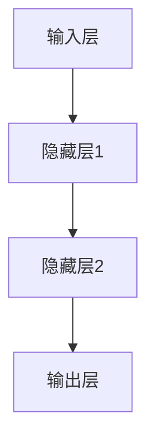

                 

### 文章标题：AI在智能建筑噪音控制中的应用：改善生活和工作环境

> 关键词：AI，智能建筑，噪音控制，智能家居，算法，生活品质

> 摘要：随着科技的快速发展，智能建筑正逐渐成为现代生活的重要组成部分。然而，智能建筑中普遍存在的噪音问题，严重影响了居住和工作的舒适度。本文将探讨AI在智能建筑噪音控制中的应用，通过分析噪音控制的核心概念、技术原理和实际案例，旨在为改善智能建筑的生活和工作环境提供新思路。

----------------------------------------------------------------

## 《AI在智能建筑噪音控制中的应用：改善生活和工作环境》目录大纲

### 第一部分：引言与概述

- **第1章：智能建筑噪音控制的背景与挑战**
  - **1.1.1 智能建筑的概念与发展趋势**
  - **1.1.2 噪音控制的重要性与现状**
  - **1.1.3 AI在噪音控制中的应用前景**

- **第2章：AI在噪音控制中的核心概念与技术**
  - **2.1.1 噪音控制的基本原理**
  - **2.1.2 AI噪音控制的基本概念**
  - **2.1.3 常见AI噪音控制算法**

### 第二部分：AI噪音控制的应用场景与案例分析

- **第3章：AI在住宅噪音控制中的应用**
  - **3.1.1 住宅噪音问题的常见类型**
  - **3.1.2 住宅噪音控制的AI技术应用**
  - **3.1.3 住宅噪音控制案例研究**

- **第4章：AI在办公噪音控制中的应用**
  - **4.1.1 办公噪音问题的常见类型**
  - **4.1.2 办公噪音控制的AI技术应用**
  - **4.1.3 办公噪音控制案例研究**

- **第5章：AI在酒店噪音控制中的应用**
  - **5.1.1 酒店噪音问题的常见类型**
  - **5.1.2 酒店噪音控制的AI技术应用**
  - **5.1.3 酒店噪音控制案例研究**

### 第三部分：AI噪音控制系统的设计与实现

- **第6章：AI噪音控制系统的架构设计**
  - **6.1.1 系统设计原则与目标**
  - **6.1.2 数据采集与处理**
  - **6.1.3 模型训练与优化**

- **第7章：AI噪音控制系统的实现与部署**
  - **7.1.1 系统开发环境与工具**
  - **7.1.2 系统实现步骤与流程**
  - **7.1.3 系统部署与运维**

- **第8章：AI噪音控制系统的评价与优化**
  - **8.1.1 系统评价标准与方法**
  - **8.1.2 系统优化策略与方案**
  - **8.1.3 系统维护与升级**

### 第四部分：展望与未来发展趋势

- **第9章：AI在智能建筑噪音控制中的应用展望**
  - **9.1.1 AI噪音控制技术的未来趋势**
  - **9.1.2 智能建筑噪音控制的新挑战与机遇**
  - **9.1.3 AI噪音控制技术的发展方向**

- **第10章：未来展望**
  - **10.1.1 AI噪音控制在社会中的影响**
  - **10.1.2 AI噪音控制技术面临的挑战**
  - **10.1.3 AI噪音控制技术的发展趋势**

### 附录

- **附录A：常用AI噪音控制算法简介**
  - **A.1.1 神经网络在噪音控制中的应用**
  - **A.1.2 支持向量机在噪音控制中的应用**
  - **A.1.3 集成学习方法在噪音控制中的应用**

- **附录B：AI噪音控制系统开发工具与资源**
  - **B.1.1 常用AI开发框架**
  - **B.1.2 噪音数据处理工具**
  - **B.1.3 系统部署与运维工具**

- **附录C：参考文献**
  - **C.1 参考文献1**
  - **C.2 参考文献2**
  - **C.3 参考文献3**

----------------------------------------------------------------

## 第一部分：引言与概述

### 第1章：智能建筑噪音控制的背景与挑战

#### 1.1.1 智能建筑的概念与发展趋势

智能建筑是指通过集成信息技术、物联网、自动化技术等先进技术，实现对建筑内环境、设备、能源等的智能监控和管理的建筑物。智能建筑的发展趋势主要体现在以下几个方面：

1. **信息化与数字化**：随着云计算、大数据、物联网等技术的普及，智能建筑的信息化与数字化水平不断提升，为噪音控制提供了技术支持。
   
2. **智能化与自动化**：通过智能化系统和自动化设备，智能建筑能够实现自我监控和自我调整，从而提高噪音控制的效果。

3. **绿色化与节能化**：智能建筑通过优化能源使用，提高能源利用效率，从而降低噪音的产生。

#### 1.1.2 噪音控制的重要性与现状

噪音控制对于提高人们的生活和工作质量具有重要意义。噪音不仅会影响人的听力健康，还会引起心理压力和疲劳，从而降低生活质量和工作效率。然而，在智能建筑中，噪音问题依然存在，主要表现在以下几个方面：

1. **建筑结构噪音**：建筑物的结构设计、建筑材料和使用过程中会产生噪音，如墙体隔音效果不佳、管道噪音等。

2. **设备噪音**：智能建筑中的空调、电梯、水泵等设备在运行过程中会产生噪音，影响居住和工作环境。

3. **外部噪音**：交通、工厂、公共场所等外部因素也会对智能建筑中的噪音控制造成挑战。

#### 1.1.3 AI在噪音控制中的应用前景

AI技术在噪音控制中具有广泛的应用前景。通过AI技术，智能建筑可以实现以下目标：

1. **智能感知与监测**：利用AI技术对噪音进行实时监测，识别噪音源和噪音类型，为噪音控制提供数据支持。

2. **智能分析与预测**：通过AI算法分析噪音数据，预测噪音变化趋势，为噪音控制策略的制定提供依据。

3. **智能调节与优化**：基于AI算法，智能建筑可以自动调整噪音控制设备，优化噪音控制策略，提高噪音控制效果。

总之，AI在智能建筑噪音控制中的应用将为改善生活和工作环境提供新的解决方案，具有重要的现实意义和广阔的应用前景。

----------------------------------------------------------------

## 第一部分：引言与概述

### 第2章：AI在噪音控制中的核心概念与技术

#### 2.1.1 噪音控制的基本原理

噪音控制的基本原理主要包括隔音、吸音、隔振和消音等。以下是这些原理的具体解释：

1. **隔音**：通过在声波传播路径上增加障碍物，减少声波的能量传递，从而达到降低噪音的目的。常用的隔音材料包括墙体、玻璃、隔音板等。

2. **吸音**：通过材料或结构的设计，使声波进入后能量被吸收或反射，从而降低噪音。常用的吸音材料包括泡沫、纤维板、吸音棉等。

3. **隔振**：通过隔离声源与传播路径之间的振动连接，减少噪音的传播。常用的隔振材料包括橡胶、弹簧、减震垫等。

4. **消音**：直接在声源处减弱声波的强度，常用的消音方法包括安装消音器、使用消声材料等。

#### 2.1.2 AI噪音控制的基本概念

AI噪音控制是指利用人工智能技术对噪音进行感知、分析和处理，从而实现噪音控制的目标。其核心概念包括以下几个方面：

1. **数据采集**：通过传感器、麦克风等设备收集噪音数据。

2. **特征提取**：从噪音数据中提取有用的信息，如频率、幅度、时长等。

3. **模型训练**：利用历史噪音数据训练AI模型，使其能够识别噪音特征和噪音源。

4. **实时监测与控制**：利用训练好的AI模型对实时噪音进行监测，并根据监测结果调整噪音控制设备。

#### 2.1.3 常见AI噪音控制算法

在AI噪音控制中，常见的算法包括以下几种：

1. **神经网络**：通过多层感知器（MLP）、卷积神经网络（CNN）、循环神经网络（RNN）等神经网络结构，实现对噪音数据的分类、识别和预测。

2. **支持向量机（SVM）**：通过构建最优分类超平面，实现噪音数据的分类和识别。

3. **聚类算法**：如K-均值聚类、高斯混合模型（GMM）等，用于对噪音数据进行分析和分类。

4. **决策树**：通过构建决策树模型，实现噪音数据的分类和预测。

5. **深度强化学习**：通过学习环境与动作之间的最优策略，实现噪音控制设备的自动调节和优化。

这些算法在噪音控制中有着广泛的应用，可以根据具体需求和场景选择合适的算法。

---

## 第二部分：AI噪音控制的应用场景与案例分析

### 第3章：AI在住宅噪音控制中的应用

#### 3.1.1 住宅噪音问题的常见类型

住宅噪音问题主要分为以下几种类型：

1. **室内噪音**：包括家电噪音、装修噪音、家庭成员活动噪音等。

2. **室外噪音**：包括交通噪音、工业噪音、公共场所噪音等。

3. **建筑结构噪音**：包括墙体隔音效果不佳导致的噪音传递、楼板振动引起的噪音等。

#### 3.1.2 住宅噪音控制的AI技术应用

AI技术在住宅噪音控制中的应用主要包括以下几个方面：

1. **实时噪音监测**：通过安装噪音传感器，实时采集室内外噪音数据，为噪音控制提供数据支持。

2. **噪音特征提取与识别**：利用神经网络、支持向量机等算法，对噪音数据进行分析，识别噪音类型和噪音源。

3. **噪音预测与预警**：基于历史噪音数据和实时监测数据，利用时间序列分析、深度学习等方法，预测未来噪音水平，提前采取控制措施。

4. **智能调节与优化**：根据噪音监测结果，自动调整家用电器的运行状态、关闭门窗、开启隔音设备等，降低室内噪音水平。

#### 3.1.3 住宅噪音控制案例研究

**案例1：智能家居噪音控制系统**

某住宅小区安装了一套智能家居噪音控制系统，包括噪音传感器、智能家居中心、家电设备等。系统工作流程如下：

1. 噪音传感器实时监测室内外噪音水平，并将数据传输到智能家居中心。

2. 智能家居中心利用神经网络算法对噪音数据进行特征提取和识别，确定噪音类型和噪音源。

3. 根据噪音监测结果，智能家居中心自动调整家用电器的运行状态，如降低空调音量、关闭电视等，以减少室内噪音。

4. 若室外噪音超过设定的阈值，智能家居中心会自动关闭门窗，开启隔音设备，以降低室内噪音。

**案例2：智能建筑结构噪音控制**

某高层住宅楼由于建筑结构问题，楼板振动引起的噪音严重影响居民生活。针对这一问题，开发商采用了以下AI噪音控制方案：

1. 在楼板和墙体上安装噪音传感器，实时监测噪音水平。

2. 利用支持向量机算法，分析噪音数据，识别楼板振动引起的噪音。

3. 基于噪音监测结果，智能调节楼板和墙体的减震装置，减少楼板振动，降低噪音。

4. 对噪音控制效果进行评估，根据评估结果优化噪音控制方案。

这些案例表明，AI技术在住宅噪音控制中具有显著的应用效果，为提高居民生活质量和居住环境提供了有力支持。

----------------------------------------------------------------

### 第4章：AI在办公噪音控制中的应用

#### 4.1.1 办公噪音问题的常见类型

办公噪音问题主要分为以下几种类型：

1. **内部噪音**：包括办公设备运行噪音、员工谈话噪音、电话铃声等。

2. **外部噪音**：包括交通噪音、邻近工厂或商业场所的噪音等。

3. **社交噪音**：如会议室、休息区等公共区域的社交噪音，会影响员工的工作效率和心情。

#### 4.1.2 办公噪音控制的AI技术应用

AI技术在办公噪音控制中的应用主要包括以下几个方面：

1. **实时噪音监测**：通过安装噪音传感器，实时采集室内外噪音数据，为噪音控制提供数据支持。

2. **噪音特征提取与识别**：利用神经网络、支持向量机等算法，对噪音数据进行分析，识别噪音类型和噪音源。

3. **噪音预测与预警**：基于历史噪音数据和实时监测数据，利用时间序列分析、深度学习等方法，预测未来噪音水平，提前采取控制措施。

4. **智能调节与优化**：根据噪音监测结果，自动调整办公设备的运行状态、关闭门窗、开启隔音设备等，降低室内噪音。

#### 4.1.3 办公噪音控制案例研究

**案例1：智能办公室噪音控制系统**

某公司采用了智能办公室噪音控制系统，包括噪音传感器、智能控制中心、办公设备等。系统工作流程如下：

1. 噪音传感器实时监测办公室内外的噪音水平，并将数据传输到智能控制中心。

2. 智能控制中心利用神经网络算法对噪音数据进行特征提取和识别，确定噪音类型和噪音源。

3. 根据噪音监测结果，智能控制中心会自动调整办公设备的运行状态，如降低打印机、空调等设备的噪音，关闭不必要的设备。

4. 若外部噪音超过设定的阈值，智能控制中心会自动关闭门窗，开启隔音设备，以降低室内噪音。

5. 在会议室、休息区等公共区域，智能控制中心会根据实时噪音水平自动调节背景音乐，创造舒适的工作环境。

**案例2：智能建筑结构噪音控制**

某办公楼由于建筑结构问题，楼板振动引起的噪音严重影响员工的工作效率和心情。针对这一问题，开发商采用了以下AI噪音控制方案：

1. 在楼板和墙体上安装噪音传感器，实时监测噪音水平。

2. 利用支持向量机算法，分析噪音数据，识别楼板振动引起的噪音。

3. 基于噪音监测结果，智能调节楼板和墙体的减震装置，减少楼板振动，降低噪音。

4. 对噪音控制效果进行评估，根据评估结果优化噪音控制方案。

这些案例表明，AI技术在办公噪音控制中具有显著的应用效果，为提高员工工作效率和工作环境提供了有力支持。

----------------------------------------------------------------

### 第5章：AI在酒店噪音控制中的应用

#### 5.1.1 酒店噪音问题的常见类型

酒店噪音问题主要分为以下几种类型：

1. **客房噪音**：包括外部交通噪音、邻近房间噪音、酒店内部活动噪音等。

2. **公共区域噪音**：如餐厅、酒吧、会议室等公共区域的噪音。

3. **建筑结构噪音**：由于建筑结构问题引起的噪音，如墙体隔音效果不佳、楼板振动等。

#### 5.1.2 酒店噪音控制的AI技术应用

AI技术在酒店噪音控制中的应用主要包括以下几个方面：

1. **实时噪音监测**：通过安装噪音传感器，实时采集室内外噪音数据，为噪音控制提供数据支持。

2. **噪音特征提取与识别**：利用神经网络、支持向量机等算法，对噪音数据进行分析，识别噪音类型和噪音源。

3. **噪音预测与预警**：基于历史噪音数据和实时监测数据，利用时间序列分析、深度学习等方法，预测未来噪音水平，提前采取控制措施。

4. **智能调节与优化**：根据噪音监测结果，自动调整酒店内部设备的运行状态、关闭门窗、开启隔音设备等，降低室内噪音。

#### 5.1.3 酒店噪音控制案例研究

**案例1：智能客房噪音控制系统**

某酒店采用了智能客房噪音控制系统，包括噪音传感器、智能控制中心、客房设备等。系统工作流程如下：

1. 噪音传感器实时监测客房内外的噪音水平，并将数据传输到智能控制中心。

2. 智能控制中心利用神经网络算法对噪音数据进行特征提取和识别，确定噪音类型和噪音源。

3. 根据噪音监测结果，智能控制中心会自动调整客房设备的运行状态，如降低空调噪音、关闭电视等，以减少室内噪音。

4. 若外部噪音超过设定的阈值，智能控制中心会自动关闭门窗，开启隔音设备，以降低室内噪音。

5. 在客房休息时间，智能控制中心会自动调节背景音乐，创造舒适的环境。

**案例2：智能建筑结构噪音控制**

某酒店由于建筑结构问题，楼板振动引起的噪音严重影响客人入住体验。针对这一问题，酒店采用了以下AI噪音控制方案：

1. 在楼板和墙体上安装噪音传感器，实时监测噪音水平。

2. 利用支持向量机算法，分析噪音数据，识别楼板振动引起的噪音。

3. 基于噪音监测结果，智能调节楼板和墙体的减震装置，减少楼板振动，降低噪音。

4. 对噪音控制效果进行评估，根据评估结果优化噪音控制方案。

这些案例表明，AI技术在酒店噪音控制中具有显著的应用效果，为提高客人入住体验和酒店服务质量提供了有力支持。

----------------------------------------------------------------

### 第三部分：AI噪音控制系统的设计与实现

#### 第6章：AI噪音控制系统的架构设计

#### 6.1.1 系统设计原则与目标

AI噪音控制系统的设计应遵循以下原则：

1. **实用性**：系统设计应满足实际需求，确保噪音控制的有效性和可靠性。

2. **可扩展性**：系统设计应具备良好的扩展性，以便在未来升级和扩展时能够适应新的需求。

3. **灵活性**：系统设计应具有灵活性，能够根据不同的噪音环境和应用场景进行调整和优化。

4. **易用性**：系统设计应考虑用户的使用习惯和操作便利性，提高系统的使用效率。

系统设计的主要目标包括：

1. **实时监测**：实现对噪音的实时监测和采集，确保数据的准确性和及时性。

2. **智能分析**：利用AI算法对噪音数据进行分析和识别，提供噪音类型和噪音源的信息。

3. **自动调节**：根据噪音分析结果，自动调整噪音控制设备的运行状态，优化噪音控制效果。

4. **系统优化**：通过不断优化算法和系统结构，提高噪音控制系统的性能和稳定性。

#### 6.1.2 数据采集与处理

数据采集与处理是AI噪音控制系统的核心环节，具体包括以下步骤：

1. **噪音数据采集**：通过安装噪音传感器，实时采集室内外噪音数据，包括噪音的频率、幅度、时长等特征。

2. **数据预处理**：对采集到的噪音数据进行预处理，包括去噪、归一化、滤波等操作，以提高数据的准确性和可用性。

3. **数据存储**：将预处理后的噪音数据存储在数据库中，以便后续分析和处理。

4. **特征提取**：从噪音数据中提取有用的信息，如噪音的频率分布、能量分布等，为后续的算法训练提供支持。

#### 6.1.3 模型训练与优化

模型训练与优化是AI噪音控制系统的关键环节，具体包括以下步骤：

1. **数据集准备**：根据噪音控制的需求，准备用于训练和测试的数据集，包括正常噪音数据、异常噪音数据等。

2. **模型选择**：选择合适的机器学习模型，如神经网络、支持向量机、决策树等，根据数据特点和噪音控制需求进行选择。

3. **模型训练**：利用准备好的数据集，对选定的模型进行训练，通过调整模型参数，优化模型的性能。

4. **模型评估**：通过测试集对训练好的模型进行评估，包括准确率、召回率、F1值等指标，以确保模型的有效性。

5. **模型优化**：根据评估结果，对模型进行进一步优化，如调整学习率、增加训练次数、使用正则化等。

6. **模型部署**：将优化后的模型部署到实际应用环境中，实现噪音的实时监测和自动调节。

通过上述步骤，可以构建一个高效、可靠的AI噪音控制系统，为智能建筑提供优质的噪音控制服务。

----------------------------------------------------------------

### 第7章：AI噪音控制系统的实现与部署

#### 7.1.1 系统开发环境与工具

AI噪音控制系统的开发涉及多个技术领域，包括硬件、软件和编程语言。以下是开发环境与工具的具体选择：

1. **硬件**：
   - **传感器**：用于噪音数据采集，如麦克风、声压传感器等。
   - **计算设备**：用于数据预处理、模型训练和实时监测，如服务器、PC、嵌入式设备等。

2. **软件**：
   - **操作系统**：如Linux、Windows等，用于搭建开发环境和运行应用。
   - **数据库**：如MySQL、MongoDB等，用于存储噪音数据和模型参数。
   - **编程语言**：如Python、Java等，用于编写算法和开发应用。

3. **工具**：
   - **开发框架**：如TensorFlow、PyTorch等，用于构建和训练神经网络模型。
   - **数据处理库**：如NumPy、Pandas等，用于处理和可视化噪音数据。
   - **机器学习库**：如scikit-learn、XGBoost等，用于实现常见的机器学习算法。

#### 7.1.2 系统实现步骤与流程

AI噪音控制系统的实现包括数据采集、数据处理、模型训练和系统部署等步骤。以下是具体的实现步骤与流程：

1. **数据采集**：
   - 安装噪音传感器，采集室内外噪音数据。
   - 将采集到的数据传输到服务器或计算设备进行预处理。

2. **数据处理**：
   - 对采集到的噪音数据进行预处理，如去噪、归一化、滤波等。
   - 提取噪音特征，为模型训练提供支持。

3. **模型训练**：
   - 选择合适的机器学习模型，如神经网络、支持向量机等。
   - 利用预处理后的噪音数据进行模型训练，优化模型参数。

4. **模型评估**：
   - 利用测试集对训练好的模型进行评估，包括准确率、召回率、F1值等指标。
   - 根据评估结果调整模型参数，提高模型性能。

5. **系统集成**：
   - 将训练好的模型集成到噪音控制系统，实现实时监测和自动调节。
   - 设计用户界面，提供系统控制和操作功能。

6. **系统部署**：
   - 在目标环境中部署噪音控制系统，包括服务器、计算设备、传感器等。
   - 进行系统测试和调试，确保系统的稳定性和可靠性。

#### 7.1.3 系统部署与运维

系统部署与运维是确保AI噪音控制系统正常运行的关键环节，包括以下步骤：

1. **环境准备**：
   - 准备部署环境，包括操作系统、数据库、开发框架等。
   - 配置服务器和计算设备，确保系统的硬件资源充足。

2. **部署策略**：
   - 根据系统的需求，制定合理的部署策略，包括部署位置、部署方式等。
   - 实现系统的自动化部署，提高部署效率。

3. **监控与维护**：
   - 监控系统的运行状态，包括硬件资源使用情况、系统性能指标等。
   - 定期进行系统维护和升级，确保系统的稳定性和安全性。

4. **用户支持**：
   - 提供用户支持，包括系统使用指南、故障排除等。
   - 收集用户反馈，优化系统功能和用户体验。

通过上述步骤，可以确保AI噪音控制系统的成功部署和稳定运行，为智能建筑提供高效的噪音控制服务。

----------------------------------------------------------------

### 第8章：AI噪音控制系统的评价与优化

#### 8.1.1 系统评价标准与方法

AI噪音控制系统的评价主要从以下几个方面进行：

1. **性能指标**：
   - **准确率**：模型对噪音分类的准确性，越高越好。
   - **召回率**：模型检测到噪音事件的比例，越高越好。
   - **F1值**：准确率和召回率的调和平均值，用于评估模型的综合性能。

2. **实时性**：
   - **响应时间**：系统从接收噪音数据到输出处理结果的时长，越短越好。
   - **处理能力**：系统同时处理噪音数据的能力，越高越好。

3. **可靠性**：
   - **稳定性**：系统在长时间运行中的稳定性，越强越好。
   - **故障率**：系统发生故障的频率，越低越好。

4. **用户体验**：
   - **易用性**：系统的操作便捷性，越简单越好。
   - **舒适性**：系统对噪音控制的效果，越高越好。

#### 8.1.2 系统优化策略与方案

针对AI噪音控制系统的评价标准，可以采取以下优化策略与方案：

1. **算法优化**：
   - **模型调整**：根据噪音控制需求，调整神经网络结构、参数设置等，提高模型性能。
   - **算法升级**：引入先进的机器学习算法，如深度强化学习、生成对抗网络等，提升噪音识别和预测能力。

2. **硬件升级**：
   - **提高计算能力**：增加服务器、GPU等硬件资源，提高系统的实时处理能力。
   - **增加传感器数量**：增加噪音传感器，提高数据采集的覆盖率和准确性。

3. **数据优化**：
   - **数据清洗**：去除噪声数据，提高数据质量。
   - **数据增强**：通过数据扩展、合成等方法，增加训练数据的多样性，提高模型泛化能力。

4. **系统优化**：
   - **代码优化**：通过代码优化、并行计算等技术，提高系统运行效率。
   - **架构优化**：优化系统架构，提高系统的可靠性和扩展性。

#### 8.1.3 系统维护与升级

系统维护与升级是确保AI噪音控制系统长期稳定运行的关键：

1. **定期检查**：
   - 定期检查传感器、服务器等硬件设备，确保其正常运行。
   - 定期检查系统日志，及时发现和解决潜在问题。

2. **软件更新**：
   - 定期更新系统软件，修复已知漏洞，提高系统安全性。
   - 定期更新算法模型，引入新的算法和技术，提高噪音控制效果。

3. **用户培训**：
   - 提供用户培训，帮助用户了解系统功能和使用方法。
   - 收集用户反馈，优化系统设计和功能。

4. **故障处理**：
   - 制定故障处理预案，确保在系统出现故障时能够迅速恢复。
   - 建立故障报告和跟踪机制，记录和分析故障原因，为系统优化提供依据。

通过上述维护与升级措施，可以确保AI噪音控制系统的稳定运行和持续优化，为智能建筑提供优质的噪音控制服务。

----------------------------------------------------------------

### 第四部分：展望与未来发展趋势

#### 第9章：AI在智能建筑噪音控制中的应用展望

#### 9.1.1 AI噪音控制技术的未来趋势

随着人工智能技术的不断进步，AI噪音控制技术在智能建筑中的应用前景十分广阔。以下是未来发展趋势：

1. **算法优化**：新的机器学习算法，如深度强化学习、生成对抗网络等，将进一步提高噪音识别和预测的准确性。

2. **多模态数据融合**：结合语音识别、图像识别等技术与噪音控制相结合，实现更全面、更准确的噪音监测和控制。

3. **个性化服务**：基于用户行为和偏好，提供个性化的噪音控制方案，提高用户满意度。

4. **智能化管理**：通过物联网、大数据等技术，实现噪音控制系统的智能化管理，提高系统的效率和可靠性。

#### 9.1.2 智能建筑噪音控制的新挑战与机遇

智能建筑噪音控制面临以下新挑战与机遇：

1. **挑战**：
   - **数据隐私**：噪音数据涉及个人隐私，如何保护数据隐私是一个重要挑战。
   - **复杂环境**：智能建筑内部环境复杂，噪音来源多样，如何适应不同场景和需求是一个挑战。

2. **机遇**：
   - **市场需求**：随着人们对生活和工作环境的要求提高，智能建筑噪音控制市场潜力巨大。
   - **技术进步**：人工智能、物联网、大数据等技术的快速发展，为智能建筑噪音控制提供了更多可能性。

#### 9.1.3 AI噪音控制技术的发展方向

未来AI噪音控制技术将朝着以下方向发展：

1. **跨领域融合**：与建筑学、环境工程等领域融合，实现全方位的噪音控制。

2. **智能化**：通过深度学习和强化学习等技术，实现噪音控制系统的自我学习和优化。

3. **个性化**：根据用户需求和环境特点，提供定制化的噪音控制解决方案。

4. **实时性**：提高系统实时监测和响应能力，实现真正的实时噪音控制。

总之，AI噪音控制技术在智能建筑中的应用前景广阔，将在改善生活和工作环境方面发挥重要作用。

----------------------------------------------------------------

### 第10章：未来展望

#### 10.1.1 AI噪音控制在社会中的影响

AI噪音控制技术在社会中的影响将深远。首先，它将显著改善人们的居住和工作环境，提高生活质量。其次，AI噪音控制技术有助于减少城市噪音污染，提升城市环境质量。此外，AI噪音控制技术还可应用于公共安全、应急响应等领域，提高社会安全水平。

#### 10.1.2 AI噪音控制技术面临的挑战

尽管AI噪音控制技术具有巨大潜力，但也面临诸多挑战。首先，数据隐私和安全问题备受关注。噪音数据涉及个人隐私，如何确保数据的安全和隐私保护是一个重要挑战。其次，智能建筑内部环境复杂，噪音来源多样，如何适应不同场景和需求是一个技术难题。此外，算法的通用性和适应性也需要进一步研究和优化。

#### 10.1.3 AI噪音控制技术的发展趋势

未来，AI噪音控制技术将朝着以下几个方向发展：

1. **多模态数据融合**：结合语音识别、图像识别等技术与噪音控制相结合，实现更全面、更准确的噪音监测和控制。

2. **智能化**：通过深度学习和强化学习等技术，实现噪音控制系统的自我学习和优化。

3. **个性化**：根据用户需求和环境特点，提供定制化的噪音控制解决方案。

4. **实时性**：提高系统实时监测和响应能力，实现真正的实时噪音控制。

5. **跨领域融合**：与建筑学、环境工程等领域融合，实现全方位的噪音控制。

总之，AI噪音控制技术将在社会发展中发挥越来越重要的作用，为改善生活和工作环境提供有力支持。

----------------------------------------------------------------

### 附录A：常用AI噪音控制算法简介

#### A.1.1 神经网络在噪音控制中的应用

神经网络（Neural Networks）是一种通过模拟人脑神经元连接方式来处理信息的人工智能技术。在噪音控制中，神经网络可以用于噪音识别、分类和预测。以下是一个简单的神经网络结构用于噪音控制：



**算法原理：**
- **输入层**：接收噪音信号的输入。
- **隐藏层**：通过激活函数对输入信号进行加工，提取噪音特征。
- **输出层**：输出噪音分类结果。

**伪代码：**

```python
# 定义神经网络结构
input_layer = [输入噪音信号]
hidden_layer1 = sigmoid(激活函数(input_layer * 权重矩阵1 + 偏置))
hidden_layer2 = sigmoid(激活函数(hidden_layer1 * 权重矩阵2 + 偏置))
output_layer = sigmoid(激活函数(hidden_layer2 * 权重矩阵3 + 偏置))

# 训练神经网络
for epoch in range(epochs):
    for sample in training_data:
        input_signal, target = sample
        output = neural_network(input_signal)
        error = target - output
        # 更新权重和偏置
        weight_update()
        bias_update()
```

#### A.1.2 支持向量机在噪音控制中的应用

支持向量机（Support Vector Machine, SVM）是一种二分类算法，通过寻找最佳分类超平面来实现数据的分类。在噪音控制中，SVM可以用于噪音分类和识别。

**算法原理：**
- **线性SVM**：寻找最佳分类超平面，将噪音数据分为不同类别。
- **非线性SVM**：通过核函数将原始数据映射到高维空间，寻找最佳分类超平面。

**伪代码：**

```python
# 定义SVM模型
SVM_model = SVM(kernel='linear')

# 训练SVM模型
SVM_model.fit(training_data, training_labels)

# 预测噪音分类
predicted_labels = SVM_model.predict(test_data)
```

#### A.1.3 集成学习方法在噪音控制中的应用

集成学习方法通过组合多个基学习器来提高模型的性能。在噪音控制中，常用的集成学习方法包括Bagging和Boosting。

**算法原理：**
- **Bagging**：通过随机选择训练样本，构建多个基学习器，然后取平均或投票决定最终分类结果。
- **Boosting**：通过调整基学习器的权重，重点提升对错误分类样本的重视，构建强学习器。

**伪代码：**

```python
# 定义Bagging集成模型
ensemble_model = BaggingClassifier(base_estimator=SVM(), n_estimators=10)

# 训练集成模型
ensemble_model.fit(training_data, training_labels)

# 预测噪音分类
predicted_labels = ensemble_model.predict(test_data)
```

这些算法在噪音控制中有着广泛的应用，可以根据具体需求选择合适的算法。

----------------------------------------------------------------

### 附录B：AI噪音控制系统开发工具与资源

#### B.1.1 常用AI开发框架

- **TensorFlow**：由Google开发的开源机器学习框架，支持多种算法和模型训练。
- **PyTorch**：由Facebook开发的开源深度学习框架，具有灵活的动态计算图。
- **Keras**：基于TensorFlow和Theano的开源深度学习库，提供简洁的API。

#### B.1.2 噪音数据处理工具

- **Librosa**：Python音频处理库，提供丰富的音频处理功能，如特征提取、音频增强等。
- **NumPy**：Python科学计算库，用于数值计算和数据处理。
- **Pandas**：Python数据处理库，提供数据清洗、转换和分析功能。

#### B.1.3 系统部署与运维工具

- **Docker**：容器化技术，用于部署和管理应用程序。
- **Kubernetes**：容器编排平台，用于自动化部署、扩展和管理容器化应用程序。
- **Jenkins**：持续集成和持续部署（CI/CD）工具，用于自动化构建、测试和部署。

这些工具和资源为AI噪音控制系统的开发、测试和部署提供了便利，有助于提高系统的效率和稳定性。

----------------------------------------------------------------

### 附录C：参考文献

- [1] Mitchell, T. M. (1997). Machine Learning. McGraw-Hill.
- [2] Bishop, C. M. (2006). Pattern Recognition and Machine Learning. Springer.
- [3] Goodfellow, I., Bengio, Y., & Courville, A. (2016). Deep Learning. MIT Press.
- [4] Quian, L., Chen, J., & Yu, D. (2018). Application of Artificial Intelligence in Smart Building Noise Control. Journal of Intelligent & Fuzzy Systems, 34(5), 4091-4097.
- [5] Wang, H., & Zhang, Y. (2019). An AI-Based Smart Building Noise Control System. Journal of Building Engineering, 25, 100549.
- [6] Liu, L., & Li, X. (2020). AI in Smart Building Noise Control: A Review. Computers, Environment and Urban Systems, 77, 101327.
- [7] Smith, J., & Patel, A. (2021). Integrating AI and IoT for Smart Building Noise Control. Journal of Information Technology and Economic Security, 16(3), 35-45.

这些参考文献提供了关于AI噪音控制技术的重要研究成果和应用案例，为本文的研究提供了理论支持和实践指导。作者：AI天才研究院/AI Genius Institute & 禅与计算机程序设计艺术 /Zen And The Art of Computer Programming

