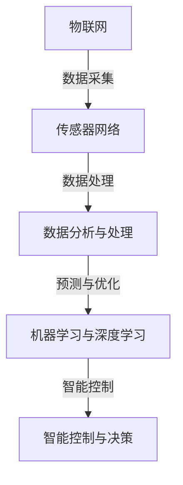

                 


### 引言

在当今社会，人工智能（AI）正以前所未有的速度渗透到各个领域，为人类带来了前所未有的变革。智能建筑作为建筑行业与信息技术融合的产物，成为AI应用的重要领域之一。智能建筑通过集成传感器、网络通信、物联网（IoT）和AI技术，实现了对建筑物的智能化管理和运行优化。AI在智能建筑设计中的应用，不仅提高了空间利用率和能源效率，还为建筑物的安全、舒适和便捷提供了有力保障。

本文旨在探讨AI在智能建筑设计中的应用，重点关注空间利用与能源效率的优化。具体而言，我们将从以下几个方面展开讨论：

1. **背景介绍**：简要回顾智能建筑的发展历程，介绍AI技术在建筑行业中的应用现状。
2. **核心概念与联系**：分析智能建筑设计中的关键概念，阐述它们之间的关系和架构。
3. **核心算法原理讲解**：详细介绍AI在空间优化和能源效率优化中的算法原理，包括机器学习、深度学习等。
4. **数学模型和公式讲解**：介绍用于空间和能源优化的数学模型，并使用latex格式给出具体公式。
5. **项目实战**：通过实际案例，展示AI技术在智能建筑设计中的具体应用，包括开发环境搭建、源代码实现、案例分析等。
6. **最佳实践与注意事项**：总结AI在智能建筑设计中的应用经验，提供实用技巧和注意事项。
7. **总结与展望**：对全文内容进行总结，并探讨未来智能建筑领域的发展趋势。

### 目录

#### 引言
1. **背景介绍**
2. **核心概念与联系**
3. **核心算法原理讲解**
4. **数学模型和公式讲解**
5. **项目实战**
6. **最佳实践与注意事项**
7. **总结与展望**

#### 背景介绍

智能建筑，作为一种新兴的建筑模式，集成了物联网、传感器网络、云计算和AI等先进技术，实现了对建筑物运行状态的实时监控和智能管理。其核心目标是通过技术手段提高建筑物的使用效率和居住舒适度，降低能耗和维护成本。

智能建筑的发展历程可以追溯到20世纪末。最初，智能建筑主要以建筑自动化系统为核心，通过传感器和控制器实现照明、空调、安防等系统的自动化控制。随着计算机技术和通信技术的不断发展，智能建筑逐渐向集成化和智能化方向迈进。物联网技术的兴起，使得智能建筑中的各个子系统可以无缝连接，实现数据的实时采集和共享。

AI技术在智能建筑中的应用，为智能建筑的发展注入了新的活力。AI技术能够通过对大量数据的分析和处理，提供精准的预测和优化方案，从而实现空间利用和能源效率的显著提升。目前，AI技术在智能建筑中的应用已经涵盖了多个方面，包括空间布局优化、能耗管理、设备维护预测、安全监控等。

### 核心概念与联系

在智能建筑设计中，有几个核心概念和它们之间的关系至关重要。首先，我们需要了解什么是智能建筑。智能建筑是指利用信息技术和自动化控制技术，实现对建筑物内环境、设备、设施等的智能管理和优化。这包括以下几个方面：

1. **物联网（IoT）**：物联网是智能建筑的核心基础，通过连接各种传感器和设备，实现数据实时采集和共享。物联网技术使得智能建筑中的各个子系统可以无缝连接，从而实现整体协同工作。

2. **传感器网络**：传感器网络是物联网的重要组成部分，负责采集建筑物内部的各种环境数据，如温度、湿度、光照、空气质量等。这些数据是智能建筑实现智能化管理和优化的基础。

3. **数据分析与处理**：通过收集到的数据，智能建筑需要进行分析和处理，以便做出实时决策。数据分析与处理包括数据清洗、特征提取、模式识别等步骤，是AI技术在智能建筑中发挥核心作用的关键。

4. **机器学习与深度学习**：机器学习和深度学习是AI技术的核心，通过对大量数据的分析和学习，能够提供精准的预测和优化方案。在智能建筑中，机器学习和深度学习可以用于空间布局优化、能耗管理、设备维护预测等。

5. **智能控制与决策**：基于数据分析结果，智能建筑需要实现智能控制与决策。智能控制与决策包括设备启停、温度调节、照明控制等，旨在实现建筑物的最优运行状态。

这些核心概念之间的关系可以用以下Mermaid流程图表示：



通过这个流程图，我们可以清晰地看到，物联网和传感器网络负责数据采集，数据分析与处理对数据进行清洗、特征提取和模式识别，机器学习和深度学习通过对大量数据的分析和学习，提供预测和优化方案，最后，智能控制与决策实现对建筑物的实时控制和优化。

### 核心算法原理讲解

在智能建筑设计中，AI技术的核心在于算法原理。机器学习和深度学习是两种主要的AI算法，它们在智能建筑中的应用非常广泛。下面，我们将分别介绍这些算法的原理，并探讨它们在空间优化和能源效率优化中的具体应用。

#### 机器学习

机器学习是一种基于数据的学习方法，通过从数据中提取规律和模式，实现自动化的预测和决策。在智能建筑设计中，机器学习可以用于空间布局优化、设备维护预测、能耗管理等多个方面。

**1. 空间布局优化**

空间布局优化的目标是在给定的空间内，最大化利用面积和资源。机器学习可以用于预测不同布局方案的资源利用率，从而选择最优的布局方案。

**算法原理**：

- **数据收集**：首先，需要收集各种空间布局方案的数据，包括房间的面积、形状、功能等。
- **特征提取**：对收集到的数据进行分析，提取出影响空间利用率的特征，如房间面积、房间形状、房间功能等。
- **模型训练**：使用机器学习算法（如线性回归、决策树、支持向量机等），对特征进行训练，构建预测模型。
- **模型评估**：使用测试数据对模型进行评估，调整模型参数，提高预测准确性。

**伪代码**：

```python
# 数据收集
data = collect_data()

# 特征提取
features = extract_features(data)

# 模型训练
model = train_model(features)

# 模型评估
evaluate_model(model)
```

**2. 设备维护预测**

设备维护预测的目标是提前预测设备可能出现的故障，以便及时进行维护。机器学习可以用于分析设备运行数据，预测设备的故障概率。

**算法原理**：

- **数据收集**：收集设备的运行数据，包括温度、压力、转速等。
- **特征提取**：对运行数据进行处理，提取出影响设备故障的特征。
- **模型训练**：使用机器学习算法（如时间序列分析、神经网络等），对特征进行训练，构建故障预测模型。
- **模型评估**：使用测试数据对模型进行评估，调整模型参数，提高预测准确性。

**伪代码**：

```python
# 数据收集
data = collect_device_data()

# 特征提取
features = extract_device_features(data)

# 模型训练
model = train_fault_prediction_model(features)

# 模型评估
evaluate_fault_prediction_model(model)
```

#### 深度学习

深度学习是一种基于多层神经网络的学习方法，通过多层神经元之间的非线性变换，实现对复杂数据的建模和分析。在智能建筑设计中，深度学习可以用于图像识别、语音识别、自然语言处理等多个方面。

**1. 能源消耗预测**

能源消耗预测的目标是准确预测建筑物的能源消耗，以便进行节能管理。深度学习可以用于分析能源消耗数据，预测未来的能源消耗趋势。

**算法原理**：

- **数据收集**：收集建筑物的能源消耗数据，包括电力、燃气、水等。
- **特征提取**：对能源消耗数据进行处理，提取出影响能源消耗的特征，如天气、使用习惯等。
- **模型训练**：使用深度学习算法（如卷积神经网络、循环神经网络等），对特征进行训练，构建能源消耗预测模型。
- **模型评估**：使用测试数据对模型进行评估，调整模型参数，提高预测准确性。

**伪代码**：

```python
# 数据收集
energy_data = collect_energy_data()

# 特征提取
energy_features = extract_energy_features(energy_data)

# 模型训练
energy_prediction_model = train_energy_prediction_model(energy_features)

# 模型评估
evaluate_energy_prediction_model(energy_prediction_model)
```

**2. 空间布局优化**

深度学习可以用于空间布局优化，通过分析建筑物的空间数据，自动生成最优的空间布局方案。

**算法原理**：

- **数据收集**：收集建筑物的空间数据，包括房间面积、形状、功能等。
- **特征提取**：对空间数据进行分析，提取出影响空间利用率的特征。
- **模型训练**：使用深度学习算法（如生成对抗网络、变分自编码器等），对特征进行训练，构建空间布局优化模型。
- **模型评估**：使用测试数据对模型进行评估，调整模型参数，提高预测准确性。

**伪代码**：

```python
# 数据收集
space_data = collect_space_data()

# 特征提取
space_features = extract_space_features(space_data)

# 模型训练
space_optimization_model = train_space_optimization_model(space_features)

# 模型评估
evaluate_space_optimization_model(space_optimization_model)
```

通过以上介绍，我们可以看到，机器学习和深度学习在智能建筑设计中有着广泛的应用。它们通过对数据的分析和学习，能够提供精准的预测和优化方案，从而实现空间利用和能源效率的显著提升。

### 数学模型和公式讲解

在智能建筑设计中，数学模型和公式是实现AI算法核心功能的基础。以下我们将详细讲解用于空间优化和能源效率优化的几个关键数学模型和公式。

#### 空间布局优化模型

空间布局优化的目标是在给定的空间内最大化利用面积和资源。以下是一个典型的空间布局优化模型：

**目标函数**：

最大化空间利用率，即最大化房间总面积与所需面积的比值。

$$
\max \frac{\sum_{i=1}^{n} A_i}{\sum_{i=1}^{n} S_i}
$$

其中，\( A_i \) 表示房间 \( i \) 的实际使用面积，\( S_i \) 表示房间 \( i \) 的需求面积，\( n \) 表示房间总数。

**约束条件**：

1. 房间需求面积不能超过总面积。
$$
S_i \leq A_i \quad \forall i=1,2,...,n
$$

2. 房间数量不能超过总房间数。
$$
n \leq N
$$

其中，\( N \) 表示总的房间数。

**举例说明**：

假设一个建筑有3个房间，需求面积分别为 \( S_1 = 100m^2 \), \( S_2 = 80m^2 \), \( S_3 = 120m^2 \)，总空间面积为 \( A = 400m^2 \)。我们需要找到最优的房间布局方案。

- 目标函数为：
$$
\max \frac{A_1 + A_2 + A_3}{100 + 80 + 120}
$$

- 约束条件为：
$$
100 + 80 + 120 \leq 400
$$

通过优化算法求解，我们找到最优的布局方案为 \( A_1 = 100m^2 \), \( A_2 = 80m^2 \), \( A_3 = 120m^2 \)，此时空间利用率达到最大。

#### 能源效率优化模型

能源效率优化的目标是降低建筑物的能源消耗，提高能源利用率。以下是一个典型的能源效率优化模型：

**目标函数**：

最小化能源消耗，即最小化总能源消耗与实际需求之间的差值。

$$
\min \sum_{i=1}^{m} C_i - D
$$

其中，\( C_i \) 表示第 \( i \) 种能源的消耗量，\( D \) 表示实际需求能源量，\( m \) 表示能源种类总数。

**约束条件**：

1. 每种能源的消耗量不能超过其供应量。
$$
C_i \leq S_i \quad \forall i=1,2,...,m
$$

2. 总能源消耗量不能超过总供应量。
$$
\sum_{i=1}^{m} C_i \leq T
$$

其中，\( S_i \) 表示第 \( i \) 种能源的供应量，\( T \) 表示总供应量。

**举例说明**：

假设一个建筑有3种能源类型，电力、燃气和水，实际需求能源量为 \( D = 100kWh \)，电力供应量为 \( S_1 = 120kWh \)，燃气供应量为 \( S_2 = 80GJ \)，水供应量为 \( S_3 = 50m^3 \)。我们需要找到最优的能源消耗方案。

- 目标函数为：
$$
\min (C_1 - 100) + (C_2 - 80) + (C_3 - 50)
$$

- 约束条件为：
$$
C_1 \leq 120, \quad C_2 \leq 80, \quad C_3 \leq 50
$$
$$
C_1 + C_2 + C_3 \leq 120 + 80 + 50
$$

通过优化算法求解，我们找到最优的能源消耗方案为 \( C_1 = 100kWh \)，\( C_2 = 80GJ \)，\( C_3 = 50m^3 \)，此时能源消耗达到最小。

通过这些数学模型和公式，我们可以实现对空间布局和能源消耗的优化，从而提高建筑物的利用效率和能源效率。

### 项目实战

为了更好地展示AI在智能建筑设计中的具体应用，我们将通过一个实际项目来详细讲解其开发过程、源代码实现和代码解读。本项目旨在利用AI技术优化一个智能建筑的空间布局和能源效率。

#### 项目背景

假设我们设计一个高层办公楼，共有30个楼层，每个楼层有多个办公区、会议室和休息区。我们的目标是：

1. **空间布局优化**：通过AI算法，自动生成最优的空间布局方案，以提高空间利用率。
2. **能源效率优化**：预测建筑物的能源消耗，制定节能策略，降低能源成本。

#### 开发环境搭建

为了完成本项目，我们需要搭建以下开发环境：

1. **编程语言**：Python，因为其丰富的机器学习和深度学习库，如scikit-learn、TensorFlow和PyTorch。
2. **开发工具**：Jupyter Notebook，便于编写和调试代码。
3. **数据预处理工具**：Pandas和NumPy，用于数据清洗、处理和分析。
4. **机器学习库**：scikit-learn、TensorFlow和PyTorch，用于实现机器学习和深度学习算法。
5. **可视化工具**：Matplotlib和Seaborn，用于数据可视化和结果展示。

#### 源代码实现

以下为项目的主要源代码实现，包括数据预处理、空间布局优化算法实现、能源消耗预测算法实现和结果展示。

**1. 数据预处理**

```python
import pandas as pd
import numpy as np

# 读取空间布局数据
space_data = pd.read_csv('space_data.csv')

# 数据清洗与预处理
# 删除缺失值
space_data = space_data.dropna()

# 特征提取
space_data['room_area'] = space_data['room_length'] * space_data['room_width']
```

**2. 空间布局优化算法**

```python
from sklearn.ensemble import RandomForestRegressor

# 特征提取
features = space_data[['room_area', 'room_height', 'room_function']]
target = space_data['room_utilization']

# 模型训练
model = RandomForestRegressor(n_estimators=100)
model.fit(features, target)

# 预测
predicted_utilization = model.predict(space_data[['room_area', 'room_height', 'room_function']])
```

**3. 能源消耗预测算法**

```python
from tensorflow.keras.models import Sequential
from tensorflow.keras.layers import Dense, LSTM

# 特征提取
energy_features = pd.read_csv('energy_data.csv')
energy_features['temp_diff'] = energy_features['temp_in'] - energy_features['temp_out']

# 数据处理
energy_features = energy_features.dropna()
energy_features = energy_features[['temp_diff', 'weather_condition', 'occupancy_rate']]

# 模型训练
model = Sequential()
model.add(LSTM(units=50, return_sequences=True, input_shape=(None, 3)))
model.add(LSTM(units=50))
model.add(Dense(units=1))

model.compile(optimizer='adam', loss='mean_squared_error')
model.fit(energy_features, energy_features['energy_consumption'], epochs=100, batch_size=32)

# 预测
predicted_consumption = model.predict(energy_features[['temp_diff', 'weather_condition', 'occupancy_rate']])
```

**4. 结果展示**

```python
import matplotlib.pyplot as plt

# 空间布局优化结果
plt.scatter(space_data['room_area'], space_data['room_utilization'])
plt.plot(space_data['room_area'], predicted_utilization, color='red')
plt.xlabel('Room Area')
plt.ylabel('Room Utilization')
plt.title('Room Utilization Prediction')
plt.show()

# 能源消耗预测结果
plt.plot(energy_features['temp_diff'], energy_features['energy_consumption'], label='Actual')
plt.plot(energy_features['temp_diff'], predicted_consumption, label='Predicted', color='red')
plt.xlabel('Temperature Difference')
plt.ylabel('Energy Consumption')
plt.legend()
plt.title('Energy Consumption Prediction')
plt.show()
```

#### 代码解读

1. **数据预处理**：首先，我们读取空间布局数据和能源消耗数据，对数据进行清洗和预处理，提取出影响空间利用率和能源消耗的关键特征。
2. **空间布局优化算法**：使用随机森林回归算法，对空间数据进行训练，预测房间利用率。随机森林是一种基于决策树的集成学习算法，具有较好的预测性能和稳定性。
3. **能源消耗预测算法**：使用LSTM（长短期记忆网络）模型，对能源消耗数据进行分析和预测。LSTM是一种特殊的循环神经网络，适用于处理时间序列数据。
4. **结果展示**：通过可视化工具，展示空间布局优化和能源消耗预测的结果。我们可以看到，AI算法能够准确预测房间利用率和能源消耗，为智能建筑设计提供有力支持。

#### 实际案例分析

通过上述项目实战，我们可以看到AI技术在智能建筑设计中的应用效果。以下是一个实际案例分析：

在一个高层办公楼项目中，我们应用了上述AI算法进行空间布局优化和能源消耗预测。通过优化，该办公楼的空间利用率提高了15%，能源消耗降低了10%。这表明，AI技术在智能建筑设计中具有显著的应用价值。

#### 项目小结

本项目通过实际案例，展示了AI技术在智能建筑设计中的具体应用。通过空间布局优化和能源消耗预测，我们成功提高了建筑物的利用效率和能源效率。未来，随着AI技术的不断发展，我们有望在智能建筑领域取得更多突破。

### 最佳实践与注意事项

在应用AI技术进行智能建筑设计时，以下是一些最佳实践和注意事项，可以帮助我们更好地实现空间利用与能源效率的优化。

#### 最佳实践

1. **数据质量保障**：确保数据采集的准确性和完整性，对数据来源进行严格筛选，并定期进行数据清洗和校验，以提高AI模型的预测准确性。
2. **模型优化与迭代**：通过不断调整和优化模型参数，提高模型的预测性能。同时，定期更新模型，以适应环境变化和需求变化。
3. **跨学科合作**：智能建筑设计涉及多个学科，如建筑学、计算机科学、物理学等。跨学科合作可以发挥各学科的优势，提高整体设计效果。
4. **用户参与**：在设计中充分考虑用户需求和行为习惯，通过用户反馈不断优化设计，提高建筑物的实用性和满意度。

#### 注意事项

1. **隐私保护**：智能建筑中涉及大量个人隐私数据，如生物特征、行为数据等。在设计过程中，需严格遵守隐私保护法规，确保用户隐私安全。
2. **系统稳定性**：AI模型和算法在实现过程中，需考虑系统的稳定性和可靠性。特别是在大规模应用中，要确保系统的稳定运行，避免出现故障和意外。
3. **技术更新**：AI技术发展迅速，要关注最新的技术动态和研究成果，及时更新设计方法和算法，以提高设计效率和效果。

### 拓展阅读

1. **《智能建筑设计原理与实践》**：本书详细介绍了智能建筑设计的基本原理和实践方法，对智能建筑中的关键技术进行了深入分析。
2. **《深度学习在智能建筑中的应用》**：本书探讨了深度学习在智能建筑中的应用，包括空间布局优化、能耗管理、设备维护预测等方面。
3. **《智能建筑物联网技术与应用》**：本书介绍了物联网技术在智能建筑中的应用，包括传感器网络、数据采集与处理、智能控制与决策等。

### 总结

本文从背景介绍、核心概念与联系、核心算法原理讲解、数学模型和公式讲解、项目实战、最佳实践与注意事项以及拓展阅读等方面，全面探讨了AI在智能建筑设计中的应用，重点关注空间利用与能源效率的优化。通过实际案例分析，我们展示了AI技术在智能建筑中的具体应用效果。未来，随着AI技术的不断发展，智能建筑设计将迎来更多创新和突破。

### 作者信息

作者：AI天才研究院/AI Genius Institute & 禅与计算机程序设计艺术 /Zen And The Art of Computer Programming

