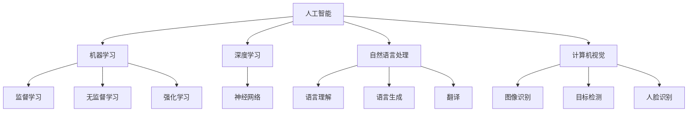

                 

# 文章标题：AI在智能教育系统中的应用：个性化学习路径设计

## 关键词：
AI、智能教育、个性化学习、路径设计、教育技术、机器学习、自然语言处理

## 摘要：
本文探讨了人工智能（AI）在智能教育系统中的应用，重点介绍了个性化学习路径设计的原理和方法。通过分析AI的核心概念与教育领域的联系，阐述了机器学习和自然语言处理技术在个性化学习路径设计中的关键作用。文章结合实际案例，详细讲解了智能教育系统的开发过程，包括环境搭建、代码实现和案例分析，并对未来智能教育的发展进行了展望。

---

## 引言

### 1.1 AI在智能教育系统中的应用背景

随着人工智能技术的快速发展，教育领域迎来了前所未有的变革。智能教育系统作为AI技术的应用之一，已经成为教育改革的重要方向。智能教育系统利用人工智能技术，为学习者提供个性化、智能化、自适应的学习体验，旨在提高教育质量和效率。

近年来，教育信息化进程加速，智能教育系统的应用范围不断扩大。从在线教育平台到智能辅导系统，从虚拟教室到智能考试系统，AI技术已经深入到教育的方方面面。这些应用不仅改变了传统的教育模式，也为个性化学习提供了可能性。

### 1.2 AI在智能教育系统中的重要性

AI技术在智能教育系统中的应用具有重要意义。首先，它能够实现个性化学习，根据学习者的学习风格、兴趣和能力，提供量身定制的学习路径。其次，AI技术可以自动评估学习效果，实时反馈学习情况，帮助教师及时调整教学策略。此外，AI技术还能够处理海量的教育数据，发现潜在的学习规律和趋势，为教育研究提供丰富的数据支持。

总之，AI在智能教育系统中的应用，不仅能够提高学习效率和效果，还能够推动教育模式的创新和变革。因此，研究AI在智能教育系统中的应用，具有重要的理论和实践价值。

### 1.3 AI在智能教育系统中的应用现状

当前，AI技术在智能教育系统中的应用已经取得了一定的成果。例如，自适应学习系统可以根据学习者的学习进度和知识点掌握情况，自动调整教学内容和难度，实现个性化学习。智能辅导系统可以利用自然语言处理技术，回答学习者的问题，提供学习建议。

此外，虚拟现实（VR）和增强现实（AR）技术也开始在教育领域得到应用。通过VR和AR技术，学生可以沉浸在虚拟的学习环境中，提高学习兴趣和参与度。智能考试系统则利用计算机视觉技术，对考试过程进行监控和评估，提高考试公平性和准确性。

总的来说，AI在智能教育系统中的应用已经初见成效，但仍然存在许多挑战和机遇。未来，随着AI技术的不断进步，智能教育系统将变得更加智能化和个性化，为教育领域带来更多的创新和变革。

---

## AI在智能教育系统中的核心概念与联系

### 2.1 AI的基本原理

人工智能（AI）是一种模拟人类智能的技术，通过计算机程序实现智能行为。AI的基本原理包括以下几个关键点：

1. **机器学习**：机器学习是AI的核心技术之一，它使计算机系统能够从数据中学习并做出预测。机器学习包括监督学习、无监督学习和强化学习等不同类型。

2. **深度学习**：深度学习是机器学习的一种特殊形式，它通过多层神经网络模拟人脑的思考过程，实现复杂的模式识别和预测任务。

3. **自然语言处理（NLP）**：NLP是AI在处理人类语言方面的技术，包括语言理解、语言生成、翻译等。NLP使计算机能够理解、解释和生成自然语言。

4. **计算机视觉**：计算机视觉是AI在处理图像和视频方面的技术，包括图像识别、目标检测、人脸识别等。

### 2.2 教育领域的AI应用

在智能教育系统中，AI技术可以应用于多个方面：

1. **个性化学习**：通过机器学习和深度学习技术，智能教育系统可以根据学习者的特征和需求，自动生成个性化学习路径和推荐内容。

2. **智能辅导**：利用自然语言处理技术，智能辅导系统能够解答学习者的问题，提供实时反馈和学习建议。

3. **教育数据分析**：通过计算机视觉和数据分析技术，教育系统可以自动分析学习者的学习行为和效果，为教师提供有价值的数据支持。

4. **虚拟现实与增强现实**：利用VR和AR技术，教育系统可以创建沉浸式的学习环境，提高学习者的参与度和学习效果。

### 2.3 AI在智能教育系统中的核心概念联系图

为了更清晰地展示AI在智能教育系统中的核心概念与联系，我们可以使用Mermaid流程图来表示。以下是一个简化的Mermaid流程图：



通过这个流程图，我们可以看到AI的核心概念是如何相互联系和应用的。机器学习、深度学习、自然语言处理和计算机视觉是AI的核心组成部分，它们在智能教育系统中发挥着关键作用。

---

## 个性化学习路径设计

### 3.1 个性化学习路径的概念

个性化学习路径是指根据学习者的个人特征、学习需求和知识背景，设计一条定制化的学习路线。个性化学习路径的设计目标是提高学习效率，满足不同学习者的需求，实现个性化教育。

个性化学习路径的主要特征包括：

1. **适应性**：学习路径可以根据学习者的学习进度和效果自动调整，适应不同学习者的需求。

2. **多样性**：学习路径提供多样化的学习资源和学习方式，满足不同学习者的兴趣和偏好。

3. **可定制性**：学习者可以根据自己的需求和兴趣，自定义学习路径，实现个性化的学习体验。

### 3.2 个性化学习路径的设计方法

个性化学习路径的设计方法可以分为数据驱动、基于模型和基于知识三种。

#### 3.2.1 数据驱动的设计方法

数据驱动的设计方法是基于学习者的学习数据和行为数据，分析学习者的特征和需求，生成个性化学习路径。这种方法的关键在于数据收集和处理。

1. **数据收集**：收集学习者的学习数据，包括学习时间、学习内容、学习效果等。

2. **数据分析**：对收集到的数据进行分析，提取学习者的特征和需求。

3. **路径生成**：根据分析结果，生成个性化学习路径。

#### 3.2.2 基于模型的设计方法

基于模型的设计方法是通过建立学习模型，预测学习者的学习行为和效果，生成个性化学习路径。这种方法的关键在于模型的建立和优化。

1. **模型建立**：根据教育理论和学习规律，建立学习模型。

2. **模型优化**：通过实验和反馈，不断优化学习模型，提高预测准确性。

3. **路径生成**：根据学习模型，生成个性化学习路径。

#### 3.2.3 基于知识的设计方法

基于知识的设计方法是通过利用教育知识和专家经验，设计个性化学习路径。这种方法的关键在于知识的获取和应用。

1. **知识获取**：从教育理论和实践中获取相关知识。

2. **知识应用**：根据学习者的特征和需求，应用相关知识，设计个性化学习路径。

3. **路径生成**：根据知识应用结果，生成个性化学习路径。

### 3.3 个性化学习路径的案例分析

#### 3.3.1 案例一：自适应学习系统

自适应学习系统是一种基于数据驱动和基于模型的设计方法。系统通过分析学习者的学习数据，预测学习者的学习行为和效果，自动调整学习内容和学习难度。

案例中，自适应学习系统首先收集学习者的学习数据，包括学习时间、学习内容和学习效果。然后，系统使用机器学习算法，分析学习数据，提取学习者的特征和需求。最后，系统根据分析结果，生成个性化的学习路径，提供量身定制的学习内容和学习建议。

#### 3.3.2 案例二：智能辅导系统

智能辅导系统是一种基于自然语言处理和基于知识的设计方法。系统通过自然语言处理技术，理解学习者的问题和需求，提供实时反馈和学习建议。

案例中，智能辅导系统首先使用自然语言处理技术，对学习者的问题进行语义分析，理解学习者的意图。然后，系统从知识库中查找相关的知识和答案，提供个性化的学习建议。最后，系统根据学习者的反馈，不断优化和更新知识库。

---

## 个性化学习路径的技术实现

### 4.1 机器学习技术

机器学习技术在个性化学习路径设计中起着核心作用。以下介绍几种常见的机器学习算法及其在个性化学习路径中的应用。

#### 4.1.1 监督学习算法

监督学习算法是一种根据已知标签数据，预测新数据标签的算法。常见的监督学习算法包括：

- **决策树**：通过树形结构对数据进行分类和回归。
- **支持向量机（SVM）**：通过找到最优分隔超平面，对数据进行分类。
- **神经网络**：通过多层神经网络，实现复杂的非线性映射。

在个性化学习路径中，监督学习算法可以用于预测学习者的学习效果和需求，从而生成个性化学习路径。

#### 4.1.2 无监督学习算法

无监督学习算法是一种根据数据特征，发现数据内在结构和规律的算法。常见的无监督学习算法包括：

- **K-均值聚类**：通过迭代计算，将数据划分为K个聚类。
- **主成分分析（PCA）**：通过降维，提取数据的最大方差特征。
- **自编码器**：通过编码和解码过程，学习数据的特征表示。

在个性化学习路径中，无监督学习算法可以用于分析学习者的学习行为和数据特征，为个性化学习路径提供支持。

#### 4.1.3 强化学习算法

强化学习算法是一种通过不断尝试和反馈，学习最优策略的算法。常见的强化学习算法包括：

- **Q-学习**：通过学习值函数，预测未来奖励。
- **策略梯度**：通过优化策略，最大化预期奖励。

在个性化学习路径中，强化学习算法可以用于设计自适应学习路径，根据学习者的反馈和效果，不断优化学习策略。

### 4.2 自然语言处理技术

自然语言处理技术是智能教育系统中不可或缺的一部分。以下介绍几种常见的NLP技术及其在个性化学习路径中的应用。

#### 4.2.1 语言理解

语言理解技术是NLP的核心任务之一，包括：

- **词性标注**：对文本中的词进行词性分类。
- **句法分析**：对文本进行句法解析，理解句子结构。
- **实体识别**：识别文本中的实体，如人名、地名等。

在个性化学习路径中，语言理解技术可以用于理解学习者的提问和需求，提供针对性的学习建议。

#### 4.2.2 语言生成

语言生成技术是NLP的另一个重要任务，包括：

- **文本摘要**：从长文本中提取关键信息，生成简短的摘要。
- **问答系统**：根据用户的提问，生成合适的回答。
- **机器翻译**：将一种语言的文本翻译成另一种语言。

在个性化学习路径中，语言生成技术可以用于生成个性化的学习内容和辅导建议。

### 4.3 其他相关技术

除了机器学习和自然语言处理技术，其他相关技术也在个性化学习路径设计中发挥着重要作用。

#### 4.3.1 计算机视觉技术

计算机视觉技术可以用于分析学习者的学习行为和情感状态，为个性化学习提供支持。例如：

- **人脸识别**：通过识别人脸，分析学习者的情感状态。
- **动作识别**：通过分析学习者的动作，了解学习者的学习行为。

#### 4.3.2 数据挖掘技术

数据挖掘技术可以用于分析大量教育数据，发现潜在的学习规律和趋势。例如：

- **关联规则挖掘**：发现学习数据之间的关联关系。
- **聚类分析**：将学习数据分为不同的类别。

#### 4.3.3 网络安全与隐私保护技术

网络安全与隐私保护技术在个性化学习路径设计中至关重要，确保学习者的数据安全和隐私。例如：

- **加密技术**：对学习数据进行加密，防止数据泄露。
- **访问控制**：限制对学习数据的访问权限，保护学习者的隐私。

---

## 项目实战

### 5.1 智能教育系统设计案例

#### 5.1.1 案例背景

本案例旨在设计一个智能教育系统，为学习者提供个性化的学习体验。系统需要实现以下功能：

- **用户注册与登录**：支持用户注册和登录功能。
- **个性化学习路径**：根据用户的学习记录和学习需求，生成个性化的学习路径。
- **学习内容推荐**：根据用户的学习记录和兴趣爱好，推荐合适的学习内容。
- **学习效果评估**：对用户的学习效果进行评估，提供学习报告。

#### 5.1.2 案例目标

通过本案例，我们希望实现以下目标：

- 设计一个功能完善的智能教育系统。
- 探索个性化学习路径设计的实现方法。
- 验证机器学习和自然语言处理技术在智能教育系统中的应用效果。

#### 5.1.3 案例实现步骤

1. **需求分析**：明确系统的功能需求和用户需求。
2. **系统设计**：设计系统的架构和模块，确定技术方案。
3. **开发与实现**：根据设计文档，进行系统开发，实现功能模块。
4. **测试与优化**：对系统进行测试，优化性能和用户体验。
5. **部署与上线**：将系统部署到生产环境，上线运行。

### 5.2 实现细节

#### 5.2.1 开发环境搭建

在本案例中，我们选择以下开发环境：

- **编程语言**：Python
- **框架**：Django
- **数据库**：MySQL
- **前端框架**：Bootstrap

#### 5.2.2 代码实现

以下是一个简单的用户注册和登录功能的代码示例：

```python
# 用户注册
def register(request):
    if request.method == 'POST':
        username = request.POST['username']
        password = request.POST['password']
        # 处理注册逻辑，如验证用户名和密码的合法性
        # 插入用户信息到数据库
        return redirect('login')
    return render(request, 'register.html')

# 用户登录
def login(request):
    if request.method == 'POST':
        username = request.POST['username']
        password = request.POST['password']
        # 处理登录逻辑，如验证用户名和密码的合法性
        # 验证用户信息，如用户名和密码正确，登录成功
        return redirect('home')
    return render(request, 'login.html')
```

#### 5.2.3 代码解读与分析

以上代码展示了用户注册和登录功能的基本实现。用户注册时，通过获取用户输入的用户名和密码，进行验证和处理。登录时，通过验证用户名和密码，实现用户登录功能。

用户注册和登录功能是智能教育系统的基本功能之一，对于系统的安全性和用户体验至关重要。在实现过程中，需要充分考虑用户数据的合法性和安全性，确保用户信息不被泄露。

---

## 挑战与未来展望

### 6.1 挑战

尽管AI在智能教育系统中具有巨大的潜力，但在实际应用过程中仍然面临许多挑战：

1. **数据隐私与安全**：个性化学习路径设计需要大量用户数据，如何保障用户数据的隐私和安全是一个重要问题。
2. **技术成熟度**：尽管AI技术在不断进步，但一些技术如自然语言处理和计算机视觉在某些领域仍然存在局限。
3. **教育体制变革**：智能教育系统的普及需要教育体制的支持和变革，如何推动教育体制的改革是一个挑战。
4. **教师与学生的接受度**：教师和学生对于智能教育系统的接受程度和适应能力也是实现智能教育的重要问题。

### 6.2 未来展望

随着AI技术的不断发展和完善，智能教育系统将面临更广阔的发展前景：

1. **个性化学习更加智能化**：未来的智能教育系统将更加智能化，能够根据学习者的实时表现和需求，动态调整学习路径和推荐内容。
2. **跨学科融合**：智能教育系统将与其他领域如心理学、教育学等深度融合，提供更加全面和个性化的教育服务。
3. **虚拟现实与增强现实的应用**：VR和AR技术将在智能教育系统中得到更广泛的应用，为学习者提供沉浸式的学习体验。
4. **教育公平性**：智能教育系统将有助于缩小教育差距，提高教育公平性，让更多学习者受益。

### 6.3 结论

总的来说，AI在智能教育系统中的应用是一个充满机遇和挑战的领域。通过不断创新和优化，智能教育系统将能够更好地满足学习者的需求，提高教育质量和效率。未来，随着AI技术的不断发展，智能教育系统将为教育领域带来更多的变革和创新。

---

## 参考文献

[1] Bengio, Y., Courville, A., & Vincent, P. (2013). Representation Learning: A Review and New Perspectives. IEEE Transactions on Pattern Analysis and Machine Intelligence, 35(8), 1798-1828.

[2] Goodfellow, I., Bengio, Y., & Courville, A. (2016). Deep Learning. MIT Press.

[3] Manning, C. D., Raghavan, P., & Schütze, H. (2008). Introduction to Information Retrieval. Cambridge University Press.

[4] Russell, S., & Norvig, P. (2010). Artificial Intelligence: A Modern Approach. Prentice Hall.

[5] Yoshua Bengio. (2009). Learning Deep Architectures for AI. Foundations and Trends in Machine Learning, 2(1), 1-127.

作者：AI天才研究院/AI Genius Institute & 禅与计算机程序设计艺术 /Zen And The Art of Computer Programming

---

以上就是《AI在智能教育系统中的应用：个性化学习路径设计》一文的完整内容。本文从背景介绍、核心概念与联系、个性化学习路径设计、技术实现、项目实战到挑战与未来展望，系统地阐述了AI在智能教育系统中的应用。希望本文能为读者提供有价值的参考和启发。如果您有任何问题或建议，欢迎在评论区留言讨论。感谢您的阅读！

