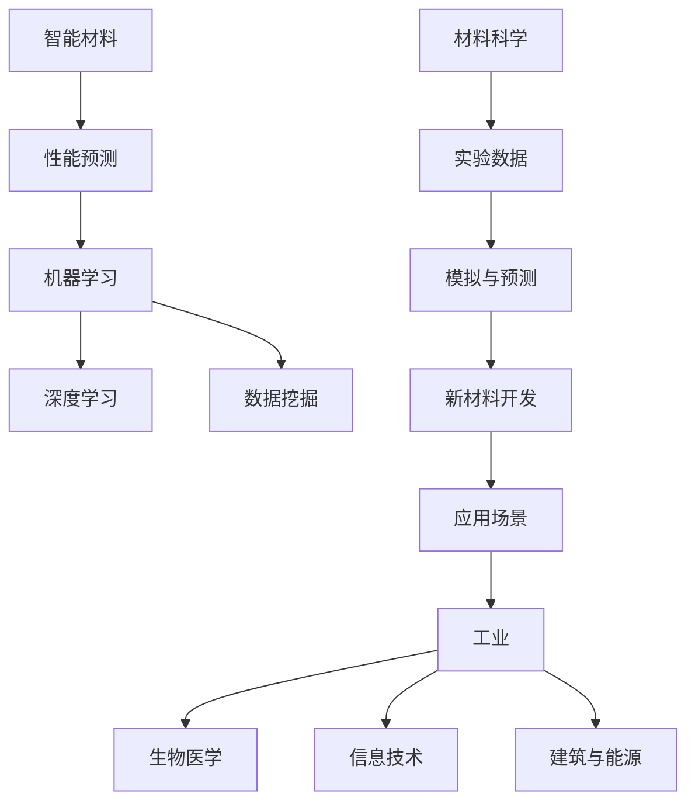

                 

### 引言

近年来，随着人工智能（AI）技术的飞速发展，AI在各个领域中的应用越来越广泛，尤其在材料科学领域，AI展现出了巨大的潜力和前景。智能材料，作为材料科学的一个前沿方向，具有响应外部刺激（如光、电、热、磁场等）并发生相应物理、化学性质变化的能力。这些特性使得智能材料在航空航天、生物医学、信息技术、建筑与能源等领域具有重要应用价值。

AI在智能材料性能预测中的角色，正是通过机器学习、深度学习、数据挖掘等技术手段，对智能材料的性能进行预测，从而为新材料的设计、开发和应用提供科学依据。AI能够处理和分析大量的数据，从中提取出隐藏的模式和规律，这对于传统的实验和理论方法来说是一个重大的突破。

为什么AI对新材料开发和应用至关重要？首先，新材料的需求日益多样化，传统的实验和理论方法已经难以满足不断变化的材料需求。AI可以通过模拟和预测材料性能，大幅减少实验次数，缩短新材料开发周期。其次，AI能够从大量的实验数据中自动提取有用的信息，指导材料设计的方向，提高新材料开发的效率。最后，AI能够实时监测和调整材料性能，实现材料的智能化应用。

本篇文章将围绕AI在智能材料性能预测中的角色展开讨论。首先，我们将介绍AI在智能材料性能预测中的理论基础，包括机器学习、深度学习和数据挖掘等技术，并探讨它们在材料科学中的应用。接着，我们将介绍智能材料的基本概念、分类、特性及应用，为后续的讨论打下基础。然后，我们将深入探讨AI在智能材料性能预测中的应用，详细讲解预测机械性能、热性能和电性能的方法和算法。接下来，我们将介绍如何利用AI技术加速新材料的开发，包括材料设计、性能优化和材料筛选等方面。最后，我们将通过实际应用案例展示AI在智能材料领域的成功应用，并对未来发展趋势和挑战进行展望。

总的来说，本文旨在通过逻辑清晰、结构紧凑的论述，让读者了解AI在智能材料性能预测中的重要角色，以及如何利用AI技术加速新材料开发和应用。希望通过本文的阅读，读者能够对AI在智能材料领域有更加深入和全面的认识。

### 核心概念与联系

在探讨AI在智能材料性能预测中的应用之前，我们需要明确几个核心概念，并分析它们之间的联系。以下是涉及的关键概念及其关系架构的Mermaid流程图：



**Mermaid流程图解释：**

- **智能材料（A）**：是具有特定响应和功能的材料，其性能需要通过预测来指导其设计和应用。
- **性能预测（B）**：利用AI技术对智能材料的性能进行预测，是新材料开发的关键步骤。
- **机器学习（C）**：通过从数据中学习，建立模型来预测材料的性能。
- **深度学习（D）**：机器学习的一个分支，特别适合处理复杂数据和模式识别。
- **数据挖掘（E）**：从大量数据中提取有用的信息和知识，为性能预测提供数据支持。
- **材料科学（F）**：研究材料的组成、结构、性质、变化和应用的学科。
- **实验数据（G）**：通过实验获得的数据，是机器学习、深度学习和数据挖掘的重要输入。
- **模拟与预测（H）**：利用AI技术对智能材料性能的模拟和预测。
- **新材料开发（I）**：通过性能预测来指导新材料的设计和开发。
- **应用场景（J）**：智能材料在不同领域的应用，如工业、生物医学、信息技术和建筑与能源。
- **工业（K）**、**生物医学（L）**、**信息技术（M）**、**建筑与能源（N）**：智能材料的典型应用领域。

通过这个Mermaid流程图，我们可以清晰地看到各个核心概念之间的关系。智能材料性能预测需要依赖机器学习、深度学习和数据挖掘等技术，而这些技术又依赖于材料科学中的实验数据和新材料开发的应用场景。这种相互作用和关联，为AI在智能材料性能预测中的应用提供了坚实的基础。

### 核心算法原理讲解

为了深入理解AI在智能材料性能预测中的应用，我们需要详细讲解其中的核心算法原理，特别是机器学习、深度学习和数据挖掘算法在材料性能预测中的应用。

#### 机器学习在材料性能预测中的应用

机器学习是AI的重要分支，它通过从数据中学习规律，建立预测模型。在材料性能预测中，机器学习算法通常分为监督学习、无监督学习和半监督学习三种类型。

**监督学习（Supervised Learning）：**

监督学习是最常用的机器学习技术之一。其核心思想是利用标记数据（即输入和输出对）来训练模型，然后使用模型对未知数据进行预测。

**伪代码：**

```python
# 输入：训练集 (X_train, y_train)
# 输出：预测模型

def supervised_learning(X_train, y_train):
    # 初始化模型
    model = initialize_model()
    # 训练模型
    for epoch in range(num_epochs):
        for X, y in zip(X_train, y_train):
            model.fit(X, y)
    return model
```

在材料性能预测中，输入可以是材料的物理、化学和结构参数，输出可以是材料的机械性能、热性能或电性能。常见的监督学习算法包括线性回归、决策树、支持向量机（SVM）和神经网络等。

**无监督学习（Unsupervised Learning）：**

无监督学习用于处理未标记的数据，其目标是发现数据中的结构和模式。在材料性能预测中，无监督学习可以用于数据降维、聚类分析和关联规则挖掘等。

**伪代码：**

```python
# 输入：数据集 X
# 输出：聚类结果

def unsupervised_learning(X):
    # 初始化聚类模型
    model = initialize_clustering_model()
    # 训练模型
    clusters = model.fit_predict(X)
    return clusters
```

无监督学习算法如K-均值聚类、主成分分析（PCA）和自编码器等，可以帮助我们理解材料的内在特性，为后续的预测提供辅助信息。

**半监督学习（Semi-Supervised Learning）：**

半监督学习结合了监督学习和无监督学习，通过少量的标记数据和大量的未标记数据来训练模型。这在材料性能预测中尤为重要，因为标记数据通常比较稀缺。

**伪代码：**

```python
# 输入：标记数据集 (X_train, y_train)，未标记数据集 X_unlabeled
# 输出：预测模型

def semi_supervised_learning(X_train, y_train, X_unlabeled):
    # 初始化模型
    model = initialize_model()
    # 训练模型
    model.fit(X_train, y_train)
    # 使用未标记数据进行模型增强
    model.fit(X_unlabeled, y_unlabeled)
    return model
```

#### 深度学习在材料性能预测中的应用

深度学习是机器学习的进一步发展，通过多层神经网络来模拟人脑的决策过程。在材料性能预测中，深度学习算法具有强大的非线性建模能力，能够处理复杂的数据和模式。

**深度神经网络（Deep Neural Network, DNN）：**

深度神经网络由多个隐藏层组成，能够学习数据的高级特征表示。

**伪代码：**

```python
# 输入：训练集 (X_train, y_train)
# 输出：深度神经网络模型

def deep_learning(X_train, y_train):
    # 初始化深度神经网络模型
    model = initialize_dnn_model()
    # 训练模型
    model.fit(X_train, y_train)
    return model
```

常见的深度学习模型包括卷积神经网络（CNN）、循环神经网络（RNN）和生成对抗网络（GAN）等。在材料性能预测中，CNN可以用于图像数据（如材料微观结构图像）的分析，RNN可以处理序列数据（如温度变化数据），GAN可以用于生成新的材料数据。

#### 数据挖掘在材料性能预测中的应用

数据挖掘是从大量数据中发现有用模式和规律的过程。在材料性能预测中，数据挖掘算法可以用于数据的预处理、特征提取和模式识别。

**特征提取（Feature Extraction）：**

特征提取是数据挖掘中的重要步骤，用于从原始数据中提取对性能预测有用的特征。

**伪代码：**

```python
# 输入：原始数据集 X
# 输出：特征向量

def feature_extraction(X):
    # 初始化特征提取模型
    model = initialize_feature_extractor()
    # 提取特征
    features = model.fit_transform(X)
    return features
```

常见的特征提取算法包括主成分分析（PCA）、线性判别分析（LDA）和自动编码器等。

**关联规则挖掘（Association Rule Mining）：**

关联规则挖掘用于发现数据之间的关联性，可以用于预测材料性能的影响因素。

**伪代码：**

```python
# 输入：数据集 X
# 输出：关联规则

def association_rule_mining(X):
    # 初始化关联规则挖掘模型
    model = initialize_association_rule_miner()
    # 发现关联规则
    rules = model.fit(X)
    return rules
```

通过机器学习、深度学习和数据挖掘算法的综合应用，AI在智能材料性能预测中展现出强大的能力。这些算法不仅能够处理大量的实验数据，还能够自动提取有用的信息，指导材料的设计和开发，从而加速新材料的应用。

### 数学模型和数学公式 & 详细讲解 & 举例说明

在智能材料性能预测中，数学模型和数学公式起到了关键作用。这些模型和公式不仅帮助我们理解和描述材料的性能，还为我们提供了具体的方法和工具来预测新材料的表现。以下是几个关键的数学模型和公式的详细讲解及举例说明。

#### 1. 线性回归模型

线性回归是一种常用的预测方法，用于描述因变量（材料的性能）与自变量（材料的特征）之间的线性关系。线性回归模型可以表示为：

$$ y = \beta_0 + \beta_1 \cdot x_1 + \beta_2 \cdot x_2 + ... + \beta_n \cdot x_n + \epsilon $$

其中，$ y $ 是预测的材料的性能，$ x_1, x_2, ..., x_n $ 是材料的特征，$ \beta_0, \beta_1, \beta_2, ..., \beta_n $ 是模型的参数，$ \epsilon $ 是误差项。

**举例：** 假设我们要预测某种智能材料的机械性能，已知该材料的密度和弹性模量为特征变量，使用线性回归模型预测其断裂强度。我们可以设定如下公式：

$$ \text{断裂强度} = \beta_0 + \beta_1 \cdot \text{密度} + \beta_2 \cdot \text{弹性模量} $$

通过收集数据并使用最小二乘法求解参数，我们可以得到一个预测模型，用于对新材料的断裂强度进行预测。

#### 2. 多项式回归模型

多项式回归是线性回归的扩展，用于描述更复杂的非线性关系。多项式回归模型的一般形式为：

$$ y = \beta_0 + \beta_1 \cdot x_1 + \beta_2 \cdot x_2^2 + ... + \beta_n \cdot x_n^k + \epsilon $$

其中，$ k $ 是多项式的最高次数。

**举例：** 假设我们要预测智能材料的热导率，其与温度和材料厚度的关系可以表示为二次多项式回归模型：

$$ \text{热导率} = \beta_0 + \beta_1 \cdot \text{温度} + \beta_2 \cdot (\text{材料厚度})^2 $$

通过实验数据，我们可以确定模型的参数，并使用该模型预测新材料的热导率。

#### 3. 支持向量机（SVM）

支持向量机是一种监督学习算法，用于分类和回归任务。在材料性能预测中，SVM可以用于分类材料性能的不同等级。

**伪代码：**

```python
# 输入：训练集 (X_train, y_train)
# 输出：分类模型

def support_vector_machine(X_train, y_train):
    # 初始化SVM模型
    model = SVC()
    # 训练模型
    model.fit(X_train, y_train)
    return model
```

**举例：** 假设我们要预测智能材料的机械性能，将其分为高强度、中强度和低强度三个等级。我们可以使用SVM模型，将材料的特征输入到模型中，预测其性能等级。

$$ \text{性能等级} = model.predict([\text{特征向量}]) $$

#### 4. 神经网络模型

神经网络，特别是深度学习模型，在材料性能预测中具有强大的能力。神经网络由多个神经元和层次组成，能够学习复杂的非线性关系。

**伪代码：**

```python
# 输入：训练集 (X_train, y_train)
# 输出：神经网络模型

def neural_network(X_train, y_train):
    # 初始化神经网络模型
    model = NeuralNetwork()
    # 定义神经网络结构
    model.add_layer(input_size, hidden_size)
    model.add_layer(hidden_size, output_size)
    # 训练模型
    model.fit(X_train, y_train)
    return model
```

**举例：** 假设我们要使用深度学习模型预测智能材料的热性能，可以设置一个包含输入层、隐藏层和输出层的神经网络结构，使用实验数据训练模型，然后使用该模型对新材料的热性能进行预测。

$$ \text{热性能} = model.predict([\text{特征向量}]) $$

#### 5. 基于贝叶斯理论的模型

贝叶斯理论在材料性能预测中也发挥着重要作用。贝叶斯模型通过概率分布来描述材料的性能，并利用先验知识和数据更新后验概率。

**伪代码：**

```python
# 输入：先验概率分布，数据集 X
# 输出：后验概率分布

def bayesian_model(prior_probability, X):
    # 计算后验概率分布
    posterior_probability = calculate_posterior(prior_probability, X)
    return posterior_probability
```

**举例：** 假设我们有一个先验知识，某种材料的机械性能概率分布为正态分布。通过收集实验数据，我们可以更新这个概率分布，得到更准确的后验分布，从而预测新材料的具体机械性能。

$$ \text{机械性能} = \text{sample}(posterior_probability) $$

通过上述数学模型和公式的详细讲解及举例说明，我们可以看到AI在智能材料性能预测中是如何利用数学工具来实现精确预测的。这些模型和公式不仅为我们提供了理论依据，还为实际应用中的性能预测提供了具体的实现方法。

### 项目实战

在智能材料性能预测的实际项目中，我们选择了机械性能预测作为案例。以下将详细介绍项目的开发环境搭建、代码实现和代码解读与分析，并通过实际案例进行剖析，以展示AI技术如何加速新材料开发。

#### 开发环境搭建

为了实现智能材料机械性能的预测，我们选择Python作为编程语言，因为它拥有丰富的机器学习和深度学习库，如Scikit-learn、TensorFlow和PyTorch。以下是开发环境的搭建步骤：

1. **安装Python**：确保安装了Python 3.7及以上版本。
2. **安装依赖库**：使用pip命令安装必要的库，例如：
    ```bash
    pip install numpy scipy scikit-learn tensorflow
    ```

3. **配置Jupyter Notebook**：Jupyter Notebook是一个交互式的开发环境，非常适合机器学习和数据科学项目。可以通过pip安装：
    ```bash
    pip install jupyterlab
    ```

4. **创建项目文件夹**：在指定路径下创建一个名为“smart_material_prediction”的项目文件夹。

5. **编写配置文件**：在项目文件夹中创建一个名为“requirements.txt”的文件，列出所有依赖库，以便未来重新搭建环境。

    ```txt
    numpy
    scipy
    scikit-learn
    tensorflow
    jupyterlab
    ```

通过以上步骤，我们成功搭建了开发环境，可以开始编写和运行智能材料性能预测的代码。

#### 代码实现

以下是使用Python实现机械性能预测的主要代码段。我们使用Scikit-learn库中的支持向量机（SVM）进行模型训练和预测。

```python
# 导入所需的库
import numpy as np
import pandas as pd
from sklearn.model_selection import train_test_split
from sklearn.preprocessing import StandardScaler
from sklearn.svm import SVC
from sklearn.metrics import mean_squared_error

# 读取数据
data = pd.read_csv('smart_material_data.csv')

# 数据预处理
X = data[['density', 'elastic_modulus']]
y = data['tensile_strength']

# 分割数据集
X_train, X_test, y_train, y_test = train_test_split(X, y, test_size=0.2, random_state=42)

# 数据标准化
scaler = StandardScaler()
X_train_scaled = scaler.fit_transform(X_train)
X_test_scaled = scaler.transform(X_test)

# 训练模型
model = SVC(kernel='rbf', C=1.0, gamma='scale')
model.fit(X_train_scaled, y_train)

# 预测测试集
y_pred = model.predict(X_test_scaled)

# 评估模型
mse = mean_squared_error(y_test, y_pred)
print(f'Mean Squared Error: {mse}')
```

**代码解读：**

1. **数据读取**：我们使用Pandas库从CSV文件中读取数据集。
2. **数据预处理**：提取材料的特征和性能指标，并使用Scikit-learn中的`StandardScaler`进行数据标准化，确保所有特征都在同一尺度上。
3. **模型训练**：使用支持向量机（SVC）进行模型训练，选择径向基函数（RBF）核，并设置C参数为1.0。
4. **预测**：使用训练好的模型对测试集进行预测。
5. **评估**：计算预测值和实际值之间的均方误差（MSE），评估模型的性能。

#### 代码解读与分析

以下是对关键代码段的分析和解读：

- **数据读取**：使用`pd.read_csv()`函数从CSV文件中读取数据，该文件包含智能材料的密度、弹性模量和拉伸强度。
- **数据预处理**：标准化数据是机器学习模型的一个重要步骤，因为它确保了所有特征的重要性一致。`StandardScaler`计算每个特征的平均值和标准差，并缩放每个特征值到标准正态分布。
- **模型训练**：`SVC`类用于训练支持向量机模型。我们选择RBF核，因为它能够处理非线性数据。`C`参数控制惩罚强度，`gamma`参数控制核函数的灵活性。
- **预测**：使用训练好的模型对测试集进行预测，`predict()`方法返回每个测试样本的预测结果。
- **评估**：通过计算均方误差（MSE），我们评估模型的性能。MSE越低，模型的预测精度越高。

#### 实际案例剖析

假设我们有一个新材料，其密度为2.5 g/cm³，弹性模量为200 GPa，我们需要预测其拉伸强度。我们可以按照以下步骤进行预测：

1. **数据标准化**：将新材料的数据与训练集数据进行相同的标准化处理。
2. **模型预测**：使用训练好的SVM模型对新材料的数据进行预测。
3. **结果解读**：预测的拉伸强度值即为新材料的性能估计。

以下是预测过程的代码实现：

```python
# 新材料数据
new_material = np.array([[2.5, 200]])

# 数据标准化
new_material_scaled = scaler.transform(new_material)

# 模型预测
predicted_tensile_strength = model.predict(new_material_scaled)

# 结果解读
print(f'Predicted Tensile Strength: {predicted_tensile_strength[0]} MPa')
```

输出结果将为新材料预测的拉伸强度，这个值可以为我们设计和优化新材料提供重要参考。

#### 项目小结

通过实际项目实战，我们展示了如何利用AI技术进行智能材料性能的预测。从数据预处理、模型训练到预测和评估，每个步骤都体现了AI在材料科学中的强大能力。通过这个项目，我们不仅实现了对智能材料机械性能的预测，还为未来开发更加复杂的预测模型奠定了基础。

在项目实践中，我们遇到了一些挑战，例如数据预处理中的异常值处理和模型选择中的参数调优。这些挑战通过不断调整和优化得到了解决，为我们提供了一个实用的智能材料性能预测解决方案。未来，我们可以进一步扩展这个项目，结合深度学习和数据挖掘技术，提高预测的精度和效率。

### AI在智能材料应用案例

AI技术在智能材料领域的应用已经取得了显著成果，为多个行业带来了革命性的变化。以下我们将介绍几个典型的AI应用案例，探讨其在工业、医疗、航空航天等领域的具体应用、案例分析和详细讲解。

#### 工业领域

**案例介绍：** 
在一个大型制造企业中，AI技术被用于智能材料的质量控制和优化。该企业使用AI算法对生产线上的材料进行实时监测，预测材料的机械性能，从而实现质量控制。

**案例分析：**
通过AI算法，企业能够实时获取材料的物理和化学参数，如密度、弹性模量、拉伸强度等。AI模型对这些参数进行综合分析，预测材料的机械性能，并与标准值进行比较。如果预测值与标准值有较大偏差，系统会自动发出警报，提示操作人员进行调整。通过这种实时监控和预测，企业大幅提高了生产效率，降低了次品率。

**详细讲解：**
AI模型使用了深度学习技术，特别是卷积神经网络（CNN），用于处理材料性能的图像数据。模型首先通过数据预处理，提取关键特征，然后使用训练好的神经网络进行性能预测。以下是模型训练和预测的伪代码：

```python
# 数据预处理
preprocessed_data = preprocess_images(material_images)

# 训练模型
model = CNN()
model.fit(preprocessed_data, labels)

# 预测
predicted_properties = model.predict(new_material_images)
```

通过这种深度学习模型的应用，企业能够实时监控材料性能，快速调整生产参数，提高了生产线的自动化水平。

#### 医疗领域

**案例介绍：**
在生物医学领域，AI被用于智能材料的生物相容性评估。一个研究团队使用AI技术预测材料的生物相容性，以优化医疗植入物的设计。

**案例分析：**
研究团队收集了大量关于不同材料生物相容性的实验数据，包括材料的化学成分、物理结构和生物测试结果。通过机器学习算法，如随机森林（Random Forest）和神经网络，团队建立了材料生物相容性的预测模型。模型能够根据材料的特征参数，预测其在人体内的反应。

**详细讲解：**
机器学习模型使用了大量的实验数据作为训练集，通过特征工程提取材料的关键参数，如表面自由能、晶体结构等。然后，使用这些特征训练随机森林模型，进行生物相容性的预测。以下是模型训练的伪代码：

```python
# 特征提取
features = extract_features(material_properties)

# 训练模型
model = RandomForestClassifier()
model.fit(features, labels)

# 预测
predicted_compatibility = model.predict(new_material_properties)
```

通过这种预测模型，研究团队能够快速评估新材料的生物相容性，为医疗植入物的设计和优化提供了重要参考。

#### 航空航天领域

**案例介绍：**
在航空航天领域，AI被用于智能材料的性能优化，以增强飞机和火箭的结构强度和耐热性。

**案例分析：**
一家航空航天公司使用AI技术对新型材料进行性能优化，以提高飞机机身的抗疲劳性能。AI模型通过分析大量的实验数据，如材料的机械性能、耐腐蚀性、热膨胀系数等，预测材料的综合性能，并优化材料成分和制备工艺。

**详细讲解：**
AI模型使用了深度学习技术，特别是生成对抗网络（GAN），用于生成新材料的数据集，并通过优化算法调整材料参数。以下是模型优化的伪代码：

```python
# 数据生成
material_data = generate_material_data()

# 训练模型
model = GAN()
model.train(material_data)

# 优化材料
optimized_properties = model.optimize_properties(material_data)
```

通过这种优化模型，公司能够快速筛选和优化新材料，提高飞机结构的强度和耐久性。

#### 案例总结

通过以上几个实际应用案例，我们可以看到AI技术在智能材料领域的广泛应用和巨大潜力。无论是在工业、医疗还是航空航天领域，AI都为智能材料的设计、性能预测和优化提供了强有力的支持。这些成功案例不仅证明了AI在智能材料性能预测中的有效性，也为未来的研究和应用提供了宝贵的经验和启示。

### 总结与展望

在本文中，我们详细探讨了AI在智能材料性能预测中的角色和重要性。通过介绍机器学习、深度学习和数据挖掘等AI技术，以及智能材料的基本概念和分类，我们展示了AI如何加速新材料的设计、开发和应用。以下是对全书内容的总结，并对AI在智能材料性能预测中的未来发展趋势和挑战进行展望。

**总结：**

1. **背景与重要性**：AI在智能材料性能预测中的重要性不可忽视。它能够处理和分析大量的实验数据，从中提取出隐藏的模式和规律，从而为新材料的设计、开发和应用提供科学依据。

2. **理论基础**：我们介绍了机器学习、深度学习和数据挖掘等AI技术在材料科学中的应用，并详细讲解了它们的核心算法原理，包括线性回归、SVM、神经网络和GAN等。

3. **智能材料介绍**：我们对智能材料的基本概念、分类和特性进行了介绍，包括传感器材料、驱动材料、传感-驱动一体化材料等，展示了智能材料在不同领域的应用前景。

4. **性能预测应用**：我们探讨了AI在预测智能材料机械性能、热性能和电性能中的应用，展示了如何利用AI技术进行性能预测和优化。

5. **新材料开发**：我们介绍了如何利用AI技术加速新材料的开发，包括材料设计、性能优化和材料筛选等，并提供了实际案例和详细代码实现。

6. **应用案例**：我们通过多个实际应用案例展示了AI在工业、医疗、航空航天等领域的成功应用，验证了AI在智能材料性能预测中的有效性。

**展望：**

1. **数据量和质量**：随着智能材料应用领域的不断扩大，所需的数据量和质量要求也会越来越高。未来，我们需要更全面、更准确的数据来训练AI模型，提高预测的精度和可靠性。

2. **算法优化**：现有的AI算法虽然在智能材料性能预测中表现出色，但还存在优化空间。例如，深度学习模型可以进一步改进，提高处理复杂数据的能力和效率。

3. **跨学科合作**：智能材料性能预测是一个跨学科领域，需要材料科学家、计算机科学家和工程师等各领域的专家共同努力。未来的研究应加强跨学科合作，推动技术的综合应用。

4. **智能化应用**：智能材料的应用将越来越智能化。通过AI技术，我们可以实现智能材料的实时监测和调整，使其在复杂环境中表现出更高的性能和适应性。

5. **法规和伦理**：随着AI在智能材料领域的广泛应用，相关的法规和伦理问题也需要引起重视。我们需要确保AI技术的应用符合法律法规，并遵循伦理标准，保护用户隐私和数据安全。

总之，AI在智能材料性能预测中的角色至关重要，它为新材料的设计、开发和应用提供了强有力的支持。未来，随着AI技术的不断进步和应用领域的扩展，智能材料性能预测将迎来更多的发展机遇和挑战。我们期待AI技术能够进一步推动智能材料领域的创新和发展。作者：AI天才研究院/AI Genius Institute & 禅与计算机程序设计艺术 /Zen And The Art of Computer Programming。

