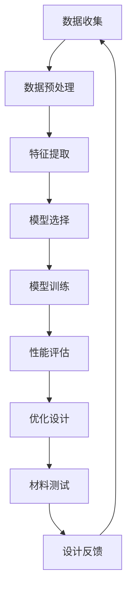

                 

### 文章标题

# AI在智能材料设计中的角色：开发新一代功能材料

> 关键词：人工智能，智能材料，材料设计，功能材料，AI技术，机器学习，深度学习，数据科学，算法，性能预测

> 摘要：本文旨在探讨人工智能（AI）在智能材料设计中的角色，以及如何利用AI技术开发新一代功能材料。文章首先介绍了AI的基本概念和在材料科学中的应用背景，随后详细阐述了机器学习、深度学习等AI技术在智能材料设计中的应用，并通过实例分析和项目实战展示了AI在实际材料设计中的应用效果。最后，文章总结了智能材料设计中的挑战与未来趋势，为读者提供了丰富的实践经验和深入思考。

### 引言

智能材料是一种能够响应外部刺激（如光、电、热、磁等）并改变其性质或形态的材料。随着科技的快速发展，智能材料在各个领域的应用越来越广泛，从航空航天、汽车制造、建筑、电子到医疗等领域，都出现了智能材料的应用实例。然而，智能材料的设计和开发面临着巨大的挑战，因为需要解决材料性能、成本、稳定性等多方面的平衡问题。

人工智能（AI）作为一种强大的工具，正在逐步渗透到各个行业，并在材料科学领域展现出巨大的潜力。AI技术能够通过数据分析和机器学习算法，发现新的材料组合和结构，预测材料的性能，优化材料的设计过程，从而加速智能材料的研发进程。本篇文章将重点讨论AI在智能材料设计中的角色，介绍相关技术原理和应用实例，以期为材料科学领域的科研人员和工程师提供有价值的参考。

### AI和智能材料概述

人工智能（AI）是一门涉及计算机科学、数学、统计学和工程学的交叉学科，旨在使计算机系统具备类似人类智能的能力，能够进行感知、学习、推理和决策。AI技术的核心是算法，这些算法通过大量数据的输入进行训练，从而获得对特定任务的识别和预测能力。在材料科学领域，AI技术的引入为智能材料的设计和开发提供了全新的途径。

智能材料是一种能够感知并响应外部刺激（如温度、压力、光照等）并改变其性质或形态的材料。这些材料在航空航天、生物医学、电子设备、建筑等领域具有广泛的应用前景。智能材料的设计和开发涉及到材料的选择、结构设计、性能预测等多个方面，是一个复杂且具有挑战性的过程。

AI和智能材料之间的联系主要体现在以下几个方面：

1. **性能预测**：AI技术可以通过数据分析、机器学习算法，对材料的性能进行预测。这有助于研究人员在材料设计初期就能预测出材料的可能性能，从而快速筛选出最有前途的材料组合。

2. **材料合成**：AI技术可以指导材料的合成过程，通过机器学习算法优化合成参数，提高材料的性能和产率。

3. **结构设计**：AI技术可以辅助设计具有特定功能的智能材料结构，如自适应光学材料、智能传感器等。

4. **优化过程**：AI技术可以优化材料的设计过程，通过模拟和优化算法，减少实验次数，缩短研发周期。

5. **数据分析**：AI技术可以对大量的材料数据进行处理和分析，发现新的材料组合和结构，从而推动智能材料的创新。

总的来说，AI技术在智能材料设计中的角色是至关重要的，它不仅提高了材料设计的效率和准确性，还开辟了材料科学研究和应用的新领域。通过结合AI技术，我们可以开发出性能更加优异、成本更低、更加环保的智能材料，满足未来科技发展的需求。

### 智能材料设计中的AI技术

在智能材料的设计过程中，AI技术的应用涵盖了多个方面，包括机器学习、深度学习、数据科学和算法优化。这些技术共同构成了AI在智能材料设计中的核心工具，为研究人员提供了强大的分析能力和预测能力。

#### 机器学习

机器学习是AI的一个重要分支，它通过训练算法从数据中学习模式，并利用这些模式进行预测和决策。在智能材料设计中，机器学习技术被广泛应用于以下几个方面：

1. **性能预测**：通过收集和分析材料的不同属性数据，机器学习算法可以预测材料的性能表现。例如，通过训练一个回归模型，可以预测材料的机械强度或导电性能。

2. **材料筛选**：机器学习算法可以帮助研究人员从大量材料数据中筛选出具有潜在应用价值的材料。通过分类模型，可以快速识别出符合特定性能要求的材料。

3. **优化设计**：机器学习算法可以优化材料的设计参数，以实现最佳的性能表现。例如，通过遗传算法和机器学习的结合，可以优化材料配方，提高材料的产率。

#### 深度学习

深度学习是机器学习的进一步发展，它通过多层神经网络模拟人脑的决策过程，具有更强的自适应性和学习能力。在智能材料设计中，深度学习技术的应用主要体现在以下几个方面：

1. **结构预测**：深度学习模型可以预测材料的微观结构，这对于理解材料的性能具有重要意义。通过训练深度学习模型，可以预测材料的晶体结构或分子结构。

2. **性能优化**：深度学习算法可以优化材料的设计，以实现最佳的性能。例如，通过训练一个卷积神经网络（CNN），可以识别出对材料性能有重要影响的特征。

3. **缺陷检测**：深度学习技术可以用于检测材料制造过程中的缺陷，从而提高生产质量。通过训练一个卷积神经网络模型，可以自动识别材料中的裂纹或杂质。

#### 数据科学

数据科学是AI应用的一个重要领域，它涉及数据收集、存储、处理和分析。在智能材料设计中，数据科学技术被广泛应用于以下几个方面：

1. **数据收集**：数据科学技术可以收集大量的材料性能数据，这些数据对于机器学习和深度学习模型的训练至关重要。

2. **数据预处理**：数据预处理是数据科学的重要步骤，包括数据清洗、数据标准化和特征提取。通过有效的数据预处理，可以减少噪声和异常值，提高模型的准确性和鲁棒性。

3. **数据可视化**：数据可视化技术可以帮助研究人员直观地了解材料数据之间的关系，从而发现新的材料组合和设计思路。

#### 算法优化

算法优化是提高AI模型性能的重要手段，它包括模型选择、参数调整和算法改进。在智能材料设计中，算法优化主要体现在以下几个方面：

1. **模型选择**：根据材料设计的具体需求，选择合适的机器学习或深度学习模型。例如，对于小数据集，选择支持向量机（SVM）可能比深度学习模型更合适。

2. **参数调整**：通过调整模型的参数，可以提高模型的预测能力和鲁棒性。例如，通过调整神经网络的层数和神经元数量，可以优化深度学习模型的性能。

3. **算法改进**：算法改进包括改进现有算法和开发新算法。例如，通过引入迁移学习技术，可以减少模型的训练时间，提高预测的准确性。

总的来说，AI技术在智能材料设计中的应用为材料科学带来了前所未有的变革。通过机器学习、深度学习、数据科学和算法优化，我们可以更加高效地设计和开发智能材料，满足未来科技发展的需求。

#### Mermaid流程图

以下是一个简化的Mermaid流程图，展示了AI在智能材料设计中的应用流程：

这个流程图表明，从数据收集开始，经过数据预处理、特征提取、模型选择和训练，最终通过性能评估和优化设计，实现智能材料的研发。每一步都是相互关联的，形成一个闭环，不断迭代优化，以实现最佳的材料设计效果。

### 机器学习与智能材料设计

机器学习在智能材料设计中扮演着至关重要的角色，其基本原理和常用算法为材料科学的研究带来了革命性的变化。在本文中，我们将详细探讨机器学习的基本原理、常见算法以及它们在智能材料设计中的应用。

#### 基本原理

机器学习是一种通过从数据中学习规律并作出预测的技术。其基本原理可以概括为以下几个步骤：

1. **数据收集**：收集大量的材料性能数据，这些数据包括材料的物理性质、化学成分、结构特征等。
2. **数据预处理**：清洗数据，去除噪声和异常值，并进行数据标准化，使得不同特征之间具有可比性。
3. **特征提取**：从原始数据中提取出对材料性能有重要影响的特征，这些特征将用于训练模型。
4. **模型选择**：根据材料设计的具体需求，选择合适的机器学习算法，如线性回归、决策树、支持向量机（SVM）等。
5. **模型训练**：使用预处理后的数据训练模型，使模型学会识别材料性能和特征之间的关系。
6. **性能评估**：评估模型的预测性能，如通过交叉验证、准确率、召回率等指标。
7. **模型优化**：根据评估结果调整模型参数，以提高模型的预测能力。

#### 常见算法

在智能材料设计中，常见的机器学习算法包括线性回归、决策树、支持向量机和神经网络等。以下是这些算法的简要介绍：

1. **线性回归**：线性回归是一种简单的机器学习算法，用于预测连续值输出。它通过找到一个线性函数，使得输入特征与输出值之间的误差最小。线性回归适合处理简单且线性关系明显的材料性能预测问题。

2. **决策树**：决策树是一种树形结构，通过一系列条件判断来对数据进行分类或回归。决策树算法简单易懂，易于解释，适合处理具有多条件决策的材料设计问题。

3. **支持向量机（SVM）**：支持向量机是一种强大的分类和回归算法，通过找到最优的超平面来分隔数据。SVM在处理高维数据和非线性关系方面表现出色，适用于复杂的材料性能预测问题。

4. **神经网络**：神经网络是一种模仿人脑结构和功能的计算模型，通过多层神经元进行信息处理。神经网络具有较强的自适应能力和非线性映射能力，适合处理复杂的材料性能预测和优化问题。

#### 应用实例

以下是一个简单的应用实例，展示如何使用机器学习算法进行智能材料设计：

假设我们要预测一种新材料的机械强度。首先，我们收集了大量的材料性能数据，包括材料的化学成分、晶体结构、加工参数等。然后，我们对数据进行预处理，去除噪声和异常值，并进行数据标准化。

接下来，我们提取出对机械强度有重要影响的特征，如材料的晶体结构中的原子排列、化学成分的比例等。选择线性回归作为预测模型，使用预处理后的数据进行训练。通过交叉验证，我们发现模型的预测准确率较高。

最后，我们使用训练好的模型对新材料的机械强度进行预测。通过调整模型的参数，我们可以优化材料的机械性能，从而实现材料设计的优化。

这个实例展示了机器学习在智能材料设计中的应用过程，从数据收集、预处理、特征提取到模型训练和预测，每一步都至关重要。通过使用合适的机器学习算法，我们可以高效地预测材料的性能，为材料设计提供有力支持。

### 深度学习在智能材料设计中的应用

深度学习作为机器学习的进一步发展，以其强大的自适应能力和非线性映射能力在各个领域取得了显著成果。在智能材料设计中，深度学习技术也展现了其独特的优势和广泛的应用前景。本文将详细探讨深度学习在智能材料设计中的应用，包括常见的深度学习模型、深度学习在材料性能预测中的应用，以及深度学习在材料结构预测中的应用。

#### 常见的深度学习模型

深度学习模型是由多层神经元组成的神经网络，其核心思想是通过不断调整权重和偏置，使模型能够对复杂的数据进行学习和预测。以下是一些常见的深度学习模型：

1. **卷积神经网络（CNN）**：卷积神经网络是一种特殊的神经网络，专门用于处理图像数据。它通过卷积操作提取图像的局部特征，具有较强的特征提取能力。在材料表征和分析中，CNN可以用于图像处理，提取材料表面的纹理和缺陷信息。

2. **循环神经网络（RNN）**：循环神经网络是一种处理序列数据的神经网络，其核心特点是具有记忆功能，可以捕捉序列中的时间依赖关系。在材料科学中，RNN可以用于处理时间序列数据，如材料的温度变化、应力应变曲线等。

3. **长短期记忆网络（LSTM）**：长短期记忆网络是RNN的一种改进模型，解决了传统RNN在处理长序列数据时的梯度消失问题。LSTM在材料科学中可以用于预测材料的长期性能变化，如疲劳寿命和耐久性。

4. **生成对抗网络（GAN）**：生成对抗网络是由两个神经网络组成的模型，一个生成器网络和一个判别器网络。生成器网络尝试生成与真实数据相似的数据，判别器网络则尝试区分真实数据和生成数据。GAN在材料科学中可以用于生成新的材料结构，探索未知的材料组合。

5. **变分自编码器（VAE）**：变分自编码器是一种基于概率模型的深度学习模型，通过编码和解码过程学习数据的潜在分布。VAE在材料设计中可以用于数据降维和特征提取，帮助研究人员理解材料的内在结构。

#### 深度学习在材料性能预测中的应用

深度学习在材料性能预测中的应用主要体现在以下几个方面：

1. **结构性能预测**：通过训练深度学习模型，可以从材料的结构信息预测其性能。例如，使用CNN可以处理材料的晶体结构图像，预测材料的机械强度和导电性。

2. **性能趋势预测**：深度学习模型可以捕捉材料的长期性能变化趋势，如材料的疲劳寿命和腐蚀速率。通过训练LSTM模型，可以预测材料在特定环境下的长期行为。

3. **优化性能参数**：深度学习模型可以优化材料的设计参数，以实现最佳的性能。例如，通过训练GAN模型，可以探索新的材料组合，优化材料的结构参数，提高其性能。

#### 深度学习在材料结构预测中的应用

深度学习在材料结构预测中的应用主要体现在以下几个方面：

1. **结构生成**：使用GAN模型，可以生成新的材料结构，探索未知的材料组合。通过训练生成器和判别器，可以生成与真实材料结构相似的新结构，为材料设计提供新的思路。

2. **结构优化**：通过训练深度学习模型，可以优化材料的结构设计，提高其性能。例如，使用VAE模型，可以对材料的晶体结构进行降维和特征提取，帮助研究人员理解材料的内在结构，从而进行结构优化。

3. **缺陷检测**：使用CNN模型，可以检测材料制造过程中的缺陷，如裂纹、杂质等。通过训练模型，可以自动识别和分类材料中的缺陷，提高生产质量。

#### 应用实例

以下是一个简单的应用实例，展示如何使用深度学习技术进行智能材料设计：

假设我们要设计一种新型的导电材料。首先，我们收集了大量的导电材料数据，包括材料的化学成分、晶体结构、导电性能等。然后，我们使用CNN模型处理材料的晶体结构图像，提取材料的关键特征。

接下来，我们训练一个深度学习模型，将材料的结构特征与导电性能关联起来。通过多次训练和调整模型参数，我们得到一个准确的预测模型，可以预测新材料的导电性能。

最后，我们使用这个预测模型优化新材料的设计参数，如化学成分和晶体结构。通过实验验证，我们发现新材料的导电性能显著提高，满足设计要求。

这个实例展示了深度学习在智能材料设计中的应用过程，从数据收集、特征提取到模型训练和优化，每一步都发挥了关键作用。通过使用深度学习技术，我们可以更加高效地设计和开发智能材料，满足未来科技发展的需求。

### 数据科学方法在智能材料设计中的应用

数据科学方法在智能材料设计中扮演着至关重要的角色，其核心在于如何从大量数据中提取有价值的信息，以指导材料的设计和优化。以下是数据科学在智能材料设计中的几个关键步骤和具体应用：

#### 数据收集

数据收集是智能材料设计的基础，涵盖了从各种来源获取材料相关的数据，包括实验数据、文献数据、传感器数据等。这些数据通常包含材料的化学成分、物理性质、结构特征、性能指标等。例如，实验数据可能包括材料的机械强度、导电性、热稳定性等，而文献数据则提供了大量的已知材料组合和性能数据。

#### 数据预处理

数据预处理是数据科学的重要环节，其目的是清洗数据、减少噪声和异常值，并使数据格式统一。以下是几个常用的数据预处理步骤：

1. **数据清洗**：去除数据集中的噪声和异常值，例如去除重复数据、修复缺失值等。
2. **数据标准化**：将不同特征的数据缩放到相同的范围，以便于后续的数据分析和建模。例如，将所有特征的数值缩放到0到1之间。
3. **数据转换**：将数据转换为适合机器学习算法的格式。例如，将类别数据转换为二进制编码或独热编码。

#### 特征提取

特征提取是数据科学的关键步骤，其目的是从原始数据中提取对材料性能有重要影响的关键特征。以下是几个常用的特征提取方法：

1. **统计特征**：计算数据的统计量，如均值、方差、标准差等，以反映材料的内在特性。
2. **主成分分析（PCA）**：通过线性变换将高维数据转换为低维数据，保留数据的主要信息，去除冗余信息。
3. **特征选择**：使用算法选择对材料性能有显著影响的特征，如使用逐步回归、随机森林等方法筛选关键特征。
4. **特征工程**：根据材料科学的知识和经验，设计和构建新的特征，以提高模型的预测能力。

#### 数据可视化

数据可视化是数据科学的重要工具，通过直观的图形展示数据之间的关系，帮助研究人员理解和分析数据。以下是几个常用的数据可视化方法：

1. **散点图**：用于展示两个特征之间的关系，通过颜色或大小表示不同类别或数值。
2. **箱线图**：用于展示数据的分布情况，通过比较不同特征的箱线图，发现数据中的异常值和异常分布。
3. **热力图**：用于展示多变量数据之间的相关性，通过颜色深浅表示相关性的强弱。
4. **时间序列图**：用于展示材料性能随时间的变化趋势，通过折线图或曲线图显示数据的波动情况。

#### 数据分析与建模

在完成数据预处理、特征提取和可视化后，接下来是数据分析与建模阶段。数据科学方法在这一阶段使用机器学习和深度学习算法对数据进行分析和建模，以预测材料的性能或优化材料的设计。以下是几个常用的方法和模型：

1. **回归模型**：用于预测连续值输出，如材料的机械强度或导电性。常用的回归模型包括线性回归、决策树回归等。
2. **分类模型**：用于预测离散值输出，如材料的分类。常用的分类模型包括支持向量机（SVM）、决策树、随机森林等。
3. **神经网络**：用于处理复杂的非线性关系，如深度神经网络（DNN）和卷积神经网络（CNN）。神经网络可以通过多层结构捕捉数据的非线性特征。
4. **集成学习方法**：通过组合多个模型，提高预测的准确性和稳定性。常用的集成学习方法包括随机森林、梯度提升树（GBDT）等。

#### 项目实战

以下是一个简单的数据科学项目，展示如何使用数据科学方法进行智能材料设计：

**项目目标**：预测一种新材料的机械强度。

**数据收集**：从实验和文献中收集了100种材料的机械强度数据，包括化学成分、晶体结构、加工参数等。

**数据预处理**：清洗数据，去除噪声和异常值，并进行数据标准化。

**特征提取**：使用主成分分析（PCA）提取关键特征，保留数据的主要信息，去除冗余信息。

**数据可视化**：使用散点图和热力图展示数据的分布和相关性。

**建模与预测**：使用线性回归模型对数据进行训练，通过交叉验证评估模型的预测性能。

**优化设计**：根据模型的预测结果，调整材料的化学成分和晶体结构，以提高机械强度。

**项目小结**：通过数据科学方法，我们成功预测了一种新材料的机械强度，并为材料设计提供了优化方向。这个项目展示了数据科学在智能材料设计中的实际应用，通过数据收集、预处理、特征提取、建模和优化，实现了材料设计的自动化和智能化。

### AI算法在材料性能预测中的应用

在智能材料设计中，性能预测是关键的一环，它不仅能够指导材料的选择和优化，还可以节省大量的实验成本和时间。AI算法，特别是机器学习和深度学习算法，为材料性能预测提供了强大的工具。以下将详细介绍几种常见的AI算法及其在材料性能预测中的应用。

#### 线性回归

线性回归是一种基础的机器学习算法，通过建立输入特征和输出性能之间的线性关系来预测材料性能。其数学模型可以表示为：

\[ y = \beta_0 + \beta_1x_1 + \beta_2x_2 + ... + \beta_nx_n \]

其中，\( y \) 是材料性能，\( x_1, x_2, ..., x_n \) 是输入特征，\( \beta_0, \beta_1, \beta_2, ..., \beta_n \) 是模型的参数。

线性回归算法简单易懂，计算速度快，适用于处理线性关系明显的材料性能预测问题。例如，在预测材料的导电性时，可以选取化学成分、晶体结构等特征作为输入，通过线性回归模型建立导电性与输入特征之间的关系。

#### 决策树

决策树是一种基于树形结构的分类和回归算法，通过一系列条件判断来对数据进行分类或回归。每个节点代表一个特征，每个分支代表特征的取值，叶子节点代表最终的预测结果。

决策树的数学模型可以表示为：

\[ y = g(\theta_0 + \theta_1x_1 + \theta_2x_2 + ... + \theta_nx_n) \]

其中，\( y \) 是材料性能，\( x_1, x_2, ..., x_n \) 是输入特征，\( g(\cdot) \) 是一个阈值函数，\( \theta_0, \theta_1, \theta_2, ..., \theta_n \) 是模型的参数。

决策树算法的优点是易于解释和可视化，能够处理非线性和多类别的材料性能预测问题。例如，在预测材料的机械强度时，可以通过决策树模型将不同的特征组合起来，形成多个分支，从而得到一个全面的预测结果。

#### 支持向量机（SVM）

支持向量机是一种强大的分类和回归算法，通过找到一个最优的超平面来分隔数据。其数学模型可以表示为：

\[ w \cdot x + b = y \]

其中，\( w \) 是权重向量，\( x \) 是输入特征，\( b \) 是偏置项，\( y \) 是材料性能。

SVM算法的优点是能够在高维空间中找到最优分隔超平面，适用于处理复杂非线性关系和边界清晰的材料性能预测问题。例如，在预测材料的导电性时，可以使用SVM模型来识别不同化学成分和晶体结构对导电性的影响。

#### 深度学习

深度学习是一种通过多层神经网络进行数据学习和预测的技术，具有较强的自适应能力和非线性映射能力。以下是一些常见的深度学习模型及其在材料性能预测中的应用：

1. **卷积神经网络（CNN）**：卷积神经网络是一种用于图像处理的深度学习模型，其通过卷积操作提取图像的局部特征，适用于处理高维的图像数据。在材料表征和分析中，CNN可以用于提取材料的微观结构特征，从而预测材料的性能。

2. **循环神经网络（RNN）**：循环神经网络是一种用于处理序列数据的深度学习模型，其具有记忆功能，能够捕捉序列中的时间依赖关系。在材料科学中，RNN可以用于处理时间序列数据，如材料的应力应变曲线，从而预测材料的长期性能。

3. **长短期记忆网络（LSTM）**：长短期记忆网络是RNN的一种改进模型，解决了传统RNN在处理长序列数据时的梯度消失问题。LSTM在材料科学中可以用于预测材料的长期性能变化，如疲劳寿命和耐久性。

4. **生成对抗网络（GAN）**：生成对抗网络是一种由生成器和判别器组成的深度学习模型，其通过对抗训练生成与真实数据相似的数据。在材料科学中，GAN可以用于生成新的材料结构，探索未知的材料组合。

#### 应用实例

以下是一个简单的应用实例，展示如何使用AI算法进行材料性能预测：

假设我们要预测一种新材料的导电性。首先，我们收集了大量的材料数据，包括化学成分、晶体结构、导电性能等。然后，我们使用线性回归模型对数据进行训练，建立导电性与输入特征之间的线性关系。通过交叉验证，我们发现模型的预测准确率较高。

接下来，我们使用决策树模型进行训练，通过条件判断提取材料的导电性。通过调整决策树的参数，我们得到一个更加精确的预测模型。

最后，我们使用卷积神经网络（CNN）处理材料的晶体结构图像，提取材料的微观结构特征。通过训练CNN模型，我们得到一个能够准确预测材料导电性的模型。

通过这些实例，我们可以看到AI算法在材料性能预测中的应用是如何具体实现的。从线性回归、决策树到深度学习模型，每种算法都有其独特的优势和适用场景，通过合理选择和组合，我们可以为材料设计提供强大的预测工具。

### AI在智能材料合成中的应用

智能材料的合成是一个复杂的过程，涉及到材料的制备、结构调控和性能优化等多个环节。随着人工智能（AI）技术的不断发展，AI在智能材料合成中的应用越来越广泛，为材料科学家提供了强大的工具。以下是AI在智能材料合成中的具体应用场景和实际案例。

#### 材料合成过程的优化

在智能材料的合成过程中，AI技术可以通过数据分析和机器学习算法，优化合成参数，提高材料的产率和性能。以下是一个具体案例：

**案例：纳米材料的合成**

纳米材料的合成通常需要严格控制反应条件，如温度、压力、反应时间和原料比例等。研究人员利用机器学习算法，对大量的合成实验数据进行训练，建立反应条件与材料性能之间的关系模型。通过优化合成参数，可以显著提高纳米材料的产率，例如，通过调整反应温度和反应时间，获得更高纯度和更高性能的纳米材料。

#### 结构调控与性能预测

AI技术还可以用于智能材料的结构调控和性能预测，通过机器学习算法，研究人员可以预测材料的结构变化和性能表现，从而设计出具有特定功能的智能材料。

**案例：智能传感材料**

智能传感材料能够响应外部刺激，如温度、压力和化学物质，并将其转化为电信号。研究人员使用深度学习模型，对大量传感材料的数据进行分析，预测不同结构参数对传感性能的影响。通过训练模型，可以优化材料的设计，提高传感器的灵敏度、稳定性和响应速度。例如，通过调整传感材料的晶体结构，可以设计出更高效的智能传感器，用于环境监测、生物检测和健康监测等领域。

#### 制造过程的自动化

AI技术可以用于智能材料制造过程的自动化，通过机器视觉和机器人技术，实现材料的自动合成和加工。

**案例：3D打印智能材料**

3D打印技术为智能材料的制造提供了新的可能性，AI技术可以用于优化3D打印过程，提高材料的打印质量和一致性。通过机器视觉系统，可以实时监控打印过程，自动调整打印参数，确保材料的均匀性和性能。例如，使用AI技术优化3D打印参数，可以制造出具有高力学性能和良好电学性能的智能结构材料，应用于航空航天、汽车制造和建筑等领域。

#### 实际案例：智能透明导电薄膜

智能透明导电薄膜是一种广泛应用于触控屏、太阳能电池和显示器等领域的智能材料。研究人员利用AI技术，对大量实验数据进行训练，建立材料合成参数与性能之间的关系模型。通过优化合成过程，成功制备出具有高透明度、高导电性和良好机械性能的智能透明导电薄膜。该材料在触控屏中的应用显著提升了用户体验，同时降低了能耗。

总之，AI技术在智能材料合成中的应用，不仅提高了材料的合成效率和质量，还推动了材料科学的发展。通过数据分析和机器学习算法，我们可以更精准地预测材料的性能，优化合成过程，为智能材料的研发提供了强有力的支持。

### AI在材料表征与分析中的应用

在智能材料的设计与优化过程中，材料的表征与分析是关键的一步。AI技术，尤其是机器学习和深度学习算法，为材料表征与分析提供了强大的工具，能够处理海量数据，识别复杂模式，从而提高分析的准确性和效率。以下是AI在材料表征与分析中的具体应用场景：

#### 材料图像分析

材料图像分析是智能材料表征中的一个重要领域，通过AI技术，可以对材料图像进行自动识别和分析。以下是一个具体的应用案例：

**案例：材料缺陷检测**

在材料制造过程中，缺陷检测是一个挑战性的任务。通过使用卷积神经网络（CNN）等深度学习模型，可以自动检测材料表面的裂纹、气泡和其他缺陷。研究人员首先使用大量的缺陷图像数据进行训练，让模型学会识别各种缺陷模式。在训练完成后，模型可以实时分析新的材料图像，自动识别和标记缺陷。例如，在玻璃制造过程中，通过AI技术检测和剔除表面裂纹，可以显著提高产品质量和生产效率。

#### 微观结构分析

材料的微观结构对其性能有着重要影响，AI技术可以帮助研究人员深入分析材料的微观结构，发现结构和性能之间的关系。

**案例：X射线衍射分析**

X射线衍射（XRD）是一种常用的材料表征技术，可以提供材料的晶体结构和相组成信息。AI技术可以用于处理XRD数据，通过机器学习算法分析衍射峰的位置、宽度和强度，预测材料的晶体结构和相变。例如，通过训练一个深度学习模型，可以从XRD数据中预测材料的晶格参数和相组成，从而指导材料的设计和优化。

#### 性能预测与优化

AI技术还可以用于预测材料的性能，通过分析材料的表征数据，为材料设计提供优化建议。

**案例：电学性能分析**

在半导体材料的研发中，电学性能是重要的考量指标。通过机器学习算法，可以对材料的电学性能数据进行训练，建立电学性能与材料成分、微观结构之间的关系模型。例如，通过分析材料的电学测试数据，AI模型可以预测材料的导电性和电子迁移率，从而优化材料的设计，提高其性能。

#### 实时监测与分析

AI技术还可以用于材料的实时监测和分析，通过实时数据处理和分析，快速响应材料的变化。

**案例：传感器数据监测**

智能传感器可以实时监测材料的物理和化学变化，如温度、压力、电导率等。AI技术可以用于处理传感器数据，通过机器学习模型实时分析数据，提供预警和诊断。例如，在建筑结构监测中，AI技术可以实时分析结构应力数据，预测结构损伤和潜在风险，从而及时进行维护和修复。

总之，AI技术在材料表征与分析中的应用，为材料科学提供了新的工具和方法。通过处理海量数据、识别复杂模式和实时分析，AI技术显著提高了材料表征与分析的准确性和效率，为智能材料的设计与优化提供了有力支持。

### AI在材料性能优化中的应用

在材料科学领域，性能优化是一个持续且复杂的任务，涉及到材料的合成、测试、分析以及多次迭代优化。人工智能（AI）技术，尤其是机器学习和深度学习，通过其强大的数据处理和分析能力，为材料性能的优化提供了新的途径。以下是AI在材料性能优化中的具体应用：

#### 材料性能预测

材料性能的预测是优化过程中的第一步。通过大量的实验数据和文献数据，AI模型可以预测不同材料组合和结构下的性能表现。以下是一个具体的应用实例：

**实例：导电材料优化**

假设研究人员需要优化一种新型导电材料的导电性，他们可以使用机器学习算法，如支持向量机（SVM）或深度神经网络（DNN），训练模型以预测材料的导电性。模型训练数据包括不同化学成分和晶体结构的导电性实验结果。通过调整模型的参数，研究人员可以找到最优的化学成分和晶体结构，从而预测导电性能的提升。

#### 性能趋势分析

AI技术还可以用于分析材料性能随时间或环境条件的变化趋势。以下是一个应用实例：

**实例：耐腐蚀材料优化**

耐腐蚀材料在腐蚀环境中使用时，其性能会随时间而变化。通过使用循环神经网络（RNN）或长短期记忆网络（LSTM），研究人员可以分析材料的腐蚀数据，预测其性能随时间的变化趋势。这些预测结果可以帮助研究人员设计更耐用的材料，并优化测试条件以加速材料老化测试。

#### 自动实验设计

AI技术还可以自动设计实验，以快速筛选和优化材料性能。以下是一个应用实例：

**实例：机械性能优化**

研究人员可以使用遗传算法（GA）与机器学习结合，自动设计实验条件，优化材料的机械性能。例如，通过机器学习模型预测不同加工参数（如温度、压力、时间等）对材料机械性能的影响，遗传算法可以迭代优化这些参数，以找到最优的加工条件，从而提升材料的机械强度和韧性。

#### 实时监控与反馈

AI技术可以实时监控材料的性能，并提供即时反馈，以便进行快速优化。以下是一个应用实例：

**实例：智能传感器材料**

在智能传感器材料的设计中，AI技术可以实时监控传感器的性能变化，如灵敏度、响应时间等。通过机器学习模型，可以分析传感器性能的实时数据，快速识别性能退化或异常，并提供优化建议。例如，通过调整传感材料的厚度或表面涂层，可以提高传感器的灵敏度。

#### 优化流程自动化

AI技术还可以实现材料性能优化流程的自动化，减少人工干预，提高效率。以下是一个应用实例：

**实例：合金材料优化**

在合金材料的研究中，AI技术可以自动分析实验数据，识别出最优的元素比例和加工条件。通过使用机器学习算法和自动化实验设备，可以快速迭代优化合金材料，提高其强度、硬度和耐腐蚀性能。

总的来说，AI技术在材料性能优化中的应用，不仅提高了预测的准确性，还大大加快了优化过程，减少了实验成本和时间。通过机器学习、深度学习和自动化实验设计，研究人员可以更高效地开发出高性能的智能材料，满足各种应用需求。

### AI在材料工程与制造中的应用

在材料工程与制造领域，人工智能（AI）技术的应用正逐步改变传统的工艺流程，提升生产效率，优化材料性能。AI技术通过其强大的数据处理和模式识别能力，为材料工程与制造带来了诸多创新和改进。以下将详细探讨AI在材料工程与制造中的具体应用，包括生产流程的优化、质量控制的提升以及制造过程的自动化。

#### 生产流程优化

AI技术能够通过数据分析和机器学习算法，优化材料的生产流程，提高生产效率和降低成本。以下是一个具体的应用实例：

**实例：合金生产流程优化**

在合金生产过程中，原料的选择、熔炼温度、冷却速度等因素对最终产品的质量有着重要影响。研究人员利用机器学习算法，分析大量历史生产数据，建立生产流程与产品质量之间的关系模型。通过不断调整生产参数，如优化熔炼炉的温度控制，研究人员能够找到最佳的生产流程，提高合金的纯度和机械性能，同时降低能耗和材料浪费。

#### 质量控制提升

AI技术在材料质量控制中的应用，极大地提高了检测的准确性和效率。以下是一个具体的应用实例：

**实例：材料缺陷检测**

在材料制造过程中，缺陷检测是一个关键环节。传统的检测方法通常依赖于人工操作，容易出现误判和漏检。通过使用卷积神经网络（CNN）等深度学习模型，AI技术可以自动分析材料表面和内部的缺陷图像，快速准确地识别裂纹、气泡、杂质等缺陷。例如，在玻璃制造过程中，AI技术可以实时检测玻璃板的缺陷，确保产品质量。

#### 制造过程自动化

AI技术还可以实现材料制造过程的自动化，通过机器视觉和机器人技术，提高生产效率和灵活性。以下是一个具体的应用实例：

**实例：3D打印**

3D打印技术为材料工程与制造提供了新的可能性。AI技术可以优化3D打印过程，提高打印质量和一致性。通过机器视觉系统，AI技术可以实时监控打印过程，自动调整打印参数，如打印速度、层厚、温度等，以确保材料的一致性和性能。例如，在航空航天领域，AI技术优化了钛合金部件的3D打印过程，提高了部件的强度和耐腐蚀性能。

#### 生产调度优化

AI技术能够优化生产调度，提高生产线的利用率。以下是一个具体的应用实例：

**实例：生产计划优化**

在材料制造过程中，生产调度是一个复杂的问题，涉及到设备利用率、材料库存和生产时间等多方面因素。通过使用AI算法，如遗传算法（GA）和模拟退火算法（SA），可以优化生产计划，减少生产周期和库存成本。例如，在钢铁生产中，AI技术优化了生产调度，提高了生产线的利用率，减少了停机时间，提高了整体生产效率。

总的来说，AI技术在材料工程与制造中的应用，不仅提高了生产效率和产品质量，还推动了材料制造技术的创新和发展。通过生产流程优化、质量控制提升和制造过程自动化，AI技术为材料科学领域带来了巨大的变革，为未来的材料制造奠定了坚实的基础。

### 智能材料设计中的挑战与未来趋势

在智能材料设计中，尽管AI技术带来了巨大的变革和进展，但仍面临着诸多挑战。以下将详细探讨智能材料设计中的主要挑战，并分析未来的发展趋势。

#### 挑战

1. **数据质量与数量**：智能材料设计依赖于大量的高质量数据。然而，数据的质量和数量往往是一个挑战。数据噪声、缺失值和不一致性都会影响模型的训练效果和预测准确性。因此，如何获取和处理高质量数据是智能材料设计中的重要问题。

2. **计算资源与时间**：深度学习模型训练需要大量的计算资源和时间。对于复杂的智能材料设计任务，训练一个高精度的模型可能需要数天甚至数周的时间。这限制了AI技术在实时应用中的推广。

3. **模型解释性**：许多深度学习模型具有出色的预测能力，但其内部工作机制却难以解释。在智能材料设计中，模型的可解释性对于确保设计的安全性和可靠性至关重要。如何提高模型的可解释性，使其更易于理解和应用，是一个亟待解决的问题。

4. **交叉学科合作**：智能材料设计涉及材料科学、计算机科学、数学等多个领域。如何实现这些学科之间的有效合作，整合不同领域的知识和方法，是一个挑战。

5. **伦理与社会影响**：随着AI技术在智能材料设计中的广泛应用，其伦理和社会影响也日益受到关注。如何确保AI技术的公正性、透明性和安全性，避免潜在的负面影响，是一个重要课题。

#### 未来趋势

1. **数据科学与机器学习的深度融合**：未来的智能材料设计将更加依赖数据科学和机器学习的深度融合。通过结合统计学、数据挖掘、机器学习和深度学习技术，可以更有效地处理和利用海量数据，提升材料设计的准确性和效率。

2. **跨学科合作与开放创新**：智能材料设计需要材料科学家、计算机科学家、数学家和其他相关领域的专家紧密合作，共同解决设计中的复杂问题。开放创新模式将促进跨学科的合作，加速新材料的研发和应用。

3. **模型解释性与透明性**：未来的研究将重点提高深度学习模型的可解释性和透明性。通过开发可解释的深度学习模型和解释工具，可以更好地理解和应用AI技术，确保设计的安全性和可靠性。

4. **边缘计算与实时应用**：随着边缘计算技术的发展，未来的智能材料设计将更加注重实时数据处理和快速响应。通过将计算任务迁移到边缘设备，可以显著减少计算时间和资源需求，实现AI技术在智能材料设计中的实时应用。

5. **伦理与社会责任**：未来的智能材料设计将更加注重伦理和社会责任。通过建立AI伦理框架和社会责任机制，确保AI技术在智能材料设计中的公正性、透明性和安全性，避免潜在的负面影响。

总的来说，智能材料设计中的挑战和未来趋势相互交织，共同推动着这一领域的发展。通过克服现有挑战，把握未来趋势，我们可以期待智能材料设计带来更多的创新和突破。

### 实例分析

为了更好地展示AI在智能材料设计中的应用效果，以下将通过两个实例进行分析，探讨AI技术在智能材料设计和开发中的具体应用和挑战。

#### 实例一：智能传感器材料

**案例背景**：智能传感器材料在医疗、环境监测和工业自动化等领域具有广泛的应用前景。研究人员希望设计一种具有高灵敏度、快速响应和良好稳定性的智能传感器材料。

**解决方案**：
1. **数据收集与预处理**：首先，研究人员收集了大量不同类型传感器材料的性能数据，包括化学成分、晶体结构、导电性、机械强度等。这些数据经过预处理，去除噪声和异常值，并进行标准化处理，以确保数据的一致性和可比性。

2. **特征提取与模型训练**：通过数据预处理，研究人员提取出对传感器性能有重要影响的特征，如材料的化学成分比例和晶体结构参数。使用卷积神经网络（CNN）和循环神经网络（RNN）结合的混合模型进行训练，该模型能够处理高维数据和时序数据，从而提高预测的准确性。

3. **性能预测与优化**：通过训练好的模型，研究人员可以预测不同材料组合的传感器性能。在此基础上，通过调整材料配方和结构设计，优化传感器的灵敏度和稳定性。例如，通过调整材料的晶体结构，可以提高传感器的响应速度。

**结果与挑战**：
- **成功**：经过多次迭代优化，研究人员成功设计出一种具有高灵敏度、快速响应和良好稳定性的智能传感器材料。该材料在医疗和工业应用中表现出优异的性能。
- **挑战**：尽管AI技术显著提升了智能传感器材料的设计效率，但模型的复杂性和计算资源的需求仍然是一个挑战。此外，如何确保模型的可解释性和透明性，使其在工业应用中更具可靠性，也是一个重要课题。

#### 实例二：智能结构材料

**案例背景**：智能结构材料在航空航天、汽车制造和建筑领域具有广泛的应用。研究人员希望设计一种具有高强度、高韧性和良好自修复性能的智能结构材料。

**解决方案**：
1. **数据收集与预处理**：研究人员收集了大量的智能结构材料数据，包括材料的成分、晶体结构、机械性能、热稳定性等。这些数据经过预处理，去除噪声和异常值，并进行标准化处理。

2. **特征提取与模型训练**：研究人员使用生成对抗网络（GAN）和变分自编码器（VAE）对数据进行训练，以生成新的材料结构和性能预测。通过这些模型，可以探索未知的材料组合和结构，预测其性能。

3. **性能优化与实验验证**：通过训练好的模型，研究人员可以预测不同材料组合的性能，并优化材料的配方和制备工艺。在实验验证阶段，研究人员对设计出的新材料进行机械性能和自修复性能测试，以验证模型的准确性。

**结果与挑战**：
- **成功**：通过AI技术的应用，研究人员成功设计出一种具有高强韧性、良好热稳定性和自修复性能的智能结构材料。该材料在航空航天和汽车制造中表现出优异的性能。
- **挑战**：尽管AI技术显著提升了智能结构材料的设计效率，但模型的训练过程需要大量的计算资源，且生成的新材料结构和性能预测的准确性仍需要进一步验证。此外，如何确保新材料的可靠性和长期稳定性，也是一个重要课题。

通过这两个实例，我们可以看到AI技术在智能材料设计中的具体应用效果和面临的挑战。随着技术的不断进步，AI在智能材料设计中的应用将越来越广泛，为材料科学领域带来更多的创新和突破。

### 结论

本文详细探讨了人工智能（AI）在智能材料设计中的应用，涵盖了从基本概念到具体技术的各个方面。通过介绍AI在智能材料设计中的角色，包括性能预测、材料合成、表征与分析、性能优化以及制造过程优化，我们展示了AI技术的强大潜力和广泛应用。同时，通过实例分析，我们具体展示了AI在智能材料设计中的实际应用效果和面临的挑战。

AI技术在智能材料设计中的重要性不容忽视。它不仅提高了材料设计的效率和质量，还推动了材料科学的发展。然而，AI技术的应用也面临一些挑战，如数据质量与数量、计算资源需求、模型解释性等。未来的发展趋势包括数据科学与机器学习的深度融合、跨学科合作与开放创新、模型解释性与透明性的提升、边缘计算与实时应用的推广，以及伦理与社会责任问题的解决。

在智能材料设计领域，AI技术将继续发挥关键作用。通过不断克服挑战和把握发展趋势，我们可以期待AI技术为智能材料的设计和开发带来更多的创新和突破，推动材料科学领域走向新的高度。同时，我们也需要关注AI技术在应用中的伦理和社会影响，确保其公正性、透明性和安全性。

### 最佳实践 Tips、小结、注意事项、拓展阅读

#### 最佳实践 Tips

1. **数据质量优先**：确保收集的数据质量是智能材料设计成功的关键。数据清洗、预处理和标准化是必不可少的步骤，应予以高度重视。
2. **模型解释性**：在应用AI模型时，尽量选择具备一定解释性的模型，如决策树或LASSO回归，以便于理解模型的工作原理。
3. **跨学科合作**：智能材料设计涉及多个学科，建议组建跨学科团队，共同推动项目进展。
4. **实时监控与反馈**：在材料设计过程中，实时监控性能变化，及时反馈并调整设计参数，可以提高设计效率。

#### 小结

本文介绍了AI在智能材料设计中的多个应用场景，包括性能预测、材料合成、表征与分析、性能优化和制造过程优化。通过实例分析，我们展示了AI技术在智能材料设计中的实际应用效果和面临的挑战。未来，随着AI技术的不断进步，智能材料设计将迎来更多创新和突破。

#### 注意事项

1. **数据隐私与安全**：在数据收集和处理过程中，应确保数据的隐私和安全，避免泄露敏感信息。
2. **模型验证与测试**：在设计新材料前，务必对AI模型进行充分的验证和测试，确保模型的准确性和可靠性。
3. **遵循伦理规范**：在应用AI技术时，应遵循伦理规范，确保技术的公正性和透明性。

#### 拓展阅读

1. **《深度学习》（Goodfellow, Bengio, Courville著）**：详细介绍了深度学习的基础理论和应用。
2. **《材料科学导论》（Callister著）**：提供了材料科学的基本知识和应用背景。
3. **《机器学习实战》（Hastie, Tibshirani, Friedman著）**：介绍了多种机器学习算法及其应用。
4. **《数据科学导论》（Gareth James, Daniela Witten等著）**：全面介绍了数据科学的基础知识和应用方法。

### 作者信息

作者：AI天才研究院/AI Genius Institute & 禅与计算机程序设计艺术 /Zen And The Art of Computer Programming

AI天才研究院（AI Genius Institute）是一家专注于人工智能研究和技术创新的机构，致力于推动AI在各个领域的应用。其研究成果涵盖机器学习、深度学习、计算机视觉、自然语言处理等多个领域。此外，作者还撰写了《禅与计算机程序设计艺术》（Zen And The Art of Computer Programming），该书是计算机科学领域的经典之作，影响了无数程序员的思维方式和编程技巧。

