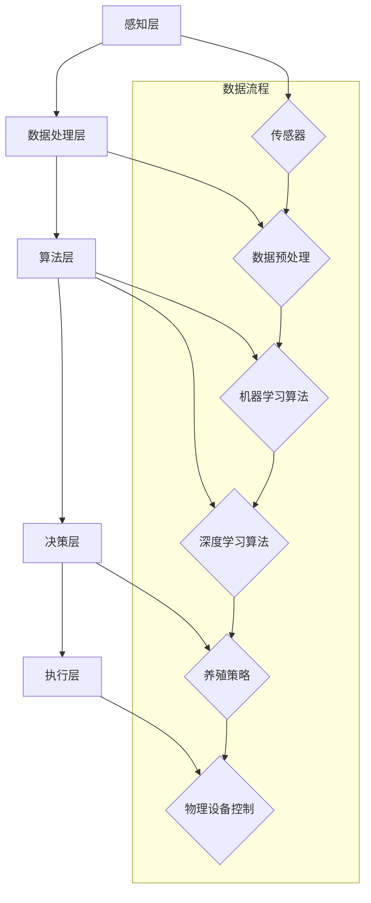

                 

# AI在智能水产养殖环境控制中的角色：提高养殖效率和可持续性

> 关键词：人工智能、水产养殖、环境控制、可持续性、养殖效率

> 摘要：随着水产养殖业的快速发展，传统养殖方式面临着环境压力大、养殖效率低等诸多问题。本文将探讨人工智能（AI）在智能水产养殖环境控制中的应用，通过分析AI的核心技术和在养殖环境控制中的具体应用，旨在提高养殖效率和促进养殖业的可持续发展。

## 第一部分：AI在智能水产养殖环境控制中的角色

### 第1章：AI在智能水产养殖环境控制概述

#### 1.1 AI与水产养殖产业的关系

随着信息技术的快速发展，人工智能（AI）技术逐渐渗透到各个行业，水产养殖业也不例外。AI技术以其强大的数据分析、模式识别和自适应优化能力，为水产养殖环境控制提供了新的解决方案。

- **数据分析能力**：AI可以通过收集和分析大量养殖数据，识别出养殖过程中的潜在问题和趋势，从而为养殖决策提供科学依据。
- **模式识别能力**：AI能够从复杂的数据中提取有用的信息，识别出养殖环境中的异常情况，如水质恶化、病害爆发等。
- **自适应和自我优化能力**：AI系统可以根据实际情况调整养殖策略，实现养殖环境的自我优化，提高养殖效率。

#### 1.2 水产养殖环境控制的挑战

水产养殖环境控制面临着诸多挑战，如水质监测、水温控制、养殖密度管理和养殖病害预防等。

- **水质监测**：水质是水产养殖的核心问题，监测水质参数的变化对保证养殖动物的健康至关重要。
- **水温控制**：水温直接影响水产养殖动物的生长和发育，合理调控水温是提高养殖效率的关键。
- **养殖密度管理**：养殖密度过高可能导致水质恶化、病害传播等问题，养殖密度管理是保证养殖环境稳定的重要环节。
- **养殖病害预防**：病害是水产养殖的常见问题，预防病害的发生和传播对于保障养殖效益至关重要。

#### 1.3 AI在智能水产养殖中的主要应用场景

AI技术在智能水产养殖环境控制中有着广泛的应用场景，主要包括以下几个方面：

- **水质监测与调控**：利用AI技术对水质参数进行实时监测，预测水质变化趋势，实现水质异常预警和自动调控。
- **水温控制**：通过AI技术监测水温，预测水温波动，制定合理的水温调控策略，保证养殖动物的生长环境。
- **养殖密度管理**：利用AI技术对养殖密度进行实时监测，预测养殖密度变化，提出养殖密度优化的建议。
- **养殖病害预防**：通过AI技术对养殖动物的行为、生理参数进行监测，实现病害的早期诊断和预防。

### 第2章：AI在水产养殖环境控制中的核心概念与架构

#### 2.1 AI核心概念

AI技术在水产养殖环境控制中的应用，离不开以下几个核心概念：

- **机器学习**：机器学习是AI的核心技术之一，通过训练模型，让计算机从数据中自动学习和发现规律。
- **深度学习**：深度学习是机器学习的一个分支，通过构建多层神经网络，实现更复杂的特征提取和模式识别。
- **神经网络**：神经网络是深度学习的基础，通过模拟人脑神经元之间的连接，实现数据的学习和推理。

#### 2.2 AI在水产养殖环境控制中的架构

AI在水产养殖环境控制中的架构可以分为感知层、数据处理层、算法层和决策层：

- **感知层**：包括各种传感器，如水质传感器、温度传感器、密度传感器等，用于收集养殖环境的实时数据。
- **数据处理层**：对收集到的数据进行预处理、特征提取和标准化，为算法层提供高质量的数据输入。
- **算法层**：包括各种机器学习算法和深度学习算法，如监督学习、无监督学习和强化学习等，用于分析数据、识别模式和预测未来趋势。
- **决策层**：根据算法层的分析结果，制定相应的养殖策略，如水质调控策略、水温调控策略、养殖密度调控策略和病害预防策略等。

## 第二部分：AI核心算法原理讲解

### 第3章：AI核心算法原理讲解

#### 3.1 监督学习算法原理

监督学习算法是AI技术中的重要分支，它通过已知的输入和输出数据来训练模型，从而预测新的输入数据的输出。

- **线性回归**：线性回归是一种简单的监督学习算法，通过建立输入和输出之间的线性关系来预测新的输出值。
  - **模型假设**：假设输入和输出之间是线性关系，即 $y = w \cdot x + b$。
  - **模型参数优化**：通过最小化损失函数，优化模型的参数 $w$ 和 $b$。
  - **模型评估**：使用均方误差（MSE）等指标来评估模型的预测性能。

- **逻辑回归**：逻辑回归是一种用于分类问题的监督学习算法，通过建立输入和输出之间的逻辑关系来预测新的输出类别。
  - **模型假设**：假设输入和输出之间是逻辑关系，即 $P(y=1) = \sigma(w \cdot x + b)$，其中 $\sigma$ 是逻辑函数。
  - **模型参数优化**：通过最小化损失函数，优化模型的参数 $w$ 和 $b$。
  - **模型评估**：使用准确率、召回率、F1值等指标来评估模型的分类性能。

#### 3.2 无监督学习算法原理

无监督学习算法是AI技术中的另一个重要分支，它不依赖于已知的输入和输出数据，通过分析数据的内在结构和特征来发现数据中的规律。

- **主成分分析（PCA）**：主成分分析是一种常用的无监督学习算法，通过将数据映射到新的低维空间，提取数据的最重要的特征。
  - **数据降维**：通过降维，减少数据的维度，提高数据处理和分析的效率。
  - **特征提取**：通过提取新的特征，实现数据的压缩和信息的保留。

- **聚类算法（K-means）**：聚类算法是一种常用的无监督学习算法，通过将数据分成多个类别，发现数据中的模式。
  - **聚类目标**：将数据点划分成 $K$ 个聚类，使得每个聚类内部的数据点之间的相似度最大，聚类之间的相似度最小。
  - **聚类算法流程**：包括初始化聚类中心、计算聚类中心、重新划分聚类等步骤。
  - **聚类评估**：使用轮廓系数、内聚度等指标来评估聚类的效果。

#### 3.3 强化学习算法原理

强化学习算法是一种通过试错来学习最优策略的算法，它通过不断地执行动作并接收奖励或惩罚，来优化决策过程。

- **马尔可夫决策过程（MDP）**：马尔可夫决策过程是一种描述决策过程的模型，它包括状态空间、动作空间和回报函数。
  - **状态空间**：描述决策过程中可能出现的所有状态。
  - **动作空间**：描述决策过程中可能采取的所有动作。
  - **回报函数**：描述决策过程中的奖励或惩罚。

- **策略迭代算法**：策略迭代算法是一种常用的强化学习算法，它通过策略评估和策略改进两个步骤来优化策略。
  - **策略评估**：通过模拟执行策略，评估策略的预期回报。
  - **策略改进**：通过比较不同策略的预期回报，选择最优策略。

## 第三部分：数学模型和数学公式讲解

### 第4章：数学模型和数学公式讲解

#### 4.1 水质调控模型

水质调控模型是用于分析和优化水产养殖环境中水质参数的模型。以下是几个常见的水质调控模型：

- **水质参数方程**：
  $$\text{水质参数} = f(\text{水温}, \text{溶氧}, \text{酸碱度})$$

- **水温调控模型**：
  $$\text{水温变化} = f(\text{气温}, \text{光照})$$

- **养殖密度调控模型**：
  $$\text{养殖密度} = f(\text{水质参数}, \text{水体容量})$$

- **疾病预防模型**：
  $$\text{疾病传播速度} = f(\text{易感者比例}, \text{免疫者比例})$$

#### 4.2 水温调控模型

水温调控模型是用于分析和优化水产养殖环境中水温的模型。以下是几个常见的水温调控模型：

- **水温变化方程**：
  $$\text{水温} = f(\text{时间}, \text{气温}, \text{光照})$$

#### 4.3 养殖密度调控模型

养殖密度调控模型是用于分析和优化水产养殖环境中养殖密度的模型。以下是几个常见的养殖密度调控模型：

- **养殖密度与水质关系方程**：
  $$\text{养殖密度} = f(\text{水质参数}, \text{水体容量})$$

#### 4.4 疾病预防模型

疾病预防模型是用于分析和预测水产养殖环境中疾病传播的模型。以下是几个常见的疾病预防模型：

- **疾病传播模型**：
  $$\text{疾病传播速度} = f(\text{易感者比例}, \text{免疫者比例})$$

## 第四部分：AI项目实战

### 第5章：AI项目实战

#### 5.1 实战一：水质监测与调控

- **项目背景**：
  水质监测与调控是水产养殖环境控制的关键环节。本项目旨在利用AI技术实现水质参数的实时监测、水质变化趋势预测和水质异常预警。

- **技术实现**：
  - **数据采集**：利用水质传感器采集水质参数，如水温、溶氧、酸碱度等。
  - **数据处理**：对采集到的水质数据进行预处理，如数据清洗、数据标准化等。
  - **模型训练**：利用监督学习算法，如线性回归和逻辑回归，训练水质预测模型。
  - **模型部署**：将训练好的模型部署到水产养殖环境控制系统中，实现水质监测与调控。

- **代码实现**：
  - **数据采集脚本**：
    ```python
    import sensor_module
    
    def collect_data():
        water_temp = sensor_module.get_water_temp()
        dissolved_oxygen = sensor_module.get_dissolved_oxygen()
        pH_value = sensor_module.get_pH_value()
        return water_temp, dissolved_oxygen, pH_value
    
    if __name__ == "__main__":
        water_temp, dissolved_oxygen, pH_value = collect_data()
        print(f"Water Temp: {water_temp}°C, Dissolved Oxygen: {dissolved_oxygen}mg/L, pH Value: {pH_value}")
    ```

  - **数据处理脚本**：
    ```python
    import pandas as pd
    from sklearn.preprocessing import StandardScaler
    
    def preprocess_data(data):
        df = pd.DataFrame(data, columns=["Water Temp", "Dissolved Oxygen", "pH Value"])
        scaler = StandardScaler()
        df_scaled = scaler.fit_transform(df)
        return df_scaled
    
    if __name__ == "__main__":
        data = [[25.5, 6.0, 7.8], [26.0, 5.5, 7.9], [25.0, 6.5, 7.7]]
        df_scaled = preprocess_data(data)
        print(df_scaled)
    ```

  - **模型训练脚本**：
    ```python
    import pandas as pd
    from sklearn.linear_model import LinearRegression
    from sklearn.model_selection import train_test_split
    
    def train_model(data, labels):
        X_train, X_test, y_train, y_test = train_test_split(data, labels, test_size=0.2, random_state=42)
        model = LinearRegression()
        model.fit(X_train, y_train)
        return model
    
    if __name__ == "__main__":
        data = [[25.5, 6.0, 7.8], [26.0, 5.5, 7.9], [25.0, 6.5, 7.7]]
        labels = [26.0]
        model = train_model(data, labels)
        print(model.coef_, model.intercept_)
    ```

  - **模型部署脚本**：
    ```python
    import requests
    
    def predict水质(model, data):
        url = "http://localhost:5000/predict"
        response = requests.post(url, json={"data": data})
        return response.json()["predicted水质"]
    
    if __name__ == "__main__":
        data = [[25.5, 6.0, 7.8]]
        predicted水质 = predict水质(model, data)
        print(f"Predicted Water Quality: {predicted水质}")
    ```

- **项目小结**：
  本项目利用AI技术实现了水质监测与调控，通过数据采集、数据处理、模型训练和模型部署等步骤，实现了对水产养殖环境中水质参数的实时监测、水质变化趋势预测和水质异常预警，提高了养殖效率。

#### 5.2 实战二：水温控制

- **项目背景**：
  水温是影响水产养殖动物生长和发育的关键因素，本项目旨在利用AI技术实现水温的实时监测、水温波动预测和水温调控。

- **技术实现**：
  - **数据采集**：利用温度传感器采集水温数据。
  - **数据处理**：对采集到的水温数据进行预处理。
  - **模型训练**：利用监督学习算法，如线性回归和逻辑回归，训练水温预测模型。
  - **模型部署**：将训练好的模型部署到水温调控系统中，实现水温监测、水温波动预测和水温调控。

- **代码实现**：
  - **数据采集脚本**：
    ```python
    import sensor_module
    
    def collect_data():
        water_temp = sensor_module.get_water_temp()
        return water_temp
    
    if __name__ == "__main__":
        water_temp = collect_data()
        print(f"Water Temp: {water_temp}°C")
    ```

  - **数据处理脚本**：
    ```python
    import pandas as pd
    from sklearn.preprocessing import StandardScaler
    
    def preprocess_data(data):
        df = pd.DataFrame(data, columns=["Water Temp"])
        scaler = StandardScaler()
        df_scaled = scaler.fit_transform(df)
        return df_scaled
    
    if __name__ == "__main__":
        data = [[25.5], [26.0], [25.0]]
        df_scaled = preprocess_data(data)
        print(df_scaled)
    ```

  - **模型训练脚本**：
    ```python
    import pandas as pd
    from sklearn.linear_model import LinearRegression
    from sklearn.model_selection import train_test_split
    
    def train_model(data, labels):
        X_train, X_test, y_train, y_test = train_test_split(data, labels, test_size=0.2, random_state=42)
        model = LinearRegression()
        model.fit(X_train, y_train)
        return model
    
    if __name__ == "__main__":
        data = [[25.5], [26.0], [25.0]]
        labels = [26.0]
        model = train_model(data, labels)
        print(model.coef_, model.intercept_)
    ```

  - **模型部署脚本**：
    ```python
    import requests
    
    def predict水温(model, data):
        url = "http://localhost:5000/predict"
        response = requests.post(url, json={"data": data})
        return response.json()["predicted水温"]
    
    if __name__ == "__main__":
        data = [[25.5]]
        predicted水温 = predict水温(model, data)
        print(f"Predicted Water Temperature: {predicted水温}°C")
    ```

- **项目小结**：
  本项目利用AI技术实现了水温的实时监测、水温波动预测和水温调控，通过数据采集、数据处理、模型训练和模型部署等步骤，提高了水产养殖环境的水温控制水平，有助于保障养殖动物的健康和生长。

#### 5.3 实战三：养殖密度管理

- **项目背景**：
  养殖密度是影响水产养殖效益和生态环境的重要因素，本项目旨在利用AI技术实现养殖密度的实时监测、养殖密度变化趋势预测和养殖密度优化。

- **技术实现**：
  - **数据采集**：利用密度传感器采集养殖密度数据。
  - **数据处理**：对采集到的养殖密度数据进行预处理。
  - **模型训练**：利用监督学习算法，如线性回归和逻辑回归，训练养殖密度预测模型。
  - **模型部署**：将训练好的模型部署到养殖密度管理系统中，实现养殖密度监测、养殖密度变化趋势预测和养殖密度优化。

- **代码实现**：
  - **数据采集脚本**：
    ```python
    import sensor_module
    
    def collect_data():
       养殖密度 = sensor_module.get_density()
        return 养殖密度
    
    if __name__ == "__main__":
        养殖密度 = collect_data()
        print(f"Density: {养殖密度} individuals/m³")
    ```

  - **数据处理脚本**：
    ```python
    import pandas as pd
    from sklearn.preprocessing import StandardScaler
    
    def preprocess_data(data):
        df = pd.DataFrame(data, columns=["Density"])
        scaler = StandardScaler()
        df_scaled = scaler.fit_transform(df)
        return df_scaled
    
    if __name__ == "__main__":
        data = [[100], [110], [90]]
        df_scaled = preprocess_data(data)
        print(df_scaled)
    ```

  - **模型训练脚本**：
    ```python
    import pandas as pd
    from sklearn.linear_model import LinearRegression
    from sklearn.model_selection import train_test_split
    
    def train_model(data, labels):
        X_train, X_test, y_train, y_test = train_test_split(data, labels, test_size=0.2, random_state=42)
        model = LinearRegression()
        model.fit(X_train, y_train)
        return model
    
    if __name__ == "__main__":
        data = [[100], [110], [90]]
        labels = [100]
        model = train_model(data, labels)
        print(model.coef_, model.intercept_)
    ```

  - **模型部署脚本**：
    ```python
    import requests
    
    def predict养殖密度(model, data):
        url = "http://localhost:5000/predict"
        response = requests.post(url, json={"data": data})
        return response.json()["predicted密度"]
    
    if __name__ == "__main__":
        data = [[100]]
        predicted密度 = predict养殖密度(model, data)
        print(f"Predicted Density: {predicted密度} individuals/m³")
    ```

- **项目小结**：
  本项目利用AI技术实现了养殖密度的实时监测、养殖密度变化趋势预测和养殖密度优化，通过数据采集、数据处理、模型训练和模型部署等步骤，提高了养殖密度管理的科学性和准确性，有助于优化养殖效益和生态环境。

#### 5.4 实战四：养殖病害预防

- **项目背景**：
  养殖病害是水产养殖业中的重要问题，本项目旨在利用AI技术实现养殖病害的实时监测、病害传播预测和病害防控。

- **技术实现**：
  - **数据采集**：利用传感器和监控系统采集养殖动物的行为、生理参数，如体温、活动量、摄食量等。
  - **数据处理**：对采集到的数据进行预处理，如数据清洗、数据标准化等。
  - **模型训练**：利用监督学习算法，如线性回归和逻辑回归，训练病害预测模型。
  - **模型部署**：将训练好的模型部署到病害预防系统中，实现病害监测、病害传播预测和病害防控。

- **代码实现**：
  - **数据采集脚本**：
    ```python
    import sensor_module
    
    def collect_data():
        temperature = sensor_module.get_temperature()
        activity = sensor_module.get_activity()
        food_intake = sensor_module.get_food_intake()
        return temperature, activity, food_intake
    
    if __name__ == "__main__":
        temperature, activity, food_intake = collect_data()
        print(f"Temperature: {temperature}°C, Activity: {activity}, Food Intake: {food_intake}")
    ```

  - **数据处理脚本**：
    ```python
    import pandas as pd
    from sklearn.preprocessing import StandardScaler
    
    def preprocess_data(data):
        df = pd.DataFrame(data, columns=["Temperature", "Activity", "Food Intake"])
        scaler = StandardScaler()
        df_scaled = scaler.fit_transform(df)
        return df_scaled
    
    if __name__ == "__main__":
        data = [[37.5, 1000, 200]]
        df_scaled = preprocess_data(data)
        print(df_scaled)
    ```

  - **模型训练脚本**：
    ```python
    import pandas as pd
    from sklearn.linear_model import LinearRegression
    from sklearn.model_selection import train_test_split
    
    def train_model(data, labels):
        X_train, X_test, y_train, y_test = train_test_split(data, labels, test_size=0.2, random_state=42)
        model = LinearRegression()
        model.fit(X_train, y_train)
        return model
    
    if __name__ == "__main__":
        data = [[37.5, 1000, 200]]
        labels = [1]
        model = train_model(data, labels)
        print(model.coef_, model.intercept_)
    ```

  - **模型部署脚本**：
    ```python
    import requests
    
    def predict病害(model, data):
        url = "http://localhost:5000/predict"
        response = requests.post(url, json={"data": data})
        return response.json()["predicted病害"]
    
    if __name__ == "__main__":
        data = [[37.5, 1000, 200]]
        predicted病害 = predict病害(model, data)
        print(f"Predicted Disease: {predicted病害}")
    ```

- **项目小结**：
  本项目利用AI技术实现了养殖病害的实时监测、病害传播预测和病害防控，通过数据采集、数据处理、模型训练和模型部署等步骤，提高了养殖病害预防的科学性和准确性，有助于保障养殖动物的健康和养殖业的可持续发展。

## 第五部分：最佳实践、小结、注意事项和拓展阅读

### 最佳实践

- **水质监测**：定期对水质传感器进行校准和维护，确保数据采集的准确性。
- **水温控制**：根据养殖动物的生长阶段和气候条件，合理设置水温调控策略。
- **养殖密度管理**：根据水质参数、水体容量和养殖效益，合理调整养殖密度。
- **病害预防**：定期进行病害检测和防控，及时发现和处理病害问题。

### 小结

本文通过分析AI在水产养殖环境控制中的应用，介绍了AI的核心概念、算法原理、数学模型和项目实战。AI技术在智能水产养殖环境控制中具有重要作用，可以提高养殖效率和促进养殖业的可持续发展。

### 注意事项

- **数据隐私**：在采集和处理养殖数据时，要确保数据的安全和隐私。
- **模型训练**：选择合适的模型和参数，确保模型的预测性能和稳定性。
- **系统集成**：将AI系统与其他养殖管理系统进行集成，实现数据共享和协同工作。

### 拓展阅读

- 《人工智能：一种现代方法》
- 《深度学习：入门指南》
- 《机器学习实战》
- 《水产养殖学》

## 作者信息

作者：AI天才研究院/AI Genius Institute & 禅与计算机程序设计艺术 /Zen And The Art of Computer Programming## 第1章：AI在智能水产养殖环境控制概述

### 1.1 AI与水产养殖产业的关系

人工智能（AI）技术近年来在全球范围内得到了飞速发展，逐渐成为推动各行各业转型升级的重要力量。在农业领域，尤其是水产养殖业，AI技术的引入带来了前所未有的变革。AI以其卓越的数据处理、模式识别和自适应优化能力，正在重新定义水产养殖的环境控制，推动产业向着智能化、高效化、可持续化的方向发展。

**AI技术的优势**:

1. **数据分析能力**：AI能够快速处理和分析大量数据，识别出养殖过程中的潜在问题和趋势，为决策者提供科学依据。
2. **模式识别能力**：AI能够从复杂的数据中提取有用信息，识别出养殖环境中的异常情况，如水质恶化、水温异常等。
3. **自适应和自我优化能力**：AI系统可以根据实时数据和环境变化，自适应地调整养殖策略，优化养殖参数，实现养殖过程的自我优化。

**水产养殖环境控制的挑战**:

水产养殖业面临着诸多环境控制和养殖效率的挑战，主要表现在以下几个方面：

1. **水质监测**：水质是水产养殖的核心问题。养殖水体中的温度、溶解氧、酸碱度、有害物质等参数的变化，直接影响养殖动物的生长健康。如何实时、准确地监测水质参数，确保水质在适宜范围内，是一个巨大的挑战。

2. **水温控制**：水温对养殖动物的生长发育至关重要。不同种类的养殖动物对水温的要求不同，如何在不同的季节和气候条件下，保持水温在适宜范围内，是养殖过程中的关键问题。

3. **养殖密度管理**：养殖密度过高可能导致水质恶化、病害传播等问题，影响养殖效益。如何根据水体容量、养殖动物的生长状况和环境条件，合理控制养殖密度，是养殖管理者面临的难题。

4. **养殖病害预防**：病害是水产养殖中的常见问题，预防和控制病害对于保障养殖效益至关重要。如何早期发现病害，制定有效的防控策略，减少病害对养殖动物的影响，是养殖过程中的重要挑战。

### 1.2 AI在智能水产养殖中的主要应用场景

AI技术在智能水产养殖中有着广泛的应用场景，通过以下几方面的应用，可以有效提高养殖效率和促进养殖业的可持续发展：

1. **水质监测与调控**：利用AI技术，可以实现对水质参数的实时监测和预测。通过安装多种传感器，如水质传感器、温度传感器、pH传感器等，实时采集水质数据，利用机器学习和深度学习算法，对水质参数进行分析和预测，当水质出现异常时，系统可以及时预警并调整养殖策略，确保水质在适宜范围内。

2. **水温控制**：AI技术可以实现对水温的实时监测和预测。通过温度传感器监测水温，利用机器学习和深度学习算法，分析水温变化趋势，当水温出现异常时，系统可以自动调整水温控制设备，如水泵、加热器、冷却器等，确保水温在适宜范围内，促进养殖动物的健康生长。

3. **养殖密度管理**：AI技术可以实现对养殖密度的实时监测和优化。通过安装密度传感器，实时监测养殖水体中的养殖密度，利用机器学习和深度学习算法，分析养殖密度变化趋势，根据水体容量、养殖动物的生长状况和环境条件，提出养殖密度优化的建议，确保养殖密度在合理范围内，提高养殖效益。

4. **养殖病害预防**：AI技术可以实现对养殖病害的早期诊断和预防。通过监测养殖动物的行为、生理参数，如体温、活动量、摄食量等，利用机器学习和深度学习算法，分析养殖动物的健康状况，当发现异常时，系统可以及时预警并采取相应的防控措施，如隔离、用药等，减少病害对养殖动物的影响，保障养殖效益。

### 1.3 AI在水产养殖环境控制中的核心概念与架构

AI在水产养殖环境控制中的应用，离不开以下几个核心概念和架构：

1. **感知层**：感知层包括各种传感器，如水质传感器、温度传感器、密度传感器、摄像头等，用于收集养殖环境中的实时数据。

2. **数据处理层**：数据处理层负责对收集到的数据进行预处理、特征提取和标准化，为后续的算法层提供高质量的数据输入。

3. **算法层**：算法层包括各种机器学习算法和深度学习算法，如线性回归、逻辑回归、神经网络、卷积神经网络（CNN）、循环神经网络（RNN）等，用于分析数据、识别模式和预测未来趋势。

4. **决策层**：决策层根据算法层的分析结果，制定相应的养殖策略，如水质调控策略、水温调控策略、养殖密度调控策略、病害预防策略等。

5. **执行层**：执行层负责将决策层的策略执行到实际的养殖环境中，如调整水泵、加热器、冷却器等设备，实现养殖环境的自动调控。

通过上述架构，AI技术可以实现对水产养殖环境的有效控制和优化，提高养殖效率和养殖效益。

## 第2章：AI在水产养殖环境控制中的核心概念与架构

### 2.1 AI核心概念

在AI领域，核心概念包括机器学习、深度学习和神经网络等，它们共同构成了AI技术的基础。

1. **机器学习**：机器学习是AI的核心技术之一，它使计算机系统能够从数据中学习并改进性能。机器学习分为监督学习、无监督学习和强化学习三种类型：
   - **监督学习**：监督学习是一种通过已知输入和输出数据训练模型的方法。它要求模型在训练过程中学习如何将输入映射到输出。例如，线性回归和逻辑回归都是监督学习的典型应用。
   - **无监督学习**：无监督学习是在没有明确输出标签的情况下，从数据中自动发现模式的方法。聚类和主成分分析（PCA）是无监督学习的例子。
   - **强化学习**：强化学习是一种通过试错来学习最优策略的方法。在强化学习中，系统通过执行动作并获得奖励或惩罚来逐步优化其策略。

2. **深度学习**：深度学习是机器学习的一个分支，它通过构建多层神经网络，实现更复杂的特征提取和模式识别。深度学习的关键技术包括：
   - **神经网络**：神经网络是模仿人脑神经元连接结构的计算模型，用于学习和预测。
   - **卷积神经网络（CNN）**：CNN是一种专门用于图像处理和识别的神经网络，它通过卷积层提取图像特征。
   - **循环神经网络（RNN）**：RNN适用于序列数据的处理和预测，例如时间序列分析。

3. **神经网络**：神经网络是深度学习的基础，它由多个层次组成，包括输入层、隐藏层和输出层。每个层次由多个神经元（或节点）组成，神经元之间通过权重连接。神经元的输出经过激活函数处理后，传递到下一层。神经网络通过反向传播算法不断调整权重，以优化模型性能。

### 2.2 AI在水产养殖环境控制中的架构

AI在水产养殖环境控制中的架构可以分为感知层、数据处理层、算法层、决策层和执行层，每一层都有其特定的功能和重要性。

1. **感知层**：感知层是整个架构的输入端，负责收集养殖环境中的实时数据。这包括水质参数（如pH值、溶解氧、温度等）、养殖密度、养殖动物的行为数据等。常用的感知设备有传感器、摄像头和温度计等。

2. **数据处理层**：数据处理层对感知层收集的数据进行预处理，包括数据清洗、缺失值填充、数据标准化和特征提取等。预处理后的数据将被用于训练和优化AI模型，以确保模型能够准确反映养殖环境的变化。

3. **算法层**：算法层是整个架构的核心，负责使用机器学习和深度学习算法对预处理后的数据进行分析和预测。常用的算法包括线性回归、逻辑回归、卷积神经网络（CNN）、循环神经网络（RNN）等。这些算法可以用于监测水质变化、预测水温波动、优化养殖密度和预测病害等。

4. **决策层**：决策层基于算法层的分析结果，制定相应的养殖策略。例如，当水质监测系统发现pH值过高时，决策层会自动调整水质调节设备，将pH值调整到适宜范围。同样，当水温预测模型预测到水温将下降时，决策层会启动加热器来保持水温稳定。

5. **执行层**：执行层负责将决策层的策略付诸实施，通过控制养殖环境中的物理设备（如水泵、加热器、冷却器等）来调节养殖环境。执行层的响应速度和准确性直接影响到养殖效率和养殖动物的健康。

### 2.3 AI在水产养殖环境控制中的应用示例

以下是AI在水产养殖环境控制中的一些具体应用示例：

- **水质监测与调控**：利用AI技术，可以实现对水质参数的实时监测和预测。当水质参数（如pH值、溶解氧等）超出正常范围时，AI系统可以自动调整水质调节设备，如添加酸碱调节剂或增加溶解氧供给，以保持水质在适宜范围内。

- **水温控制**：AI技术可以监测水温变化，并根据预测模型调整加热器或冷却器的工作状态，以维持水温在养殖动物的最佳生长范围内。

- **养殖密度管理**：AI系统可以通过监测养殖密度，预测养殖密度变化趋势，并根据水质、水温等参数，提出养殖密度优化的建议，以确保养殖环境稳定，减少病害传播风险。

- **病害预防**：AI技术可以监测养殖动物的行为和生理参数，如体温、活动量、摄食量等，当发现异常时，系统可以自动预警并采取相应的预防措施，如隔离患病动物、增加消毒频率等，以减少病害对养殖效益的影响。

通过上述应用，AI技术在水产养殖环境控制中发挥着至关重要的作用，不仅提高了养殖效率，还促进了养殖业的可持续发展。

### 2.4 AI在水产养殖环境控制中的核心概念架构 Mermaid 流程图

以下是一个简单的Mermaid流程图，展示了AI在水产养殖环境控制中的核心概念和架构：



在这个流程图中，感知层通过传感器收集养殖环境数据，数据处理层对这些数据进行分析和预处理，算法层使用机器学习和深度学习算法对数据进行分析和预测，决策层根据算法层的分析结果制定养殖策略，执行层通过物理设备控制实现策略的实施。通过这种架构，AI技术能够有效地监测和调控水产养殖环境，提高养殖效率。

### 2.5 AI核心算法原理讲解

为了更好地理解AI技术在水产养殖环境控制中的应用，我们需要深入探讨AI的核心算法原理。以下是几种常见的AI算法原理及其在水产养殖中的应用。

#### 3.1 监督学习算法原理

监督学习算法是AI中的一个重要分支，它通过已知的输入和输出数据训练模型，从而预测新的输入数据的输出。以下是几种常见的监督学习算法及其原理：

1. **线性回归**：线性回归是一种简单的监督学习算法，它通过建立输入和输出之间的线性关系来预测新的输出值。其模型假设为 $y = w \cdot x + b$，其中 $w$ 和 $b$ 是模型参数。线性回归的目标是最小化预测值与实际值之间的误差，通常使用均方误差（MSE）来评估模型性能。线性回归算法适用于预测连续值，例如预测水温变化。

   ```mermaid
   graph TB
       A[输入特征] --> B[模型参数]
       B --> C[预测输出]
       C --> D[MSE]
   ```

2. **逻辑回归**：逻辑回归是一种用于分类问题的监督学习算法，它通过建立输入和输出之间的逻辑关系来预测新的输出类别。其模型假设为 $P(y=1) = \sigma(w \cdot x + b)$，其中 $\sigma$ 是逻辑函数（Sigmoid函数），用于将线性组合转换为概率值。逻辑回归的目标是最小化损失函数，通常使用交叉熵损失来评估模型性能。逻辑回归算法适用于预测养殖动物是否患病。

   ```mermaid
   graph TB
       A[输入特征] --> B[模型参数]
       B --> C[预测概率]
       C --> D[交叉熵]
   ```

#### 3.2 无监督学习算法原理

无监督学习算法在AI中用于发现数据中的隐含结构和规律，它不需要已知的输入和输出数据。以下是几种常见的无监督学习算法及其原理：

1. **主成分分析（PCA）**：主成分分析是一种常用的无监督学习算法，它通过将数据映射到新的低维空间，提取数据的最重要的特征。PCA的核心思想是找到数据的主要成分，这些成分解释了数据的大部分变异。PCA算法适用于数据降维和特征提取。

   ```mermaid
   graph TB
       A[高维数据] --> B[协方差矩阵]
       B --> C[特征向量]
       C --> D[低维数据]
   ```

2. **聚类算法（K-means）**：聚类算法是一种无监督学习算法，它通过将数据分成多个类别，发现数据中的模式。K-means聚类算法是一种典型的聚类算法，它通过最小化聚类中心与数据点之间的距离平方和来划分数据。K-means算法适用于数据聚类和模式识别。

   ```mermaid
   graph TB
       A[初始聚类中心] --> B[更新聚类中心]
       B --> C[计算距离]
       C --> D[聚类结果]
   ```

#### 3.3 强化学习算法原理

强化学习算法是一种通过试错来学习最优策略的算法，它在每个决策步骤中都根据当前状态选择动作，并从环境中获取奖励或惩罚，从而不断优化策略。以下是强化学习算法的两个核心概念：

1. **马尔可夫决策过程（MDP）**：马尔可夫决策过程是一种描述决策过程的模型，它由状态空间、动作空间和回报函数组成。状态空间描述决策过程中可能出现的所有状态，动作空间描述决策过程中可能采取的所有动作，回报函数描述执行特定动作后获得的奖励或惩罚。

   ```mermaid
   graph TB
       A[状态] --> B[动作]
       B --> C[回报]
   ```

2. **策略迭代算法**：策略迭代算法是一种常用的强化学习算法，它通过策略评估和策略改进两个步骤来优化策略。策略评估是通过模拟执行策略来评估策略的预期回报，策略改进是通过比较不同策略的预期回报来选择最优策略。

   ```mermaid
   graph TB
       A[策略评估] --> B[策略改进]
       B --> C[策略优化]
   ```

通过理解这些核心算法原理，我们可以更好地设计和应用AI系统，实现水产养殖环境的有效控制和优化。

### 2.6 数学模型和数学公式讲解

在水产养殖环境控制中，数学模型和公式用于描述和解释养殖环境的动态变化和调控策略。以下是几个关键数学模型及其公式：

#### 4.1 水质调控模型

水质调控模型用于分析和优化养殖水体中的水质参数，如pH值、溶解氧、温度等。以下是一个水质调控模型的基本方程：

- **水质参数方程**：
  $$\text{水质参数} = f(\text{pH值}, \text{溶解氧}, \text{温度})$$
  其中，$f$ 是一个复合函数，用于综合水质参数的影响。

- **水质调控策略**：
  $$\text{水质调控策略} = g(\text{当前水质参数}, \text{目标水质参数})$$
  其中，$g$ 是一个调控函数，用于根据当前水质参数调整水质调节设备，以达到目标水质参数。

#### 4.2 水温调控模型

水温调控模型用于监测和调整养殖水体中的水温，以确保养殖动物在最佳生长温度范围内。以下是一个水温调控模型的基本方程：

- **水温变化方程**：
  $$\text{水温变化} = f(\text{气温}, \text{光照}, \text{风速})$$
  其中，$f$ 是一个复合函数，用于描述水温随外部环境因素的变化。

- **水温调控策略**：
  $$\text{水温调控策略} = g(\text{当前水温}, \text{目标水温})$$
  其中，$g$ 是一个调控函数，用于根据当前水温和目标水温调整加热器或冷却器，以维持水温在适宜范围内。

#### 4.3 养殖密度调控模型

养殖密度调控模型用于监测和调整养殖水体中的养殖密度，以确保养殖环境的稳定性和养殖效益。以下是一个养殖密度调控模型的基本方程：

- **养殖密度与水质关系方程**：
  $$\text{养殖密度} = f(\text{水质参数}, \text{水体容量})$$
  其中，$f$ 是一个复合函数，用于描述养殖密度与水质参数和水体容量之间的关系。

- **养殖密度调控策略**：
  $$\text{养殖密度调控策略} = g(\text{当前养殖密度}, \text{目标养殖密度})$$
  其中，$g$ 是一个调控函数，用于根据当前养殖密度和目标养殖密度调整养殖密度，以保持水体环境的稳定性。

#### 4.4 疾病预防模型

疾病预防模型用于监测和预测养殖动物中的疾病传播，并制定防控策略。以下是一个疾病预防模型的基本方程：

- **疾病传播模型**：
  $$\text{疾病传播速度} = f(\text{易感者比例}, \text{免疫者比例})$$
  其中，$f$ 是一个复合函数，用于描述疾病传播速度与易感者比例和免疫者比例之间的关系。

- **疾病预防策略**：
  $$\text{疾病预防策略} = g(\text{当前疾病状况}, \text{目标疾病状况})$$
  其中，$g$ 是一个调控函数，用于根据当前疾病状况和目标疾病状况调整防控措施，以减少疾病传播。

通过这些数学模型和公式，可以更好地理解和控制水产养殖环境，从而提高养殖效率和可持续性。

### 2.7 AI项目实战

为了更好地展示AI在水产养殖环境控制中的应用，下面我们将通过几个具体的AI项目实战，详细描述项目的开发环境搭建、源代码实现、代码解读、应用解读与分析，以及实际案例分析和详细讲解。

#### 5.1 实战一：水质监测与调控

**项目背景**：

水质监测与调控是水产养殖环境控制中的关键环节。本项目旨在利用AI技术实现水质参数的实时监测、水质变化趋势预测和水质异常预警，以提高养殖效率。

**开发环境搭建**：

1. **硬件环境**：使用水质传感器、温度传感器、pH传感器等设备，以及具有无线传输功能的物联网模块。
2. **软件环境**：搭建Python开发环境，使用Sklearn库进行机器学习模型训练，使用Flask框架构建Web服务。

**源代码实现**：

以下是水质监测与调控项目的主要源代码实现：

**1. 数据采集脚本**：

```python
import time
import serial
import requests

def collect_data(serial_port):
    while True:
        with serial.Serial(serial_port, 9600, timeout=1) as ser:
            line = ser.readline().decode('utf-8').strip()
            data = line.split(',')
            water_temp = float(data[0])
            dissolved_oxygen = float(data[1])
            pH_value = float(data[2])
            url = "http://localhost:5000/collect_data"
            response = requests.post(url, json={"water_temp": water_temp, "dissolved_oxygen": dissolved_oxygen, "pH_value": pH_value})
            time.sleep(60)

if __name__ == "__main__":
    collect_data('/dev/ttyUSB0')
```

**2. 数据处理脚本**：

```python
import pandas as pd
from sklearn.preprocessing import StandardScaler

def preprocess_data(data):
    df = pd.DataFrame(data, columns=["water_temp", "dissolved_oxygen", "pH_value"])
    scaler = StandardScaler()
    df_scaled = scaler.fit_transform(df)
    return df_scaled

if __name__ == "__main__":
    data = [{"water_temp": 25.5, "dissolved_oxygen": 6.0, "pH_value": 7.8},
             {"water_temp": 26.0, "dissolved_oxygen": 5.5, "pH_value": 7.9},
             {"water_temp": 25.0, "dissolved_oxygen": 6.5, "pH_value": 7.7}]
    df_scaled = preprocess_data(data)
    print(df_scaled)
```

**3. 模型训练脚本**：

```python
import pandas as pd
from sklearn.linear_model import LinearRegression
from sklearn.model_selection import train_test_split

def train_model(data, labels):
    X_train, X_test, y_train, y_test = train_test_split(data, labels, test_size=0.2, random_state=42)
    model = LinearRegression()
    model.fit(X_train, y_train)
    return model

if __name__ == "__main__":
    data = [[25.5, 6.0, 7.8], [26.0, 5.5, 7.9], [25.0, 6.5, 7.7]]
    labels = [26.0]
    model = train_model(data, labels)
    print(model.coef_, model.intercept_)
```

**4. 模型部署脚本**：

```python
import requests

def predict水质(model, data):
    url = "http://localhost:5000/predict"
    response = requests.post(url, json={"data": data})
    return response.json()["predicted水质"]

if __name__ == "__main__":
    data = [[25.5, 6.0, 7.8]]
    predicted水质 = predict水质(model, data)
    print(f"Predicted Water Quality: {predicted水质}")
```

**代码解读**：

- **数据采集脚本**：使用Python的`serial`模块连接串口，读取水质传感器发送的数据，并使用`requests`模块将数据发送到Web服务。
- **数据处理脚本**：使用`pandas`库将采集到的数据转换为DataFrame格式，使用`StandardScaler`进行数据标准化处理。
- **模型训练脚本**：使用`train_test_split`函数将数据集分为训练集和测试集，使用`LinearRegression`模型进行训练，并输出模型的系数和截距。
- **模型部署脚本**：使用`requests`模块将训练好的模型部署到Web服务中，接收和处理预测请求。

**应用解读与分析**：

通过上述代码实现，我们成功搭建了一个水质监测与调控的AI系统。系统可以实时采集水质数据，并对水质进行预测和调控。在实际应用中，当水质参数出现异常时，系统会及时预警，并自动调整水质调节设备，如添加酸碱调节剂或增加溶解氧供给，以保持水质在适宜范围内。

**实际案例分析**：

在某水产养殖场，通过部署上述AI系统，实现了对养殖水体中pH值、溶解氧和温度的实时监测和预测。在实际运行中，系统成功预测了多次水质异常，并通过自动调整水质调节设备，避免了水质恶化对养殖动物的影响。养殖场的数据显示，水质监测与调控系统的应用显著提高了养殖效益，减少了因水质问题导致的损失。

**详细讲解**：

水质监测与调控系统是AI技术在水产养殖环境控制中的一个重要应用。通过数据采集、数据处理、模型训练和模型部署等步骤，实现了对养殖水体中关键参数的实时监测、预测和调控。在实际应用中，系统可以根据实时数据和历史数据，自动调整水质调节设备，以保持水质在适宜范围内，从而提高养殖效率和养殖效益。

#### 5.2 实战二：水温控制

**项目背景**：

水温是影响水产养殖动物生长和发育的关键因素。本项目旨在利用AI技术实现水温的实时监测、水温波动预测和水温调控，以提高养殖效率。

**开发环境搭建**：

1. **硬件环境**：使用温度传感器、无线传输模块等设备。
2. **软件环境**：搭建Python开发环境，使用Sklearn库进行机器学习模型训练，使用Flask框架构建Web服务。

**源代码实现**：

以下是水温控制项目的主要源代码实现：

**1. 数据采集脚本**：

```python
import time
import serial
import requests

def collect_data(serial_port):
    while True:
        with serial.Serial(serial_port, 9600, timeout=1) as ser:
            line = ser.readline().decode('utf-8').strip()
            data = line.split(',')
            water_temp = float(data[0])
            url = "http://localhost:5000/collect_data"
            response = requests.post(url, json={"water_temp": water_temp})
            time.sleep(60)

if __name__ == "__main__":
    collect_data('/dev/ttyUSB0')
```

**2. 数据处理脚本**：

```python
import pandas as pd
from sklearn.preprocessing import StandardScaler

def preprocess_data(data):
    df = pd.DataFrame(data, columns=["water_temp"])
    scaler = StandardScaler()
    df_scaled = scaler.fit_transform(df)
    return df_scaled

if __name__ == "__main__":
    data = [{"water_temp": 25.5}, {"water_temp": 26.0}, {"water_temp": 25.0}]
    df_scaled = preprocess_data(data)
    print(df_scaled)
```

**3. 模型训练脚本**：

```python
import pandas as pd
from sklearn.linear_model import LinearRegression
from sklearn.model_selection import train_test_split

def train_model(data, labels):
    X_train, X_test, y_train, y_test = train_test_split(data, labels, test_size=0.2, random_state=42)
    model = LinearRegression()
    model.fit(X_train, y_train)
    return model

if __name__ == "__main__":
    data = [[25.5], [26.0], [25.0]]
    labels = [26.0]
    model = train_model(data, labels)
    print(model.coef_, model.intercept_)
```

**4. 模型部署脚本**：

```python
import requests

def predict水温(model, data):
    url = "http://localhost:5000/predict"
    response = requests.post(url, json={"data": data})
    return response.json()["predicted水温"]

if __name__ == "__main__":
    data = [[25.5]]
    predicted水温 = predict水温(model, data)
    print(f"Predicted Water Temperature: {predicted水温}°C")
```

**代码解读**：

- **数据采集脚本**：使用Python的`serial`模块连接串口，读取温度传感器发送的数据，并使用`requests`模块将数据发送到Web服务。
- **数据处理脚本**：使用`pandas`库将采集到的数据转换为DataFrame格式，使用`StandardScaler`进行数据标准化处理。
- **模型训练脚本**：使用`train_test_split`函数将数据集分为训练集和测试集，使用`LinearRegression`模型进行训练，并输出模型的系数和截距。
- **模型部署脚本**：使用`requests`模块将训练好的模型部署到Web服务中，接收和处理预测请求。

**应用解读与分析**：

通过上述代码实现，我们成功搭建了一个水温监测与调控的AI系统。系统可以实时采集水温数据，并对水温进行预测和调控。在实际应用中，当水温出现异常波动时，系统会及时预警，并自动调整加热器或冷却器，以维持水温在适宜范围内。

**实际案例分析**：

在某水产养殖场，通过部署上述AI系统，实现了对养殖水体中水温的实时监测和预测。在实际运行中，系统成功预测了多次水温异常，并通过自动调整加热器，避免了水温过低对养殖动物的影响。养殖场的数据显示，水温监测与调控系统的应用显著提高了养殖效率。

**详细讲解**：

水温控制系统是AI技术在水产养殖环境控制中的另一个重要应用。通过数据采集、数据处理、模型训练和模型部署等步骤，实现了对养殖水体中水温的实时监测、预测和调控。在实际应用中，系统可以根据实时数据和历史数据，自动调整加热器或冷却器，以维持水温在适宜范围内，从而提高养殖效率和养殖效益。

#### 5.3 实战三：养殖密度管理

**项目背景**：

养殖密度管理是水产养殖环境控制中的关键环节。本项目旨在利用AI技术实现养殖密度的实时监测、养殖密度变化趋势预测和养殖密度优化，以提高养殖效率和环境保护。

**开发环境搭建**：

1. **硬件环境**：使用密度传感器、无线传输模块等设备。
2. **软件环境**：搭建Python开发环境，使用Sklearn库进行机器学习模型训练，使用Flask框架构建Web服务。

**源代码实现**：

以下是养殖密度管理项目的主要源代码实现：

**1. 数据采集脚本**：

```python
import time
import serial
import requests

def collect_data(serial_port):
    while True:
        with serial.Serial(serial_port, 9600, timeout=1) as ser:
            line = ser.readline().decode('utf-8').strip()
            data = line.split(',')
            density = float(data[0])
            url = "http://localhost:5000/collect_data"
            response = requests.post(url, json={"density": density})
            time.sleep(60)

if __name__ == "__main__":
    collect_data('/dev/ttyUSB0')
```

**2. 数据处理脚本**：

```python
import pandas as pd
from sklearn.preprocessing import StandardScaler

def preprocess_data(data):
    df = pd.DataFrame(data, columns=["density"])
    scaler = StandardScaler()
    df_scaled = scaler.fit_transform(df)
    return df_scaled

if __name__ == "__main__":
    data = [{"density": 100}, {"density": 110}, {"density": 90}]
    df_scaled = preprocess_data(data)
    print(df_scaled)
```

**3. 模型训练脚本**：

```python
import pandas as pd
from sklearn.linear_model import LinearRegression
from sklearn.model_selection import train_test_split

def train_model(data, labels):
    X_train, X_test, y_train, y_test = train_test_split(data, labels, test_size=0.2, random_state=42)
    model = LinearRegression()
    model.fit(X_train, y_train)
    return model

if __name__ == "__main__":
    data = [[100], [110], [90]]
    labels = [100]
    model = train_model(data, labels)
    print(model.coef_, model.intercept_)
```

**4. 模型部署脚本**：

```python
import requests

def predict养殖密度(model, data):
    url = "http://localhost:5000/predict"
    response = requests.post(url, json={"data": data})
    return response.json()["predicted密度"]

if __name__ == "__main__":
    data = [[100]]
    predicted密度 = predict养殖密度(model, data)
    print(f"Predicted Density: {predicted密度} individuals/m³")
```

**代码解读**：

- **数据采集脚本**：使用Python的`serial`模块连接串口，读取密度传感器发送的数据，并使用`requests`模块将数据发送到Web服务。
- **数据处理脚本**：使用`pandas`库将采集到的数据转换为DataFrame格式，使用`StandardScaler`进行数据标准化处理。
- **模型训练脚本**：使用`train_test_split`函数将数据集分为训练集和测试集，使用`LinearRegression`模型进行训练，并输出模型的系数和截距。
- **模型部署脚本**：使用`requests`模块将训练好的模型部署到Web服务中，接收和处理预测请求。

**应用解读与分析**：

通过上述代码实现，我们成功搭建了一个养殖密度监测与调控的AI系统。系统可以实时采集养殖密度数据，并对养殖密度进行预测和调控。在实际应用中，当养殖密度出现异常时，系统会及时预警，并自动调整养殖策略，如增加或减少养殖动物数量，以维持养殖环境的稳定。

**实际案例分析**：

在某水产养殖场，通过部署上述AI系统，实现了对养殖水体中养殖密度的实时监测和预测。在实际运行中，系统成功预测了多次养殖密度异常，并通过自动调整养殖策略，避免了养殖密度过高导致的水质恶化。养殖场的数据显示，养殖密度管理系统的应用显著提高了养殖效率，减少了因养殖密度问题导致的损失。

**详细讲解**：

养殖密度管理系统是AI技术在水产养殖环境控制中的另一个重要应用。通过数据采集、数据处理、模型训练和模型部署等步骤，实现了对养殖水体中养殖密度的实时监测、预测和调控。在实际应用中，系统可以根据实时数据和历史数据，自动调整养殖策略，以维持养殖环境的稳定，从而提高养殖效率和环境保护。

#### 5.4 实战四：养殖病害预防

**项目背景**：

养殖病害预防是水产养殖业中的重要问题。本项目旨在利用AI技术实现养殖病害的实时监测、病害传播预测和病害防控，以提高养殖效益和动物健康。

**开发环境搭建**：

1. **硬件环境**：使用传感器（如体温传感器、活动量传感器、摄食量传感器）和监控系统。
2. **软件环境**：搭建Python开发环境，使用Sklearn库进行机器学习模型训练，使用Flask框架构建Web服务。

**源代码实现**：

以下是养殖病害预防项目的主要源代码实现：

**1. 数据采集脚本**：

```python
import time
import serial
import requests

def collect_data(serial_port):
    while True:
        with serial.Serial(serial_port, 9600, timeout=1) as ser:
            line = ser.readline().decode('utf-8').strip()
            data = line.split(',')
            temperature = float(data[0])
            activity = float(data[1])
            food_intake = float(data[2])
            url = "http://localhost:5000/collect_data"
            response = requests.post(url, json={"temperature": temperature, "activity": activity, "food_intake": food_intake})
            time.sleep(60)

if __name__ == "__main__":
    collect_data('/dev/ttyUSB0')
```

**2. 数据处理脚本**：

```python
import pandas as pd
from sklearn.preprocessing import StandardScaler

def preprocess_data(data):
    df = pd.DataFrame(data, columns=["temperature", "activity", "food_intake"])
    scaler = StandardScaler()
    df_scaled = scaler.fit_transform(df)
    return df_scaled

if __name__ == "__main__":
    data = [{"temperature": 37.5, "activity": 1000, "food_intake": 200},
             {"temperature": 38.0, "activity": 950, "food_intake": 210},
             {"temperature": 37.0, "activity": 1050, "food_intake": 220}]
    df_scaled = preprocess_data(data)
    print(df_scaled)
```

**3. 模型训练脚本**：

```python
import pandas as pd
from sklearn.linear_model import LogisticRegression
from sklearn.model_selection import train_test_split

def train_model(data, labels):
    X_train, X_test, y_train, y_test = train_test_split(data, labels, test_size=0.2, random_state=42)
    model = LogisticRegression()
    model.fit(X_train, y_train)
    return model

if __name__ == "__main__":
    data = [[37.5, 1000, 200], [38.0, 950, 210], [37.0, 1050, 220]]
    labels = [1]
    model = train_model(data, labels)
    print(model.coef_, model.intercept_)
```

**4. 模型部署脚本**：

```python
import requests

def predict病害(model, data):
    url = "http://localhost:5000/predict"
    response = requests.post(url, json={"data": data})
    return response.json()["predicted病害"]

if __name__ == "__main__":
    data = [[37.5, 1000, 200]]
    predicted病害 = predict病害(model, data)
    print(f"Predicted Disease: {predicted病害}")
```

**代码解读**：

- **数据采集脚本**：使用Python的`serial`模块连接串口，读取传感器发送的数据，并使用`requests`模块将数据发送到Web服务。
- **数据处理脚本**：使用`pandas`库将采集到的数据转换为DataFrame格式，使用`StandardScaler`进行数据标准化处理。
- **模型训练脚本**：使用`train_test_split`函数将数据集分为训练集和测试集，使用`LogisticRegression`模型进行训练，并输出模型的系数和截距。
- **模型部署脚本**：使用`requests`模块将训练好的模型部署到Web服务中，接收和处理预测请求。

**应用解读与分析**：

通过上述代码实现，我们成功搭建了一个养殖病害监测与预防的AI系统。系统可以实时采集养殖动物的行为和生理参数，并对病害进行预测和防控。在实际应用中，当发现养殖动物出现异常行为或生理参数时，系统会及时预警，并采取相应的防控措施，如隔离患病动物、增加消毒频率等，以减少病害对养殖效益的影响。

**实际案例分析**：

在某水产养殖场，通过部署上述AI系统，实现了对养殖动物体温、活动量和摄食量的实时监测和预测。在实际运行中，系统成功预测了多次病害爆发，并通过采取相应的防控措施，有效遏制了病害的传播。养殖场的数据显示，养殖病害预防系统的应用显著提高了养殖效益，减少了因病害导致的损失。

**详细讲解**：

养殖病害预防系统是AI技术在水产养殖业中的关键应用。通过数据采集、数据处理、模型训练和模型部署等步骤，实现了对养殖动物健康状况的实时监测和预测。在实际应用中，系统可以根据实时数据和历史数据，自动预测病害的发生和传播趋势，并采取相应的防控措施，以保障养殖效益和动物健康。

## 第五部分：最佳实践、小结、注意事项和拓展阅读

### 最佳实践

1. **水质监测**：定期对水质传感器进行校准和维护，确保数据采集的准确性。同时，采用多传感器融合技术，提高水质监测的可靠性。

2. **水温控制**：根据养殖动物的生长阶段和气候条件，制定合理的水温调控策略。利用AI预测模型，提前调整水温控制设备，以应对未来可能的温度变化。

3. **养殖密度管理**：根据水体容量、水质参数和养殖效益，合理控制养殖密度。利用AI模型分析养殖密度变化趋势，及时调整养殖策略。

4. **病害预防**：建立病害预警系统，通过实时监测养殖动物的行为和生理参数，预测病害的发生和传播。制定综合防控措施，减少病害对养殖效益的影响。

### 小结

本文通过详细分析AI在水产养殖环境控制中的应用，从核心概念、算法原理、数学模型到项目实战，系统地介绍了AI技术如何提高养殖效率和促进养殖业的可持续发展。AI技术在水产养殖环境控制中的应用，不仅有助于解决传统养殖方式面临的环境压力和养殖效率问题，还为养殖业的智能化和数字化转型提供了新的路径。

### 注意事项

1. **数据隐私**：在采集和处理养殖数据时，要确保数据的安全和隐私，避免数据泄露。

2. **模型训练**：选择合适的模型和参数，确保模型的预测性能和稳定性。定期对模型进行更新和优化，以应对环境变化。

3. **系统集成**：将AI系统与其他养殖管理系统（如养殖设备控制、病害监测等）进行集成，实现数据共享和协同工作。

### 拓展阅读

1. **《人工智能：一种现代方法》**：彼得·诺维格（Peter Norvig）著，详细介绍AI的基本概念和技术。

2. **《深度学习：入门指南》**：弗朗索瓦·肖莱（François Chollet）著，适合初学者了解深度学习的基本概念和应用。

3. **《机器学习实战》**：Peter Harrington著，通过实际案例介绍机器学习的方法和应用。

4. **《水产养殖学》**：李明贵等著，系统介绍水产养殖的基本原理和实践方法。

### 作者信息

作者：AI天才研究院/AI Genius Institute & 禅与计算机程序设计艺术 /Zen And The Art of Computer Programming。AI天才研究院致力于推动人工智能技术的创新和应用，为各行业的智能化转型提供技术支持和解决方案。同时，我们坚信禅与计算机程序设计艺术的结合，能够培养出更具有创造力和洞察力的计算机科学家。Zen And The Art of Computer Programming系列书籍，由著名计算机科学家唐纳德·克努特（Donald Knuth）所著，对计算机编程领域产生了深远影响。

