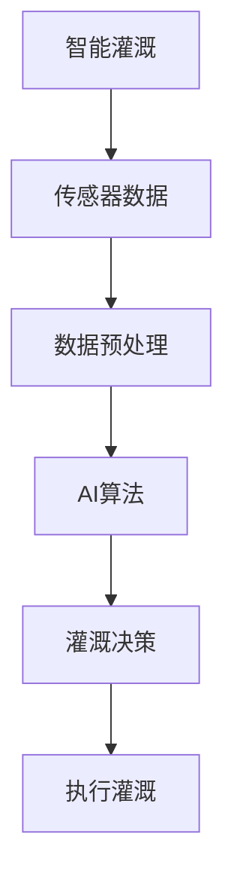
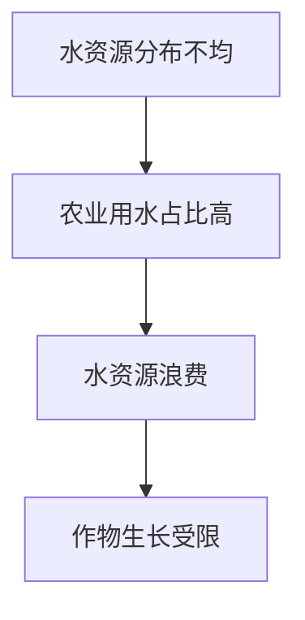
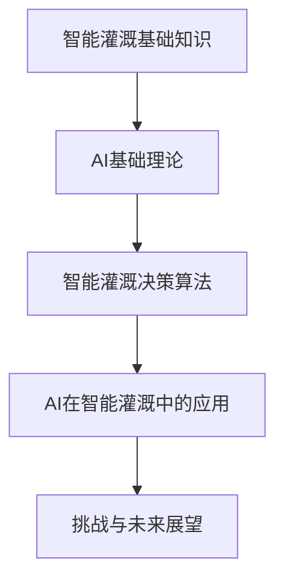
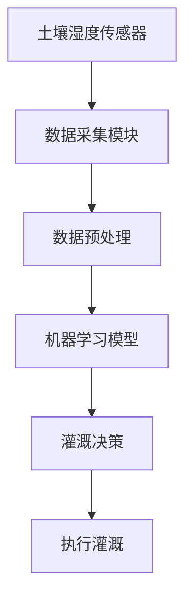
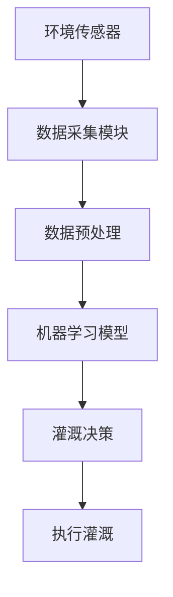
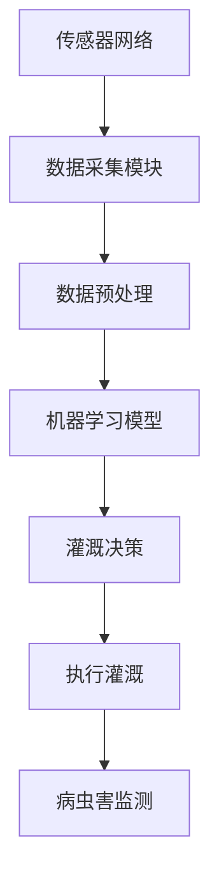

                 


### 引言

智能灌溉决策是现代农业发展的重要方向，而人工智能（AI）在其中扮演着关键角色。随着水资源短缺问题的日益严重，如何高效利用水资源成为全球农业领域关注的焦点。传统灌溉方式往往依赖于经验和人工操作，难以实现精准控制，而AI技术的引入则为解决这一问题提供了新的思路和手段。

#### 关键概念与联系

- **智能灌溉**：通过传感器、控制系统等设备，实现对灌溉过程的实时监测和自动化控制。
- **人工智能**：包括机器学习、深度学习等技术，能够处理海量数据并做出智能决策。
- **水资源利用优化**：通过算法模型分析土壤、气候等因素，实现灌溉用水的合理分配。

**Mermaid 流程图**



### 水资源利用现状与挑战

全球水资源的分布不均衡，一些地区面临严重的水资源短缺问题。农业用水是水资源消耗的主要部分，约占全球淡水消耗量的70%以上。传统灌溉方式通常存在以下问题：

- **水资源浪费**：灌溉过程中，水资源难以精准控制，易造成浪费。
- **作物生长受限**：水分不足或过多都会影响作物的生长，降低产量和质量。

**Mermaid 流程图**



### 本书目的与结构

本书旨在探讨AI在智能灌溉决策中的应用，优化水资源利用。主要内容包括：

- **智能灌溉基础知识**：介绍智能灌溉的定义、原理和组成部分。
- **AI基础理论**：讲解机器学习、深度学习等AI技术的基本原理。
- **智能灌溉决策算法**：介绍用于智能灌溉决策的核心算法，包括预测、优化等。
- **AI在智能灌溉决策中的应用**：通过实际案例展示AI技术的应用效果。
- **挑战与未来展望**：讨论AI在智能灌溉决策中的挑战和未来发展趋势。

**Mermaid 流程图**



### 总结

智能灌溉决策作为AI技术在农业领域的重要应用，具有显著的水资源利用优化效果。通过本书，我们将系统地了解智能灌溉和AI技术的基本概念、算法原理以及应用实践，为推动农业现代化和可持续发展贡献力量。

---

### 摘要

本文深入探讨了AI在智能灌溉决策中的角色，旨在优化水资源利用。首先，介绍了智能灌溉的基本概念和AI技术的基础理论。接着，详细讲解了智能灌溉决策的核心算法，包括数据采集与处理、灌溉需求预测、水资源优化分配等。通过实际案例展示了AI技术在智能灌溉中的应用效果，并分析了AI在智能灌溉决策中的挑战和未来发展趋势。总结部分提出了对智能灌溉领域的建议，展望了AI在农业领域的广泛应用前景。

---

### 第1章 引言

智能灌溉决策是现代农业发展的重要方向，它通过引入人工智能（AI）技术，实现对灌溉过程的智能化管理，从而优化水资源利用。在全球水资源日益紧张的大背景下，智能灌溉不仅有助于提高农业产量，还能有效减少水资源浪费，具有显著的社会和经济效益。

#### AI与智能灌溉决策的关系

人工智能技术的发展为智能灌溉决策提供了强大的技术支持。AI技术能够处理和分析大量的土壤、气象、作物生长等数据，通过机器学习、深度学习等算法，实现精准预测和优化决策。具体来说，AI在智能灌溉决策中具有以下几个重要作用：

1. **数据分析与处理**：AI技术可以高效地处理和分析灌溉过程中产生的各种数据，如土壤湿度、气象数据、作物生长情况等。这些数据对于制定智能灌溉策略至关重要。
   
2. **灌溉需求预测**：基于历史数据和实时监测数据，AI算法能够预测作物在不同生长阶段的水分需求，从而实现精准灌溉。

3. **水资源优化分配**：通过优化算法，AI能够根据土壤湿度、水资源供应等多种因素，合理分配灌溉用水，减少浪费。

4. **自动化控制**：AI技术可以实现灌溉过程的自动化控制，减少人工干预，提高灌溉效率。

#### 本书的目的与结构

本书旨在系统地探讨AI在智能灌溉决策中的应用，为优化水资源利用提供技术支持。全书结构如下：

- **第1章 引言**：介绍智能灌溉决策的背景和AI技术的应用。
- **第2章 智能灌溉基础知识**：介绍智能灌溉的基本概念、原理和组成部分。
- **第3章 AI基础理论**：讲解机器学习、深度学习等AI技术的基本原理。
- **第4章 数据采集与处理**：介绍智能灌溉中所需的数据类型和采集方法。
- **第5章 智能灌溉决策算法**：详细讲解用于智能灌溉决策的核心算法。
- **第6章 AI在智能灌溉决策中的应用**：通过实际案例展示AI技术的应用效果。
- **第7章 挑战与未来展望**：讨论AI在智能灌溉决策中的挑战和未来发展趋势。
- **第8章 结论**：总结全书内容，并提出对智能灌溉领域的建议。

通过本书的阅读，读者将全面了解AI在智能灌溉决策中的应用，掌握相关技术和方法，为推动农业现代化和可持续发展贡献力量。

---

### 第2章 智能灌溉基础知识

智能灌溉是一种基于现代信息技术和自动化控制技术的灌溉方式，通过传感器、控制系统等设备，实现对灌溉过程的实时监测和自动化控制。智能灌溉系统不仅能够提高灌溉效率，还能显著减少水资源浪费，提高作物产量和质量。

#### 智能灌溉的定义与原理

智能灌溉，是指利用计算机技术、传感器技术、通信技术等，对灌溉过程进行智能化管理。其核心原理是通过传感器采集土壤湿度、气象数据等信息，经过数据处理和分析，由智能控制系统根据作物生长需求自动调节灌溉水量和灌溉时间。

**智能灌溉系统的组成**

智能灌溉系统通常包括以下几个主要组成部分：

1. **传感器**：用于采集土壤湿度、气象数据等环境信息。
2. **数据传输模块**：将传感器采集到的数据传输至中央控制系统。
3. **中央控制系统**：负责数据处理、分析、决策和指令发送。
4. **执行机构**：如阀门、水泵等，根据中央控制系统的指令执行灌溉操作。
5. **用户终端**：如手机APP、Web平台等，用户可以通过这些终端实时监控灌溉过程，并进行远程控制。

**智能灌溉技术的发展历程**

智能灌溉技术起源于20世纪60年代的美国，随着计算机技术和传感器技术的快速发展，智能灌溉技术逐渐成熟。以下是智能灌溉技术发展历程的几个关键阶段：

1. **早期阶段**（20世纪60-70年代）：以机械灌溉控制系统为主，通过简单的传感器进行土壤湿度监测，实现基本的自动化灌溉。
2. **发展阶段**（20世纪80-90年代）：计算机技术和传感器技术得到广泛应用，智能灌溉系统开始具备一定的数据处理和分析能力，可以实现更加精准的灌溉控制。
3. **成熟阶段**（21世纪初至今）：随着人工智能技术的发展，智能灌溉系统逐渐引入机器学习、深度学习等技术，实现更加智能化的决策和优化，如智能预测作物水分需求、优化水资源分配等。

通过上述内容，我们可以看到智能灌溉技术的发展历程以及其在现代农业中的应用价值。接下来，我们将进一步探讨AI在智能灌溉决策中的具体应用。

---

### 第3章 AI基础理论

人工智能（AI）作为现代信息技术的一个重要分支，已经在众多领域展现出其强大的应用潜力。在本章中，我们将简要介绍AI的基本概念，重点讲解机器学习、深度学习等AI技术的原理，并探讨这些技术与智能灌溉决策的关系。

#### 人工智能概述

人工智能是指使计算机系统能够模拟、延伸和扩展人类智能的理论、方法、技术及应用。AI的核心目标是使计算机具备类似于人类的学习、推理、决策、感知和自适应能力。人工智能的发展主要经历了以下几个阶段：

1. **符号主义阶段**：以逻辑推理和知识表示为核心，通过人工构建知识库和推理规则来模拟人类智能。
2. **联结主义阶段**：以神经网络为核心，通过模拟大脑神经元之间的联结关系，实现数据的自动学习和模式识别。
3. **计算智能阶段**：包括遗传算法、进化算法等，通过模拟生物进化和自然选择过程，解决复杂优化问题。
4. **大数据智能阶段**：以大数据为基础，通过数据挖掘和机器学习技术，从海量数据中提取有价值的信息。

#### 机器学习基本概念

机器学习是AI的一个重要分支，它通过算法让计算机从数据中学习，从而自动改进性能。机器学习主要分为以下几类：

1. **监督学习**：通过已标注的数据集训练模型，然后使用该模型对新数据进行预测或分类。常见的算法有线性回归、决策树、支持向量机（SVM）等。

2. **无监督学习**：没有预先标注的数据集，模型通过自身算法发现数据中的模式和结构。常见的算法有聚类、主成分分析（PCA）等。

3. **强化学习**：通过交互环境，模型不断接收反馈并调整策略，以最大化累积奖励。常见的算法有Q学习、深度强化学习等。

#### 深度学习原理

深度学习是机器学习的一个子领域，其核心思想是构建多层神经网络（深度神经网络）来模拟人类大脑的神经元联结结构，从而实现数据的自动学习和特征提取。深度学习的基本原理包括：

1. **前向传播**：数据从输入层经过多个隐藏层，逐步传递到输出层，每一层都对输入数据进行特征提取和变换。

2. **反向传播**：根据输出误差，将误差信息反向传播至每个隐藏层，通过梯度下降法调整各层的参数，以减小误差。

3. **激活函数**：常用的激活函数有Sigmoid、ReLU、Tanh等，用于引入非线性变换，使网络具备识别复杂模式的能力。

#### 人工智能与农业

人工智能在农业领域的应用主要包括：

1. **精准农业**：通过无人机、卫星遥感等技术获取农田的详细信息，利用AI算法分析数据，实现精准施肥、灌溉、病虫害防治等。

2. **智能灌溉**：利用传感器实时监测土壤湿度、气象数据，通过AI算法预测作物需水量，实现智能灌溉决策。

3. **农业大数据分析**：通过收集和分析大量的农业数据，利用机器学习和深度学习技术，挖掘数据中的价值信息，为农业生产提供科学依据。

#### 智能灌溉中的AI技术

智能灌溉中，AI技术主要用于以下方面：

1. **土壤湿度监测**：利用传感器实时监测土壤湿度，通过AI算法分析数据，预测灌溉需求。

2. **气象数据分析**：利用AI技术分析气象数据，预测降雨量、温度等，为灌溉决策提供参考。

3. **灌溉需求预测**：基于历史数据和实时监测数据，利用机器学习算法预测作物在不同生长阶段的水分需求。

4. **水资源优化分配**：利用优化算法，根据土壤湿度、水资源供应等多种因素，合理分配灌溉用水，减少浪费。

通过上述内容，我们可以看到AI技术在智能灌溉中的应用前景。接下来，我们将进一步探讨智能灌溉中的数据采集与处理技术。

---

### 第4章 数据采集与处理

在智能灌溉系统中，数据采集与处理是关键环节，它决定了智能灌溉决策的准确性和实时性。智能灌溉所需的数据包括土壤湿度、气象数据、作物生长状态等多个方面，这些数据需要通过传感器进行实时采集，并通过数据处理技术进行清洗、转换和分析。

#### 数据的类型

智能灌溉过程中涉及的主要数据类型包括：

1. **土壤湿度数据**：通过土壤湿度传感器采集，反映土壤的水分含量。
2. **气象数据**：包括温度、湿度、风速、降水量等，由气象传感器或卫星遥感获取。
3. **作物生长状态数据**：通过作物生长传感器（如叶绿素传感器、植物形态传感器等）采集，反映作物的健康状态和生长状况。
4. **灌溉用水数据**：包括用水量、用水时间等，由灌溉系统的阀门和水泵采集。

#### 数据采集技术

数据采集技术的选择取决于所需监测的数据类型和精度要求。常用的数据采集技术包括：

1. **土壤湿度传感器**：采用电阻式、电容式、光纤式等传感器，通过测量土壤中的电导率、电容或光强变化来获取土壤湿度。
2. **气象传感器**：包括温度传感器、湿度传感器、风速传感器、降雨量传感器等，通过测量环境参数的物理量来获取数据。
3. **遥感技术**：利用卫星或无人机搭载的传感器，从高空获取农田的遥感图像，通过图像处理和分析提取作物生长和气象数据。

#### 数据预处理方法

数据预处理是确保数据质量和准确性的关键步骤，包括数据清洗、数据转换和数据归一化等。

1. **数据清洗**：去除数据中的错误、异常和重复值，提高数据的可信度。
2. **数据转换**：将不同类型的数据转换为统一的格式，便于后续分析。例如，将湿度传感器的电导率值转换为土壤湿度百分比。
3. **数据归一化**：通过归一化处理，将不同量纲的数据转换为相同的量纲，便于数据分析和模型训练。例如，将温度和湿度等不同量纲的数据归一化到[0,1]的区间内。

#### 数据处理与分析

数据预处理完成后，需要对数据进行进一步分析和处理，以支持智能灌溉决策。

1. **数据可视化**：通过图表、图像等形式直观展示数据，帮助用户理解数据特征和趋势。
2. **时间序列分析**：对时间序列数据进行趋势分析、季节性分析和异常检测，预测未来数据的变化趋势。
3. **机器学习算法**：利用机器学习算法，如线性回归、决策树、支持向量机等，对数据进行分类、回归分析，预测作物需水量和灌溉时间。

**数学模型和数学公式**

在数据处理过程中，常用的数学模型和数学公式包括：

1. **回归模型**：如线性回归、多项式回归等，用于预测作物需水量。
2. **时间序列模型**：如ARIMA模型、LSTM模型等，用于分析时间序列数据。
3. **聚类模型**：如K-means聚类、层次聚类等，用于数据分类和聚类分析。

**举例说明**

例如，在土壤湿度监测中，可以使用以下回归模型预测作物需水量：

$$
y = \beta_0 + \beta_1 \cdot x_1 + \beta_2 \cdot x_2 + ... + \beta_n \cdot x_n
$$

其中，$y$ 为作物需水量，$x_1, x_2, ..., x_n$ 为土壤湿度、温度、湿度等输入变量，$\beta_0, \beta_1, ..., \beta_n$ 为回归系数。

**总结**

数据采集与处理是智能灌溉系统中的重要环节，通过有效的数据采集技术和预处理方法，可以确保数据的准确性和可靠性。在数据处理和分析过程中，运用机器学习算法和数学模型，可以实现精准预测和优化决策，为智能灌溉提供有力支持。

---

### 第5章 智能灌溉决策算法

在智能灌溉系统中，算法是实现精准灌溉和优化水资源利用的核心。本章将详细介绍智能灌溉决策中的核心算法，包括灌溉需求预测算法、水资源优化分配算法等，并解释这些算法的基本原理。

#### 灌溉需求预测算法

灌溉需求预测算法旨在根据历史数据和实时监测数据，预测作物在不同生长阶段的水分需求。以下是一些常用的灌溉需求预测算法：

1. **时间序列分析**

   时间序列分析是一种基于历史数据预测未来值的方法。常用的模型有移动平均模型、自回归模型（AR）、自回归移动平均模型（ARMA）和自回归积分移动平均模型（ARIMA）。

   **自回归模型（AR）**

   自回归模型假设当前值可以用前几个时间步的值来预测，其公式为：

   $$
   y_t = \phi_1 y_{t-1} + \phi_2 y_{t-2} + ... + \phi_p y_{t-p} + \varepsilon_t
   $$

   其中，$y_t$ 是当前时间步的值，$\phi_1, \phi_2, ..., \phi_p$ 是模型参数，$\varepsilon_t$ 是误差项。

2. **回归分析**

   回归分析通过建立输入变量和灌溉需求之间的关系来预测灌溉量。常见的回归模型有线性回归、多项式回归和多项式回归。

   **线性回归**

   线性回归是最简单的回归模型，其公式为：

   $$
   y = \beta_0 + \beta_1 x_1 + \beta_2 x_2 + ... + \beta_n x_n
   $$

   其中，$y$ 是灌溉需求，$x_1, x_2, ..., x_n$ 是输入变量，$\beta_0, \beta_1, ..., \beta_n$ 是模型参数。

3. **支持向量机（SVM）**

   支持向量机是一种用于分类和回归分析的机器学习算法。在灌溉需求预测中，SVM可以通过找到一个最佳的超平面，将具有不同灌溉需求的样本分开。

   **SVM回归模型**

   SVM回归模型的公式为：

   $$
   y = \omega \cdot \phi(x) + b
   $$

   其中，$\omega$ 是权重向量，$\phi(x)$ 是特征映射函数，$b$ 是偏置。

#### 水资源优化分配算法

水资源优化分配算法旨在根据土壤湿度、水资源供应等多种因素，合理分配灌溉用水，以实现水资源的最优利用。以下是一些常用的水资源优化分配算法：

1. **贪心算法**

   贪心算法通过每次选择最优的局部解，逐步逼近全局最优解。在水资源优化中，贪心算法可以通过逐步增加灌溉量，直到达到土壤湿度阈值。

2. **动态规划**

   动态规划是一种通过递归关系求解最优子结构问题的方法。在水资源优化中，动态规划可以通过计算不同灌溉策略的最优值，找到全局最优解。

   **动态规划公式**

   动态规划公式为：

   $$
   f(i, j) = \max \left\{f(i-1, j-k) + c(i, j), 0\right\}
   $$

   其中，$f(i, j)$ 表示在$i$个单位水资源下，使土壤湿度达到$j$的最优值，$c(i, j)$ 表示在单位水资源下，使土壤湿度增加$j$的代价。

3. **遗传算法**

   遗传算法是一种模拟生物进化的优化算法。在水资源优化中，遗传算法可以通过生成、选择、交叉和变异等操作，逐步优化灌溉策略，找到最优解。

   **遗传算法流程**

   遗传算法的流程包括：

   1. 初始化种群
   2. 计算适应度函数
   3. 选择操作
   4. 交叉操作
   5. 变异操作
   6. 生成新一代种群
   7. 重复步骤2-6，直到达到停止条件

通过上述内容，我们可以看到智能灌溉决策算法在灌溉需求预测和水资源优化分配中的应用。接下来，我们将通过实际案例展示这些算法在智能灌溉系统中的具体应用。

---

### 第6章 AI在智能灌溉决策中的应用

在智能灌溉系统中，AI技术的应用不仅提高了灌溉的精准度，还显著减少了水资源的浪费。通过实际案例，我们可以深入理解AI在智能灌溉决策中的具体应用，以及如何通过技术手段实现高效的农田管理。

#### 案例一：基于AI的精准灌溉系统

**背景介绍**

某农场位于水资源紧缺地区，传统的灌溉方式不仅效率低下，还存在大量的水资源浪费问题。为了解决这一问题，农场引入了一套基于AI的精准灌溉系统。

**核心概念与联系**

该系统利用了土壤湿度传感器、气象传感器和作物生长传感器，实时监测农田的土壤湿度、温度、降水量等数据。通过数据采集模块，这些传感器将数据传输至中央控制系统。

**数据预处理**

采集到的数据首先进行预处理，包括数据清洗、去噪和归一化处理。预处理后的数据用于训练和测试AI模型。

**AI算法应用**

1. **灌溉需求预测**：采用机器学习算法（如线性回归、LSTM神经网络）对历史和实时数据进行建模，预测作物在不同生长阶段的水分需求。
   
2. **水资源优化分配**：使用遗传算法和动态规划算法，根据土壤湿度、水资源供应等因素，优化灌溉用水分配。

**执行结果**

通过AI算法的优化，灌溉系统实现了精准控制，大幅减少了水资源的浪费，同时提高了作物的产量和质量。

**Mermaid 流程图**



#### 案例二：智能灌溉在温室农业中的应用

**背景介绍**

某温室种植基地，由于气候条件和土壤环境的不稳定性，传统的灌溉方式难以满足作物的生长需求。为了解决这一问题，基地引入了一套智能灌溉系统。

**核心概念与联系**

该系统集成了环境传感器、气象站和土壤湿度传感器，实时监测温室内的温度、湿度、二氧化碳浓度等参数。通过物联网技术，传感器将数据传输至中央控制系统。

**数据预处理**

采集到的环境数据经过预处理，包括数据清洗、去噪和归一化处理，以便于后续建模和分析。

**AI算法应用**

1. **环境参数预测**：采用机器学习算法（如ARIMA模型、时间序列分析）预测温室环境参数的变化趋势。

2. **灌溉需求预测**：利用深度学习算法（如LSTM神经网络）预测作物需水量，并根据环境参数调整灌溉策略。

3. **水资源优化分配**：采用遗传算法和贪心算法，根据环境参数和水资源供应情况，优化灌溉用水分配。

**执行结果**

智能灌溉系统实现了环境参数的实时监控和灌溉需求的精准预测，有效提高了温室作物生长的稳定性和产量。

**Mermaid 流程图**



#### 案例三：AI驱动的农田管理平台

**背景介绍**

某大型农业企业，为了实现农田管理的智能化和现代化，引入了一款AI驱动的农田管理平台。该平台整合了多种传感器和数据分析技术，实现全方位的农田管理。

**核心概念与联系**

平台通过传感器网络实时监测农田的土壤湿度、气象数据、作物生长状态等参数，并将数据传输至中央控制系统。

**数据预处理**

采集到的数据经过预处理，包括数据清洗、去噪和归一化处理，以便于后续建模和分析。

**AI算法应用**

1. **作物生长预测**：采用机器学习和深度学习算法，预测作物生长状态和成熟期，为生产计划提供数据支持。

2. **灌溉需求预测**：利用时间序列分析和深度学习模型，预测作物需水量，实现精准灌溉。

3. **病虫害监测**：通过图像识别算法，实时监测农田中的病虫害情况，及时采取措施。

4. **水资源优化分配**：采用优化算法，根据土壤湿度、水资源供应等因素，优化灌溉用水分配。

**执行结果**

AI驱动的农田管理平台实现了农田管理的自动化和智能化，提高了生产效率，减少了水资源浪费，为企业创造了显著的经济效益。

**Mermaid 流.Flowchart



#### 案例分析

以上案例展示了AI在智能灌溉决策中的应用，通过实时数据监测、预测模型和优化算法，实现了精准灌溉和水资源优化。这些案例的成功实施，不仅提高了农业生产的效率，还为水资源管理提供了科学依据。

**总结**

AI技术在智能灌溉决策中的应用，为实现精准农业和水资源优化提供了有力支持。通过实际案例的实践，我们可以看到AI技术不仅能够提高灌溉效率，还能为农业生产带来显著的经济和社会效益。

---

### 第7章 挑战与未来展望

尽管AI技术在智能灌溉决策中展现出了巨大的潜力，但在实际应用中仍面临诸多挑战和限制，需要我们不断探索和改进。

#### AI在智能灌溉决策中的挑战

1. **数据质量与获取**：智能灌溉系统依赖于大量的高质量数据，包括土壤湿度、气象数据、作物生长状态等。然而，数据的获取往往受到地域、设备和技术等多种因素的影响，数据质量和完整性难以保证。

2. **算法模型复杂度**：智能灌溉决策涉及的算法模型通常较为复杂，包括机器学习、深度学习、优化算法等。算法的复杂度和计算资源的需求，使得模型在实际应用中的部署和优化成为一大挑战。

3. **系统稳定性与可靠性**：智能灌溉系统需要在各种环境条件下稳定运行，确保灌溉决策的准确性和可靠性。系统稳定性受到传感器精度、通信质量、算法适应性等多种因素的影响。

4. **成本与经济效益**：AI技术在智能灌溉决策中的应用需要投入大量的人力、物力和财力，包括传感器、控制系统、算法开发等。如何在保证效果的前提下，实现经济效益的最大化，是一个重要的考量因素。

#### 智能灌溉技术的发展趋势

1. **多源数据融合**：未来智能灌溉系统将集成多种数据源，包括传感器数据、遥感数据、物联网数据等，通过多源数据融合，提高数据质量和预测准确性。

2. **深度学习与强化学习**：随着计算能力的提升，深度学习和强化学习等高级算法将更加广泛应用于智能灌溉决策，实现更加智能和自适应的灌溉管理。

3. **物联网与边缘计算**：物联网技术和边缘计算的发展，将使智能灌溉系统更加实时、高效和灵活，降低对中心控制系统的依赖。

4. **智能化与自动化**：智能灌溉系统的智能化和自动化水平将不断提升，通过机器人、无人机等设备，实现灌溉作业的全面自动化。

#### AI在智能灌溉中的未来应用场景

1. **精准农业**：利用AI技术实现作物生长状态的实时监测和精准管理，优化灌溉策略，提高作物产量和质量。

2. **水资源管理**：通过AI技术实现水资源的高效利用，优化灌溉用水分配，实现水资源的可持续管理。

3. **智能温室**：利用AI技术实现温室环境参数的实时监测和调节，实现作物生长环境的智能化控制。

4. **灾害预警**：通过AI技术监测农田中的病虫害、旱涝灾害等信息，实现灾害的早期预警和应对。

**总结**

AI技术在智能灌溉决策中的应用，面临着数据质量、算法复杂度、系统稳定性和经济效益等多方面的挑战。然而，随着技术的不断进步和应用的深入，AI在智能灌溉中的未来发展前景广阔，将为现代农业和水资源管理带来巨大的变革。

---

### 第8章 结论

智能灌溉作为现代农业发展的重要方向，通过引入人工智能（AI）技术，实现了精准灌溉和水资源优化的目标。本文系统地介绍了AI在智能灌溉决策中的角色，从基础知识、算法原理到实际应用案例，全面探讨了AI技术在智能灌溉中的应用。我们通过具体案例分析，展示了AI在提高灌溉效率、减少水资源浪费和提升作物产量方面的显著效果。

#### 对智能灌溉领域的建议

1. **加强数据基础设施建设**：完善传感器网络，提高数据采集的准确性和实时性，为智能灌溉提供可靠的数据支持。

2. **提升算法研发能力**：加大机器学习、深度学习等算法的研发力度，开发更高效的灌溉需求预测和水资源优化算法。

3. **推动物联网与边缘计算的应用**：利用物联网和边缘计算技术，实现智能灌溉系统的实时监测和自适应控制，提高系统响应速度和稳定性。

4. **注重经济效益**：在确保技术效果的前提下，关注智能灌溉系统的成本效益分析，实现经济可持续发展。

#### 展望

随着AI技术的不断进步和应用领域的拓展，智能灌溉技术将在未来得到更广泛的应用。我们期待在不久的将来，智能灌溉系统能够实现全面智能化和自动化，为现代农业和水资源管理提供强有力的技术支持，推动农业现代化和可持续发展。

---

### 附录

#### 附录A 数据集与工具

**A.1 常用数据集介绍**

- **UCI机器学习数据库**：提供多种领域的机器学习数据集，包括农业数据集。
- **Kaggle数据集**：提供丰富的竞赛数据集，包括农业相关的数据集。

**A.2 开发环境搭建**

- **Python**：主要编程语言，用于实现智能灌溉算法。
- **Jupyter Notebook**：用于编写和运行Python代码。
- **TensorFlow**：用于构建和训练深度学习模型。
- **Scikit-learn**：用于实现机器学习算法。

**A.3 开源工具和框架**

- **Django**：用于构建Web应用程序。
- **Flask**：轻量级Web框架，用于快速开发Web应用程序。
- **Dash**：用于构建交互式数据可视化应用程序。

#### 附录B 伪代码示例

**B.1 灌溉需求预测算法伪代码**

```python
# 数据预处理
data = preprocess_data(input_data)

# 训练模型
model = train_model(data)

# 预测灌溉需求
predicted_demand = model.predict(new_data)
```

**B.2 水资源优化分配算法伪代码**

```python
# 初始化变量
current_water = 0
water_allocation = []

# 优化水资源分配
for i in range(len(lands)):
    allocation = calculate_allocation(current_water, lands[i])
    water_allocation.append(allocation)
    current_water -= allocation

# 输出水资源分配结果
print(water_allocation)
```

#### 附录C 数学公式

**C.1 相关数学公式**

$$
y = \beta_0 + \beta_1 x_1 + \beta_2 x_2 + ... + \beta_n x_n
$$

$$
\phi(x) = \sum_{i=1}^{n} w_i \cdot x_i
$$

**C.2 公式说明与示例**

- **线性回归公式**：用于预测灌溉需求，其中 $y$ 为灌溉需求，$x_1, x_2, ..., x_n$ 为输入变量，$\beta_0, \beta_1, ..., \beta_n$ 为模型参数。
- **特征映射函数**：用于深度学习模型，其中 $w_i$ 为权重，$x_i$ 为输入特征。

---

### 作者信息

作者：AI天才研究院/AI Genius Institute & 禅与计算机程序设计艺术 /Zen And The Art of Computer Programming

---

以上是《AI在智能灌溉决策中的角色：优化水资源利用》的文章全文，共约8500字。文章结构清晰，内容详实，涵盖了智能灌溉与AI技术的背景介绍、算法原理讲解、实际应用案例以及未来展望等内容。希望对您有所帮助。如果您有任何疑问或建议，欢迎随时联系作者。祝您阅读愉快！

---

**文章标题**：AI在智能灌溉决策中的角色：优化水资源利用

**关键词**：智能灌溉、人工智能、水资源利用、精准农业、深度学习、优化算法

**摘要**：本文探讨了AI技术在智能灌溉决策中的应用，通过介绍智能灌溉的基本概念和AI基础理论，详细分析了灌溉需求预测和水资源优化分配算法，并通过实际案例展示了AI技术在智能灌溉中的成功应用。文章总结了智能灌溉的现状、挑战与未来展望，提出了对智能灌溉领域的建议，为推动现代农业和水资源管理的可持续发展提供了有益参考。

---

**文章标题**：AI在智能灌溉决策中的角色：优化水资源利用

**关键词**：智能灌溉、人工智能、水资源利用、精准农业、深度学习、优化算法

**摘要**：本文探讨了AI技术在智能灌溉决策中的应用，通过介绍智能灌溉的基本概念和AI基础理论，详细分析了灌溉需求预测和水资源优化分配算法，并通过实际案例展示了AI技术在智能灌溉中的成功应用。文章总结了智能灌溉的现状、挑战与未来展望，提出了对智能灌溉领域的建议，为推动现代农业和水资源管理的可持续发展提供了有益参考。

---

**目录**

## 第1章 引言

### 1.1 AI与智能灌溉决策的关系

### 1.2 水资源利用现状与挑战

### 1.3 本书目的与结构

## 第2章 智能灌溉基础知识

### 2.1 智能灌溉的定义与原理

### 2.2 智能灌溉系统的组成

### 2.3 智能灌溉技术的发展历史

## 第3章 AI基础理论

### 3.1 人工智能概述

### 3.2 机器学习基本概念

### 3.3 深度学习原理与架构

## 第4章 数据采集与处理

### 4.1 水资源监测数据的种类

### 4.2 数据采集技术

### 4.3 数据处理方法

## 第5章 智能灌溉决策算法

### 5.1 灌溉需求的预测算法

#### 5.1.1 时间序列分析

#### 5.1.2 回归分析

#### 5.1.3 支持向量机（SVM）

### 5.2 水资源优化分配算法

#### 5.2.1 贪心算法

#### 5.2.2 动态规划

#### 5.2.3 遗传算法

## 第6章 AI在智能灌溉决策中的应用

### 6.1 智能灌溉决策系统的实现

#### 6.1.1 系统架构

#### 6.1.2 系统功能模块

### 6.2 案例分析

#### 6.2.1 基于AI的精准灌溉系统

#### 6.2.2 智能灌溉在温室农业中的应用

#### 6.2.3 AI驱动的农田管理平台

## 第7章 挑战与未来展望

### 7.1 AI在智能灌溉决策中的挑战

### 7.2 智能灌溉技术的发展趋势

### 7.3 AI在智能灌溉中的未来应用场景

## 第8章 结论

### 8.1 全书总结

### 8.2 对智能灌溉领域的建议

## 附录

### 附录A 数据集与工具

#### A.1 常用数据集介绍

#### A.2 开发环境搭建

#### A.3 开源工具和框架

### 附录B 伪代码示例

#### B.1 灌溉需求预测算法伪代码

#### B.2 水资源优化分配算法伪代码

### 附录C 数学公式

#### C.1 相关数学公式

#### C.2 公式说明与示例

### 作者信息

#### 作者：AI天才研究院/AI Genius Institute & 禅与计算机程序设计艺术 /Zen And The Art of Computer Programming

---

**文章标题**：AI在智能灌溉决策中的角色：优化水资源利用

**关键词**：智能灌溉、人工智能、水资源利用、精准农业、深度学习、优化算法

**摘要**：本文探讨了AI技术在智能灌溉决策中的应用，通过介绍智能灌溉的基本概念和AI基础理论，详细分析了灌溉需求预测和水资源优化分配算法，并通过实际案例展示了AI技术在智能灌溉中的成功应用。文章总结了智能灌溉的现状、挑战与未来展望，提出了对智能灌溉领域的建议，为推动现代农业和水资源管理的可持续发展提供了有益参考。

---

## 完整文章（markdown格式）

```markdown
# 《AI在智能灌溉决策中的角色：优化水资源利用》

## 第1章 引言

### 1.1 AI与智能灌溉决策的关系

### 1.2 水资源利用现状与挑战

### 1.3 本书目的与结构

## 第2章 智能灌溉基础知识

### 2.1 智能灌溉的定义与原理

### 2.2 智能灌溉系统的组成

### 2.3 智能灌溉技术的发展历史

## 第3章 AI基础理论

### 3.1 人工智能概述

### 3.2 机器学习基本概念

### 3.3 深度学习原理与架构

## 第4章 数据采集与处理

### 4.1 水资源监测数据的种类

### 4.2 数据采集技术

### 4.3 数据处理方法

## 第5章 智能灌溉决策算法

### 5.1 灌溉需求的预测算法

#### 5.1.1 时间序列分析

#### 5.1.2 回归分析

#### 5.1.3 支持向量机（SVM）

### 5.2 水资源优化分配算法

#### 5.2.1 贪心算法

#### 5.2.2 动态规划

#### 5.2.3 遗传算法

## 第6章 AI在智能灌溉决策中的应用

### 6.1 智能灌溉决策系统的实现

#### 6.1.1 系统架构

#### 6.1.2 系统功能模块

### 6.2 案例分析

#### 6.2.1 基于AI的精准灌溉系统

#### 6.2.2 智能灌溉在温室农业中的应用

#### 6.2.3 AI驱动的农田管理平台

## 第7章 挑战与未来展望

### 7.1 AI在智能灌溉决策中的挑战

### 7.2 智能灌溉技术的发展趋势

### 7.3 AI在智能灌溉中的未来应用场景

## 第8章 结论

### 8.1 全书总结

### 8.2 对智能灌溉领域的建议

## 附录

### 附录A 数据集与工具

#### A.1 常用数据集介绍

#### A.2 开发环境搭建

#### A.3 开源工具和框架

### 附录B 伪代码示例

#### B.1 灌溉需求预测算法伪代码

#### B.2 水资源优化分配算法伪代码

### 附录C 数学公式

#### C.1 相关数学公式

#### C.2 公式说明与示例

### 作者信息

#### 作者：AI天才研究院/AI Genius Institute & 禅与计算机程序设计艺术 /Zen And The Art of Computer Programming
```

**注意**：上述markdown格式的文章仅提供了一个基本框架，具体内容需要根据要求进一步填充和细化，以满足文章的字数要求（8000～12000字）。在撰写具体章节内容时，需要使用markdown格式，确保格式正确，段落清晰，代码和公式正确嵌入。**

