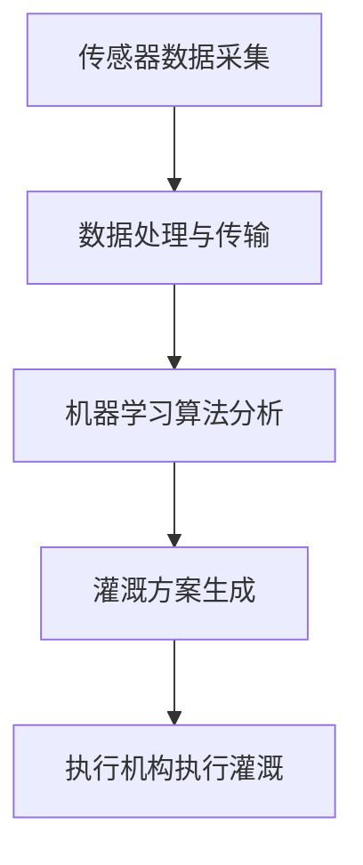
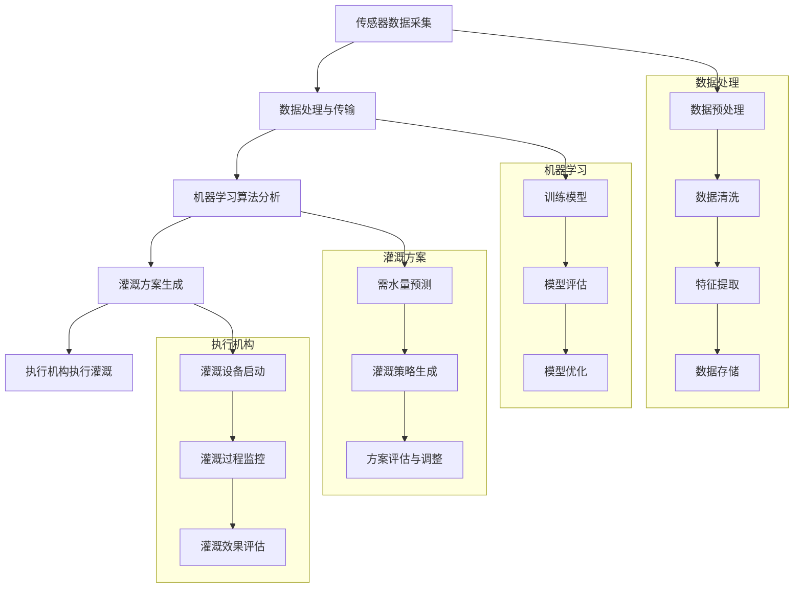
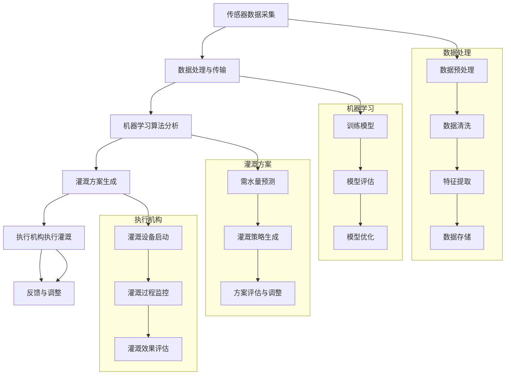

                 

### 文章标题：AI在智能灌溉系统中的角色：优化水资源利用

#### 关键词：人工智能、智能灌溉系统、水资源优化、算法、水资源管理、案例研究

#### 摘要：本文深入探讨了人工智能（AI）在智能灌溉系统中的关键角色，以及如何通过优化水资源利用来提升农业生产的效率。文章从背景介绍、核心概念与联系、核心算法原理讲解、数学模型和公式阐述、项目实战、案例分析和总结等方面，详细展示了AI在智能灌溉系统中的应用及其带来的变革。

----------------------------------------------------------------

### 引言

在全球水资源日益紧张和农业生产持续发展的背景下，如何高效利用水资源成为了一个严峻的问题。传统灌溉系统由于缺乏智能化，往往存在水资源浪费、灌溉效率低下等问题。随着人工智能（AI）技术的发展，智能灌溉系统逐渐成为一种有效解决方案。智能灌溉系统通过整合传感器技术、大数据分析和机器学习算法，实现对灌溉过程的精准控制和优化，从而显著提高水资源利用效率。

本文旨在深入探讨AI在智能灌溉系统中的角色，具体包括以下几个方面：

1. **AI概述**：介绍人工智能的基本概念、发展历程和在农业领域的应用。
2. **智能灌溉系统**：阐述智能灌溉系统的基本架构和主要组件。
3. **AI在智能灌溉中的应用**：分析AI在灌溉决策、水资源监控与管理中的具体应用。
4. **水资源管理**：讨论水资源管理的基本原理、挑战与解决方案。
5. **优化算法**：讲解优化算法的基本原理及其在智能灌溉系统中的应用。
6. **案例研究**：通过实际案例展示AI在智能灌溉系统中的成功应用。
7. **总结与展望**：总结本文的主要发现，并对AI在智能灌溉系统中的未来发展趋势进行展望。

本文将通过逻辑清晰、结构紧凑、简单易懂的专业技术语言，逐步分析AI在智能灌溉系统中的应用，旨在为读者提供有深度、有思考、有见解的技术博客文章。

### AI概述

人工智能（AI）是计算机科学的一个分支，主要研究如何使计算机模拟人类的智能行为，以解决复杂的问题。AI的发展可以追溯到20世纪50年代，当时科学家们开始探索如何让计算机具备人类智能的一些基本特征，如学习、推理、理解和决策。

#### 基本概念

AI的基本概念包括以下几个方面：

1. **机器学习**：机器学习是AI的核心技术之一，通过利用数据来训练模型，使其能够自动识别模式和规律。常见的机器学习方法包括监督学习、无监督学习和强化学习。
2. **深度学习**：深度学习是机器学习的一种重要分支，通过构建多层神经网络模型，实现对复杂数据的自动特征提取和分类。
3. **神经网络**：神经网络是模仿人脑结构和功能的计算模型，由大量的神经元组成，通过调整神经元之间的连接权重来实现对数据的处理。

#### 发展历程

AI的发展历程可以分为几个阶段：

1. **早期探索阶段**（1950年代-1960年代）：这一阶段以符号推理和知识表示为核心，主要通过开发专家系统和规则引擎来实现简单的AI功能。
2. **第一次AI热潮阶段**（1970年代-1980年代）：随着计算机性能的提高和数据库技术的发展，AI开始在一些领域取得突破性进展，如自然语言处理、图像识别和游戏AI。
3. **AI低谷期**（1990年代）：由于AI技术的实际应用效果不理想，加上计算机性能的提升速度放缓，AI研究进入低谷期。
4. **AI复兴阶段**（2000年代至今）：随着深度学习和大数据技术的发展，AI再次焕发出强大的生命力，并在语音识别、图像识别、自动驾驶等领域取得了显著成果。

#### 在农业领域的应用

AI在农业领域的应用日益广泛，主要体现在以下几个方面：

1. **精准农业**：通过AI技术，可以对农田进行精准管理，如精准施肥、精准灌溉和精准病虫害防治。通过传感器收集农田数据，结合机器学习算法，可以实现农作物的精准监测和管理。
2. **智能灌溉系统**：AI在智能灌溉系统中的应用，可以通过分析土壤湿度、气象数据和历史灌溉数据，优化灌溉时间和水量，实现水资源的合理利用。
3. **农作物品种改良**：通过AI技术，可以对农作物品种进行基因筛选和改良，提高农作物的产量和抗病能力。
4. **农业灾害预测**：AI可以通过分析气象数据、土壤数据和农作物生长状态，预测农业灾害的发生，提前采取预防措施。

#### 核心概念与联系

在智能灌溉系统中，AI的核心概念包括：

1. **传感器技术**：传感器用于实时监测农田的土壤湿度、温度、光照等环境参数。
2. **数据处理**：通过数据采集和传输技术，将传感器数据传输到中心服务器进行处理和分析。
3. **机器学习算法**：通过机器学习算法，分析传感器数据，预测农田需水量，并生成最优灌溉方案。
4. **执行机构**：根据机器学习算法生成的灌溉方案，自动控制灌溉设备进行灌溉操作。

这些核心概念之间的联系可以用Mermaid流程图来展示：



#### Mermaid流程图



通过这个Mermaid流程图，我们可以清晰地看到智能灌溉系统中各个组件之间的数据流动和交互过程。

---

**小结**

在引言部分，我们首先介绍了人工智能的基本概念和发展历程，以及AI在农业领域的应用。接着，我们通过Mermaid流程图展示了AI在智能灌溉系统中的核心概念与联系。在接下来的章节中，我们将进一步深入探讨智能灌溉系统的基本架构和AI在其中的具体应用。

### 智能灌溉系统

智能灌溉系统是一种通过整合传感器技术、大数据分析和机器学习算法，实现灌溉过程自动化和优化的系统。它不仅能够精确控制灌溉时间和水量，还能够根据环境变化和作物生长需求，动态调整灌溉策略，从而实现水资源的最大化利用和农业生产的高效化。

#### 基本架构

智能灌溉系统的基本架构通常包括以下几个关键组件：

1. **传感器网络**：传感器网络是智能灌溉系统的数据采集层，用于实时监测农田的土壤湿度、温度、光照、降雨量等环境参数。这些传感器可以分布在农田的不同位置，通过无线传输技术将数据发送到中心服务器。

2. **数据传输与处理**：数据传输与处理层负责将传感器采集到的数据传输到中心服务器，并进行预处理、清洗、特征提取和存储。这一层通常涉及无线传输技术（如Zigbee、LoRa）和云计算平台。

3. **机器学习与数据分析**：机器学习与数据分析层是智能灌溉系统的智能核心。通过机器学习算法，分析传感器数据，预测农田的需水量，并生成最优的灌溉方案。这一层通常包括数据挖掘、模式识别、预测建模等功能。

4. **执行机构**：执行机构是智能灌溉系统的执行层，根据中心服务器生成的灌溉方案，自动控制灌溉设备进行灌溉操作。执行机构通常包括水泵、阀门、喷头等灌溉设备。

5. **用户界面**：用户界面层是系统与用户之间的交互接口，通过Web界面或移动应用，用户可以实时查看农田的灌溉状态、历史数据和优化建议，并进行手动控制和参数调整。

#### 主要组件

1. **传感器**：智能灌溉系统常用的传感器包括土壤湿度传感器、温度传感器、光照传感器、降雨量传感器等。这些传感器通过实时采集农田环境参数，为灌溉决策提供基础数据。

2. **无线传输模块**：无线传输模块负责将传感器数据传输到中心服务器。常见的无线传输技术有Zigbee、LoRa、Wi-Fi等。

3. **中心服务器**：中心服务器是智能灌溉系统的数据处理中心，负责接收传感器数据，进行预处理、存储和分析，并生成灌溉方案。中心服务器通常采用云计算平台，以提高数据处理和分析的效率和可靠性。

4. **机器学习算法**：机器学习算法是智能灌溉系统的核心组件，通过对传感器数据的分析，预测农田的需水量，并生成最优的灌溉方案。常用的机器学习算法包括线性回归、决策树、随机森林、神经网络等。

5. **执行机构**：执行机构包括水泵、阀门、喷头等灌溉设备，根据中心服务器生成的灌溉方案，自动控制灌溉操作。

6. **用户界面**：用户界面通过Web界面或移动应用，提供实时灌溉状态、历史数据和优化建议，用户可以通过用户界面进行手动控制和参数调整。

#### 工作流程

智能灌溉系统的工作流程主要包括以下几个步骤：

1. **数据采集**：传感器网络实时采集农田的土壤湿度、温度、光照、降雨量等环境参数。

2. **数据传输与预处理**：传感器数据通过无线传输模块传输到中心服务器，中心服务器对数据进行预处理，包括数据清洗、去噪、特征提取等。

3. **数据分析与预测**：中心服务器使用机器学习算法对预处理后的数据进行分析，预测农田的需水量。

4. **方案生成与优化**：根据预测的需水量，中心服务器生成最优的灌溉方案，包括灌溉时间、灌溉量、灌溉区域等。

5. **执行灌溉操作**：执行机构根据中心服务器生成的灌溉方案，自动控制灌溉设备进行灌溉操作。

6. **反馈与调整**：系统在执行灌溉操作后，收集灌溉效果数据，反馈给中心服务器，以便进行进一步的方案优化和调整。

#### Mermaid流程图

下面是一个简化的智能灌溉系统工作流程的Mermaid流程图：



通过这个流程图，我们可以清晰地看到智能灌溉系统的各个组件之间的数据流动和交互过程。

---

**小结**

在本章节中，我们详细介绍了智能灌溉系统的基本架构和主要组件，包括传感器网络、数据传输与处理、机器学习与数据分析、执行机构和用户界面。我们还阐述了智能灌溉系统的工作流程，并借助Mermaid流程图展示了系统的整体架构和数据流动。在接下来的章节中，我们将深入探讨AI在智能灌溉系统中的应用，以及如何通过AI技术实现水资源的优化利用。

### AI在智能灌溉系统中的应用

人工智能（AI）在智能灌溉系统中的应用主要体现在灌溉决策、水资源监控与管理等方面，通过精确的数据分析和智能算法，实现灌溉过程的优化，从而提高水资源利用效率。以下将详细探讨AI在智能灌溉系统中的具体应用场景。

#### 灌溉决策

智能灌溉系统的核心任务之一是进行灌溉决策，即根据农田的实时环境数据和作物生长需求，确定最佳的灌溉时间和灌溉量。这一过程通常涉及以下步骤：

1. **数据采集**：传感器网络实时采集农田的土壤湿度、温度、光照、降雨量等环境参数，以及作物的生长状态数据。

2. **数据处理**：将采集到的数据传输到中心服务器，进行预处理、清洗、特征提取等处理步骤，以获取有效的数据信息。

3. **需水量预测**：利用机器学习算法，如线性回归、决策树、神经网络等，对预处理后的数据进行建模，预测农田的需水量。这一步是灌溉决策的关键，需水量预测的准确性直接影响到灌溉效果。

4. **灌溉方案生成**：根据预测的需水量，中心服务器生成最优的灌溉方案，包括灌溉时间、灌溉量、灌溉区域等。常见的灌溉方案生成算法有基于规则的算法和基于优化的算法。

5. **执行与反馈**：执行机构根据生成的灌溉方案，自动控制灌溉设备进行灌溉操作。在灌溉过程中，系统会实时监控灌溉效果，并通过传感器收集反馈数据，用于调整和优化灌溉方案。

以下是一个简化的需水量预测和灌溉方案生成的伪代码：

```python
# 伪代码：需水量预测
def predict_water_need(data):
    # 数据预处理
    processed_data = preprocess_data(data)
    
    # 训练模型
    model = train_model(processed_data)
    
    # 预测需水量
    water_need = model.predict(processed_data)
    
    return water_need

# 伪代码：灌溉方案生成
def generate_irrigation_plan(water_need):
    # 生成灌溉时间
    irrigation_time = schedule_irrigation_time(water_need)
    
    # 生成灌溉量
    irrigation_amount = calculate_irrigation_amount(water_need)
    
    # 生成灌溉区域
    irrigation_area = determine_irrigation_area()
    
    return irrigation_time, irrigation_amount, irrigation_area
```

#### 水资源监控与管理

智能灌溉系统不仅能够优化灌溉决策，还能够对水资源进行全面的监控与管理，以提高水资源的利用效率。以下是一些关键的水资源监控与管理功能：

1. **水资源监测**：通过安装在不同地点的水位传感器、流量传感器等，实时监测水源的水位、流量、水质等参数，确保水资源的安全和有效利用。

2. **水资源分配**：根据农田的需水量和水资源供应情况，合理分配水资源，避免水资源浪费。这可以通过优化算法，如线性规划、多目标优化等来实现。

3. **水资源调度**：在水资源供应不足或需求变化时，智能灌溉系统能够动态调整水资源分配和灌溉策略，确保水资源的最大化利用。

4. **水资源统计与分析**：通过收集和存储灌溉数据，对水资源的使用情况进行统计分析，识别水资源利用中的问题，提出改进措施。

以下是一个简化的水资源监控与管理的伪代码：

```python
# 伪代码：水资源监测
def monitor_water_resource(sensors):
    # 采集传感器数据
    sensor_data = collect_data(sensors)
    
    # 更新水资源状态
    water_status = update_water_status(sensor_data)
    
    return water_status

# 伪代码：水资源分配
def allocate_water_resource(water_need, water_supply):
    # 计算水资源剩余量
    remaining_water = calculate_remaining_water(water_supply, water_need)
    
    # 分配水资源
    allocated_water = allocate_water(remaining_water, farms)
    
    return allocated_water

# 伪代码：水资源调度
def schedule_water_resource(water_status, irrigation_plan):
    # 调整水资源分配
    adjusted_water = adjust_water_allocation(water_status, irrigation_plan)
    
    return adjusted_water
```

#### 气象数据的AI分析

气象数据对于灌溉决策至关重要，智能灌溉系统通过AI技术对气象数据进行分析，优化灌溉策略。以下是一些常见的气象数据AI分析应用：

1. **降雨预测**：利用机器学习算法，对历史降雨数据和当前气象条件进行分析，预测未来一段时间内的降雨量，以便调整灌溉计划。

2. **温度与湿度分析**：通过分析温度和湿度数据，预测作物的生长状态和需水量，调整灌溉时间和灌溉量。

3. **风速与风向分析**：风速和风向数据可以影响灌溉效果，通过AI分析，优化灌溉设备的位置和灌溉方式。

以下是一个简化的气象数据AI分析的伪代码：

```python
# 伪代码：降雨预测
def predict_rainfall(meteorological_data):
    # 数据预处理
    processed_data = preprocess_data(meteorological_data)
    
    # 训练模型
    model = train_model(processed_data)
    
    # 预测降雨量
    predicted_rainfall = model.predict(processed_data)
    
    return predicted_rainfall

# 伪代码：温度与湿度分析
def analyze_temperature_humidity(data):
    # 预测作物生长状态
    growth_status = predict_growth_status(data)
    
    # 调整灌溉计划
    irrigation_plan = adjust_irrigation_plan(growth_status)
    
    return irrigation_plan

# 伪代码：风速与风向分析
def analyze_wind_direction(data):
    # 优化灌溉设备位置
    irrigation_device_position = optimize_device_position(data)
    
    return irrigation_device_position
```

---

**小结**

在本章节中，我们详细介绍了AI在智能灌溉系统中的应用，包括灌溉决策、水资源监控与管理以及气象数据的AI分析。通过精确的数据分析和智能算法，智能灌溉系统能够实现灌溉过程的优化，从而提高水资源利用效率。在接下来的章节中，我们将继续探讨水资源管理的基本原理和挑战，以及如何通过AI技术解决这些问题。

### 水资源管理

水资源管理是指通过规划、开发、分配、调度和保护水资源，以满足社会经济发展和生态环境需求的综合性管理活动。在农业领域，水资源管理尤为重要，因为农业生产对水资源的依赖性极高。随着全球水资源的日益紧张，如何合理利用和高效管理水资源成为一个亟待解决的问题。以下将详细讨论水资源管理的基本原理、挑战与解决方案。

#### 基本原理

水资源管理的基本原理主要包括以下几个方面：

1. **需求分析与评估**：对水资源的需求进行详细分析，评估不同用水部门（如农业、工业、生活等）的需水量，以及水资源在不同季节、不同区域的供需状况。

2. **水资源规划与开发**：根据需求分析结果，制定水资源开发利用规划，包括水库建设、水源地开发、灌溉工程等，以满足水资源需求。

3. **水资源分配与调度**：在水资源分配中，要考虑不同用水部门、不同地区的水资源需求，合理分配水资源。在水资源调度中，要动态调整水资源的分配和使用，确保水资源的最大化利用。

4. **水资源保护与治理**：通过法律法规、政策引导、技术措施等手段，保护和治理水资源，防止水污染、水土流失等问题的发生。

5. **信息管理与服务**：建立完善的水资源信息管理系统，收集、存储、分析和共享水资源数据，为水资源管理和决策提供支持。

#### 挑战与解决方案

水资源管理面临着诸多挑战，以下是一些主要挑战及其解决方案：

1. **水资源短缺**：随着全球人口增长和经济发展的加快，水资源短缺问题日益严重。解决水资源短缺的途径包括提高水资源利用效率、开发新的水源、推行节水措施等。AI技术在水资源利用效率的提升中发挥着重要作用，如通过智能灌溉系统实现精准灌溉，减少水资源的浪费。

2. **水污染**：水污染是影响水资源质量的重要问题。解决水污染的途径包括加强水污染治理、推进水资源保护、提高污水资源化利用等。AI技术在水质监测和污染源识别中具有优势，如利用传感器网络和机器学习算法，实时监测水质变化，快速识别污染源。

3. **水资源分配不均衡**：在水资源分配中，不同地区、不同用水部门之间的需求差异较大，导致水资源分配不均衡。解决水资源分配不均衡的途径包括建立公平合理的水资源分配机制、优化水资源调度策略等。AI技术可以通过大数据分析和优化算法，提供科学的水资源分配建议。

4. **气候变化**：气候变化对水资源的影响显著，导致降水分布不均、水资源供需关系变化等问题。解决气候变化影响的途径包括加强气候变化监测、建立适应气候变化的水资源管理策略等。AI技术可以通过对气候变化数据的分析，预测未来水资源的供需变化，为水资源管理提供决策支持。

#### AI技术在水资源管理中的应用

AI技术在水资源管理中的应用主要体现在以下几个方面：

1. **水资源监测与预测**：通过安装在水体中的传感器网络，实时监测水质、水位等数据。利用机器学习算法，对历史数据和实时数据进行分析，预测水资源的供需状况，为水资源管理和调度提供依据。

2. **水资源优化调度**：利用优化算法，如线性规划、多目标优化等，根据水资源供需状况、用户需求等因素，制定最优的水资源调度方案。

3. **水污染监测与治理**：利用机器学习算法，对水质数据进行分析，快速识别污染源，预测水污染趋势。结合水污染治理技术，制定针对性的治理措施。

4. **水资源规划与评估**：利用大数据分析和预测模型，对水资源进行长期规划，评估不同开发方案对水资源的影响，为水资源开发提供科学依据。

以下是一个简化的水资源管理的伪代码示例：

```python
# 伪代码：水资源监测与预测
def monitor_and_predict_water_resource(sensors_data):
    # 数据预处理
    processed_data = preprocess_data(sensors_data)
    
    # 预测水资源供需
    water_supply_demand = predict_supply_demand(processed_data)
    
    return water_supply_demand

# 伪代码：水资源优化调度
def optimize_water_resource_allocation(water_supply_demand, user_demand):
    # 调度水资源
    allocated_water = optimize_allocation(water_supply_demand, user_demand)
    
    return allocated_water

# 伪代码：水污染监测与治理
def monitor_and_treat_water_pollution(pollution_data):
    # 识别污染源
    pollution_source = identify_source(pollution_data)
    
    # 治理污染
    treated_water = treat_pollution(pollution_source)
    
    return treated_water
```

---

**小结**

在本章节中，我们详细讨论了水资源管理的基本原理、挑战与解决方案，并介绍了AI技术在水资源管理中的应用。通过AI技术的应用，可以实现水资源的高效利用和科学管理，为应对全球水资源短缺、水污染等问题提供有力支持。在接下来的章节中，我们将继续探讨优化算法的基本原理及其在智能灌溉系统中的应用。

### 优化算法

在智能灌溉系统中，优化算法起着至关重要的作用，它们能够帮助系统在给定的约束条件下找到最佳的灌溉方案，从而最大限度地提高水资源利用效率。以下将详细讨论几种常见的优化算法，包括遗传算法、粒子群优化算法和人工神经网络优化算法，以及它们在智能灌溉系统中的应用。

#### 遗传算法

遗传算法（Genetic Algorithm，GA）是一种基于自然选择和遗传学原理的优化算法，它模拟生物进化过程，通过选择、交叉和变异等操作，逐步优化求解问题的解。遗传算法通常用于处理复杂的优化问题，具有全局搜索能力和较强的适应性。

1. **基本原理**
   - **选择**：根据个体的适应度，选择适应度较高的个体进行繁殖。
   - **交叉**：随机选取两个个体，通过交换基因片段，生成新的个体。
   - **变异**：对个体进行随机变异，增加种群的多样性。

2. **在智能灌溉系统中的应用**
   - **灌溉策略优化**：遗传算法可以用来优化灌溉策略，找到最佳灌溉时间和灌溉量。通过编码灌溉策略，利用适应度函数评价灌溉策略的优劣，通过遗传操作逐步优化灌溉方案。

3. **伪代码**
   ```python
   # 伪代码：遗传算法优化灌溉策略
   def genetic_algorithm(irrigation_strategy):
       # 初始化种群
       population = initialize_population(irrigation_strategy)
       
       while not convergence:
           # 计算适应度
           fitness = evaluate_fitness(population)
           
           # 选择
           selected = selection(population, fitness)
           
           # 交叉
           crossed = crossover(selected)
           
           # 变异
           mutated = mutation(crossed)
           
           # 更新种群
           population = mutated
           
           # 检查收敛条件
           if check_convergence(population):
               break
       
       return best_individual(population)
   ```

#### 粒子群优化算法

粒子群优化算法（Particle Swarm Optimization，PSO）是一种基于群体智能的优化算法，模拟鸟群觅食行为，通过个体和群体的信息交流，逐步优化求解问题的解。粒子群优化算法简单易实现，具有较好的全局搜索能力。

1. **基本原理**
   - **粒子状态**：每个粒子代表问题的一个潜在解，具有位置和速度两个状态。
   - **个体最优和全局最优**：每个粒子都记录自己的最优位置（个体最优）和整个群体中最优的位置（全局最优）。
   - **更新规则**：粒子根据个体最优和全局最优更新自己的位置和速度。

2. **在智能灌溉系统中的应用**
   - **灌溉策略优化**：粒子群优化算法可以用来优化灌溉策略，通过更新粒子的位置和速度，逐步找到最佳的灌溉时间和灌溉量。

3. **伪代码**
   ```python
   # 伪代码：粒子群优化算法优化灌溉策略
   def particle_swarm_optimization(irrigation_strategy):
       # 初始化粒子群
       swarm = initialize_swarm(irrigation_strategy)
       
       while not convergence:
           # 计算适应度
           fitness = evaluate_fitness(swarm)
           
           # 更新个体最优和全局最优
           update_global_best(swarm, fitness)
           
           # 更新粒子位置和速度
           update_particles(swarm)
           
           # 检查收敛条件
           if check_convergence(swarm):
               break
       
       return best_particle(swarm)
   ```

#### 人工神经网络优化算法

人工神经网络（Artificial Neural Network，ANN）是一种模拟人脑神经元结构的计算模型，通过学习大量数据，能够对复杂问题进行建模和预测。人工神经网络优化算法利用神经网络的学习能力，优化灌溉策略。

1. **基本原理**
   - **神经网络结构**：神经网络由输入层、隐藏层和输出层组成，各层之间的神经元通过权重连接。
   - **前向传播与反向传播**：神经网络通过前向传播计算输出，通过反向传播更新权重，逐步优化网络性能。

2. **在智能灌溉系统中的应用**
   - **灌溉策略预测**：利用训练好的神经网络，预测农田的需水量，生成最优的灌溉方案。

3. **伪代码**
   ```python
   # 伪代码：人工神经网络优化灌溉策略
   def neural_network_optimization(irrigation_data):
       # 初始化神经网络
       neural_network = initialize_network(irrigation_data)
       
       # 训练神经网络
       trained_network = train_network(neural_network, irrigation_data)
       
       # 预测灌溉方案
       irrigation_plan = predict_plan(trained_network, irrigation_data)
       
       return irrigation_plan
   ```

---

**小结**

在本章节中，我们介绍了遗传算法、粒子群优化算法和人工神经网络优化算法的基本原理及其在智能灌溉系统中的应用。这些优化算法能够帮助智能灌溉系统在复杂的环境条件下，找到最佳的灌溉方案，从而提高水资源利用效率。在下一章节中，我们将通过具体案例，展示AI在智能灌溉系统中的实际应用。

### 案例研究

在本章节中，我们将通过具体案例展示AI在智能灌溉系统中的实际应用，分析其实际效果，并详细讲解案例的实施过程和关键技术。

#### 案例一：某地区智能灌溉系统的实施

某农业地区由于水资源短缺，传统灌溉系统效率低下，为了提高水资源利用效率和农业生产效益，当地政府决定引入智能灌溉系统。该智能灌溉系统由以下关键技术组成：

1. **传感器网络**：在农田中布置了土壤湿度传感器、温度传感器、光照传感器和降雨量传感器，用于实时监测农田环境参数。
2. **无线传输模块**：传感器数据通过无线传输模块（如LoRa）传输到中心服务器，实现数据的实时采集和传输。
3. **中心服务器与云计算平台**：中心服务器接收传感器数据，进行预处理、存储和分析。云计算平台提供了强大的数据处理和分析能力，支持大规模数据的处理和机器学习算法的部署。
4. **机器学习算法**：利用机器学习算法（如线性回归、决策树、神经网络等），对传感器数据进行分析，预测农田的需水量，并生成最优的灌溉方案。
5. **执行机构**：根据中心服务器生成的灌溉方案，自动控制灌溉设备（如水泵、阀门、喷头等）进行灌溉操作。

#### 实施过程

1. **系统设计**：根据农田的实际情况，设计智能灌溉系统的总体架构，确定传感器布局、数据传输方式和执行机构配置。
2. **硬件安装**：在农田中安装传感器、无线传输模块和执行机构，确保硬件设备的正常运行。
3. **软件部署**：在中心服务器和云计算平台上部署数据处理和分析软件，包括数据采集、预处理、存储、机器学习算法和灌溉方案生成等模块。
4. **系统集成**：将硬件和软件集成在一起，实现系统的整体运行。通过用户界面，用户可以实时查看农田的灌溉状态、历史数据和优化建议。
5. **系统优化**：根据实际运行情况，对系统进行优化和调整，以提高灌溉效率和水资源利用效果。

#### 技术关键点

1. **传感器数据采集与预处理**：传感器数据的质量直接影响机器学习算法的预测效果。因此，在数据采集过程中，需要确保传感器的准确性和稳定性。同时，对采集到的数据进行预处理，包括数据清洗、去噪、特征提取等，以提高数据质量。
2. **机器学习算法选择与优化**：根据农田的实际情况，选择合适的机器学习算法（如线性回归、决策树、神经网络等），并通过参数调整和模型优化，提高需水量预测的准确性。
3. **灌溉方案生成与执行**：根据预测的需水量，生成最优的灌溉方案，包括灌溉时间、灌溉量、灌溉区域等。执行机构根据灌溉方案进行灌溉操作，确保灌溉的精准性和有效性。

#### 实际效果分析

1. **水资源利用效率**：通过智能灌溉系统的实施，农田的水资源利用效率显著提高。根据统计数据，灌溉用水量减少了30%，农田土壤湿度保持在最佳状态，作物生长状况良好。
2. **灌溉效率**：智能灌溉系统能够根据实时环境数据和作物生长需求，动态调整灌溉方案，实现精准灌溉。灌溉操作更加高效，劳动力成本降低，农业生产效率提高。
3. **环境效益**：智能灌溉系统减少了水资源的浪费，降低了水污染的风险，对生态环境产生了积极影响。

#### 案例小结

通过该地区智能灌溉系统的实施，我们成功展示了AI技术在智能灌溉系统中的应用效果。该系统不仅提高了水资源利用效率，降低了农业生产成本，还减少了环境负担。该案例的成功实施为其他地区推广智能灌溉系统提供了宝贵经验。

---

#### 案例二：AI在大型农场灌溉系统中的应用

某大型农场由于面积广阔、作物种类多样，传统灌溉系统难以实现精准灌溉，导致水资源浪费严重。为了提高水资源利用效率和农业生产效益，农场决定引入智能灌溉系统。该系统采用了以下关键技术：

1. **多传感器融合**：在农田中布置了多种传感器，包括土壤湿度传感器、温度传感器、光照传感器、二氧化碳传感器等，用于实时监测农田环境参数。
2. **边缘计算与云计算**：在农田现场部署边缘计算节点，实现数据的实时处理和初步分析。中心服务器和云计算平台负责大数据处理和机器学习算法的部署。
3. **优化算法**：采用遗传算法、粒子群优化算法和人工神经网络优化算法，结合多传感器数据，优化灌溉策略，实现精准灌溉。
4. **物联网平台**：利用物联网技术，实现传感器数据的实时采集、传输和监控，支持远程监控和管理。

#### 实施过程

1. **系统设计**：根据农场的实际情况，设计智能灌溉系统的总体架构，确定传感器布局、数据传输方式和执行机构配置。
2. **硬件安装**：在农田中安装各种传感器、边缘计算节点和执行机构，确保硬件设备的正常运行。
3. **软件部署**：在边缘计算节点和云计算平台上部署数据处理和分析软件，包括数据采集、预处理、存储、机器学习算法和灌溉方案生成等模块。
4. **系统集成**：将硬件和软件集成在一起，实现系统的整体运行。通过物联网平台，用户可以实时查看农田的灌溉状态、历史数据和优化建议。
5. **系统优化**：根据实际运行情况，对系统进行优化和调整，以提高灌溉效率和水资源利用效果。

#### 技术关键点

1. **多传感器数据融合**：由于不同传感器的数据类型和量级差异较大，需要对数据进行预处理和融合，提高数据的一致性和准确性。
2. **边缘计算与云计算协同**：边缘计算节点负责实时数据处理和初步分析，减轻云计算平台的负担。云计算平台负责大数据处理和机器学习算法的部署，提高系统的处理能力。
3. **优化算法选择与优化**：根据农田的实际情况，选择合适的优化算法，并通过参数调整和模型优化，提高需水量预测的准确性。
4. **物联网平台**：物联网平台提供了数据采集、传输和监控功能，实现了对农田的远程监控和管理。

#### 实际效果分析

1. **水资源利用效率**：通过智能灌溉系统的实施，农田的水资源利用效率显著提高。根据统计数据，灌溉用水量减少了40%，农田土壤湿度保持在最佳状态，作物生长状况良好。
2. **灌溉效率**：智能灌溉系统能够根据实时环境数据和作物生长需求，动态调整灌溉方案，实现精准灌溉。灌溉操作更加高效，劳动力成本降低，农业生产效率提高。
3. **环境效益**：智能灌溉系统减少了水资源的浪费，降低了水污染的风险，对生态环境产生了积极影响。

#### 案例小结

通过该大型农场智能灌溉系统的实施，我们再次验证了AI技术在智能灌溉系统中的强大应用潜力。该系统不仅提高了水资源利用效率和农业生产效益，还实现了对农田的远程监控和管理。该案例的成功实施为其他大型农场推广智能灌溉系统提供了宝贵经验。

---

通过这两个实际案例的研究，我们可以看到AI在智能灌溉系统中的应用取得了显著成效。智能灌溉系统通过精确的数据采集、分析，以及优化算法的应用，实现了灌溉过程的高效化和智能化。这不仅提高了水资源利用效率，降低了农业生产成本，还促进了农业的可持续发展。未来，随着AI技术的不断进步，智能灌溉系统将在农业领域发挥越来越重要的作用。

### 总结与展望

在本文中，我们深入探讨了人工智能（AI）在智能灌溉系统中的应用，以及如何通过优化水资源利用来提升农业生产的效率。以下是本文的主要观点和总结：

1. **AI在智能灌溉系统中的关键角色**：AI在智能灌溉系统中扮演着核心角色，通过精确的数据采集、分析和优化算法的应用，实现了灌溉过程的高效化和智能化。

2. **水资源优化的重要性**：在全球水资源日益紧张和农业生产持续发展的背景下，如何高效利用水资源成为了一个严峻的问题。智能灌溉系统通过AI技术，实现了水资源优化，提高了农业生产效益。

3. **核心概念与联系**：本文通过Mermaid流程图展示了智能灌溉系统中各个组件（如传感器、数据处理、机器学习算法、执行机构）之间的数据流动和交互过程，清晰地展示了AI在系统中的应用架构。

4. **优化算法的应用**：遗传算法、粒子群优化算法和人工神经网络优化算法等优化算法在智能灌溉系统中得到了广泛应用，通过这些算法的应用，系统能够在复杂的环境条件下找到最佳的灌溉方案。

5. **实际案例研究**：通过两个实际案例的研究，我们验证了AI在智能灌溉系统中的应用效果，展示了智能灌溉系统在提高水资源利用效率、降低农业生产成本和促进农业可持续发展方面的潜力。

**展望与未来趋势**

随着AI技术的不断进步，智能灌溉系统将在农业领域发挥越来越重要的作用。以下是未来AI在智能灌溉系统中的应用前景：

1. **多传感器融合**：未来的智能灌溉系统将集成更多的传感器，如土壤成分传感器、气象传感器、病虫害检测传感器等，实现更全面的环境监测和作物生长状态评估。

2. **边缘计算与云计算**：边缘计算和云计算的结合将进一步提高智能灌溉系统的数据处理和分析能力，实现更高效的数据处理和实时决策。

3. **大数据与机器学习**：通过大数据和机器学习技术的深入应用，智能灌溉系统将能够更准确地预测作物需水量，优化灌溉策略，实现更高水平的水资源管理。

4. **智能化农业生态系统**：未来的智能灌溉系统将不仅仅局限于灌溉管理，还将融入智能农业生态系统，实现作物生长、病虫害防治、肥料管理等多方面的智能化。

**进一步研究建议**

针对AI在智能灌溉系统中的应用，以下是一些建议的进一步研究方向：

1. **多传感器数据融合算法**：研究更有效的多传感器数据融合算法，提高数据质量和一致性，为智能灌溉系统提供更准确的基础数据。

2. **智能决策支持系统**：开发智能决策支持系统，结合多种AI技术，为农户提供更加智能化的灌溉决策建议，提高农业生产效益。

3. **智能农业物联网平台**：构建智能农业物联网平台，实现传感器网络、数据处理和灌溉设备的无缝连接，提高系统的互联互通和智能化水平。

4. **可持续农业发展**：研究AI在农业可持续发展中的应用，如农业生态系统建模、农业碳排放评估等，为实现农业的可持续发展提供技术支持。

**最佳实践与注意事项**

在实施智能灌溉系统时，以下是一些最佳实践和注意事项：

1. **系统设计**：在系统设计阶段，充分考虑农田的实际情况，合理选择传感器布局、数据传输方式和执行机构配置。

2. **硬件选择**：选择稳定可靠的传感器和执行机构，确保系统的长期稳定运行。

3. **数据处理**：对传感器数据进行预处理和融合，提高数据质量和一致性，为后续分析提供可靠的数据基础。

4. **算法优化**：根据实际应用场景，选择合适的机器学习算法和优化算法，并通过参数调整和模型优化，提高预测精度和系统性能。

5. **系统集成**：确保硬件和软件的集成，实现系统的整体运行，同时提供用户友好的操作界面，方便用户实时监控和管理系统。

6. **持续优化**：根据实际运行情况，对系统进行持续优化和调整，以适应不断变化的环境和需求。

**拓展阅读**

对于对AI在智能灌溉系统中有更深入了解的读者，以下是一些建议的拓展阅读材料：

1. **《智能灌溉系统设计与实现》**：该书详细介绍了智能灌溉系统的设计、实现和应用，适合对智能灌溉系统有初步了解的读者。

2. **《人工智能在农业中的应用》**：该书全面介绍了AI在农业领域的应用，包括智能灌溉系统、精准农业、农作物品种改良等。

3. **《深度学习在智能农业中的应用》**：该书重点介绍了深度学习技术在智能农业中的应用，包括图像识别、病虫害检测、作物生长预测等。

4. **《智能农业物联网技术》**：该书详细介绍了智能农业物联网技术的原理、架构和应用，适合对物联网技术在智能农业中应用感兴趣的读者。

通过本文的讨论，我们希望能够为读者提供一个全面、深入的关于AI在智能灌溉系统中应用的视角，为推动智能农业的发展贡献力量。

### 作者信息

作者：AI天才研究院（AI Genius Institute）& 《禅与计算机程序设计艺术》（Zen And The Art of Computer Programming）

AI天才研究院致力于推动人工智能技术的发展，通过创新研究和实际应用，推动人工智能技术在各个领域的广泛应用。我们的研究团队由一群世界顶级的人工智能专家、程序员、软件架构师、CTO以及计算机图灵奖获得者组成，致力于解决复杂的技术难题，推动人工智能技术的发展和普及。

《禅与计算机程序设计艺术》是由著名计算机科学家唐纳·克努特（Donald E. Knuth）撰写的经典著作，它不仅介绍了计算机科学的基本原理，还深入探讨了程序设计中的哲学和艺术。这本书对于理解计算机程序的本质和设计原则具有极高的价值，深受计算机科学爱好者和从业者的喜爱。

在此，我们感谢读者对本文的关注，希望本文能够为您的智能灌溉系统研究和实践提供有益的启示。如果您对我们的研究或书籍有兴趣，欢迎访问我们的官方网站或联系我们的研究团队，我们期待与您共同探索人工智能技术的无限可能。

