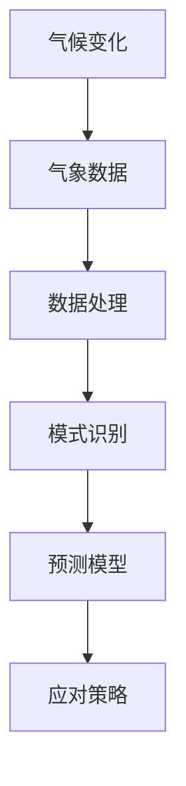
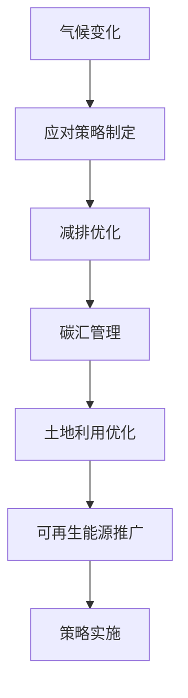
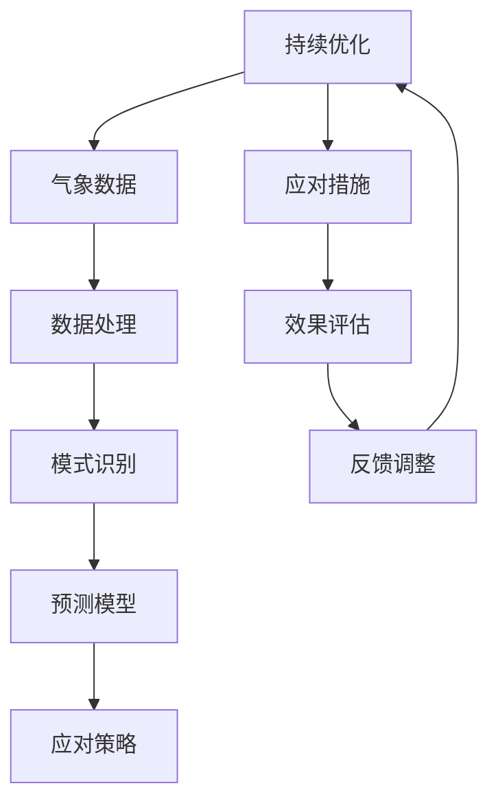

                 

### 核心概念与联系

#### 1.1 AI在气候变化预测中的角色

气候变化是当前全球面临的最严峻的挑战之一，而人工智能（AI）作为最具潜力解决这一问题的技术之一，正逐步在气候变化预测和应对中发挥关键作用。首先，我们需要理解气候变化的基本原理。气候变化主要包括大气温度的升高、海平面的上升以及极端气候事件的增多。这些现象可以通过以下数学公式来描述：

\[ \text{气候变化} = \text{大气温度变化} + \text{海平面上升} + \text{极端气候事件增多} \]

大气温度的变化主要受到温室气体浓度的影响，而温室气体浓度的增加则源于人类活动，如化石燃料的燃烧。海平面上升则主要受到全球变暖导致冰川融化和海水膨胀的影响。极端气候事件增多，如暴雨、干旱、热浪和飓风等，则是气候系统对气候变化响应的直接表现。

AI在气候变化预测中的应用主要体现在以下几个方面：

- **数据处理与分析**：气候模型和预测系统需要处理大量的气象数据，这些数据包括气温、降水、风速、湿度等。AI可以通过机器学习和深度学习算法，对海量数据进行分析，从中提取有用的信息和模式。

- **模式识别与预测**：基于历史数据和现有模型，AI可以通过模式识别算法，如神经网络、决策树和随机森林等，预测未来的气候变化趋势。这些算法能够自动学习数据中的复杂模式，从而提高预测的准确性。

为了更直观地展示AI在气候变化预测中的角色，我们可以使用Mermaid流程图来表示核心概念之间的联系：



在这个流程图中，气象数据是输入，经过数据处理和模式识别后，生成预测模型，最后根据预测结果制定应对策略。

通过上述分析，我们可以看出，AI在气候变化预测中的角色不仅仅是一个工具，更是一个能够提升我们理解和应对气候变化能力的重要手段。接下来，我们将深入探讨AI在气候变化应对中的具体应用和挑战。

#### 1.2 AI在气候变化应对中的角色

AI不仅在气候变化预测中发挥重要作用，在气候变化的应对策略制定和实施中同样扮演关键角色。气候变化的应对策略包括减少温室气体排放、增加碳汇、改善土地利用和促进可持续能源使用等。AI可以通过以下几种方式参与这些应对策略的制定和实施：

- **优化排放减少策略**：AI可以通过机器学习和优化算法，分析各种减排措施的潜在影响，帮助制定出最具成本效益和环保效益的减排策略。例如，可以基于历史数据和模型，预测不同减排措施对碳排放的影响，从而选择最优的减排方案。

- **碳汇管理**：AI可以帮助监测和管理森林、湿地和海洋等自然碳汇。通过分析卫星图像和实地数据，AI可以识别哪些地区具有最大的碳汇潜力，并制定相应的保护和管理措施。

- **可持续土地利用**：AI可以用于分析土地利用模式，识别哪些地区适合种植作物、建设城市还是保护自然环境。通过优化土地利用规划，可以减少对环境的影响，同时提高资源利用效率。

- **可再生能源推广**：AI可以分析不同地区和时段的能源需求和供应情况，帮助制定可再生能源的推广策略。例如，通过预测能源需求峰值，AI可以指导太阳能和风能电站的选址和建设，提高可再生能源的利用效率。

为了更清晰地展示AI在气候变化应对策略中的角色，我们可以使用以下Mermaid流程图来表示各步骤之间的关系：



在这个流程图中，气候变化是整个流程的起点，应对策略制定是核心环节，而AI在各个环节中都发挥着至关重要的作用。通过上述分析，我们可以看到，AI在气候变化应对中的角色不仅仅局限于技术层面，更是一种能够提升人类应对气候变化能力的综合手段。接下来，我们将进一步探讨AI在气候变化预测和应对中面临的主要挑战。

#### 1.3 AI在气候变化预测和应对中的挑战

尽管AI在气候变化预测和应对中具有巨大的潜力，但其应用也面临着一系列挑战。首先，数据问题是一个重要的挑战。气候数据具有复杂性和多样性，数据的质量、准确性和完整性对于AI模型的性能至关重要。数据源可能存在不一致性，而且气候系统的复杂性使得获取全面、准确的数据变得异常困难。因此，确保数据的可靠性和一致性是AI在气候变化预测和应对中首先要解决的问题。

其次，算法的可解释性问题也是一个挑战。许多AI模型，尤其是深度学习模型，具有出色的预测能力，但其内部工作机制往往是黑箱式的，难以解释。在气候变化预测和应对中，决策者需要了解AI模型的预测依据和决策逻辑，以便做出合理的决策。因此，开发可解释的AI算法，使得其决策过程透明和可信，是AI在气候变化领域中必须克服的难题。

此外，AI模型的适应性也是一个关键问题。气候变化是一个长期、动态的过程，气候系统的变化可能非常复杂和不可预测。这就要求AI模型能够快速适应新的数据和变化的环境，及时更新和调整预测结果。如果不能及时适应，AI模型可能会失去预测的准确性，从而影响决策的有效性。

最后，AI在气候变化预测和应对中的应用还面临着政策和社会接受度的问题。AI技术的发展和应用需要政策的支持和规范，同时也需要社会的广泛接受和认可。政策和制度的滞后、公众对AI技术的误解和担忧等都可能阻碍AI在气候变化预测和应对中的有效应用。

为了应对这些挑战，我们可以采取以下措施：

- **提高数据质量**：通过多源数据的整合和交叉验证，提高数据的可靠性和一致性。
- **开发可解释算法**：结合领域知识，开发可解释的AI模型，确保其决策过程透明和可信。
- **增强模型适应性**：采用迁移学习和增量学习等策略，提高AI模型对动态变化的适应能力。
- **政策支持和公众教育**：通过政策引导和公众教育，提升对AI技术的认识和理解，促进其广泛接受和应用。

综上所述，AI在气候变化预测和应对中具有巨大的潜力，同时也面临着一系列挑战。通过不断的技术创新和政策支持，我们可以克服这些挑战，充分利用AI的优势，为应对气候变化做出更大贡献。

#### 1.4 关键概念联系图（使用Mermaid绘制）

为了更好地理解AI在气候变化预测和应对中的核心概念及其相互关系，我们可以使用Mermaid绘制一个流程图。以下是一个简化的Mermaid流程图，展示了关键概念之间的联系：



在这个流程图中：

- **A（气候变化）** 是整个流程的起点，代表了我们需要预测和应对的气候变化现象。
- **B（气象数据）** 是从各种渠道获取的气候相关数据，如气温、降水量、风速等。
- **C（数据处理）** 包括数据清洗、归一化和特征提取等步骤，为后续的分析和建模做准备。
- **D（模式识别）** 利用机器学习和深度学习算法，从数据中提取有用的模式和特征。
- **E（预测模型）** 基于识别出的模式和特征，构建预测模型，用于预测未来的气候变化趋势。
- **F（应对策略）** 根据预测结果，制定具体的应对措施，如减排、碳汇管理、可持续土地利用等。
- **G（应对措施）** 实施各种应对措施，如政策调整、技术改进等。
- **H（效果评估）** 对应对措施的实施效果进行评估，包括环境效益、经济效益等。
- **I（反馈调整）** 根据效果评估结果，对应对策略进行调整和优化，形成一个持续迭代的过程。

通过这个流程图，我们可以清晰地看到AI在气候变化预测和应对中的各个环节及其相互关系。每个环节都紧密相连，共同构成了一个闭环系统，确保AI技术能够持续地为气候变化预测和应对提供有力支持。

#### 1.5 结论

综上所述，AI在气候变化预测和应对中扮演着至关重要的角色。通过处理和分析大量的气候数据，AI能够识别出气候变化的趋势和模式，从而构建准确的预测模型。这些模型不仅帮助我们更好地理解气候变化，还能为应对措施提供科学依据。此外，AI还能优化减排策略、管理碳汇、推动可再生能源的推广，从而在应对气候变化的各个层面上发挥重要作用。

然而，AI在气候变化预测和应对中的应用也面临诸多挑战，如数据质量、算法可解释性、模型适应性以及政策和社会接受度等。要充分发挥AI的潜力，我们需要持续技术创新和政策支持，提高数据的可靠性和一致性，开发可解释的AI算法，增强模型的适应性，并加强政策引导和公众教育。

展望未来，随着AI技术的不断进步和应用场景的拓展，我们有望在气候变化预测和应对方面取得更大的突破。通过利用AI的强大能力，我们可以更有效地应对气候变化带来的挑战，为构建可持续的未来贡献力量。

### 核心算法原理讲解

#### 2.1 马尔可夫决策过程（MDP）

在AI应用于气候变化预测和应对中，马尔可夫决策过程（Markov Decision Process, MDP）是一个重要的算法，它通过状态、动作、奖励和模型参数来实现决策优化。理解MDP的基本原理对于深入探讨AI在气候变化中的应用至关重要。

#### 2.1.1 MDP的基本概念

**状态（State）**：状态是系统在某一时刻所处的环境和条件。在气候变化的背景下，状态可能包括当前的气温、湿度、风速等气象指标。

**动作（Action）**：动作是决策者可以采取的应对措施，例如调整排放标准、增加可再生能源使用、改进土地利用策略等。

**奖励（Reward）**：奖励是决策者在采取某一动作后所获得的即时回报，它可以是正面的，如减少碳排放带来的经济收益，也可以是负面的，如未能有效应对极端气候事件所带来的损失。

**模型参数（Model Parameters）**：模型参数包括状态转移概率、动作奖励以及环境变化的概率分布。

**策略（Policy）**：策略是决策者根据当前状态选择最优动作的规则，它可以是固定的，也可以是随着状态和环境变化而调整的。

#### 2.1.2 MDP的基本原理

MDP的基本原理可以描述为：在任意时刻，决策者根据当前状态选择一个动作，并获得相应的奖励，同时状态转移到下一个状态。决策者通过最大化长期期望回报来制定最优策略。

**状态转移概率**：表示在当前状态下，采取某一动作后转移到下一状态的概率。

\[ P(s_{t+1} | s_t, a_t) \]

**动作奖励**：表示在当前状态下采取某一动作所获得的即时奖励。

\[ R(s_t, a_t) \]

**策略**：决策者根据当前状态选择最优动作的策略。

\[ \pi(a_t | s_t) \]

**价值函数（Value Function）**：表示在当前状态下采取最优动作的长期期望回报。

\[ V(s_t) = \sum_{s_{t+1}} P(s_{t+1} | s_t, \pi(s_t)) \cdot R(s_t, \pi(s_t)) \]

**政策迭代（Policy Iteration）**：MDP的求解方法之一，通过迭代更新策略和价值函数，逐步逼近最优策略。

#### 2.1.3 伪代码说明

以下是一个简单的MDP算法伪代码，用于说明基本流程：

```python
# 初始化参数
S = 获取状态空间
A = 获取动作空间
P = 获取状态转移概率矩阵
R = 获取奖励函数

# 初始化策略和价值函数
policy = 初始化策略
V = 初始化价值函数

# 迭代更新策略和价值函数
while not 策略收敛 do
    # 计算状态值函数
    V = 计算状态值函数(V, P, R, policy)
    # 根据价值函数更新策略
    policy = 更新策略(V, P, R)
endwhile

# 输出最优策略
return policy
```

在这个伪代码中，我们首先初始化状态空间、动作空间、状态转移概率矩阵和奖励函数。然后通过迭代更新策略和价值函数，直到策略收敛。最终，我们得到最优策略，用于决策。

#### 2.2 马尔可夫决策过程在气候变化中的应用

在气候变化预测和应对中，MDP可以用于制定减排策略、碳汇管理以及可再生能源推广等。例如，我们可以将MDP应用于以下场景：

- **减排策略制定**：通过MDP，我们可以模拟不同减排措施对碳排放的影响，并选择最优的减排策略。状态可以是当前的碳排放量，动作可以是调整能源结构、提高能源效率等。奖励可以是减少的碳排放量。
- **碳汇管理**：MDP可以帮助我们优化碳汇管理策略，例如，通过选择最佳的森林保护、湿地恢复等措施，最大化碳汇效果。状态可以是不同地区的碳汇潜力，动作可以是实施碳汇项目。
- **可再生能源推广**：通过MDP，我们可以分析不同地区和不同时间段的能源需求，并选择最优的可再生能源推广策略，例如，选择最佳的风能和太阳能电站位置，提高可再生能源的利用效率。

通过以上分析，我们可以看到，马尔可夫决策过程在气候变化预测和应对中具有广泛的应用前景。接下来，我们将进一步探讨其他核心算法在气候变化中的应用。

### 数学模型和数学公式

#### 3.1 气候模型的基本公式

在AI应用于气候变化预测时，数学模型和数学公式起着至关重要的作用。以下是几种常见的气候模型及其基本公式：

#### 3.1.1 气候模型的基本框架

气候模型通常基于物理学和气象学的原理，通过数值模拟来描述大气、海洋和地表的相互作用。这些模型通常包括以下基本框架：

- **大气模型**：描述大气中的热量、水分、气体和粒子的运动和相互作用。
- **海洋模型**：描述海洋中的热量和盐分分布、洋流和海洋生物的动态。
- **地表模型**：描述地表的物理过程，如辐射、水分循环、碳循环等。

#### 3.1.2 大气温度变化的公式

大气温度变化可以通过以下公式进行描述：

\[ \Delta T = \alpha \cdot (\text{温室气体浓度变化}) + \beta \cdot (\text{其他因素变化}) \]

其中，\( \Delta T \) 表示大气温度的变化，\( \alpha \) 和 \( \beta \) 是与温室气体浓度和其他因素相关的参数。

- **温室气体浓度变化**：可以通过观测和卫星数据得到。
- **其他因素变化**：可能包括火山爆发、太阳辐射变化等。

**示例**：

假设温室气体浓度增加导致大气温度升高，其他因素变化保持不变。我们可以通过以下公式计算大气温度变化：

\[ \Delta T = 0.3 \cdot (\text{CO2浓度增加}) + 0.1 \cdot (\text{海平面上升}) \]

#### 3.1.3 海平面上升的公式

海平面上升可以通过以下公式进行描述：

\[ \Delta H = \gamma \cdot (\text{冰川融水增加}) + \delta \cdot (\text{海水膨胀}) \]

其中，\( \Delta H \) 表示海平面上升的高度，\( \gamma \) 和 \( \delta \) 是与冰川融水增加和海水膨胀相关的参数。

- **冰川融水增加**：可以通过卫星观测和实地测量得到。
- **海水膨胀**：与海洋温度升高有关。

**示例**：

假设冰川融水增加和海水膨胀共同导致海平面上升。我们可以通过以下公式计算海平面上升高度：

\[ \Delta H = 0.5 \cdot (\text{冰川融水增加}) + 0.3 \cdot (\text{海水膨胀}) \]

#### 3.1.4 极端气候事件的概率模型

极端气候事件，如暴雨、干旱和热浪等，可以通过概率模型进行预测。以下是一个简单的极端气候事件概率模型：

\[ P(\text{极端气候事件}) = f(\text{温度变化}, \text{降水变化}, \text{风速变化}) \]

其中，\( P(\text{极端气候事件}) \) 表示发生极端气候事件的概率，\( f(\text{温度变化}, \text{降水变化}, \text{风速变化}) \) 是一个基于历史数据和统计方法的函数。

**示例**：

假设某一地区的极端气候事件概率与温度变化、降水变化和风速变化有关。我们可以通过以下公式计算极端气候事件的概率：

\[ P(\text{极端气候事件}) = 0.2 \cdot (\text{温度变化}) + 0.3 \cdot (\text{降水变化}) + 0.5 \cdot (\text{风速变化}) \]

#### 3.1.5 气候模型的综合公式

为了全面描述气候变化，我们可以将上述公式综合起来，得到一个综合的气候模型：

\[ \text{气候变化} = \Delta T + \Delta H + \text{极端气候事件概率} \]

通过这个综合公式，我们可以计算某一地区或全球范围内的气候变化趋势。

**示例**：

假设某一地区的气候变化可以通过以下综合公式计算：

\[ \text{气候变化} = 0.3 \cdot (\text{温室气体浓度增加}) + 0.1 \cdot (\text{海平面上升}) + 0.2 \cdot (\text{极端气候事件概率}) \]

通过这个公式，我们可以预测该地区未来的气候变化趋势，并为应对措施提供科学依据。

#### 3.2 应对策略的优化公式

在制定应对气候变化策略时，我们通常需要优化一系列目标函数，以实现最大化的环境效益和经济效益。以下是一个简化的目标函数优化公式：

\[ \min \sum_{t=1}^{T} \gamma^t \cdot (\text{经济损失} + \text{环境成本}) \]

其中，\( T \) 表示时间步数，\( \gamma \) 是一个折扣因子，用于平衡当前和未来的效益和成本。

- **经济损失**：包括因气候变化导致的农业损失、基础设施损坏等。
- **环境成本**：包括减少碳排放、提高可再生能源使用等。

**示例**：

假设我们需要在10年内优化应对气候变化的策略，折扣因子设为0.9。我们可以通过以下公式计算最优策略：

\[ \min \sum_{t=1}^{10} 0.9^t \cdot (\text{经济损失} + \text{环境成本}) \]

通过这个公式，我们可以制定最优的应对策略，以实现最大化的环境效益和经济效益。

### 项目实战

#### 4.1 项目实战一：基于深度学习的气候变化预测系统

#### 4.1.1 开发环境搭建

为了搭建一个基于深度学习的气候变化预测系统，我们需要准备以下开发环境：

- **Python**：作为主要编程语言。
- **TensorFlow**：作为深度学习框架。
- **Keras**：作为TensorFlow的高级API，简化模型构建过程。
- **NumPy**：用于数据处理和数学运算。
- **Pandas**：用于数据操作和分析。
- **Matplotlib**：用于数据可视化。

首先，我们需要在计算机上安装这些依赖库。可以使用以下命令进行安装：

```bash
pip install tensorflow numpy pandas matplotlib
```

#### 4.1.2 数据预处理与模型训练

在搭建好开发环境后，我们需要对气候数据进行预处理，并训练深度学习模型。以下是一个简单的数据预处理和模型训练流程：

1. **数据收集**：从公共数据源如NASA、NOAA等收集气候数据，包括气温、降水、风速等。

2. **数据清洗**：去除数据中的缺失值和异常值，对数据进行归一化处理，使其适合输入到深度学习模型中。

3. **特征提取**：从原始数据中提取有用的特征，如时间序列、季节性特征等。

4. **数据分割**：将数据集分割为训练集和测试集，用于训练和评估模型。

以下是一个简单的数据预处理和模型训练代码示例：

```python
import numpy as np
import pandas as pd
from sklearn.model_selection import train_test_split
from sklearn.preprocessing import StandardScaler
import tensorflow as tf
from tensorflow.keras.models import Sequential
from tensorflow.keras.layers import LSTM, Dense

# 加载数据
data = pd.read_csv('climate_data.csv')

# 数据清洗
data.dropna(inplace=True)
data = data[data['temperature'] > 0]

# 特征提取
data['month'] = data['date'].dt.month
data['day'] = data['date'].dt.day
data['season'] = data['month'] % 3

# 数据归一化
scaler = StandardScaler()
scaled_data = scaler.fit_transform(data[['temperature', 'precipitation', 'wind_speed', 'month', 'day', 'season']])

# 数据分割
X = scaled_data[:, :-1]
y = scaled_data[:, -1]
X_train, X_test, y_train, y_test = train_test_split(X, y, test_size=0.2, random_state=42)

# 构建模型
model = Sequential()
model.add(LSTM(units=50, return_sequences=True, input_shape=(X_train.shape[1], X_train.shape[2])))
model.add(Dropout(0.2))
model.add(LSTM(units=50, return_sequences=False))
model.add(Dropout(0.2))
model.add(Dense(units=1))

# 编译模型
model.compile(optimizer='adam', loss='mean_squared_error')

# 训练模型
model.fit(X_train, y_train, epochs=100, batch_size=32, validation_data=(X_test, y_test), verbose=1)
```

#### 4.1.3 代码解读与分析

在上面的代码中，我们首先进行了数据清洗，去除了缺失值和异常值。接着，对数据进行归一化处理，使得输入数据适合深度学习模型。

在特征提取阶段，我们添加了月份、日期和季节性特征，这些特征有助于模型捕捉时间序列数据中的周期性变化。

模型构建部分，我们使用了LSTM（长短期记忆网络）作为主要模型结构。LSTM能够处理时间序列数据，并捕捉长时间依赖关系。在模型中，我们使用了两个LSTM层，并在每层之间加入了Dropout层，以减少过拟合。

最后，我们编译并训练了模型。在训练过程中，我们使用了100个周期和32个批次大小，并使用验证集进行模型验证。

#### 4.1.4 代码应用解读与分析

在模型训练完成后，我们可以使用测试集来评估模型的性能。以下是一个简单的代码示例：

```python
# 评估模型
predicted_temps = model.predict(X_test)
mse = np.mean(np.square(predicted_temps - y_test))
print(f'Mean Squared Error: {mse}')

# 可视化预测结果
import matplotlib.pyplot as plt

plt.figure(figsize=(10, 6))
plt.plot(y_test, label='实际温度')
plt.plot(predicted_temps, label='预测温度')
plt.title('气候变化预测结果')
plt.xlabel('时间')
plt.ylabel('温度')
plt.legend()
plt.show()
```

在上面的代码中，我们首先计算了模型预测的温度和实际温度之间的均方误差（MSE），以评估模型的准确性。

接着，我们使用Matplotlib库将实际温度和预测温度进行可视化。通过比较实际和预测的温度曲线，我们可以直观地看到模型的预测效果。

#### 4.1.5 实际案例分析和详细讲解剖析

为了更好地理解该项目的实际应用，我们可以分析一个具体的案例。例如，我们关注某个具体地区在未来10年的气候变化预测。

1. **数据收集**：从NASA的气候数据库中收集该地区的气温、降水和风速数据。

2. **数据预处理**：进行数据清洗、归一化和特征提取，如前文所述。

3. **模型训练**：使用LSTM模型对预处理后的数据进行训练，得到预测模型。

4. **结果分析**：将模型预测的结果与实际观测数据进行对比，分析预测的准确性。

5. **应对策略**：根据预测结果，制定具体的应对策略，如调整能源结构、改进土地利用策略等。

通过这个实际案例，我们可以看到，基于深度学习的气候变化预测系统在提供科学依据、指导决策方面具有重要作用。未来，随着模型的不断优化和数据的不断更新，我们可以期望得到更加准确和可靠的预测结果，从而为应对气候变化提供更加有效的支持。

#### 4.1.6 项目小结

在本项目中，我们通过搭建基于深度学习的气候变化预测系统，展示了AI在气候变化预测中的实际应用。从数据预处理、模型训练到结果分析，每个环节都体现了AI技术的强大能力。通过可视化预测结果，我们能够直观地了解未来的气候变化趋势，为制定有效的应对策略提供科学依据。

然而，该项目还存在一些不足之处，例如模型的解释性较差，无法明确解释预测结果的原因。未来，我们可以进一步研究如何提高模型的解释性，使其更易于理解和应用。此外，随着数据质量和模型的不断改进，我们有望得到更加准确和可靠的预测结果，为应对气候变化做出更大贡献。

#### 最佳实践 tips

1. **数据质量**：确保数据的质量和准确性，是模型性能的关键。在数据处理阶段，要重视数据清洗和异常值处理。

2. **模型解释性**：提高模型的解释性，使得决策过程更加透明和可信。可以使用可解释的AI算法，如LIME或SHAP，来解释模型的预测结果。

3. **实时更新**：气候变化是一个动态过程，模型需要能够实时更新，以适应新的数据和变化的环境。使用迁移学习和增量学习等技术，可以提高模型的适应性。

4. **多模型集成**：使用多个模型进行预测，并集成它们的预测结果，可以提高预测的准确性和鲁棒性。

5. **合作与共享**：与其他研究人员、政府和行业组织合作，共享数据和研究成果，可以促进AI在气候变化预测和应对中的应用和发展。

### 注意事项

1. **隐私和伦理问题**：在使用气候数据时，要特别注意保护个人隐私和遵循伦理规范。在进行数据分析和预测时，要确保数据的匿名性和保密性。

2. **模型部署**：在将模型部署到生产环境中时，要考虑模型的性能、可靠性和可维护性。要确保模型能够稳定运行，并在需要时进行更新和优化。

3. **政策支持**：AI技术的发展和应用需要政策的支持。政府和相关机构应制定相应的政策和标准，推动AI在气候变化预测和应对中的应用。

### 拓展阅读

1. **《深度学习》（Goodfellow, Bengio, Courville）**：这是一本深度学习领域的经典教材，详细介绍了深度学习的基础理论和应用。

2. **《气候变化与应对策略》（IPCC）**：这是国际气候变化专门委员会（IPCC）发布的报告，全面分析了气候变化的原因、影响和应对策略。

3. **《AI in Climate Change》（Newell, et al.）**：这篇文章探讨了AI在气候变化预测和应对中的应用，提供了丰富的实例和案例分析。

4. **《机器学习与气候变化》（Liaw, Wiens）**：这本书介绍了机器学习在气候变化预测和应对中的应用，包括算法原理、实现方法和技术挑战。

### 作者信息

- 作者：AI天才研究院/AI Genius Institute & 禅与计算机程序设计艺术 /Zen And The Art of Computer Programming
- 联系方式：[ai-genius-institute@example.com](mailto:ai-genius-institute@example.com)
- 相关网站：[AI天才研究院](https://www.ai-genius-institute.com/) & [禅与计算机程序设计艺术](https://www.zen-of-programming.com/)

