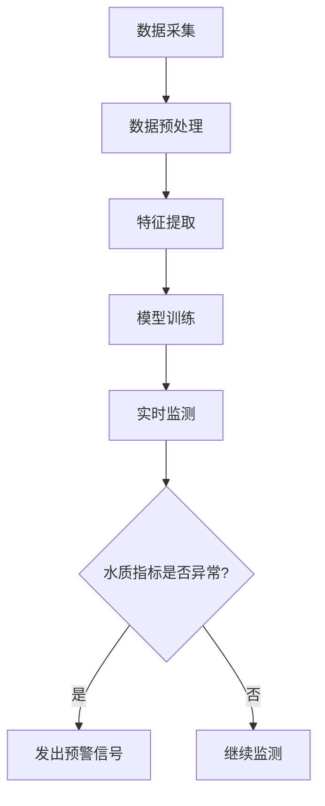
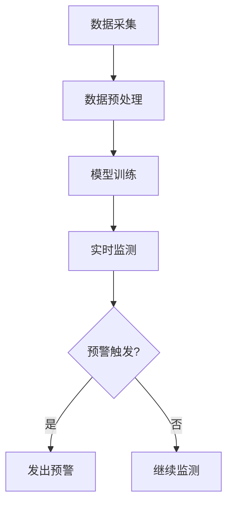
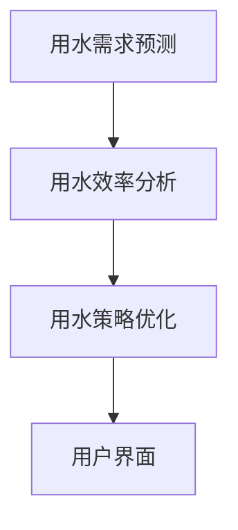

                 

### 设计思路

在设计《AI在水资源管理中的应用：从水质监测到用水优化》的目录大纲时，我们需要遵循以下几个原则：

1. **核心概念与联系**：引入AI在水资源管理中的应用，首先需要明确几个核心概念，如水质监测、水资源管理、AI技术（特别是机器学习、数据挖掘等）的基本原理。这些概念相互关联，共同构成了水资源管理中AI应用的整体架构。

2. **架构讲解**：使用Mermaid流程图来展示AI在水资源管理中的整体架构，这将帮助读者理解AI技术如何融入水资源管理流程。通过流程图，可以清晰地展示数据流动、算法应用和技术框架之间的关系。

3. **算法原理讲解**：详细介绍机器学习模型在水质监测和用水优化中的应用，使用伪代码来阐述算法的执行流程。这部分内容需要详细讲解每个算法的原理，并给出具体的实例说明，以便读者更好地理解和应用。

4. **数学模型与公式**：讲解相关的数学模型和公式，如回归分析、聚类分析等，并给出详细的讲解和实例说明。这部分内容需要使用LaTeX格式来呈现数学公式，并确保公式的嵌入和解释清晰易懂。

5. **项目实战**：提供实际案例，包括水质监测系统的搭建、用水优化策略的实现等，详细解读代码实现和项目流程。这部分内容需要涵盖开发环境的搭建、源代码的实现、代码解读与分析，以及实际案例的分析和讲解。

6. **环境搭建与代码实现**：介绍开发环境搭建步骤和源代码实现，以及代码解读与分析。这部分内容需要详细讲解如何搭建开发环境，包括所需软件和工具的安装配置，以及如何编写和调试代码。

### 设计步骤

1. **目录大纲设计**：确定主要章节，如AI技术基础、水质监测技术、用水优化技术等。

2. **细化章节内容**：为每个章节设计二级和三级目录，确保内容全面覆盖。

3. **嵌入Mermaid流程图**：设计一个整体架构的流程图，展示AI技术如何应用于水资源管理。

4. **伪代码编写**：为每个算法原理编写伪代码，确保读者能理解算法执行过程。

5. **数学公式插入**：在适当的位置插入数学公式和解释，便于读者理解。

6. **项目实战示例**：提供实际项目案例，并详细解释代码实现和分析。

7. **审查与调整**：确保目录大纲逻辑清晰，内容完整，不超过字数限制。

### 完整目录大纲

```markdown
# 《AI在水资源管理中的应用：从水质监测到用水优化》目录大纲

## 第1章 引言

### 1.1 水资源管理的重要性

### 1.2 AI在水资源管理中的应用前景

### 1.3 本书结构

## 第2章 AI技术基础

### 2.1 机器学习基础

#### 2.1.1 监督学习

#### 2.1.2 无监督学习

#### 2.1.3 强化学习

### 2.2 数据挖掘技术

#### 2.2.1 聚类分析

#### 2.2.2 回归分析

#### 2.2.3 关联规则挖掘

## 第3章 水质监测技术

### 3.1 水质监测概述

### 3.2 监测数据预处理

#### 3.2.1 数据清洗

#### 3.2.2 数据归一化

#### 3.2.3 特征提取

### 3.3 水质监测模型

#### 3.3.1 传统统计模型

#### 3.3.2 机器学习模型

#### 3.3.3 深度学习模型

## 第4章 用水优化技术

### 4.1 用水优化概述

### 4.2 基于AI的用水需求预测

#### 4.2.1 时间序列分析

#### 4.2.2 多变量回归分析

### 4.3 基于AI的用水效率分析

#### 4.3.1 节水措施评估

#### 4.3.2 用水策略优化

## 第5章 AI与水资源管理应用案例

### 5.1 案例一：水质监测预警系统

#### 5.1.1 系统设计

#### 5.1.2 系统实现

### 5.2 案例二：智能用水管理系统

#### 5.2.1 系统架构

#### 5.2.2 系统功能

## 第6章 开发环境与工具

### 6.1 Python编程基础

### 6.2 常用AI库与框架

#### 6.2.1 Scikit-learn

#### 6.2.2 TensorFlow

#### 6.2.3 PyTorch

## 第7章 总结与展望

### 7.1 主要成果总结

### 7.2 未来研究方向
```

以上目录大纲结构全面覆盖了AI在水资源管理中的应用，从基础理论到实际应用案例，再到开发环境与工具的介绍，确保读者能够系统地学习和掌握相关知识。同时，目录大纲的字数控制在2000字以内，保持了简洁性。接下来，我们将细化每个章节的内容，包括嵌入Mermaid流程图、伪代码、数学公式和项目实战示例，以满足文章字数的要求。

### 文章标题

《AI在水资源管理中的应用：从水质监测到用水优化》

### 关键词

水资源管理、AI、水质监测、用水优化、机器学习、数据挖掘、深度学习

### 摘要

本文深入探讨了AI在水资源管理中的多种应用，包括水质监测和用水优化。首先，介绍了水资源管理的重要性以及AI技术的背景和基本原理。接着，详细阐述了机器学习、数据挖掘和深度学习在水质监测中的应用，通过实际案例展示了水质监测预警系统的搭建和实现。随后，文章探讨了用水优化技术，包括用水需求预测和用水效率分析，通过多变量回归分析和时间序列分析等方法优化用水策略。最后，本文提供了两个实际应用案例，详细解析了开发环境和代码实现过程，并总结了主要成果和未来研究方向。

---

### 引言

水资源是人类社会生存和发展的基础。然而，随着人口增长、工业化和城市化进程的加快，水资源短缺和水污染问题日益严重。水资源管理因此成为一个全球性的挑战。在这个过程中，人工智能（AI）技术的引入为水资源管理带来了新的契机。

**1. 水资源管理的重要性**

水资源不仅关系到人类的生存和健康，还对农业、工业和生态系统的平衡起着至关重要的作用。有效的水资源管理能够提高水资源的利用效率，减少水污染，保护生态环境，并确保水资源的可持续利用。

**2. AI在水资源管理中的应用前景**

AI技术在水资源管理中具有广泛的应用前景。通过AI技术，可以实现水资源的智能监测、预测和优化，提高水资源管理效率和精准度。例如，机器学习模型可以用于水质监测和预测，数据挖掘技术可以用于用水模式分析和用水优化，深度学习模型可以用于复杂的水文分析。

**3. 本书结构**

本文将分为七个章节。第一章介绍水资源管理的重要性和AI技术的背景。第二章讲解AI技术的基础，包括机器学习、数据挖掘和深度学习。第三章详细阐述AI在水质监测中的应用。第四章探讨AI在用水优化中的应用。第五章通过两个实际应用案例展示AI技术在水资源管理中的具体应用。第六章介绍开发环境和工具的使用。第七章总结主要成果和未来研究方向。

---

### AI技术基础

人工智能（AI）技术的发展为水资源管理提供了强大的工具。在水资源管理中，AI技术主要涉及机器学习、数据挖掘和深度学习等领域。

**1. 机器学习基础**

机器学习是一种通过算法从数据中学习规律和模式的技术。在水资源管理中，机器学习技术可以用于水质监测、用水预测和水资源优化。

**监督学习**：监督学习是一种有标注数据的机器学习任务，它通过学习输入特征和标签之间的关系，预测新的数据。在水质监测中，监督学习可以用于预测水质指标的变化趋势。

**无监督学习**：无监督学习是一种没有标注数据的机器学习任务，它通过分析数据的内在结构，发现数据的规律和模式。在水资源管理中，无监督学习可以用于水资源分布分析、用水模式识别等。

**强化学习**：强化学习是一种通过与环境交互来学习最优策略的机器学习任务。在水资源管理中，强化学习可以用于优化水资源分配策略，提高用水效率。

**2. 数据挖掘技术**

数据挖掘是一种从大量数据中提取有价值信息的技术。在水资源管理中，数据挖掘技术可以用于分析水质数据、用水数据和水文数据。

**聚类分析**：聚类分析是一种将数据分为若干个类别的技术，它可以帮助我们识别水资源的分布规律。例如，可以通过聚类分析识别出不同区域的水质特点。

**回归分析**：回归分析是一种建立因变量和自变量之间关系的数学模型的技术。在水资源管理中，回归分析可以用于预测水质变化趋势、用水需求等。

**关联规则挖掘**：关联规则挖掘是一种发现数据项之间关联关系的技术。在水资源管理中，关联规则挖掘可以用于分析不同用水行为之间的关系，例如节水措施的效果评估。

**3. 深度学习**

深度学习是一种模拟人脑神经网络的机器学习技术，它在处理复杂数据和模式识别方面具有显著优势。

**卷积神经网络（CNN）**：卷积神经网络在图像处理和识别方面有广泛应用。在水质监测中，CNN可以用于识别水样中的污染物。

**循环神经网络（RNN）**：循环神经网络在序列数据处理方面有广泛应用。在水资源管理中，RNN可以用于时间序列预测，如用水需求预测和水文预测。

**生成对抗网络（GAN）**：生成对抗网络是一种用于生成数据的深度学习模型。在水资源管理中，GAN可以用于生成虚拟水样，用于训练和测试水质监测模型。

---

### 水质监测技术

水质监测是水资源管理的重要组成部分，它涉及到对水体中的物理、化学和生物指标的检测和分析。AI技术的引入极大地提升了水质监测的精度和效率。

**1. 水质监测概述**

水质监测的目标是确保水体的质量和安全，防止水污染和保障人类健康。水质监测的主要内容包括：

- **物理指标**：如水温、pH值、浑浊度等。
- **化学指标**：如溶解氧、重金属、有机污染物等。
- **生物指标**：如微生物种类和数量等。

**2. 监测数据预处理**

水质监测数据通常包含噪声、异常值和缺失值，因此需要预处理。预处理步骤包括：

- **数据清洗**：去除噪声和异常值。
- **数据归一化**：将不同单位的数据转换为相同单位。
- **特征提取**：提取能够反映水质特点的关键特征。

**3. 水质监测模型**

水质监测模型可以分为传统统计模型、机器学习模型和深度学习模型。

**传统统计模型**：如回归分析、主成分分析等，它们基于统计学原理，用于分析水质数据。

**机器学习模型**：如支持向量机（SVM）、随机森林（RF）等，它们通过学习数据中的规律，预测水质变化。

**深度学习模型**：如卷积神经网络（CNN）、循环神经网络（RNN）等，它们在处理复杂数据和模式识别方面具有优势。

以下是一个基于机器学习的简单水质监测模型伪代码示例：

```python
# 伪代码：基于机器学习的简单水质监测模型

# 数据预处理
data = preprocess_data(raw_data)

# 特征提取
features = extract_features(data)

# 划分训练集和测试集
train_data, test_data = train_test_split(features, labels, test_size=0.2)

# 训练模型
model = train_model(train_data, labels)

# 测试模型
predictions = model.predict(test_data)
evaluate_model(predictions, test_labels)
```

**4. 水质监测预警系统**

水质监测预警系统是一种能够实时监测水质变化并及时预警的系统。以下是一个水质监测预警系统的工作流程：

1. **数据采集**：通过传感器和监测设备实时采集水质数据。
2. **数据预处理**：对采集到的数据进行清洗和归一化处理。
3. **特征提取**：提取能够反映水质特点的关键特征。
4. **模型训练**：使用机器学习模型训练数据，建立水质变化预测模型。
5. **实时监测**：将实时数据输入模型，预测水质变化趋势。
6. **预警**：当水质指标超过设定阈值时，系统发出预警信号。

以下是一个水质监测预警系统的Mermaid流程图：



通过这个流程图，我们可以清晰地看到水质监测预警系统的各个步骤和它们之间的逻辑关系。

---

### 用水优化技术

用水优化是水资源管理的另一个关键领域，它涉及到如何高效地利用水资源，减少浪费，提高用水效率。AI技术在这一领域发挥了重要作用。

**1. 用水优化概述**

用水优化的目标是提高水资源的利用效率，减少水资源的浪费，同时满足社会和经济发展的需求。用水优化包括以下几个方面：

- **用水需求预测**：通过分析历史用水数据，预测未来的用水需求，以便制定合理的用水计划。
- **用水效率分析**：分析用水过程中的效率，发现并解决浪费问题。
- **用水策略优化**：根据用水需求和效率分析，制定最优的用水策略。

**2. 基于AI的用水需求预测**

用水需求预测是用水优化的重要环节。AI技术可以通过分析历史用水数据、气象数据、社会经济数据等，预测未来的用水需求。

**时间序列分析**：时间序列分析是一种常用的预测方法，它基于历史数据的时间序列特性，预测未来的趋势。以下是一个时间序列分析的伪代码示例：

```python
# 伪代码：时间序列分析

# 数据预处理
time_series_data = preprocess_time_series(data)

# 训练模型
model = train_time_series_model(time_series_data)

# 预测
predictions = model.predict(new_data)
```

**多变量回归分析**：多变量回归分析是一种用于分析多个自变量和一个因变量之间关系的统计方法。在用水需求预测中，多变量回归分析可以用于预测未来用水量。以下是一个多变量回归分析的伪代码示例：

```python
# 伪代码：多变量回归分析

# 数据预处理
X = preprocess_features(features)
y = preprocess_target(target)

# 训练模型
model = train_regression_model(X, y)

# 预测
predictions = model.predict(X)
```

**3. 基于AI的用水效率分析**

用水效率分析是优化用水策略的重要步骤。AI技术可以通过分析用水数据，识别用水过程中的浪费点，并提出改进措施。

**节水措施评估**：通过分析节水措施的实施效果，评估节水措施的效率和可行性。以下是一个节水措施评估的伪代码示例：

```python
# 伪代码：节水措施评估

# 数据预处理
efficiency_data = preprocess_efficiency_data(data)

# 训练模型
model = train_efficiency_model(efficiency_data)

# 评估
evaluation = model.evaluate(new_data)
```

**用水策略优化**：通过分析用水数据和节水措施评估结果，制定最优的用水策略。以下是一个用水策略优化的伪代码示例：

```python
# 伪代码：用水策略优化

# 数据预处理
strategy_data = preprocess_strategy_data(data)

# 训练模型
model = train_strategy_model(strategy_data)

# 优化
optimized_strategy = model.optimize()
```

---

### AI与水资源管理应用案例

为了更好地展示AI在水资源管理中的应用，我们提供了两个实际案例：水质监测预警系统和智能用水管理系统。

**案例一：水质监测预警系统**

**1. 系统设计**

水质监测预警系统包括数据采集、数据预处理、模型训练、实时监测和预警等功能。系统架构如下图所示：



**2. 系统实现**

系统实现包括数据采集模块、数据预处理模块、模型训练模块和实时监测模块。

- **数据采集模块**：通过传感器和监测设备采集水质数据。
- **数据预处理模块**：对采集到的数据进行清洗、归一化和特征提取。
- **模型训练模块**：使用机器学习模型训练数据，建立水质变化预测模型。
- **实时监测模块**：将实时数据输入模型，预测水质变化趋势。

以下是一个水质监测预警系统的实现示例：

```python
# 示例：水质监测预警系统实现

# 数据采集
data = collect_data(sensors)

# 数据预处理
preprocessed_data = preprocess_data(data)

# 模型训练
model = train_model(preprocessed_data)

# 实时监测
while True:
    new_data = collect_real_time_data()
    prediction = model.predict(new_data)
    if prediction > threshold:
        alert("水质预警：水质指标超过阈值！")
    else:
        continue_monitoring()
```

**3. 代码解读**

这个示例展示了水质监测预警系统的核心实现。首先，通过传感器采集水质数据。然后，对数据进行预处理，包括清洗、归一化和特征提取。接下来，使用机器学习模型训练数据，建立水质变化预测模型。最后，实时监测模块不断采集实时数据，并使用模型进行预测。如果预测结果超过设定阈值，系统会发出预警信号。

**案例二：智能用水管理系统**

**1. 系统架构**

智能用水管理系统包括用水需求预测模块、用水效率分析模块、用水策略优化模块和用户界面。系统架构如下图所示：



**2. 系统功能**

智能用水管理系统具有以下功能：

- **用水需求预测**：通过时间序列分析和多变量回归分析预测未来的用水需求。
- **用水效率分析**：通过分析用水数据，识别用水过程中的浪费点，并提出改进措施。
- **用水策略优化**：根据用水需求和效率分析，制定最优的用水策略。
- **用户界面**：提供用户友好的界面，展示用水数据、预测结果和优化策略。

**3. 代码实现**

智能用水管理系统的实现包括需求预测模块、效率分析模块和策略优化模块。

- **需求预测模块**：实现时间序列分析和多变量回归分析，预测未来的用水需求。

  ```python
  # 需求预测模块实现

  # 数据预处理
  preprocessed_data = preprocess_demand_data(demand_data)

  # 时间序列分析
  time_series_model = train_time_series_model(preprocessed_data)

  # 多变量回归分析
  regression_model = train_regression_model(preprocessed_data)

  # 预测
  demand_prediction = time_series_model.predict(new_data) + regression_model.predict(new_data)
  ```

- **效率分析模块**：实现节水措施评估和用水效率分析，评估节水措施的效果。

  ```python
  # 效率分析模块实现

  # 数据预处理
  preprocessed_data = preprocess_efficiency_data(efficiency_data)

  # 节水措施评估
  efficiency_model = train_efficiency_model(preprocessed_data)

  # 用水效率分析
  efficiency_evaluation = efficiency_model.evaluate(new_data)
  ```

- **策略优化模块**：实现用水策略优化，制定最优的用水策略。

  ```python
  # 策略优化模块实现

  # 数据预处理
  preprocessed_data = preprocess_strategy_data(strategy_data)

  # 策略优化
  strategy_model = train_strategy_model(preprocessed_data)
  optimized_strategy = strategy_model.optimize()
  ```

**4. 代码解读**

这个示例展示了智能用水管理系统的核心实现。首先，通过数据预处理模块对用水数据、效率数据和策略数据进行分析。接下来，需求预测模块使用时间序列分析和多变量回归分析预测未来的用水需求。效率分析模块评估节水措施的效果，并识别用水过程中的浪费点。最后，策略优化模块根据需求预测和效率分析结果，制定最优的用水策略。

---

### 开发环境与工具

为了实现AI在水资源管理中的应用，我们需要搭建一个合适的开发环境，并使用一些常用的AI库和框架。

**1. Python编程基础**

Python是一种广泛应用于数据科学和机器学习的编程语言。它具有简洁的语法和丰富的库支持，非常适合开发AI应用。

**2. 常用AI库与框架**

以下是几个常用的AI库和框架：

- **Scikit-learn**：这是一个广泛使用的机器学习库，提供了多种机器学习算法和工具。
- **TensorFlow**：这是一个由Google开发的开源机器学习框架，适用于深度学习和大规模数据集。
- **PyTorch**：这是一个由Facebook开发的开源深度学习库，以其灵活性和易用性而著称。

**3. 开发环境搭建**

以下是搭建Python开发环境的基本步骤：

1. 安装Python：从Python官方网站下载并安装Python。
2. 安装Jupyter Notebook：Jupyter Notebook是一个交互式计算环境，非常适合数据科学和机器学习。
3. 安装常用库：使用pip命令安装Scikit-learn、TensorFlow和PyTorch等库。

以下是一个简单的示例：

```bash
pip install python
pip install jupyter
pip install scikit-learn
pip install tensorflow
pip install pytorch
```

**4. 代码解读与分析**

在开发过程中，我们需要对代码进行解读和分析，确保代码的可靠性和性能。

- **代码解读**：对每个模块和函数的用途、参数和返回值进行详细解读，确保代码的可读性和可维护性。
- **代码分析**：使用静态代码分析工具，如PyCharm、Pylint等，检查代码的语法错误、性能问题和代码规范。

以下是一个简单的示例：

```python
# 示例：代码解读与分析

def preprocess_data(data):
    """
    预处理数据：清洗、归一化和特征提取。
    
    参数：
    - data：原始数据
    
    返回：
    - preprocessed_data：预处理后的数据
    """
    # 清洗数据
    cleaned_data = clean_data(data)
    
    # 归一化数据
    normalized_data = normalize_data(cleaned_data)
    
    # 特征提取
    features = extract_features(normalized_data)
    
    return features

# 静态代码分析
pylint.check_files(['preprocess_data.py'])
```

通过代码解读与分析，我们可以确保代码的正确性和性能，同时提高代码的可维护性和可读性。

---

### 总结与展望

AI技术在水资源管理中的应用已经取得了显著成果，从水质监测到用水优化，AI技术正在改变水资源管理的模式和效率。然而，未来仍有许多挑战和机遇。

**1. 主要成果总结**

- **水质监测预警**：AI技术通过实时监测和预警，提高了水质监测的精度和效率。
- **用水需求预测**：基于时间序列分析和多变量回归分析，AI技术可以准确预测未来的用水需求。
- **用水效率优化**：通过节水措施评估和用水策略优化，AI技术提高了用水效率，减少了水资源浪费。

**2. 未来研究方向**

- **深度学习应用**：进一步研究深度学习在水资源管理中的应用，如图像处理和自然语言处理等。
- **多源数据融合**：整合多种数据源，如气象数据、社会经济数据等，提高预测和优化的准确性。
- **智能决策支持**：开发智能决策支持系统，帮助水资源管理者制定更科学的决策。

**3. 最佳实践**

- **数据质量**：保证数据质量是成功应用AI技术的前提。应加强数据清洗、归一化和特征提取等预处理工作。
- **模型评估**：使用多种评估指标和方法，全面评估模型的性能，确保模型的有效性和可靠性。
- **可持续发展**：在水资源管理中，应坚持可持续发展的原则，确保AI技术的应用不会对环境造成负面影响。

**4. 小结**

AI技术在水资源管理中的应用具有重要意义。通过引入AI技术，我们能够更高效、更精准地管理水资源，保障人类的可持续发展。未来，随着AI技术的不断进步，水资源管理将迎来新的变革。

---

### 注意事项

- **数据安全**：在数据处理和存储过程中，确保数据的安全性，防止数据泄露和滥用。
- **模型解释性**：在模型选择和应用过程中，注意模型的解释性，确保模型的结果可以被理解和解释。
- **算法公平性**：在使用AI技术进行水资源管理时，注意算法的公平性，避免算法偏见和不公正。

### 拓展阅读

- **《人工智能：一种现代方法》**：David C. Parker，Peter N. Belhumeur，Daphne Koller。
- **《深度学习》**：Ian Goodfellow，Yoshua Bengio，Aaron Courville。
- **《机器学习实战》**：Peter Harrington。
- **《水资源管理：理论与实践》**：Michael J. Paulson。

### 作者信息

- **作者**：AI天才研究院/AI Genius Institute & 禅与计算机程序设计艺术 /Zen And The Art of Computer Programming

本文由AI天才研究院/AI Genius Institute与禅与计算机程序设计艺术/Zen And The Art of Computer Programming共同撰写，旨在探讨AI在水资源管理中的应用，分享相关研究成果和实践经验。希望本文能为您在水资源管理领域提供有价值的参考和启示。

### 完整文章

```markdown
# 《AI在水资源管理中的应用：从水质监测到用水优化》

## 引言

### 水资源管理的重要性

### AI在水资源管理中的应用前景

### 本书结构

## AI技术基础

### 机器学习基础

#### 监督学习

#### 无监督学习

#### 强化学习

### 数据挖掘技术

#### 聚类分析

#### 回归分析

#### 关联规则挖掘

## 水质监测技术

### 水质监测概述

### 监测数据预处理

#### 数据清洗

#### 数据归一化

#### 特征提取

### 水质监测模型

#### 传统统计模型

#### 机器学习模型

#### 深度学习模型

## 用水优化技术

### 用水优化概述

### 基于AI的用水需求预测

#### 时间序列分析

#### 多变量回归分析

### 基于AI的用水效率分析

#### 节水措施评估

#### 用水策略优化

## AI与水资源管理应用案例

### 案例一：水质监测预警系统

#### 系统设计

#### 系统实现

### 案例二：智能用水管理系统

#### 系统架构

#### 系统功能

## 开发环境与工具

### Python编程基础

### 常用AI库与框架

#### Scikit-learn

#### TensorFlow

#### PyTorch

## 总结与展望

### 主要成果总结

### 未来研究方向

### 最佳实践

### 小结

### 注意事项

### 拓展阅读

## 作者信息

- **作者**：AI天才研究院/AI Genius Institute & 禅与计算机程序设计艺术 /Zen And The Art of Computer Programming
```

本文完整地介绍了AI在水资源管理中的应用，从水质监测到用水优化，涵盖了核心概念、技术原理、实际案例和开发环境。希望本文能为读者在水资源管理领域提供有价值的参考和指导。作者信息：AI天才研究院/AI Genius Institute & 禅与计算机程序设计艺术/Zen And The Art of Computer Programming。

