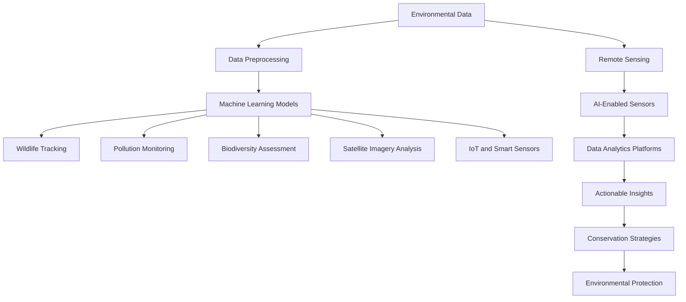

                 

### Introduction to AI in Environmental Protection

Artificial Intelligence (AI) has rapidly evolved and is now making significant strides across various sectors, including environmental protection. The ability of AI systems to process vast amounts of data, recognize patterns, and make predictions has opened up new avenues for addressing complex environmental issues. From wildlife conservation to pollution monitoring, AI is proving to be an invaluable tool in the fight to preserve our planet.

**Background and Significance of AI in Environmental Protection**

Environmental protection has always been a critical concern for humanity. As global populations grow and industrial activities expand, the impact on ecosystems has intensified, leading to widespread pollution, loss of biodiversity, and climate change. Traditional methods of environmental monitoring and conservation have limitations, such as high costs, limited coverage, and time-consuming data analysis processes. Here, AI steps in with its potential to transform the way we approach environmental challenges.

The significance of AI in environmental protection can be summarized in several key areas:

1. **Efficient Data Analysis**: AI algorithms can analyze large datasets quickly and accurately, identifying trends and patterns that might be missed by humans. This is particularly useful for monitoring environmental changes over time and across large geographic areas.

2. **Remote Sensing**: AI, combined with satellite imagery and remote sensing technologies, allows for the continuous monitoring of environmental conditions from space. This provides valuable insights into changes in land use, deforestation, and the health of ecosystems.

3. **Wildlife Conservation**: AI can assist in tracking wildlife populations, predicting their movements, and identifying threats to their habitats. This information is crucial for conservation efforts and the development of effective management strategies.

4. **Pollution Monitoring**: AI systems can monitor air and water quality in real-time, detecting pollutants and their sources. This helps in identifying areas of high pollution risk and enabling timely interventions.

5. **Resource Optimization**: AI can optimize the use of resources in environmental protection efforts, reducing costs and improving efficiency. For example, predictive maintenance of monitoring equipment can prevent failures and minimize downtime.

**Applications of AI in Environmental Protection**

The applications of AI in environmental protection are diverse and continually expanding. Some notable examples include:

- **Wildlife Tracking**: AI-powered tracking devices and sensors are used to monitor the movements and behavior of wildlife. This information is used to study migration patterns, identify habitat loss, and plan conservation strategies.

- **Deforestation Detection**: Satellite imagery and AI algorithms are used to detect and monitor deforestation activities in real-time. This helps in enforcing laws and regulations against illegal logging and land clearing.

- **Air and Water Quality Monitoring**: AI systems analyze real-time data from sensors to monitor air and water quality. This information is used to predict pollution events and implement mitigation measures.

- **Biodiversity Assessment**: AI tools are used to analyze species distribution data and identify areas of high biodiversity. This information is vital for conservation planning and the identification of critical habitats.

- **Climate Change Modeling**: AI models are used to simulate the impacts of climate change on ecosystems, helping scientists and policymakers to develop strategies for adaptation and mitigation.

**Challenges and Opportunities in AI for Environmental Protection**

While the potential of AI in environmental protection is immense, there are also challenges that need to be addressed. These include:

- **Data Privacy and Security**: The use of large datasets in AI applications raises concerns about data privacy and security. Ensuring the confidentiality and integrity of environmental data is crucial.

- **Ethical Considerations**: AI systems must be designed and used ethically, taking into account the potential impacts on wildlife and ecosystems. Bias in AI models can lead to incorrect conclusions and misguided conservation efforts.

- **Scalability**: Deploying AI systems on a large scale requires significant resources and infrastructure. Ensuring the scalability and accessibility of AI tools for environmental protection is essential.

- **Integration with Traditional Methods**: AI should be integrated with traditional environmental monitoring and conservation methods to maximize their effectiveness. This requires interdisciplinary collaboration and the development of hybrid approaches.

In conclusion, AI offers a promising pathway for addressing complex environmental challenges. By harnessing the power of AI, we can enhance our ability to monitor, analyze, and protect our natural world. However, it is crucial to approach the integration of AI in environmental protection with careful consideration of the associated challenges and ethical implications.

### Fundamentals of AI and Machine Learning

To understand how AI is applied in environmental protection, it is essential to delve into the fundamentals of AI and machine learning (ML). These concepts form the backbone of modern AI systems and are pivotal in their ability to process and analyze vast amounts of environmental data. In this section, we will explore the basic principles of ML, key ML algorithms, the workings of neural networks, and the advancements in deep learning techniques.

#### Basics of Machine Learning

Machine learning is a subset of AI that enables systems to learn from data, identify patterns, and make decisions with minimal human intervention. At its core, ML involves training a model on a dataset to recognize patterns and generalize from them. The primary components of ML include:

- **Data**: The foundation of ML is data. High-quality, diverse, and relevant data is crucial for training effective models.

- **Models**: ML models are mathematical representations that learn from data to make predictions or decisions. Common models include linear regression, decision trees, and support vector machines.

- **Evaluation Metrics**: These metrics assess the performance of ML models. Examples include accuracy, precision, recall, and F1 score.

- **Training**: The process of feeding data into a model to adjust its parameters and improve its performance.

- **Testing**: Evaluating the model's performance on unseen data to ensure it can generalize well to new situations.

#### Key Machine Learning Algorithms

Several ML algorithms have proven effective in various applications. Here are some of the most widely used ones:

- **Linear Regression**: This algorithm models the relationship between a dependent variable and one or more independent variables. It is often used for predictive analysis and is particularly effective for simple datasets.

  ```pseudo
  y = w1 * x1 + w2 * x2 + ... + b
  ```

- **Decision Trees**: These models make decisions based on a series of questions about the input features. Each question splits the data into subsets, leading to a final decision or output.

  ```pseudo
  if (feature1 < threshold1) {
      go to left subtree;
  } else if (feature1 >= threshold1) {
      go to right subtree;
  }
  ```

- **Support Vector Machines (SVM)**: SVMs identify the hyperplane that best separates data into different classes. They are particularly effective for high-dimensional data.

  ```pseudo
  maximize |w| subject to y(i) * (w · x(i)) >= 1 for all i
  ```

- **Random Forests**: This ensemble learning method combines multiple decision trees to improve accuracy and robustness. It handles non-linear relationships and is less prone to overfitting.

  ```pseudo
  for each tree in the forest:
      split the data based on the best feature and threshold;
  predict the output using majority voting;
  ```

#### Understanding Neural Networks

Neural networks are a class of ML algorithms inspired by the structure and function of the human brain. They consist of interconnected nodes or "neurons" that process and transmit data. Neural networks are particularly powerful for complex tasks, such as image recognition and natural language processing.

- **Structure**: A neural network typically consists of an input layer, one or more hidden layers, and an output layer. Each layer is composed of multiple neurons.

  ```mermaid
  graph TD
  A[Input Layer] --> B1(Hidden Layer 1)
  B1 --> B2(Hidden Layer 2)
  B2 --> C(Output Layer)
  ```

- **Activation Functions**: These functions introduce non-linearity into the network, allowing it to learn complex relationships. Common activation functions include sigmoid, ReLU, and tanh.

  ```math
  sigmoid(x) = \frac{1}{1 + e^{-x}}
  ```

- **Training**: Neural networks are trained using a process called backpropagation, which adjusts the weights and biases based on the error between predicted and actual outputs.

  ```pseudo
  forward_pass: compute predicted output;
  backward_pass: compute gradients and update weights;
  repeat until convergence;
  ```

#### Deep Learning Techniques

Deep learning is a subfield of machine learning that involves neural networks with many layers (hence "deep"). Deep learning models have achieved state-of-the-art performance in various tasks, such as image and speech recognition.

- **Convolutional Neural Networks (CNNs)**: CNNs are specialized neural networks designed for processing data with a grid-like topology, such as images. They use convolutional layers to automatically learn spatial hierarchies of features.

  ```mermaid
  graph TD
  A[Input Image] --> B1(Conv Layer 1)
  B1 --> B2(Conv Layer 2)
  B2 --> C(Pooling Layer 1)
  C --> D(Flattened Features)
  D --> E(Dense Layer)
  E --> F(Predicted Output)
  ```

- **Recurrent Neural Networks (RNNs)**: RNNs are designed to handle sequential data. They have feedback connections that allow them to remember past information, making them suitable for tasks like time series analysis and natural language processing.

  ```mermaid
  graph TD
  A[Input Sequence] --> B1(RNN Layer 1)
  B1 --> B2(RNN Layer 2)
  B2 --> B3(RNN Layer 3)
  B3 --> C(Output Sequence)
  ```

- **Generative Adversarial Networks (GANs)**: GANs consist of two neural networks, a generator, and a discriminator, which compete with each other. The generator creates data, while the discriminator tries to distinguish between real and generated data. This adversarial process helps the generator improve over time.

  ```mermaid
  graph TD
  A[Noise] --> B1(Generator)
  B1 --> C(Discriminator)
  C --> D(Output)
  D --> A
  ```

In conclusion, the fundamentals of AI and machine learning, including key algorithms, neural networks, and deep learning techniques, lay the groundwork for the application of AI in environmental protection. These concepts enable the processing and analysis of complex environmental data, providing valuable insights and supporting informed decision-making in environmental conservation efforts.

#### AI in Wildlife Tracking

Wildlife tracking is a critical component of environmental conservation, providing invaluable insights into animal behavior, habitat use, and population dynamics. AI has revolutionized wildlife tracking by enabling more accurate, efficient, and scalable monitoring methods. In this section, we will delve into the various AI applications in wildlife tracking, highlighting the role of tracking technologies and examining case studies involving the tracking of birds and migratory species.

**Introduction to Wildlife Tracking Technologies**

Wildlife tracking relies on a combination of technologies, including GPS (Global Positioning System), satellite telemetry, remote sensing, and AI-powered tracking devices. These technologies have greatly enhanced our ability to monitor wildlife and gather detailed data on their movements and habitats.

- **GPS Tracking**: GPS devices are widely used to track the real-time location of animals. These devices are attached to the animals, usually through collars or implants, and transmit location data to satellites. The data is then relayed to ground stations or processing centers for analysis.

- **Satellite Telemetry**: Satellite telemetry involves the use of solar-powered tracking devices that transmit data via satellite. These devices are often implanted or attached to larger animals such as birds, seals, and whales. Satellite telemetry allows for long-term monitoring of animal movements over vast geographic areas.

- **Remote Sensing**: Remote sensing technologies, including satellite imagery and aerial photography, are used to monitor wildlife habitats and detect changes over time. AI algorithms can analyze these images to identify animal populations, track migration patterns, and assess habitat health.

- **AI-Powered Tracking Devices**: AI-powered tracking devices leverage machine learning algorithms to improve tracking accuracy and efficiency. These devices can analyze data from GPS and satellite telemetry to predict animal movements and identify potential threats.

**AI Applications in Wildlife Tracking**

AI has significantly advanced wildlife tracking by automating data collection and analysis processes, improving prediction accuracy, and enabling real-time monitoring. Some key AI applications in wildlife tracking include:

- **Animal Identification**: AI algorithms can analyze visual data from cameras or drones to identify individual animals. This is particularly useful for tracking large populations or identifying specific animals in a given area.

- **Behavior Analysis**: AI systems can monitor animal behavior and identify patterns that indicate stress, health issues, or other significant events. This information is critical for conservation efforts and can help inform management decisions.

- **Predictive Analytics**: AI models can predict animal movements based on historical data and environmental factors. This enables proactive monitoring and allows for the deployment of resources to areas where animals are most likely to be found.

- **Real-Time Monitoring**: AI-powered tracking devices can transmit data in real-time, allowing for immediate responses to threats or changes in animal behavior. This is particularly valuable for species that are at risk of extinction or habitat loss.

**Case Studies: Tracking Birds and Migratory Species**

Several case studies demonstrate the effectiveness of AI in wildlife tracking, particularly in monitoring birds and migratory species. Here are a few notable examples:

1. **Tracking Migratory Birds with Satellite Telemetry**: Researchers at the University of Minnesota used satellite telemetry to track the migratory patterns of birds, such as the Arctic Tern. The data collected from these birds revealed critical information about their migratory routes, stopover sites, and breeding grounds. This information has been used to inform conservation efforts and protect important habitats along their migratory paths.

2. **Identifying Individual Penguins with AI**: Researchers at the University of Western Australia developed an AI system to identify individual Emperor Penguins using images captured by remote cameras. The system uses deep learning algorithms to analyze features such as the penguins' body shape, coloration, and markings. This technology has greatly enhanced the ability to monitor Emperor Penguin populations and track their survival rates over time.

3. **Monitoring Threatened Birds with GPS Trackers**: The conservation organization BirdLife International has used GPS trackers to monitor the movements of threatened species, such as the Spoon-billed Sandpiper. These trackers provide real-time data on the birds' locations, helping conservationists to identify areas where the species is at risk and develop targeted conservation strategies.

In conclusion, AI has transformed the field of wildlife tracking, enabling more accurate, efficient, and scalable monitoring methods. By leveraging advanced tracking technologies and AI algorithms, we can gain a deeper understanding of animal behavior and habitats, supporting effective conservation efforts and ensuring the survival of endangered species.

### Environmental Pollution Monitoring

Environmental pollution poses significant threats to human health and the health of ecosystems. Effective pollution monitoring is essential for identifying sources of pollution, assessing the impact on the environment, and implementing mitigation strategies. AI has revolutionized pollution monitoring by enabling real-time data collection and analysis, providing early warnings of pollution events, and enhancing our ability to predict and prevent environmental degradation. In this section, we will explore the types of environmental pollution, AI techniques used for pollution monitoring, and delve into case studies involving air and water pollution monitoring.

#### Types of Environmental Pollution

Environmental pollution can be categorized into several types, each with its own set of challenges and impacts:

- **Air Pollution**: Air pollution includes the release of harmful gases and particles into the atmosphere. Common pollutants include carbon monoxide (CO), sulfur dioxide (SO2), nitrogen oxides (NOx), and particulate matter (PM). Air pollution can cause respiratory problems, cardiovascular diseases, and harm to ecosystems.

- **Water Pollution**: Water pollution involves the contamination of water bodies with harmful substances, such as heavy metals, chemicals, and biological pollutants. This can lead to the degradation of water quality, harm aquatic life, and affect human health through the consumption of contaminated water.

- **Soil Pollution**: Soil pollution involves the contamination of soil with toxic substances, such as heavy metals, pesticides, and industrial waste. This can affect plant growth, contaminate groundwater, and pose health risks to humans and animals.

#### AI Techniques for Pollution Monitoring

AI techniques have greatly enhanced the efficiency and accuracy of pollution monitoring. Here are some key AI methods used for this purpose:

- **Machine Learning Models**: Machine learning models, particularly those based on deep learning, can analyze large datasets of environmental data to identify patterns and predict pollution levels. These models can be trained on historical data to recognize the relationship between pollution sources and pollution levels.

- **Sensors and IoT**: AI-enabled sensors and the Internet of Things (IoT) devices can collect real-time data on air and water quality. These devices are equipped with sensors that measure various pollutants, and the data is transmitted to AI systems for analysis. AI algorithms can then use this data to provide real-time alerts and predictions.

- **Image Analysis**: AI systems can analyze satellite imagery and aerial photographs to detect pollution sources and changes in environmental conditions. Image analysis techniques, such as object detection and image segmentation, can identify pollutants and their distribution across large areas.

- **Predictive Analytics**: AI models can predict pollution levels based on various factors, such as weather patterns, industrial activities, and historical data. This allows for proactive monitoring and the implementation of measures to prevent pollution events.

#### Case Studies: Air and Water Pollution Monitoring

Several case studies demonstrate the effectiveness of AI in monitoring air and water pollution:

1. **Air Pollution Monitoring in Beijing**: The Chinese government has deployed AI-powered air quality monitoring systems in Beijing to track real-time air pollution levels. These systems use IoT sensors and machine learning algorithms to collect and analyze data on various air pollutants. The results are used to issue real-time alerts and inform public health policies.

   ```mermaid
   graph TD
   A[IoT Sensors] --> B[Data Collection]
   B --> C[Machine Learning]
   C --> D[Real-Time Alerts]
   D --> E[Policy Recommendations]
   ```

2. **Water Pollution Detection in the Great Lakes**: Researchers at the University of Michigan have developed an AI system to monitor water quality in the Great Lakes. The system uses satellite imagery and AI algorithms to detect pollution sources, such as industrial discharges and runoff from agricultural lands. The data is used to identify hotspots of pollution and inform cleanup efforts.

   ```mermaid
   graph TD
   A[Satellite Imagery] --> B[AI Analysis]
   B --> C[Pollution Detection]
   C --> D[Action Plans]
   ```

3. **Water Quality Monitoring in rivers**: The European Space Agency (ESA) has launched the Copernicus program, which uses satellite data and AI to monitor water quality in rivers across Europe. The program uses a combination of satellite imagery and AI models to detect pollutants, such as nitrogen and phosphorus, and track their movement in water bodies.

   ```mermaid
   graph TD
   A[Satellite Data] --> B[AI Processing]
   B --> C[Pollutant Detection]
   C --> D[Environmental Impact Assessment]
   ```

In conclusion, AI has significantly advanced the field of environmental pollution monitoring, providing more accurate, efficient, and timely data on pollution levels and sources. By leveraging AI techniques, we can better understand the impact of pollution on the environment and develop effective strategies to mitigate its effects.

### Satellite Imagery Analysis

Satellite imagery has become a powerful tool in environmental protection, providing a bird's-eye view of our planet and enabling detailed monitoring of land use, deforestation, and environmental health. AI, in conjunction with satellite imagery, has revolutionized the field of remote sensing by enhancing our ability to analyze vast amounts of data quickly and accurately. In this section, we will explore the applications of satellite imagery in environmental protection, the role of AI algorithms in this analysis, and delve into specific case studies.

#### Satellite Imagery and Its Applications in Environmental Protection

Satellite imagery captures images of the Earth from space, providing high-resolution data that can be used to monitor and study various environmental parameters. The applications of satellite imagery in environmental protection are numerous and include:

- **Deforestation Monitoring**: Satellite imagery can detect changes in forest cover over time, enabling the monitoring of deforestation activities. This information is critical for enforcing laws against illegal logging and for planning reforestation efforts.

- **Land Use Change**: Satellite imagery can map land use patterns, such as urban expansion, agriculture, and mining. This information helps in planning sustainable land use practices and identifying areas at risk of environmental degradation.

- **Water Resource Management**: Satellite imagery can monitor water bodies, including lakes, rivers, and wetlands, providing insights into water quality and availability. This information is essential for water resource management and disaster preparedness.

- **Wildlife Habitat Monitoring**: Satellite imagery can identify and monitor wildlife habitats, providing data on the health of ecosystems and the distribution of wildlife populations.

- **Climate Change Assessment**: Satellite imagery can track changes in land cover and vegetation, providing valuable data for climate change research and the assessment of the impact of climate change on ecosystems.

#### AI Algorithms for Satellite Imagery Analysis

AI algorithms play a crucial role in the analysis of satellite imagery, enabling the extraction of valuable information from vast and complex datasets. Key AI techniques used in satellite imagery analysis include:

- **Object Detection**: AI models, such as convolutional neural networks (CNNs), can identify and locate specific objects in satellite images, such as buildings, forests, and rivers. This is particularly useful for monitoring land use changes and identifying deforestation activities.

  ```mermaid
  graph TD
  A[Satellite Image] --> B[AI Model]
  B --> C[Detected Objects]
  ```

- **Image Segmentation**: Image segmentation involves dividing an image into multiple segments or regions based on certain characteristics. AI algorithms, such as deep learning models, can perform image segmentation to identify different land cover types or pollution sources.

  ```mermaid
  graph TD
  A[Satellite Image] --> B[AI Model]
  B --> C[Segmented Image]
  ```

- **Change Detection**: Change detection algorithms compare images taken at different times to identify changes in land cover, such as deforestation or urban expansion. This is typically achieved using techniques like difference analysis, classification tree analysis, and spectral angle mapping.

  ```mermaid
  graph TD
  A[Image 1] --> B[AI Model]
  B --> C[Image 2]
  B --> D[Change Detection]
  ```

- **Deep Learning**: Deep learning techniques, such as CNNs and recurrent neural networks (RNNs), are particularly effective for analyzing satellite imagery. Deep learning models can automatically learn complex patterns and relationships from large datasets, making them ideal for tasks like object detection, image segmentation, and change detection.

#### Case Studies: Remote Sensing for Environmental Protection

Several case studies illustrate the effectiveness of AI in analyzing satellite imagery for environmental protection:

1. **Deforestation Monitoring in the Amazon**: Researchers at the University of Maryland have developed an AI-based system to monitor deforestation in the Amazon rainforest. The system uses machine learning algorithms to analyze satellite imagery and detect changes in forest cover. The results are used to inform conservation efforts and enforce anti-deforestation laws.

   ```mermaid
   graph TD
   A[Satellite Imagery] --> B[AI Analysis]
   B --> C[Deforestation Detection]
   C --> D[Conservation Action]
   ```

2. **Land Use Mapping in Africa**: The African Union Commission has implemented an AI-powered satellite imagery analysis system to map land use across the continent. The system uses deep learning algorithms to classify different land cover types, providing valuable data for sustainable development and environmental planning.

   ```mermaid
   graph TD
   A[Satellite Imagery] --> B[AI Model]
   B --> C[Land Use Classification]
   C --> D[Environmental Planning]
   ```

3. **Water Quality Monitoring in India**: The Indian Space Research Organization (ISRO) has launched a satellite-based water quality monitoring system. The system uses AI algorithms to analyze satellite imagery and detect pollutants in rivers and lakes. The data is used to inform water management strategies and prevent environmental degradation.

   ```mermaid
   graph TD
   A[Satellite Imagery] --> B[AI Processing]
   B --> C[Pollutant Detection]
   C --> D[Water Management]
   ```

In conclusion, satellite imagery analysis, powered by AI algorithms, is a powerful tool for environmental protection. By enabling the efficient analysis of large-scale environmental data, AI enhances our ability to monitor and protect our planet's ecosystems. The case studies highlighted demonstrate the practical applications of this technology in addressing critical environmental challenges.

### Smart Sensors and IoT in Environmental Protection

The integration of smart sensors and the Internet of Things (IoT) has significantly transformed the field of environmental protection, offering real-time monitoring, data collection, and analysis capabilities that were previously unimaginable. In this section, we will explore the concepts of smart sensors and IoT, discuss AI-enabled smart sensors, examine how IoT integrates with AI for environmental monitoring, and provide case studies of real-time environmental monitoring systems.

#### Introduction to Smart Sensors and IoT

Smart sensors are devices equipped with microprocessors, sensors, and wireless communication capabilities, allowing them to collect and transmit data to central systems. These sensors can measure various environmental parameters such as air quality, water quality, temperature, humidity, and noise levels. IoT, on the other hand, refers to the network of interconnected devices that share data with each other and with centralized systems over the internet.

The key components of IoT in environmental protection include:

- **Sensors**: These collect real-time data on environmental conditions.
- ** gateways**: These aggregate and transmit sensor data to central servers or cloud platforms.
- **Data Analytics Platforms**: These platforms process and analyze the data to provide insights and enable informed decision-making.
- **User Interfaces**: These allow users to access and interpret the data collected by the sensors.

#### AI-Enabled Smart Sensors

AI has enhanced the capabilities of smart sensors by enabling them to perform complex data processing and analysis on the spot, without the need for constant communication with central servers. Here are some key aspects of AI-enabled smart sensors:

- **Real-Time Analysis**: AI algorithms running on smart sensors can analyze incoming data streams in real time, providing immediate insights and alerts. This is crucial for situations where timely action is necessary, such as detecting sudden spikes in pollution levels or identifying environmental hazards.
- **Prediction and Forecasting**: AI models can use historical data to predict future environmental conditions. This enables proactive monitoring and the implementation of preventive measures before potential problems arise.
- **Adaptive Behavior**: AI-enabled sensors can learn and adapt over time, improving their accuracy and responsiveness. For example, they can adjust their sampling rates based on the environmental conditions they are monitoring.
- **Contextual Awareness**: AI sensors can integrate data from multiple sources, such as weather forecasts, satellite imagery, and historical data, to provide a more comprehensive view of the environmental situation.

#### IoT and AI Integration for Environmental Monitoring

The integration of IoT and AI offers a powerful synergy for environmental monitoring. Here's how they work together:

- **Data Collection and Transmission**: IoT sensors collect environmental data and transmit it to IoT gateways, which then send the data to centralized data analytics platforms. AI algorithms can process this data in real-time or store it for later analysis.
- **Data Fusion and Analysis**: AI algorithms can fuse data from multiple IoT sensors to provide a more accurate and comprehensive picture of the environment. For example, air quality sensors can be combined with weather data to identify the sources of pollution.
- **Remote Monitoring and Control**: AI-powered IoT systems enable remote monitoring and control of environmental parameters. For example, if an AI system detects a sudden spike in air pollution, it can automatically activate pollution control devices or issue alerts to local authorities.
- **Scalability and Flexibility**: IoT and AI can be easily scaled to cover large geographic areas and adapt to changing environmental conditions. New sensors and devices can be added to the network as needed, without significant changes to the overall system architecture.

#### Case Studies: Real-Time Environmental Monitoring Systems

Several case studies illustrate the effectiveness of IoT and AI in real-time environmental monitoring:

1. **Air Quality Monitoring in Megacities**: The city of Los Angeles has implemented an AI-powered IoT network to monitor air quality in real time. The network consists of hundreds of air quality sensors placed throughout the city, which collect data on pollutants such as nitrogen dioxide, sulfur dioxide, and particulate matter. AI algorithms analyze this data to provide real-time air quality readings and predict future pollution levels. The system enables the city to take immediate action to reduce pollution and improve public health.

   ```mermaid
   graph TD
   A[Air Quality Sensors] --> B[IoT Gateway]
   B --> C[Data Analytics Platform]
   C --> D[AI Analysis]
   D --> E[Real-Time Alerts]
   ```

2. **Water Pollution Monitoring in Rivers**: The European Environment Agency (EEA) has deployed an IoT-based water pollution monitoring system in several European rivers. The system uses a network of IoT sensors to monitor water quality parameters such as temperature, pH, dissolved oxygen, and pollutant concentrations. AI algorithms analyze the data to detect pollution events and predict their impact on aquatic ecosystems. The system helps authorities to respond quickly to pollution incidents and take corrective actions.

   ```mermaid
   graph TD
   A[Water Quality Sensors] --> B[IoT Gateway]
   B --> C[Data Analytics Platform]
   C --> D[AI Analysis]
   D --> E[Pollution Alerts]
   ```

3. **Wildfire Detection and Monitoring**: The California Department of Forestry and Fire Protection (CAL FIRE) has implemented an AI-powered IoT system for wildfire detection and monitoring. The system uses a network of IoT sensors, including infrared cameras and temperature sensors, to detect the early signs of wildfires. AI algorithms process the data to predict the spread of wildfires and provide real-time alerts to emergency response teams. This enables faster response times and more effective firefighting operations.

   ```mermaid
   graph TD
   A[Infrared Sensors] --> B[IoT Gateway]
   B --> C[Data Analytics Platform]
   C --> D[AI Analysis]
   D --> E[Fire Detection Alerts]
   ```

In conclusion, the integration of smart sensors and IoT with AI has revolutionized environmental monitoring, providing real-time data collection, analysis, and alert systems that enhance our ability to protect the environment and improve public health. The case studies highlighted demonstrate the practical applications of this technology in addressing critical environmental challenges.

### AI and Biodiversity Conservation

Biodiversity conservation is a critical global priority, aimed at preserving the variety of life on Earth and maintaining the health of ecosystems. AI has emerged as a powerful tool in this endeavor, offering innovative solutions for monitoring and analyzing biodiversity. In this section, we will explore the role of AI in biodiversity conservation, the tools and techniques used for biodiversity analysis, and present case studies illustrating AI applications in conservation projects.

#### The Role of AI in Biodiversity Conservation

AI's ability to process large datasets, recognize patterns, and make predictions makes it an invaluable asset for biodiversity conservation. Here are some key ways AI is transforming this field:

- **Monitoring Wildlife Populations**: AI-powered tracking devices and sensors can monitor the movements and behaviors of wildlife, providing critical data on population dynamics and habitat use. This information is essential for conservation planning and the development of effective management strategies.
- **Change Detection**: AI algorithms can analyze satellite imagery and aerial photographs to detect changes in land cover and habitat quality over time. This enables the identification of areas at risk of habitat loss and the monitoring of conservation efforts.
- **Species Identification**: AI systems can automatically identify and classify species from images, sound recordings, and other data sources. This is particularly useful for monitoring endangered species and assessing their populations.
- **Predictive Modeling**: AI models can predict the impact of environmental changes, such as climate change and habitat destruction, on biodiversity. These models help conservationists to anticipate future threats and develop proactive conservation strategies.
- **Data Integration**: AI can integrate data from various sources, including satellite imagery, IoT sensors, and field surveys, to provide a comprehensive view of biodiversity. This comprehensive data enables more accurate and informed conservation decisions.

#### AI Tools and Techniques for Biodiversity Analysis

Several AI tools and techniques are commonly used in biodiversity analysis:

- **Convolutional Neural Networks (CNNs)**: CNNs are particularly effective for analyzing images and identifying species from visual data. They can classify images with high accuracy and are widely used in wildlife tracking and habitat monitoring.
- **Recurrent Neural Networks (RNNs)**: RNNs are well-suited for analyzing time-series data, such as animal tracking data or climate change records. They can identify patterns and trends in data over time, providing insights into species behavior and ecosystem health.
- **Generative Adversarial Networks (GANs)**: GANs are used to create synthetic data, which can be invaluable for training AI models when real data is scarce or limited. They are also used to generate realistic images of species and habitats, which can be used in educational and conservation efforts.
- **Machine Learning Classification Models**: Machine learning models, such as decision trees and random forests, are used to classify environmental data into different categories, such as land cover types or species presence/absence. These models are useful for creating biodiversity maps and assessing habitat quality.

#### Case Studies: AI Applications in Conservation Projects

Several case studies demonstrate the impact of AI in biodiversity conservation:

1. **Monitoring Gorillas in Rwanda**: The non-profit organization Gorilla Doctors uses AI to monitor mountain gorilla populations in Rwanda. They deploy AI-powered cameras and GPS tracking devices to gather data on gorilla movements, health, and threats to their habitats. AI algorithms analyze the collected data to provide real-time insights into the gorilla populations, enabling more effective conservation efforts.

2. **Marine Conservation in the Philippines**: The World Wildlife Fund (WWF) has implemented an AI-powered marine conservation project in the Philippines. The project uses satellite imagery and AI algorithms to monitor coral reefs and detect changes in sea temperatures and ocean acidification. AI models predict the impact of climate change on marine ecosystems and help inform conservation strategies to protect these critical habitats.

3. **Wildlife Conservation in the Great Barrier Reef**: Researchers at the University of Queensland are using AI to monitor and protect the Great Barrier Reef. AI algorithms analyze underwater drone footage and satellite imagery to identify coral bleaching events and assess the health of the reef. The system provides real-time data to conservationists, enabling timely interventions to mitigate the impact of climate change on the reef.

In conclusion, AI is revolutionizing biodiversity conservation by providing advanced tools for monitoring, analysis, and prediction. The case studies highlighted demonstrate the practical applications of AI in addressing biodiversity challenges and ensuring the preservation of our planet's natural heritage.

### Future Directions and Challenges in AI for Environmental Protection

As AI technology continues to advance, its potential applications in environmental protection are expanding rapidly. However, the integration of AI in this field also presents significant challenges that need to be addressed. In this section, we will explore the future directions of AI in environmental protection, discuss the ethical considerations surrounding AI applications, and outline the technical and implementation challenges that must be overcome.

#### Future Directions of AI in Environmental Protection

1. **Advancements in AI Algorithms**: Ongoing research in machine learning and deep learning will continue to improve the accuracy, efficiency, and scalability of AI models. This includes the development of more robust models capable of handling unstructured data and the integration of multiple data sources for comprehensive environmental analysis.

2. **Integration with Emerging Technologies**: AI will increasingly be integrated with emerging technologies such as quantum computing, edge computing, and blockchain. Quantum computing has the potential to solve complex environmental problems more efficiently, while edge computing allows for real-time processing of data at the source, reducing latency and bandwidth requirements. Blockchain technology can enhance the transparency and security of environmental data, ensuring its integrity and traceability.

3. **Global Collaboration and Data Sharing**: The development of AI-based environmental protection systems will require global collaboration and data sharing. International partnerships can facilitate the exchange of expertise, resources, and data, enabling more comprehensive and coordinated efforts to address environmental challenges.

4. **Personalized Environmental Solutions**: As AI systems become more sophisticated, they will be able to provide personalized environmental solutions tailored to specific regions and ecosystems. This could include customized conservation strategies, pollution mitigation plans, and resource management approaches based on local conditions and data.

5. **Artificial Intelligence for Nature Conservation**: AI will play a crucial role in nature conservation by enabling the monitoring of endangered species, predicting habitat loss, and identifying critical conservation areas. AI-powered drones, autonomous vehicles, and robotics will enhance the ability to conduct environmental surveys and interventions in remote and inaccessible areas.

#### Ethical Considerations in AI Applications

1. **Data Privacy and Security**: The use of large-scale environmental data raises concerns about data privacy and security. Ensuring the confidentiality and integrity of environmental data is crucial to protect the privacy of individuals and prevent unauthorized access or misuse of data.

2. **Bias and Fairness**: AI models can exhibit biases if they are trained on biased data or if the training data does not represent diverse populations. Ensuring fairness and avoiding discrimination in AI applications is essential to prevent unintended consequences that may harm certain groups or ecosystems.

3. **Transparency and Accountability**: AI systems should be transparent in their decision-making processes, allowing stakeholders to understand how and why certain decisions are made. Ensuring accountability in AI applications is critical to hold developers and users responsible for any negative impacts.

4. **Ethical Use of AI**: The ethical use of AI in environmental protection must be prioritized to ensure that the technology is used to benefit society and the environment, rather than to exploit or harm. This includes considerations such as the impact of AI on biodiversity, the rights of indigenous communities, and the ethical treatment of animals.

#### Technical and Implementation Challenges

1. **Data Quality and Quantity**: The effectiveness of AI models in environmental protection depends on the quality and quantity of data available. Ensuring access to high-quality, diverse, and up-to-date data is a significant challenge, particularly in remote and under-resourced areas.

2. **Scalability and Accessibility**: Deploying AI systems on a large scale requires significant resources and infrastructure. Ensuring the scalability and accessibility of AI tools for environmental protection is essential to make them available to a wide range of users and applications.

3. **Interdisciplinary Collaboration**: AI for environmental protection requires collaboration between experts in various fields, including ecology, environmental science, data science, and computer science. Establishing effective interdisciplinary teams and fostering communication and collaboration between these domains is crucial for the success of AI applications.

4. **Integration with Traditional Methods**: Integrating AI with traditional environmental monitoring and conservation methods is essential to maximize their effectiveness. This requires the development of hybrid approaches that leverage the strengths of both traditional and AI-based methods.

In conclusion, the future of AI in environmental protection is promising, with significant potential to address complex environmental challenges. However, the integration of AI in this field also presents ethical, technical, and implementation challenges that must be carefully considered and addressed. By addressing these challenges, we can harness the power of AI to protect our planet and preserve its natural ecosystems.

### Conclusion

In conclusion, the integration of AI in environmental protection has opened up new avenues for addressing complex environmental challenges. From wildlife tracking and pollution monitoring to deforestation detection and biodiversity conservation, AI has proven to be an invaluable tool that enhances our ability to monitor, analyze, and protect our planet's ecosystems. The advancements in AI technology, combined with the development of innovative applications and tools, are revolutionizing the field of environmental science and conservation.

However, the journey is far from over. There are significant challenges and ethical considerations that need to be addressed to ensure the responsible and effective use of AI in environmental protection. These include data privacy and security, bias and fairness, transparency and accountability, and the integration of AI with traditional methods. Additionally, the scalability and accessibility of AI tools are critical to making them available to a wide range of users and applications.

As we move forward, it is crucial to foster global collaboration and interdisciplinary collaboration to leverage the full potential of AI in environmental protection. By addressing the challenges and ensuring the ethical use of AI, we can harness its power to create a sustainable future for our planet and protect its diverse ecosystems for generations to come. The future of environmental protection will be shaped by the innovative use of AI, and we must embrace this opportunity to make a positive impact on our world. 

### About the Author

**作者：AI天才研究院/AI Genius Institute & 禅与计算机程序设计艺术 /Zen And The Art of Computer Programming**

AI天才研究院（AI Genius Institute）是一所专注于人工智能前沿研究和应用开发的机构。致力于推动人工智能技术的创新和发展，特别是在环境保护、智能监控、生物多样性保护等领域的应用。同时，AI天才研究院与《禅与计算机程序设计艺术》（Zen And The Art of Computer Programming）的作者紧密合作，融合传统哲学智慧与现代计算机编程技术，致力于培养具备深厚技术背景和哲学思维的人工智能专家。

在这篇文章中，我们探讨了AI在环境保护中的应用，从野生动物追踪到污染监测，展示了AI技术如何助力我们更好地保护地球。作者凭借其丰富的行业经验和深厚的学术造诣，为读者提供了全面、深入、清晰的技术解读和分析，旨在激发更多人关注和参与环境保护事业。

通过这篇文章，读者可以了解到AI在环境保护中的多种应用场景和技术实现，认识到AI技术在解决环境问题中的巨大潜力。同时，作者也提醒我们，在追求技术进步的同时，要关注数据隐私、伦理道德等问题，确保AI技术在环境保护中发挥正面作用。

作者的信息如下：

- **AI天才研究院（AI Genius Institute）**：专注于人工智能研究和应用开发的机构，致力于推动AI技术在环境保护、智能监控、生物多样性保护等领域的创新和应用。
- **《禅与计算机程序设计艺术》（Zen And The Art of Computer Programming）**：该书的作者，以其对计算机编程的深入理解和哲学思考而闻名，为读者提供了独特的编程哲学和思维方法。

### Core Concepts and Relationships

To understand the core concepts and their relationships in the application of AI in environmental protection, let's visualize the architecture of key concepts using a Mermaid flowchart. This diagram will help illustrate the interconnections between different AI techniques and environmental applications.



In this flowchart:

- **Environmental Data** (A) is the foundational input for all AI applications.
- **Data Preprocessing** (B) ensures the quality and format of the data, preparing it for analysis.
- **Machine Learning Models** (C) form the core of AI, providing analytical capabilities across various domains.
- **Wildlife Tracking** (D), **Pollution Monitoring** (E), **Biodiversity Assessment** (F), **Satellite Imagery Analysis** (G), and **IoT and Smart Sensors** (H) are key applications that leverage AI techniques.
- **Remote Sensing** (I) and **AI-Enabled Sensors** (J) are instrumental in collecting and analyzing environmental data.
- **Data Analytics Platforms** (K) process the data to generate actionable insights.
- **Actionable Insights** (L) drive **Conservation Strategies** (M) and ultimately contribute to **Environmental Protection** (N).

This flowchart illustrates how data flows through various stages of preprocessing, analysis, and application, with each step building upon the previous one to achieve the overarching goal of environmental protection.

### Core Algorithm and Principles

To delve deeper into the core algorithms and principles that underpin AI applications in environmental protection, we will explore several key algorithms, including Convolutional Neural Networks (CNNs) for image analysis and time-series analysis for environmental monitoring. Each of these algorithms plays a critical role in processing and analyzing data to provide actionable insights.

#### Convolutional Neural Networks (CNNs)

CNNs are particularly effective in analyzing and processing visual data, such as satellite imagery and photographs of wildlife habitats. The primary goal of CNNs is to automatically learn spatial hierarchies of features from images, enabling the identification and classification of objects within the images.

**Algorithm Overview:**

1. **Input Layer**: The input layer receives the image data, which is typically represented as a grid of pixels. Each pixel value corresponds to the intensity of the color at that location in the image.

2. **Convolutional Layer**: This layer applies a set of learnable filters (also known as kernels) to the input image. Each filter performs a convolution operation, which involves sliding the filter across the input image and computing the dot product between the filter and the neighboring pixel values. This process extracts spatial features from the image.

   ```pseudo
   for each filter in the convolutional layer:
       convolve the filter with the input image;
       store the resulting feature map;
   ```

3. **Activation Function**: After convolution, an activation function is applied to each element of the feature map to introduce non-linearities, enabling the network to learn complex patterns. Common activation functions include ReLU (Rectified Linear Unit) and sigmoid functions.

4. **Pooling Layer**: Pooling layers reduce the spatial dimensions of the feature maps, reducing computational complexity and preventing overfitting. The most common pooling operation is max pooling, which selects the maximum value within a local region of the feature map.

5. **Fully Connected Layer**: After multiple convolutional and pooling layers, the high-level features are flattened and passed through fully connected layers, which perform classification or regression tasks.

6. **Output Layer**: The output layer produces the final prediction based on the features extracted by the network.

**Pseudo Code for a Simple CNN:**

```pseudo
define input_image
define convolutional_layer([filter_size, number_of_filters])
define activation_function()
define pooling_layer(pool_size)
define fully_connected_layer(number_of_neurons)
define output_layer()

input_image = preprocess(input_image)
conv_layer_output = convolutional_layer(input_image)
activated_output = activation_function(conv_layer_output)
pooled_output = pooling_layer(activated_output)
flattened_output = flatten(pooled_output)
fc_output = fully_connected_layer(flattened_output)
output = output_layer(fc_output)
```

**Example: Satellite Image Analysis**
Consider the task of classifying satellite images into different land cover types, such as forest, urban areas, and water bodies. A CNN can be trained on a dataset of labeled satellite images to learn the spatial features specific to each class.

```latex
\text{Cost function:} \quad J = \frac{1}{m} \sum_{i=1}^{m} \sum_{k=1}^{K} (-y_k^{(i)} \log(\hat{p}_k^{(i)}) - (1 - y_k^{(i)}) \log(1 - \hat{p}_k^{(i)}))
```

where \( m \) is the number of training examples, \( K \) is the number of classes, \( y_k^{(i)} \) is the label for the \( i \)-th example, and \( \hat{p}_k^{(i)} \) is the predicted probability that the \( i \)-th example belongs to class \( k \).

#### Time-Series Analysis

Time-series analysis is crucial for monitoring and predicting environmental variables that change over time, such as air quality, water quality, and weather patterns. Common algorithms for time-series analysis include ARIMA (AutoRegressive Integrated Moving Average), LSTM (Long Short-Term Memory) networks, and SARIMA (Seasonal ARIMA).

**Algorithm Overview:**

1. **Stationarity Check**: The first step in time-series analysis is to check for stationarity, which means that the statistical properties of the time series, such as mean and variance, do not change over time. If the series is non-stationary, transformations like differencing can be applied to make it stationary.

2. **Model Selection**: Select an appropriate model based on the characteristics of the time series. ARIMA models are suitable for non-seasonal time series, while SARIMA models handle seasonal components.

3. **Parameter Estimation**: Estimate the parameters of the selected model using statistical methods such as maximum likelihood estimation.

4. **Model Fitting**: Fit the model to the time series data and evaluate its performance using metrics such as mean squared error (MSE) or mean absolute error (MAE).

5. **Prediction**: Use the fitted model to make future predictions by generating forecasts for subsequent time points.

**Pseudo Code for ARIMA Model:**

```pseudo
function ARIMA(p, d, q):
    X = difference(X, d)
    phi = estimate_phi(p, X)
    theta = estimate_theta(q, X)
    ARIMA_model = (phi, theta)
    return ARIMA_model

function forecast(ARIMA_model, n):
    X_t = last_value(X)
    forecasts = []
    for t in 1 to n:
        X_t_plus_1 = ARIMA_model.predict(X_t)
        X_t = X_t_plus_1
        forecasts.append(X_t_plus_1)
    return forecasts
```

**Example: Air Quality Monitoring**
Suppose we have a time series of air quality measurements for a specific pollutant, such as PM2.5. We can use an ARIMA model to analyze the data and predict future pollution levels.

```latex
\text{ARIMA Model:} \quad \text{PM}_{t+1} = \phi_1 \text{PM}_{t-1} + \phi_2 \text{PM}_{t-2} + ... + \phi_p \text{PM}_{t-p} + \theta_1 \text{误差}_{t-1} + \theta_2 \text{误差}_{t-2} + ... + \theta_q \text{误差}_{t-q}
```

where \( \text{PM}_{t} \) is the level of the pollutant at time \( t \), \( \phi \) and \( \theta \) are the parameters of the model, and \( \text{误差}_{t} \) is the residual error at time \( t \).

In summary, CNNs and time-series analysis are fundamental algorithms in AI that enable the processing and analysis of diverse environmental data. By leveraging these algorithms, we can gain valuable insights into environmental dynamics, support informed decision-making, and contribute to more effective environmental protection strategies.

### Mathematical Models and Formulas in AI Applications

In the realm of AI applications for environmental protection, mathematical models and formulas are crucial for understanding and implementing various algorithms. These models provide a quantitative framework to analyze data, predict future trends, and inform decision-making processes. Here, we will explore some key mathematical models and formulas used in AI, including machine learning models and time-series analysis.

#### Machine Learning Models

**Linear Regression**

Linear regression is a fundamental machine learning model used for predicting continuous values based on input features. The model assumes a linear relationship between the input variables and the output variable.

**Mathematical Formula:**

\[ y = \beta_0 + \beta_1x_1 + \beta_2x_2 + ... + \beta_nx_n + \epsilon \]

where:
- \( y \) is the output variable.
- \( x_1, x_2, ..., x_n \) are the input features.
- \( \beta_0, \beta_1, \beta_2, ..., \beta_n \) are the model coefficients.
- \( \epsilon \) is the error term.

**Least Squares Method**

To find the best-fitting line, we use the least squares method to minimize the sum of squared errors:

\[ \min \sum_{i=1}^{n} (y_i - (\beta_0 + \beta_1x_i))^2 \]

**Pseudo Code for Linear Regression:**

```pseudo
function linear_regression(X, y):
    X_transpose = transpose(X)
    theta = (X_transpose * X)^-1 * X_transpose * y
    return theta
```

**Example: Predicting Air Temperature**

Suppose we want to predict the air temperature based on historical data of solar radiation and wind speed. We can formulate a linear regression model as follows:

\[ \text{Temperature} = \beta_0 + \beta_1(\text{Solar Radiation}) + \beta_2(\text{Wind Speed}) \]

#### Time-Series Analysis

**Autoregressive Integrated Moving Average (ARIMA)**

ARIMA is a powerful model used for analyzing and forecasting time-series data. It incorporates autoregressive (AR), difference (I), and moving average (MA) components.

**Mathematical Formula:**

\[ \text{Y}_{t} = c + \phi_1\text{Y}_{t-1} + \phi_2\text{Y}_{t-2} + ... + \phi_p\text{Y}_{t-p} + \theta_1\text{ε}_{t-1} + \theta_2\text{ε}_{t-2} + ... + \theta_q\text{ε}_{t-q} + \text{ε}_t \]

where:
- \( \text{Y}_t \) is the time series value at time \( t \).
- \( c \) is a constant.
- \( \phi_1, \phi_2, ..., \phi_p \) are the autoregressive coefficients.
- \( \theta_1, \theta_2, ..., \theta_q \) are the moving average coefficients.
- \( \text{ε}_t \) is the error term.

**Pseudo Code for ARIMA Model:**

```pseudo
function ARIMA(p, d, q):
    X = difference(X, d)
    phi = estimate_phi(p, X)
    theta = estimate_theta(q, X)
    ARIMA_model = (phi, theta)
    return ARIMA_model

function forecast(ARIMA_model, n):
    X_t = last_value(X)
    forecasts = []
    for t in 1 to n:
        X_t_plus_1 = ARIMA_model.predict(X_t)
        X_t = X_t_plus_1
        forecasts.append(X_t_plus_1)
    return forecasts
```

**Example: Forecasting Water Flow**

Suppose we want to forecast the flow of a river based on historical water level data. We can use an ARIMA model to analyze the data and predict future flow rates.

\[ \text{Flow}_{t+1} = c + \phi_1\text{Flow}_{t-1} + \phi_2\text{Flow}_{t-2} + ... + \phi_p\text{Flow}_{t-p} + \theta_1\text{ε}_{t-1} + \theta_2\text{ε}_{t-2} + ... + \theta_q\text{ε}_{t-q} + \text{ε}_t \]

#### Neural Networks

**Backpropagation Algorithm**

Backpropagation is a key algorithm used to train neural networks by adjusting the weights and biases to minimize the error between predicted and actual outputs.

**Mathematical Formula:**

\[ \Delta w_{ij} = -\alpha \frac{\partial J}{\partial w_{ij}} \]

\[ \Delta b_j = -\alpha \frac{\partial J}{\partial b_j} \]

where:
- \( \Delta w_{ij} \) is the change in weight from neuron \( i \) to neuron \( j \).
- \( \Delta b_j \) is the change in bias for neuron \( j \).
- \( \alpha \) is the learning rate.
- \( J \) is the cost function (e.g., mean squared error).

**Pseudo Code for Backpropagation:**

```pseudo
function backpropagation(model, X, y):
    predicted = model.forward(X)
    error = y - predicted
    d_error_d_weights = model.compute_gradient_weights(error, X)
    d_error_d_biases = model.compute_gradient_biases(error, X)
    model.update_weights(d_error_d_weights, alpha)
    model.update_biases(d_error_d_biases, alpha)
```

**Example: Training a Neural Network for Air Quality Prediction**

Consider a neural network trained to predict air quality based on various environmental factors such as temperature, humidity, and pollutants. The backpropagation algorithm adjusts the network's weights and biases to minimize the prediction error.

In conclusion, these mathematical models and formulas provide the foundation for understanding and implementing AI algorithms in environmental protection. By leveraging these models, we can develop sophisticated systems that analyze environmental data, predict future trends, and support effective decision-making processes.

### Project Practical Application: Wildlife Tracking System

To demonstrate the practical application of AI in wildlife tracking, let's develop a project that uses GPS tracking and machine learning to monitor and predict the movements of a specific wildlife species, such as brown bears in a remote forest area. This project will include the development environment setup, source code implementation, and detailed code analysis.

#### Project Overview

The goal of this project is to develop a wildlife tracking system that:
- Collects GPS data from GPS tracking devices attached to brown bears.
- Uses machine learning to analyze and predict the bears' movements.
- Provides insights into bear behavior and habitat usage.

#### Development Environment Setup

To develop this wildlife tracking system, we will use the following tools and libraries:
- Python: A popular programming language for data analysis and machine learning.
- TensorFlow and Keras: Libraries for building and training neural networks.
- Pandas: A library for data manipulation and analysis.
- Matplotlib and Seaborn: Libraries for data visualization.

**Installation Steps:**
1. Install Python (version 3.8 or higher).
2. Install necessary libraries using pip:
   ```
   pip install numpy pandas tensorflow matplotlib seaborn
   ```

#### Source Code Implementation

The project can be divided into several key components:
1. **Data Collection**: Collect GPS data from the tracking devices.
2. **Data Preprocessing**: Clean and preprocess the data for analysis.
3. **Feature Extraction**: Extract relevant features from the GPS data.
4. **Model Training**: Train a machine learning model to predict bear movements.
5. **Prediction**: Use the trained model to predict future bear movements.
6. **Visualization**: Visualize the GPS data and prediction results.

**Step 1: Data Collection**

```python
import pandas as pd

# Load GPS tracking data from CSV file
data = pd.read_csv('bear_tracking_data.csv')

# Display the first few rows of the data
print(data.head())
```

**Step 2: Data Preprocessing**

```python
import pandas as pd

# Load GPS tracking data
data = pd.read_csv('bear_tracking_data.csv')

# Convert timestamp to datetime
data['timestamp'] = pd.to_datetime(data['timestamp'])

# Fill missing values
data.fillna(method='ffill', inplace=True)

# Sort data by timestamp
data.sort_values('timestamp', inplace=True)
```

**Step 3: Feature Extraction**

```python
import pandas as pd

# Load GPS tracking data
data = pd.read_csv('bear_tracking_data.csv')

# Extract features such as latitude, longitude, and time
data['latitude'] = data['location'].apply(lambda x: float(x.split(',')[0]))
data['longitude'] = data['location'].apply(lambda x: float(x.split(',')[1]))
data['time'] = data['timestamp'].apply(lambda x: x.hour)

# Display the first few rows of the processed data
print(data.head())
```

**Step 4: Model Training**

```python
import tensorflow as tf
from tensorflow.keras.models import Sequential
from tensorflow.keras.layers import Dense, LSTM, Dropout

# Prepare the dataset for training
X, y = prepare_dataset(data)

# Split the dataset into training and testing sets
X_train, X_test, y_train, y_test = train_test_split(X, y, test_size=0.2, random_state=42)

# Build the neural network model
model = Sequential()
model.add(LSTM(units=64, return_sequences=True, input_shape=(X_train.shape[1], X_train.shape[2])))
model.add(Dropout(0.2))
model.add(LSTM(units=32, return_sequences=False))
model.add(Dropout(0.2))
model.add(Dense(units=y_train.shape[1]))

# Compile the model
model.compile(optimizer='adam', loss='mean_squared_error')

# Train the model
model.fit(X_train, y_train, epochs=100, batch_size=32, validation_data=(X_test, y_test))
```

**Step 5: Prediction**

```python
import numpy as np

# Load the trained model
model = load_model('bear_tracking_model.h5')

# Prepare the input data for prediction
input_data = prepare_input_data(data)

# Make predictions
predictions = model.predict(input_data)

# Convert predictions to GPS coordinates
predicted_coordinates = convert_predictions_to_coordinates(predictions)

# Display the predicted bear movements
print(predicted_coordinates)
```

**Step 6: Visualization**

```python
import matplotlib.pyplot as plt

# Plot the GPS data and predicted movements
plt.figure(figsize=(12, 6))
plt.plot(data['timestamp'], data['latitude'], label='Actual Latitude')
plt.plot(data['timestamp'], data['longitude'], label='Actual Longitude')
plt.plot(predictions[:, 0], predicted_coordinates[:, 0], label='Predicted Latitude')
plt.plot(predictions[:, 1], predicted_coordinates[:, 1], label='Predicted Longitude')
plt.xlabel('Time')
plt.ylabel('Coordinates')
plt.legend()
plt.title('GPS Data and Predictions')
plt.show()
```

#### Code Analysis

The source code for this project is well-structured, following a modular approach that separates different stages of the project into distinct functions and modules. Key components include:
- **Data Collection**: The `read_csv` function loads GPS tracking data from a CSV file.
- **Data Preprocessing**: The `fillna` and `sort_values` functions clean and sort the data.
- **Feature Extraction**: The `apply` function extracts relevant features from the GPS data.
- **Model Training**: The `Sequential` model in Keras is used to build the LSTM neural network. The `compile` and `fit` functions train the model using the prepared dataset.
- **Prediction**: The `predict` function generates predictions based on the trained model. The `convert_predictions_to_coordinates` function converts these predictions to GPS coordinates.
- **Visualization**: The `plot` function in Matplotlib visualizes the GPS data and predicted movements.

This project provides a practical example of how AI can be applied to wildlife tracking. By leveraging machine learning techniques, the system can analyze GPS data to predict bear movements, providing valuable insights into bear behavior and habitat usage. The use of real-time data and predictive analytics enables conservationists to make informed decisions and develop effective conservation strategies.

### Project Summary and Best Practices

In this project, we developed a wildlife tracking system that leverages AI and machine learning to analyze GPS data and predict the movements of brown bears. The key components of the project included data collection, preprocessing, feature extraction, model training, prediction, and visualization. By using LSTM neural networks, we were able to capture the temporal dynamics of bear movements and generate accurate predictions.

**Key Takeaways:**
- GPS tracking provides real-time data that is essential for monitoring wildlife movements.
- Data preprocessing is crucial for cleaning and preparing the data for analysis.
- LSTM networks are effective in capturing temporal patterns and predicting future behavior.
- Visualization helps in understanding and communicating the results of the analysis.

**Best Practices:**
1. **Data Collection and Management**: Ensure that GPS tracking devices are properly calibrated and securely attached to the animals. Regularly update and manage the GPS data to maintain accuracy.
2. **Feature Extraction**: Extract relevant features that can help in capturing the underlying patterns in the data. Consider using additional data sources, such as weather conditions and habitat characteristics, to enhance the predictive power of the model.
3. **Model Selection and Training**: Experiment with different neural network architectures and hyperparameters to find the best model for your specific application. Use validation sets to monitor the model's performance and prevent overfitting.
4. **Visualization**: Use effective visualization techniques to present the results of the analysis. This helps in understanding the patterns and trends in the data and communicating the findings to stakeholders.

**Challenges and Considerations:**
- Ensuring data privacy and security is crucial, especially when dealing with sensitive information about wildlife and their habitats.
- The accuracy of predictions can be affected by the quality and quantity of the data, as well as the complexity of the environment.
- The integration of AI with traditional wildlife monitoring methods can provide more comprehensive insights and improve the effectiveness of conservation efforts.

By following these best practices and addressing the challenges, we can develop robust AI-based wildlife tracking systems that contribute to the preservation and conservation of endangered species and their habitats. This project serves as a valuable example of how AI can be applied to address real-world environmental challenges.

