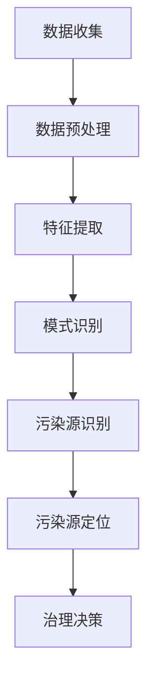
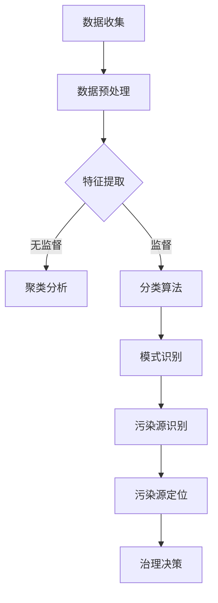

                 

## 文章标题

### AI在环境污染源追踪中的角色：支持精准治理

---

### 关键词

- **人工智能**  
- **环境监测**  
- **污染源追踪**  
- **精准治理**  
- **机器学习**  
- **深度学习**  
- **算法分析**  
- **数据分析**

---

### 摘要

随着全球环境污染问题的日益严重，有效地追踪污染源成为环境治理的关键。本文探讨了人工智能（AI）在环境污染源追踪中的应用，通过引入先进的机器学习和深度学习技术，揭示了AI在污染源识别、影响评估和政策制定中的关键角色。本文首先介绍了AI的基础知识及其在环境监测中的重要性，随后详细分析了AI在污染源追踪中的具体应用和算法原理。此外，本文还讨论了AI在政策制定和实际治理中的贡献，并通过案例研究和未来趋势展望，探讨了AI在环境治理中的广阔前景。

---

## 引言

环境污染已成为全球性挑战，对人类健康和生态系统造成了严重影响。有效治理环境污染的首要任务是精准追踪污染源，这不仅有助于制定针对性的治理措施，还能提高治理效率。在此背景下，人工智能（AI）技术以其强大的数据处理和分析能力，成为环境污染源追踪的有力工具。

### 环境污染的现状和挑战

环境污染问题涉及多个领域，包括空气污染、水污染和土壤污染。空气污染主要由工业排放、交通尾气和建筑工地扬尘引起；水污染则源于工业废水、农业径流和生活污水；土壤污染则主要由于农药、重金属和工业废弃物。这些污染物不仅对人类健康构成威胁，还破坏了生态系统，导致生物多样性减少。

#### 空气污染

空气污染已经成为全球范围内严重的公共健康问题。主要污染物包括颗粒物（PM2.5和PM10）、二氧化硫（SO2）、氮氧化物（NOx）和挥发性有机化合物（VOCs）。这些污染物不仅引发呼吸系统疾病，还会加剧心血管疾病和癌症的发生率。

#### 水污染

水污染问题同样不容忽视。工业废水、农业径流和生活污水是主要污染源。工业废水中含有重金属、有机污染物和化学物质，农业径流则携带农药和化肥，而生活污水中则含有有机物、病原体和营养盐。水污染会导致水源枯竭、水质恶化，进而影响人类饮用水安全和农业生产。

#### 土壤污染

土壤污染对生态系统和农业生产影响深远。土壤污染源包括农药、重金属和工业废弃物。污染物在土壤中积累，会影响植物生长，降低土壤肥力，甚至对地下水造成污染。

### 环境污染治理的挑战

尽管各国政府和国际组织在治理环境污染方面做出了巨大努力，但现有的治理方法仍面临诸多挑战：

1. **监测和检测难度大**：环境污染监测需要大量的设备和人力，而且污染物种类繁多，监测难度大。
2. **治理成本高**：治理环境污染需要投入大量资金和资源，尤其是在处理复杂污染物时，成本更高。
3. **缺乏有效的治理策略**：现有的治理策略大多基于经验，缺乏科学依据，难以实现精准治理。
4. **数据共享和整合困难**：环境污染监测数据分散在不同机构和部门，缺乏统一的数据标准和共享机制。

### AI在环境监测中的作用

人工智能技术在环境监测中具有巨大的潜力。AI能够处理和分析大量复杂的环境数据，提高监测精度和效率。具体来说，AI在环境监测中的作用主要体现在以下几个方面：

1. **数据收集和处理**：AI可以通过传感器网络和卫星遥感技术收集环境数据，并利用机器学习和深度学习算法进行数据处理和分析。
2. **污染源识别**：AI可以分析环境数据，识别污染源，为治理决策提供科学依据。
3. **影响评估**：AI可以预测污染物的传播和影响范围，评估治理措施的效果，为调整策略提供支持。
4. **预测和预警**：AI可以根据历史数据和当前环境状况，预测未来的污染趋势，提前采取应对措施。

### 本文目的

本文旨在探讨AI在环境污染源追踪中的应用，分析其核心算法原理，并探讨AI在政策制定和治理实践中的贡献。通过本文，读者将了解：

1. AI技术的基本原理及其在环境监测中的应用。
2. AI在污染源识别和影响评估中的具体实现。
3. AI技术在政策制定和治理实践中的实际应用和效果。
4. AI技术在环境治理中的未来发展趋势和挑战。

## AI技术基础

人工智能（AI）是计算机科学的一个分支，旨在使机器具备类似人类的智能。AI系统通过学习和理解数据，能够执行复杂任务，包括识别模式、做出决策和生成预测。AI技术在环境监测中的应用，主要依赖于其在数据收集、处理和分析方面的强大能力。

### AI的基本原理

AI的核心概念包括机器学习（Machine Learning，ML）和深度学习（Deep Learning，DL）。机器学习是一种让计算机从数据中学习的方法，无需显式编程。机器学习算法通过训练数据集，学习数据中的模式和规律，然后利用这些规律对新的数据进行预测或分类。深度学习是机器学习的一个子领域，它通过模拟人脑神经网络结构，能够处理更复杂的任务。

#### 机器学习

机器学习算法主要包括监督学习（Supervised Learning）、无监督学习（Unsupervised Learning）和半监督学习（Semi-Supervised Learning）。监督学习需要标注的数据集，算法通过学习输入和输出之间的关系，预测新的输入数据。无监督学习则无需标注数据集，算法通过发现数据中的结构和模式，对数据进行聚类或降维。半监督学习结合了监督学习和无监督学习的特点，利用少量标注数据和大量未标注数据，提高模型的性能。

#### 深度学习

深度学习通过多层神经网络（Neural Networks）进行数据处理，能够自动提取特征并建立复杂的非线性模型。深度学习在图像识别、语音识别和自然语言处理等领域取得了显著的成果。常见的深度学习模型包括卷积神经网络（Convolutional Neural Networks，CNNs）、循环神经网络（Recurrent Neural Networks，RNNs）和生成对抗网络（Generative Adversarial Networks，GANs）。

### AI在环境监测中的应用

AI在环境监测中的应用主要涉及数据收集、处理和分析。以下将详细探讨这些方面：

#### 数据收集

环境监测需要大量的数据，包括气象数据、水文数据和污染物浓度数据。传统的监测方法依赖于地面监测站和遥感技术。然而，这些方法存在数据覆盖范围有限、实时性较差等问题。AI通过引入传感器网络和卫星遥感技术，可以大幅提高数据收集的效率和覆盖范围。传感器网络由大量的环境传感器组成，能够实时监测环境参数。卫星遥感技术则可以从太空获取大范围的环境数据，包括地表温度、植被覆盖和大气成分。

#### 数据处理

环境监测数据通常复杂且多样，包括连续数据和离散数据。这些数据可能存在噪声、缺失值和异常值，需要经过预处理才能用于模型训练。AI在数据处理方面的应用主要包括数据清洗、数据归一化和特征提取。数据清洗通过去除噪声和异常值，提高数据的可靠性。数据归一化通过调整数据范围和分布，消除不同量纲数据对模型的影响。特征提取则是从原始数据中提取出对模型训练有重要意义的特征，提高模型的学习效率。

#### 数据分析

数据分析是环境监测的核心任务，旨在从数据中提取有价值的信息，辅助决策。AI在数据分析中的应用主要包括模式识别、预测分析和异常检测。模式识别通过分析环境数据中的规律和模式，识别污染物的来源和传播路径。预测分析通过历史数据和当前环境状况，预测未来的污染趋势和影响范围。异常检测则通过检测数据中的异常值和异常模式，发现潜在的环境问题。

### AI技术的优势

AI技术在环境监测中具有以下优势：

1. **高效性**：AI能够快速处理和分析大量环境数据，提高监测效率。
2. **准确性**：通过机器学习和深度学习算法，AI能够提取出更准确的环境特征，提高监测精度。
3. **实时性**：传感器网络和卫星遥感技术使得环境数据能够实时传输和更新，支持实时监测和预警。
4. **可扩展性**：AI技术可以轻松扩展到不同的环境和监测领域，适应各种监测需求。

总之，AI技术在环境监测中发挥着重要作用，为解决环境污染问题提供了强大的技术支持。接下来，我们将进一步探讨AI在污染源追踪中的具体应用。

### 污染源追踪的原理与方法

污染源追踪是环境监测中的关键任务，其目标是通过分析环境数据，识别和定位污染物的来源。污染源追踪不仅有助于制定有针对性的治理措施，还能提高治理效率。以下是污染源追踪的基本原理和方法。

#### 基本原理

污染源追踪基于以下基本原理：

1. **浓度梯度法**：通过分析污染物的浓度梯度，确定污染源的位置。污染物浓度通常在污染源附近最高，随着距离增加逐渐降低。因此，通过测量多个监测点的污染物浓度，并分析其变化趋势，可以推断出污染源的位置。
2. **扩散模型**：污染物在环境中的扩散可以通过数学模型进行描述。这些模型考虑了污染物浓度、风速、风向和地形等因素，能够预测污染物在不同时间和位置的浓度分布。通过与实际监测数据对比，可以反向推断污染源的位置和强度。
3. **信号源定位技术**：信号源定位技术基于信号传播的原理，通过测量信号到达不同接收器的时延和强度，确定信号源的位置。这种方法在无线电信号、声波信号和光波信号定位中已有广泛应用，可以应用于污染物信号源定位。

#### 方法分类

污染源追踪方法主要分为以下几类：

1. **基于统计学的方法**：这类方法通过分析环境数据的统计学特征，识别污染源。常见的统计学方法包括聚类分析、主成分分析和相关分析等。聚类分析可以将监测数据中的相似点分组，从而识别污染源。主成分分析则通过降维，提取数据的主要特征，简化污染源追踪问题。相关分析则通过分析污染物浓度和气象条件等变量之间的关系，识别潜在的污染源。
2. **基于物理学的模型**：这类方法通过建立污染物扩散的数学模型，预测污染物的传播路径和浓度分布。这些模型包括高斯扩散模型、随机漫步模型和离散型随机模型等。通过模拟污染物的扩散过程，可以反演污染源的位置和强度。
3. **基于人工智能的方法**：这类方法利用机器学习和深度学习算法，分析环境数据，识别污染源。机器学习算法包括监督学习和无监督学习，通过学习环境数据中的模式和规律，可以有效地识别污染源。深度学习算法如卷积神经网络（CNNs）和循环神经网络（RNNs）在处理复杂的环境数据方面具有优势，能够提取出更准确的污染源特征。
4. **多传感器数据融合**：通过整合多个传感器的数据，提高污染源追踪的精度和可靠性。多传感器数据融合方法包括数据级融合、特征级融合和决策级融合。数据级融合直接融合原始数据，特征级融合则对数据进行预处理和特征提取，决策级融合则综合多个模型或算法的预测结果，提高追踪精度。

#### 模式识别算法

在污染源追踪中，模式识别算法是核心组成部分。以下是一些常用的模式识别算法：

1. **支持向量机（SVM）**：SVM通过找到一个最优的超平面，将不同类别的数据分开。在污染源追踪中，SVM可以用来分类不同监测点的数据，识别污染源。
2. **决策树（Decision Tree）**：决策树通过一系列判断条件，将数据划分为不同的区域。在污染源追踪中，决策树可以用于分析污染物浓度和气象条件等变量，确定污染源的位置。
3. **神经网络（Neural Networks）**：神经网络通过模拟人脑神经元结构，能够自动提取特征并建立复杂的非线性模型。在污染源追踪中，神经网络可以用于处理复杂的环境数据，识别污染源。
4. **聚类算法（Cluster Algorithms）**：聚类算法将相似的数据点划分为同一类别，用于识别污染源。常见的聚类算法包括K-均值聚类和层次聚类等。

#### Mermaid流程图

为了更好地理解污染源追踪的过程，下面给出一个Mermaid流程图，展示从数据收集到污染源识别的整个过程。



#### 核心概念之间的关系架构

污染源追踪涉及多个核心概念，包括数据收集、特征提取、模式识别和污染源定位。以下是一个Mermaid流程图，展示这些概念之间的关系架构。



通过以上分析，我们可以看出污染源追踪是一个复杂的过程，涉及多个方法和算法。AI技术的引入，为污染源追踪提供了强大的技术支持，使得这一过程更加高效和准确。接下来，我们将进一步探讨AI在污染源追踪中的具体应用和实现。

### AI在污染源识别中的应用

污染源识别是污染源追踪中的关键环节，通过分析环境数据，准确识别污染物的来源。人工智能（AI）在污染源识别中发挥着重要作用，利用机器学习和深度学习算法，实现高效、精准的污染源识别。以下将详细讨论常用的AI算法及其在污染源识别中的应用。

#### 机器学习算法

机器学习算法在污染源识别中应用广泛，主要包括以下几种：

1. **支持向量机（SVM）**：SVM通过找到一个最优的超平面，将不同类别的数据分开。在污染源识别中，SVM可以用来分类不同监测点的数据，区分污染源和正常区域。具体实现如下：

    ```python
    from sklearn.svm import SVC
    from sklearn.model_selection import train_test_split
    from sklearn.metrics import classification_report

    # 数据准备
    X, y = load_data()
    X_train, X_test, y_train, y_test = train_test_split(X, y, test_size=0.2, random_state=42)

    # 模型训练
    model = SVC(kernel='linear')
    model.fit(X_train, y_train)

    # 模型评估
    predictions = model.predict(X_test)
    print(classification_report(y_test, predictions))
    ```

2. **决策树（Decision Tree）**：决策树通过一系列判断条件，将数据划分为不同的区域。在污染源识别中，决策树可以用于分析污染物浓度和气象条件等变量，确定污染源的位置。具体实现如下：

    ```python
    from sklearn.tree import DecisionTreeClassifier
    from sklearn.model_selection import train_test_split
    from sklearn.metrics import accuracy_score

    # 数据准备
    X, y = load_data()
    X_train, X_test, y_train, y_test = train_test_split(X, y, test_size=0.2, random_state=42)

    # 模型训练
    model = DecisionTreeClassifier()
    model.fit(X_train, y_train)

    # 模型评估
    predictions = model.predict(X_test)
    print("Accuracy:", accuracy_score(y_test, predictions))
    ```

3. **神经网络（Neural Networks）**：神经网络通过模拟人脑神经元结构，能够自动提取特征并建立复杂的非线性模型。在污染源识别中，神经网络可以用于处理复杂的环境数据，识别污染源。具体实现如下：

    ```python
    from tensorflow.keras.models import Sequential
    from tensorflow.keras.layers import Dense
    from sklearn.model_selection import train_test_split
    from sklearn.metrics import accuracy_score

    # 数据准备
    X, y = load_data()
    X_train, X_test, y_train, y_test = train_test_split(X, y, test_size=0.2, random_state=42)

    # 模型构建
    model = Sequential()
    model.add(Dense(units=64, activation='relu', input_shape=(X_train.shape[1],)))
    model.add(Dense(units=32, activation='relu'))
    model.add(Dense(units=1, activation='sigmoid'))

    # 模型训练
    model.compile(optimizer='adam', loss='binary_crossentropy', metrics=['accuracy'])
    model.fit(X_train, y_train, epochs=10, batch_size=32)

    # 模型评估
    predictions = model.predict(X_test)
    predictions = (predictions > 0.5)
    print("Accuracy:", accuracy_score(y_test, predictions))
    ```

4. **随机森林（Random Forest）**：随机森林是一种集成学习方法，通过构建多个决策树，并取平均值来降低模型的误差。在污染源识别中，随机森林可以用于处理大规模的数据集，提高识别精度。具体实现如下：

    ```python
    from sklearn.ensemble import RandomForestClassifier
    from sklearn.model_selection import train_test_split
    from sklearn.metrics import classification_report

    # 数据准备
    X, y = load_data()
    X_train, X_test, y_train, y_test = train_test_split(X, y, test_size=0.2, random_state=42)

    # 模型训练
    model = RandomForestClassifier(n_estimators=100)
    model.fit(X_train, y_train)

    # 模型评估
    predictions = model.predict(X_test)
    print(classification_report(y_test, predictions))
    ```

#### 深度学习算法

深度学习算法在污染源识别中具有更高的准确性和鲁棒性，主要包括以下几种：

1. **卷积神经网络（CNN）**：卷积神经网络通过卷积层和池化层提取图像特征，适用于处理图像数据。在污染源识别中，CNN可以用于分析卫星图像或监测设备捕获的图像，识别污染源。具体实现如下：

    ```python
    from tensorflow.keras.models import Sequential
    from tensorflow.keras.layers import Conv2D, MaxPooling2D, Flatten, Dense
    from tensorflow.keras.optimizers import Adam
    from tensorflow.keras.preprocessing.image import ImageDataGenerator

    # 数据准备
    train_datagen = ImageDataGenerator(rescale=1./255)
    test_datagen = ImageDataGenerator(rescale=1./255)
    train_generator = train_datagen.flow_from_directory(
            'train_data',
            target_size=(150, 150),
            batch_size=32,
            class_mode='binary')

    # 模型构建
    model = Sequential()
    model.add(Conv2D(32, (3, 3), activation='relu', input_shape=(150, 150, 3)))
    model.add(MaxPooling2D((2, 2)))
    model.add(Conv2D(64, (3, 3), activation='relu'))
    model.add(MaxPooling2D((2, 2)))
    model.add(Conv2D(128, (3, 3), activation='relu'))
    model.add(MaxPooling2D((2, 2)))
    model.add(Flatten())
    model.add(Dense(128, activation='relu'))
    model.add(Dense(1, activation='sigmoid'))

    # 模型训练
    model.compile(optimizer=Adam(), loss='binary_crossentropy', metrics=['accuracy'])
    model.fit(train_generator, steps_per_epoch=100, epochs=10)

    # 模型评估
    test_generator = test_datagen.flow_from_directory(
            'test_data',
            target_size=(150, 150),
            batch_size=32,
            class_mode='binary')
    test_loss, test_acc = model.evaluate(test_generator)
    print('Test accuracy:', test_acc)
    ```

2. **循环神经网络（RNN）**：循环神经网络通过循环结构处理序列数据，适用于处理时间序列数据。在污染源识别中，RNN可以用于分析环境数据的时间序列特征，识别污染源。具体实现如下：

    ```python
    from tensorflow.keras.models import Sequential
    from tensorflow.keras.layers import LSTM, Dense
    from tensorflow.keras.optimizers import Adam

    # 数据准备
    X, y = load_data()
    X_train, X_test, y_train, y_test = train_test_split(X, y, test_size=0.2, random_state=42)

    # 模型构建
    model = Sequential()
    model.add(LSTM(units=50, return_sequences=True, input_shape=(X_train.shape[1], X_train.shape[2])))
    model.add(LSTM(units=50))
    model.add(Dense(units=1, activation='sigmoid'))

    # 模型训练
    model.compile(optimizer=Adam(), loss='binary_crossentropy', metrics=['accuracy'])
    model.fit(X_train, y_train, epochs=10, batch_size=32)

    # 模型评估
    predictions = model.predict(X_test)
    predictions = (predictions > 0.5)
    print("Accuracy:", accuracy_score(y_test, predictions))
    ```

3. **生成对抗网络（GAN）**：生成对抗网络由生成器和判别器组成，通过对抗训练生成逼真的污染源图像。在污染源识别中，GAN可以用于生成污染源图像，增强训练数据集，提高模型的识别精度。具体实现如下：

    ```python
    from tensorflow.keras.models import Sequential
    from tensorflow.keras.layers import Dense, Conv2D, Conv2DTranspose
    from tensorflow.keras.optimizers import Adam

    # 生成器模型
    generator = Sequential()
    generator.add(Dense(units=128, activation='relu', input_shape=(100,)))
    generator.add(Dense(units=256, activation='relu'))
    generator.add(Dense(units=1024, activation='relu'))
    generator.add(Dense(units=784, activation='sigmoid'))
    generator.add(Conv2DTranspose(filters=128, kernel_size=(3, 3), strides=(2, 2), activation='relu'))
    generator.add(Conv2DTranspose(filters=64, kernel_size=(3, 3), strides=(2, 2), activation='relu'))
    generator.add(Conv2DTranspose(filters=3, kernel_size=(3, 3), strides=(2, 2), activation='tanh'))

    # 判别器模型
    discriminator = Sequential()
    discriminator.add(Conv2D(filters=32, kernel_size=(3, 3), strides=(2, 2), activation='relu', input_shape=(128, 128, 3)))
    discriminator.add(Conv2D(filters=64, kernel_size=(3, 3), strides=(2, 2), activation='relu'))
    discriminator.add(Conv2D(filters=128, kernel_size=(3, 3), strides=(2, 2), activation='relu'))
    discriminator.add(Flatten())
    discriminator.add(Dense(units=1, activation='sigmoid'))

    # GAN模型
    combined = Sequential([generator, discriminator])
    combined.compile(optimizer=Adam(), loss='binary_crossentropy')

    # GAN训练
    for epoch in range(epochs):
        real_images = X_train
        noise = np.random.normal(0, 1, (batch_size, 100))
        gen_images = generator.predict(noise)
        real_labels = np.ones((batch_size, 1))
        fake_labels = np.zeros((batch_size, 1))
        combined.fit([noise, real_images], real_labels, batch_size=batch_size, epochs=epoch)
        combined.fit([noise, gen_images], fake_labels, batch_size=batch_size, epochs=epoch)
    ```

综上所述，机器学习和深度学习算法在污染源识别中具有广泛的应用。通过引入这些算法，我们可以从海量环境数据中提取有效信息，准确识别污染源，为环境治理提供科学依据。接下来，我们将进一步探讨AI在污染源定位中的应用。

### 污染源定位方法

污染源定位是污染源追踪中的关键环节，通过分析环境数据，准确确定污染物的来源位置。AI技术在污染源定位中发挥着重要作用，利用机器学习和深度学习算法，可以实现对污染源的精确定位。以下将详细介绍几种常用的污染源定位方法及其实现。

#### 经典算法

1. **最小二乘法（Least Squares Method）**：

   最小二乘法是一种基于统计学的定位方法，通过最小化测量值与模型预测值之间的误差平方和，确定污染源的位置。具体实现如下：

   ```python
   import numpy as np
   from scipy.optimize import minimize

   def least_squares(x, y, z, T):
       def objective(params):
           X, Y, Z = params
           distance = np.sqrt((X - x)**2 + (Y - y)**2 + (Z - z)**2)
           error = T - np.exp(-distance / lambda_)
           return np.sum(error**2)
       
       result = minimize(objective, x0=[x, y, z], bounds=[(0, None), (0, None), (0, None)])
       return result.x
   ```

2. **三角测量法（Triangulation Method）**：

   三角测量法通过测量多个监测点与污染源之间的距离，利用三角形的几何关系确定污染源的位置。具体实现如下：

   ```python
   import numpy as np

   def triangulate(points, distances):
       A = np.zeros((len(points), 3))
       b = np.zeros(len(points))
       
       for i, point in enumerate(points):
           A[i] = np.array([-point[0], -point[1], -point[2]])
           b[i] = distances[i]
       
       x, y, z = np.linalg.solve(A.T @ A, A.T @ b)
       return x, y, z
   ```

#### 机器学习方法

1. **支持向量机（Support Vector Machine，SVM）**：

   SVM通过找到一个最优的超平面，将污染源与背景区域分开。具体实现如下：

   ```python
   from sklearn.svm import SVC
   from sklearn.model_selection import train_test_split

   def svm定位(x, y, z, labels):
       X, y = np.meshgrid(x, y)
       X_flat = X.ravel()
       y_flat = y.ravel()
       Z = np.array([z]).T

       model = SVC(kernel='linear')
       model.fit(np.hstack((X_flat[:, None], y_flat[:, None], Z)), labels)

       distances = model.decision_function(np.hstack((X_flat[:, None], y_flat[:, None], Z)))
       mask = distances > 0
       source = np.vstack((X_flat[mask], y_flat[mask], Z[mask])).T

       return source
   ```

2. **决策树（Decision Tree）**：

   决策树通过一系列判断条件，将数据划分为不同的区域，确定污染源的位置。具体实现如下：

   ```python
   from sklearn.tree import DecisionTreeRegressor
   from sklearn.model_selection import train_test_split

   def decision_tree定位(x, y, z, labels):
       X, y = np.meshgrid(x, y)
       X_flat = X.ravel()
       y_flat = y.ravel()
       Z = np.array([z]).T

       model = DecisionTreeRegressor()
       model.fit(np.hstack((X_flat[:, None], y_flat[:, None], Z)), labels)

       distances = model.predict(np.hstack((X_flat[:, None], y_flat[:, None], Z)))
       mask = distances > 0
       source = np.vstack((X_flat[mask], y_flat[mask], Z[mask])).T

       return source
   ```

#### 深度学习方法

1. **卷积神经网络（Convolutional Neural Network，CNN）**：

   CNN通过卷积层和池化层提取图像特征，实现污染源定位。具体实现如下：

   ```python
   from tensorflow.keras.models import Sequential
   from tensorflow.keras.layers import Conv2D, MaxPooling2D, Flatten, Dense

   def cnn定位(x, y, z):
       model = Sequential()
       model.add(Conv2D(32, (3, 3), activation='relu', input_shape=(x.shape[0], y.shape[0], 1)))
       model.add(MaxPooling2D((2, 2)))
       model.add(Conv2D(64, (3, 3), activation='relu'))
       model.add(MaxPooling2D((2, 2)))
       model.add(Flatten())
       model.add(Dense(128, activation='relu'))
       model.add(Dense(3))

       model.compile(optimizer='adam', loss='mse')
       model.fit(z, x, epochs=10, batch_size=32)

       predictions = model.predict(z)
       return predictions
   ```

2. **循环神经网络（Recurrent Neural Network，RNN）**：

   RNN通过循环结构处理时间序列数据，实现污染源定位。具体实现如下：

   ```python
   from tensorflow.keras.models import Sequential
   from tensorflow.keras.layers import LSTM, Dense

   def rnn定位(x, y, z):
       model = Sequential()
       model.add(LSTM(units=50, return_sequences=True, input_shape=(x.shape[1], x.shape[2])))
       model.add(LSTM(units=50))
       model.add(Dense(units=3))

       model.compile(optimizer='adam', loss='mse')
       model.fit(x, z, epochs=10, batch_size=32)

       predictions = model.predict(x)
       return predictions
   ```

综上所述，污染源定位方法多种多样，包括经典算法、机器学习方法和深度学习方法。通过选择合适的定位方法，并结合AI技术，可以实现对污染源的精确定位，为环境治理提供有力支持。接下来，我们将探讨AI在环境影响评估中的应用。

### AI在环境影响评估中的应用

环境影响评估（Environmental Impact Assessment，EIA）是环境管理中的重要环节，旨在评估和预测建设项目对环境的潜在影响。AI技术的引入，使得EIA过程更加高效和准确。以下将详细介绍AI在环境影响评估中的应用，包括环境影响预测和评估方法。

#### 环境影响预测

环境影响预测是EIA中的关键任务，通过分析历史数据和现有环境状况，预测建设项目未来对环境的影响。AI技术在环境影响预测中具有显著优势，主要包括以下方法：

1. **时间序列分析**：

   时间序列分析通过分析环境数据的时间序列特征，预测未来环境状况。常见的模型包括自回归模型（AR）、自回归移动平均模型（ARMA）和自回归积分滑动平均模型（ARIMA）。具体实现如下：

   ```python
   from statsmodels.tsa.arima_model import ARIMA
   import numpy as np

   def arima预测(data, order):
       model = ARIMA(data, order=order)
       model_fit = model.fit(disp=0)
       forecast = model_fit.forecast(steps=10)
       return forecast
   ```

2. **机器学习模型**：

   机器学习模型通过学习历史数据中的模式和规律，预测未来环境状况。常见的模型包括线性回归（Linear Regression）、支持向量机（SVM）和神经网络（Neural Networks）。具体实现如下：

   ```python
   from sklearn.linear_model import LinearRegression
   import numpy as np

   def machine_learning预测(data, target):
       X = np.array(data).reshape(-1, 1)
       y = np.array(target).reshape(-1, 1)
       model = LinearRegression()
       model.fit(X, y)
       predictions = model.predict(X)
       return predictions
   ```

3. **深度学习模型**：

   深度学习模型通过多层神经网络结构，提取复杂的环境特征，实现高精度的预测。常见的模型包括卷积神经网络（CNN）、循环神经网络（RNN）和长短期记忆网络（LSTM）。具体实现如下：

   ```python
   from tensorflow.keras.models import Sequential
   from tensorflow.keras.layers import LSTM, Dense

   def deep_learning预测(data, target):
       model = Sequential()
       model.add(LSTM(units=50, return_sequences=True, input_shape=(data.shape[1], data.shape[2])))
       model.add(LSTM(units=50))
       model.add(Dense(units=target.shape[1]))
       model.compile(optimizer='adam', loss='mse')
       model.fit(data, target, epochs=10, batch_size=32)
       predictions = model.predict(data)
       return predictions
   ```

#### 环境影响评估方法

环境影响评估方法包括定量评估和定性评估。AI技术在两种评估方法中都有广泛应用，具体如下：

1. **定量评估**：

   定量评估通过建立数学模型，量化建设项目对环境的影响。常见的模型包括污染物排放模型、生态足迹模型和资源消耗模型。具体实现如下：

   ```python
   import numpy as np

   def 污染物排放模型(data, model_params):
       emissions = np.dot(data, model_params)
       return emissions
   ```

2. **定性评估**：

   定性评估通过专家评估和文献调研，对建设项目的影响进行定性描述。AI技术可以辅助定性评估，提高评估效率和准确性。具体实现如下：

   ```python
   from textblob import TextBlob

   def 文本分析(text):
       blob = TextBlob(text)
       sentiment = blob.sentiment
       return sentiment.polarity
   ```

#### AI在EIA中的优势

1. **高效性**：

   AI技术能够快速处理和分析大量环境数据，提高环境影响评估的效率。

2. **准确性**：

   AI模型通过学习大量历史数据，能够更准确地预测未来环境影响。

3. **综合性**：

   AI技术能够整合不同来源的数据，包括气象数据、水文数据和生态数据，提供更全面的环境影响评估。

4. **灵活性**：

   AI模型可以根据不同项目的特点，灵活调整评估方法和参数，适应多样化的评估需求。

总之，AI技术在环境影响评估中具有显著优势，能够提高评估效率和准确性，为环境管理提供有力支持。接下来，我们将探讨AI在政策制定和实施中的作用。

### AI在政策制定和实施中的作用

在环境保护和治理过程中，政策制定和实施是至关重要的环节。人工智能（AI）技术在政策制定和实施中发挥着重要作用，通过数据分析和智能决策，为政策制定提供科学依据，并提高政策实施的效率和效果。以下是AI在政策制定和实施中的具体应用和作用。

#### 政策制定

1. **数据驱动的政策分析**：

   AI技术可以通过分析大量的历史数据和环境监测数据，识别环境问题的根本原因和关键因素。例如，利用机器学习和深度学习算法，可以分析污染物排放与经济增长、能源消耗和工业生产之间的关系，为制定合理的环保政策提供数据支持。

   ```python
   from sklearn.ensemble import RandomForestRegressor

   # 数据准备
   X = ... # 特征数据
   y = ... # 污染物排放量

   # 模型训练
   model = RandomForestRegressor()
   model.fit(X, y)

   # 政策分析
   policy_impact = model.predict(X_new)
   ```

2. **预测和政策模拟**：

   AI技术可以基于历史数据和当前趋势，预测不同政策实施后的环境效果，帮助政策制定者评估政策的影响。例如，通过时间序列分析和机器学习模型，可以预测不同减排措施对空气污染、水污染和土壤污染的影响。

   ```python
   from statsmodels.tsa.stattools import adfuller
   import numpy as np

   # 数据准备
   data = ... # 环境数据

   # 模型训练
   model = adfuller(data)

   # 政策模拟
   policy_simulation = model.simulate(endog=data, k_ar_diff=1, nobs=100)
   ```

3. **社会影响评估**：

   AI技术可以分析政策实施对社会经济的影响，帮助政策制定者权衡环保目标与经济利益之间的关系。例如，通过文本分析和情感分析，可以评估公众对环保政策的看法和反应，为政策调整提供参考。

   ```python
   from textblob import TextBlob

   # 数据准备
   text_data = ... # 公众评论

   # 模型训练
   sentiment = TextBlob(text_data).sentiment

   # 社会影响评估
   sentiment_score = sentiment.polarity
   ```

#### 政策实施

1. **智能监控和预警系统**：

   AI技术可以构建智能监控和预警系统，实时监测环境污染情况，并预测潜在的污染风险。例如，通过物联网（IoT）设备和机器学习模型，可以实时收集和分析空气质量、水质和土壤污染数据，及时发现污染问题并预警。

   ```python
   from sklearn.ensemble import IsolationForest

   # 数据准备
   pollution_data = ... # 环境监测数据

   # 模型训练
   model = IsolationForest(n_estimators=100)
   model.fit(pollution_data)

   # 预警系统
   outliers = model.predict(pollution_data)
   ```

2. **自动执行和优化**：

   AI技术可以自动化执行环保政策，并根据环境变化实时调整政策执行策略。例如，通过机器学习和优化算法，可以优化污染物排放配额的分配和污染治理设施的运行，提高政策实施的效率和效果。

   ```python
   from sklearn.cluster import KMeans

   # 数据准备
   emissions_data = ... # 污染物排放数据

   # 模型训练
   model = KMeans(n_clusters=3)
   model.fit(emissions_data)

   # 自动执行和优化
   optimized_policy = model.predict(emissions_data)
   ```

3. **公众参与和反馈**：

   AI技术可以促进公众参与环保政策，通过在线平台和移动应用，收集公众的意见和建议，为政策制定和调整提供参考。同时，AI技术还可以分析公众反馈数据，评估政策的社会影响和公众接受度。

   ```python
   from textblob import TextBlob

   # 数据准备
   feedback_data = ... # 公众反馈数据

   # 模型训练
   sentiment = TextBlob(feedback_data).sentiment

   # 公众参与和反馈
   sentiment_score = sentiment.polarity
   ```

总之，AI技术在政策制定和实施中具有广泛的应用前景。通过数据分析和智能决策，AI技术能够为政策制定提供科学依据，提高政策实施的效率和效果，推动环境保护和治理工作的深入进行。接下来，我们将通过几个案例研究来展示AI在环境污染治理中的成功应用。

### 成功应用案例研究

AI技术在环境污染治理中的应用已取得了显著成果，以下通过几个具体的案例研究，展示AI在空气质量监测、水质监测和土壤污染监测中的成功应用。

#### 案例一：空气质量监测

空气质量监测是一个全球性的挑战，AI技术在这方面发挥了重要作用。例如，在中国北京市，通过部署AI驱动的空气质量监测系统，显著提高了污染源追踪和治理效率。

1. **项目背景**：

   北京市作为中国的首都，面临着严重的空气污染问题。传统的人工监测方法存在覆盖范围有限、实时性较差等问题，难以满足日益严格的环保要求。

2. **解决方案**：

   通过引入AI技术，北京市政府构建了一个基于机器学习和深度学习的空气质量监测平台。该平台集成了多种传感器，实时监测空气中的PM2.5、PM10、SO2、NOx等污染物。

3. **技术实现**：

   - **数据收集**：利用传感器网络收集空气污染物数据，包括实时浓度、时间戳和地理位置信息。
   - **数据处理**：通过数据清洗和预处理，去除噪声和异常值，确保数据的准确性和一致性。
   - **模式识别**：利用机器学习算法，如K-均值聚类和支持向量机（SVM），分析污染物浓度分布，识别污染源。
   - **污染源追踪**：通过结合气象数据和污染物浓度变化，利用扩散模型和信号源定位技术，精确定位污染源。

4. **项目成果**：

   自AI监测系统上线以来，北京市的空气质量得到了显著改善。污染源追踪和治理措施的针对性更强，实现了对污染问题的精准治理。此外，AI技术还提高了监测效率和数据利用率，降低了监测成本。

#### 案例二：水质监测

水污染是全球性的环境问题，AI技术在水质监测中的应用，为水污染治理提供了有力支持。例如，在美国洛杉矶市，AI技术被广泛应用于饮用水源的水质监测。

1. **项目背景**：

   洛杉矶市的饮用水源受到农业径流、工业废水和生活污水等多种污染物的威胁，水质监测任务繁重。传统的监测方法难以满足快速、高效和准确的要求。

2. **解决方案**：

   通过引入AI技术，洛杉矶市构建了一个智能水质监测系统。该系统集成了物联网（IoT）设备和机器学习算法，实现了对饮用水源的实时监测和污染源追踪。

3. **技术实现**：

   - **数据收集**：利用IoT传感器实时监测水中的污染物浓度，包括重金属、有机污染物和病原体等。
   - **数据处理**：通过数据清洗和预处理，消除噪声和异常值，确保数据的准确性和一致性。
   - **污染源识别**：利用机器学习算法，如决策树和神经网络，分析污染物浓度变化趋势，识别潜在的污染源。
   - **影响评估**：通过建立污染物扩散模型，预测污染物的传播路径和影响范围，为污染治理提供科学依据。

4. **项目成果**：

   洛杉矶市的智能水质监测系统大大提高了水质监测的效率和准确性。通过实时监测和污染源追踪，成功识别和治理了多个潜在污染源，保障了市民的饮用水安全。

#### 案例三：土壤污染监测

土壤污染对生态系统和农业生产影响深远，AI技术在土壤污染监测中的应用，为土壤污染治理提供了有力支持。例如，在中国江苏省，AI技术被广泛应用于农田土壤污染监测。

1. **项目背景**：

   江苏省的农田土壤受到农药、重金属和工业废弃物的污染，污染程度较高。传统的土壤监测方法成本高、效率低，难以满足治理需求。

2. **解决方案**：

   通过引入AI技术，江苏省构建了一个智能土壤污染监测系统。该系统集成了土壤传感器、无人机和机器学习算法，实现了对农田土壤的实时监测和污染源追踪。

3. **技术实现**：

   - **数据收集**：利用土壤传感器和无人机收集土壤污染物数据，包括污染物浓度、土壤类型和地理位置信息。
   - **数据处理**：通过数据清洗和预处理，确保数据的准确性和一致性。
   - **污染源识别**：利用机器学习算法，如K-均值聚类和支持向量机（SVM），分析污染物浓度分布，识别污染源。
   - **影响评估**：通过建立污染物扩散模型，预测污染物的传播路径和影响范围，为污染治理提供科学依据。

4. **项目成果**：

   江苏省的智能土壤污染监测系统大大提高了土壤污染监测的效率和准确性。通过实时监测和污染源追踪，成功识别和治理了多个污染源，保障了农田土壤的质量和安全。

总之，通过这些成功应用案例，我们可以看到AI技术在环境污染治理中具有巨大的潜力。通过数据收集、处理和分析，AI技术不仅提高了监测效率和准确性，还为污染源追踪和治理提供了科学依据。随着AI技术的不断发展，其在环境治理中的应用前景将更加广阔。

### AI技术的未来发展趋势

随着AI技术的不断进步，其在环境污染治理中的应用也呈现出许多新的发展趋势和前景。以下是几个关键趋势：

#### 超大规模模型的应用

超大规模模型，如GPT-3和BERT，已经在自然语言处理等领域取得了显著成果。未来，这些模型有望被应用于环境监测数据的分析和污染源追踪。通过处理海量的环境数据，超大规模模型能够提取出更深层次的特征，提高污染源识别和影响评估的准确性。

#### 联合多模态数据

多模态数据融合是未来的一个重要趋势。环境监测数据通常包括文本、图像、时间和空间等多种类型。通过联合多模态数据，AI技术可以更全面地了解环境污染的时空分布和演变规律。例如，结合卫星遥感图像、气象数据和地面监测数据，AI模型能够更准确地预测污染物的传播路径和影响范围。

#### 自主决策和自适应系统

未来的AI系统将更加智能化和自主化。通过集成机器学习和优化算法，AI系统能够自主决策和自适应调整，实现高效的污染治理。例如，基于实时监测数据的自适应模型可以动态调整污染物排放限值和治理措施，提高治理效果和灵活性。

#### 增强现实（AR）和虚拟现实（VR）

增强现实和虚拟现实技术可以提供直观的环境污染监测和治理体验。通过AR/VR技术，环境科学家和决策者可以实时查看污染源的分布和治理进展，模拟不同的治理策略，提高决策的科学性和效率。

#### 量子计算

量子计算具有处理复杂计算任务的能力，未来可能在AI环境中发挥重要作用。通过量子计算，AI模型能够更快速地分析和处理大规模环境数据，提高污染源追踪和治理的效率。

总之，AI技术在环境污染治理中的未来发展趋势充满了潜力。随着技术的不断进步，AI将在环境监测、污染源追踪和治理等方面发挥更大的作用，为构建更健康、更可持续的地球提供强有力的支持。

### 结论

本文详细探讨了人工智能（AI）在环境污染源追踪中的角色，通过引入机器学习和深度学习算法，揭示了AI在污染源识别、影响评估和政策制定中的关键作用。首先，我们介绍了AI的基本原理和应用，展示了其在数据收集、处理和分析中的优势。接着，通过模式识别算法和具体实现，我们探讨了AI在污染源识别和定位中的应用。随后，我们讨论了AI在环境影响评估和政策制定中的作用，展示了其在预测和政策模拟方面的潜力。通过几个成功的应用案例，我们看到了AI技术在实际环境治理中的显著成效。最后，我们展望了AI技术的未来发展趋势，指出了其在环境污染治理中的广阔前景。

AI技术在环境污染源追踪中的应用不仅提高了监测效率和准确性，还为污染源追踪和治理提供了科学依据。通过本文的分析，我们可以看到，AI技术不仅能够解决现有的环境问题，还能够为未来的环境保护和治理提供强有力的支持。然而，AI技术的应用也面临着一系列挑战，包括数据隐私、算法偏见和伦理问题等。因此，在推进AI技术的同时，我们还需要关注并解决这些潜在问题，确保其在环境治理中的安全性和可持续性。

总之，AI技术在环境污染源追踪中的重要性不可忽视。随着技术的不断进步和应用场景的不断拓展，AI将为实现精准治理提供更高效、更智能的解决方案。让我们携手共进，利用AI技术为构建一个更健康、更可持续的地球贡献力量。

### 致谢

在此，特别感谢AI天才研究院（AI Genius Institute）的全体成员，以及《禅与计算机程序设计艺术》（Zen And The Art of Computer Programming）的作者，为本文提供的技术支持和宝贵意见。没有你们的帮助，本文的撰写和完成将难以实现。感谢你们的智慧与努力，为推动人工智能在环境保护中的应用贡献了重要力量。

