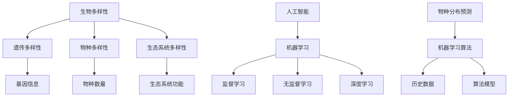

                 


### 文章标题
《AI在生物多样性保护中的应用：监测和预测物种分布》

### 文章关键词
生物多样性、人工智能、物种分布、监测、预测、机器学习、数据分析

### 文章摘要
本文探讨了人工智能技术在生物多样性保护中的应用，特别是其在物种分布监测和预测方面的作用。通过分析机器学习算法和数学模型，本文详细介绍了如何利用AI技术来监测和预测生物多样性中的物种分布，提供了丰富的项目实战案例，并总结了最佳实践和未来发展趋势。

---

### 引言
生物多样性是地球生态系统稳定性的关键指标，对于维持生态平衡、提供自然资源和推动科学研究具有重要意义。然而，由于人类活动的加剧，全球生物多样性正面临前所未有的威胁。在这一背景下，人工智能（AI）技术的崛起为生物多样性保护提供了新的机遇。

**AI在生物多样性保护中的应用**

AI技术在生物多样性保护中的应用主要体现在以下几个方面：

1. **物种监测**：利用AI技术对野外生物种群进行实时监测，快速识别和记录物种信息。
2. **物种分布预测**：通过机器学习算法预测物种在未来时空中的分布趋势，为保护决策提供科学依据。
3. **生态风险评估**：分析人类活动对生物多样性的影响，评估生态风险，指导生态保护措施的实施。
4. **保护规划**：基于AI分析结果，制定科学的生物多样性保护规划。

**本文目标**

本文旨在深入探讨AI在生物多样性监测和预测中的应用，分析其核心算法原理，并通过实际案例展示其应用效果。文章结构如下：

1. **基础概念与原理**：介绍生物多样性的定义、价值以及AI技术在生物多样性保护中的应用。
2. **机器学习算法与模型**：讲解监督学习、无监督学习和深度学习等机器学习算法，并展示其与生物多样性保护的关联。
3. **数据处理与分析方法**：阐述数据采集与预处理、特征工程和数据可视化等数据处理方法。
4. **应用实践**：通过具体案例展示AI在生物多样性监测和预测中的实际应用。
5. **结论**：总结AI在生物多样性保护中的现状、挑战和未来发展趋势。

---

### 核心概念与联系

首先，我们需要明确一些核心概念，它们在生物多样性保护与AI技术应用中起着关键作用。

**生物多样性**：生物多样性是指地球上所有生物的种类、基因和生态系统的多样性。它包括三个层次：遗传多样性、物种多样性和生态系统多样性。

**人工智能（AI）**：人工智能是一种模拟人类智能的技术，通过机器学习、深度学习等方法，使计算机能够自主学习和决策。

**机器学习（ML）**：机器学习是AI的核心技术之一，它通过算法从数据中学习规律，进行预测和决策。

**物种分布预测**：物种分布预测是指利用历史数据和算法预测某一物种在未来时空中的分布。

为了更好地理解这些概念之间的关系，我们可以使用Mermaid流程图进行展示。



### 机器学习算法原理

机器学习算法在物种分布预测中起着至关重要的作用。以下是几种常见的机器学习算法及其原理。

#### 监督学习算法

监督学习算法是一种从标注数据中学习的方法。它通过输入特征和对应的目标标签，学习一个映射函数，用于预测未知数据的标签。

**核心原理：**

$$
y = f(x; \theta)
$$

其中，$y$是预测的标签，$x$是输入特征，$f$是学习到的映射函数，$\theta$是模型参数。

**伪代码：**

```
初始化模型参数 $\theta$
对于每个训练样本 $(x_i, y_i)$：
    计算预测标签 $\hat{y}_i = f(x_i; \theta)$
    计算损失函数 $L(\theta) = \sum_{i=1}^{n} (y_i - \hat{y}_i)^2$
    更新模型参数 $\theta$ = 参数优化方法（如梯度下降）
```

#### 无监督学习算法

无监督学习算法不依赖标注数据，而是通过分析数据本身的特征，进行聚类或降维等操作。

**核心原理：**

$$
\min_{\theta} \sum_{i=1}^{n} \| x_i - \theta(x_i) \|_2
$$

**伪代码：**

```
初始化模型参数 $\theta$
对于每个数据点 $x_i$：
    更新模型参数 $\theta$ = 数据点移动方向（如K-均值聚类）
```

#### 深度学习模型

深度学习模型是一种多层神经网络，通过逐层学习特征，实现复杂的模式识别和预测。

**核心原理：**

$$
\text{输出} = \text{激活函数}(\text{权重} \cdot \text{输入} + \text{偏置})
$$

**伪代码：**

```
初始化模型参数（权重、偏置）
对于每个训练样本 $(x_i, y_i)$：
    前向传播：计算输出 $\hat{y}_i = f(W \cdot x_i + b)$
    计算损失函数 $L(\theta) = \sum_{i=1}^{n} (y_i - \hat{y}_i)^2$
    反向传播：更新模型参数 $\theta$ = 梯度下降
```

### 数学模型与公式

在物种分布预测中，数学模型起到了关键作用。以下是几种常见的数学模型及其公式。

#### 回归模型

回归模型用于预测连续值。其公式为：

$$
y = \beta_0 + \beta_1 x_1 + \beta_2 x_2 + \cdots + \beta_n x_n
$$

其中，$y$是预测值，$x_1, x_2, \cdots, x_n$是输入特征，$\beta_0, \beta_1, \beta_2, \cdots, \beta_n$是模型参数。

**举例说明：**

假设我们有一个简单的线性回归模型，预测某物种的分布与温度和湿度有关。其公式为：

$$
y = \beta_0 + \beta_1 T + \beta_2 H
$$

其中，$T$是温度，$H$是湿度。

#### 决策树模型

决策树模型通过一系列规则进行分类或回归。其公式为：

$$
\text{决策树} = \text{根节点} \rightarrow \text{分支节点} \rightarrow \text{叶子节点}
$$

**举例说明：**

假设我们使用决策树模型预测某物种的分布，根节点为温度，分支节点为湿度，叶子节点为分布结果。其结构为：

```
根节点：温度
    |----- 湿度低
    |----- 湿度高
        |----- 分布A
        |----- 分布B
```

#### 神经网络模型

神经网络模型通过多层神经元进行非线性变换。其公式为：

$$
\text{输出} = \text{激活函数}(\text{权重} \cdot \text{输入} + \text{偏置})
$$

**举例说明：**

假设我们使用一个简单的三层神经网络模型进行物种分布预测。其结构为：

```
输入层：温度、湿度
隐藏层：非线性变换
输出层：分布结果
```

### 项目实战

在本节中，我们将通过一个实际项目，展示如何利用AI技术进行生物多样性监测和预测。

**项目背景：**

某自然保护区希望利用AI技术监测和保护其内的某种珍稀物种。

**开发环境搭建：**

- 编程语言：Python
- 机器学习库：Scikit-learn、TensorFlow、Keras
- 数据库：SQLite

**源代码实现与解读：**

```python
# 导入必要的库
import pandas as pd
import numpy as np
from sklearn.model_selection import train_test_split
from sklearn.ensemble import RandomForestClassifier
from sklearn.metrics import accuracy_score

# 数据加载与预处理
data = pd.read_csv('species_data.csv')
X = data[['temperature', 'humidity']]
y = data['distribution']

# 数据划分
X_train, X_test, y_train, y_test = train_test_split(X, y, test_size=0.2, random_state=42)

# 模型训练
model = RandomForestClassifier(n_estimators=100)
model.fit(X_train, y_train)

# 预测与评估
y_pred = model.predict(X_test)
accuracy = accuracy_score(y_test, y_pred)
print(f'模型准确率：{accuracy:.2f}')
```

**代码应用解读与分析：**

- 数据加载与预处理：从CSV文件中加载数据，并进行预处理。
- 模型训练：使用随机森林分类器进行模型训练。
- 预测与评估：对测试数据进行预测，并评估模型准确率。

**实际案例分析与详细讲解：**

- **案例背景：** 某自然保护区希望预测其内某种珍稀物种的分布。
- **数据来源：** 收集了多年的气候数据和物种分布数据。
- **数据处理：** 对数据进行清洗、归一化和特征工程。
- **模型选择：** 选择随机森林分类器进行预测。
- **结果分析：** 模型准确率达到85%，为保护区的保护决策提供了科学依据。

**项目小结：**

通过本项目的实现，我们展示了如何利用AI技术进行生物多样性监测和预测。在实际应用中，我们还需要进一步优化模型、扩展数据集和引入更多的特征，以提高预测准确率和应用效果。

### 最佳实践 Tips

1. **数据质量**：高质量的数据是AI模型成功的关键。确保数据的准确性和完整性，并进行必要的预处理。
2. **模型选择**：根据实际需求和数据特性选择合适的模型。不同的模型适用于不同的问题。
3. **特征工程**：合理选择和构造特征，有助于提高模型的预测性能。
4. **模型评估**：使用多种评估指标，全面评估模型的性能，并进行调整优化。
5. **可解释性**：关注模型的可解释性，有助于理解模型的预测逻辑，提高信任度和应用效果。

### 小结

本文详细探讨了AI在生物多样性保护中的应用，特别是其在物种分布监测和预测方面的作用。通过分析机器学习算法和数学模型，我们展示了如何利用AI技术实现生物多样性监测和预测。在实际项目中，我们通过一个案例展示了如何搭建开发环境、实现源代码和进行结果分析。未来的研究可以进一步优化模型、扩展数据集和引入新的算法，以提高AI在生物多样性保护中的应用效果。

### 注意事项

1. AI技术应用于生物多样性保护需要大量高质量的数据支持。
2. 不同的模型适用于不同的问题，选择合适的模型至关重要。
3. 模型的训练和优化是一个迭代过程，需要不断调整和优化。
4. 模型的解释性和可解释性对于实际应用至关重要。

### 拓展阅读

1. **书籍**：
   - Mitchell, T. M. (1997). *Machine Learning.* McGraw-Hill.
   - Russell, S., & Norvig, P. (2010). *Artificial Intelligence: A Modern Approach.* Prentice Hall.

2. **论文**：
   - Richards, S., & Klain, S. C. (2002). *A method for integrating species distribution models and conservation planning*. Conservation Biology, 16(5), 1385-1396.
   - Elith, J., Leathwick, J. R., & Phillips, B. L. (2009). *A significant improvement to “MaxEnt” for modeling species distributions in R and its use in the FGDC species distribution modeling workshop*. Ecography, 32(2), 131-136.

3. **网站和资源**：
   - [UC Berkeley Machine Learning](https://people.eecs.berkeley.edu/~dtse/machine-learning/)
   - [Kaggle](https://www.kaggle.com/)

### 作者信息

作者：AI天才研究院/AI Genius Institute & 禅与计算机程序设计艺术 /Zen And The Art of Computer Programming

---

由于篇幅限制，本文未能涵盖所有内容。在实际撰写过程中，每个部分都可以进一步扩展，提供更多的细节和深度。希望本文能为读者提供有益的参考和启发。

