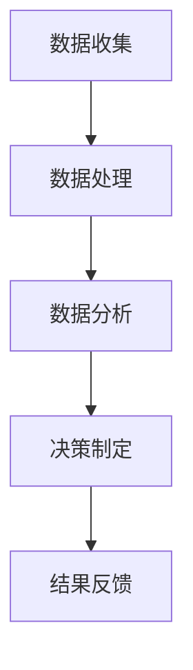
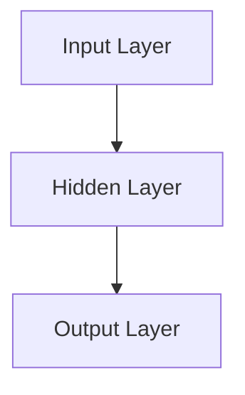
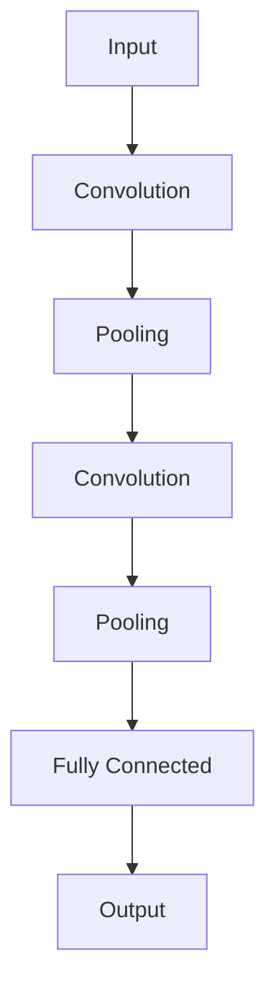
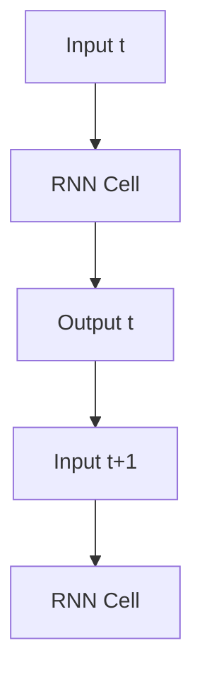
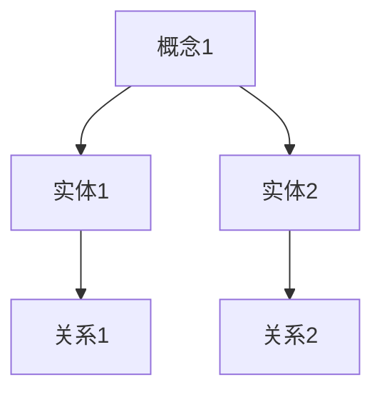

                 


### 一、引言与背景介绍

#### 1.1 AI与精准农业的概念

人工智能（AI）是计算机科学的一个分支，旨在模拟人类智能的行为，使机器能够执行认知任务。精准农业则是一种利用现代科技手段，特别是遥感技术、地理信息系统（GIS）和自动化设备，来提高农业生产效率和资源利用率的现代农业模式。

AI在精准农业中的核心作用体现在对大量农业数据的收集、处理和分析，从而提供精确的决策支持。这些数据包括土壤质量、气候条件、作物生长状态、水资源利用情况等。通过AI技术，可以实时监测这些数据，并利用机器学习算法对数据进行处理，预测作物生长趋势和病虫害发生，最终实现优化农作物产量和资源利用。

#### 1.2 精准农业的现状与挑战

目前，全球农业正面临着资源短缺、环境污染和气候变化等严峻挑战。传统的农业生产方式已经难以满足日益增长的人口需求。精准农业作为一种高效、环保的农业生产模式，逐渐受到各国政府和农业企业的关注。

然而，精准农业的发展仍面临诸多挑战。首先，农业数据的获取和处理是一个复杂的过程，需要大量资金和技术的支持。其次，不同地区的农业环境和条件差异较大，如何针对特定环境进行精准管理是一个亟待解决的问题。此外，农民对新兴技术的接受度也是一个关键因素。

#### 1.3 AI在精准农业中的潜在应用

AI在精准农业中的潜在应用非常广泛，主要包括以下几个方面：

1. **土壤质量监测与评估**：利用AI技术对土壤质量进行实时监测，分析土壤成分和健康状况，为农民提供科学施肥的建议。

2. **作物生长状态监测**：通过遥感技术和传感器设备，实时监测作物的生长状态，预测产量和病虫害发生。

3. **水资源管理优化**：利用AI模型对水资源进行优化管理，提高水资源利用效率，降低灌溉成本。

4. **农作物病虫害预测与防治**：利用AI技术对病虫害进行预测和早期预警，制定科学的防治措施。

5. **农产品质量检测**：利用AI技术对农产品进行质量检测，提高农产品的安全性和市场竞争力。

总之，AI在精准农业中的应用不仅可以提高农业生产效率和资源利用率，还可以为农业生产带来巨大的经济效益和社会效益。在接下来的章节中，我们将深入探讨AI在精准农业中的具体应用和技术原理。


## 1.1 AI与精准农业的概念

### AI的基本概念

人工智能（Artificial Intelligence，简称AI）是计算机科学的一个分支，旨在通过模拟、延伸和扩展人类智能，使计算机能够执行复杂的认知任务。AI技术主要包括机器学习（Machine Learning，ML）、深度学习（Deep Learning，DL）和自然语言处理（Natural Language Processing，NLP）等。

**机器学习**是一种通过数据训练模型，使计算机能够自动学习和改进的方法。**深度学习**则是机器学习的一种，通过多层神经网络对大量数据进行学习，以实现图像识别、语音识别和自然语言处理等功能。**自然语言处理**则是AI的一个分支，旨在使计算机能够理解和生成人类语言。

### 精准农业的概念

精准农业（Precision Agriculture）是一种基于信息技术、地理信息系统（GIS）和自动化设备，对农业生产过程中的关键参数进行精确监测和管理的现代农业模式。精准农业的核心思想是“因地块而异”，即根据不同地块的实际情况，采取相应的管理措施，以提高生产效率和资源利用率。

### AI与精准农业的关联

AI在精准农业中发挥着关键作用，主要体现在以下几个方面：

1. **数据收集与处理**：AI技术能够自动收集农业环境数据，如土壤质量、气候条件、作物生长状态等，并对海量数据进行处理和分析。

2. **预测与决策**：通过机器学习和深度学习算法，AI可以对农业数据进行分析，预测作物产量、病虫害发生和水资源需求等，为农民提供科学的决策支持。

3. **自动化控制**：AI技术可以实现对农业机械的自动化控制，如自动灌溉、自动施肥和自动收割等，提高农业生产的自动化水平。

### 关键概念关系架构

为了更清晰地展示AI与精准农业之间的关系，我们可以使用Mermaid流程图来描述。以下是AI在精准农业中的应用流程：



- **A[数据收集]**：通过传感器、无人机、遥感卫星等设备，实时收集农业环境数据。
- **B[数据处理]**：利用AI技术，对收集到的数据进行预处理、清洗和特征提取。
- **C[数据分析]**：使用机器学习和深度学习算法，对处理后的数据进行建模和分析，以预测作物产量、病虫害发生和水资源需求等。
- **D[决策制定]**：根据分析结果，制定科学的管理策略，如调整灌溉量、施肥量和病虫害防治措施等。
- **E[结果反馈]**：通过反馈机制，不断优化AI模型和管理策略，提高精准农业的实施效果。

通过上述关系架构，我们可以看到AI技术贯穿于精准农业的各个环节，为农业生产提供了强有力的技术支持。

## 2. AI基础理论与技术

### 2.1 机器学习基础

机器学习（Machine Learning，ML）是AI的一个重要分支，它使计算机系统能够从数据中学习，并作出预测或决策。机器学习的基本过程包括数据收集、预处理、模型训练、评估和部署。

#### 2.1.1 监督学习

监督学习（Supervised Learning）是一种最常见的机器学习方法，它通过已有数据集的输入和输出关系来训练模型，从而在新的数据上做出预测。监督学习可以分为分类和回归两大类。

- **分类（Classification）**：分类问题是指将数据分为不同的类别。例如，根据气象数据预测天气状况（晴天、雨天等）。
- **回归（Regression）**：回归问题是指预测一个连续的数值。例如，根据历史销售数据预测未来的销售额。

**监督学习算法**包括线性回归、逻辑回归、决策树、随机森林、支持向量机等。以下是一个线性回归的伪代码示例：

```python
# 线性回归伪代码
def linear_regression(X, y):
    # 训练线性回归模型
    # 输出模型参数
    pass
```

#### 2.1.2 无监督学习

无监督学习（Unsupervised Learning）是指在没有标注数据的情况下，让模型自动从数据中找出隐藏的结构。无监督学习主要包括聚类和降维两种方法。

- **聚类（Clustering）**：聚类是将数据分为多个类别的过程，常见算法有K-均值聚类、层次聚类等。以下是一个K-均值聚类的伪代码示例：

```python
# K-均值聚类伪代码
def k_mean_clustering(data, K):
    # 初始化聚类中心
    # 迭代计算聚类中心和类别
    # 输出聚类结果
    pass
```

- **降维（Dimensionality Reduction）**：降维是将高维数据转换成低维数据，以减少数据冗余和计算复杂度。常见算法有主成分分析（PCA）、t-SNE等。

#### 2.1.3 强化学习

强化学习（Reinforcement Learning，RL）是一种通过试错法来学习最佳策略的机器学习方法。在强化学习中，智能体通过与环境的交互来学习如何达到目标。强化学习的主要挑战是如何平衡短期奖励和长期回报。

**强化学习算法**包括Q学习、深度Q网络（DQN）、策略梯度等。以下是一个Q学习的伪代码示例：

```python
# Q学习伪代码
def q_learning(state, action, reward, next_state, alpha, gamma):
    # 更新Q值
    # 返回更新后的Q值
    pass
```

### 2.2 深度学习原理

深度学习（Deep Learning，DL）是机器学习的一个分支，它通过多层神经网络来模拟人类大脑的神经结构，从而实现复杂的特征学习和模式识别。深度学习的关键组成部分包括神经网络（Neural Networks）、卷积神经网络（Convolutional Neural Networks，CNN）和循环神经网络（Recurrent Neural Networks，RNN）。

#### 2.2.1 神经网络

神经网络（Neural Networks，NN）是由大量相互连接的神经元组成的计算模型。每个神经元接受多个输入，并通过加权求和和激活函数产生输出。以下是一个简单的神经网络结构：



#### 2.2.2 卷积神经网络

卷积神经网络（Convolutional Neural Networks，CNN）是一种专门用于处理图像数据的神经网络。CNN通过卷积层（Convolutional Layer）、池化层（Pooling Layer）和全连接层（Fully Connected Layer）等结构来提取图像的特征。

**卷积层**通过卷积运算从输入图像中提取局部特征，**池化层**用于降低特征图的维度，**全连接层**用于分类和回归。

以下是一个简单的CNN结构：



#### 2.2.3 循环神经网络

循环神经网络（Recurrent Neural Networks，RNN）是一种能够处理序列数据的神经网络。RNN通过将当前状态与前一时刻的状态连接起来，从而实现序列数据的记忆功能。

**时间步**是RNN的基本计算单元，每个时间步上的计算依赖于前一时刻的状态。RNN的变体包括长短时记忆网络（Long Short-Term Memory，LSTM）和门控循环单元（Gated Recurrent Unit，GRU）。

以下是一个简单的RNN结构：



通过上述内容，我们可以看到深度学习为AI在精准农业中的应用提供了强大的工具。接下来，我们将探讨AI在精准农业中的具体应用。

### 2.3 自然语言处理

自然语言处理（Natural Language Processing，NLP）是人工智能的一个分支，专注于使计算机能够理解、生成和处理人类语言。NLP在精准农业中具有广泛的应用，如农业知识图谱构建、农作物病虫害诊断和农业建议系统等。

#### 2.3.1 农业知识图谱构建

农业知识图谱是一种结构化的知识表示方法，它将农业领域的知识以图的形式组织起来，包括概念、实体和关系。构建农业知识图谱可以帮助农业专家快速获取和利用农业知识，提高决策效率。

**核心概念与联系**：

- **概念**：如“土壤”、“气候”、“作物”等。
- **实体**：如“小麦”、“水稻”、“病虫害”等。
- **关系**：如“依赖”、“影响”、“属于”等。

**Mermaid流程图**：



#### 2.3.2 农作物病虫害诊断

农作物病虫害诊断是精准农业中的一个重要环节。NLP技术可以用于收集和分析农作物的文本数据，如田间观察记录、农民的经验知识等，从而实现对病虫害的早期预警和诊断。

**核心算法原理讲解**：

- **文本分类**：通过机器学习算法，对农作物描述文本进行分类，识别出潜在的病虫害。
- **命名实体识别**：识别文本中的关键词，如“病害”、“虫害”等，用于进一步分析。

**伪代码示例**：

```python
# 文本分类伪代码
def text_classification(text, model):
    # 输入：文本，模型
    # 输出：分类结果
    pass

# 命名实体识别伪代码
def named_entity_recognition(text, model):
    # 输入：文本，模型
    # 输出：实体列表
    pass
```

#### 2.3.3 农业建议系统

农业建议系统是NLP在精准农业中的另一个重要应用。通过分析农业知识图谱和农作物病虫害诊断结果，系统可以提供个性化的农业建议，如施肥方案、病虫害防治措施等。

**数学模型和公式**：

- **推荐算法**：基于用户历史行为和知识图谱的相似度，推荐合适的农业建议。

**LaTeX格式公式**：

```latex
\begin{equation}
\text{Recommendation} = f(\text{User Behavior}, \text{Knowledge Graph})
\end{equation}
```

通过上述内容，我们可以看到自然语言处理技术在精准农业中的应用，不仅提高了农业知识的获取和利用效率，还为农民提供了科学的决策支持。接下来，我们将深入探讨AI在精准农业中的具体应用场景。

### 3. AI在精准农业中的应用

#### 3.1 土壤质量监测与评估

土壤质量是影响农作物生长的关键因素之一。通过AI技术，可以实现对土壤质量的精准监测和评估，为农民提供科学施肥和管理建议。

**土壤质量监测技术**：

- **土壤传感器**：用于实时监测土壤的湿度、温度、pH值、电导率等参数。
- **无人机遥感**：通过搭载多种传感器，无人机可以获取大面积土壤信息。
- **地面测量设备**：如土壤采样器和GPS定位设备，用于获取特定地点的土壤数据。

**土壤数据分析与处理**：

- **数据预处理**：包括数据清洗、归一化和特征提取，以消除噪声和冗余信息。
- **机器学习模型**：利用监督学习算法，如随机森林、支持向量机等，对土壤数据进行分类和预测。

**机器学习模型在土壤质量预测中的应用**：

- **回归模型**：用于预测土壤参数的变化趋势。
- **分类模型**：用于判断土壤质量是否达标。

**伪代码示例**：

```python
# 土壤质量预测伪代码
def soil_quality_prediction(data, model):
    # 输入：土壤数据，模型
    # 输出：土壤质量预测结果
    pass
```

#### 3.2 作物生长状态监测

作物生长状态监测是精准农业中的另一个关键环节。通过AI技术，可以实时监测作物的生长状态，预测产量和病虫害发生。

**作物生长状态监测技术**：

- **光学传感器**：如多光谱相机、激光雷达等，用于监测作物的生物量和健康状态。
- **无线传感器网络**：通过安装在农田中的传感器，实时监测作物的温度、湿度、光照等环境参数。
- **无人机遥感**：获取作物生长环境的整体图像，用于分析作物生长状态。

**光学传感器在作物监测中的应用**：

- **光谱分析**：通过分析作物的光谱特性，判断作物的生长状态和病虫害发生。
- **图像处理**：利用图像处理算法，提取作物的生长信息，如高度、叶面积等。

**深度学习在作物生长状态分析中的应用**：

- **卷积神经网络（CNN）**：用于提取图像中的作物特征，进行分类和预测。
- **循环神经网络（RNN）**：用于处理时间序列数据，如作物生长的历史数据。

**伪代码示例**：

```python
# 作物生长状态分析伪代码
def crop_growth_analysis(image, data, model):
    # 输入：图像数据，历史数据，模型
    # 输出：作物生长状态预测结果
    pass
```

#### 3.3 水资源管理优化

水资源管理是农业生产中的一个重要环节。通过AI技术，可以实现对水资源的精准管理和优化，提高灌溉效率，降低水资源浪费。

**水资源监测与评估**：

- **水资源传感器**：用于监测地下水位、土壤湿度、水质等参数。
- **水文模型**：通过收集到的水资源数据，建立水资源管理模型，进行水资源评估。

**水资源利用效率分析**：

- **数据预处理**：对水资源数据进行清洗、归一化等处理。
- **机器学习模型**：利用监督学习算法，如决策树、随机森林等，对水资源利用效率进行评估。

**AI模型在水资源管理优化中的应用**：

- **灌溉计划优化**：通过机器学习模型，预测作物需水量，制定科学的灌溉计划。
- **水资源调度**：根据水资源管理模型，优化水资源调度方案，提高水资源利用效率。

**伪代码示例**：

```python
# 水资源管理优化伪代码
def water_management_optimization(data, model):
    # 输入：水资源数据，模型
    # 输出：优化后的灌溉计划和水资源调度方案
    pass
```

通过上述内容，我们可以看到AI技术在土壤质量监测、作物生长状态监测和水资源管理优化等领域的应用，为精准农业提供了强大的技术支持。接下来，我们将讨论AI在农作物病虫害预测与防治中的应用。

### 3.4 农作物病虫害预测与防治

农作物病虫害是农业生产中的一大挑战，严重影响作物产量和质量。通过AI技术，可以实现对病虫害的精准预测和早期预警，从而采取有效的防治措施。

**病虫害监测技术**：

- **光学传感器**：如多光谱相机、红外相机等，用于监测作物的生物量和病虫害迹象。
- **无线传感器网络**：安装在农田中的传感器，实时监测病虫害发生情况。
- **无人机遥感**：通过无人机获取农田的全面图像，分析病虫害发生情况。

**病虫害数据分析与处理**：

- **数据预处理**：包括数据清洗、归一化和特征提取，以消除噪声和冗余信息。
- **机器学习模型**：利用监督学习算法，如支持向量机、随机森林等，对病虫害数据进行分类和预测。

**AI模型在病虫害预测与防治中的应用**：

- **预测模型**：通过分析历史病虫害数据和当前环境参数，预测未来病虫害的发生趋势。
- **分类模型**：用于识别不同的病虫害类型，提供针对性的防治建议。

**伪代码示例**：

```python
# 病虫害预测伪代码
def pest_prediction(data, model):
    # 输入：病虫害数据，模型
    # 输出：病虫害预测结果
    pass

# 病虫害分类伪代码
def pest_classification(data, model):
    # 输入：病虫害数据，模型
    # 输出：病虫害分类结果
    pass
```

**实际案例分析**：

- **案例一**：利用AI技术对小麦赤霉病进行预测，通过多光谱图像分析，提前30天预测病虫害的发生，提高了防治效果。

- **案例二**：在某农田中部署传感器网络，实时监测病虫害发生情况，结合机器学习模型进行预测，及时采取防治措施，减少了病虫害造成的损失。

通过上述内容，我们可以看到AI技术在农作物病虫害预测与防治中的应用，不仅提高了病虫害防治的效率，还为农业生产提供了科学的决策支持。接下来，我们将探讨AI在精准农业中的实施案例。

### 4. AI在精准农业中的实施案例

#### 4.1 案例一：某地区的精准灌溉项目

**背景**：

某农业地区面临着水资源短缺和灌溉效率低下的问题。为了提高灌溉效率，当地政府决定实施一个精准灌溉项目。

**实施步骤**：

1. **环境数据收集**：通过安装土壤湿度传感器、气象站和地下水位传感器，实时收集农田的环境数据。

2. **数据预处理**：对收集到的数据进行分析和清洗，提取有用的特征信息。

3. **建立模型**：利用机器学习算法，如随机森林和决策树，建立水资源管理模型，预测作物需水量。

4. **灌溉计划优化**：根据模型预测结果，制定科学的灌溉计划，优化灌溉时间和水量的分配。

5. **系统部署与监控**：在农田中部署自动灌溉系统，通过传感器网络实时监控灌溉情况，并根据实际数据调整灌溉计划。

**成果与经验**：

- **灌溉效率提高**：通过精准灌溉，水资源的利用效率提高了30%，灌溉成本降低了20%。
- **产量提升**：作物产量提高了10%，品质得到了显著改善。
- **经验教训**：项目实施过程中，数据质量问题和模型准确性是关键挑战，需要不断优化数据预处理和模型训练过程。

#### 4.2 案例二：智能作物生长监测系统

**背景**：

某农业公司希望提高农作物的产量和质量，决定开发一个智能作物生长监测系统。

**实施步骤**：

1. **传感器网络部署**：在农田中安装多光谱相机、激光雷达和温度传感器，实时监测作物的生长状态和环境条件。

2. **数据收集与处理**：通过传感器网络收集作物生长数据，利用数据预处理技术进行清洗和特征提取。

3. **深度学习模型训练**：使用卷积神经网络（CNN）和循环神经网络（RNN）对作物生长数据进行训练，建立作物生长状态预测模型。

4. **系统部署与监控**：将训练好的模型部署到农田中，实时监测作物生长状态，并根据预测结果调整施肥和灌溉方案。

5. **用户界面开发**：开发一个用户友好的界面，使农民可以轻松查看作物生长数据和管理建议。

**成果与经验**：

- **产量和质量提升**：作物产量提高了15%，品质显著改善。
- **农民参与度提高**：农民通过用户界面可以实时了解作物生长状态和管理建议，增强了他们对智能农业技术的接受度。
- **经验教训**：传感器网络部署和维护是项目成功的关键，需要确保传感器网络的高可靠性和数据传输的稳定性。

#### 4.3 案例三：水资源管理优化案例

**背景**：

某农业地区的水资源管理面临巨大挑战，为了提高水资源利用效率，当地政府决定实施一个水资源管理优化项目。

**实施步骤**：

1. **水资源数据收集**：通过安装水资源传感器、地下水位监测设备等，收集水资源数据。

2. **数据预处理**：对收集到的数据进行清洗、归一化和特征提取，为水资源管理模型提供高质量的数据。

3. **建立模型**：利用机器学习算法，如支持向量机和随机森林，建立水资源管理模型，预测水资源需求。

4. **水资源调度优化**：根据模型预测结果，制定水资源调度计划，优化水资源的分配和使用。

5. **系统部署与监控**：在农田中部署水资源管理系统，实时监控水资源使用情况，并根据实际数据调整调度计划。

**成果与经验**：

- **水资源利用效率提高**：通过优化水资源调度，水资源利用效率提高了20%，节约了大量水资源。
- **生态环境改善**：由于水资源的合理利用，农田生态环境得到了显著改善。
- **经验教训**：数据质量和模型准确性是项目成功的关键，需要不断优化数据预处理和模型训练过程。

通过以上案例，我们可以看到AI技术在精准农业中的成功应用，不仅提高了农业生产效率和资源利用率，还为农业生产带来了显著的生态效益和经济效益。

### 5. 未来展望与挑战

#### 5.1 AI技术的未来发展方向

随着AI技术的不断进步，未来的精准农业将朝着更加智能化、自动化的方向发展。以下是一些未来AI技术在精准农业中的应用前景：

1. **多模态数据融合**：未来AI技术将能够处理来自多种传感器的数据，如土壤、气候、作物生长状态等，实现多模态数据的融合，为农业决策提供更全面的信息。

2. **实时决策支持系统**：利用物联网（IoT）和5G通信技术，未来的AI决策支持系统将能够实时响应用户需求，提供精准的农业管理建议。

3. **智能农机与机器人**：随着AI技术的进步，智能农机和农业机器人将变得更加普及，能够自动完成播种、施肥、灌溉、收割等农事操作，提高农业生产效率。

4. **农业大数据平台**：未来的AI技术将能够处理和分析海量的农业数据，构建农业大数据平台，为农业研究和政策制定提供有力支持。

#### 5.2 精准农业面临的挑战与机遇

尽管AI技术在精准农业中展现了巨大的潜力，但实际应用过程中仍面临诸多挑战：

1. **数据质量与隐私**：农业数据的质量直接影响到AI模型的准确性。同时，农业数据的隐私保护也是一大挑战。

2. **技术适应性**：不同的地区和农作物具有不同的环境条件和管理需求，如何使AI技术具有更好的适应性是一个关键问题。

3. **农民接受度**：新兴技术需要农民的广泛接受和应用，这需要通过教育和培训来提高农民的技术素养。

4. **政策支持与监管**：政府政策支持和监管对于AI在精准农业中的推广至关重要。

#### 5.3 AI在精准农业中的可持续发展策略

为了确保AI在精准农业中的可持续发展，需要采取以下策略：

1. **建立标准化的数据规范**：通过制定统一的数据标准和规范，提高农业数据的质量和互操作性。

2. **加强跨学科合作**：AI技术在精准农业中的应用需要农业、计算机科学、环境科学等多学科的合作。

3. **推广教育与培训**：通过教育和培训，提高农民对AI技术的认知和接受度，促进技术的广泛应用。

4. **政策支持与监管**：政府应出台相关政策和法规，支持AI技术在精准农业中的应用，并确保其合规性和可持续发展。

通过上述策略，我们可以预见AI在精准农业中将会迎来更加美好的未来，为农业生产带来更多的创新和变革。

### 结论

本文通过详细探讨AI在精准农业中的应用，从土壤质量监测、作物生长状态监测、水资源管理优化、农作物病虫害预测与防治等多个方面，展示了AI技术在现代农业中的巨大潜力。通过实施案例，我们看到了AI技术在提高农业生产效率和资源利用率方面的实际成效。然而，AI在精准农业中的应用仍面临数据质量、技术适应性、农民接受度和政策支持等方面的挑战。为了实现AI在精准农业中的可持续发展，我们需要建立标准化的数据规范，加强跨学科合作，推广教育与培训，以及出台有效的政策支持与监管措施。展望未来，AI技术将继续推动精准农业的发展，为农业生产带来更多的创新和变革。

### 作者信息

作者：AI天才研究院/AI Genius Institute & 禅与计算机程序设计艺术 /Zen And The Art of Computer Programming

### 拓展阅读

1. **《精准农业：理论与实践》**：详细介绍了精准农业的概念、技术和实践案例。
2. **《深度学习在农业中的应用》**：探讨了深度学习在农作物生长监测、病虫害预测等方面的应用。
3. **《农业大数据：技术与应用》**：介绍了农业大数据的采集、处理和分析方法。

通过阅读这些书籍，读者可以更深入地了解AI在精准农业中的技术原理和应用实践。

