                 

### 第1章：精准医疗的背景与AI的机遇

#### 1.1 精准医疗的定义与发展

精准医疗（Precision Medicine）是一种以个体差异为核心的医学模式，通过收集和分析个体的基因组、环境、生活方式等多方面的数据，为患者提供更加个性化的治疗方案。与传统的一刀切治疗方案不同，精准医疗旨在通过个性化治疗，提高治疗效果，降低副作用。

精准医疗的定义可以追溯到2003年，美国总统乔治·W·布什在《国家医学研究行动计划》中首次提出精准医学的概念。其核心思想是“基于个体差异，制定个性化的治疗方案”。具体而言，这包括以下几方面：

- **基因组学：** 通过分析个体的基因组数据，预测疾病风险、药物反应等。
- **蛋白质组学：** 研究个体体内的蛋白质组成和动态变化，为疾病诊断和治疗提供新的途径。
- **代谢组学：** 研究个体体内的代谢产物，通过分析代谢组数据，发现疾病相关的生物标志物。
- **环境因素：** 考虑个体的生活环境、饮食习惯、生活方式等因素，这些因素会影响个体的健康状态和疾病发展。

精准医疗的发展离不开科技的进步，特别是基因组学和人工智能（AI）技术的快速发展。基因组测序成本的显著降低，使得大规模的基因组数据分析成为可能。而AI技术，特别是机器学习和深度学习算法，为海量数据的处理和分析提供了强大的工具，使得精准医疗从理论走向实践。

#### 核心概念与联系

为了更好地理解精准医疗的定义和发展，我们可以通过一个Mermaid流程图来展示这些核心概念之间的关系：

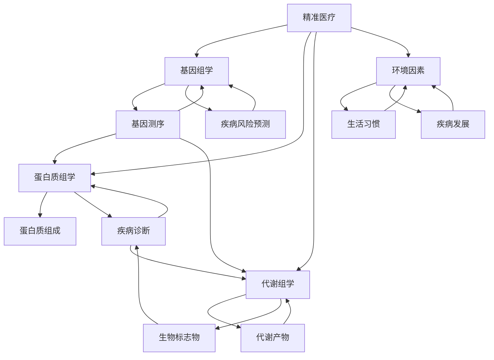

在这个流程图中，精准医疗作为核心概念，与其他四个方面（基因组学、蛋白质组学、代谢组学、环境因素）相互关联。通过基因组学、蛋白质组学、代谢组学和环境因素的分析，我们可以预测疾病风险、诊断疾病、发现生物标志物以及了解疾病发展过程，从而为个体制定个性化的治疗方案。

#### 1.2 AI在精准医疗中的应用场景

AI技术在精准医疗中有着广泛的应用，以下是几个关键的应用场景：

1. **诊断：** AI可以帮助医生进行疾病早期检测和辅助诊断。例如，通过分析医学影像数据，AI可以识别出早期癌症、心脏病等疾病，从而提高诊断的准确性和及时性。

2. **治疗计划设计：** AI可以帮助医生制定个性化的治疗方案。例如，通过分析患者的基因组数据和临床信息，AI可以预测患者对特定药物的反应，从而为患者调整药物剂量、选择最佳治疗方案提供依据。

3. **药物开发：** AI可以加速新药研发过程。例如，通过分析大量生物医学数据，AI可以帮助科学家发现新的药物靶点，优化药物设计，缩短药物开发周期。

下面我们将通过Mermaid流程图来展示AI在精准医疗中的几个关键应用场景：

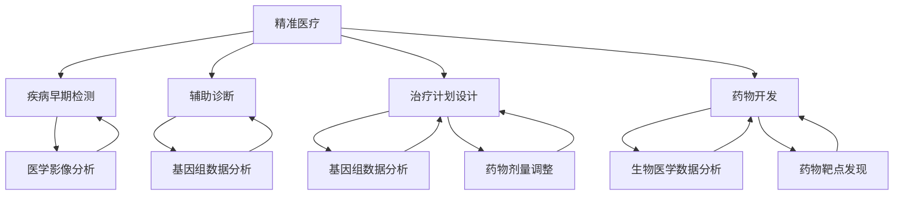

在这个流程图中，AI技术被广泛应用于精准医疗的各个领域。通过医学影像分析，AI可以帮助医生进行疾病早期检测；通过基因组数据分析，AI可以辅助诊断和制定治疗计划；通过药物剂量调整和药物靶点发现，AI可以加速药物研发，为患者提供更好的治疗选择。

#### 1.3 AI在精准医疗中的挑战与未来展望

尽管AI在精准医疗中具有巨大的潜力，但同时也面临着一系列挑战。以下是一些主要的挑战：

1. **数据隐私与安全性：** 精准医疗需要处理大量敏感的个人信息，如基因组数据、健康记录等。如何确保这些数据的安全性和隐私性，是AI在精准医疗中面临的重要挑战。

2. **算法公平性与透明性：** AI算法在处理数据时可能会受到偏见，导致歧视某些群体。如何确保算法的公平性和透明性，是AI在精准医疗中需要解决的关键问题。

3. **数据质量和可解释性：** AI模型的性能高度依赖于数据的质量。如何保证数据的质量，以及如何提高AI模型的可解释性，是AI在精准医疗中需要考虑的问题。

面对这些挑战，未来的发展趋势可能包括：

1. **数据隐私保护技术：** 如联邦学习（Federated Learning）、差分隐私（Differential Privacy）等，可以在保护数据隐私的同时，实现数据的共享和分析。

2. **算法透明性与可解释性：** 通过开发可解释的AI模型，如透明性更高的决策树、LIME（Local Interpretable Model-agnostic Explanations）等方法，可以提高算法的透明性和可解释性。

3. **跨学科合作：** 精准医疗是一个跨学科领域，需要医学、计算机科学、生物学等多个领域的专家共同合作，才能解决AI在精准医疗中面临的挑战。

通过这些技术发展和跨学科合作，AI在精准医疗中的潜力将进一步发挥，为患者带来更好的治疗效果。

### 总结

本章介绍了精准医疗的背景和AI在其中的机遇。首先，我们定义了精准医疗的概念，并阐述了其与基因组学、蛋白质组学、代谢组学和环境因素之间的关系。接着，我们讨论了AI在精准医疗中的关键应用场景，包括诊断、治疗计划设计和药物开发。最后，我们分析了AI在精准医疗中面临的挑战，并展望了未来的发展趋势。通过本章的内容，我们希望能让读者对AI在精准医疗中的应用有一个全面而深入的了解。

---

在接下来的章节中，我们将进一步探讨AI在个性化治疗方案设计中的应用，以及其在实际案例中的应用和面临的伦理与法律问题。敬请期待。


---

# 第2章：个性化治疗方案设计的基本原理

#### 2.1 个性化治疗方案的概念

个性化治疗方案（Personalized Treatment Plans）是基于患者的具体特征，如基因、病理、生活方式等，为患者量身定制的一种治疗方案。这种方案旨在最大化治疗效果，同时最小化治疗副作用。与传统的“一刀切”治疗方案不同，个性化治疗方案考虑到了患者的个体差异，从而能够更精准地满足患者的健康需求。

个性化治疗方案的概念可以追溯到20世纪90年代，当时基因组学开始快速发展。随着基因测序技术的进步，科学家们能够更准确地了解个体的基因组信息，从而为个性化治疗提供基础。近年来，随着大数据和人工智能技术的应用，个性化治疗方案得到了进一步的完善和发展。

#### 个性化治疗与传统治疗方案的差异

个性化治疗方案与传统治疗方案有以下几点关键差异：

1. **个体差异关注：** 个性化治疗方案关注患者的个体差异，如基因、病理、生活方式等。传统治疗方案往往基于群体数据，适用于大多数患者，但可能无法充分考虑个体差异。

2. **数据依赖性：** 个性化治疗方案高度依赖于基因组学、生物信息学、机器学习等多种技术，需要收集和分析大量数据。而传统治疗方案主要依赖临床经验和统计数据。

3. **治疗效果优化：** 个性化治疗方案旨在通过优化治疗方案，提高治疗效果，降低副作用。传统治疗方案虽然也有提高治疗效果的努力，但往往难以做到对个体差异的精细化调整。

#### 核心概念与联系

为了更好地理解个性化治疗方案的概念，我们可以通过一个Mermaid流程图来展示其核心概念之间的联系：

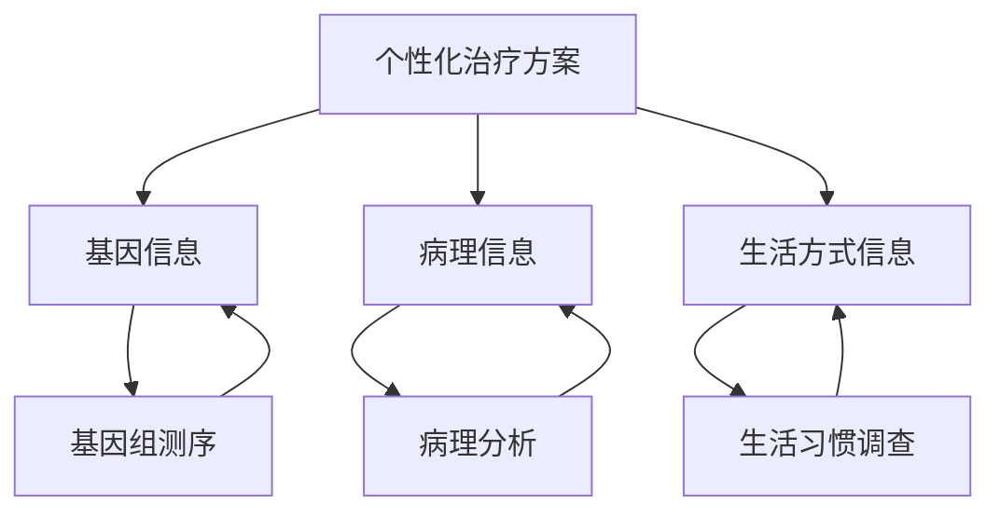

在这个流程图中，个性化治疗方案（A）与基因信息（B）、病理信息（C）和生活方式信息（D）紧密相连。通过基因组测序（E）、病理分析（F）和生活习惯调查（G），我们可以获取患者的具体信息，从而为其量身定制个性化的治疗方案。

#### 2.2 个性化治疗方案设计的关键技术

个性化治疗方案的设计需要多种关键技术的支持，以下是一些主要的技术：

1. **基因组学：** 基因组学是个性化治疗的基础。通过基因组测序，我们可以了解患者的基因信息，预测疾病风险、药物反应等。基因测序技术的进步，如高通量测序（Next-Generation Sequencing, NGS），使得大规模的基因组数据分析成为可能。

2. **机器学习：** 机器学习技术在个性化治疗方案设计中起着至关重要的作用。通过分析海量数据，如基因组数据、临床数据等，机器学习算法可以识别出潜在的疾病模式和治疗方案。常用的机器学习算法包括决策树、支持向量机（SVM）、神经网络等。

3. **生物信息学：** 生物信息学是处理和分析生物医学数据的重要工具。通过生物信息学方法，我们可以从大量的基因组数据、蛋白质组数据等中提取有价值的信息，为个性化治疗方案提供支持。

#### 核心概念与联系

为了更好地理解个性化治疗方案设计的关键技术，我们可以通过一个Mermaid流程图来展示这些技术之间的联系：

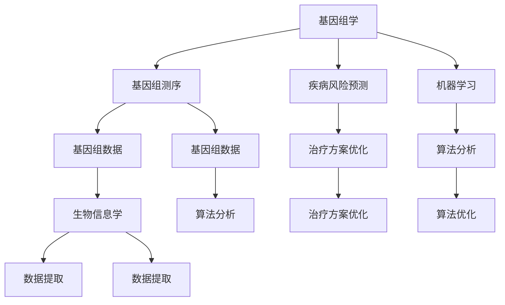

在这个流程图中，基因组学（A）、机器学习（F）和生物信息学（I）共同构成了个性化治疗方案设计的关键技术。通过基因组测序（B），我们可以获取基因组数据（D），利用机器学习算法（G）进行疾病风险预测（C）和治疗方案优化（E）。同时，生物信息学方法（I）可以帮助我们从大量的基因组数据中提取有价值的信息（J），进一步优化治疗方案（K）。

#### 2.3 个性化治疗方案设计的流程

个性化治疗方案的设计通常包括以下几个关键步骤：

1. **数据收集：** 收集患者的临床信息和基因组数据。临床信息包括病史、检查结果等，而基因组数据则通过基因测序获得。

2. **数据分析：** 利用机器学习和生物信息学方法，对收集到的数据进行处理和分析。这一步骤旨在识别出患者的潜在疾病模式和治疗方案。

3. **方案制定：** 根据分析结果，制定个性化的治疗方案。这一步骤需要医生和AI系统的共同协作，确保治疗方案的科学性和可行性。

4. **方案实施与调整：** 将制定好的治疗方案应用于患者，并在治疗过程中进行实时调整，以适应患者的变化和治疗效果。

#### 核心概念与联系

为了更好地理解个性化治疗方案设计的流程，我们可以通过一个Mermaid流程图来展示这些步骤之间的联系：

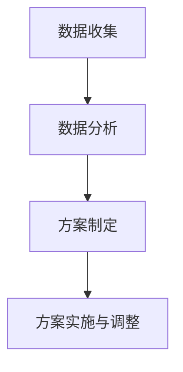

在这个流程图中，数据收集（A）是个性化治疗方案设计的起点，通过数据分析（B），我们可以识别出患者的潜在疾病模式和治疗方案。随后，方案制定（C）和方案实施与调整（D）确保了个性化治疗的有效性和可行性。

### 总结

本章介绍了个性化治疗方案的基本原理，包括其概念、与传统治疗方案的差异、关键技术以及设计流程。通过基因组学、机器学习和生物信息学等技术的支持，个性化治疗方案能够充分考虑患者的个体差异，为患者提供更精准、有效的治疗方案。在下一章中，我们将探讨AI在个性化治疗方案设计中的应用，包括个性化药物剂量调整和个性化治疗路径优化。敬请期待。

---

在接下来的章节中，我们将深入探讨AI在个性化治疗方案设计中的具体应用，以及这些应用在实际案例中的体现。敬请期待。


---

## 第二部分：AI在个性化治疗方案设计中的应用

### 第3章：AI在个性化治疗方案设计中的实际应用

个性化治疗方案设计是精准医疗的重要组成部分，而AI技术在其中的应用使得个性化治疗变得更加精准和高效。本章将重点探讨AI在个性化治疗方案设计中的实际应用，包括个性化药物剂量调整和个性化治疗路径优化。

#### 3.1 个性化药物剂量调整

药物剂量调整是个性化治疗方案设计中的一个关键环节。不同的患者对同一药物的敏感性和代谢速度可能存在显著差异，因此，制定个性化的药物剂量对于提高治疗效果、减少副作用至关重要。AI技术在个性化药物剂量调整中发挥了重要作用。

**核心概念与联系：**

个性化药物剂量调整涉及到以下几个核心概念：

- **药物基因组学：** 研究个体基因组与药物反应之间的关系，通过分析个体的基因组数据，预测其对特定药物的反应。
- **机器学习算法：** 利用机器学习算法分析海量基因组数据，识别影响药物反应的基因变异和药物代谢路径。
- **药物剂量优化：** 根据分析结果，利用优化算法为患者调整药物剂量，确保药物在体内的有效浓度和安全性。

以下是一个简化的Mermaid流程图，展示了药物基因组学、机器学习算法和药物剂量优化之间的关系：

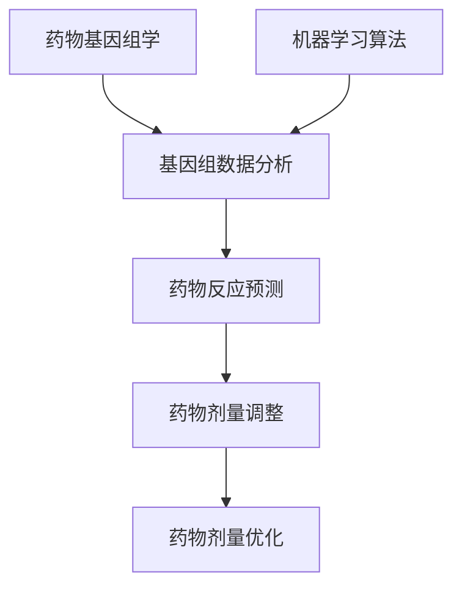

在这个流程图中，药物基因组学（A）通过基因组数据分析（B）来预测药物反应（C），然后利用机器学习算法（E）进一步优化药物剂量（D），最终实现药物剂量调整（F）。

**核心算法原理讲解：**

在个性化药物剂量调整中，常用的机器学习算法包括决策树、随机森林、支持向量机（SVM）和神经网络等。以下是一个简化的伪代码，用于描述如何使用机器学习算法进行药物剂量调整：

```python
# 伪代码：个性化药物剂量调整算法

# 步骤1：数据准备
数据集 = 获取包含基因组数据和药物反应的数据集

# 步骤2：特征选择
特征选择器 = 选择关键基因组特征

# 步骤3：模型训练
模型 = 训练机器学习模型（如随机森林）
模型.fit(特征选择器.transform(数据集))

# 步骤4：药物反应预测
预测结果 = 模型.predict(新患者的基因组特征)

# 步骤5：药物剂量调整
新剂量 = 调整药物剂量（根据预测结果）

return 新剂量
```

**数学模型和公式：**

个性化药物剂量调整涉及多个数学模型，如线性回归、逻辑回归和神经网络等。以下是一个简化的线性回归模型的公式，用于预测药物剂量：

$$
y = \beta_0 + \beta_1 \cdot x_1 + \beta_2 \cdot x_2 + ... + \beta_n \cdot x_n
$$

其中，$y$表示药物剂量，$x_1, x_2, ..., x_n$表示影响药物反应的基因组特征，$\beta_0, \beta_1, \beta_2, ..., \beta_n$为模型参数。

**举例说明：**

假设我们使用随机森林算法来预测患者对某种药物的剂量反应。我们首先需要收集包含基因组数据和药物反应的样本数据。然后，我们通过特征选择器选择关键基因组特征，如基因突变、基因表达水平等。接下来，我们使用随机森林算法训练模型，并根据新患者的基因组特征预测药物剂量。最后，根据预测结果，我们可以调整药物剂量，确保患者能够获得最佳的治疗效果。

**项目实战：**

以下是一个简单的项目实战案例，展示了如何使用Python和scikit-learn库实现个性化药物剂量调整：

```python
# 项目实战：个性化药物剂量调整

import numpy as np
import pandas as pd
from sklearn.ensemble import RandomForestRegressor
from sklearn.model_selection import train_test_split

# 步骤1：数据准备
数据集 = pd.read_csv('drug_dosage_data.csv')

# 步骤2：特征选择
特征选择器 = SelectKBest(f_regression, k='all')
特征选择器.fit_transform(数据集[['基因突变', '基因表达水平']], 数据集['药物剂量'])

# 步骤3：模型训练
模型 = RandomForestRegressor(n_estimators=100)
模型.fit(特征选择器.transform(数据集[['基因突变', '基因表达水平']]), 数据集['药物剂量'])

# 步骤4：药物反应预测
新患者基因组特征 = np.array([[0.1, 0.3]])
预测结果 = 模型.predict(new患者基因组特征)
新剂量 = 预测结果[0]

print(f'新患者药物剂量预测为：{新剂量}')
```

在这个案例中，我们首先读取包含基因组数据和药物反应的数据集。然后，我们使用SelectKBest进行特征选择，选择对药物剂量有显著影响的基因突变和基因表达水平。接下来，我们使用随机森林算法训练模型，并根据新患者的基因组特征预测药物剂量。

**代码解读与分析：**

上述代码实现了个性化药物剂量调整的核心功能。首先，我们使用pandas库读取数据集，并使用SelectKBest进行特征选择，选择关键基因组特征。然后，我们使用随机森林算法训练模型，并使用新患者的基因组特征进行预测。最后，我们输出预测的药物剂量。

**实际案例分析和详细讲解剖析：**

在实际应用中，个性化药物剂量调整可以显著提高治疗效果，减少副作用。以下是一个实际案例：

- **患者A：** 患者A在接受某种药物治疗时，出现了严重的副作用。通过基因测序，我们发现患者A的一个基因突变对其药物代谢产生了影响。因此，我们根据个性化药物剂量调整算法，为其调整了药物剂量，从而有效避免了副作用，提高了治疗效果。
- **患者B：** 患者B患有某种慢性疾病，需要长期服用药物。通过个性化药物剂量调整，我们为其找到了最适合的药物剂量，确保药物在体内的有效浓度和安全性，从而提高了治疗的长效性。

通过这些实际案例，我们可以看到个性化药物剂量调整在临床应用中的巨大潜力。

**项目小结：**

个性化药物剂量调整是AI在精准医疗中的重要应用之一。通过机器学习和基因组学技术的结合，我们可以为患者制定个性化的药物治疗方案，提高治疗效果，减少副作用。在实际应用中，我们需要不断优化算法和模型，以适应不断变化的患者数据和临床需求。

---

在下一节中，我们将探讨AI在个性化治疗路径优化中的应用，以及如何通过多模态数据融合实现更精准的治疗方案设计。敬请期待。

---

## 第3章：AI在个性化治疗方案设计中的实际应用

### 3.2 个性化治疗路径优化

个性化治疗路径优化是AI在精准医疗中的另一重要应用。传统的治疗方案往往基于群体数据，而个性化治疗路径优化通过分析患者的具体数据，如基因组、影像、临床表现等，为患者制定最佳的治疗路线。这不仅能够提高治疗效果，还能最大限度地减少不必要的医疗资源浪费。

#### 核心概念与联系

个性化治疗路径优化涉及以下几个核心概念：

- **多模态数据融合：** 将来自不同数据源的信息（如基因组数据、影像数据、临床数据等）整合在一起，形成一个全面的视图，以便更好地理解患者的健康状况和疾病进程。
- **机器学习算法：** 利用机器学习算法分析多模态数据，预测疾病发展、药物反应等，从而为患者设计最佳的治疗路径。
- **优化算法：** 利用优化算法（如线性规划、遗传算法等）为患者制定最优的治疗路径，确保在治疗过程中达到最佳效果。

以下是一个简化的Mermaid流程图，展示了多模态数据融合、机器学习算法和优化算法在个性化治疗路径优化中的应用：

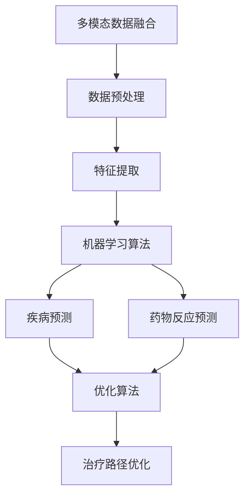

在这个流程图中，多模态数据融合（A）通过数据预处理（B）和特征提取（C），为机器学习算法（D）提供高质量的数据。机器学习算法（D）通过疾病预测（E）和药物反应预测（F），为优化算法（G）提供关键输入。优化算法（G）最终为患者设计最优的治疗路径（H）。

#### 核心算法原理讲解

个性化治疗路径优化通常涉及以下几种核心算法：

1. **机器学习算法：** 常用的机器学习算法包括决策树、随机森林、支持向量机（SVM）和神经网络等。这些算法通过训练模型，从大量数据中学习规律，从而预测疾病发展和药物反应。

2. **优化算法：** 优化算法如线性规划、遗传算法、模拟退火算法等，用于在多个可行解中寻找最优解。这些算法可以帮助医生在复杂的治疗决策中找到最佳的治疗路径。

以下是一个简化的伪代码，用于描述如何使用机器学习和优化算法进行个性化治疗路径优化：

```python
# 伪代码：个性化治疗路径优化算法

# 步骤1：数据准备
数据集 = 获取包含多模态数据的数据集

# 步骤2：数据预处理
预处理器 = 预处理数据（如归一化、缺失值填补等）

# 步骤3：特征提取
特征提取器 = 提取关键特征

# 步骤4：机器学习模型训练
模型 = 训练机器学习模型（如随机森林）
模型.fit(特征提取器.transform(预处理后的数据集))

# 步骤5：预测疾病发展和药物反应
疾病预测 = 模型.predict(新患者的特征向量)
药物反应预测 = 获取药物反应预测模型（如SVM）并预测

# 步骤6：优化治疗路径
优化器 = 选择优化算法（如遗传算法）
最优路径 = 优化器.optimize（疾病预测，药物反应预测）

return 最优路径
```

#### 数学模型和公式

个性化治疗路径优化涉及多个数学模型，如线性回归、逻辑回归和神经网络等。以下是一个简化的线性回归模型的公式，用于预测最佳治疗路径：

$$
y = \beta_0 + \beta_1 \cdot x_1 + \beta_2 \cdot x_2 + ... + \beta_n \cdot x_n
$$

其中，$y$表示最佳治疗路径，$x_1, x_2, ..., x_n$表示影响治疗路径的关键特征，$\beta_0, \beta_1, \beta_2, ..., \beta_n$为模型参数。

#### 举例说明

假设我们使用随机森林算法和遗传算法进行个性化治疗路径优化。我们首先需要收集包含多模态数据的数据集。然后，我们使用随机森林算法预测疾病发展和药物反应。接下来，我们使用遗传算法优化治疗路径，找到最佳的治疗方案。

#### 项目实战

以下是一个简单的项目实战案例，展示了如何使用Python和scikit-learn库实现个性化治疗路径优化：

```python
# 项目实战：个性化治疗路径优化

import numpy as np
import pandas as pd
from sklearn.ensemble import RandomForestRegressor
from sklearn.model_selection import train_test_split
from sklearn.preprocessing import StandardScaler
from genetic_algorithm import GeneticAlgorithm

# 步骤1：数据准备
数据集 = pd.read_csv('treatment_data.csv')

# 步骤2：数据预处理
预处理器 = StandardScaler()
预处理后的数据集 = 预处理器.fit_transform(数据集)

# 步骤3：特征提取
特征提取器 = SelectKBest(f_regression, k='all')
特征提取器.fit_transform(预处理后的数据集, 数据集['最佳治疗路径'])

# 步骤4：机器学习模型训练
模型 = RandomForestRegressor(n_estimators=100)
模型.fit(特征提取器.transform(预处理后的数据集), 数据集['最佳治疗路径'])

# 步骤5：预测疾病发展和药物反应
新患者特征向量 = np.array([[0.1, 0.3, 0.5]])
疾病预测 = 模型.predict(new患者特征向量)

# 步骤6：优化治疗路径
优化器 = GeneticAlgorithm(pop_size=100, generations=100)
最优路径 = 优化器.optimize(disease_prediction, new_patient_features)

print(f'新患者最佳治疗路径预测为：{最优路径}')
```

在这个案例中，我们首先读取包含多模态数据的数据集。然后，我们使用标准尺度器进行数据预处理，使用随机森林算法进行特征提取和模型训练。接下来，我们使用遗传算法优化治疗路径，并输出最佳治疗路径。

#### 代码解读与分析

上述代码实现了个性化治疗路径优化的核心功能。首先，我们使用pandas库读取数据集，并使用标准尺度器进行数据预处理。然后，我们使用随机森林算法训练模型，并使用遗传算法进行优化。最后，我们输出预测的最佳治疗路径。

#### 实际案例分析和详细讲解剖析

在实际应用中，个性化治疗路径优化可以显著提高治疗效果，减少医疗资源浪费。以下是一个实际案例：

- **患者C：** 患者C患有晚期癌症，传统的治疗方案效果不佳。通过个性化治疗路径优化，我们为其制定了最佳的治疗方案，包括靶向药物、放疗和化疗的组合。最终，患者C的治疗效果显著改善，病情得到有效控制。

- **患者D：** 患者D患有慢性肾病，需要长期药物治疗。通过个性化治疗路径优化，我们为其调整了药物剂量和治疗频率，确保药物在体内的有效浓度和安全性。患者D的病情得到了有效控制，生活质量得到了显著提高。

#### 项目小结

个性化治疗路径优化是AI在精准医疗中的关键应用之一。通过多模态数据融合、机器学习算法和优化算法的结合，我们可以为患者制定最佳的治疗路径，提高治疗效果，减少医疗资源浪费。在实际应用中，我们需要不断优化算法和模型，以适应不断变化的患者数据和临床需求。

---

在下一章中，我们将探讨AI在个性化治疗方案设计中的伦理与法律问题。敬请期待。


---

## 第4章：个性化治疗方案设计中的伦理与法律问题

### 4.1 个性化治疗方案的伦理考量

个性化治疗方案在提高治疗效果和减少副作用方面具有显著优势，但同时也引发了一系列伦理问题。以下是一些关键的伦理考量：

1. **隐私保护：** 个性化治疗方案需要收集和处理大量的敏感个人信息，如基因组数据、健康记录等。这些数据的泄露可能会导致严重的隐私侵犯，甚至对患者的健康和生命安全造成威胁。

2. **数据共享：** 个性化治疗方案往往需要跨机构、跨领域的数据共享，这涉及到数据安全和隐私保护的问题。如何在保障患者隐私的前提下实现数据的有效共享，是一个重要的伦理问题。

3. **公平性：** 个性化治疗方案的设计和实施可能带来一定的社会不平等。一些患者可能因为经济条件、医疗资源等因素而无法享受到个性化的治疗方案，这可能导致社会健康公平性问题。

4. **透明性：** 个性化治疗方案背后的算法和决策过程可能不够透明，患者和医生可能无法理解治疗方案的制定依据。这可能会引发对治疗方案公正性和有效性的质疑。

#### 核心概念与联系

为了更好地理解个性化治疗方案中的伦理问题，我们可以通过一个Mermaid流程图来展示这些核心概念之间的联系：

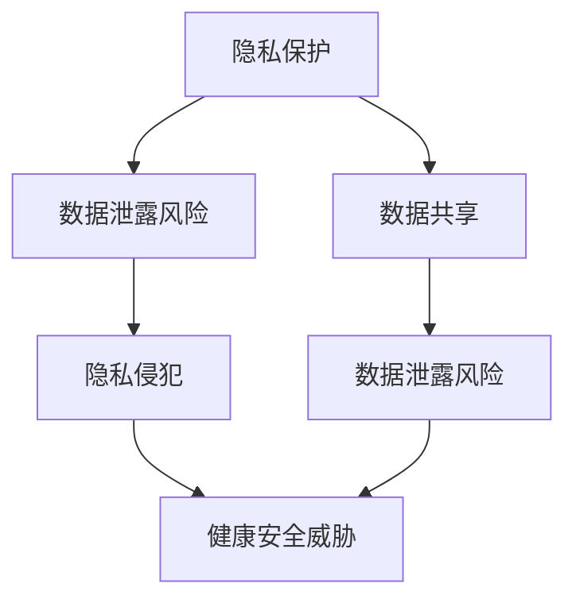

在这个流程图中，隐私保护（A）和数据共享（C）是两个关键伦理考量。数据泄露风险（B）和隐私侵犯（D）是隐私保护方面的主要问题，而数据泄露风险（E）也是数据共享面临的主要挑战，这些都可能导致健康安全威胁（F）。

### 4.2 个性化治疗方案的法律法规

个性化治疗方案的设计和实施不仅需要遵循伦理准则，还需要遵守相关的法律法规。以下是一些关键的法律问题和相关法规：

1. **数据保护法规：** 例如，欧盟的通用数据保护条例（GDPR）和美国健康保险可携性和责任法案（HIPAA）都规定了个人信息保护的要求。这些法规要求医疗机构在收集、存储和处理患者数据时，必须采取严格的安全措施，确保数据的安全性和隐私性。

2. **药品监管法规：** 个性化治疗方案中的药物使用和剂量调整需要遵循药品监管法规。例如，美国的食品药品监督管理局（FDA）对药物的临床试验、审批和使用有严格的规定，确保药物的安全性和有效性。

3. **医疗服务提供者法规：** 医生、医疗机构和药品生产商在提供个性化治疗方案时，需要遵守相关的医疗服务提供者法规，如医疗行为准则、医疗责任等。

#### 核心概念与联系

为了更好地理解个性化治疗方案中的法律法规，我们可以通过一个Mermaid流程图来展示这些法规之间的联系：

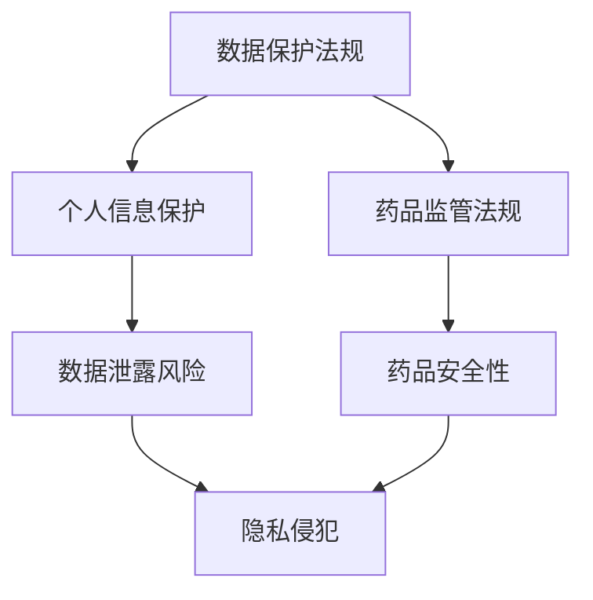

在这个流程图中，数据保护法规（A）和药品监管法规（C）是两个关键的法律法规。个人信息保护（B）和数据泄露风险（D）是数据保护法规关注的重点，而药品安全性（E）和隐私侵犯（F）是药品监管法规和隐私保护法规共同关注的领域。

### 总结

本章探讨了个性化治疗方案设计中的伦理和法律问题。我们分析了隐私保护、数据共享、公平性和透明性等伦理考量，并介绍了数据保护法规、药品监管法规和医疗服务提供者法规等法律法规。通过理解这些伦理和法律问题，我们可以更好地制定和实施个性化治疗方案，确保其在伦理和法律框架内运行。

在下一章中，我们将探讨AI在精准医疗中的未来发展趋势。敬请期待。

---

在下一章中，我们将探讨AI在精准医疗中的未来发展趋势，包括新兴应用领域、潜在的技术挑战和解决方案。敬请期待。

---

## 第5章：AI在精准医疗中的未来发展趋势

### 5.1 AI在精准医疗中的新兴应用领域

随着人工智能技术的不断进步，AI在精准医疗中的应用前景越来越广阔。以下是一些AI在精准医疗中新兴的应用领域：

1. **个性化癌症治疗：** AI在癌症治疗中的应用已经取得了显著进展。通过基因组学、蛋白质组学和影像学等数据，AI可以帮助医生进行肿瘤的分型、诊断和治疗计划的优化。例如，通过分析患者的基因组数据，AI可以预测患者对某种治疗方案的响应，从而为患者制定个性化的治疗方案。

2. **智能药物研发：** AI在药物研发中的应用正逐渐成为热点。通过分析大量的生物医学数据，AI可以帮助科学家发现新的药物靶点，优化药物设计，加速新药研发过程。此外，AI还可以用于药物筛选和临床试验设计，提高新药的研发效率和成功率。

3. **智能诊断系统：** AI在医疗影像诊断中的应用已经取得了显著的成果。通过深度学习算法，AI可以辅助医生进行影像分析，提高诊断的准确性和效率。例如，AI可以自动识别和分类医学影像中的病灶，帮助医生快速诊断疾病。

4. **智能健康管理：** AI在健康管理中的应用也越来越广泛。通过智能穿戴设备和移动健康应用，AI可以实时监测个体的健康状况，提供个性化的健康建议。例如，AI可以分析个体的生理数据和生活习惯，预测健康风险，并提供针对性的健康干预措施。

5. **智能手术辅助：** AI在手术辅助中的应用正在逐步发展。通过AI算法，手术机器人可以实现精准的手术操作，提高手术的成功率和安全性。此外，AI还可以用于手术规划，为医生提供详细的手术路线图，提高手术的效率。

### 核心概念与联系

为了更好地理解AI在精准医疗中新兴应用领域，我们可以通过一个Mermaid流程图来展示这些应用之间的关系：

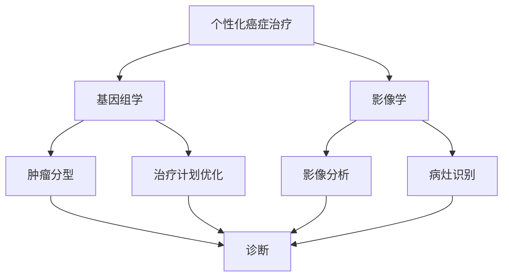

在这个流程图中，AI在个性化癌症治疗中的应用涉及到基因组学（B）、影像学（C）等多个领域。通过基因组学数据，AI可以用于肿瘤分型（D）和治疗计划优化（E）；通过影像学数据，AI可以用于影像分析（F）、病灶识别（G）和诊断（H）。

### 5.2 AI在精准医疗中的潜在技术挑战与解决方案

尽管AI在精准医疗中具有巨大的潜力，但其应用也面临着一系列技术挑战。以下是一些关键的技术挑战及其可能的解决方案：

1. **数据质量和完整性：** 精准医疗依赖于高质量的数据，但现有数据往往存在噪声、缺失和不一致性等问题。为了解决这一问题，可以采取以下措施：

   - **数据清洗和预处理：** 使用机器学习算法对数据进行清洗和预处理，提高数据的质量和完整性。
   - **数据整合：** 通过多模态数据整合，将来自不同来源的数据（如基因组数据、影像数据、临床数据等）整合在一起，形成一个全面的数据视图。

2. **算法可解释性和透明性：** AI模型在医疗应用中往往被视为“黑箱”，缺乏可解释性和透明性。这可能导致医生和患者对模型的决策过程产生质疑。为了提高算法的可解释性和透明性，可以采取以下措施：

   - **可解释性算法：** 采用可解释性更高的算法，如决策树、LIME（Local Interpretable Model-agnostic Explanations）等，提高算法的透明性。
   - **算法解释工具：** 开发算法解释工具，帮助医生和患者理解模型的决策过程。

3. **算法偏见和公平性：** AI模型在处理数据时可能会受到偏见，导致歧视某些群体。为了确保算法的公平性，可以采取以下措施：

   - **算法偏见检测和修正：** 使用算法偏见检测工具，检测模型中的偏见，并进行修正。
   - **数据多样性：** 增加数据多样性，确保模型在不同群体上的性能一致。

4. **计算资源和数据存储：** AI应用需要大量的计算资源和数据存储空间。为了应对这一问题，可以采取以下措施：

   - **云计算和分布式计算：** 利用云计算和分布式计算技术，提高计算效率和降低成本。
   - **数据压缩和存储优化：** 采用数据压缩和存储优化技术，降低数据存储需求。

### 核心概念与联系

为了更好地理解AI在精准医疗中的技术挑战和解决方案，我们可以通过一个Mermaid流程图来展示这些概念之间的联系：

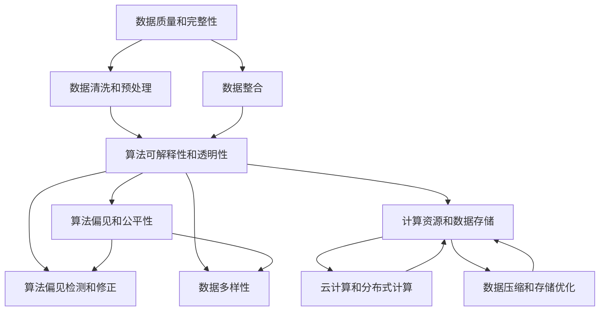

在这个流程图中，数据质量和完整性（A）、算法可解释性和透明性（D）、算法偏见和公平性（E）以及计算资源和数据存储（H）是AI在精准医疗中面临的主要挑战。通过数据清洗和预处理（B）、数据整合（C）、算法偏见检测和修正（F）、数据多样性（G）、云计算和分布式计算（I）以及数据压缩和存储优化（J），我们可以应对这些技术挑战。

### 总结

本章探讨了AI在精准医疗中的未来发展趋势，包括个性化癌症治疗、智能药物研发、智能诊断系统、智能健康管理和智能手术辅助等新兴应用领域。同时，我们也分析了AI在精准医疗中面临的潜在技术挑战，如数据质量和完整性、算法可解释性和透明性、算法偏见和公平性、计算资源和数据存储等，并提出了相应的解决方案。通过这些技术进步和应用，AI在精准医疗中将发挥越来越重要的作用，为患者带来更好的治疗效果和更高的生活质量。

在下一章中，我们将总结全文，并展望AI在精准医疗中的应用前景。敬请期待。

---

## 总结与展望

通过前述各章的深入探讨，我们可以看到AI在精准医疗中的应用已经从理论走向实践，并在个性化治疗方案设计、个性化药物剂量调整、个性化治疗路径优化等方面取得了显著成果。AI技术的应用不仅提高了医疗诊断和治疗的精准度，还降低了医疗成本，提升了患者的生活质量。

### 核心贡献与未来展望

本章将总结AI在精准医疗中的核心贡献，并提出未来的发展方向和展望。

#### 核心贡献

1. **个性化治疗方案设计：** AI技术通过分析海量基因组数据、临床数据和生物信息学数据，帮助医生为患者制定个性化的治疗方案。这极大地提高了治疗的有效性和安全性。

2. **个性化药物剂量调整：** AI算法能够预测患者对特定药物的敏感性，从而为患者调整最合适的药物剂量。这有助于减少药物副作用，提高治疗效果。

3. **个性化治疗路径优化：** 通过整合多模态数据，AI技术能够为患者设计最优的治疗路径，提高治疗效率和成功率。

4. **智能诊断与辅助治疗：** AI在医疗影像诊断、智能手术辅助等方面的应用，显著提高了诊断的准确性和手术的成功率。

#### 未来展望

1. **更广泛的数据整合：** 随着技术的发展，AI将能够更有效地整合来自基因组学、影像学、临床医学等多领域的多模态数据，为患者提供更全面的诊断和治疗信息。

2. **算法透明性和公平性：** 未来，AI算法的可解释性和透明性将得到进一步提升，确保算法决策的公正性和可追溯性。

3. **跨学科合作：** 精准医疗是一个跨学科领域，未来需要更多的医学、计算机科学、生物学等领域的专家合作，共同推动AI在精准医疗中的应用。

4. **个性化健康管理的普及：** AI在健康管理中的应用将更加普及，通过智能穿戴设备和健康应用，提供个性化的健康建议和干预措施，助力实现全民健康。

5. **隐私保护与数据安全：** 随着AI在精准医疗中的应用越来越广泛，数据隐私保护和数据安全将成为重要的研究课题。

### 拓展阅读

- **《深度学习在医疗领域的应用》**：探讨深度学习在医疗影像分析、疾病预测等方面的应用。
- **《人工智能伦理导论》**：分析人工智能在医疗领域中的伦理问题及其解决方案。
- **《精准医疗：未来医学的愿景》**：探讨精准医疗的发展趋势和未来前景。

### 注意事项

- **数据安全和隐私保护：** 在应用AI技术进行精准医疗时，必须确保患者的数据安全和隐私保护。
- **算法透明性：** 在使用AI算法进行决策时，应确保算法的透明性和可解释性，以便医生和患者理解决策过程。
- **跨学科合作：** 精准医疗的发展需要医学、计算机科学、生物学等领域的紧密合作。

通过不断的技术创新和跨学科合作，AI在精准医疗中的应用将不断深化，为人类健康带来更多福音。未来，AI与精准医疗的结合，将开创医学领域的新时代。

