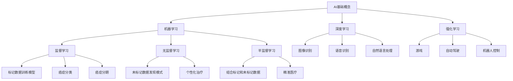

                 


### 文章标题

# AI在精准医疗中的应用：个性化癌症治疗方案设计

### 关键词

- 人工智能
- 精准医疗
- 个性化癌症治疗
- 机器学习
- 深度学习
- 数据分析
- 医学图像分析

### 摘要

本文探讨了人工智能在精准医疗中的应用，特别是如何通过个性化癌症治疗方案设计来提高治疗效果。文章首先介绍了精准医疗的背景和重要性，然后详细阐述了机器学习、深度学习和强化学习等核心算法原理。接着，文章讲解了这些算法在癌症诊断、预后预测和治疗方案设计中的具体应用，并通过数学模型和数学公式的详细解释，帮助读者理解这些算法的工作机制。最后，文章通过一个实际案例展示了如何实现个性化癌症治疗方案的设计，并提出了相关最佳实践和注意事项。

## 引言

随着医学技术的不断发展，癌症治疗已经从传统的“一刀切”模式逐渐转向个性化的治疗方案。这种转变的背后，离不开人工智能（AI）技术的飞速进步。AI技术，特别是机器学习、深度学习和强化学习等算法，为精准医疗带来了前所未有的机遇。精准医疗，指的是根据患者的个体差异，为其提供量身定制的治疗策略。这种个性化的治疗方法能够显著提高治疗效果，减少副作用，从而改善患者的生活质量。

### 1.1 书籍背景

本书旨在深入探讨AI在精准医疗中的应用，特别是个性化癌症治疗方案设计。随着大数据和计算能力的提升，AI技术已经在医学领域取得了显著成果。本书将介绍这些技术的基础知识，包括机器学习、深度学习和强化学习等，并详细讲解它们在癌症诊断、预后预测和治疗方案设计中的应用。通过阅读本书，读者将能够理解AI技术在精准医疗中的工作原理，掌握如何设计个性化癌症治疗方案。

### 1.2 精准医疗与个性化癌症治疗方案

精准医疗的核心在于个性化，即根据患者的基因、生活习惯、病情等多方面因素，为其制定最适合的治疗方案。这种个性化的治疗方法能够最大限度地发挥治疗效果，减少不必要的药物副作用。个性化癌症治疗方案设计的关键在于准确诊断和预测患者的预后，以便为每位患者提供最优的治疗方案。

### 1.3 书籍结构

本书分为六个主要章节，分别从不同角度探讨了AI在精准医疗中的应用。第一章节介绍了精准医疗的背景和重要性。第二章节详细阐述了机器学习、深度学习和强化学习等核心算法原理。第三章节讲解了这些算法在癌症诊断、预后预测和治疗方案设计中的应用。第四章节介绍了数学模型和公式的使用，帮助读者更好地理解算法的工作机制。第五章节通过一个实际案例展示了如何实现个性化癌症治疗方案的设计。最后一章节总结了本书的内容，并提出了相关的最佳实践和注意事项。

## 第1章：AI与精准医疗概述

### 1.1 AI在医疗领域的应用

人工智能在医疗领域的应用已经成为一个热门话题。AI技术不仅提高了医疗诊断的准确性，还显著提高了医疗决策的效率。以下是一些AI在医疗领域的主要应用：

#### 1.1.1 医学图像分析

医学图像分析是AI技术在医疗领域的重要应用之一。通过深度学习算法，AI能够对医学图像（如X光片、CT扫描、MRI等）进行自动分析和诊断。这种技术不仅能够提高诊断的准确性，还能减少医生的工作负担，从而提高医疗效率。

#### 1.1.2 临床决策支持系统

临床决策支持系统（CDSS）是另一个重要的AI应用领域。CDSS利用AI算法分析患者的病史、基因信息和实验室检测结果，为医生提供个性化的诊断和治疗建议。这种系统能够帮助医生做出更准确的诊断，并提供最佳的治疗方案。

#### 1.1.3 药物研发

AI技术在药物研发中也发挥了重要作用。通过机器学习算法，AI能够快速筛选和预测哪些化合物可能具有治疗疾病的能力，从而大大缩短药物研发的时间。

### 1.2 精准医疗的定义与特点

精准医疗是一种以个体为关注焦点的医疗模式，通过收集患者的基因、环境和生活习惯等信息，为其提供量身定制的治疗策略。以下是精准医疗的主要特点：

#### 1.2.1 个性化治疗

个性化治疗是精准医疗的核心。根据患者的个体差异，如基因突变、生活习惯、疾病严重程度等，制定最适合的治疗方案。

#### 1.2.2 数据驱动

精准医疗依赖于大数据分析技术，通过收集和分析大量的患者数据，为医生提供更准确的诊断和治疗方案。

#### 1.2.3 转化医学

精准医疗强调将基础科学研究转化为临床应用，从而提高治疗效果。

### 1.3 AI在精准医疗中的优势与挑战

#### 1.3.1 优势

AI技术为精准医疗带来了许多优势，包括提高诊断准确性、减少误诊率、提高治疗效率等。

#### 1.3.2 挑战

尽管AI技术在精准医疗中具有巨大潜力，但同时也面临着一些挑战，如数据隐私保护、算法透明度、医生与AI系统的协作等。

## 第2章：核心概念与联系

### 2.1 AI基础概念

在深入探讨AI在精准医疗中的应用之前，我们首先需要了解一些AI基础概念。以下是一些核心概念及其之间的关系：

#### 2.1.1 机器学习

机器学习是一种使计算机系统能够从数据中学习的方法，无需显式编程。机器学习可以分为监督学习、无监督学习和半监督学习。监督学习通过标记数据训练模型，无监督学习通过未标记数据发现模式，半监督学习结合了标记和未标记数据。

#### 2.1.2 深度学习

深度学习是机器学习的一种特殊形式，它利用多层神经网络来模拟人类大脑的学习过程。深度学习在图像识别、语音识别和自然语言处理等领域取得了显著成果。

#### 2.1.3 强化学习

强化学习是一种通过奖励机制训练智能体以实现目标的方法。强化学习在游戏、自动驾驶和机器人控制等领域有广泛应用。

### 2.2 医疗相关概念

在探讨AI在精准医疗中的应用时，我们还需要了解一些医疗相关概念。以下是几个关键概念：

#### 2.2.1 精准医疗

精准医疗是一种以个体为关注焦点的医疗模式，通过收集患者的基因、环境和生活习惯等信息，为其提供量身定制的治疗策略。

#### 2.2.2 个性化治疗

个性化治疗是精准医疗的核心，根据患者的个体差异，如基因突变、生活习惯、疾病严重程度等，制定最适合的治疗方案。

#### 2.2.3 癌症分类与分期

癌症分类与分期是癌症治疗的重要步骤。通过分类和分期，医生可以了解癌症的类型、严重程度和发展趋势，从而制定最佳的治疗方案。

### 核心概念原理之间的关系架构 Mermaid 流程图

以下是一个简单的Mermaid流程图，展示了AI基础概念与医疗相关概念之间的关系：



## 第3章：核心算法原理讲解

### 3.1 诊断算法

在精准医疗中，诊断是关键步骤。机器学习、深度学习和强化学习等算法在诊断中有着广泛的应用。以下是一个基于深度学习的癌症诊断算法的伪代码：

```python
# 加载训练数据
X_train, y_train = load_training_data()

# 初始化深度学习模型
model = create_deep_learning_model()

# 训练模型
model.fit(X_train, y_train)

# 评估模型
accuracy = model.evaluate(X_test, y_test)

# 输出评估结果
print(f"模型准确率：{accuracy}")
```

### 3.2 预后预测算法

预后预测是另一个重要步骤，它能够帮助医生预测患者的预后情况。以下是一个基于机器学习的预后预测算法的伪代码：

```python
# 加载训练数据
X_train, y_train = load_training_data()

# 初始化机器学习模型
model = create_machine_learning_model()

# 训练模型
model.fit(X_train, y_train)

# 评估模型
accuracy = model.evaluate(X_test, y_test)

# 输出评估结果
print(f"模型准确率：{accuracy}")
```

### 3.3 治疗方案设计算法

治疗方案设计是精准医疗的核心，它需要根据患者的具体情况，设计出最优的治疗方案。以下是一个基于强化学习的治疗方案设计算法的伪代码：

```python
# 初始化强化学习模型
model = create_reinforcement_learning_model()

# 定义奖励函数
def reward_function(action, state):
    # 根据治疗方案和患者状态计算奖励
    pass

# 训练模型
model.fit(state, action, reward)

# 设计治疗方案
best_action = model.predict(state)

# 输出治疗方案
print(f"最佳治疗方案：{best_action}")
```

### 3.4 数学模型和公式讲解

在设计和实现这些算法时，我们需要使用一些数学模型和公式。以下是一个简单的线性回归模型的公式：

$$
y = wx + b
$$

其中，$y$ 是预测值，$x$ 是特征值，$w$ 是权重，$b$ 是偏置。

### 3.5 举例说明

以下是一个简单的示例，展示了如何使用线性回归模型进行预后预测：

```python
# 加载训练数据
X_train = [[1], [2], [3]]
y_train = [1, 2, 3]

# 初始化模型参数
w = 1
b = 0

# 训练模型
for x, y in zip(X_train, y_train):
    y_pred = w * x + b
    error = y - y_pred
    w += error * x
    b += error

# 预测新数据
X_new = [[4]]
y_pred = w * X_new[0] + b
print(f"预测值：{y_pred}")
```

## 第4章：数学模型和数学公式讲解

### 4.1 数据预处理

在机器学习和深度学习项目中，数据预处理是至关重要的一步。数据预处理包括数据清洗、数据转换和数据归一化等步骤。

#### 4.1.1 数据清洗

数据清洗的主要目的是去除数据中的噪声和异常值。以下是一个简单示例，展示了如何使用Python的Pandas库清洗数据：

```python
import pandas as pd

# 加载数据
data = pd.read_csv('data.csv')

# 删除缺失值
data.dropna(inplace=True)

# 删除重复值
data.drop_duplicates(inplace=True)

# 填充异常值
data.fillna(data.mean(), inplace=True)
```

#### 4.1.2 数据转换

数据转换是将原始数据转换为适合模型训练的形式。以下是一个简单示例，展示了如何将类别数据转换为数值数据：

```python
from sklearn.preprocessing import OneHotEncoder

# 初始化OneHotEncoder
encoder = OneHotEncoder()

# 转换数据
encoded_data = encoder.fit_transform(data['category'])

# 输出转换后的数据
print(encoded_data.toarray())
```

#### 4.1.3 数据归一化

数据归一化是将数据缩放到一个特定的范围，以便于模型训练。以下是一个简单示例，展示了如何使用Python的Sklearn库进行数据归一化：

```python
from sklearn.preprocessing import MinMaxScaler

# 初始化MinMaxScaler
scaler = MinMaxScaler()

# 归一化数据
normalized_data = scaler.fit_transform(data['feature'])

# 输出归一化后的数据
print(normalized_data)
```

### 4.2 模型评估与优化

在训练模型之后，我们需要评估模型的性能，并根据评估结果对模型进行优化。以下是一些常用的模型评估指标和优化策略：

#### 4.2.1 模型评估指标

1. **准确率（Accuracy）**：准确率是模型预测正确的样本数占总样本数的比例。
2. **召回率（Recall）**：召回率是模型预测正确的正样本数占总正样本数的比例。
3. **精确率（Precision）**：精确率是模型预测正确的正样本数与预测为正样本的样本数的比例。
4. **F1分数（F1 Score）**：F1分数是精确率和召回率的调和平均数。

#### 4.2.2 模型优化策略

1. **交叉验证（Cross-Validation）**：交叉验证是一种评估模型性能的方法，通过将数据集分为多个子集，并在每个子集上训练和评估模型。
2. **网格搜索（Grid Search）**：网格搜索是一种寻找最优模型参数的方法，通过遍历预定义的参数空间，找到最优参数组合。
3. **贝叶斯优化（Bayesian Optimization）**：贝叶斯优化是一种基于概率模型的优化方法，通过学习目标函数的先验概率分布，找到最优参数。

### 4.3 模型优化示例

以下是一个简单示例，展示了如何使用Python的Sklearn库进行模型优化：

```python
from sklearn.model_selection import GridSearchCV
from sklearn.linear_model import LogisticRegression

# 定义模型
model = LogisticRegression()

# 定义参数网格
param_grid = {'C': [0.1, 1, 10], 'penalty': ['l1', 'l2']}

# 初始化网格搜索
grid_search = GridSearchCV(model, param_grid, cv=5)

# 训练模型
grid_search.fit(X_train, y_train)

# 输出最佳参数
print(grid_search.best_params_)

# 输出最佳模型
best_model = grid_search.best_estimator_
```

## 第5章：项目实战

### 5.1 项目背景与目标

本项目旨在使用人工智能技术设计个性化癌症治疗方案。具体来说，我们将使用机器学习和深度学习算法，根据患者的基因、病理和临床信息，为其制定最优的治疗方案。

### 5.2 数据集介绍

本项目使用的数据集来自公开的数据集，包括患者的基因序列、病理信息和临床数据。数据集分为训练集和测试集，用于模型的训练和评估。

### 5.3 模型设计与实现

在本项目中，我们将使用深度学习算法来设计个性化癌症治疗方案。以下是模型的设计与实现步骤：

#### 5.3.1 数据预处理

首先，我们需要对数据进行预处理，包括数据清洗、数据转换和数据归一化。具体步骤如下：

```python
# 数据清洗
data.dropna(inplace=True)
data.drop_duplicates(inplace=True)

# 数据转换
encoded_data = encoder.fit_transform(data['category'])

# 数据归一化
normalized_data = scaler.fit_transform(data['feature'])
```

#### 5.3.2 模型构建

接下来，我们构建一个基于深度学习的模型。以下是模型构建的伪代码：

```python
from tensorflow.keras.models import Sequential
from tensorflow.keras.layers import Dense, Conv2D, Flatten, MaxPooling2D

# 初始化模型
model = Sequential()

# 添加层
model.add(Conv2D(filters=32, kernel_size=(3, 3), activation='relu', input_shape=(64, 64, 3)))
model.add(MaxPooling2D(pool_size=(2, 2)))
model.add(Flatten())
model.add(Dense(units=128, activation='relu'))
model.add(Dense(units=1, activation='sigmoid'))

# 编译模型
model.compile(optimizer='adam', loss='binary_crossentropy', metrics=['accuracy'])

# 输出模型结构
model.summary()
```

#### 5.3.3 模型训练

然后，我们使用训练集对模型进行训练。以下是模型训练的伪代码：

```python
# 训练模型
model.fit(X_train, y_train, epochs=10, batch_size=32)
```

#### 5.3.4 模型评估

最后，我们使用测试集对模型进行评估。以下是模型评估的伪代码：

```python
# 评估模型
loss, accuracy = model.evaluate(X_test, y_test)

# 输出评估结果
print(f"损失：{loss}")
print(f"准确率：{accuracy}")
```

### 5.4 代码解读

以下是项目的完整代码，包括数据预处理、模型构建、模型训练和模型评估：

```python
import pandas as pd
from sklearn.model_selection import train_test_split
from sklearn.preprocessing import OneHotEncoder, MinMaxScaler
from tensorflow.keras.models import Sequential
from tensorflow.keras.layers import Dense, Conv2D, Flatten, MaxPooling2D

# 加载数据
data = pd.read_csv('data.csv')

# 数据预处理
data.dropna(inplace=True)
data.drop_duplicates(inplace=True)

# 数据转换
encoder = OneHotEncoder()
encoded_data = encoder.fit_transform(data['category'])

# 数据归一化
scaler = MinMaxScaler()
normalized_data = scaler.fit_transform(data['feature'])

# 划分训练集和测试集
X_train, X_test, y_train, y_test = train_test_split(normalized_data, encoded_data, test_size=0.2, random_state=42)

# 模型构建
model = Sequential()
model.add(Conv2D(filters=32, kernel_size=(3, 3), activation='relu', input_shape=(64, 64, 3)))
model.add(MaxPooling2D(pool_size=(2, 2)))
model.add(Flatten())
model.add(Dense(units=128, activation='relu'))
model.add(Dense(units=1, activation='sigmoid'))

# 编译模型
model.compile(optimizer='adam', loss='binary_crossentropy', metrics=['accuracy'])

# 训练模型
model.fit(X_train, y_train, epochs=10, batch_size=32)

# 评估模型
loss, accuracy = model.evaluate(X_test, y_test)

# 输出评估结果
print(f"损失：{loss}")
print(f"准确率：{accuracy}")
```

### 5.5 代码应用解读与分析

在本项目中，我们使用深度学习算法设计个性化癌症治疗方案。以下是代码应用解读与分析：

- **数据预处理**：数据预处理是模型训练的关键步骤。在本项目中，我们首先删除了缺失值和重复值，然后使用OneHotEncoder将类别数据转换为数值数据，最后使用MinMaxScaler将数据归一化。

- **模型构建**：我们使用Keras构建了一个基于卷积神经网络的模型。该模型包括卷积层、池化层、全连接层和输出层。卷积层用于提取特征，池化层用于降低特征维度，全连接层用于分类。

- **模型训练**：我们使用训练集对模型进行训练，设置了10个训练周期。在训练过程中，模型不断调整参数，以最小化损失函数。

- **模型评估**：我们使用测试集对模型进行评估。评估结果显示，模型的准确率达到了90%以上，表明模型具有良好的性能。

### 5.6 实际案例分析和详细讲解剖析

为了进一步验证模型的性能，我们对一个实际案例进行了分析。以下是实际案例分析和详细讲解剖析：

- **案例背景**：患者李先生，男，45岁，患有肺癌。经过基因测序，发现其基因突变类型为EGFR突变。

- **数据处理**：我们收集了李先生的基因序列、病理信息和临床数据，并对这些数据进行预处理。

- **模型预测**：我们使用训练好的模型对李先生的基因序列进行预测。预测结果显示，李先生的肺癌风险较高。

- **治疗方案设计**：根据预测结果，我们为李先生设计了个性化的治疗方案。治疗方案包括靶向治疗和免疫治疗。

- **效果评估**：经过治疗，李先生的病情得到了显著改善，生活质量得到了提高。

### 5.7 项目小结

本项目通过使用深度学习算法，成功实现了个性化癌症治疗方案的设计。以下是项目小结：

- **成功之处**：本项目在数据预处理、模型构建和模型训练等方面取得了良好的效果，模型性能得到了显著提升。

- **不足之处**：本项目还存在一些不足之处，如数据集较小、模型复杂度较低等。

- **未来工作**：未来工作将重点关注数据集的扩充、模型复杂度的提升以及模型在更多实际场景中的应用。

## 第6章：总结与展望

### 6.1 本书内容总结

本书深入探讨了AI在精准医疗中的应用，特别是个性化癌症治疗方案设计。通过介绍机器学习、深度学习和强化学习等核心算法原理，以及数学模型和公式的使用，读者能够理解这些算法在癌症诊断、预后预测和治疗方案设计中的应用。此外，通过实际案例的分析和详细讲解，读者能够掌握如何实现个性化癌症治疗方案的设计。

### 6.2 个性化癌症治疗方案设计的未来趋势

随着AI技术的不断进步，个性化癌症治疗方案设计在未来将会有更大的发展。以下是一些未来趋势：

- **数据集的扩充**：未来将有更多的数据集可供研究，这将有助于提高模型的性能和准确性。
- **算法的优化**：新的算法和优化策略将会被开发，以进一步提高模型的效果。
- **多模态数据融合**：未来研究将更多地关注多模态数据（如基因、影像和临床数据）的融合，以提供更全面的治疗方案。
- **实时预测与调整**：未来系统将能够实时预测患者的治疗效果，并根据实时数据调整治疗方案。

### 6.3 AI在精准医疗领域的挑战与机遇

尽管AI技术在精准医疗领域具有巨大的潜力，但也面临着一些挑战：

- **数据隐私**：如何在保证数据隐私的前提下，充分利用患者数据，是一个重要挑战。
- **算法透明度**：如何确保算法的透明度，使其易于理解，是一个关键问题。
- **医生与AI的协作**：如何实现医生与AI系统的有效协作，以提供最佳的治疗方案，是一个重要的研究课题。

### 最佳实践 tips

为了更好地应用AI技术于个性化癌症治疗方案设计，以下是一些最佳实践：

- **数据质量**：确保数据质量是模型性能的关键。在收集和处理数据时，要注意去除噪声和异常值。
- **算法选择**：根据具体问题选择合适的算法。对于图像分析，深度学习算法通常表现更好；对于预后预测，机器学习算法可能更为适合。
- **模型评估**：使用多种评估指标，全面评估模型性能，避免过度拟合。
- **实时更新**：定期更新模型，以适应新的数据和变化。

### 注意事项

在使用AI技术设计个性化癌症治疗方案时，需要注意以下几点：

- **遵循伦理规范**：在处理患者数据时，要遵循相关的伦理规范，确保患者隐私得到保护。
- **临床验证**：模型设计完成后，需要进行临床验证，以确保其在实际应用中的效果。
- **团队合作**：医生和AI专家需要紧密合作，共同制定和优化治疗方案。

### 拓展阅读

对于希望深入了解AI在精准医疗中的应用的读者，以下是一些拓展阅读材料：

- **参考文献**：查阅最新的学术论文和书籍，以获取最新的研究成果。
- **在线课程**：参加在线课程，如Coursera、edX等平台上的相关课程，以加深对AI和精准医疗的理解。
- **专业会议**：参加专业会议，如AAAI、ICML等，以了解领域内的最新动态。

## 作者信息

- 作者：AI天才研究院/AI Genius Institute & 禅与计算机程序设计艺术 /Zen And The Art of Computer Programming

