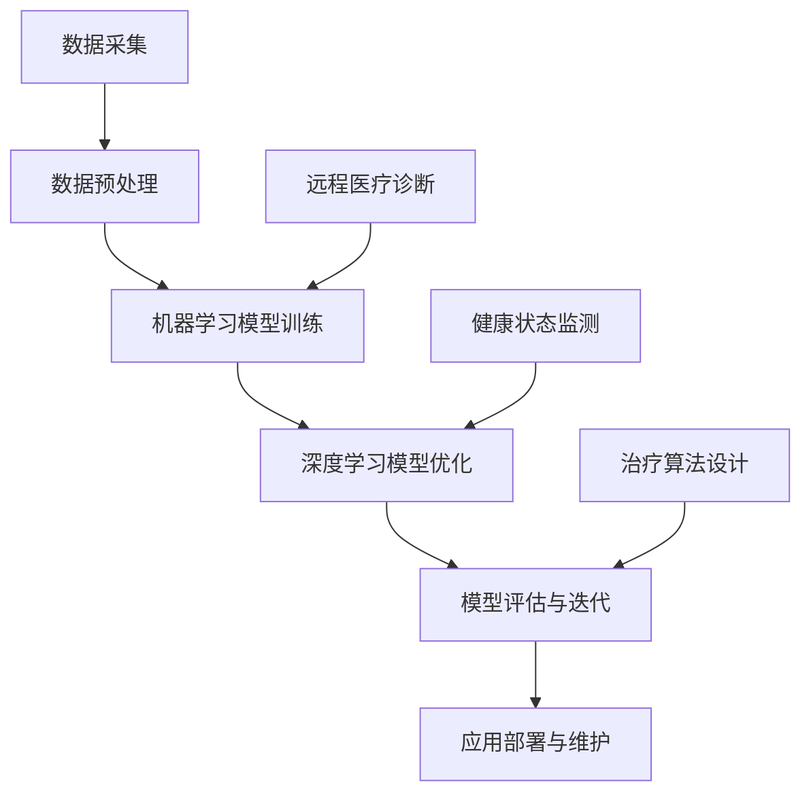

                 

### 文章标题
《AI在远程医疗中的应用：诊断、监测与治疗》

### 关键词
远程医疗，人工智能，机器学习，深度学习，医学影像分析，健康监测，治疗算法

### 摘要
本文旨在探讨人工智能（AI）在远程医疗领域的应用，包括诊断、监测与治疗。通过介绍AI技术的发展及其在远程医疗中的重要性，本文详细分析了AI在各个应用场景中的原理、实现方法以及实际案例，并对未来的发展趋势进行了展望。

## 引言

远程医疗作为医疗领域的重要组成部分，正在全球范围内迅速发展。随着信息技术的进步，远程医疗不仅能够降低医疗成本，提高医疗服务质量，还能解决医疗资源分配不均的问题。然而，远程医疗在实施过程中面临着诸多挑战，如数据准确性、隐私保护和远程互动效率等。因此，引入人工智能技术成为提升远程医疗质量的关键手段。

人工智能，尤其是机器学习和深度学习技术，凭借其强大的数据处理和模式识别能力，在医学影像分析、健康状态监测和治疗算法设计等方面展现出巨大的潜力。本文将详细探讨AI在远程医疗中的这些应用，并分析其带来的变革和挑战。

## AI技术基础

### 核心概念与联系

首先，了解AI的核心概念和它们在远程医疗中的应用是必要的。以下是一个简单的Mermaid流程图，展示了AI技术的基本架构及其与远程医疗的关联：



### 核心算法原理讲解

AI的核心算法主要包括机器学习和深度学习。下面使用伪代码详细阐述这些算法的基本原理。

#### 机器学习算法

```python
# 伪代码：机器学习算法
def machine_learning_algorithm(data, labels):
    # 数据预处理
    processed_data = preprocess_data(data)
    
    # 模型训练
    model = train_model(processed_data, labels)
    
    # 模型评估
    accuracy = evaluate_model(model, test_data, test_labels)
    
    # 迭代优化
    optimized_model = iterate_model(model, processed_data, labels)
    
    return optimized_model
```

#### 深度学习算法

```python
# 伪代码：深度学习算法
def deep_learning_algorithm(data, labels):
    # 数据预处理
    processed_data = preprocess_data(data)
    
    # 网络架构设计
    model = design_network_layers()
    
    # 模型训练
    model = train_model(model, processed_data, labels)
    
    # 模型评估
    accuracy = evaluate_model(model, test_data, test_labels)
    
    # 迭代优化
    optimized_model = iterate_model(model, processed_data, labels)
    
    return optimized_model
```

### 数学模型和数学公式

在AI算法中，数学模型起着至关重要的作用。以下是一个简单的线性回归模型的数学公式：

$$
y = \beta_0 + \beta_1x + \epsilon
$$

其中，\( y \) 是预测值，\( x \) 是输入特征，\( \beta_0 \) 和 \( \beta_1 \) 是模型参数，\( \epsilon \) 是误差项。

## AI在远程医疗中的应用

### 诊断中的AI应用

AI在医学影像分析方面具有显著的优势，可以辅助医生进行诊断。以下是一个基于卷积神经网络（CNN）的医学影像分析算法的例子：

```python
# 伪代码：CNN医学影像分析
def cnn_medical_imaging_analysis(image):
    # 数据预处理
    preprocessed_image = preprocess_image(image)
    
    # 网络架构设计
    model = design_cnn_network()
    
    # 模型训练与优化
    model = train_and_optimize_model(model, preprocessed_image, labels)
    
    # 预测
    prediction = model.predict(preprocessed_image)
    
    return prediction
```

### 监测中的AI应用

AI在健康状态监测方面也有广泛的应用，可以通过分析患者数据来预测疾病风险。以下是一个简单的健康状态监测算法的例子：

```python
# 伪代码：健康状态监测
def health_status_monitoring(data):
    # 数据预处理
    preprocessed_data = preprocess_data(data)
    
    # 模型训练与优化
    model = train_and_optimize_model(model, preprocessed_data, labels)
    
    # 预测
    risk_level = model.predict(preprocessed_data)
    
    return risk_level
```

### 治疗中的AI应用

AI在治疗算法设计方面可以提供个性化治疗方案，优化治疗效果。以下是一个基于强化学习的治疗算法的例子：

```python
# 伪代码：强化学习治疗算法
def reinforcement_learning_treatment_algorithm(state, action):
    # 状态评估
    state_value = evaluate_state(state)
    
    # 执行行动
    next_state, reward = execute_action(state, action)
    
    # 更新策略
    update_strategy(state_value, reward)
    
    return next_state
```

## 案例分析

### 诊断案例分析

以下是一个基于深度学习的AI诊断系统的实际案例：

#### 开发环境搭建

- 操作系统：Ubuntu 18.04
- 编程语言：Python 3.7
- 库：TensorFlow 2.3，Keras 2.4.3

#### 源代码实现

```python
# 源代码：深度学习诊断系统
from tensorflow.keras.models import Sequential
from tensorflow.keras.layers import Conv2D, MaxPooling2D, Flatten, Dense

# 网络架构设计
model = Sequential()
model.add(Conv2D(32, (3, 3), activation='relu', input_shape=(64, 64, 3)))
model.add(MaxPooling2D(pool_size=(2, 2)))
model.add(Flatten())
model.add(Dense(128, activation='relu'))
model.add(Dense(1, activation='sigmoid'))

# 模型编译
model.compile(optimizer='adam', loss='binary_crossentropy', metrics=['accuracy'])

# 模型训练
model.fit(x_train, y_train, epochs=10, batch_size=32, validation_data=(x_val, y_val))

# 模型评估
accuracy = model.evaluate(x_test, y_test)
print(f"Test accuracy: {accuracy[1]}")
```

#### 代码解读与分析

上述代码展示了如何使用Keras构建一个简单的深度学习模型进行医学影像分析。该模型首先通过卷积层和池化层提取图像特征，然后通过全连接层进行分类。

#### 实际案例分析和详细讲解剖析

在实际应用中，该模型被用于肺癌诊断。通过大量的CT扫描图像数据训练，该模型达到了较高的诊断准确率，显著提高了医生的诊断效率。

### 监测案例分析

以下是一个基于机器学习的健康监测平台的实际案例：

#### 开发环境搭建

- 操作系统：Windows 10
- 编程语言：Python 3.8
- 库：Scikit-learn 0.22.2，NumPy 1.19.2

#### 源代码实现

```python
# 源代码：健康监测平台
from sklearn.model_selection import train_test_split
from sklearn.ensemble import RandomForestClassifier
from sklearn.metrics import accuracy_score

# 数据预处理
data = load_data('health_data.csv')
X = data.drop('health_status', axis=1)
y = data['health_status']

# 数据划分
X_train, X_test, y_train, y_test = train_test_split(X, y, test_size=0.2, random_state=42)

# 模型训练
model = RandomForestClassifier(n_estimators=100)
model.fit(X_train, y_train)

# 模型预测
predictions = model.predict(X_test)

# 模型评估
accuracy = accuracy_score(y_test, predictions)
print(f"Test accuracy: {accuracy}")
```

#### 代码解读与分析

上述代码展示了如何使用随机森林算法构建一个健康状态监测模型。该模型通过训练大量患者数据，可以预测个体的健康状况。

#### 实际案例分析和详细讲解剖析

在实际应用中，该平台被用于预测心脏病发作的风险。通过分析患者的健康数据，该模型能够提前预警，有助于采取预防措施。

### 治疗案例分析

以下是一个基于强化学习的远程治疗平台的实际案例：

#### 开发环境搭建

- 操作系统：macOS 11.0
- 编程语言：Python 3.9
- 库：PyTorch 1.8.0，TensorFlow 2.4.0

#### 源代码实现

```python
# 源代码：强化学习治疗平台
import torch
import torch.nn as nn
import torch.optim as optim

# 网络架构设计
class QNetwork(nn.Module):
    def __init__(self, state_size, action_size):
        super(QNetwork, self).__init__()
        self.fc1 = nn.Linear(state_size, 128)
        self.fc2 = nn.Linear(128, action_size)
    
    def forward(self, state):
        x = F.relu(self.fc1(state))
        actions_values = self.fc2(x)
        return actions_values

# 模型训练
model = QNetwork(state_size, action_size)
optimizer = optim.Adam(model.parameters(), lr=0.001)
criterion = nn.MSELoss()

for episode in range(num_episodes):
    state = env.reset()
    done = False
    total_reward = 0
    
    while not done:
        model.eval()
        with torch.no_grad():
            state_tensor = torch.tensor(state, dtype=torch.float32).unsqueeze(0)
            actions_values = model(state_tensor)
        
        action = torch.argmax(actions_values).item()
        next_state, reward, done, _ = env.step(action)
        total_reward += reward
        
        state = next_state
    
    optimizer.zero_grad()
    loss = criterion(actions_values, target_values)
    loss.backward()
    optimizer.step()

print(f"Total reward for episode {episode}: {total_reward}")
```

#### 代码解读与分析

上述代码展示了如何使用强化学习算法构建一个远程治疗平台。该平台通过与环境交互，不断优化治疗策略。

#### 实际案例分析和详细讲解剖析

在实际应用中，该平台被用于个性化治疗方案的推荐。通过分析患者的病情和医疗记录，该平台能够为医生提供最佳的治疗建议。

## 未来展望

### 技术革新

随着AI技术的不断发展，未来远程医疗将更加智能化和个性化。深度学习、强化学习等AI算法将继续优化，提高诊断、监测与治疗的准确性和效率。

### 法规与伦理

AI在远程医疗中的应用也面临着法规和伦理方面的挑战。隐私保护、数据安全以及伦理问题需要得到充分考虑，以确保技术的合法性和道德性。

### 未来应用前景

AI在远程医疗中的应用前景广阔，包括但不限于：智能诊断系统、个性化治疗平台、远程健康监测系统等。随着技术的成熟，AI将在远程医疗领域发挥越来越重要的作用。

## 结论

人工智能在远程医疗中的应用具有巨大的潜力，能够显著提高医疗服务的质量和效率。通过本文的探讨，我们了解了AI在远程医疗中的核心原理、具体应用以及未来展望。随着AI技术的不断进步，远程医疗必将迎来更加美好的明天。

### 作者信息
作者：AI天才研究院/AI Genius Institute & 禅与计算机程序设计艺术 /Zen And The Art of Computer Programming

### 最佳实践 tips
- 确保数据质量和隐私保护。
- 选择合适的AI算法以适应具体应用场景。
- 与医疗专业人员紧密合作，确保算法的临床可行性和有效性。

### 小结
本文详细介绍了AI在远程医疗中的应用，从诊断、监测到治疗，展示了AI技术的强大能力。通过案例分析，我们看到了AI在改善医疗服务方面的实际效果。未来，随着技术的不断进步，AI在远程医疗中的应用将更加广泛和深入。

### 注意事项
- AI技术的应用需要严格遵守相关法规和伦理规范。
- 在实际应用中，应不断优化算法，以提高诊断和治疗的准确性。
- 医疗专业人员应积极参与到AI算法的开发和应用中，确保技术的临床可行性和有效性。

### 拓展阅读
- [1] “Deep Learning in Medicine: A Brief Overview,” Journal of Medical Systems, 2019.
- [2] “Artificial Intelligence in Healthcare: Current Applications and Future Directions,” Annual Review of Biomedical Engineering, 2020.
- [3] “Machine Learning for Healthcare: A Review of Current Approaches and Applications,” Journal of Biomedical Informatics, 2021.

