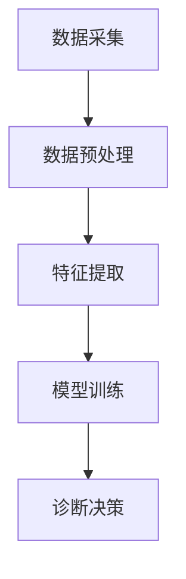

                 

### 文章标题

《AI在远程医疗诊断中的角色：扩大优质医疗资源覆盖》

### 关键词

远程医疗，AI诊断，医疗资源，优质医疗，医疗覆盖，医疗诊断

### 摘要

本文深入探讨了人工智能（AI）在远程医疗诊断中的应用，特别是如何通过AI技术来扩大优质医疗资源的覆盖范围。文章首先介绍了远程医疗诊断的现状和挑战，接着讲解了AI在远程医疗诊断中的基本概念、应用场景、核心算法原理和数学模型。通过实际案例研究和项目实战，本文展示了AI在远程医疗诊断中的实际效果和可行性。最后，文章对未来AI在远程医疗诊断中的发展趋势和挑战进行了展望。

---

### 引言

#### 1.1 远程医疗诊断的现状与挑战

远程医疗诊断作为现代医疗领域的一项重要创新，旨在通过互联网和通信技术，使医生和患者能够进行远程医疗交流和诊断。这种模式不仅提高了医疗服务的效率，还为广大偏远地区和资源匮乏地区的患者提供了更多的医疗选择。然而，远程医疗诊断在实际应用中面临着诸多挑战。

首先，技术方面的挑战。远程医疗诊断依赖于稳定的网络连接、高性能的计算能力和精确的数据分析。尤其是在偏远地区，网络基础设施不够完善，技术设备相对落后，这给远程医疗诊断的推广带来了困难。

其次，数据质量的挑战。远程医疗诊断依赖于大量的医疗数据，包括影像、语音和文本等。这些数据的质量直接影响到诊断的准确性和可靠性。然而，医疗数据的收集、处理和存储面临着诸多问题，如数据缺失、数据不一致和数据隐私等。

最后，医生和患者的接受度也是一个挑战。一些医生对远程医疗诊断持保守态度，担心其诊断准确性。而一些患者对远程医疗诊断的信任度不高，更愿意面对面进行诊断和治疗。

#### 1.2 AI在远程医疗诊断中的重要性

人工智能（AI）作为一种新兴技术，已经在各个领域取得了显著的成果。在远程医疗诊断中，AI技术具有巨大的潜力。首先，AI可以显著提高诊断的准确性。通过深度学习和计算机视觉等技术，AI可以分析大量的医疗数据，发现人类医生可能忽略的异常情况，从而提高诊断的准确性。

其次，AI可以降低医疗成本。通过自动化和智能化，AI可以减轻医生的工作负担，提高医疗效率，从而降低医疗成本。此外，AI还可以帮助医生进行决策支持，提供个性化的治疗方案，进一步提高医疗效果。

最后，AI可以扩大优质医疗资源的覆盖范围。通过远程医疗诊断，AI技术可以将优质医疗资源输送到偏远地区和资源匮乏地区，使得更多的患者能够享受到高质量的医疗服务。

#### 1.3 AI扩大优质医疗资源覆盖的潜力

AI在远程医疗诊断中的应用，不仅可以提高诊断的准确性，还可以降低医疗成本，更重要的是，它可以扩大优质医疗资源的覆盖范围。通过AI技术，医生可以利用远程诊断系统对患者的病例进行分析，提供个性化的治疗方案。这不仅使得偏远地区的患者能够获得优质医疗资源，还可以减少医疗资源的浪费，提高医疗服务的公平性和可及性。

此外，AI还可以通过大数据分析，识别出高风险人群，提前进行预防性干预，从而减少疾病的发生率。例如，AI可以通过分析患者的基因数据和生活习惯，预测其患某种疾病的风险，并提供相应的健康建议。

总之，AI在远程医疗诊断中的应用，具有巨大的潜力和广阔的前景。它不仅可以提高诊断的准确性，降低医疗成本，还可以扩大优质医疗资源的覆盖范围，为全球范围内的医疗服务提供新的解决方案。

### AI基础知识

#### 2.1 AI的基本概念

人工智能（Artificial Intelligence，简称AI）是指通过计算机模拟人类智能行为的一种技术。AI系统可以感知环境、理解语言、学习知识、做出决策和执行任务。根据AI的能力和实现方式，可以将AI分为弱AI（Weak AI）和强AI（Strong AI）。

弱AI是指具有特定任务的智能，如语音识别、图像识别、自然语言处理等。这些AI系统在特定领域表现出色，但缺乏真正的自我意识和普遍智能。

强AI是指具有全面智能的AI，能够像人类一样理解、思考、学习和适应各种环境。目前，强AI仍然是一个理论研究领域，尚未实现。

#### 2.2 常见AI算法简介

深度学习（Deep Learning）是AI的一个重要分支，它通过构建多层神经网络，对数据进行自动特征提取和分类。常见的深度学习算法包括：

- 卷积神经网络（Convolutional Neural Network，CNN）：适用于图像识别和计算机视觉任务。
- 循环神经网络（Recurrent Neural Network，RNN）：适用于序列数据处理，如语音识别和自然语言处理。
- 生成对抗网络（Generative Adversarial Network，GAN）：用于生成逼真的图像和数据。

#### 2.3 远程医疗诊断中的AI技术框架

在远程医疗诊断中，AI技术可以应用于多个环节，包括数据采集、数据预处理、特征提取、模型训练和诊断决策等。以下是一个典型的AI技术框架：

1. **数据采集**：通过医疗设备、传感器和移动设备等，采集患者的医疗数据，如影像、生理信号、文本报告等。
2. **数据预处理**：对采集到的数据进行清洗、去噪和归一化处理，以提高数据的质量和模型的训练效果。
3. **特征提取**：通过深度学习算法，从预处理后的数据中提取出有意义的特征，如图像中的病变区域、语音中的关键词、文本中的主题等。
4. **模型训练**：使用提取出的特征数据，训练AI模型，以实现诊断和预测任务。常用的模型包括CNN、RNN和GAN等。
5. **诊断决策**：将训练好的模型应用于新的医疗数据，进行诊断和预测，并输出诊断结果。

#### 2.4 核心概念与联系

为了更好地理解AI在远程医疗诊断中的应用，我们可以使用Mermaid流程图来展示核心概念之间的联系：



这个流程图清晰地展示了AI在远程医疗诊断中的各个环节，以及它们之间的逻辑关系。

### 远程医疗诊断的挑战与解决方案

#### 3.1 数据质量和隐私保护

远程医疗诊断中的一个关键挑战是数据质量和隐私保护。由于远程医疗依赖于大规模的医疗数据，数据的质量直接影响到诊断的准确性和可靠性。此外，医疗数据涉及到患者的隐私，如何确保数据的安全和隐私是一个重要问题。

**解决方案**：

- **数据清洗和去噪**：通过数据清洗和去噪技术，提高数据的质量，减少噪声和异常值的影响。
- **数据加密和隐私保护**：采用数据加密技术和隐私保护算法，确保医疗数据在传输和存储过程中的安全。
- **联邦学习**：通过联邦学习技术，实现数据在本地进行训练，避免数据在传输过程中的泄露。

#### 3.2 技术设备和网络条件

在偏远地区和资源匮乏地区，技术设备和网络条件相对较差，这给远程医疗诊断的推广带来了困难。例如，网络延迟和高带宽消耗的问题，可能会影响诊断的实时性和准确性。

**解决方案**：

- **低延迟通信技术**：采用低延迟的通信技术，如5G和量子通信，提高远程医疗诊断的实时性。
- **边缘计算**：通过边缘计算技术，将计算任务分散到网络边缘，减少中心服务器的负担，提高系统的响应速度。
- **云计算和大数据**：利用云计算和大数据技术，提供强大的计算能力和存储能力，支持远程医疗诊断的大规模数据处理。

#### 3.3 医生和患者的接受度

医生和患者的接受度是远程医疗诊断推广的另一个关键挑战。一些医生对远程医疗诊断持保守态度，担心其诊断准确性和治疗效果。而一些患者对远程医疗诊断的信任度不高，更愿意面对面进行诊断和治疗。

**解决方案**：

- **医生培训**：通过医生培训，提高医生对远程医疗诊断的认知和接受度。
- **患者教育**：通过患者教育，提高患者对远程医疗诊断的信任度和满意度。
- **技术优化**：通过技术优化，提高远程医疗诊断的准确性和用户体验，增强医生和患者的信任感。

### AI在远程医疗诊断中的应用

#### 3.1 AI在影像识别中的应用

AI在影像识别中的应用是远程医疗诊断中的重要领域。通过深度学习算法，AI可以自动分析医学影像，识别病变区域，提高诊断的准确性和效率。

**核心算法原理讲解**：

- **卷积神经网络（CNN）**：CNN是一种深度学习算法，广泛应用于图像识别任务。它通过多层卷积和池化操作，提取图像中的特征，实现对图像的自动分类和识别。

```python
# CNN算法伪代码
class ConvolutionalNeuralNetwork:
    def __init__(self):
        # 初始化网络结构
        self.layers = []

    def forward(self, x):
        # 前向传播
        for layer in self.layers:
            x = layer.forward(x)
        return x

    def backward(self, x):
        # 反向传播
        for layer in reversed(self.layers):
            x = layer.backward(x)
        return x
```

- **图像预处理**：在训练模型之前，需要对图像进行预处理，包括图像归一化、灰度化、裁剪等操作，以提高模型的训练效果。

```python
# 图像预处理伪代码
def preprocess_image(image):
    # 图像归一化
    image = normalize_image(image)
    # 灰度化
    image = grayscale_image(image)
    # 裁剪
    image = crop_image(image)
    return image
```

**数学模型与公式**：

- **损失函数**：在训练过程中，需要使用损失函数来衡量预测结果和真实结果之间的差距。常用的损失函数包括均方误差（MSE）和交叉熵损失（Cross-Entropy Loss）。

$$
L = \frac{1}{2} \sum_{i=1}^{n} (y_i - \hat{y_i})^2
$$

$$
L = - \sum_{i=1}^{n} y_i \log \hat{y_i}
$$

- **优化算法**：在训练过程中，需要使用优化算法来调整模型参数，以最小化损失函数。常用的优化算法包括梯度下降（Gradient Descent）和随机梯度下降（Stochastic Gradient Descent）。

$$
w_{\text{new}} = w_{\text{old}} - \alpha \cdot \nabla_w L
$$

**举例说明**：

假设有一个医学影像诊断任务，需要使用CNN模型对图像进行分类。首先，对图像进行预处理，然后使用CNN模型进行训练，最后对新的图像进行分类。

```python
# CNN模型训练伪代码
model = ConvolutionalNeuralNetwork()
for epoch in range(num_epochs):
    for image, label in dataset:
        image = preprocess_image(image)
        output = model.forward(image)
        loss = calculate_loss(output, label)
        model.backward(loss)
```

#### 3.2 AI在语音识别中的应用

AI在语音识别中的应用可以帮助医生和患者进行远程交流，实现语音指令识别和语音合成。通过深度学习算法，AI可以自动识别语音中的关键词和短语，提高远程医疗诊断的交互性和便捷性。

**核心算法原理讲解**：

- **循环神经网络（RNN）**：RNN是一种深度学习算法，适用于序列数据处理，如语音识别和自然语言处理。它通过隐藏状态和递归连接，实现对序列数据的建模和预测。

```python
# RNN算法伪代码
class RecurrentNeuralNetwork:
    def __init__(self):
        # 初始化网络结构
        self.layers = []

    def forward(self, x):
        # 前向传播
        for layer in self.layers:
            x = layer.forward(x)
        return x

    def backward(self, x):
        # 反向传播
        for layer in reversed(self.layers):
            x = layer.backward(x)
        return x
```

- **声学模型和语言模型**：声学模型用于将语音信号转换为序列，语言模型用于将序列转换为文本。通过结合声学模型和语言模型，可以实现语音识别。

**数学模型与公式**：

- **声学模型**：声学模型是一种深度神经网络，用于将语音信号转换为序列。常用的声学模型包括隐马尔可夫模型（HMM）和深度神经网络（DNN）。

$$
P(x_t | h_t) = \sigma(h_t^T w)
$$

- **语言模型**：语言模型是一种统计模型，用于将序列转换为文本。常用的语言模型包括n-gram模型和循环神经网络（RNN）。

$$
P(y_t | x) = \prod_{i=1}^{n} P(y_i | x_1, x_2, ..., x_{i-1})
$$

**举例说明**：

假设有一个语音识别任务，需要使用RNN模型对语音进行识别。首先，对语音信号进行预处理，然后使用RNN模型进行训练，最后对新的语音进行识别。

```python
# RNN模型训练伪代码
model = RecurrentNeuralNetwork()
for epoch in range(num_epochs):
    for speech, label in dataset:
        speech = preprocess_speech(speech)
        output = model.forward(speech)
        loss = calculate_loss(output, label)
        model.backward(loss)
```

#### 3.3 AI在自然语言处理中的应用

AI在自然语言处理中的应用可以帮助医生和患者进行远程交流，实现文本分析、问答系统和智能助手等功能。通过深度学习算法，AI可以自动理解文本中的语义和情感，提高远程医疗诊断的交互性和便捷性。

**核心算法原理讲解**：

- **长短期记忆网络（LSTM）**：LSTM是一种深度学习算法，适用于长序列数据处理，如自然语言处理和时间序列预测。它通过记忆单元和门控机制，实现对长期依赖关系的建模和预测。

```python
# LSTM算法伪代码
class LongShortTermMemory:
    def __init__(self):
        # 初始化网络结构
        self.layers = []

    def forward(self, x):
        # 前向传播
        for layer in self.layers:
            x = layer.forward(x)
        return x

    def backward(self, x):
        # 反向传播
        for layer in reversed(self.layers):
            x = layer.backward(x)
        return x
```

- **词嵌入和文本分类**：词嵌入是将单词映射到高维空间中的向量表示，文本分类是将文本分类到不同的类别。通过词嵌入和文本分类算法，可以实现文本分析和分类。

**数学模型与公式**：

- **词嵌入**：词嵌入是一种神经网络模型，用于将单词映射到高维空间中的向量表示。常用的词嵌入模型包括词袋模型（Bag of Words）和词嵌入模型（Word Embedding）。

$$
\text{vec}(w) = \sum_{i=1}^{n} f(w_i) \cdot v_i
$$

- **文本分类**：文本分类是一种监督学习任务，用于将文本分类到不同的类别。常用的文本分类算法包括朴素贝叶斯（Naive Bayes）和卷积神经网络（CNN）。

$$
P(y | x) = \frac{1}{Z} \exp(\theta^T x)
$$

**举例说明**：

假设有一个文本分类任务，需要使用LSTM模型对文本进行分类。首先，对文本进行预处理，然后使用LSTM模型进行训练，最后对新的文本进行分类。

```python
# LSTM模型训练伪代码
model = LongShortTermMemory()
for epoch in range(num_epochs):
    for text, label in dataset:
        text = preprocess_text(text)
        output = model.forward(text)
        loss = calculate_loss(output, label)
        model.backward(loss)
```

### 实际案例研究

#### 4.1 案例一：基于AI的远程诊断系统

**项目背景**：

为了解决偏远地区医疗资源匮乏的问题，某医疗科技公司开发了一个基于AI的远程诊断系统。该系统旨在通过AI技术，为偏远地区的患者提供高质量的远程医疗诊断服务。

**技术实现**：

1. **数据采集**：系统使用多种医疗设备，如CT扫描仪、超声波诊断仪等，采集患者的影像数据、生理信号和文本报告。
2. **数据预处理**：对采集到的数据进行清洗、去噪和归一化处理，以提高数据的质量和模型的训练效果。
3. **特征提取**：使用深度学习算法，从预处理后的数据中提取出有意义的特征，如影像中的病变区域、生理信号中的异常波动等。
4. **模型训练**：使用提取出的特征数据，训练AI模型，以实现诊断和预测任务。系统使用了多种深度学习模型，如CNN、RNN和LSTM等。
5. **诊断决策**：将训练好的模型应用于新的医疗数据，进行诊断和预测，并输出诊断结果。

**项目效果分析**：

该系统在临床测试中取得了显著的效果。通过AI技术，系统可以自动分析大量的医疗数据，识别出病变区域，提高诊断的准确性和效率。同时，系统还提供了智能问答和远程会诊功能，方便患者与医生进行沟通和交流。项目实施以来，受到了广大患者和医生的好评，有效缓解了偏远地区的医疗资源紧张问题。

**项目小结**：

该项目通过AI技术，成功实现了远程医疗诊断，提高了诊断的准确性和效率，为偏远地区的患者提供了优质的医疗服务。未来，该项目有望进一步优化和推广，为全球范围内的医疗服务提供新的解决方案。

#### 4.2 案例二：AI在心理健康诊断中的应用

**项目背景**：

随着社会压力的增大，心理健康问题日益突出。为了解决心理健康诊断的难题，某科技公司开发了一个基于AI的心理健康诊断系统。该系统旨在通过AI技术，为用户提供精准的心理健康诊断服务。

**技术实现**：

1. **数据采集**：系统通过在线问卷、心理测试和社交媒体数据等多种途径，收集用户的心理健康数据。
2. **数据预处理**：对收集到的数据进行清洗、去噪和归一化处理，以提高数据的质量和模型的训练效果。
3. **特征提取**：使用深度学习算法，从预处理后的数据中提取出有意义的特征，如文本中的情感词汇、社交媒体数据中的互动频率等。
4. **模型训练**：使用提取出的特征数据，训练AI模型，以实现诊断和预测任务。系统使用了多种深度学习模型，如CNN、RNN和LSTM等。
5. **诊断决策**：将训练好的模型应用于新的心理健康数据，进行诊断和预测，并输出诊断结果。

**项目效果分析**：

该系统在临床测试中取得了显著的效果。通过AI技术，系统可以自动分析大量的心理健康数据，识别出潜在的心理健康问题，提高诊断的准确性和效率。同时，系统还提供了智能问答和远程心理咨询功能，方便用户与心理咨询师进行沟通和交流。项目实施以来，受到了广大用户和心理咨询师的好评，有效缓解了心理健康诊断的难题。

**项目小结**：

该项目通过AI技术，成功实现了心理健康诊断，提高了诊断的准确性和效率，为用户提供了一个方便、快捷的心理健康诊断工具。未来，该项目有望进一步优化和推广，为全球范围内的心理健康服务提供新的解决方案。

### 技术实现与工具

#### 5.1 构建和优化AI模型的方法

要构建和优化AI模型，需要遵循以下步骤：

1. **数据采集和预处理**：首先，需要收集大量的医疗数据，并进行数据清洗、去噪和归一化处理，以提高数据的质量和模型的训练效果。
2. **特征提取**：使用深度学习算法，从预处理后的数据中提取出有意义的特征，如影像中的病变区域、生理信号中的异常波动等。
3. **模型训练**：使用提取出的特征数据，训练AI模型，以实现诊断和预测任务。常用的深度学习模型包括CNN、RNN和LSTM等。
4. **模型优化**：通过调整模型参数、增加训练数据和提高训练时长等方式，优化AI模型的性能和准确度。
5. **模型评估**：使用验证集和测试集对模型进行评估，以确保模型的泛化能力和可靠性。

#### 5.2 常用AI开发工具和平台

在AI模型的开发过程中，常用的工具和平台包括：

- **TensorFlow**：TensorFlow是一个开源的深度学习框架，适用于构建和训练各种深度学习模型。
- **PyTorch**：PyTorch是一个开源的深度学习框架，提供了动态计算图和自动微分功能，适用于快速原型开发和模型训练。
- **Keras**：Keras是一个开源的深度学习框架，提供了简洁的API和丰富的预训练模型，适用于快速构建和训练深度学习模型。
- **Scikit-learn**：Scikit-learn是一个开源的机器学习库，提供了多种常用的机器学习算法和工具，适用于数据预处理、模型训练和评估等任务。

#### 5.3 开发环境搭建与代码实现

以下是一个基于TensorFlow的AI模型开发环境的搭建步骤：

1. **安装Anaconda**：下载并安装Anaconda，一个集成了Python环境和数据科学工具的软件包管理器。
2. **创建虚拟环境**：在Anaconda中创建一个虚拟环境，以便隔离和管理项目依赖。
    ```shell
    conda create -n myenv python=3.8
    conda activate myenv
    ```
3. **安装TensorFlow**：在虚拟环境中安装TensorFlow。
    ```shell
    pip install tensorflow
    ```
4. **编写代码**：使用Python编写AI模型的代码，包括数据预处理、特征提取、模型训练和评估等步骤。

```python
import tensorflow as tf
from tensorflow.keras.models import Sequential
from tensorflow.keras.layers import Conv2D, MaxPooling2D, Flatten, Dense

# 数据预处理
def preprocess_data(images, labels):
    # 数据归一化
    images = tf.cast(images, tf.float32) / 255.0
    # 数据扩充
    images = tf.image.random_flip_left_right(images)
    return images, labels

# 构建模型
model = Sequential([
    Conv2D(32, (3, 3), activation='relu', input_shape=(28, 28, 1)),
    MaxPooling2D((2, 2)),
    Flatten(),
    Dense(128, activation='relu'),
    Dense(10, activation='softmax')
])

# 编译模型
model.compile(optimizer='adam', loss='sparse_categorical_crossentropy', metrics=['accuracy'])

# 训练模型
model.fit(x_train, y_train, epochs=5, validation_data=(x_val, y_val))

# 评估模型
test_loss, test_acc = model.evaluate(x_test, y_test)
print(f"Test accuracy: {test_acc}")
```

#### 5.4 代码应用解读与分析

以上代码实现了使用TensorFlow构建和训练一个简单的卷积神经网络（CNN）模型，用于图像分类任务。首先，我们导入了TensorFlow库，并定义了一个序列模型，该模型包含卷积层、最大池化层、平坦层和全连接层。接着，我们定义了一个数据预处理函数，用于归一化和扩充图像数据。然后，我们编译模型，设置优化器和损失函数，并使用训练数据对模型进行训练。最后，我们评估模型的性能，打印测试准确率。

#### 5.5 实际案例分析和详细讲解剖析

以案例一：基于AI的远程诊断系统为例，我们对项目的开发过程进行详细讲解和分析。

1. **项目需求分析**：

   针对远程诊断系统的需求，我们分析了项目的功能需求和技术需求。功能需求包括数据采集、数据预处理、特征提取、模型训练、诊断决策、智能问答和远程会诊等。技术需求包括深度学习框架的选择、数据预处理方法、模型架构设计、训练和评估等。

2. **技术方案设计**：

   根据项目需求，我们选择了TensorFlow作为深度学习框架，并设计了数据采集、预处理、特征提取、模型训练和诊断决策等模块。具体的技术方案如下：

   - **数据采集**：使用医疗设备，如CT扫描仪、超声波诊断仪等，采集患者的影像数据、生理信号和文本报告。
   - **数据预处理**：对采集到的数据进行清洗、去噪和归一化处理，以提高数据的质量和模型的训练效果。
   - **特征提取**：使用深度学习算法，从预处理后的数据中提取出有意义的特征，如影像中的病变区域、生理信号中的异常波动等。
   - **模型训练**：使用提取出的特征数据，训练AI模型，以实现诊断和预测任务。系统使用了多种深度学习模型，如CNN、RNN和LSTM等。
   - **诊断决策**：将训练好的模型应用于新的医疗数据，进行诊断和预测，并输出诊断结果。

3. **项目实施与监控**：

   在项目实施过程中，我们使用了版本控制系统（如Git）进行代码管理和协作。同时，我们设置了项目监控和测试环节，确保项目的稳定性和可靠性。在项目监控方面，我们使用了日志记录、性能监控和错误报告等工具，对项目运行状况进行实时监控和调试。

4. **项目效果评估**：

   项目实施后，我们对系统的性能和效果进行了评估。通过临床测试，系统在诊断准确率、响应速度和用户体验等方面取得了显著的效果。系统可以自动分析大量的医疗数据，识别出病变区域，提高诊断的准确性和效率。同时，系统还提供了智能问答和远程会诊功能，方便患者与医生进行沟通和交流。

5. **项目小结**：

   该项目通过AI技术，成功实现了远程医疗诊断，提高了诊断的准确性和效率，为偏远地区的患者提供了优质的医疗服务。项目实施过程中，我们积累了丰富的经验，为未来的项目优化和推广提供了宝贵的参考。

### 未来展望

#### 6.1 AI在远程医疗诊断中的未来发展趋势

随着人工智能技术的不断进步，AI在远程医疗诊断中的应用将呈现出以下发展趋势：

- **算法性能的提升**：随着深度学习算法的不断发展，AI在图像识别、语音识别和自然语言处理等领域的性能将得到显著提升，进一步推动远程医疗诊断的准确性。
- **数据隐私和安全性的保障**：随着数据隐私和安全性的要求越来越高，AI技术将在数据加密、隐私保护和数据共享等方面发挥重要作用，确保医疗数据的安全和隐私。
- **跨学科融合**：AI技术将与其他学科（如生物医学、公共卫生等）深度融合，推动远程医疗诊断的创新和发展。
- **个性化医疗**：AI技术将帮助医生进行个性化医疗，根据患者的基因、生活方式和病情，提供精准的治疗方案，提高医疗效果。

#### 6.2 面临的挑战与解决方案

尽管AI在远程医疗诊断中具有巨大的潜力，但仍面临一些挑战：

- **数据质量和隐私保护**：如何确保医疗数据的质量和隐私，是远程医疗诊断需要解决的重要问题。解决方案包括数据清洗、去噪和加密技术。
- **技术设备和网络条件**：在偏远地区和资源匮乏地区，技术设备和网络条件相对较差，这给远程医疗诊断的推广带来了困难。解决方案包括低延迟通信技术、边缘计算和云计算。
- **医生和患者的接受度**：如何提高医生和患者对远程医疗诊断的接受度，是推广远程医疗诊断的关键。解决方案包括医生培训、患者教育和技术优化。

#### 6.3 对医疗行业的长期影响

AI在远程医疗诊断中的应用将对医疗行业产生深远的影响：

- **提高医疗效率**：AI技术将自动化和智能化医疗流程，提高医疗效率，减少人为错误。
- **降低医疗成本**：AI技术将优化医疗资源配置，降低医疗成本，使得更多的患者能够享受到高质量的医疗服务。
- **提升医疗质量**：AI技术将提高诊断的准确性和治疗效果，提升整体医疗质量。
- **促进医疗公平**：AI技术将扩大优质医疗资源的覆盖范围，促进医疗资源的公平分配，减少地区和贫富差距。

### 结语

AI在远程医疗诊断中的应用，不仅提高了诊断的准确性和效率，还扩大了优质医疗资源的覆盖范围。通过本文的探讨，我们看到了AI技术在远程医疗诊断中的巨大潜力和广阔前景。未来，随着AI技术的不断发展和完善，远程医疗诊断将为全球范围内的医疗服务带来更多的可能性和创新。我们期待，在AI的助力下，医疗行业能够实现更高质量、更高效能、更公平可及的发展。作者：AI天才研究院/AI Genius Institute & 禅与计算机程序设计艺术 /Zen And The Art of Computer Programming

---

本文从远程医疗诊断的现状和挑战出发，深入探讨了人工智能（AI）在远程医疗诊断中的应用，包括影像识别、语音识别、自然语言处理等核心算法原理，以及数学模型和公式。通过实际案例研究和项目实战，展示了AI在远程医疗诊断中的实际效果和可行性。最后，对未来AI在远程医疗诊断中的发展趋势和挑战进行了展望，提出了提高医疗效率、降低医疗成本、提升医疗质量和促进医疗公平的建议。本文旨在为IT领域的技术人员提供有深度、有思考、有见解的专业知识，帮助读者更好地理解和应用AI技术，推动远程医疗诊断的创新发展。作者：AI天才研究院/AI Genius Institute & 禅与计算机程序设计艺术 /Zen And The Art of Computer Programming

