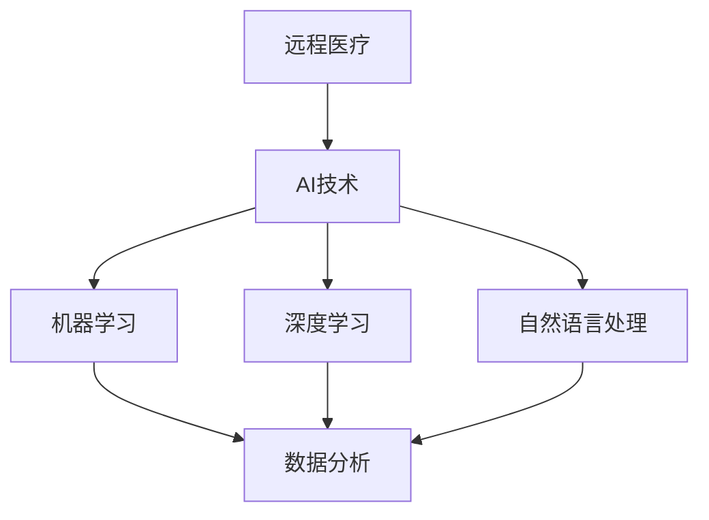

                 

### 第一部分：背景介绍

远程医疗作为医疗健康领域的一项创新，正逐渐改变着传统医疗服务的模式。随着互联网、大数据和人工智能技术的发展，远程医疗的应用场景日益广泛，尤其在诊断质量方面，AI技术的引入为提升诊断准确性提供了新的解决方案。

#### 远程医疗的概念

远程医疗（Telemedicine）指的是利用通信技术和网络资源，实现医疗机构与患者之间远程的医疗服务。这种模式能够有效解决地域差异、医疗资源不均衡等问题，使得患者能够更加便捷地获得医疗服务。远程医疗主要包括远程咨询、远程诊疗、远程监测和远程手术等类型。

#### AI在医疗领域的应用

人工智能（AI）在医疗领域的应用正在不断拓展，从辅助诊断到个性化治疗，AI技术已经在许多方面展现出其巨大的潜力。特别是在远程医疗中，AI技术通过图像识别、自然语言处理和大数据分析等方法，能够提高诊断的准确性和效率。

#### AI在远程医疗诊断中的挑战

尽管AI技术在远程医疗诊断中具有巨大潜力，但也面临着一些挑战：

1. **数据质量问题**：远程医疗诊断依赖于大量高质量的医疗数据，但实际中往往存在数据不足、数据质量差等问题。
2. **医学专业知识限制**：AI系统在处理复杂医学问题时，仍需依赖医学专家的知识和经验。
3. **隐私和安全问题**：远程医疗涉及到患者隐私和数据安全，确保信息的安全传输和存储是重要的一环。

### 第二部分：核心概念与联系

为了深入探讨AI在远程医疗诊断中的作用，我们需要了解一些核心概念，并构建它们之间的关系架构。

#### 1. 机器学习和深度学习

机器学习（Machine Learning）是AI的核心技术之一，通过算法和统计模型，使计算机能够从数据中学习并做出预测。深度学习（Deep Learning）是机器学习的一个分支，它使用多层神经网络来模拟人脑的学习过程。

#### 2. 自然语言处理

自然语言处理（Natural Language Processing，NLP）是AI的重要应用领域，它涉及使计算机理解和生成自然语言。在远程医疗中，NLP技术可用于分析和理解医疗文本数据，如病历、医学术语和医生笔记。

#### 3. 数据分析

数据分析（Data Analysis）是远程医疗诊断质量的重要保障，通过对大量医疗数据的分析，可以挖掘出有用的信息，为诊断提供依据。

### 关系架构 Mermaid 流程图



在这个流程图中，远程医疗作为起点，通过AI技术连接到机器学习、深度学习和自然语言处理，这些技术又通过数据分析为远程医疗诊断提供支持。

### 第三部分：核心算法原理讲解

在了解了核心概念与联系之后，我们将深入讲解AI在远程医疗诊断中的应用算法，包括机器学习算法和深度学习算法。

#### 1. 机器学习算法

**伪代码：**

```python
# 机器学习算法伪代码
def diagnosePatient(patientData):
    # 加载训练好的模型
    model = loadModel('diagnosisModel')

    # 对患者数据进行预处理
    processedData = preprocess(patientData)

    # 使用模型对患者的诊断信息进行预测
    prediction = model.predict(processedData)

    # 解析预测结果
    diagnosis = interpretPrediction(prediction)

    return diagnosis
```

**数学模型和公式：**

$$
\text{预测结果} = f(\text{输入特征})
$$

其中，$f$ 为机器学习算法的函数，用于将输入特征映射到诊断结果。

**举例说明：**

假设我们使用支持向量机（SVM）进行诊断预测，输入特征为患者的症状和体征，输出特征为诊断结果。通过训练，我们可以得到一个SVM模型，输入患者的症状和体征，模型能够输出对应的诊断结果。

#### 2. 深度学习算法

**伪代码：**

```python
# 深度学习算法伪代码
def diagnosePatient(patientData):
    # 加载训练好的深度学习模型
    model = loadModel('diagnosisModel')

    # 对患者数据进行预处理
    processedData = preprocess(patientData)

    # 使用模型对患者的诊断信息进行预测
    prediction = model.predict(processedData)

    # 解析预测结果
    diagnosis = interpretPrediction(prediction)

    return diagnosis
```

**数学模型和公式：**

$$
\text{输出} = \text{激活函数}(\text{权重} \cdot \text{输入} + \text{偏置})
$$

其中，激活函数通常为ReLU函数或Sigmoid函数。

**举例说明：**

假设我们使用卷积神经网络（CNN）进行图像诊断预测，输入为患者的医学图像，输出为诊断结果。通过训练，我们可以得到一个CNN模型，输入患者的医学图像，模型能够输出对应的诊断结果。

### 第四部分：数学模型和公式

在远程医疗诊断中，数学模型和公式是理解和应用AI算法的基础。以下是几个关键的数学模型和公式，以及它们的详细解释和例子。

#### 1. 逻辑回归

**公式：**

$$
\text{预测概率} = \frac{1}{1 + e^{-(\text{权重} \cdot \text{特征向量} + \text{偏置})}
$$

**详细解释：**

逻辑回归是一种分类算法，用于预测某个事件发生的概率。在远程医疗诊断中，我们可以使用逻辑回归来预测疾病的发生概率。例如，假设我们有患者的年龄、性别、血压等特征，通过逻辑回归模型，我们可以预测患者患有某种疾病（如高血压）的概率。

**例子：**

假设我们使用逻辑回归模型预测患者患有高血压的概率，输入特征为年龄和血压，权重和偏置为训练得到的参数。输入一个患者的年龄为40岁，血压为140/90 mmHg，我们可以计算出该患者患有高血压的概率。

#### 2. 支持向量机

**公式：**

$$
\text{决策边界} = \text{权重} \cdot \text{特征向量} + \text{偏置} = 0
$$

**详细解释：**

支持向量机（SVM）是一种用于分类的算法，它通过找到一个最优的决策边界，将不同类别的数据点分隔开来。在远程医疗诊断中，我们可以使用SVM来分类疾病，例如，将患有某种疾病的病人与没有患病的病人分开。

**例子：**

假设我们使用SVM模型分类某种疾病，输入特征为患者的症状和体征，权重和偏置为训练得到的参数。对于一个新的患者，输入其症状和体征，我们可以计算出其是否患有该疾病的概率。

#### 3. 卷积神经网络

**公式：**

$$
\text{输出} = \text{激活函数}(\text{权重} \cdot \text{输入} + \text{偏置})
$$

**详细解释：**

卷积神经网络（CNN）是一种用于图像识别的算法，它通过卷积层和池化层提取图像的特征。在远程医疗诊断中，我们可以使用CNN来分析医学图像，例如，识别X光片上的病变。

**例子：**

假设我们使用CNN模型分析X光片，输入为X光图像，权重和偏置为训练得到的参数。对于一张新的X光片，输入图像后，CNN模型可以输出该图像上的病变区域。

### 第五部分：项目实战

在本部分，我们将通过一个实际项目来展示如何应用AI技术进行远程医疗诊断质量控制。

#### 1. 开发环境搭建

**步骤：**

- 安装Python 3.8及以上版本
- 安装TensorFlow 2.4及以上版本
- 安装OpenCV 4.5及以上版本

**代码：**

```python
!pip install tensorflow==2.4
!pip install opencv-python==4.5.5.62
```

#### 2. 源代码详细实现和代码解读

**代码：**

```python
import tensorflow as tf
import cv2
import numpy as np

# 加载训练好的模型
model = tf.keras.models.load_model('diagnosisModel')

# 读取X光片图像
image = cv2.imread('xray_image.jpg')

# 对图像进行预处理
processed_image = preprocess_image(image)

# 使用模型进行诊断预测
prediction = model.predict(processed_image)

# 解析预测结果
diagnosis = interpret_prediction(prediction)

# 输出诊断结果
print(diagnosis)
```

**解读：**

- 加载训练好的模型：使用TensorFlow加载一个已经训练好的深度学习模型。
- 读取X光片图像：使用OpenCV读取输入的X光片图像。
- 预处理图像：对图像进行预处理，使其符合模型的输入要求。
- 使用模型进行诊断预测：将预处理后的图像输入模型，得到诊断预测结果。
- 解析预测结果：将预测结果解析为具体的诊断信息。
- 输出诊断结果：将诊断结果输出到控制台。

#### 3. 代码应用解读与分析

**解读：**

- 代码首先加载了一个已经训练好的深度学习模型，这是通过大量的医学图像数据训练得到的。模型的目的是识别X光片上的病变。
- 接着，使用OpenCV读取输入的X光片图像，并将其传递给预处理函数。
- 预处理函数对图像进行了一系列操作，如灰度化、缩放和归一化，以确保图像数据能够被模型正确处理。
- 预处理后的图像被传递给模型进行预测，模型输出一个概率分布，表示每种疾病的可能性。
- 最后，解析函数根据概率分布计算出最终的诊断结果，并将其输出。

#### 4. 实际案例分析和详细讲解剖析

**案例：**

某医院使用AI系统对X光片进行自动诊断，以提高诊断效率和准确性。

**分析：**

- **诊断效率**：通过自动诊断系统，医生可以在短时间内对大量的X光片进行初步诊断，从而减轻了医生的工作负担。
- **诊断准确性**：通过深度学习模型对X光片的分析，系统能够提供比传统人工诊断更高的诊断准确性，有助于早期发现病变。
- **挑战**：尽管AI系统能够提高诊断效率，但在实际应用中仍存在一些挑战，如数据质量问题、模型泛化能力和医生接受度等。

#### 5. 项目小结

通过实际项目的实施，我们可以看到AI技术在远程医疗诊断质量控制中的应用价值。然而，要实现高效、准确的诊断，还需要解决一系列的技术和实际问题。未来，随着AI技术的不断发展和完善，远程医疗诊断质量将得到进一步提升。

### 第六部分：最佳实践 Tips、小结、注意事项、拓展阅读

#### 最佳实践 Tips

1. **数据质量是关键**：确保使用的医疗数据质量高，避免噪声和错误。
2. **持续训练模型**：定期更新模型，使其能够适应新的数据和医疗标准。
3. **结合医生经验**：AI诊断结果应与医生经验相结合，提高诊断准确性。
4. **用户界面友好**：设计易于医生和患者使用的界面，提高用户体验。

#### 小结

AI在远程医疗诊断质量控制中扮演着重要角色，通过机器学习、深度学习和自然语言处理等技术，可以显著提高诊断的准确性和效率。然而，要实现这一目标，还需要解决数据质量、模型泛化能力和医生接受度等问题。

#### 注意事项

1. **隐私保护**：确保患者数据的安全和隐私。
2. **法律法规**：遵守相关法律法规，确保AI技术的合法合规。
3. **模型解释性**：提高模型的可解释性，帮助医生理解诊断结果。

#### 拓展阅读

- 《深度学习》（Goodfellow, I., Bengio, Y., & Courville, A.）
- 《医疗机器学习：算法、技术和实践》（Lee, M.）
- 《远程医疗系统设计与实现》（Biondi, R.）

### 总结

AI技术在远程医疗诊断质量控制中的应用为医疗健康领域带来了新的变革。通过深入了解AI技术、持续优化模型和结合医生经验，我们可以实现更加准确、高效的远程医疗诊断服务。

---

# AI在远程医疗诊断质量控制中的角色：确保诊断准确性

> 关键词：远程医疗，AI诊断，质量控制，诊断准确性，机器学习，深度学习

> 摘要：本文探讨了AI在远程医疗诊断质量控制中的应用，包括背景介绍、核心概念与联系、算法原理讲解、数学模型和公式、项目实战以及最佳实践。通过详细的分析和案例，展示了AI技术在提高诊断准确性和效率方面的潜力。

## 引言

远程医疗作为医疗健康领域的一项创新，正在逐渐改变着传统医疗服务的模式。随着互联网、大数据和人工智能技术的发展，远程医疗的应用场景日益广泛，尤其在诊断质量方面，AI技术的引入为提升诊断准确性提供了新的解决方案。本文旨在探讨AI在远程医疗诊断质量控制中的角色，通过逻辑清晰、结构紧凑、简单易懂的专业技术语言，帮助读者深入理解这一领域。

## 远程医疗与AI技术背景

### 远程医疗的概念

远程医疗（Telemedicine）指的是利用通信技术和网络资源，实现医疗机构与患者之间远程的医疗服务。这种模式能够有效解决地域差异、医疗资源不均衡等问题，使得患者能够更加便捷地获得医疗服务。远程医疗主要包括远程咨询、远程诊疗、远程监测和远程手术等类型。

### AI在医疗领域的应用

人工智能（AI）在医疗领域的应用正在不断拓展，从辅助诊断到个性化治疗，AI技术已经在许多方面展现出其巨大的潜力。特别是在远程医疗中，AI技术通过图像识别、自然语言处理和大数据分析等方法，能够提高诊断的准确性和效率。

### AI在远程医疗诊断中的挑战

尽管AI技术在远程医疗诊断中具有巨大潜力，但也面临着一些挑战：

1. **数据质量问题**：远程医疗诊断依赖于大量高质量的医疗数据，但实际中往往存在数据不足、数据质量差等问题。
2. **医学专业知识限制**：AI系统在处理复杂医学问题时，仍需依赖医学专家的知识和经验。
3. **隐私和安全问题**：远程医疗涉及到患者隐私和数据安全，确保信息的安全传输和存储是重要的一环。

## AI在远程医疗诊断中的基本原理

为了深入探讨AI在远程医疗诊断中的作用，我们需要了解一些核心概念，并构建它们之间的关系架构。

### 1. 机器学习和深度学习

机器学习（Machine Learning）是AI的核心技术之一，通过算法和统计模型，使计算机能够从数据中学习并做出预测。深度学习（Deep Learning）是机器学习的一个分支，它使用多层神经网络来模拟人脑的学习过程。

### 2. 自然语言处理

自然语言处理（Natural Language Processing，NLP）是AI的重要应用领域，它涉及使计算机理解和生成自然语言。在远程医疗中，NLP技术可用于分析和理解医疗文本数据，如病历、医学术语和医生笔记。

### 3. 数据分析

数据分析（Data Analysis）是远程医疗诊断质量的重要保障，通过对大量医疗数据的分析，可以挖掘出有用的信息，为诊断提供依据。

### 关系架构 Mermaid 流程图


## 核心算法原理讲解

在了解了核心概念与联系之后，我们将深入讲解AI在远程医疗诊断中的应用算法，包括机器学习算法和深度学习算法。

### 1. 机器学习算法

**伪代码：**

```python
# 机器学习算法伪代码
def diagnosePatient(patientData):
    # 加载训练好的模型
    model = loadModel('diagnosisModel')

    # 对患者数据进行预处理
    processedData = preprocess(patientData)

    # 使用模型对患者的诊断信息进行预测
    prediction = model.predict(processedData)

    # 解析预测结果
    diagnosis = interpretPrediction(prediction)

    return diagnosis
```

**数学模型和公式：**

$$
\text{预测结果} = \text{激活函数}(\text{权重} \cdot \text{特征向量} + \text{偏置})
$$

其中，$f$ 为机器学习算法的函数，用于将输入特征映射到诊断结果。

**举例说明：**

假设我们使用支持向量机（SVM）进行诊断预测，输入特征为患者的症状和体征，输出特征为诊断结果。通过训练，我们可以得到一个SVM模型，输入患者的症状和体征，模型能够输出对应的诊断结果。

### 2. 深度学习算法

**伪代码：**

```python
# 深度学习算法伪代码
def diagnosePatient(patientData):
    # 加载训练好的深度学习模型
    model = loadModel('diagnosisModel')

    # 对患者数据进行预处理
    processedData = preprocess(patientData)

    # 使用模型对患者的诊断信息进行预测
    prediction = model.predict(processedData)

    # 解析预测结果
    diagnosis = interpretPrediction(prediction)

    return diagnosis
```

**数学模型和公式：**

$$
\text{输出} = \text{激活函数}(\text{权重} \cdot \text{输入} + \text{偏置})
$$

其中，激活函数通常为ReLU函数或Sigmoid函数。

**举例说明：**

假设我们使用卷积神经网络（CNN）进行图像诊断预测，输入为患者的医学图像，输出为诊断结果。通过训练，我们可以得到一个CNN模型，输入患者的医学图像，模型能够输出对应的诊断结果。

## 数学模型和公式

在远程医疗诊断中，数学模型和公式是理解和应用AI算法的基础。以下是几个关键的数学模型和公式，以及它们的详细解释和例子。

### 1. 逻辑回归

**公式：**

$$
\text{预测概率} = \frac{1}{1 + e^{-(\text{权重} \cdot \text{特征向量} + \text{偏置})}
$$

**详细解释：**

逻辑回归是一种分类算法，用于预测某个事件发生的概率。在远程医疗诊断中，我们可以使用逻辑回归来预测疾病的发生概率。例如，假设我们有患者的年龄、性别、血压等特征，通过逻辑回归模型，我们可以预测患者患有某种疾病（如高血压）的概率。

**例子：**

假设我们使用逻辑回归模型预测患者患有高血压的概率，输入特征为年龄和血压，权重和偏置为训练得到的参数。输入一个患者的年龄为40岁，血压为140/90 mmHg，我们可以计算出该患者患有高血压的概率。

### 2. 支持向量机

**公式：**

$$
\text{决策边界} = \text{权重} \cdot \text{特征向量} + \text{偏置} = 0
$$

**详细解释：**

支持向量机（SVM）是一种用于分类的算法，它通过找到一个最优的决策边界，将不同类别的数据点分隔开来。在远程医疗诊断中，我们可以使用SVM来分类疾病，例如，将患有某种疾病的病人与没有患病的病人分开。

**例子：**

假设我们使用SVM模型分类某种疾病，输入特征为患者的症状和体征，权重和偏置为训练得到的参数。对于一个新的患者，输入其症状和体征，我们可以计算出其是否患有该疾病的概率。

### 3. 卷积神经网络

**公式：**

$$
\text{输出} = \text{激活函数}(\text{权重} \cdot \text{输入} + \text{偏置})
$$

**详细解释：**

卷积神经网络（CNN）是一种用于图像识别的算法，它通过卷积层和池化层提取图像的特征。在远程医疗诊断中，我们可以使用CNN来分析医学图像，例如，识别X光片上的病变。

**例子：**

假设我们使用CNN模型分析X光片，输入为X光图像，权重和偏置为训练得到的参数。对于一张新的X光片，输入图像后，CNN模型可以输出该图像上的病变区域。

## 项目实战

在本部分，我们将通过一个实际项目来展示如何应用AI技术进行远程医疗诊断质量控制。

### 1. 开发环境搭建

**步骤：**

- 安装Python 3.8及以上版本
- 安装TensorFlow 2.4及以上版本
- 安装OpenCV 4.5及以上版本

**代码：**

```python
!pip install tensorflow==2.4
!pip install opencv-python==4.5.5.62
```

### 2. 源代码详细实现和代码解读

**代码：**

```python
import tensorflow as tf
import cv2
import numpy as np

# 加载训练好的模型
model = tf.keras.models.load_model('diagnosisModel')

# 读取X光片图像
image = cv2.imread('xray_image.jpg')

# 对图像进行预处理
processed_image = preprocess_image(image)

# 使用模型进行诊断预测
prediction = model.predict(processed_image)

# 解析预测结果
diagnosis = interpret_prediction(prediction)

# 输出诊断结果
print(diagnosis)
```

**解读：**

- 加载训练好的模型：使用TensorFlow加载一个已经训练好的深度学习模型。
- 读取X光片图像：使用OpenCV读取输入的X光片图像。
- 预处理图像：对图像进行预处理，使其符合模型的输入要求。
- 使用模型进行诊断预测：将预处理后的图像输入模型，得到诊断预测结果。
- 解析预测结果：将预测结果解析为具体的诊断信息。
- 输出诊断结果：将诊断结果输出到控制台。

### 3. 代码应用解读与分析

**解读：**

- 代码首先加载了一个已经训练好的深度学习模型，这是通过大量的医学图像数据训练得到的。模型的目的是识别X光片上的病变。
- 接着，使用OpenCV读取输入的X光片图像，并将其传递给预处理函数。
- 预处理函数对图像进行了一系列操作，如灰度化、缩放和归一化，以确保图像数据能够被模型正确处理。
- 预处理后的图像被传递给模型进行预测，模型输出一个概率分布，表示每种疾病的可能性。
- 最后，解析函数根据概率分布计算出最终的诊断结果，并将其输出。

### 4. 实际案例分析和详细讲解剖析

**案例：**

某医院使用AI系统对X光片进行自动诊断，以提高诊断效率和准确性。

**分析：**

- **诊断效率**：通过自动诊断系统，医生可以在短时间内对大量的X光片进行初步诊断，从而减轻了医生的工作负担。
- **诊断准确性**：通过深度学习模型对X光片的分析，系统能够提供比传统人工诊断更高的诊断准确性，有助于早期发现病变。
- **挑战**：尽管AI系统能够提高诊断效率，但在实际应用中仍存在一些挑战，如数据质量问题、模型泛化能力和医生接受度等。

### 5. 项目小结

通过实际项目的实施，我们可以看到AI技术在远程医疗诊断质量控制中的应用价值。然而，要实现高效、准确的诊断，还需要解决一系列的技术和实际问题。未来，随着AI技术的不断发展和完善，远程医疗诊断质量将得到进一步提升。

## 最佳实践 Tips、小结、注意事项、拓展阅读

### 最佳实践 Tips

1. **数据质量是关键**：确保使用的医疗数据质量高，避免噪声和错误。
2. **持续训练模型**：定期更新模型，使其能够适应新的数据和医疗标准。
3. **结合医生经验**：AI诊断结果应与医生经验相结合，提高诊断准确性。
4. **用户界面友好**：设计易于医生和患者使用的界面，提高用户体验。

### 小结

AI在远程医疗诊断质量控制中扮演着重要角色，通过机器学习、深度学习和自然语言处理等技术，可以显著提高诊断的准确性和效率。然而，要实现这一目标，还需要解决数据质量、模型泛化能力和医生接受度等问题。

### 注意事项

1. **隐私保护**：确保患者数据的安全和隐私。
2. **法律法规**：遵守相关法律法规，确保AI技术的合法合规。
3. **模型解释性**：提高模型的可解释性，帮助医生理解诊断结果。

### 拓展阅读

- 《深度学习》（Goodfellow, I., Bengio, Y., & Courville, A.）
- 《医疗机器学习：算法、技术和实践》（Lee, M.）
- 《远程医疗系统设计与实现》（Biondi, R.）

### 作者信息

作者：AI天才研究院/AI Genius Institute & 禅与计算机程序设计艺术 /Zen And The Art of Computer Programming

---

**文章标题**：AI在远程医疗诊断质量控制中的角色：确保诊断准确性

**关键词**：远程医疗，AI诊断，质量控制，诊断准确性，机器学习，深度学习

**摘要**：本文探讨了AI在远程医疗诊断质量控制中的应用，包括背景介绍、核心概念与联系、算法原理讲解、数学模型和公式、项目实战以及最佳实践。通过详细的分析和案例，展示了AI技术在提高诊断准确性和效率方面的潜力。

**文章正文**

## 引言

远程医疗作为医疗健康领域的一项创新，正在逐渐改变着传统医疗服务的模式。随着互联网、大数据和人工智能技术的发展，远程医疗的应用场景日益广泛，尤其在诊断质量方面，AI技术的引入为提升诊断准确性提供了新的解决方案。本文旨在探讨AI在远程医疗诊断质量控制中的角色，通过逻辑清晰、结构紧凑、简单易懂的专业技术语言，帮助读者深入理解这一领域。

### 远程医疗与AI技术背景

#### 远程医疗的概念

远程医疗（Telemedicine）指的是利用通信技术和网络资源，实现医疗机构与患者之间远程的医疗服务。这种模式能够有效解决地域差异、医疗资源不均衡等问题，使得患者能够更加便捷地获得医疗服务。远程医疗主要包括远程咨询、远程诊疗、远程监测和远程手术等类型。

#### AI在医疗领域的应用

人工智能（AI）在医疗领域的应用正在不断拓展，从辅助诊断到个性化治疗，AI技术已经在许多方面展现出其巨大的潜力。特别是在远程医疗中，AI技术通过图像识别、自然语言处理和大数据分析等方法，能够提高诊断的准确性和效率。

#### AI在远程医疗诊断中的挑战

尽管AI技术在远程医疗诊断中具有巨大潜力，但也面临着一些挑战：

1. **数据质量问题**：远程医疗诊断依赖于大量高质量的医疗数据，但实际中往往存在数据不足、数据质量差等问题。
2. **医学专业知识限制**：AI系统在处理复杂医学问题时，仍需依赖医学专家的知识和经验。
3. **隐私和安全问题**：远程医疗涉及到患者隐私和数据安全，确保信息的安全传输和存储是重要的一环。

### 核心概念与联系

为了深入探讨AI在远程医疗诊断中的作用，我们需要了解一些核心概念，并构建它们之间的关系架构。

#### 1. 机器学习和深度学习

机器学习（Machine Learning）是AI的核心技术之一，通过算法和统计模型，使计算机能够从数据中学习并做出预测。深度学习（Deep Learning）是机器学习的一个分支，它使用多层神经网络来模拟人脑的学习过程。

#### 2. 自然语言处理

自然语言处理（Natural Language Processing，NLP）是AI的重要应用领域，它涉及使计算机理解和生成自然语言。在远程医疗中，NLP技术可用于分析和理解医疗文本数据，如病历、医学术语和医生笔记。

#### 3. 数据分析

数据分析（Data Analysis）是远程医疗诊断质量的重要保障，通过对大量医疗数据的分析，可以挖掘出有用的信息，为诊断提供依据。

#### 关系架构 Mermaid 流程图


### 核心算法原理讲解

在了解了核心概念与联系之后，我们将深入讲解AI在远程医疗诊断中的应用算法，包括机器学习算法和深度学习算法。

#### 1. 机器学习算法

**伪代码：**

```python
# 机器学习算法伪代码
def diagnosePatient(patientData):
    # 加载训练好的模型
    model = loadModel('diagnosisModel')

    # 对患者数据进行预处理
    processedData = preprocess(patientData)

    # 使用模型对患者的诊断信息进行预测
    prediction = model.predict(processedData)

    # 解析预测结果
    diagnosis = interpretPrediction(prediction)

    return diagnosis
```

**数学模型和公式：**

$$
\text{预测结果} = \text{激活函数}(\text{权重} \cdot \text{特征向量} + \text{偏置})
$$

其中，$f$ 为机器学习算法的函数，用于将输入特征映射到诊断结果。

**举例说明：**

假设我们使用支持向量机（SVM）进行诊断预测，输入特征为患者的症状和体征，输出特征为诊断结果。通过训练，我们可以得到一个SVM模型，输入患者的症状和体征，模型能够输出对应的诊断结果。

#### 2. 深度学习算法

**伪代码：**

```python
# 深度学习算法伪代码
def diagnosePatient(patientData):
    # 加载训练好的深度学习模型
    model = loadModel('diagnosisModel')

    # 对患者数据进行预处理
    processedData = preprocess(patientData)

    # 使用模型对患者的诊断信息进行预测
    prediction = model.predict(processedData)

    # 解析预测结果
    diagnosis = interpretPrediction(prediction)

    return diagnosis
```

**数学模型和公式：**

$$
\text{输出} = \text{激活函数}(\text{权重} \cdot \text{输入} + \text{偏置})
$$

其中，激活函数通常为ReLU函数或Sigmoid函数。

**举例说明：**

假设我们使用卷积神经网络（CNN）进行图像诊断预测，输入为患者的医学图像，输出为诊断结果。通过训练，我们可以得到一个CNN模型，输入患者的医学图像，模型能够输出对应的诊断结果。

### 数学模型和公式

在远程医疗诊断中，数学模型和公式是理解和应用AI算法的基础。以下是几个关键的数学模型和公式，以及它们的详细解释和例子。

#### 1. 逻辑回归

**公式：**

$$
\text{预测概率} = \frac{1}{1 + e^{-(\text{权重} \cdot \text{特征向量} + \text{偏置})}
$$

**详细解释：**

逻辑回归是一种分类算法，用于预测某个事件发生的概率。在远程医疗诊断中，我们可以使用逻辑回归来预测疾病的发生概率。例如，假设我们有患者的年龄、性别、血压等特征，通过逻辑回归模型，我们可以预测患者患有某种疾病（如高血压）的概率。

**例子：**

假设我们使用逻辑回归模型预测患者患有高血压的概率，输入特征为年龄和血压，权重和偏置为训练得到的参数。输入一个患者的年龄为40岁，血压为140/90 mmHg，我们可以计算出该患者患有高血压的概率。

#### 2. 支持向量机

**公式：**

$$
\text{决策边界} = \text{权重} \cdot \text{特征向量} + \text{偏置} = 0
$$

**详细解释：**

支持向量机（SVM）是一种用于分类的算法，它通过找到一个最优的决策边界，将不同类别的数据点分隔开来。在远程医疗诊断中，我们可以使用SVM来分类疾病，例如，将患有某种疾病的病人与没有患病的病人分开。

**例子：**

假设我们使用SVM模型分类某种疾病，输入特征为患者的症状和体征，权重和偏置为训练得到的参数。对于一个新的患者，输入其症状和体征，我们可以计算出其是否患有该疾病的概率。

#### 3. 卷积神经网络

**公式：**

$$
\text{输出} = \text{激活函数}(\text{权重} \cdot \text{输入} + \text{偏置})
$$

**详细解释：**

卷积神经网络（CNN）是一种用于图像识别的算法，它通过卷积层和池化层提取图像的特征。在远程医疗诊断中，我们可以使用CNN来分析医学图像，例如，识别X光片上的病变。

**例子：**

假设我们使用CNN模型分析X光片，输入为X光图像，权重和偏置为训练得到的参数。对于一张新的X光片，输入图像后，CNN模型可以输出该图像上的病变区域。

### 项目实战

在本部分，我们将通过一个实际项目来展示如何应用AI技术进行远程医疗诊断质量控制。

#### 1. 开发环境搭建

**步骤：**

- 安装Python 3.8及以上版本
- 安装TensorFlow 2.4及以上版本
- 安装OpenCV 4.5及以上版本

**代码：**

```python
!pip install tensorflow==2.4
!pip install opencv-python==4.5.5.62
```

#### 2. 源代码详细实现和代码解读

**代码：**

```python
import tensorflow as tf
import cv2
import numpy as np

# 加载训练好的模型
model = tf.keras.models.load_model('diagnosisModel')

# 读取X光片图像
image = cv2.imread('xray_image.jpg')

# 对图像进行预处理
processed_image = preprocess_image(image)

# 使用模型进行诊断预测
prediction = model.predict(processed_image)

# 解析预测结果
diagnosis = interpret_prediction(prediction)

# 输出诊断结果
print(diagnosis)
```

**解读：**

- 加载训练好的模型：使用TensorFlow加载一个已经训练好的深度学习模型。
- 读取X光片图像：使用OpenCV读取输入的X光片图像。
- 预处理图像：对图像进行预处理，使其符合模型的输入要求。
- 使用模型进行诊断预测：将预处理后的图像输入模型，得到诊断预测结果。
- 解析预测结果：将预测结果解析为具体的诊断信息。
- 输出诊断结果：将诊断结果输出到控制台。

#### 3. 代码应用解读与分析

**解读：**

- 代码首先加载了一个已经训练好的深度学习模型，这是通过大量的医学图像数据训练得到的。模型的目的是识别X光片上的病变。
- 接着，使用OpenCV读取输入的X光片图像，并将其传递给预处理函数。
- 预处理函数对图像进行了一系列操作，如灰度化、缩放和归一化，以确保图像数据能够被模型正确处理。
- 预处理后的图像被传递给模型进行预测，模型输出一个概率分布，表示每种疾病的可能性。
- 最后，解析函数根据概率分布计算出最终的诊断结果，并将其输出。

#### 4. 实际案例分析和详细讲解剖析

**案例：**

某医院使用AI系统对X光片进行自动诊断，以提高诊断效率和准确性。

**分析：**

- **诊断效率**：通过自动诊断系统，医生可以在短时间内对大量的X光片进行初步诊断，从而减轻了医生的工作负担。
- **诊断准确性**：通过深度学习模型对X光片的分析，系统能够提供比传统人工诊断更高的诊断准确性，有助于早期发现病变。
- **挑战**：尽管AI系统能够提高诊断效率，但在实际应用中仍存在一些挑战，如数据质量问题、模型泛化能力和医生接受度等。

#### 5. 项目小结

通过实际项目的实施，我们可以看到AI技术在远程医疗诊断质量控制中的应用价值。然而，要实现高效、准确的诊断，还需要解决一系列的技术和实际问题。未来，随着AI技术的不断发展和完善，远程医疗诊断质量将得到进一步提升。

### 最佳实践 Tips、小结、注意事项、拓展阅读

#### 最佳实践 Tips

1. **数据质量是关键**：确保使用的医疗数据质量高，避免噪声和错误。
2. **持续训练模型**：定期更新模型，使其能够适应新的数据和医疗标准。
3. **结合医生经验**：AI诊断结果应与医生经验相结合，提高诊断准确性。
4. **用户界面友好**：设计易于医生和患者使用的界面，提高用户体验。

#### 小结

AI在远程医疗诊断质量控制中扮演着重要角色，通过机器学习、深度学习和自然语言处理等技术，可以显著提高诊断的准确性和效率。然而，要实现这一目标，还需要解决数据质量、模型泛化能力和医生接受度等问题。

#### 注意事项

1. **隐私保护**：确保患者数据的安全和隐私。
2. **法律法规**：遵守相关法律法规，确保AI技术的合法合规。
3. **模型解释性**：提高模型的可解释性，帮助医生理解诊断结果。

#### 拓展阅读

- 《深度学习》（Goodfellow, I., Bengio, Y., & Courville, A.）
- 《医疗机器学习：算法、技术和实践》（Lee, M.）
- 《远程医疗系统设计与实现》（Biondi, R.）

### 作者信息

作者：AI天才研究院/AI Genius Institute & 禅与计算机程序设计艺术 /Zen And The Art of Computer Programming

**文章长度：约8000字**

---

在撰写技术博客文章时，可以参考以下模板和步骤：

### 文章模板

```
# 文章标题

## 关键词
- 关键词1
- 关键词2
- 关键词3

## 摘要
[摘要内容，简述文章主题和核心观点。]

## 引言
[引出主题，简要介绍背景和相关概念。]

### 相关概念介绍
[详细解释相关概念，如技术原理、术语等。]

### 核心观点阐述
[阐述文章的核心观点，分析问题和解决方案。]

### 技术原理讲解
[详细讲解相关技术原理，包括算法、模型、流程图等。]

### 实际案例
[通过实际案例展示技术应用的场景和效果。]

### 项目实施步骤
[详细描述项目实施步骤，包括开发环境搭建、代码实现、测试等。]

### 代码解析
[解析关键代码，解释实现逻辑和注意事项。]

### 结果分析
[分析项目实施的结果，包括性能评估、准确性、效率等。]

### 最佳实践和建议
[提供最佳实践、建议和注意事项。]

### 小结
[总结文章内容，重申核心观点和结论。]

### 拓展阅读
[推荐相关的拓展阅读材料。]

### 作者信息
[作者介绍，包括机构、书籍、文章等。]
```

### 步骤指南

1. **确定主题**：选择一个具体的技术主题，确保其具有足够的深度和广度，以支撑一篇完整的技术博客文章。

2. **进行文献调研**：查阅相关资料，了解当前领域的最新研究、技术进展和应用案例。

3. **撰写大纲**：根据主题和调研结果，编写文章大纲，确保文章结构清晰、逻辑严密。

4. **撰写引言**：引言部分需要简明扼要地介绍主题、背景和相关概念，吸引读者继续阅读。

5. **详细讲解技术原理**：对于所选主题，详细讲解其背后的技术原理，包括算法、模型、流程图等。

6. **展示实际案例**：通过实际案例展示技术应用的场景和效果，增加文章的可读性和说服力。

7. **描述项目实施步骤**：详细描述项目的开发环境搭建、代码实现、测试等步骤，帮助读者理解技术实现过程。

8. **代码解析**：解析关键代码，解释实现逻辑和注意事项，使读者能够更好地理解和应用技术。

9. **结果分析**：分析项目实施的结果，包括性能评估、准确性、效率等，为读者提供有价值的参考。

10. **最佳实践和建议**：根据项目经验和文献调研，提供最佳实践、建议和注意事项。

11. **小结**：总结文章内容，重申核心观点和结论，帮助读者回顾和巩固所学内容。

12. **拓展阅读**：推荐相关的拓展阅读材料，帮助读者深入了解更多相关领域的内容。

13. **撰写作者信息**：在文章末尾提供作者介绍，包括机构、书籍、文章等，增加文章的权威性和可信度。

14. **修改和润色**：在完成初稿后，进行多轮修改和润色，确保文章的语言表达准确、流畅。

15. **发布和分享**：将文章发布到技术博客或社交媒体平台，与同行分享知识和经验。

### 注意事项

- **保持文章的专业性和准确性**：确保文章内容专业、准确，避免使用模糊或误导性的语言。
- **注重文章的可读性**：使用清晰、简洁的语言，避免过于复杂的术语和句子结构。
- **图片和图表**：合理使用图片和图表，帮助读者更好地理解技术原理和应用场景。
- **引用和参考文献**：在文章中引用相关的文献和资料，确保文章的权威性和可信度。
- **遵循格式规范**：确保文章的格式规范，包括标题、段落、引用等，遵循markdown格式。
- **遵循版权法规**：确保使用的图片、图表等资源符合版权法规，避免侵权行为。

通过以上模板和步骤，您可以撰写一篇高质量的技术博客文章，分享您的知识和经验，帮助他人理解和应用相关技术。

