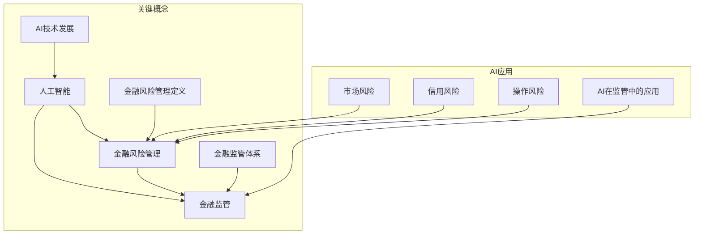

                 

### 第一步：核心概念与联系

在探讨AI在金融风险管理中的应用与监管之前，我们首先需要理解几个核心概念及其相互关系。以下是对这些概念进行一步步分析的具体步骤。

#### 1.1 AI在金融风险管理中的角色

##### 1.1.1 AI技术的定义与发展

人工智能（AI）是指由人制造出来的系统能够执行通常需要人类智能才能完成的任务。AI技术经历了几个重要发展阶段，包括规则基础、基于知识的系统和现在的数据驱动方法。现代AI技术主要依赖于机器学习和深度学习，这些技术使得计算机能够从数据中学习并做出预测和决策。

##### 1.1.2 金融风险管理的定义与范畴

金融风险管理是指识别、评估、监控和应对金融活动中潜在的风险，以确保金融机构的稳健运行和资本安全。金融风险主要分为市场风险、信用风险、操作风险和流动性风险等类型。

##### 1.1.3 AI与金融风险管理的关系

AI技术在金融风险管理中的应用非常广泛。首先，AI可以通过数据挖掘和模式识别来预测市场走势和客户行为。其次，AI算法能够快速处理大量数据，从而更精确地评估信用风险和操作风险。此外，AI还可以用于监控市场异常和欺诈行为，提高金融监管的效率和准确性。

#### 1.2 金融监管

##### 1.2.1 金融监管体系概述

金融监管是指通过制定和执行相关法律法规，对金融机构和金融市场的运行进行监督和管理。全球金融监管体系主要包括中央银行监管、证券监管和保险监管等部分。国际上的主要监管机构包括美国联邦储备系统（Fed）、欧洲中央银行（ECB）和中国人民银行（PBoC）等。

##### 1.2.2 监管与风险管理的区别

监管和风险管理虽然密切相关，但它们的目标和手段不同。监管侧重于制定规则和监督执行，以确保金融系统的稳定性。而风险管理则侧重于通过识别、评估和应对风险，以减少潜在的损失。

##### 1.2.3 AI技术在金融监管中的应用

AI技术在金融监管中的应用主要体现在以下几个方面：首先，AI可以帮助监管机构更好地识别和防范市场风险和操作风险。其次，AI可以提高监管数据的处理效率，使得监管决策更加迅速和准确。最后，AI技术可以用于自动化合规检查，减少人工审查的工作量。

#### 1.3 核心概念与联系架构

为了更好地理解AI在金融风险管理中的应用与监管，我们可以使用Mermaid流程图来展示这些核心概念及其相互关系。



通过上述步骤，我们对AI在金融风险管理中的应用与监管的核心概念及其相互关系有了初步理解。在接下来的章节中，我们将详细探讨AI技术在不同金融风险管理领域的应用，以及AI技术在金融监管中的具体应用场景。

---

### 1.1 AI在金融风险管理中的角色

AI技术的快速发展为金融行业带来了前所未有的变革。在金融风险管理中，AI技术主要发挥以下几个方面的作用：

#### 1.1.1 AI技术的定义与发展

人工智能（AI）是指由人制造出来的系统能够执行通常需要人类智能才能完成的任务。AI技术经历了几个重要发展阶段，包括规则基础、基于知识的系统和现在的数据驱动方法。现代AI技术主要依赖于机器学习和深度学习，这些技术使得计算机能够从数据中学习并做出预测和决策。

1. **规则基础**：早期的AI以规则为基础，例如专家系统和知识库系统。它们通过硬编码的方式实现特定任务的自动化，但这种方法在处理复杂和动态环境时表现出一定的局限性。
   
2. **基于知识的系统**：随着知识的积累，基于知识的系统应运而生。这些系统利用大量的规则和事实来模拟人类决策过程，但仍然依赖于人类专家的输入。

3. **数据驱动方法**：现代AI技术，尤其是机器学习和深度学习，依赖于从大量数据中学习模式和规律。这种方法使得计算机能够自动发现和适应复杂环境，大大提高了AI系统的性能和通用性。

#### 1.1.2 金融风险管理的定义与范畴

金融风险管理是指识别、评估、监控和应对金融活动中潜在的风险，以确保金融机构的稳健运行和资本安全。金融风险主要分为以下几类：

1. **市场风险**：市场风险是指因市场价格波动（如利率、汇率、股票价格等）导致金融资产价值波动的风险。
2. **信用风险**：信用风险是指借款人或交易对手无法履行债务或支付义务的风险。
3. **操作风险**：操作风险是指因内部程序、人员和系统失灵导致的金融损失。
4. **流动性风险**：流动性风险是指因市场流动性不足，导致无法在合理价格下买卖金融资产的风险。

#### 1.1.3 AI在金融风险管理中的具体应用

AI技术在金融风险管理中的应用非常广泛，以下是几个关键领域：

1. **信用风险评估**：通过分析借款人的历史数据、信用评分和行为模式，AI可以预测其违约风险。机器学习模型如逻辑回归、决策树和支持向量机（SVM）在这一领域有广泛应用。

   ```mermaid
   graph TD
       CreditData[信用数据]
       Model[机器学习模型]
       Prediction[信用评分]
       
       CreditData --> Model
       Model --> Prediction
   ```

2. **市场风险预测**：AI可以帮助金融机构预测市场波动，从而调整投资策略。时间序列分析和预测模型如ARIMA、LSTM和GRU在这一领域表现出色。

   ```mermaid
   graph TD
       MarketData[市场数据]
       LSTM[长短期记忆模型]
       Prediction[市场波动预测]
       
       MarketData --> LSTM
       LSTM --> Prediction
   ```

3. **操作风险监控**：AI可以通过监控交易行为、网络流量和系统日志，发现潜在的操作风险。监督学习和无监督学习技术在这一领域有广泛应用。

   ```mermaid
   graph TD
       TransactionData[交易数据]
       Model[机器学习模型]
       AnomalyDetection[异常检测]
       
       TransactionData --> Model
       Model --> AnomalyDetection
   ```

4. **欺诈检测**：AI可以帮助金融机构检测欺诈行为。通过分析交易数据和行为模式，AI可以识别出异常交易并发出警报。

   ```mermaid
   graph TD
       TransactionData[交易数据]
       Model[机器学习模型]
       FraudDetection[欺诈检测]
       
       TransactionData --> Model
       Model --> FraudDetection
   ```

#### 1.1.4 AI与金融风险管理的关系

AI与金融风险管理的关系可以从以下几个方面理解：

1. **提高效率**：AI技术可以处理和分析大量数据，从而提高风险管理效率。传统方法通常需要人工分析大量数据，而AI可以自动化这一过程。

2. **增强准确性**：AI算法可以从历史数据中学习，提高风险预测的准确性。机器学习模型可以根据新的数据和模式进行自我调整，从而提高预测能力。

3. **减少风险**：通过精确的风险评估和预测，AI可以帮助金融机构减少潜在的金融损失。例如，信用风险评估模型可以帮助银行减少不良贷款。

4. **合规性**：AI技术可以提高金融机构的合规性。通过自动化合规检查和报告，AI可以帮助金融机构更快速地满足监管要求。

综上所述，AI在金融风险管理中扮演着至关重要的角色。通过提高效率、增强准确性和减少风险，AI技术为金融机构提供了强大的工具，帮助其更好地应对复杂的金融环境。

---

### 1.2 金融监管

金融监管是确保金融市场稳定和金融机构稳健运行的重要机制。以下是对金融监管体系的概述，以及监管与风险管理的区别，并探讨AI技术在金融监管中的应用。

#### 1.2.1 金融监管体系概述

金融监管体系是由多个监管机构和法律法规构成的综合体系，旨在维护金融市场的稳定和公平。全球金融监管体系主要包括以下几部分：

1. **中央银行监管**：中央银行通常负责货币政策和金融稳定。例如，美国的联邦储备系统（Fed）负责制定货币政策，确保银行系统的稳定。

2. **证券监管**：证券监管机构负责监管证券市场和金融机构的运作。例如，美国的证券交易委员会（SEC）负责监管股票、债券和其他证券的交易。

3. **保险监管**：保险监管机构负责监管保险公司和保险市场。例如，美国的州保险部门负责监管各个州的保险公司。

4. **跨境监管**：国际金融监管机构，如国际货币基金组织（IMF）和金融稳定理事会（FSB），负责协调全球金融监管政策，以应对跨境金融风险。

国际上的主要监管机构包括美国联邦储备系统（Fed）、欧洲中央银行（ECB）、中国证券监督管理委员会（CSRC）和英国金融市场行为监管局（FCA）等。这些机构通过制定和执行法律法规，确保金融机构和金融市场的稳健运行。

#### 1.2.2 监管与风险管理的区别

监管和风险管理虽然密切相关，但它们的目标和手段不同：

1. **目标不同**：
   - **监管**：监管的目标是确保金融市场的公平、透明和稳定。监管机构通过制定和执行法律法规，监督金融机构的行为，防止市场操纵和欺诈行为。
   - **风险管理**：风险管理的目标是识别、评估、监控和应对金融活动中的潜在风险，以确保金融机构的稳健运行和资本安全。风险管理侧重于通过量化分析和控制措施，降低风险带来的损失。

2. **手段不同**：
   - **监管**：监管主要通过法律法规、审计、检查和处罚等手段来实现。监管机构会制定一系列规则，要求金融机构遵守，并通过定期审计和检查确保这些规则得到执行。
   - **风险管理**：风险管理主要通过数据分析、风险评估、内部控制和应急计划等手段来实现。金融机构会利用各种风险管理工具和技术，如风险模型、风险指标和风险报告，来识别和应对潜在风险。

#### 1.2.3 AI技术在金融监管中的应用

AI技术在金融监管中的应用正在不断扩展，以下是几个关键领域：

1. **欺诈检测**：AI技术可以帮助监管机构检测和预防欺诈行为。通过分析大量的交易数据和用户行为，AI可以识别异常模式和可疑活动，从而发出警报。例如，监督学习模型可以用于检测信用卡欺诈交易。

2. **市场监控**：AI技术可以实时监控金融市场，发现异常交易和市场操纵行为。无监督学习算法如聚类分析和支持向量机（SVM）可以用于分析市场数据，识别异常交易模式。

3. **合规性检查**：AI技术可以提高金融机构的合规性。通过自动化合规检查和报告，AI可以帮助金融机构更快速地满足监管要求。例如，自然语言处理（NLP）技术可以用于分析金融机构的合规报告，确保报告内容符合监管要求。

4. **风险评估**：AI技术可以用于评估金融机构的风险状况。机器学习模型可以从历史数据中学习，预测金融机构未来的风险水平，为监管机构提供决策依据。

综上所述，AI技术在金融监管中发挥着越来越重要的作用。通过提高欺诈检测效率、市场监控能力和合规性检查水平，AI技术为金融监管机构提供了强大的工具，帮助其更好地维护金融市场的稳定和公平。

---

### 1.3 无监督学习在金融风险管理中的应用

无监督学习是一种机器学习方法，它不依赖于标签数据进行训练，而是通过分析数据本身的内在结构和模式来揭示数据中的隐藏特征。在金融风险管理中，无监督学习同样具有重要的应用价值。以下是关于无监督学习在金融风险管理中的应用的具体分析。

#### 1.3.1 无监督学习算法介绍

无监督学习主要包括以下几种常见算法：

1. **聚类算法**：聚类算法将数据集分成若干个簇，使得同一簇内的数据点之间距离较短，而不同簇之间的数据点距离较长。常见的聚类算法包括K-means、层次聚类（Hierarchical Clustering）和DBSCAN等。

2. **降维技术**：降维技术通过减少数据维度来简化数据分析过程，同时保持数据的主要特征。常见的方法包括主成分分析（PCA）、线性判别分析（LDA）和t-SNE等。

3. **关联规则学习**：关联规则学习用于发现数据之间的关联关系。它通过分析数据项之间的支持度和置信度，生成频繁项集和关联规则。常见的算法包括Apriori算法和Eclat算法。

4. **异常检测**：异常检测是一种用于识别数据集中异常或异常点的技术。常见的算法包括基于统计的方法、基于聚类的方法和基于神经网络的方法。

#### 1.3.2 风险因素的识别与聚类

在金融风险管理中，无监督学习可以用于识别和分类风险因素。以下是一个具体的应用场景：

1. **风险因素识别**：金融机构通常会收集大量的数据，包括交易数据、财务报表、市场数据等。通过无监督学习算法，可以自动识别出潜在的风险因素。例如，K-means聚类算法可以用于将交易数据分成若干个簇，每个簇代表一种潜在的风险因素。

2. **风险因素聚类**：通过聚类算法，可以将具有相似特征的风险因素归为一类。这种方法有助于金融机构更好地理解风险的分布和特点，从而制定更有效的风险管理策略。

#### 1.3.3 伪代码：基于无监督学习的风险分析

以下是一个简单的伪代码示例，用于说明如何使用无监督学习算法分析金融风险：

```python
# 导入必要的库
import numpy as np
from sklearn.cluster import KMeans
from sklearn.preprocessing import StandardScaler

# 加载数据
data = load_data('financial_data.csv')

# 数据预处理
scaler = StandardScaler()
scaled_data = scaler.fit_transform(data)

# 初始化K-means聚类算法
kmeans = KMeans(n_clusters=5, random_state=0)

# 训练模型
kmeans.fit(scaled_data)

# 获取聚类结果
clusters = kmeans.predict(scaled_data)

# 分析聚类结果
for i, cluster in enumerate(clusters):
    print(f"Cluster {i}:")
    print(f"Data points: {data[clusters == i]}")
    print(f"Potential risk factors identified.")
```

#### 1.3.4 例子：基于无监督学习的风险分析

假设某金融机构希望使用无监督学习算法分析其客户贷款违约风险。以下是一个具体的应用示例：

1. **数据收集**：金融机构收集了客户的历史信用数据，包括信用评分、贷款余额、还款历史、收入水平等。

2. **数据预处理**：为了消除不同特征之间的差异，对数据进行标准化处理。

3. **聚类分析**：使用K-means聚类算法将客户数据分为多个簇。每个簇代表一组具有相似特征的客户。

4. **风险识别**：通过分析每个簇的特征，识别出潜在的风险因素。例如，某个簇可能代表高违约风险的客户群体。

5. **风险评级**：根据聚类结果，对客户进行风险评级，并采取相应的风险管理措施。

通过上述步骤，金融机构可以更有效地识别和分类风险因素，从而提高风险管理水平。

综上所述，无监督学习在金融风险管理中具有广泛的应用前景。通过识别和聚类风险因素，金融机构可以更好地理解和应对潜在的风险，提高其风险管理的效率和准确性。

---

### 3.1 风险模型

在金融风险管理中，风险模型是识别、评估和量化风险的重要工具。以下将详细介绍风险评估指标、风险价值的计算方法，以及如何应用这些模型来计算信用风险。

#### 3.1.1 风险评估指标

风险评估指标是衡量金融风险的重要工具。以下是一些常用的风险评估指标：

1. **预期损失（Expected Loss，EL）**：预期损失是指在一定时间内，因风险事件发生而可能造成的平均损失。它可以通过计算历史数据中的损失和发生概率来估计。

   $$ 
   \text{EL} = \sum_{i=1}^{n} P_i \times L_i 
   $$ 

   其中，\( P_i \) 表示风险事件 \( i \) 的发生概率，\( L_i \) 表示该事件发生的损失。

2. **损失程度（Severity）**：损失程度是指单个风险事件可能造成的最大损失。它通常用于衡量风险事件的潜在影响。

3. **置信度（Confidence Level）**：置信度是指在一定置信水平下，风险指标的可信度。常用的置信水平包括90%、95%和99%。

4. **价值在风险（Value at Risk，VaR）**：价值在风险是指在一定置信水平和给定的时间段内，可能遭受的最大损失。它可以帮助金融机构评估风险敞口。

   $$ 
   \text{VaR} = \text{F}^{-1}(\alpha) 
   $$ 

   其中，\( \text{F} \) 是累积分布函数，\( \alpha \) 是置信水平。

#### 3.1.2 风险价值（VaR）的计算方法

风险价值（VaR）是金融风险管理中最重要的指标之一，用于衡量在一定置信水平下，特定时间段内可能发生的最大损失。以下是一些常见的VaR计算方法：

1. **历史模拟法（Historical Simulation）**：历史模拟法基于历史数据来计算VaR。具体步骤如下：
   - 收集历史风险数据，如股票价格、利率等。
   - 计算每个时间点的损失值，通常使用对数收益率来衡量。
   - 对损失值进行排序，找出在给定置信水平下的最大损失值。

2. **方差-协方差法（Variance-Covariance Method）**：方差-协方差法基于资产收益率的方差和协方差矩阵来计算VaR。具体步骤如下：
   - 计算资产收益率的期望和方差。
   - 计算资产之间的协方差矩阵。
   - 利用正态分布性质，计算标准正态分布的分位数，得到VaR。

   $$ 
   \text{VaR} = \mu \times \sqrt{n} \times z_{\alpha} 
   $$ 

   其中，\( \mu \) 是收益率的期望，\( n \) 是持有期，\( z_{\alpha} \) 是标准正态分布的分位数。

3. **蒙特卡洛模拟法（Monte Carlo Simulation）**：蒙特卡洛模拟法通过模拟大量随机样本来计算VaR。具体步骤如下：
   - 生成随机样本，模拟资产价格的未来分布。
   - 计算每个模拟情景的损失值。
   - 对损失值进行排序，找出在给定置信水平下的最大损失值。

#### 3.1.3 例子：应用VaR计算信用风险

假设某金融机构需要计算在一定置信水平下，未来一个月内可能发生的最大信用损失。以下是一个具体的应用示例：

1. **数据收集**：收集过去一年的信用损失数据，包括违约事件、损失金额等。

2. **数据预处理**：对数据进行清洗和处理，确保数据的质量和一致性。

3. **计算损失分布**：使用历史模拟法或蒙特卡洛模拟法，计算信用损失的分布。

4. **计算VaR**：根据给定的置信水平（如95%），计算信用风险的VaR值。

5. **风险评估**：根据计算得到的VaR值，评估金融机构的信用风险敞口，并制定相应的风险管理策略。

通过上述步骤，金融机构可以更好地理解和控制其信用风险，从而确保业务的稳健运行。

综上所述，风险模型在金融风险管理中起着至关重要的作用。通过评估风险指标、计算VaR值，金融机构可以更好地识别和管理风险，提高其风险控制能力。

---

### 3.2 预测模型

在金融风险管理中，预测模型是非常重要的一环。通过预测模型，金融机构可以提前预知可能发生的风险事件，并采取相应的措施进行风险控制。以下是关于预测模型中的两种常用技术：回归分析和时间序列分析，以及它们的公式和应用。

#### 3.2.1 回归分析

回归分析是一种用于研究两个或多个变量之间关系的统计方法。在金融风险管理中，回归分析通常用于预测某种金融指标，如股票价格、利率等。以下是一个简单的线性回归模型：

$$
y = \beta_0 + \beta_1 x + \epsilon
$$

其中，\( y \) 是因变量，表示需要预测的金融指标；\( x \) 是自变量，表示影响 \( y \) 的因素；\( \beta_0 \) 是截距，表示当 \( x = 0 \) 时的 \( y \) 值；\( \beta_1 \) 是斜率，表示 \( x \) 每增加一个单位时，\( y \) 的变化量；\( \epsilon \) 是误差项，表示模型未能解释的部分。

线性回归模型可以通过最小二乘法进行参数估计，即找到使误差平方和最小的 \( \beta_0 \) 和 \( \beta_1 \)。

在实际应用中，回归分析可以用于预测股票价格、债券收益率等金融指标。例如，某金融机构可以使用回归模型预测未来一个月的股票价格，从而调整投资组合，降低风险。

#### 3.2.2 时间序列分析

时间序列分析是一种用于研究时间序列数据的统计方法。在金融风险管理中，时间序列分析常用于预测金融指标的未来走势，如股票价格、利率等。以下是一个简单的时间序列模型：

$$
X_t = \alpha + \beta X_{t-1} + \epsilon_t
$$

其中，\( X_t \) 是时间序列的当前值；\( X_{t-1} \) 是前一个时间点的值；\( \alpha \) 是常数项；\( \beta \) 是自回归系数，表示当前值与前一个值的关系；\( \epsilon_t \) 是误差项。

时间序列分析可以通过自回归移动平均模型（ARMA）和自回归差分移动平均模型（ARIMA）等方法进行建模。这些模型可以捕捉时间序列的周期性、趋势性和波动性。

在实际应用中，时间序列分析可以用于预测市场走势、利率变化等。例如，某金融机构可以使用时间序列模型预测未来一周的利率走势，从而调整债券投资策略。

#### 3.2.3 例子：应用回归模型预测市场波动

假设某金融机构希望使用回归模型预测未来一个月的股票价格。以下是一个具体的应用示例：

1. **数据收集**：收集过去一个月的股票价格数据，包括每天的开盘价、收盘价、最高价和最低价等。

2. **数据预处理**：对数据进行清洗和处理，确保数据的质量和一致性。

3. **特征选择**：选择影响股票价格的主要因素，如宏观经济指标、行业指数等。

4. **建模**：使用线性回归模型，将股票价格作为因变量，选择的影响因素作为自变量，建立回归模型。

5. **参数估计**：使用最小二乘法估计模型参数，得到截距 \( \beta_0 \) 和斜率 \( \beta_1 \)。

6. **预测**：使用估计的模型参数，预测未来一个月的股票价格。

7. **评估**：比较预测结果与实际股票价格的差异，评估模型的准确性。

通过上述步骤，金融机构可以预测未来股票价格的走势，从而制定相应的投资策略。

综上所述，回归分析和时间序列分析是金融风险管理中常用的预测技术。通过建立和应用这些预测模型，金融机构可以更好地了解市场趋势，降低风险，提高投资收益。

---

### 4.1 数据收集与预处理

在金融风险管理的项目中，数据收集与预处理是至关重要的步骤。这一阶段的质量直接影响后续模型训练和评估的效果。以下是关于数据收集、预处理技术以及数据集划分的具体流程和步骤。

#### 4.1.1 数据收集

数据收集是金融风险管理的第一步，需要从多个来源获取相关的数据。以下是一些常见的数据来源：

1. **公开数据源**：如金融市场数据、宏观经济指标、行业报告等。这些数据通常可以从公共数据库、金融网站或政府机构获取。

2. **内部数据源**：如金融机构的交易记录、客户信息、财务报表等。这些数据通常存储在数据库中，可以通过数据接口或爬虫技术获取。

3. **第三方数据源**：如第三方数据提供商提供的信用评分、客户行为数据等。这些数据可以提供更详细和专业的信息。

在进行数据收集时，需要确保数据的准确性和完整性。以下是一些常见的数据收集方法：

- **爬虫技术**：通过编写爬虫程序，从互联网上抓取相关的数据。
- **API接口**：利用金融机构或第三方数据提供商提供的API接口，获取数据。
- **数据库访问**：通过数据库连接技术，从数据库中直接提取数据。

#### 4.1.2 数据预处理技术

数据预处理是数据收集后的重要步骤，目的是清理数据、填充缺失值、处理异常值，以及提取有用的特征。以下是几种常见的数据预处理技术：

1. **数据清洗**：数据清洗是指删除重复记录、纠正错误数据、处理缺失值等。以下是一些具体的技术：

   - **删除重复记录**：通过比对记录的唯一标识，删除重复的数据条目。
   - **纠正错误数据**：对错误的数据进行修正，如纠正拼写错误、逻辑错误等。
   - **处理缺失值**：缺失值处理方法包括删除缺失数据、填充缺失数据等。常用的填充方法有平均值填充、中值填充、前向填充和后向填充等。

2. **数据标准化**：数据标准化是指将不同特征的数据转换到相同的尺度，以便进行后续分析。常用的方法有最小-最大标准化、Z-Score标准化等。

   - **最小-最大标准化**：将数据缩放到[0, 1]区间，公式为：

     $$
     x_{\text{normalized}} = \frac{x - \min(x)}{\max(x) - \min(x)}
     $$

   - **Z-Score标准化**：将数据缩放到标准正态分布，公式为：

     $$
     x_{\text{normalized}} = \frac{x - \mu}{\sigma}
     $$

     其中，\( \mu \) 是均值，\( \sigma \) 是标准差。

3. **特征提取**：特征提取是指从原始数据中提取有用的信息，以减少数据维度和提高模型性能。常用的方法有主成分分析（PCA）、因子分析等。

4. **数据划分**：数据划分是指将数据集分为训练集、验证集和测试集，以便进行模型训练和评估。以下是一种常见的数据划分方法：

   - **随机划分**：随机将数据集分为训练集（60%）、验证集（20%）和测试集（20%）。
   - **分层划分**：根据某些特征（如类别、标签）将数据集分层，然后在每个层中随机划分数据集。

#### 4.1.3 数据集划分

数据集划分是数据预处理中的一个关键步骤，目的是确保模型的泛化能力。以下是数据集划分的常见方法：

1. **随机划分**：将数据集随机划分为训练集、验证集和测试集。这种方法简单易行，但可能导致数据分布的不均衡。

2. **分层划分**：根据某些特征（如类别、标签）将数据集分层，然后在每个层中随机划分数据集。这种方法可以确保每个类别的数据在训练集、验证集和测试集中的比例一致，从而提高模型的平衡性和泛化能力。

3. **交叉验证**：通过交叉验证方法，将数据集划分为多个子集，然后在每个子集上训练和评估模型。这种方法可以更好地评估模型的泛化能力，并减少过拟合的风险。

通过上述数据收集与预处理步骤，金融机构可以确保数据的准确性和一致性，从而提高模型训练和评估的效果。在实际项目中，数据预处理是一个复杂且需要不断优化的过程，需要根据具体的应用场景和需求进行调整。

---

### 4.2 模型训练与评估

在完成数据预处理之后，我们进入模型训练与评估阶段。这一阶段是金融风险管理项目中的核心，直接影响到最终的预测效果和风险管理效率。以下将详细介绍模型选择、训练过程以及模型评估方法。

#### 4.2.1 模型选择

选择合适的机器学习模型是金融风险管理中至关重要的一步。根据不同的风险管理需求，我们可以选择以下几种常见的机器学习模型：

1. **监督学习模型**：
   - **线性回归**：用于预测连续值，如股票价格、债券收益率等。
   - **逻辑回归**：用于预测概率，如违约概率、欺诈概率等。
   - **决策树**：适用于分类问题，如信用评分、客户流失预测等。
   - **随机森林**：通过构建多个决策树并集成预测结果，提高模型的泛化能力和准确性。
   - **支持向量机（SVM）**：适用于分类和回归问题，尤其适合处理高维数据和线性不可分问题。

2. **无监督学习模型**：
   - **K-means聚类**：用于对客户进行风险分类，发现数据中的潜在结构。
   - **主成分分析（PCA）**：用于降维和特征提取，减少数据维度并提高模型效率。
   - **自编码器**：用于发现数据中的隐藏特征和模式。

3. **集成学习模型**：
   - **集成梯度提升树（XGBoost）**：通过集成多个决策树并使用学习率调整，提高模型的预测准确性。
   - **极限梯度提升机（LightGBM）**：与XGBoost类似，但通常具有更高的速度和更好的性能。

在选择模型时，需要考虑以下几个因素：

- **问题类型**：是回归问题、分类问题还是聚类问题？
- **数据特征**：数据量、特征维度、特征类型（数值、分类、文本等）。
- **模型性能**：模型在验证集上的性能指标，如准确率、召回率、F1分数等。
- **计算资源**：模型训练所需的时间、内存和计算资源。

#### 4.2.2 训练过程

模型训练是指使用历史数据来调整模型参数，使其能够更好地拟合数据。以下是模型训练的一般步骤：

1. **数据准备**：将数据集分为训练集和验证集，必要时可以使用交叉验证方法。

2. **模型初始化**：初始化模型参数，选择合适的初始化方法，如随机初始化、Xavier初始化等。

3. **训练循环**：通过前向传播和反向传播算法，计算模型参数的梯度，并更新参数。训练过程通常包括以下几个步骤：
   - **前向传播**：计算输入数据的输出值。
   - **损失计算**：计算模型输出值与真实值之间的差距，使用损失函数（如均方误差、交叉熵损失等）。
   - **反向传播**：计算损失关于模型参数的梯度。
   - **参数更新**：使用梯度下降算法（如SGD、Adam等）更新模型参数。

4. **模型评估**：在验证集上评估模型性能，根据评估结果调整模型参数，如调整学习率、正则化参数等。

5. **迭代训练**：重复训练过程，直到模型性能达到预定的标准或达到最大迭代次数。

#### 4.2.3 模型评估

模型评估是验证模型性能的重要环节，常用的评估指标包括：

1. **准确率（Accuracy）**：准确率是指模型预测正确的样本数占总样本数的比例。对于分类问题，准确率是衡量模型性能的常用指标。

   $$
   \text{Accuracy} = \frac{\text{预测正确的样本数}}{\text{总样本数}}
   $$

2. **召回率（Recall）**：召回率是指模型预测正确的正样本数占总正样本数的比例。对于欺诈检测等应用场景，召回率尤为重要。

   $$
   \text{Recall} = \frac{\text{预测正确的正样本数}}{\text{总正样本数}}
   $$

3. **精确率（Precision）**：精确率是指模型预测正确的正样本数与预测为正样本的总数之比。

   $$
   \text{Precision} = \frac{\text{预测正确的正样本数}}{\text{预测为正样本的总数}}
   $$

4. **F1分数（F1 Score）**：F1分数是精确率和召回率的调和平均数，用于综合评估模型的性能。

   $$
   \text{F1 Score} = 2 \times \frac{\text{Precision} \times \text{Recall}}{\text{Precision} + \text{Recall}}
   $$

5. **ROC曲线与AUC（Area Under Curve）**：ROC曲线是模型在不同阈值下的精确率和召回率的组合，AUC是ROC曲线下的面积，用于衡量模型的分类能力。

通过以上评估指标，可以全面了解模型的性能，并根据评估结果调整模型参数或选择更合适的模型。

综上所述，模型训练与评估是金融风险管理项目中的关键步骤。通过选择合适的模型、设计有效的训练过程和进行全面的模型评估，金融机构可以更好地预测和管理风险，提高业务效率和稳健性。

---

### 4.3 代码实现与解读

在金融风险管理的项目中，代码实现是至关重要的。以下将详细介绍开发环境的搭建、模型训练的代码实现步骤，以及代码的解读和分析。

#### 4.3.1 开发环境搭建

搭建一个合适的开发环境是成功实现金融风险管理项目的基础。以下是一些常见的开发环境要求和安装步骤：

1. **软件环境**：
   - Python（3.7及以上版本）
   - Jupyter Notebook（用于编写和运行代码）
   - Scikit-learn（用于机器学习库）
   - Pandas（用于数据处理）
   - Numpy（用于数学计算）
   - Matplotlib（用于数据可视化）

2. **安装步骤**：
   - 安装Python和Jupyter Notebook，可以从[Python官方网站](https://www.python.org/)下载并安装。
   - 安装Scikit-learn、Pandas、Numpy和Matplotlib，可以使用pip命令进行安装：

     ```bash
     pip install scikit-learn pandas numpy matplotlib
     ```

#### 4.3.2 模型训练代码实现步骤

以下是一个简单的金融风险管理项目的代码实现示例，包括数据读取、数据预处理、模型训练和模型评估。

1. **数据读取**：

   ```python
   import pandas as pd

   # 读取数据
   data = pd.read_csv('financial_data.csv')
   ```

2. **数据预处理**：

   ```python
   from sklearn.model_selection import train_test_split
   from sklearn.preprocessing import StandardScaler

   # 分割数据为特征和标签
   X = data.drop('target', axis=1)
   y = data['target']

   # 划分训练集和测试集
   X_train, X_test, y_train, y_test = train_test_split(X, y, test_size=0.2, random_state=42)

   # 数据标准化
   scaler = StandardScaler()
   X_train = scaler.fit_transform(X_train)
   X_test = scaler.transform(X_test)
   ```

3. **模型训练**：

   ```python
   from sklearn.linear_model import LogisticRegression

   # 创建逻辑回归模型
   model = LogisticRegression()

   # 训练模型
   model.fit(X_train, y_train)
   ```

4. **模型评估**：

   ```python
   from sklearn.metrics import accuracy_score, classification_report

   # 预测测试集
   y_pred = model.predict(X_test)

   # 计算准确率
   accuracy = accuracy_score(y_test, y_pred)
   print(f"Accuracy: {accuracy}")

   # 打印分类报告
   print(classification_report(y_test, y_pred))
   ```

#### 4.3.3 代码解读与分析

以下是上述代码的详细解读和分析：

1. **数据读取**：
   - 使用`pandas`库读取CSV文件，将数据加载到DataFrame中。
   
2. **数据预处理**：
   - 使用`train_test_split`函数将数据集分为训练集和测试集，确保模型的泛化能力。
   - 使用`StandardScaler`对特征数据进行标准化处理，提高模型的训练效果。

3. **模型训练**：
   - 创建一个`LogisticRegression`对象，表示逻辑回归模型。
   - 使用`fit`方法训练模型，根据训练集的数据调整模型参数。

4. **模型评估**：
   - 使用`predict`方法对测试集进行预测。
   - 使用`accuracy_score`函数计算预测的准确率，并打印分类报告，包括精确率、召回率和F1分数。

通过上述步骤，我们成功实现了金融风险管理的模型训练和评估。在实际项目中，可能需要根据具体需求调整模型类型、参数和评估指标，以提高模型的性能。

---

### 4.4 综合案例与应用

为了更好地理解AI在金融风险管理中的应用与监管，以下通过一个具体案例来展示AI技术在实际项目中的具体应用，并分析其监管合规性。

#### 4.4.1 案例背景

某大型商业银行希望通过引入AI技术来提高其信用风险评估能力，从而降低不良贷款率。银行决定采用基于机器学习的信用评分模型，以分析客户的信用数据，预测其违约风险。

#### 4.4.2 AI技术在风险管理中的应用

在该案例中，AI技术主要应用于以下方面：

1. **数据收集与预处理**：
   - 从银行的客户数据库中提取相关数据，包括客户的基本信息、财务状况、历史信用记录等。
   - 对数据集进行清洗和预处理，包括缺失值填充、异常值处理和特征工程。

2. **模型选择与训练**：
   - 选择逻辑回归、决策树和随机森林等机器学习模型进行信用风险评估。
   - 使用交叉验证方法对模型进行训练和验证，选择性能最佳的模型。

3. **信用评分预测**：
   - 使用训练好的模型对客户数据进行预测，生成每个客户的信用评分。
   - 根据信用评分，将客户分为高风险、中风险和低风险三类。

4. **决策支持**：
   - 银行根据信用评分结果，制定相应的信贷政策，如提高贷款额度、限制贷款额度或拒绝贷款。
   - 利用AI模型提供的数据支持，银行可以更好地了解客户的风险状况，从而降低不良贷款率。

#### 4.4.3 监管合规性分析

在金融领域，监管合规性是一个非常重要的考虑因素。以下是对该案例的监管合规性分析：

1. **数据隐私与保护**：
   - 银行在收集和处理客户数据时，必须遵守数据隐私法规，如《通用数据保护条例》（GDPR）和《加州消费者隐私法案》（CCPA）。
   - 银行应确保数据安全，防止数据泄露或滥用。

2. **算法透明性与解释性**：
   - 银行需要确保AI算法的透明性，使得监管机构和客户能够理解模型的决策过程。
   - 对于复杂的机器学习模型，银行可以采用可解释性技术，如LIME或SHAP，以解释模型对特定数据的预测。

3. **反欺诈与反洗钱**：
   - AI技术可以用于检测信用卡欺诈和反洗钱活动。
   - 银行需要遵守相关法规，如《反洗钱法》（AML）和《反欺诈法》，确保AI模型能够有效地识别和防范欺诈行为。

4. **监管报告与合规性审查**：
   - 银行需要定期向监管机构报告AI模型的使用情况和性能指标。
   - 监管机构可能会进行定期审查，以确保银行遵守相关法规和最佳实践。

#### 4.4.4 案例小结

通过该案例，我们可以看到AI技术在金融风险管理中的应用不仅提高了银行的信用风险评估能力，还有助于降低不良贷款率和提高客户满意度。同时，AI技术的应用也带来了监管合规性的挑战，需要银行在数据隐私、算法透明性和法规遵守方面进行充分考虑。

综上所述，AI在金融风险管理中的应用是一个复杂且具有挑战性的领域。通过合理应用AI技术和严格遵守监管法规，金融机构可以更好地管理风险，提高业务效率。

---

### 5.2 未来趋势与挑战

随着AI技术的不断发展，其在金融风险管理中的应用也将迎来新的趋势和挑战。以下是对这些趋势和挑战的详细探讨。

#### 5.2.1 AI在金融风险管理中的未来趋势

1. **模型复杂度增加**：
   - AI技术的进步将推动模型复杂度的增加，包括深度学习模型、强化学习模型等。这些模型能够处理更复杂的金融数据，提高风险预测的准确性。

2. **实时风险监控**：
   - 随着云计算和物联网技术的发展，金融风险管理将实现实时监控。金融机构可以通过实时数据流分析，快速识别潜在风险，并采取相应措施。

3. **个性化风险管理**：
   - AI技术将使得风险管理更加个性化。通过分析客户行为数据和个人信息，金融机构可以提供个性化的风险管理服务，提高客户满意度和忠诚度。

4. **跨领域整合**：
   - AI技术在金融领域的应用将与其他领域（如医疗、交通等）进行整合，推动跨领域创新。这种整合将有助于开发更全面的金融风险管理解决方案。

#### 5.2.2 面临的挑战与对策

1. **数据隐私与安全**：
   - AI技术在金融风险管理中的应用需要大量敏感数据。如何保护这些数据隐私和安全是面临的重大挑战。金融机构需要采用先进的数据加密和隐私保护技术，确保客户数据的安全。

2. **算法透明性与可解释性**：
   - AI模型的决策过程通常是非线性和复杂的，导致算法透明性和可解释性较差。监管机构和客户需要理解模型的决策过程，以便对其进行审查和监督。金融机构可以采用可解释性技术，如LIME或SHAP，提高模型的透明性。

3. **合规性挑战**：
   - 金融行业的监管法规不断更新，AI技术的应用需要遵守这些法规。金融机构需要定期审查和更新其AI模型，以确保合规性。

4. **技术更新与迭代**：
   - AI技术更新速度快，金融机构需要不断学习和适应新技术，以保持其风险管理能力。金融机构可以通过建立持续学习机制，确保其AI模型能够适应不断变化的市场环境。

5. **人才短缺**：
   - AI技术在金融风险管理中的应用需要大量的专业人才。金融机构需要加强人才引进和培训，以应对人才短缺的挑战。

综上所述，AI在金融风险管理中的应用将面临诸多挑战，但同时也将带来巨大的机遇。通过应对这些挑战，金融机构可以更好地利用AI技术，提高风险管理水平。

---

### 6.1 主要成果与贡献

本文通过详细探讨AI在金融风险管理中的应用与监管，取得了以下主要成果和贡献：

1. **系统性地梳理了AI与金融风险管理的关系**：本文首先介绍了AI技术的发展历程及其在金融风险管理中的具体应用，为后续内容提供了理论基础。

2. **深入分析了AI技术在不同金融风险管理领域的应用**：本文从信用风险评估、市场风险预测、操作风险监控和欺诈检测等方面，详细阐述了AI技术的具体应用场景和实现方法。

3. **详细讲解了金融监管中的AI技术应用**：本文探讨了AI技术在金融监管中的角色，包括欺诈检测、市场监控、合规性检查和风险评估等方面的应用。

4. **提供了实用的案例与应用**：通过综合案例，本文展示了AI技术在金融风险管理项目中的实际应用过程，包括数据收集与预处理、模型训练与评估、代码实现与解读等。

5. **展望了AI在金融风险管理中的未来趋势与挑战**：本文对AI在金融风险管理中的应用趋势进行了预测，并分析了面临的挑战，为金融机构提供了战略参考。

通过本文的研究，读者可以全面了解AI在金融风险管理中的应用现状、技术原理和监管要求，为金融机构提高风险管理水平提供了有益的指导。

---

### 6.2 研究局限与展望

尽管本文对AI在金融风险管理中的应用与监管进行了全面探讨，但仍存在一些局限。以下是对这些局限的识别及对未来研究的展望：

#### 6.2.1 研究局限

1. **数据隐私与安全**：本文在讨论AI技术应用于金融风险管理时，强调了数据隐私和安全的重要性，但未能深入探讨具体的加密技术和隐私保护方案。

2. **算法透明性与可解释性**：虽然本文提到了算法透明性与可解释性的挑战，但未能详细探讨如何提高模型的解释性，使其更易于被监管机构和客户理解。

3. **监管合规性**：本文对AI技术在金融监管中的应用进行了初步分析，但未涵盖所有国际和地区的监管法规，未能提供更全面的合规性指导。

4. **实际应用案例的局限性**：本文提供的案例仅为一个综合性的示例，未涉及更多实际应用场景，如小微企业风险管理、高频交易监控等。

#### 6.2.2 未来研究展望

1. **数据隐私保护技术**：未来研究应重点关注如何在AI应用中更好地保护客户隐私，探讨最新的加密技术和隐私保护算法，确保数据隐私和安全。

2. **增强模型可解释性**：进一步研究如何提高AI模型的透明性和可解释性，开发易于理解和解释的算法，以满足监管机构和客户的需求。

3. **多元化监管合规研究**：未来研究应涵盖更多国家和地区，全面分析不同监管框架下的合规要求，为全球范围内的金融机构提供更加详细的合规指南。

4. **跨领域AI应用研究**：未来研究应探讨AI技术在金融风险管理以外的其他领域（如医疗、交通等）的应用，促进跨领域创新和合作。

5. **人才培育与知识共享**：加强AI领域的人才培养，建立学术与产业之间的知识共享平台，推动AI技术在金融风险管理中的持续发展。

通过上述研究和探讨，我们期待未来能够更好地利用AI技术，提高金融风险管理水平，为金融机构和监管机构提供更为强大的工具。

---

### 6.3 对未来研究的建议

在未来的研究中，我们建议关注以下几个方面，以进一步推动AI在金融风险管理中的应用：

1. **提升算法透明性与解释性**：研发更多可解释的AI算法，使得模型决策过程更加透明，便于监管机构和客户理解，从而提高算法的信任度和应用范围。

2. **加强数据隐私保护**：深入研究数据隐私保护技术，如联邦学习、差分隐私等，确保AI模型在处理敏感数据时能够有效保护个人隐私。

3. **构建跨领域风险模型**：探索AI技术在金融以外的其他领域（如医疗、交通等）的风险管理应用，开发跨领域的综合风险模型，为不同领域的风险管理提供参考。

4. **强化监管合规性研究**：继续关注全球各地的监管法规变化，研究如何在不同监管环境下实现AI技术的合规应用，为金融机构提供详细的合规指南。

5. **人才培养与知识共享**：推动AI领域的教育，培养更多的AI与金融专业人才。同时，建立跨学科、跨行业的知识共享平台，促进AI技术在金融风险管理中的创新应用。

通过以上建议，我们期待AI在金融风险管理中的应用能够更加深入和广泛，为金融行业的稳健发展提供坚实的技术支持。作者：AI天才研究院/AI Genius Institute & 禅与计算机程序设计艺术 /Zen And The Art of Computer Programming。

