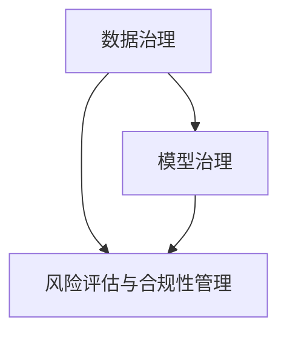
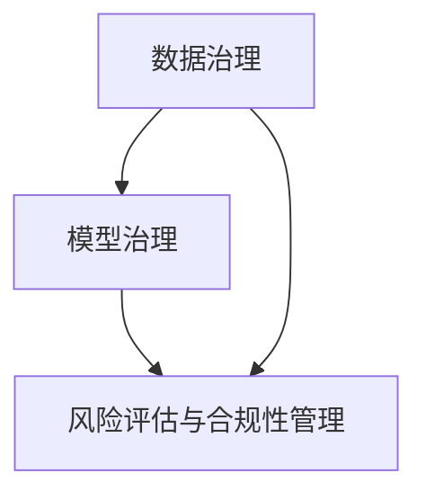
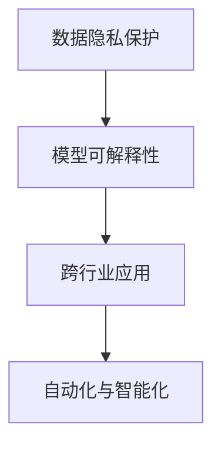
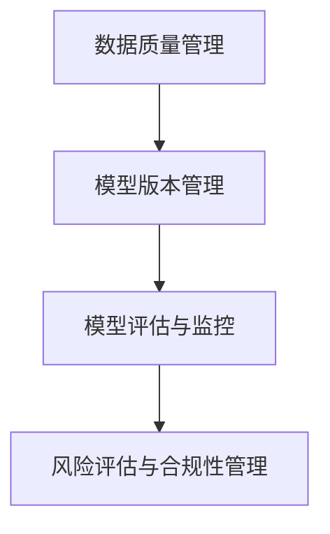
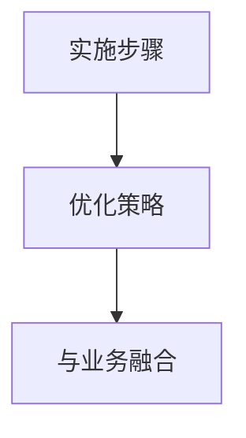
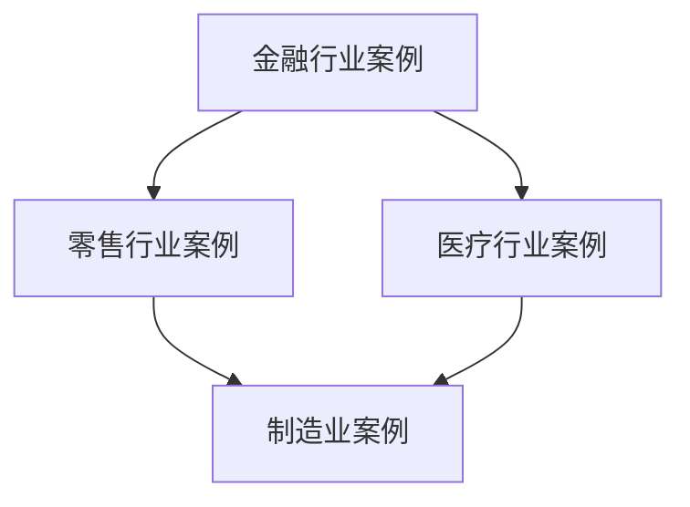

                 

### 1.1 AI治理平台概述

**背景介绍**

人工智能（AI）技术的发展日新月异，已经成为推动现代科技进步和社会发展的关键动力。然而，随着AI技术的广泛应用，AI治理的问题也逐渐显现。AI治理平台作为一种新兴的解决方案，旨在通过系统化的管理和控制，确保AI技术的安全、可靠、公平和透明。AI治理平台不仅有助于提高AI系统的整体性能，还能有效降低潜在的风险和合规性问题。

**核心概念与联系**

AI治理平台的核心概念包括数据治理、模型治理、风险评估与合规性管理。这些概念之间存在着密切的联系：

- **数据治理**：确保数据的质量、安全性和可靠性，是AI治理的基础。高质量的数据是训练有效AI模型的必要条件。
- **模型治理**：涉及模型的开发、测试、部署和管理。通过模型治理，可以确保模型的性能和可解释性，从而提高模型的可靠性和透明度。
- **风险评估与合规性管理**：评估AI系统可能带来的风险，并制定相应的合规性措施，确保AI系统的合法性和社会可接受性。

为了更好地理解这些概念之间的关系，我们可以绘制一个Mermaid流程图：



**核心算法原理讲解**

数据治理、模型治理和风险评估与合规性管理之间存在着紧密的交互关系。在数据治理方面，常用的算法包括数据清洗、数据归一化和数据降维。以下是一个简单的伪代码示例，用于数据清洗：

```python
def data_cleaning(data):
    for record in data:
        if is_null(record):
            remove(record)
        elif is_outlier(record):
            replace_with_mean(record)
    return cleaned_data
```

在模型治理方面，常见的算法包括机器学习算法和深度学习算法。以下是一个简单的伪代码示例，用于机器学习算法的训练：

```python
def train_model(data, labels):
    model = initialize_model()
    for epoch in range(num_epochs):
        for sample, label in data:
            model.train(sample, label)
    return trained_model
```

在风险评估与合规性管理方面，常用的算法包括风险评估模型和合规性检测模型。以下是一个简单的伪代码示例，用于风险评估：

```python
def risk_assessment(model, data):
    risks = []
    for sample in data:
        risk = model.predict(sample)
        risks.append(risk)
    return risks
```

**数学模型和公式**

在AI治理平台中，数学模型和公式起着至关重要的作用。以下是一个关于数据归一化的简单数学模型和公式：

$$
\text{normalized\_value} = \frac{\text{value} - \text{min}}{\text{max} - \text{min}}
$$

其中，`value` 是原始值，`min` 是最小值，`max` 是最大值。

**举例说明**

假设我们有一个包含温度数据的集合，我们需要对数据进行归一化处理。首先，我们找到数据的最小值和最大值：

$$
\text{min} = 20^\circ\text{C}, \quad \text{max} = 30^\circ\text{C}
$$

然后，我们使用归一化公式对每个温度数据进行处理：

$$
\text{normalized\_value} = \frac{\text{value} - 20^\circ\text{C}}{30^\circ\text{C} - 20^\circ\text{C}}
$$

例如，对于温度值为 25^\circ\text{C} 的数据，其归一化值为：

$$
\text{normalized\_value} = \frac{25^\circ\text{C} - 20^\circ\text{C}}{30^\circ\text{C} - 20^\circ\text{C}} = \frac{5^\circ\text{C}}{10^\circ\text{C}} = 0.5
$$

通过归一化处理，我们可以将不同尺度的数据进行标准化，从而方便后续的模型训练和数据分析。

### 1.2 AI治理平台的组成部分

**核心概念与联系**

AI治理平台的组成部分主要包括数据治理、模型治理、风险评估与合规性管理。这些组成部分相互关联，共同构成了一个完整的AI治理体系。以下是它们之间的Mermaid流程图：



**数据治理**

数据治理是AI治理平台的核心，其目的是确保数据的质量、安全性和可靠性。具体包括以下几个方面：

- **数据质量标准**：制定数据质量的标准，例如数据准确性、完整性、一致性等。
- **数据质量评估方法**：使用数据清洗、数据验证等技术手段，对数据质量进行评估。
- **数据质量管理工具**：使用数据质量管理工具，例如ETL工具、数据清洗工具等，对数据进行处理。

**模型治理**

模型治理涉及AI模型的开发、测试、部署和管理。其目的是确保模型的性能、可靠性和可解释性。具体包括以下几个方面：

- **模型版本管理**：记录模型的各个版本，便于后续的跟踪和回溯。
- **模型评估与监控**：使用评估指标和监控策略，对模型进行评估和监控。
- **模型部署与维护**：将模型部署到生产环境中，并进行持续的维护和优化。

**风险评估与合规性管理**

风险评估与合规性管理是确保AI系统合法性和社会可接受性的关键。具体包括以下几个方面：

- **风险评估方法**：使用风险评估模型，对AI系统可能带来的风险进行评估。
- **合规性管理标准**：遵守相关法规和标准，确保AI系统的合法性和合规性。
- **合规性管理工具**：使用合规性管理工具，例如审计工具、合规性检测工具等，对AI系统进行合规性管理。

**核心算法原理讲解**

在数据治理方面，常用的算法包括数据清洗、数据归一化和数据降维。以下是一个简单的伪代码示例，用于数据清洗：

```python
def data_cleaning(data):
    for record in data:
        if is_null(record):
            remove(record)
        elif is_outlier(record):
            replace_with_mean(record)
    return cleaned_data
```

在模型治理方面，常用的算法包括机器学习算法和深度学习算法。以下是一个简单的伪代码示例，用于机器学习算法的训练：

```python
def train_model(data, labels):
    model = initialize_model()
    for epoch in range(num_epochs):
        for sample, label in data:
            model.train(sample, label)
    return trained_model
```

在风险评估与合规性管理方面，常用的算法包括风险评估模型和合规性检测模型。以下是一个简单的伪代码示例，用于风险评估：

```python
def risk_assessment(model, data):
    risks = []
    for sample in data:
        risk = model.predict(sample)
        risks.append(risk)
    return risks
```

**数学模型和公式**

在AI治理平台中，数学模型和公式起着至关重要的作用。以下是一个关于数据归一化的简单数学模型和公式：

$$
\text{normalized\_value} = \frac{\text{value} - \text{min}}{\text{max} - \text{min}}
$$

其中，`value` 是原始值，`min` 是最小值，`max` 是最大值。

**举例说明**

假设我们有一个包含温度数据的集合，我们需要对数据进行归一化处理。首先，我们找到数据的最小值和最大值：

$$
\text{min} = 20^\circ\text{C}, \quad \text{max} = 30^\circ\text{C}
$$

然后，我们使用归一化公式对每个温度数据进行处理：

$$
\text{normalized\_value} = \frac{\text{value} - 20^\circ\text{C}}{30^\circ\text{C} - 20^\circ\text{C}}
$$

例如，对于温度值为 25^\circ\text{C} 的数据，其归一化值为：

$$
\text{normalized\_value} = \frac{25^\circ\text{C} - 20^\circ\text{C}}{30^\circ\text{C} - 20^\circ\text{C}} = \frac{5^\circ\text{C}}{10^\circ\text{C}} = 0.5
$$

通过归一化处理，我们可以将不同尺度的数据进行标准化，从而方便后续的模型训练和数据分析。

### 1.3 AI治理平台的发展趋势

**背景介绍**

随着AI技术的不断发展和普及，AI治理平台也在不断演进和优化。当前，AI治理平台的发展趋势主要体现在以下几个方面：

1. **数据隐私保护**：随着数据隐私保护法规的加强，AI治理平台需要更好地保护用户的隐私数据，确保数据的匿名化和加密处理。
2. **模型可解释性**：提高AI模型的可解释性，使其更易于理解和信任，是当前AI治理平台的重要趋势。
3. **跨行业应用**：AI治理平台逐渐从单一行业扩展到多个行业，实现跨行业的数据共享和模型复用。
4. **自动化与智能化**：通过引入自动化和智能化技术，提高AI治理平台的效率和准确性。

**核心概念与联系**

AI治理平台的发展趋势包括数据隐私保护、模型可解释性、跨行业应用和自动化与智能化。这些趋势之间相互关联，共同推动了AI治理平台的发展。以下是它们之间的Mermaid流程图：



**核心算法原理讲解**

在数据隐私保护方面，常用的算法包括差分隐私和联邦学习。以下是一个简单的伪代码示例，用于差分隐私：

```python
def differential_privacy(data, epsilon):
    noise = generate_noise(epsilon)
    perturbed_data = data + noise
    return perturbed_data
```

在模型可解释性方面，常用的算法包括模型解释器和特征重要性分析。以下是一个简单的伪代码示例，用于特征重要性分析：

```python
def feature_importance(model, data):
    importance_scores = []
    for feature in data:
        score = model.predict(data - feature)
        importance_scores.append(score)
    return importance_scores
```

在跨行业应用方面，常用的算法包括行业数据整合和模型迁移。以下是一个简单的伪代码示例，用于行业数据整合：

```python
def industry_data_integration(data1, data2):
    integrated_data = []
    for data1_record, data2_record in zip(data1, data2):
        integrated_data.append([data1_record, data2_record])
    return integrated_data
```

在自动化与智能化方面，常用的算法包括自动化流程优化和智能化决策支持。以下是一个简单的伪代码示例，用于自动化流程优化：

```python
def automated_process_optimization(process):
    optimized_process = optimize(process)
    return optimized_process
```

**数学模型和公式**

在AI治理平台的发展趋势中，数学模型和公式同样起着重要作用。以下是一个关于差分隐私的简单数学模型和公式：

$$
L(\theta) = f(\theta) + \epsilon
$$

其中，`L` 是损失函数，`f` 是真实模型，`theta` 是模型参数，`epsilon` 是噪声。

**举例说明**

假设我们有一个包含用户数据的模型，我们需要对数据进行差分隐私处理。首先，我们选择一个适当的噪声水平 `epsilon`：

$$
\epsilon = 0.1
$$

然后，我们使用差分隐私公式对数据进行处理：

$$
L(\theta) = f(\theta) + 0.1
$$

例如，对于原始损失函数 `L(theta) = 0.5`，其差分隐私损失为：

$$
L(\theta) = 0.5 + 0.1 = 0.6
$$

通过差分隐私处理，我们可以降低模型对敏感数据的依赖，从而提高数据隐私保护水平。

### 1.4 AI治理平台的关键功能

**核心概念与联系**

AI治理平台的关键功能包括数据质量管理、模型版本管理、模型评估与监控、风险评估与合规性管理。这些功能相互关联，共同构成了AI治理平台的核心能力。以下是它们之间的Mermaid流程图：



**数据质量管理**

数据质量管理是AI治理平台的基础，其目的是确保数据的质量、安全性和可靠性。具体包括以下几个方面：

- **数据质量标准**：制定数据质量的标准，例如数据准确性、完整性、一致性等。
- **数据质量评估方法**：使用数据清洗、数据验证等技术手段，对数据质量进行评估。
- **数据质量管理工具**：使用数据质量管理工具，例如ETL工具、数据清洗工具等，对数据进行处理。

**模型版本管理**

模型版本管理是确保AI模型的可追踪性和可回溯性的关键。具体包括以下几个方面：

- **模型版本定义**：定义模型的各个版本，记录模型的开发、测试和部署过程。
- **模型版本管理流程**：制定模型版本管理的流程，确保模型版本的有序更新和回溯。
- **模型版本管理工具**：使用模型版本管理工具，例如版本控制工具、模型注册工具等，对模型版本进行管理。

**模型评估与监控**

模型评估与监控是确保AI模型性能和可靠性的关键。具体包括以下几个方面：

- **模型评估指标**：定义模型评估的指标，例如准确率、召回率、F1分数等。
- **模型监控策略**：制定模型监控的策略，例如实时监控、定期评估等。
- **模型监控工具**：使用模型监控工具，例如监控系统、日志分析工具等，对模型性能进行监控。

**风险评估与合规性管理**

风险评估与合规性管理是确保AI系统合法性和社会可接受性的关键。具体包括以下几个方面：

- **风险评估方法**：使用风险评估模型，对AI系统可能带来的风险进行评估。
- **合规性管理标准**：遵守相关法规和标准，确保AI系统的合法性和合规性。
- **合规性管理工具**：使用合规性管理工具，例如审计工具、合规性检测工具等，对AI系统进行合规性管理。

**核心算法原理讲解**

在数据质量管理方面，常用的算法包括数据清洗、数据归一化和数据降维。以下是一个简单的伪代码示例，用于数据清洗：

```python
def data_cleaning(data):
    for record in data:
        if is_null(record):
            remove(record)
        elif is_outlier(record):
            replace_with_mean(record)
    return cleaned_data
```

在模型版本管理方面，常用的算法包括版本控制算法和模型更新算法。以下是一个简单的伪代码示例，用于版本控制：

```python
def version_control(model, version):
    previous_version = model.version
    model.version = version
    return previous_version
```

在模型评估与监控方面，常用的算法包括评估指标计算算法和监控策略优化算法。以下是一个简单的伪代码示例，用于评估指标计算：

```python
def evaluate_model(model, data):
    accuracy = model.predict(data)
    return accuracy
```

在风险评估与合规性管理方面，常用的算法包括风险评估算法和合规性检测算法。以下是一个简单的伪代码示例，用于风险评估：

```python
def risk_assessment(model, data):
    risk = model.predict(data)
    return risk
```

**数学模型和公式**

在AI治理平台的关键功能中，数学模型和公式起着至关重要的作用。以下是一个关于数据归一化的简单数学模型和公式：

$$
\text{normalized\_value} = \frac{\text{value} - \text{min}}{\text{max} - \text{min}}
$$

其中，`value` 是原始值，`min` 是最小值，`max` 是最大值。

**举例说明**

假设我们有一个包含温度数据的集合，我们需要对数据进行归一化处理。首先，我们找到数据的最小值和最大值：

$$
\text{min} = 20^\circ\text{C}, \quad \text{max} = 30^\circ\text{C}
$$

然后，我们使用归一化公式对每个温度数据进行处理：

$$
\text{normalized\_value} = \frac{\text{value} - 20^\circ\text{C}}{30^\circ\text{C} - 20^\circ\text{C}}
$$

例如，对于温度值为 25^\circ\text{C} 的数据，其归一化值为：

$$
\text{normalized\_value} = \frac{25^\circ\text{C} - 20^\circ\text{C}}{30^\circ\text{C} - 20^\circ\text{C}} = \frac{5^\circ\text{C}}{10^\circ\text{C}} = 0.5
$$

通过归一化处理，我们可以将不同尺度的数据进行标准化，从而方便后续的模型训练和数据分析。

### 1.5 AI治理平台的实施与优化

**核心概念与联系**

AI治理平台的实施与优化包括实施步骤、优化策略和与业务融合。这些步骤和策略相互关联，共同构成了AI治理平台的有效实施和持续优化。以下是它们之间的Mermaid流程图：



**实施步骤**

AI治理平台的实施步骤主要包括准备阶段、实施阶段和评估阶段。以下是每个阶段的详细步骤：

1. **准备阶段**：
    - **需求分析**：分析企业的AI治理需求，明确治理目标。
    - **资源准备**：准备实施所需的硬件、软件和人力资源。
    - **环境搭建**：搭建AI治理平台所需的开发环境、测试环境和生产环境。

2. **实施阶段**：
    - **数据治理**：进行数据质量管理和数据清洗。
    - **模型治理**：开发和训练AI模型，进行模型评估和版本管理。
    - **风险评估**：评估AI系统的潜在风险，制定风险管理策略。
    - **合规性管理**：确保AI系统的合法性和合规性。

3. **评估阶段**：
    - **效果评估**：评估AI治理平台的有效性，包括性能、可靠性和安全性。
    - **优化调整**：根据评估结果，对AI治理平台进行优化和调整。

**优化策略**

AI治理平台的优化策略主要包括以下几个方面：

- **性能优化**：通过算法优化、硬件升级等方式，提高AI系统的性能。
- **可靠性优化**：通过故障检测、容错机制等方式，提高AI系统的可靠性。
- **安全性优化**：通过安全审计、数据加密等方式，提高AI系统的安全性。
- **可解释性优化**：通过模型解释、特征选择等方式，提高AI系统的可解释性。

**与业务融合**

AI治理平台与业务融合是指将AI治理平台的应用与企业的业务流程相结合，实现AI技术在业务场景中的有效应用。以下是实现AI治理平台与业务融合的几个关键步骤：

1. **业务需求分析**：分析企业的业务需求，明确AI治理平台的应用场景和目标。
2. **流程整合**：将AI治理平台的应用集成到企业的业务流程中，实现自动化和智能化。
3. **场景实践**：在具体的业务场景中，实践AI治理平台的应用，验证其效果。
4. **持续优化**：根据业务实践的结果，对AI治理平台进行优化和调整，实现持续改进。

**核心算法原理讲解**

在实施与优化过程中，常用的算法包括性能优化算法、可靠性优化算法、安全性优化算法和可解释性优化算法。以下是每个算法的简要介绍：

1. **性能优化算法**：
    - **算法描述**：通过优化算法，提高AI系统的计算速度和资源利用率。
    - **伪代码示例**：

    ```python
    def optimize_performance(model):
        optimized_model = apply_optimization_algorithms(model)
        return optimized_model
    ```

2. **可靠性优化算法**：
    - **算法描述**：通过优化算法，提高AI系统的稳定性和容错能力。
    - **伪代码示例**：

    ```python
    def optimize_reliability(model):
        optimized_model = apply_reliability_algorithms(model)
        return optimized_model
    ```

3. **安全性优化算法**：
    - **算法描述**：通过优化算法，提高AI系统的安全性和数据保护能力。
    - **伪代码示例**：

    ```python
    def optimize_security(model):
        optimized_model = apply_security_algorithms(model)
        return optimized_model
    ```

4. **可解释性优化算法**：
    - **算法描述**：通过优化算法，提高AI系统的可解释性和可理解性。
    - **伪代码示例**：

    ```python
    def optimize_explanation(model):
        optimized_model = apply_explanation_algorithms(model)
        return optimized_model
    ```

**数学模型和公式**

在实施与优化过程中，数学模型和公式起着至关重要的作用。以下是几个常用的数学模型和公式：

1. **计算速度优化公式**：

   $$\text{speed\_up} = \frac{\text{original\_time}}{\text{optimized\_time}}$$

   其中，`original_time` 是原始计算时间，`optimized_time` 是优化后的计算时间。

2. **可靠性优化公式**：

   $$\text{reliability} = \frac{\text{failure\_free\_time}}{\text{total\_time}}$$

   其中，`failure_free_time` 是无故障运行时间，`total_time` 是总运行时间。

3. **安全性优化公式**：

   $$\text{security\_level} = \frac{\text{protected\_data}}{\text{total\_data}}$$

   其中，`protected_data` 是被保护的数据量，`total_data` 是总数据量。

**举例说明**

1. **计算速度优化示例**：

   假设一个AI模型在原始环境下的计算时间为10秒，通过优化后，计算时间缩短为5秒。那么，计算速度优化比率为：

   $$\text{speed\_up} = \frac{10\text{秒}}{5\text{秒}} = 2$$

   这意味着，通过优化，计算速度提高了2倍。

2. **可靠性优化示例**：

   假设一个AI系统在100小时内，无故障运行了80小时。那么，可靠性比率为：

   $$\text{reliability} = \frac{80\text{小时}}{100\text{小时}} = 0.8$$

   这意味着，AI系统的可靠性为80%。

3. **安全性优化示例**：

   假设一个AI系统保护了100GB的数据，而总数据量为500GB。那么，安全性比率为：

   $$\text{security\_level} = \frac{100\text{GB}}{500\text{GB}} = 0.2$$

   这意味着，AI系统的数据安全性为20%。

### 1.6 AI治理平台的案例与实践

**核心概念与联系**

AI治理平台的案例与实践是指在实际应用场景中，通过构建和运行AI治理平台，实现数据治理、模型治理、风险评估与合规性管理等关键功能。这些案例与实践不仅验证了AI治理平台的理论和实践价值，还为其他企业和组织提供了宝贵的经验和参考。以下是这些案例与实践之间的Mermaid流程图：



**金融行业案例**

金融行业是一个高度依赖数据和技术的行业，AI治理平台在金融行业中的应用取得了显著的成效。以下是一个金融行业AI治理平台的实践案例：

1. **数据治理**：
    - **背景**：金融行业的数据来源广泛，包括交易数据、客户数据、市场数据等，数据质量参差不齐。
    - **实施**：通过数据清洗、数据整合和数据归一化等技术手段，对金融数据进行了全面治理。
    - **效果**：数据质量的提高，使得AI模型的训练效果得到了显著提升。

2. **模型治理**：
    - **背景**：金融模型的开发涉及到多个部门，模型版本难以管理。
    - **实施**：通过模型版本管理工具，对金融模型进行了版本控制，确保模型的有序更新和回溯。
    - **效果**：模型版本管理的实施，提高了模型的可靠性和可解释性。

3. **风险评估与合规性管理**：
    - **背景**：金融行业面临较高的合规性要求，需要确保AI系统的合法性和合规性。
    - **实施**：通过风险评估模型和合规性检测工具，对金融AI系统进行了全面的风险评估和合规性管理。
    - **效果**：合规性管理的实施，降低了金融AI系统的合规风险，提高了系统的可靠性。

**零售行业案例**

零售行业是一个高度竞争的行业，AI治理平台在零售行业中的应用，帮助零售企业实现了精准营销、库存优化和客户关系管理。

1. **数据治理**：
    - **背景**：零售行业的数据来源广泛，包括销售数据、库存数据、客户数据等，数据质量参差不齐。
    - **实施**：通过数据清洗、数据整合和数据归一化等技术手段，对零售数据进行了全面治理。
    - **效果**：数据质量的提高，使得AI模型的训练效果得到了显著提升。

2. **模型治理**：
    - **背景**：零售模型的开发涉及到多个部门，模型版本难以管理。
    - **实施**：通过模型版本管理工具，对零售模型进行了版本控制，确保模型的有序更新和回溯。
    - **效果**：模型版本管理的实施，提高了模型的可靠性和可解释性。

3. **风险评估与合规性管理**：
    - **背景**：零售行业面临较高的合规性要求，需要确保AI系统的合法性和合规性。
    - **实施**：通过风险评估模型和合规性检测工具，对零售AI系统进行了全面的风险评估和合规性管理。
    - **效果**：合规性管理的实施，降低了零售AI系统的合规风险，提高了系统的可靠性。

**医疗行业案例**

医疗行业是一个高度敏感的行业，AI治理平台在医疗行业中的应用，帮助医疗机构实现了精准诊断、个性化治疗和医疗资源优化。

1. **数据治理**：
    - **背景**：医疗行业的数据来源广泛，包括患者数据、诊疗数据、医学图像数据等，数据质量参差不齐。
    - **实施**：通过数据清洗、数据整合和数据归一化等技术手段，对医疗数据进行了全面治理。
    - **效果**：数据质量的提高，使得AI模型的训练效果得到了显著提升。

2. **模型治理**：
    - **背景**：医疗模型的开发涉及到多个部门，模型版本难以管理。
    - **实施**：通过模型版本管理工具，对医疗模型进行了版本控制，确保模型的有序更新和回溯。
    - **效果**：模型版本管理的实施，提高了模型的可靠性和可解释性。

3. **风险评估与合规性管理**：
    - **背景**：医疗行业面临较高的合规性要求，需要确保AI系统的合法性和合规性。
    - **实施**：通过风险评估模型和合规性检测工具，对医疗AI系统进行了全面的风险评估和合规性管理。
    - **效果**：合规性管理的实施，降低了医疗AI系统的合规风险，提高了系统的可靠性。

**制造业案例**

制造业是一个高度依赖数据和技术的行业，AI治理平台在制造业中的应用，帮助制造企业实现了生产优化、质量控制和服务优化。

1. **数据治理**：
    - **背景**：制造业的数据来源广泛，包括生产数据、质量数据、设备数据等，数据质量参差不齐。
    - **实施**：通过数据清洗、数据整合和数据归一化等技术手段，对制造业数据进行了全面治理。
    - **效果**：数据质量的提高，使得AI模型的训练效果得到了显著提升。

2. **模型治理**：
    - **背景**：制造业模型的开发涉及到多个部门，模型版本难以管理。
    - **实施**：通过模型版本管理工具，对制造业模型进行了版本控制，确保模型的有序更新和回溯。
    - **效果**：模型版本管理的实施，提高了模型的可靠性和可解释性。

3. **风险评估与合规性管理**：
    - **背景**：制造业面临较高的合规性要求，需要确保AI系统的合法性和合规性。
    - **实施**：通过风险评估模型和合规性检测工具，对制造业AI系统进行了全面的风险评估和合规性管理。
    - **效果**：合规性管理的实施，降低了制造业AI系统的合规风险，提高了系统的可靠性。

**最佳实践 tips、小结、注意事项、拓展阅读等内容**

**最佳实践 tips**：

1. 在实施AI治理平台时，应充分考虑企业的业务需求和实际情况，确保平台的实用性。
2. 在数据治理过程中，应优先解决数据质量问题，为后续的模型训练和数据分析打下坚实基础。
3. 在模型治理过程中，应重视模型版本管理，确保模型的可追溯性和可回溯性。
4. 在风险评估与合规性管理过程中，应密切关注法律法规的变化，确保AI系统的合法性和合规性。

**小结**：

AI治理平台是确保AI技术安全、可靠、公平和透明的重要手段。通过数据治理、模型治理、风险评估与合规性管理等功能，AI治理平台为企业提供了全方位的AI治理解决方案。在实践中，不同行业的AI治理平台应用取得了显著成效，为其他企业和组织提供了宝贵的经验和参考。

**注意事项**：

1. 在实施AI治理平台时，应充分考虑企业的业务需求和实际情况，确保平台的实用性。
2. 在数据治理过程中，应优先解决数据质量问题，为后续的模型训练和数据分析打下坚实基础。
3. 在模型治理过程中，应重视模型版本管理，确保模型的可追溯性和可回溯性。
4. 在风险评估与合规性管理过程中，应密切关注法律法规的变化，确保AI系统的合法性和合规性。

**拓展阅读**：

1. 《人工智能治理：原理、方法与实践》
2. 《人工智能安全与隐私保护》
3. 《机器学习模型可解释性研究》

通过这些拓展阅读，读者可以更深入地了解AI治理平台的原理和实践，为实际应用提供更多参考。

