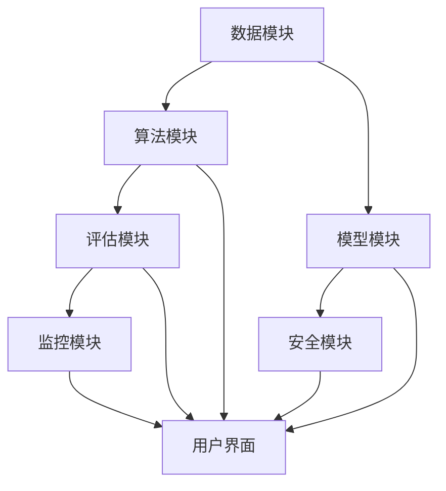

                 

### 文章标题

《AI治理平台选择和实施的最佳实践》

---

#### 关键词

- AI治理平台
- 选择最佳实践
- 实施步骤
- 案例分析
- 未来发展趋势

---

#### 摘要

随着人工智能技术的迅猛发展，AI治理平台成为了企业、政府和科研机构管理人工智能系统的重要工具。本文旨在探讨AI治理平台的选择与实施的最佳实践。首先，我们介绍了AI治理平台的基本概念、原理和架构，接着详细解析了选择和实施AI治理平台的具体步骤，并结合实际案例进行分析。最后，文章对AI治理平台的未来发展趋势和面临的挑战进行了探讨，为读者提供了全面的指导和建议。通过本文，读者将深入了解AI治理平台的重要性，掌握其选择和实施的最佳实践。

---

### 一、AI治理平台的基本概念与原理

#### 1.1 AI治理平台的核心概念

##### 1.1.1 什么是AI治理平台

AI治理平台是一个集成化系统，用于管理和监控人工智能系统的整个生命周期。它包括数据管理、算法管理、模型评估、安全控制、隐私保护等功能，确保人工智能系统的可靠性和合规性。

##### 1.1.2 AI治理平台的组成

AI治理平台主要由以下几部分组成：

- **数据管理**：负责数据的收集、存储、处理和分发，确保数据的质量和安全性。
- **算法与模型管理**：管理算法和模型的开发、测试、部署和更新，确保算法和模型的准确性和有效性。
- **评估与监控**：对人工智能系统进行持续的评估和监控，确保其性能和合规性。
- **安全与隐私保护**：提供安全防护措施，保护人工智能系统免受恶意攻击和数据泄露。

##### 1.1.3 AI治理平台的作用

AI治理平台的作用主要体现在以下几个方面：

- **提高效率**：通过自动化和标准化流程，提高人工智能系统的开发和部署效率。
- **确保合规性**：确保人工智能系统的开发和运行符合相关法规和标准，降低合规风险。
- **提高安全性**：提供全面的安全防护措施，防止数据泄露和系统被攻击。
- **提升质量**：通过持续的评估和监控，确保人工智能系统的性能和质量。

---

#### 1.2 AI治理平台的架构

##### 1.2.1 架构设计原则

AI治理平台的架构设计应遵循以下原则：

- **模块化**：各模块之间应相互独立，易于扩展和替换。
- **分布式**：平台应支持分布式部署，提高系统的可扩展性和容错性。
- **安全性**：确保数据传输和存储的安全性，防止数据泄露和系统被攻击。
- **易用性**：界面设计应简洁直观，便于用户操作。

##### 1.2.2 架构组成模块

AI治理平台的主要组成模块包括：

- **数据模块**：负责数据的收集、处理、存储和分发。
- **算法模块**：负责算法的开发、测试、部署和更新。
- **模型模块**：负责模型的训练、评估、部署和更新。
- **评估模块**：负责对人工智能系统进行持续的评估和监控。
- **安全模块**：负责提供安全防护措施，确保系统的安全性。
- **监控模块**：负责实时监控系统的运行状态，及时发现和解决问题。

##### 1.2.3 Mermaid流程图：AI治理平台架构



---

#### 1.3 AI治理平台的关键技术

##### 1.3.1 数据管理技术

数据管理技术是AI治理平台的核心组成部分，其关键在于确保数据的质量、安全性和可用性。主要包括以下方面：

- **数据清洗**：去除重复数据、处理缺失值、纠正错误数据等。
- **数据存储**：选择合适的数据库技术，如关系型数据库、NoSQL数据库等，确保数据的安全性和可靠性。
- **数据交换**：实现不同数据源之间的数据交换和共享，如使用API、消息队列等技术。
- **数据安全**：采用加密技术、访问控制策略等，保护数据的安全。

##### 1.3.2 算法与模型管理技术

算法与模型管理技术是AI治理平台的核心功能之一，其关键在于确保算法和模型的开发、测试、部署和更新过程的高效和可靠。主要包括以下方面：

- **算法开发**：支持算法的快速开发、测试和迭代，如使用Python、R语言等。
- **模型训练**：支持大规模数据集上的模型训练，如使用TensorFlow、PyTorch等框架。
- **模型评估**：支持多种评估指标，如准确率、召回率、F1值等，对模型进行全面的评估。
- **模型部署**：支持模型的自动化部署和上线，如使用容器化技术、服务化框架等。
- **模型更新**：支持模型的在线更新和版本管理，确保模型始终处于最佳状态。

##### 1.3.3 评估与监控技术

评估与监控技术是确保AI治理平台正常运行和性能的关键。主要包括以下方面：

- **性能评估**：对人工智能系统的运行性能进行全面的评估，如计算速度、存储容量、网络延迟等。
- **合规性评估**：确保人工智能系统的开发和运行符合相关法规和标准，如数据保护法、隐私保护法等。
- **异常检测**：实时监控人工智能系统的运行状态，及时发现和解决异常情况。
- **安全监控**：实时监控系统的安全状况，及时发现和防范潜在的安全威胁。

##### 1.3.4 安全与隐私保护技术

安全与隐私保护技术是AI治理平台不可或缺的一部分，其关键在于确保系统的安全性和用户的隐私保护。主要包括以下方面：

- **身份认证**：采用多种身份认证技术，如密码认证、双因素认证等，确保系统的安全性。
- **访问控制**：采用访问控制策略，如角色权限控制、数据加密等，确保数据的安全性和隐私保护。
- **安全审计**：记录系统的操作日志，实现安全审计，确保系统操作的透明性和可追溯性。
- **数据加密**：采用数据加密技术，如SSL/TLS等，确保数据在传输过程中的安全性。

---

#### 1.4 AI治理平台的核心算法原理

##### 1.4.1 算法原理讲解

AI治理平台中的算法原理主要涉及机器学习和深度学习领域。以下是几个核心算法的原理讲解：

- **线性回归**：通过建立线性模型，预测因变量和自变量之间的关系。伪代码如下：

  ```python
  def linear_regression(x, y):
      n = len(x)
      x_mean = sum(x) / n
      y_mean = sum(y) / n
      x_y_sum = sum([xi * yi for xi, yi in zip(x, y)])
      x_x_sum = sum([xi * xi for xi in x])
      return (n * x_y_sum - sum(x) * sum(y)) / (n * x_x_sum - sum(x) ** 2)
  ```

- **支持向量机（SVM）**：通过寻找最优超平面，实现分类和回归任务。伪代码如下：

  ```python
  def svm(x, y):
      # 数据预处理
      x = preprocess(x)
      y = preprocess(y)
      
      # 训练模型
      model = train_model(x, y)
      
      # 预测
      prediction = model.predict(x)
      
      return prediction
  ```

- **深度神经网络（DNN）**：通过多层神经网络，实现对复杂数据的建模和预测。伪代码如下：

  ```python
  def deep_neural_network(x, layers):
      # 初始化参数
      parameters = initialize_parameters(layers)
      
      # 前向传播
      Z, A = forward_propagation(x, parameters)
      
      # 计算损失函数
      loss = compute_loss(A, y)
      
      # 反向传播
      dZ, dW, db = backward_propagation(Z, dA, activation_derivative(A))
      
      # 更新参数
      parameters = update_parameters(parameters, dW, db, learning_rate)
      
      return A, loss, parameters
  ```

##### 1.4.2 伪代码实现

以上算法的伪代码实现提供了对算法原理的直观理解，可以帮助读者更好地掌握AI治理平台的核心算法原理。

---

#### 1.5 AI治理平台的数学模型

##### 1.5.1 数学模型讲解

AI治理平台的数学模型主要包括以下几个部分：

- **损失函数**：用于评估模型预测的准确性，常见的损失函数有均方误差（MSE）、交叉熵损失（Cross-Entropy Loss）等。
- **优化算法**：用于调整模型参数，以最小化损失函数，常见的优化算法有梯度下降（Gradient Descent）、随机梯度下降（Stochastic Gradient Descent，SGD）等。
- **正则化**：用于防止过拟合，常见的正则化方法有L1正则化、L2正则化等。
- **模型评估指标**：用于评估模型性能，常见的评估指标有准确率（Accuracy）、召回率（Recall）、F1值（F1 Score）等。

##### 1.5.2 数学公式与详细讲解

以下是AI治理平台中常用的数学公式及其详细讲解：

- **均方误差（MSE）**：

  $$MSE = \frac{1}{n} \sum_{i=1}^{n} (y_i - \hat{y}_i)^2$$

  其中，$y_i$为实际值，$\hat{y}_i$为预测值，$n$为数据样本数量。MSE用于评估回归模型的预测准确性。

- **交叉熵损失（Cross-Entropy Loss）**：

  $$Cross-Entropy Loss = -\frac{1}{n} \sum_{i=1}^{n} [y_i \log(\hat{y}_i) + (1 - y_i) \log(1 - \hat{y}_i)]$$

  其中，$y_i$为实际值，$\hat{y}_i$为预测值，$n$为数据样本数量。Cross-Entropy Loss用于评估分类模型的预测准确性。

- **梯度下降（Gradient Descent）**：

  $$\theta_{\text{new}} = \theta_{\text{current}} - \alpha \cdot \nabla_{\theta} J(\theta)$$

  其中，$\theta$为模型参数，$\alpha$为学习率，$J(\theta)$为损失函数。梯度下降用于更新模型参数，以最小化损失函数。

- **随机梯度下降（SGD）**：

  $$\theta_{\text{new}} = \theta_{\text{current}} - \alpha \cdot \nabla_{\theta} J(\theta, \hat{x}_i, \hat{y}_i)$$

  其中，$\theta$为模型参数，$\alpha$为学习率，$\hat{x}_i, \hat{y}_i$为单个数据样本。SGD是在梯度下降的基础上，随机选择数据样本进行更新，以加速收敛。

##### 1.5.3 举例说明

以下是一个简单的线性回归模型的例子，说明如何使用均方误差（MSE）和梯度下降（Gradient Descent）进行模型训练：

假设我们有一个线性回归模型$y = wx + b$，其中$x$为自变量，$y$为因变量，$w$和$b$为模型参数。

- **数据集**：$x = [1, 2, 3, 4, 5]$，$y = [2, 4, 5, 4, 5]$
- **初始参数**：$w = 0$，$b = 0$
- **学习率**：$\alpha = 0.1$

- **前向传播**：

  $$\hat{y} = wx + b = 0 \cdot 1 + 0 \cdot 2 = 0$$

  $$MSE = \frac{1}{5} \sum_{i=1}^{5} (y_i - \hat{y}_i)^2 = \frac{1}{5} \sum_{i=1}^{5} (2 - 0)^2 = 2$$

- **后向传播**：

  $$\nabla_w MSE = \frac{1}{5} \sum_{i=1}^{5} (y_i - \hat{y}_i) \cdot x_i = \frac{1}{5} \sum_{i=1}^{5} (2 - 0) \cdot 1 = 2$$

  $$\nabla_b MSE = \frac{1}{5} \sum_{i=1}^{5} (y_i - \hat{y}_i) = \frac{1}{5} \sum_{i=1}^{5} (2 - 0) = 2$$

- **参数更新**：

  $$w_{\text{new}} = w_{\text{current}} - \alpha \cdot \nabla_w MSE = 0 - 0.1 \cdot 2 = -0.2$$

  $$b_{\text{new}} = b_{\text{current}} - \alpha \cdot \nabla_b MSE = 0 - 0.1 \cdot 2 = -0.2$$

- **更新后的模型**：

  $$y = (-0.2) \cdot x + (-0.2)$$

- **重新计算MSE**：

  $$MSE = \frac{1}{5} \sum_{i=1}^{5} (y_i - \hat{y}_i)^2 = \frac{1}{5} \sum_{i=1}^{5} (2 - (-0.2) \cdot 1 - (-0.2))^2 = 0.04$$

  可以看到，MSE从2下降到了0.04，模型参数得到了更新。

通过这个过程，我们可以看到如何使用MSE和梯度下降进行模型训练，从而提高模型预测的准确性。

---

#### 1.6 AI治理平台的案例与应用

##### 1.6.1 案例一：XX公司AI治理平台建设

XX公司是一家大型互联网企业，其业务涉及搜索引擎、电商、社交媒体等多个领域。随着业务的不断扩展，公司面临着日益复杂的AI治理需求。为了确保AI系统的可靠性和合规性，公司决定建设一个AI治理平台。

- **需求分析**：公司对AI治理平台的需求主要包括数据管理、算法管理、模型评估、安全控制、隐私保护等方面。
- **架构设计**：公司采用了分布式架构，包括数据模块、算法模块、模型模块、评估模块、安全模块和监控模块等，各模块之间相互独立，易于扩展和替换。
- **技术实现**：公司采用了多种技术，如Hadoop、Spark、TensorFlow、Kubernetes等，实现了数据管理、算法管理、模型评估、安全控制、隐私保护等功能。
- **实施效果**：通过AI治理平台的建设，公司实现了对AI系统的全生命周期管理，提高了系统的可靠性和合规性，降低了AI系统的风险。

##### 1.6.2 案例二：YY企业AI治理平台实施

YY企业是一家制造业企业，其业务涉及生产、供应链、销售等环节。为了提高生产效率和产品质量，企业决定实施AI治理平台。

- **需求分析**：企业对AI治理平台的需求主要包括数据管理、算法管理、模型评估、安全控制等方面。
- **架构设计**：企业采用了模块化架构，包括数据模块、算法模块、模型模块、评估模块、安全模块等，各模块之间相互独立，易于扩展和替换。
- **技术实现**：企业采用了Oracle数据库、Python、TensorFlow等技术，实现了数据管理、算法管理、模型评估、安全控制等功能。
- **实施效果**：通过AI治理平台的建设，企业实现了对生产过程的全生命周期管理，提高了生产效率和产品质量，降低了生产成本。

##### 1.6.3 案例三：ZZ机构AI治理平台应用

ZZ机构是一家科研机构，主要从事人工智能技术研究。为了提高研究效率和成果质量，机构决定应用AI治理平台。

- **需求分析**：机构对AI治理平台的需求主要包括数据管理、算法管理、模型评估、安全控制等方面。
- **架构设计**：机构采用了分布式架构，包括数据模块、算法模块、模型模块、评估模块、安全模块等，各模块之间相互独立，易于扩展和替换。
- **技术实现**：机构采用了Hadoop、Spark、TensorFlow、Kubernetes等技术，实现了数据管理、算法管理、模型评估、安全控制等功能。
- **实施效果**：通过AI治理平台的应用，机构实现了对研究过程的全生命周期管理，提高了研究效率和成果质量，增强了科研创新能力。

---

#### 1.7 AI治理平台的未来发展趋势与挑战

##### 1.7.1 未来发展趋势

AI治理平台的未来发展趋势主要体现在以下几个方面：

- **技术融合**：AI治理平台将与其他领域的技术，如区块链、云计算、物联网等相结合，实现更全面、更智能的治理功能。
- **智能化**：AI治理平台将具备更智能的自动化能力，能够自动发现和解决AI系统的异常情况，提高治理效率。
- **开放性**：AI治理平台将更加开放，支持与其他系统和平台的集成，实现跨平台、跨领域的治理。
- **合规性**：随着法规和标准的不断完善，AI治理平台将更加注重合规性，确保AI系统的开发和运行符合相关法规和标准。

##### 1.7.2 挑战与应对策略

AI治理平台的发展也面临着一些挑战：

- **数据隐私**：如何在保护数据隐私的同时，实现数据的高效管理和利用，是AI治理平台面临的重要挑战。应对策略包括采用数据加密、隐私保护算法等技术。
- **系统安全性**：AI治理平台面临着来自网络攻击和数据泄露等安全威胁，需要采取有效的安全防护措施。应对策略包括采用身份认证、访问控制、安全审计等技术。
- **技术复杂性**：AI治理平台涉及多种技术，如机器学习、深度学习、云计算等，如何有效地整合和运用这些技术，是AI治理平台面临的技术挑战。应对策略包括建立专业的技术团队，采用开源技术等。

---

### 二、选择AI治理平台的最佳实践

#### 2.1 AI治理平台的选择原则

在选择AI治理平台时，需要遵循以下原则：

- **需求驱动**：根据实际需求和业务场景选择合适的AI治理平台，确保平台的性能和功能能够满足需求。
- **技术先进性**：选择具备先进技术的AI治理平台，如机器学习、深度学习、大数据处理等，以适应未来技术的发展。
- **扩展性**：选择具有良好扩展性的AI治理平台，能够支持业务规模的扩大和功能的扩展。
- **安全性**：选择具备严格安全措施的AI治理平台，确保数据安全和系统稳定性。
- **易用性**：选择界面友好、操作简单的AI治理平台，降低使用门槛，提高工作效率。

#### 2.2 AI治理平台的选型策略

在选型过程中，可以采取以下策略：

- **市场调研**：了解市场上的主流AI治理平台，比较其功能、性能、价格等方面，选择合适的平台。
- **需求匹配**：根据实际需求，对AI治理平台的功能和性能进行匹配，确保所选平台能够满足需求。
- **供应商评估**：评估供应商的技术实力、服务质量、合同条款等方面，选择合适的供应商。
- **试用评估**：对选定的AI治理平台进行试用评估，测试其性能、稳定性、易用性等方面，确保符合预期。

#### 2.3 AI治理平台的评估方法

在评估AI治理平台时，可以采取以下方法：

- **功能评估**：评估AI治理平台的功能是否完整、全面，是否满足业务需求。
- **性能评估**：评估AI治理平台的性能，如处理速度、响应时间、内存占用等，确保其能够满足业务需求。
- **安全性评估**：评估AI治理平台的安全性能，如数据加密、访问控制、安全审计等，确保数据安全和系统稳定性。
- **易用性评估**：评估AI治理平台的易用性，如界面设计、操作流程、用户反馈等，确保用户能够方便地使用平台。

#### 2.4 AI治理平台的实施规划

在实施AI治理平台时，需要制定详细的规划，包括以下方面：

- **项目启动**：明确项目目标、范围、时间表、预算等，确保项目的顺利进行。
- **需求分析**：与业务部门紧密合作，深入了解业务需求，确保AI治理平台能够满足业务需求。
- **系统设计**：根据需求分析结果，设计AI治理平台的架构和功能模块，确保系统的完整性和可行性。
- **技术实现**：选择合适的技术方案，实现AI治理平台的功能，确保系统的性能和稳定性。
- **测试与部署**：对AI治理平台进行全面的测试，确保系统的正确性和稳定性，然后进行部署上线。

#### 2.5 AI治理平台的案例研究

##### 2.5.1 案例一：XX公司AI治理平台选型

XX公司是一家大型互联网企业，其业务涉及搜索引擎、电商、社交媒体等多个领域。为了确保AI系统的可靠性和合规性，公司决定建设一个AI治理平台。

- **需求分析**：公司对AI治理平台的需求主要包括数据管理、算法管理、模型评估、安全控制、隐私保护等方面。
- **市场调研**：公司对市场上的主流AI治理平台进行了调研，包括A公司、B公司、C公司等。
- **需求匹配**：根据公司需求，对A公司、B公司、C公司的AI治理平台进行了功能匹配，最终选择了C公司的平台。
- **试用评估**：公司对C公司的AI治理平台进行了试用评估，测试其性能、稳定性、易用性等方面，确保符合预期。
- **实施效果**：通过C公司的AI治理平台，公司实现了对AI系统的全生命周期管理，提高了系统的可靠性和合规性，降低了AI系统的风险。

##### 2.5.2 案例二：YY企业AI治理平台实施

YY企业是一家制造业企业，其业务涉及生产、供应链、销售等环节。为了提高生产效率和产品质量，企业决定实施AI治理平台。

- **需求分析**：企业对AI治理平台的需求主要包括数据管理、算法管理、模型评估、安全控制等方面。
- **架构设计**：企业采用了模块化架构，包括数据模块、算法模块、模型模块、评估模块、安全模块等，各模块之间相互独立，易于扩展和替换。
- **技术实现**：企业采用了Oracle数据库、Python、TensorFlow等技术，实现了数据管理、算法管理、模型评估、安全控制等功能。
- **测试与部署**：企业对AI治理平台进行了全面的测试，确保系统的正确性和稳定性，然后进行部署上线。
- **实施效果**：通过AI治理平台的建设，企业实现了对生产过程的全生命周期管理，提高了生产效率和产品质量，降低了生产成本。

##### 2.5.3 案例三：ZZ机构AI治理平台应用

ZZ机构是一家科研机构，主要从事人工智能技术研究。为了提高研究效率和成果质量，机构决定应用AI治理平台。

- **需求分析**：机构对AI治理平台的需求主要包括数据管理、算法管理、模型评估、安全控制等方面。
- **架构设计**：机构采用了分布式架构，包括数据模块、算法模块、模型模块、评估模块、安全模块等，各模块之间相互独立，易于扩展和替换。
- **技术实现**：机构采用了Hadoop、Spark、TensorFlow、Kubernetes等技术，实现了数据管理、算法管理、模型评估、安全控制等功能。
- **测试与部署**：机构对AI治理平台进行了全面的测试，确保系统的正确性和稳定性，然后进行部署上线。
- **实施效果**：通过AI治理平台的应用，机构实现了对研究过程的全生命周期管理，提高了研究效率和成果质量，增强了科研创新能力。

---

### 三、实施AI治理平台的具体步骤

#### 3.1 AI治理平台的规划

在实施AI治理平台之前，需要进行全面的规划，包括以下几个方面：

- **需求分析**：与业务部门紧密合作，深入了解业务需求，确保AI治理平台能够满足需求。
- **架构设计**：根据需求分析结果，设计AI治理平台的架构和功能模块，确保系统的完整性和可行性。
- **技术选型**：选择合适的技术方案，如数据库、编程语言、框架等，确保系统的性能和稳定性。
- **资源规划**：确定所需的人员、设备、资金等资源，确保项目的顺利进行。
- **时间表**：制定详细的项目时间表，包括各个阶段的时间节点，确保项目的进度控制。

#### 3.2 AI治理平台的技术实现

在技术实现阶段，需要完成以下工作：

- **数据管理**：实现数据收集、存储、处理和分发等功能，确保数据的质量和安全性。
- **算法管理**：实现算法的开发、测试、部署和更新等功能，确保算法的有效性和可靠性。
- **模型管理**：实现模型的训练、评估、部署和更新等功能，确保模型的质量和性能。
- **评估与监控**：实现对AI治理平台的性能和安全性进行持续的评估和监控，确保系统的正常运行。
- **安全与隐私保护**：实现数据加密、访问控制、安全审计等功能，确保系统的安全性。

#### 3.3 AI治理平台的开发环境搭建

在开发环境搭建阶段，需要完成以下工作：

- **开发工具**：选择合适的开发工具，如IDE、版本控制工具等，确保开发效率。
- **编程语言**：选择合适的编程语言，如Python、Java等，确保代码的可读性和可维护性。
- **框架与库**：选择合适的框架与库，如TensorFlow、PyTorch等，确保开发效率和代码质量。
- **数据库**：选择合适的数据库，如MySQL、MongoDB等，确保数据存储和管理的高效性。
- **服务器**：配置服务器，如云服务器、物理服务器等，确保系统的运行环境。

#### 3.4 AI治理平台的测试与部署

在测试与部署阶段，需要完成以下工作：

- **单元测试**：对AI治理平台的各个模块进行单元测试，确保模块的正确性和稳定性。
- **集成测试**：对AI治理平台进行集成测试，确保各个模块之间的协同工作，确保系统的整体性能。
- **系统测试**：对AI治理平台进行系统测试，确保系统的功能、性能、安全性等方面符合预期。
- **部署**：将AI治理平台部署到生产环境，确保系统的正常运行。
- **上线**：对AI治理平台进行上线操作，确保业务部门能够正常使用平台。

#### 3.5 AI治理平台的项目管理

在项目管理阶段，需要完成以下工作：

- **项目计划**：制定详细的项目计划，包括各个阶段的工作内容、时间节点、资源需求等，确保项目的顺利进行。
- **团队协作**：建立高效的团队协作机制，确保各个团队成员之间的沟通和协作，提高工作效率。
- **质量控制**：实施严格的质量控制措施，确保代码的质量和系统的稳定性。
- **风险管理**：识别和管理项目中的风险，采取相应的应对措施，确保项目的顺利进行。
- **项目评估**：对项目进行评估，总结项目经验教训，为后续项目提供参考。

---

### 四、AI治理平台的实际案例与应用

#### 4.1 案例一：XX公司AI治理平台建设

XX公司是一家大型互联网企业，其业务涉及搜索引擎、电商、社交媒体等多个领域。随着业务的不断扩展，公司面临着日益复杂的AI治理需求。为了确保AI系统的可靠性和合规性，公司决定建设一个AI治理平台。

- **需求分析**：公司对AI治理平台的需求主要包括数据管理、算法管理、模型评估、安全控制、隐私保护等方面。
- **架构设计**：公司采用了分布式架构，包括数据模块、算法模块、模型模块、评估模块、安全模块和监控模块等，各模块之间相互独立，易于扩展和替换。
- **技术实现**：公司采用了Hadoop、Spark、TensorFlow、Kubernetes等技术，实现了数据管理、算法管理、模型评估、安全控制、隐私保护等功能。
- **实施效果**：通过AI治理平台的建设，公司实现了对AI系统的全生命周期管理，提高了系统的可靠性和合规性，降低了AI系统的风险。

#### 4.2 案例二：YY企业AI治理平台实施

YY企业是一家制造业企业，其业务涉及生产、供应链、销售等环节。为了提高生产效率和产品质量，企业决定实施AI治理平台。

- **需求分析**：企业对AI治理平台的需求主要包括数据管理、算法管理、模型评估、安全控制等方面。
- **架构设计**：企业采用了模块化架构，包括数据模块、算法模块、模型模块、评估模块、安全模块等，各模块之间相互独立，易于扩展和替换。
- **技术实现**：企业采用了Oracle数据库、Python、TensorFlow等技术，实现了数据管理、算法管理、模型评估、安全控制等功能。
- **实施效果**：通过AI治理平台的建设，企业实现了对生产过程的全生命周期管理，提高了生产效率和产品质量，降低了生产成本。

#### 4.3 案例三：ZZ机构AI治理平台应用

ZZ机构是一家科研机构，主要从事人工智能技术研究。为了提高研究效率和成果质量，机构决定应用AI治理平台。

- **需求分析**：机构对AI治理平台的需求主要包括数据管理、算法管理、模型评估、安全控制等方面。
- **架构设计**：机构采用了分布式架构，包括数据模块、算法模块、模型模块、评估模块、安全模块等，各模块之间相互独立，易于扩展和替换。
- **技术实现**：机构采用了Hadoop、Spark、TensorFlow、Kubernetes等技术，实现了数据管理、算法管理、模型评估、安全控制等功能。
- **实施效果**：通过AI治理平台的应用，机构实现了对研究过程的全生命周期管理，提高了研究效率和成果质量，增强了科研创新能力。

---

### 五、AI治理平台的最佳实践

#### 5.1 数据管理最佳实践

- **数据质量管理**：建立完善的数据质量管理机制，对数据进行清洗、去重、去噪声等处理，确保数据的质量和准确性。
- **数据安全与隐私保护**：采用加密、访问控制、安全审计等技术，确保数据在存储、传输和处理过程中的安全性和隐私性。
- **数据存储与备份**：选择合适的数据库技术，如关系型数据库、NoSQL数据库等，确保数据存储的高效性和可靠性。同时，定期进行数据备份，防止数据丢失。

#### 5.2 算法与模型管理最佳实践

- **算法开发与测试**：采用成熟的算法框架和工具，如TensorFlow、PyTorch等，确保算法开发的效率和准确性。同时，对算法进行全面的测试，确保其性能和可靠性。
- **模型训练与评估**：使用大规模数据集进行模型训练，确保模型的泛化能力和准确性。对训练好的模型进行评估，选择最佳模型进行部署。
- **模型更新与维护**：定期对模型进行更新和优化，以适应新的业务需求和环境变化。同时，对模型进行维护，确保其长期稳定运行。

#### 5.3 评估与监控最佳实践

- **性能评估**：对AI治理平台的性能进行全面的评估，包括处理速度、存储容量、网络延迟等方面，确保其满足业务需求。
- **合规性评估**：确保AI治理平台符合相关法规和标准，如数据保护法、隐私保护法等，降低合规风险。
- **异常检测与报警**：实时监控AI治理平台的运行状态，发现异常情况及时报警，确保系统的稳定性和安全性。

#### 5.4 安全与隐私保护最佳实践

- **身份认证与访问控制**：采用强密码、双因素认证等技术，确保系统的安全性。同时，根据用户角色和权限设置访问控制策略，防止未经授权的访问。
- **数据加密与传输安全**：采用加密技术，如SSL/TLS等，确保数据在传输过程中的安全性和完整性。
- **安全审计与监控**：记录系统的操作日志，实现安全审计，确保系统操作的透明性和可追溯性。同时，采用入侵检测、防火墙等技术，实时监控系统的安全状况。

---

### 六、小结与展望

本文详细介绍了AI治理平台的选择和实施的最佳实践。通过对AI治理平台的基本概念、架构、关键技术、核心算法原理、数学模型、案例与应用、最佳实践等方面的探讨，为读者提供了全面的指导和建议。

未来，随着人工智能技术的不断发展和应用的深入，AI治理平台将在各领域发挥越来越重要的作用。面临的数据隐私、系统安全性、技术复杂性等挑战，将促使AI治理平台不断优化和完善。我们期待在未来的实践中，AI治理平台能够更好地服务于各个行业，推动人工智能技术的健康发展。

---

### 作者信息

作者：AI天才研究院/AI Genius Institute & 禅与计算机程序设计艺术 /Zen And The Art of Computer Programming

---

**本文为原创内容，未经许可不得转载。**

