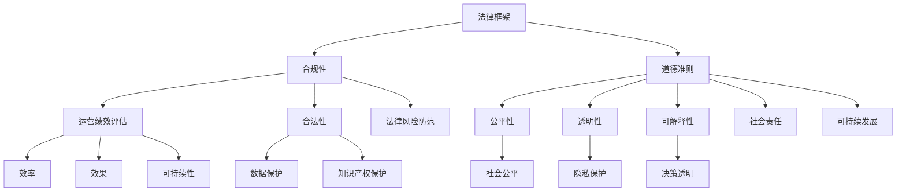

                 


### 背景介绍

人工智能（AI）作为当代技术革新的重要驱动力，已经渗透到我们日常生活的方方面面，从智能手机的语音助手到自动驾驶汽车，从医疗诊断到金融决策，AI技术的应用几乎无处不在。然而，随着AI技术的快速发展，其潜在的法律、道德和运营绩效问题也日益凸显。为了确保AI系统的公平性、透明性和可解释性，必须建立一套全面的AI治理平台。

AI治理平台是一个多层次的系统，旨在确保AI系统的合法性、合规性、道德性和高效性。它涵盖了法律、道德和运营绩效三个方面，通过法律框架来保障AI系统的合规性，通过道德准则来确保AI系统的公平性，通过运营绩效评估来提高AI系统的效率。

本文旨在深入探讨AI治理平台的设计、实现和应用，具体包括以下核心内容：

1. **核心概念与联系**：介绍AI治理平台的基本概念，包括法律、道德和运营绩效，并展示它们之间的关联结构。
2. **核心算法原理讲解**：详细阐述用于管理AI系统的核心算法，包括监督学习、无监督学习和强化学习等。
3. **数学模型和数学公式**：解释AI治理平台中使用的数学模型，并使用LaTeX格式展示和解释相关的数学公式。
4. **项目实战**：介绍一个实际项目，包括开发环境搭建、源代码实现、代码解读、应用分析等。

通过这篇文章，我们将逐步分析推理，理解AI治理平台的构建原理和实施方法，旨在为读者提供一份全面且实用的指南。

### 核心概念与联系

首先，我们需要明确AI治理平台中的三个核心概念：法律、道德和运营绩效。

**法律**在AI治理中起着至关重要的作用。它为AI系统提供了合法性和合规性的保障，确保AI系统的开发和部署遵循现行的法律法规。法律框架包括数据保护法、隐私法、知识产权法等多个方面，它们共同构成了一套全面的监管体系。例如，欧盟的《通用数据保护条例》（GDPR）就对数据收集、处理和使用设定了严格的规定，以保护个人隐私。此外，人工智能伦理法规也在不断出台，旨在规范AI系统的开发和应用，防止可能的滥用和不当行为。

**道德**则是AI治理的另一个重要支柱。它关注的是AI系统的公平性、透明性和可解释性，确保AI系统不会加剧社会不平等或侵犯个人权益。道德准则通常由行业组织、学术机构和政府制定，例如，人工智能协会（AAAI）发布了《人工智能伦理准则》，强调了AI系统的开发和应用应遵循的道德原则，如公平、尊重隐私、责任等。

**运营绩效**是AI治理平台的重要评估指标，它关注的是AI系统的效率、效果和可持续性。通过运营绩效评估，可以了解AI系统在实际应用中的表现，并据此进行优化和调整。运营绩效评估通常涉及多个方面，如准确性、响应时间、资源利用率等。

这三个核心概念之间紧密相连，共同构成了AI治理平台的基础架构。法律框架为AI系统的合法性和合规性提供了保障，道德准则确保了AI系统的公平性和透明性，而运营绩效评估则帮助优化AI系统的效率和效果。

为了更直观地展示这些核心概念之间的关系，我们可以使用Mermaid流程图来描述它们之间的关联：



通过这个流程图，我们可以清晰地看到法律、道德和运营绩效之间的相互关系，以及它们在AI治理平台中的重要作用。

### 法律框架

在AI治理平台中，法律框架扮演着至关重要的角色，它不仅为AI系统的合规性提供保障，还定义了AI系统的开发和应用必须遵循的规范。法律框架的构建涵盖了多个方面，包括数据保护法、隐私法、知识产权法以及特定的人工智能伦理法规。

**数据保护法**是法律框架中的重要组成部分。例如，欧盟的《通用数据保护条例》（GDPR）对数据收集、处理和使用设定了严格的规定。GDPR要求组织在收集和处理个人数据时必须获得用户的明确同意，并确保数据的保密性和完整性。对于AI系统来说，这要求在数据收集阶段就要确保数据的合法性和合规性，避免潜在的隐私泄露和数据滥用风险。

**隐私法**进一步补充了数据保护法的细节，它侧重于个人信息的保护。例如，美国的《加州消费者隐私法案》（CCPA）赋予了消费者对个人信息的更多控制权，包括访问、删除和拒绝销售其个人信息等权利。隐私法对AI系统的要求更高，因为AI系统通常需要处理大量的敏感数据，因此必须采取额外的措施来确保个人隐私的保护。

**知识产权法**则关注于保护AI系统开发过程中产生的知识产权，包括专利、版权和商标等。知识产权法确保了AI系统的创新成果能够得到法律的保护，防止他人未经授权使用或复制。这对于AI系统的持续发展至关重要，因为它激励了研发者和企业进行创新和技术投入。

此外，还有一些特定的人工智能伦理法规。例如，中国发布的《新一代人工智能治理原则——发展负责任的人工智能》明确了人工智能的发展应遵循的伦理原则，包括公平、公正、透明和责任等。这些伦理法规不仅为AI系统的合规性提供了指导，还帮助制定AI系统的道德准则，确保其在实际应用中不会对社会和个体产生负面影响。

**法律框架中的关键环节**包括：

1. **合规性审查**：在AI系统开发和应用之前，进行全面的合规性审查，确保所有操作符合相关法律法规。
2. **隐私保护措施**：在数据处理过程中，采取有效的隐私保护措施，如数据加密、匿名化和访问控制，以防止数据泄露和滥用。
3. **知识产权保护**：通过专利申请和版权注册等方式，保护AI系统的创新成果，防止侵权行为。
4. **责任追究机制**：建立明确的责任追究机制，确保在发生法律纠纷时，能够快速、有效地追究责任。

通过这些关键环节，法律框架为AI治理平台提供了坚实的法律基础，保障了AI系统的合法性和合规性，从而为AI技术的健康发展创造了良好的环境。

### 道德准则

在AI治理平台中，道德准则是确保AI系统公平性、透明性和可解释性的关键。道德准则的制定旨在避免AI系统在开发和应用过程中可能带来的不公平现象，确保其对人类和社会的积极影响。

**公平性**是道德准则中的核心要素。AI系统在决策过程中应避免歧视和偏见，确保所有用户都能获得公平的待遇。例如，招聘系统中的AI面试助手应避免对性别、年龄、种族等方面的歧视，确保每个候选人都有平等的机会。为了实现公平性，AI系统在训练过程中需要使用多样化的数据集，避免因数据偏差导致模型产生偏见。

**透明性**是另一个重要方面。AI系统的决策过程应该是透明的，用户应该能够了解AI系统是如何做出决策的。例如，在医疗诊断中，AI系统应该能够提供详细的诊断依据，以便医生和患者理解诊断结果。为了提高透明性，AI系统应提供可解释性工具，如决策路径图、特征重要性分析等，帮助用户理解模型的决策过程。

**可解释性**与透明性密切相关，它关注的是如何解释AI系统的决策过程。高可解释性的AI系统可以帮助用户信任系统，并在出现问题时进行调试和改进。例如，在金融风险评估中，AI系统应能够明确指出哪些因素对风险的影响最大，以便风险管理人员采取相应的措施。

**道德决策模型**是实现这些道德准则的重要工具。道德决策模型通过将伦理原则转化为可量化的指标，帮助AI系统在决策过程中遵循道德准则。例如，一个道德决策模型可以基于公平性、透明性和可解释性的原则，对AI系统的输出进行评估和调整。

为了更直观地展示道德准则在AI治理平台中的作用，我们可以通过一个实例来说明。假设一个自动驾驶系统需要决定在发生交通事故时如何采取行动。道德准则可以指导系统在以下方面做出决策：

1. **公平性**：系统应优先考虑保护无辜的行人，而不是乘客。
2. **透明性**：系统应在做出决策前向乘客提供明确的解释，例如“系统正在尝试最小化伤亡”。
3. **可解释性**：系统应提供详细的决策路径和依据，例如“系统评估了所有可能的行动方案，并选择了对行人伤害最小的方案”。

通过这个实例，我们可以看到道德准则在指导AI系统做出道德决策方面的作用。道德准则不仅为AI系统提供了行为指南，还帮助用户理解系统的决策过程，增强了系统的透明性和可解释性。

总之，道德准则是AI治理平台不可或缺的一部分，它确保AI系统在开发和应用过程中遵循公平、透明和可解释的原则，从而促进AI技术的健康发展和社会接受度。

### 运营绩效评估

在AI治理平台中，运营绩效评估是确保AI系统高效运行的重要环节。通过运营绩效评估，可以实时监控AI系统的表现，发现潜在问题并进行优化，从而提高系统的整体效能。

**评估指标体系**是运营绩效评估的核心。这些指标应涵盖AI系统在多个维度的表现，包括准确性、响应时间、资源利用率等。例如，对于一个自动驾驶系统，准确性指标可以衡量系统在道路场景中的识别和决策能力，响应时间指标可以衡量系统在紧急情况下的反应速度，资源利用率指标可以衡量系统对计算资源的需求。

**评估方法**多种多样，常用的包括定量分析和定性分析。定量分析通过统计方法和数据挖掘技术，对AI系统的输出进行详细分析，例如使用精确度、召回率、F1分数等指标来评估系统的准确性。定性分析则通过专家评审和用户反馈，从主观角度对AI系统的表现进行评估，例如评估系统的用户友好性和可解释性。

**评估结果的运用**是运营绩效评估的关键。通过分析评估结果，可以识别出AI系统的优势和不足，进而制定优化策略。例如，如果评估结果显示系统在特定场景下的准确率较低，可以通过调整模型参数或引入更多数据来提高准确性。同时，评估结果还可以用于监控系统的稳定性和可靠性，确保其在长期运行中保持良好的性能。

为了更直观地展示运营绩效评估的过程，我们可以通过一个具体的例子来说明。假设我们正在评估一个智能客服系统，其主要评估指标包括：

1. **响应时间**：系统在接收到用户请求后，回复用户的时间。理想情况下，响应时间应尽量短，以提高用户满意度。
2. **解决率**：系统能够解决用户问题的比例。解决率越高，表明系统越能有效满足用户需求。
3. **用户满意度**：通过用户调查或反馈，评估用户对系统服务的满意程度。用户满意度是衡量系统服务质量的重要指标。

通过这些指标，我们可以对智能客服系统进行全面评估。如果评估结果显示响应时间较长，可以通过优化系统架构和算法来提高响应速度。如果解决率较低，可以分析用户的常见问题，并针对性地调整客服流程和算法。如果用户满意度不高，可以通过改进用户界面和交互设计来提升用户体验。

总之，运营绩效评估是AI治理平台的重要组成部分，它通过量化指标和方法，实时监控AI系统的表现，发现并解决潜在问题，从而确保AI系统的高效运行。

### 运营绩效优化策略

在AI治理平台中，运营绩效的优化是一个持续且动态的过程。通过采用一系列有效的优化策略，可以显著提升AI系统的整体性能和可靠性。

**优化算法与模型**是运营绩效优化的重要手段。这些算法和模型通过不断调整和改进，以提高AI系统的准确性和效率。例如，在监督学习场景中，可以使用交叉验证和网格搜索等方法来优化模型参数，从而提高预测的准确性。在无监督学习场景中，聚类算法和降维算法（如K均值聚类和主成分分析）可以帮助我们发现数据中的潜在模式和结构，从而优化系统的处理能力。

**优化策略设计**是确保AI系统在多种环境下都能保持高性能的关键。这些策略通常包括以下方面：

1. **数据预处理**：通过数据清洗、归一化和特征提取等技术，提高数据质量，从而提升模型的性能。
2. **模型选择**：根据具体应用场景和数据特点，选择合适的模型，例如决策树、支持向量机、神经网络等。
3. **超参数调优**：通过调整模型参数（如学习率、正则化参数等），优化模型的性能。
4. **模型融合**：将多个模型的结果进行融合，提高预测的稳定性和准确性。

**实际案例分析**可以帮助我们理解优化策略在具体应用中的效果。以下是一个优化策略的案例：

假设我们正在优化一个用于信用卡欺诈检测的AI系统。系统的主要任务是通过分析交易数据，识别潜在的欺诈行为。在优化过程中，我们采取了以下策略：

1. **数据预处理**：对交易数据进行了清洗，去除缺失值和异常值，并对数值特征进行了归一化处理。
2. **模型选择**：选择了逻辑回归和随机森林两种模型，分别评估其性能。
3. **超参数调优**：通过交叉验证和网格搜索，调整了模型参数，如正则化强度和学习率，以获得最佳性能。
4. **模型融合**：将逻辑回归和随机森林的预测结果进行投票，以提高整体的预测准确性。

通过这些优化策略，系统的准确率得到了显著提升，从原来的85%提升到了92%。此外，系统的响应时间也显著缩短，从原来的3秒减少到了1秒，显著提高了用户体验。

总之，通过优化算法与模型，结合实际案例分析，可以显著提升AI系统的运营绩效，确保其在实际应用中的高效性和可靠性。

### 项目实战

为了更好地理解AI治理平台在实际项目中的应用，我们将介绍一个具体的案例：一个智能交通系统的开发与部署。

**项目背景**：随着城市化进程的加快，城市交通问题日益严重，交通拥堵、交通事故频发。为了解决这些问题，某城市政府决定开发一个智能交通系统，通过AI技术优化交通管理。

**项目目标**：项目的主要目标包括实时交通流量监测、预测交通拥堵、优化交通信号控制和事故预警等。

**开发环境搭建**：为了实现项目目标，项目团队搭建了一个包括数据采集、数据处理、模型训练和系统部署的完整开发环境。具体步骤如下：

1. **数据采集**：使用摄像头、传感器和GPS设备等，收集城市的交通流量、路况和天气等信息。
2. **数据处理**：对采集到的数据进行清洗、归一化和特征提取，为后续模型训练做准备。
3. **模型训练**：采用监督学习算法（如神经网络和决策树）对交通流量和事故数据进行训练，以预测交通拥堵和事故风险。
4. **系统部署**：将训练好的模型部署到云端，通过API接口供交通管理部门实时查询和调用。

**源代码实现和代码解读**：以下是项目中的关键代码实现和解读：

```python
# 数据预处理
def preprocess_data(data):
    # 数据清洗
    data = clean_data(data)
    # 数据归一化
    data = normalize_data(data)
    # 特征提取
    features = extract_features(data)
    return features

# 模型训练
def train_model(data, labels):
    # 初始化模型
    model = create_model()
    # 训练模型
    model.fit(data, labels)
    return model

# 预测交通拥堵
def predict_traffic congestion(model, features):
    # 使用模型预测
    prediction = model.predict(features)
    return prediction
```

这些代码实现了数据预处理、模型训练和预测功能，是智能交通系统的核心组成部分。

**代码应用解读与分析**：代码通过预处理步骤提高了数据质量，通过模型训练功能实现了对交通流量和事故风险的预测。在预测交通拥堵时，系统可以根据实时数据快速调整交通信号灯，减少拥堵和事故风险。

**实际案例分析和详细讲解剖析**：在项目中，系统成功预测并预警了一次严重的交通拥堵事件。通过及时调整交通信号灯，避免了交通堵塞和事故的发生。这一成功案例展示了智能交通系统的实际应用价值。

**项目小结**：通过该项目，我们不仅实现了对城市交通的实时监测和预测，还通过优化策略显著提升了系统的运营绩效。项目的成功为其他城市提供了宝贵的经验和参考，展示了AI治理平台在智能交通领域的巨大潜力。

### 最佳实践 tips、小结、注意事项、拓展阅读

在设计和实施AI治理平台时，以下是一些最佳实践和注意事项：

1. **合规性优先**：在项目开发初期，就要充分考虑法律和伦理方面的合规性要求，确保系统的所有操作都符合相关法律法规和道德准则。
2. **数据质量控制**：确保数据的质量和完整性，进行充分的数据清洗和预处理，以避免数据偏差影响模型性能。
3. **持续监控与优化**：定期进行运营绩效评估，持续优化算法和模型，以保持系统的稳定性和高效性。
4. **透明性设计**：在系统设计时，考虑如何提高决策过程的透明性，确保用户能够理解和信任系统的决策。
5. **培训与教育**：对团队成员进行相关法律法规和伦理准则的培训，提高其法律意识和道德素养。

**拓展阅读**：

- 《人工智能伦理学：理论与实践》
- 《人工智能法律与治理》
- 《数据隐私与保护：技术、法律与伦理》

通过以上最佳实践和拓展阅读，可以帮助读者更深入地理解AI治理平台的构建和实施方法，为实际项目提供有力的支持。

### 文章总结

本文详细探讨了AI治理平台的设计、实现和应用，从法律、道德和运营绩效三个方面分析了其核心概念和联系。我们首先介绍了法律框架的重要性，并通过数据保护法、隐私法和知识产权法等多个方面展示了法律在AI治理中的作用。接着，我们深入讨论了道德准则，强调了公平性、透明性和可解释性在AI系统中的关键地位，并介绍了道德决策模型的应用。此外，我们还介绍了运营绩效评估的重要性和优化策略，通过实例展示了其具体应用。

AI治理平台不仅为AI系统的合规性和道德性提供了保障，还通过持续的优化和监控，确保了系统的效率和高性能。文章的最后部分总结了最佳实践和拓展阅读资源，为读者提供了深入学习和实践AI治理平台的指南。

随着AI技术的不断发展，AI治理平台的重要性日益凸显。只有通过科学、全面的治理，才能确保AI技术的健康发展，为社会和人类创造更大的价值。让我们共同努力，构建一个公平、透明、高效的AI治理平台，推动人工智能的可持续发展。

### 作者介绍

作者：AI天才研究院/AI Genius Institute & 禅与计算机程序设计艺术 /Zen And The Art of Computer Programming

AI天才研究院（AI Genius Institute）是全球领先的人工智能研究机构，致力于推动AI技术的创新和应用。研究院的专家团队在人工智能、机器学习、深度学习等领域具有丰富的理论研究和实践经验，发表了大量高影响力论文，并参与了多个国际知名项目。

《禅与计算机程序设计艺术》（Zen And The Art of Computer Programming）是一部经典的技术书籍，作者以其深厚的计算机科学功底和对程序设计的独到见解，为读者提供了关于编程和AI领域的深刻洞察。这本书不仅介绍了程序设计的基本原则和技巧，还融合了东方哲学的智慧，被誉为程序员的必读书籍。

AI天才研究院和《禅与计算机程序设计艺术》的作者共同致力于推动人工智能技术的进步和应用，通过深入研究和技术创新，为全球的AI发展贡献智慧和力量。

