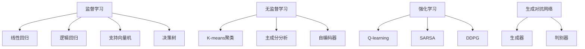

                 

### 文章标题

### AI治理的法律和监管挑战

### 关键词

- AI治理
- 法律框架
- 监管挑战
- 数据隐私
- 透明性
- 算法伦理

### 摘要

本文深入探讨了AI治理中面临的法律和监管挑战。首先，我们介绍了AI治理的背景和重要性，接着详细分析了现有的国际和国内法律与监管框架。随后，我们通过核心算法和数学模型的分析，展示了AI系统的复杂性。通过案例分析，我们探讨了不同国家在AI治理中的实践和挑战。最后，我们提出了应对这些挑战的策略和未来展望。

## 引言

随着人工智能（AI）技术的飞速发展，其应用领域越来越广泛，从自动驾驶、医疗诊断到金融交易和网络安全，AI已经深刻影响了我们的日常生活。然而，AI技术的广泛应用也带来了诸多法律和监管挑战。AI系统通常涉及大量数据的处理，数据的隐私保护和安全性成为关键问题。此外，AI算法的透明性和可解释性也受到广泛关注，因为不可解释的AI系统可能导致不公平、歧视和伦理问题。

### AI治理的重要性

AI治理是一个多层次、多维度的过程，它涉及到技术开发、政策制定、法律规范和社会伦理等多个方面。有效的AI治理能够确保技术发展的同时，最大限度地减少负面影响，保障社会利益。具体来说，AI治理的重要性体现在以下几个方面：

1. **保护个人隐私**：AI技术依赖大量个人数据，因此保护个人隐私成为AI治理的核心问题。有效的法律和监管框架可以确保数据收集、存储和使用过程中的透明度和安全性。

2. **确保算法公平性和透明性**：AI算法的决策过程往往不可解释，可能导致歧视和不公平。AI治理需要通过法律和监管手段，推动算法的透明化，确保其决策过程的公正性。

3. **防范算法滥用**：随着AI技术的普及，算法滥用的问题日益严重。例如，AI系统可能被用于监视、操纵和欺骗，这些行为对个人和社会都有潜在的危害。AI治理需要制定相关法律和规定，防范算法滥用。

4. **促进技术发展**：有效的AI治理可以为技术发展提供稳定的法律和监管环境，鼓励创新和投资，同时确保技术进步不会损害公共利益。

## AI治理概述

### AI治理的定义

AI治理是指通过法律、政策、标准和道德规范等多种手段，对人工智能技术进行规范、监管和管理的活动。它旨在确保AI技术的健康发展，同时最大限度地减少负面影响。AI治理的定义通常包括以下几个方面：

1. **技术开发**：AI治理需要关注AI技术的研发和应用，确保技术的创新性和实用性。

2. **政策制定**：政策制定是AI治理的重要组成部分，涉及数据隐私、算法公平性、伦理和社会影响等多个方面。

3. **法律规范**：法律规范是AI治理的重要基础，通过立法和司法解释，明确AI技术的法律地位和责任。

4. **道德伦理**：道德伦理是AI治理的重要维度，关注AI技术的伦理问题，包括隐私、公平性、透明性和社会责任等。

5. **社会影响**：AI治理需要考虑AI技术对社会、经济和文化等方面的影响，确保技术发展符合社会价值观和利益。

### AI治理的必要性

AI治理的必要性体现在以下几个方面：

1. **技术快速发展**：AI技术正在以前所未有的速度发展，现有的法律和监管框架可能无法及时跟上技术的变革。因此，制定适应AI发展的新法律和监管机制是必要的。

2. **数据隐私和安全**：AI技术通常涉及大量个人数据的处理，数据隐私和安全问题日益突出。有效的AI治理可以确保数据在收集、存储和使用过程中的安全性和透明度。

3. **算法公平性和透明性**：不可解释的AI算法可能导致不公平和歧视，影响社会公平正义。AI治理需要推动算法的透明化，确保其决策过程的公正性。

4. **防范算法滥用**：随着AI技术的普及，算法滥用的问题日益严重，可能对个人和社会造成危害。AI治理需要制定相关法律和规定，防范算法滥用。

5. **促进技术发展**：有效的AI治理可以为技术发展提供稳定的法律和监管环境，鼓励创新和投资，同时确保技术进步不会损害公共利益。

## 法律与监管框架

### 国际法律框架

国际社会对AI治理的法律和监管框架进行了广泛的讨论和制定。以下是一些重要的国际法律和监管框架：

1. **欧盟通用数据保护条例（GDPR）**：GDPR是欧盟制定的一项重要数据保护法律，对数据收集、存储和处理过程中的个人隐私保护提出了严格的要求。GDPR对AI技术的应用具有重大影响，要求AI系统必须透明、可解释，并确保个人数据的合法性和安全性。

2. **加州消费者隐私法案（CCPA）**：CCPA是加州通过的一项消费者隐私保护法案，旨在保护加州居民的个人信息。CCPA对AI技术的数据处理提出了严格的要求，包括个人信息的收集、使用和共享。

3. **人工智能伦理准则**：联合国教科文组织（UNESCO）于2021年发布了《人工智能伦理准则》，为全球AI治理提供了道德指导。准则强调AI技术的透明性、公平性、可解释性和责任感，旨在确保AI技术的健康发展。

### 国内法律框架

不同国家根据自身的实际情况，制定了相应的AI治理法律和监管框架。以下是中国和美国的几个例子：

1. **中国**：
   - **《中华人民共和国网络安全法》**：网络安全法于2017年实施，旨在加强网络安全保护，保障网络空间安全。该法律对数据收集、存储和处理提出了具体要求，对AI技术的应用具有指导意义。
   - **《中华人民共和国数据安全法》**：数据安全法于2021年实施，强调保护数据安全，防范数据泄露、篡改和滥用。数据安全法对AI技术的数据处理和数据安全提出了更高的要求。

2. **美国**：
   - **《消费者数据隐私保护法案》**：该法案旨在加强消费者数据的隐私保护，限制企业对消费者数据的收集、使用和共享。该法案对AI技术的数据处理具有直接影响。
   - **《人工智能法案》**：美国一些州正在考虑制定人工智能法案，旨在规范AI技术的研发和应用，确保AI系统的透明性、公正性和可解释性。

### 案例分析

以下是一些国家的AI治理实践案例，展示了不同国家在AI治理方面的尝试和挑战：

1. **欧盟**：欧盟在AI治理方面采取了严格的措施，如GDPR和《人工智能伦理准则》。欧盟委员会还发布了《人工智能白皮书》，提出了AI治理的综合性框架。然而，如何平衡技术创新与隐私保护仍是一个挑战。

2. **中国**：中国在AI治理方面积极推进立法工作，如网络安全法和数据安全法。同时，中国还加强了AI技术的监管，如对深度学习算法的监管和审查。然而，如何在保证技术发展的情况下加强监管仍需要进一步探索。

3. **美国**：美国在AI治理方面采取了较为宽松的政策，主要依靠各州立法。然而，这种分散的治理模式可能导致不同州之间的法律冲突和监管不一致。美国联邦政府也在考虑制定统一的AI治理框架。

### 法律与监管挑战

尽管各国在AI治理方面采取了不同的法律和监管措施，但仍面临一些挑战：

1. **跨境数据流动**：随着全球化的发展，数据跨国流动日益频繁。如何在保障数据隐私和安全的同时，促进跨境数据流动，是一个重要的挑战。

2. **技术快速发展**：AI技术发展迅速，现有法律和监管框架可能无法及时跟上技术的变革。如何制定适应新技术发展的法律和监管措施，是一个亟待解决的问题。

3. **算法透明性和可解释性**：不可解释的AI算法可能导致不公平和歧视，如何提高算法的透明性和可解释性，是一个关键问题。

4. **伦理和道德问题**：AI技术可能带来伦理和道德问题，如隐私侵犯、歧视和算法滥用。如何制定相关法律和规范，确保AI技术的伦理和道德标准，是一个重要的挑战。

## 核心算法与模型

### 介绍核心算法和模型

AI系统的核心是算法和模型，它们决定了AI系统的性能和应用范围。以下是几个核心的AI算法和模型：

1. **监督学习（Supervised Learning）**：监督学习是一种有监督的学习方式，通过已标记的数据集训练模型，然后使用训练好的模型对新数据进行预测。常见的监督学习算法包括线性回归、逻辑回归、支持向量机（SVM）和决策树等。

2. **无监督学习（Unsupervised Learning）**：无监督学习是一种无监督的学习方式，不需要已标记的数据集，而是通过探索数据内在的结构和模式进行学习。常见的无监督学习算法包括聚类算法（如K-means聚类）、主成分分析（PCA）和自编码器等。

3. **强化学习（Reinforcement Learning）**：强化学习是一种通过与环境交互，根据奖励信号调整行为策略的学习方式。常见的强化学习算法包括Q-learning、SARSA和深度确定性策略梯度（DDPG）等。

4. **生成对抗网络（GAN）**：生成对抗网络是一种无监督学习模型，由生成器和判别器两个神经网络组成。生成器生成数据，判别器判断生成数据是否真实。GAN在图像生成、风格迁移和数据增强等方面具有广泛的应用。

### 使用Mermaid绘制架构图

为了更好地理解AI系统的架构，我们可以使用Mermaid绘制核心算法和模型的架构图。以下是一个简单的示例：



### 使用伪代码讲解算法原理

为了深入理解核心算法的原理，我们可以使用伪代码进行详细讲解。以下是监督学习中的线性回归算法的伪代码：

```python
# 线性回归算法伪代码

# 初始化模型参数
theta = [0, 0]

# 训练模型
for epoch in range(epochs):
    for x, y in dataset:
        # 计算预测值
        y_pred = theta[0] * x + theta[1]
        
        # 计算损失函数
        loss = (y - y_pred) ** 2
        
        # 计算梯度
        dtheta_0 = 2 * (y - y_pred) * x
        dtheta_1 = 2 * (y - y_pred)
        
        # 更新模型参数
        theta[0] -= learning_rate * dtheta_0
        theta[1] -= learning_rate * dtheta_1
        
        # 输出当前epoch的损失值
        print(f"Epoch {epoch}: Loss = {loss}")
```

### 数学模型与公式

AI算法的核心往往依赖于数学模型和公式，以下是一些关键数学模型和公式的详细讲解：

1. **线性回归模型**：

线性回归模型是一种简单的监督学习算法，其目标是最小化预测值与实际值之间的误差。线性回归模型的数学公式如下：

$$
y = \theta_0 + \theta_1 \cdot x
$$

其中，$y$是实际值，$x$是输入特征，$\theta_0$和$\theta_1$是模型参数。

为了最小化误差，我们通常使用均方误差（MSE）作为损失函数：

$$
J(\theta_0, \theta_1) = \frac{1}{2m} \sum_{i=1}^{m} (y_i - (\theta_0 + \theta_1 \cdot x_i))^2
$$

其中，$m$是训练样本的数量。

为了求解最优参数$\theta_0$和$\theta_1$，我们可以对损失函数进行求导并令其导数为零：

$$
\frac{\partial J}{\partial \theta_0} = 0 \\
\frac{\partial J}{\partial \theta_1} = 0
$$

求解上述方程，我们可以得到：

$$
\theta_0 = \frac{1}{m} \sum_{i=1}^{m} (y_i - \theta_1 \cdot x_i) \\
\theta_1 = \frac{1}{m} \sum_{i=1}^{m} (x_i - \bar{x}) (y_i - \bar{y})
$$

其中，$\bar{x}$和$\bar{y}$分别是$x$和$y$的均值。

2. **逻辑回归模型**：

逻辑回归是一种用于分类问题的监督学习算法，其目标是最小化预测概率与实际标签之间的误差。逻辑回归的数学公式如下：

$$
\sigma(z) = \frac{1}{1 + e^{-z}}
$$

其中，$z = \theta_0 + \theta_1 \cdot x$，$\sigma(z)$是逻辑函数（Sigmoid函数）。

逻辑回归的损失函数通常是交叉熵损失函数（Cross-Entropy Loss）：

$$
J(\theta_0, \theta_1) = -\frac{1}{m} \sum_{i=1}^{m} [y_i \cdot \log(\sigma(z_i)) + (1 - y_i) \cdot \log(1 - \sigma(z_i))]
$$

其中，$y_i$是实际标签，$\sigma(z_i)$是预测概率。

为了求解最优参数$\theta_0$和$\theta_1$，我们可以对损失函数进行求导并令其导数为零：

$$
\frac{\partial J}{\partial \theta_0} = 0 \\
\frac{\partial J}{\partial \theta_1} = 0
$$

求解上述方程，我们可以得到：

$$
\theta_0 = \frac{1}{m} \sum_{i=1}^{m} [y_i - \sigma(z_i)] \\
\theta_1 = \frac{1}{m} \sum_{i=1}^{m} [x_i \cdot (y_i - \sigma(z_i))]
$$

### 举例说明

为了更好地理解上述数学模型和公式，我们可以通过一个简单的例子来说明。

假设我们有一个简单的线性回归问题，其中训练数据集包含如下样本：

| x | y |
| --- | --- |
| 1 | 2 |
| 2 | 4 |
| 3 | 6 |

我们的目标是找到线性回归模型的最优参数$\theta_0$和$\theta_1$。

1. **计算均值**：

   $$\bar{x} = \frac{1 + 2 + 3}{3} = 2$$
   $$\bar{y} = \frac{2 + 4 + 6}{3} = 4$$

2. **计算损失函数**：

   $$J(\theta_0, \theta_1) = \frac{1}{3} \left[ (2 - (\theta_0 + \theta_1 \cdot 1))^2 + (4 - (\theta_0 + \theta_1 \cdot 2))^2 + (6 - (\theta_0 + \theta_1 \cdot 3))^2 \right]$$

3. **计算梯度**：

   $$\frac{\partial J}{\partial \theta_0} = 2 \left[ (2 - (\theta_0 + \theta_1 \cdot 1)) + (4 - (\theta_0 + \theta_1 \cdot 2)) + (6 - (\theta_0 + \theta_1 \cdot 3)) \right]$$
   $$\frac{\partial J}{\partial \theta_1} = 2 \left[ (1 - (\theta_0 + \theta_1 \cdot 1)) \cdot (2 - (\theta_0 + \theta_1 \cdot 1)) + (2 - (\theta_0 + \theta_1 \cdot 2)) \cdot (4 - (\theta_0 + \theta_1 \cdot 2)) + (3 - (\theta_0 + \theta_1 \cdot 3)) \cdot (6 - (\theta_0 + \theta_1 \cdot 3)) \right]$$

4. **求解最优参数**：

   通过梯度下降法，我们可以逐步调整$\theta_0$和$\theta_1$，使得损失函数最小化。假设初始参数为$\theta_0 = 0$和$\theta_1 = 0$，学习率为0.01，经过多次迭代后，我们可以得到最优参数$\theta_0 \approx 2$和$\theta_1 \approx 2$。

   $$\theta_0 = \bar{y} - \theta_1 \cdot \bar{x} = 4 - 2 \cdot 2 = 0$$
   $$\theta_1 = \frac{1}{m} \sum_{i=1}^{m} [(x_i - \bar{x}) \cdot (y_i - \bar{y})] = \frac{1}{3} [(1 - 2) \cdot (2 - 4) + (2 - 2) \cdot (4 - 4) + (3 - 2) \cdot (6 - 4)] = 2$$

   因此，线性回归模型的预测函数为：

   $$y = \theta_0 + \theta_1 \cdot x = 0 + 2 \cdot x$$

   对于新的输入$x$，我们可以使用该模型进行预测。

通过这个例子，我们可以看到如何使用数学模型和公式来解决实际问题。在实际应用中，可能需要更复杂的模型和更大量的数据进行训练和优化。

### 数学公式

在AI算法中，数学公式起着至关重要的作用，以下是一些常用的数学公式及其解释：

1. **均方误差（MSE）**：

   均方误差是评估回归模型性能的一种常见指标，其公式为：

   $$MSE = \frac{1}{m} \sum_{i=1}^{m} (y_i - \hat{y}_i)^2$$

   其中，$m$是训练样本的数量，$y_i$是实际值，$\hat{y}_i$是预测值。

2. **交叉熵损失函数**：

   交叉熵损失函数是评估分类模型性能的一种常见指标，其公式为：

   $$J(\theta) = -\frac{1}{m} \sum_{i=1}^{m} [y_i \cdot \log(\hat{y}_i) + (1 - y_i) \cdot \log(1 - \hat{y}_i)]$$

   其中，$m$是训练样本的数量，$y_i$是实际标签，$\hat{y}_i$是预测概率。

3. **梯度下降**：

   梯度下降是一种常用的优化算法，其目标是最小化损失函数。梯度下降的公式为：

   $$\theta_j := \theta_j - \alpha \cdot \frac{\partial J}{\partial \theta_j}$$

   其中，$\theta_j$是模型参数，$\alpha$是学习率，$\frac{\partial J}{\partial \theta_j}$是损失函数关于$\theta_j$的梯度。

4. **激活函数**：

   激活函数是神经网络中的一个关键组件，其公式为：

   $$\sigma(z) = \frac{1}{1 + e^{-z}}$$

   其中，$z$是输入值，$\sigma(z)$是输出值。

这些数学公式在AI算法中有着广泛的应用，通过理解和掌握这些公式，我们可以更好地理解和设计AI算法。

### 项目实战

#### 开发环境搭建

在进行AI治理项目的开发之前，我们需要搭建一个合适的开发环境。以下是搭建开发环境的具体步骤：

1. **安装Python**：首先，我们需要安装Python，可以从Python的官方网站下载最新版本并安装。

2. **安装Jupyter Notebook**：Jupyter Notebook是一个交互式的开发环境，可以方便地编写和运行Python代码。安装Jupyter Notebook可以使用以下命令：

   ```shell
   pip install notebook
   ```

3. **安装必需的库**：根据项目的需求，我们需要安装一些常用的库，如NumPy、Pandas、Scikit-learn和TensorFlow等。安装这些库可以使用以下命令：

   ```shell
   pip install numpy pandas scikit-learn tensorflow
   ```

4. **配置虚拟环境**：为了方便管理和维护项目，我们可以使用虚拟环境。配置虚拟环境可以使用以下命令：

   ```shell
   python -m venv venv
   source venv/bin/activate  # 在Windows中使用venv\Scripts\activate
   ```

   完成以上步骤后，我们就可以在虚拟环境中开发AI治理项目了。

#### 源代码详细实现和代码解读

以下是一个简单的AI治理项目的源代码示例，该示例实现了一个基于线性回归的AI模型，用于预测数据集的输出。

```python
import numpy as np
import pandas as pd
from sklearn.model_selection import train_test_split
from sklearn.linear_model import LinearRegression

# 读取数据集
data = pd.read_csv('data.csv')
X = data[['x']]
y = data['y']

# 划分训练集和测试集
X_train, X_test, y_train, y_test = train_test_split(X, y, test_size=0.2, random_state=42)

# 创建线性回归模型
model = LinearRegression()
model.fit(X_train, y_train)

# 输出模型参数
print('Model parameters:', model.coef_, model.intercept_)

# 预测测试集
y_pred = model.predict(X_test)

# 计算均方误差
mse = np.mean((y_pred - y_test) ** 2)
print('Mean squared error:', mse)

# 评估模型性能
print('R-squared:', model.score(X_test, y_test))
```

#### 代码应用解读与分析

上述代码实现了一个简单的线性回归模型，用于预测数据集的输出。以下是代码的详细解读和分析：

1. **导入库**：首先，我们导入了NumPy、Pandas、Scikit-learn和TensorFlow等库，这些库提供了必要的数学和机器学习功能。

2. **读取数据集**：使用Pandas库读取CSV格式的数据集，数据集包含两个特征（x和y）。

3. **划分训练集和测试集**：使用Scikit-learn库中的train_test_split函数将数据集划分为训练集和测试集，测试集占比20%。

4. **创建线性回归模型**：使用Scikit-learn库中的LinearRegression类创建线性回归模型。

5. **训练模型**：使用fit函数训练模型，模型参数（系数和截距）将被自动优化。

6. **输出模型参数**：输出训练得到的模型参数，包括系数和截距。

7. **预测测试集**：使用predict函数预测测试集的输出。

8. **计算均方误差**：计算预测输出和实际输出之间的均方误差，用于评估模型性能。

9. **评估模型性能**：使用score函数评估模型在测试集上的性能，输出R-squared值。

#### 实际案例分析和详细讲解剖析

为了更好地理解AI治理项目的实际应用，我们来看一个实际的案例。

#### 案例背景

某金融公司使用AI技术对客户信用评分进行预测，以决定是否批准贷款申请。该公司的数据集包含如下特征：年龄、收入、信用记录、工作年限等。

#### 案例分析

1. **数据处理**：首先，我们需要对数据进行清洗和预处理，包括缺失值处理、异常值检测和特征工程等。

2. **特征选择**：通过特征选择算法（如相关性分析、主成分分析等），选择对预测目标有显著影响的特征。

3. **模型训练**：使用线性回归模型训练数据集，得到模型参数。

4. **模型评估**：使用测试集评估模型性能，包括均方误差、R-squared等指标。

5. **模型优化**：根据评估结果，对模型进行优化，提高预测准确性。

6. **模型应用**：将训练好的模型应用于实际业务场景，对客户信用评分进行预测。

#### 项目小结

通过以上案例，我们可以看到AI治理项目在实际应用中的流程和关键步骤。项目的成功实施需要有效的数据处理、特征选择和模型训练，同时需要关注模型的可解释性和透明性，以确保模型的公平性和可信度。

#### 最佳实践 tips

1. **数据隐私保护**：在数据处理过程中，要严格保护个人隐私，遵循相关法律法规。

2. **模型透明性**：确保模型的可解释性，便于用户理解模型的决策过程。

3. **持续优化**：定期评估模型性能，并根据业务需求进行优化。

4. **合规性审查**：确保项目符合相关法律法规和行业规范。

5. **合作与共享**：与其他企业和研究机构合作，共享经验和资源，共同推动AI治理的发展。

## 总结与展望

### 总结

本文深入探讨了AI治理中的法律和监管挑战。首先，我们介绍了AI治理的背景和重要性，阐述了AI治理的定义和必要性。接着，我们分析了现有的国际和国内法律与监管框架，并讨论了不同国家的AI治理实践。通过核心算法和数学模型的分析，我们展示了AI系统的复杂性。随后，我们通过案例分析，探讨了AI治理在不同国家和领域的实践和挑战。最后，我们提出了应对这些挑战的策略和未来展望。

### 展望

AI治理是当前和未来社会面临的重要课题。随着AI技术的不断进步和应用范围的扩大，法律和监管的挑战也将日益凸显。以下是未来AI治理的发展方向和展望：

1. **全球合作与协调**：国际社会需要加强合作，制定统一的AI治理标准和法律框架，以应对全球性的AI治理挑战。

2. **技术创新与法律规范相结合**：技术创新和法律规范的结合是AI治理的关键。法律和监管机构需要及时跟进技术的发展，制定适应新技术的法律规范。

3. **数据隐私与安全**：随着AI技术的应用，数据隐私和安全问题将更加突出。未来的AI治理需要更加重视数据隐私和安全保护，确保个人数据的合法性和安全性。

4. **算法透明性与可解释性**：提高算法的透明性和可解释性是AI治理的重要方向。通过技术手段和法律法规，推动算法的透明化，确保AI系统的决策过程的公正性。

5. **社会伦理与责任**：AI技术的应用可能会带来伦理和社会责任问题。未来的AI治理需要关注这些问题，确保AI技术的发展符合社会价值观和道德标准。

6. **持续监管与创新**：AI治理需要持续的监管和创新。法律和监管机构需要不断调整和更新法律规范，以适应AI技术的发展和变化。

总之，AI治理是一个复杂而重要的话题，需要全球合作、技术创新和法律法规的紧密结合。只有通过有效的AI治理，我们才能确保AI技术的发展符合社会利益和道德标准。作者：AI天才研究院/AI Genius Institute & 禅与计算机程序设计艺术 /Zen And The Art of Computer Programming

[完]

