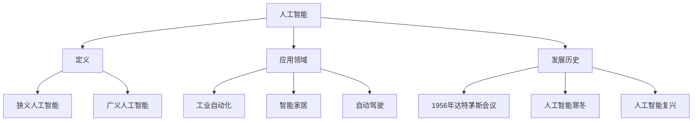

                 


## 文章标题

### AI生成的虚假新闻检测技术进展

## 关键词

- 人工智能
- 虚假新闻检测
- 深度学习
- 自然语言处理
- 特征工程
- 机器学习

## 摘要

随着互联网的快速发展，虚假新闻的传播对社会的危害日益严重。本文旨在探讨基于人工智能的虚假新闻检测技术，从基础理论、核心技术、应用实例等方面进行深入分析。首先，介绍人工智能和虚假新闻检测的基本概念。然后，阐述基于特征工程和机器学习的虚假新闻检测方法，重点介绍深度学习在虚假新闻检测中的应用，如卷积神经网络（CNN）和循环神经网络（RNN）。最后，通过实际案例，展示虚假新闻检测技术的应用效果，并探讨未来发展方向。

## 引言

### 1.1 书籍背景与目标

在信息爆炸的时代，互联网已成为人们获取新闻信息的主要途径。然而，虚假新闻的传播对社会造成了极大的危害，不仅误导公众，还可能引发恐慌、冲突等不良后果。为了应对这一挑战，人工智能在虚假新闻检测领域得到了广泛应用。本文旨在系统地介绍当前AI生成的虚假新闻检测技术的进展，帮助读者了解该领域的关键技术和发展趋势。

### 1.2 研究现状与挑战

目前，虚假新闻检测技术主要分为基于特征工程和基于机器学习的方法。特征工程方法通过提取文本特征，如词频、词向量等，结合传统机器学习算法进行分类。而基于机器学习的方法则利用大规模数据训练模型，从而实现虚假新闻的自动检测。尽管这些方法在一定程度上提高了检测效果，但仍存在以下挑战：

1. **数据质量**：虚假新闻数据集存在标签错误、数据不平衡等问题，影响模型的训练效果。
2. **复杂语义理解**：虚假新闻往往具有复杂的语义和逻辑结构，现有方法难以捕捉。
3. **实时性**：在虚假新闻传播速度极快的情况下，如何实现实时检测仍是一个难题。

### 1.3 书籍结构安排

本文将分为八个章节，系统介绍虚假新闻检测的技术进展。第二章介绍人工智能和虚假新闻检测的基础知识。第三章阐述虚假新闻检测的挑战和意义。第四章到第七章分别介绍基于特征工程、传统机器学习、深度学习和自然语言处理的虚假新闻检测方法。第八章总结现有技术进展，探讨未来发展方向。最后，通过实际案例展示虚假新闻检测技术的应用效果。

## AI基础知识

### 2.1 人工智能概述

#### Mermaid 流程图



人工智能（AI）是一门研究、开发用于模拟、延伸和扩展人的智能的理论、方法、技术及应用系统的技术科学。它包括以下几个核心概念：

1. **狭义人工智能**：指能够模拟人类智能行为的计算系统，如机器学习、自然语言处理、计算机视觉等。
2. **广义人工智能**：指具有人类智能的各种能力的计算系统，包括感知、推理、决策、社交等。

人工智能的应用领域广泛，如：

1. **工业自动化**：通过自动化系统提高生产效率和质量。
2. **智能家居**：实现家电设备的智能控制，提高生活舒适度。
3. **自动驾驶**：通过传感器和计算机视觉技术实现汽车的自主驾驶。

人工智能的发展历史可以分为以下几个阶段：

1. **1956年达特茅斯会议**：人工智能的概念首次被提出。
2. **人工智能寒冬**：由于技术难题和资金短缺，人工智能研究进入低谷期。
3. **人工智能复兴**：随着计算机性能的提升和大数据、深度学习等技术的发展，人工智能迎来了新的发展机遇。

### 2.2 神经网络基础

神经网络（NN）是模拟人脑结构和功能的一种计算模型，它由大量的简单处理单元（神经元）互联而成。神经网络的基本结构包括：

1. **输入层**：接收外部输入信号。
2. **隐藏层**：对输入信号进行加工处理。
3. **输出层**：输出最终结果。

神经网络的激活函数是神经元的关键组成部分，常用的激活函数有：

1. **sigmoid函数**：
    \[ f(x) = \frac{1}{1 + e^{-x}} \]
2. **ReLU函数**：
    \[ f(x) = \max(0, x) \]
3. **Tanh函数**：
    \[ f(x) = \frac{e^x - e^{-x}}{e^x + e^{-x}} \]

神经网络的训练过程是一个不断调整权重和偏置的过程，常用的优化算法有：

1. **梯度下降**：
    \[ w_{t+1} = w_t - \alpha \cdot \nabla_w J(w_t) \]
    其中，\( \alpha \) 为学习率，\( J(w_t) \) 为损失函数。
2. **随机梯度下降（SGD）**：
    \[ w_{t+1} = w_t - \alpha \cdot \nabla_w J(w_t; x_t, y_t) \]
    其中，\( x_t \) 和 \( y_t \) 分别为第 \( t \) 个训练样本和标签。

### 2.3 深度学习基础

深度学习（DL）是神经网络的一种延伸，它通过构建多层的神经网络来学习数据的复杂特征。深度学习的基本组成部分包括：

1. **卷积神经网络（CNN）**：主要用于图像识别和分类。
2. **循环神经网络（RNN）**：适用于序列数据处理，如自然语言处理和时间序列分析。
3. **生成对抗网络（GAN）**：用于生成逼真的图像和数据。

深度学习的训练过程涉及以下关键步骤：

1. **数据预处理**：对输入数据进行标准化和归一化处理。
2. **模型构建**：设计神经网络结构，包括层数、每层的神经元数量、激活函数等。
3. **模型训练**：通过反向传播算法调整模型参数，最小化损失函数。
4. **模型评估**：使用验证集评估模型性能，调整模型参数。

### 2.4 自然语言处理基础

自然语言处理（NLP）是人工智能的一个分支，旨在使计算机能够理解、生成和处理自然语言。NLP的关键技术包括：

1. **分词**：将文本拆分为单词或短语。
2. **词性标注**：为每个单词分配词性，如名词、动词等。
3. **句法分析**：分析句子结构，识别主语、谓语等成分。
4. **语义分析**：理解句子的含义，包括实体识别、情感分析等。

常用的NLP工具和库有：

1. **NLTK**：用于文本处理和词性标注。
2. **spaCy**：用于快速和准确的文本处理。
3. **Transformer**：基于注意力机制的深度学习模型，广泛应用于NLP任务。

## 虚假新闻检测概述

### 3.1 虚假新闻的定义与危害

虚假新闻是指通过伪造、夸大或误导信息来误导公众的新闻内容。其定义可以从以下几个方面来理解：

1. **内容虚假**：虚假新闻的核心是内容虚假，即新闻内容与事实不符。
2. **传播手段多样**：虚假新闻可以通过社交媒体、新闻网站、博客等多种渠道传播。
3. **目的多样性**：虚假新闻的发布者可能出于商业利益、政治目的、煽动情绪等不同动机。

虚假新闻的危害主要体现在以下几个方面：

1. **误导公众**：虚假新闻可能误导公众，导致公众对事实产生错误理解。
2. **引发恐慌**：虚假新闻可能引发社会恐慌，加剧社会矛盾。
3. **损害媒体公信力**：虚假新闻的传播可能损害媒体的公信力，降低公众对新闻媒体的信任。
4. **影响决策**：虚假新闻可能影响政府决策和社会治理。

### 3.2 虚假新闻检测的意义

虚假新闻检测在现代社会具有重要意义：

1. **保护公众利益**：通过检测和过滤虚假新闻，保护公众免受虚假信息的误导。
2. **维护社会稳定**：防止虚假新闻引发社会恐慌和冲突，维护社会稳定。
3. **提高媒体公信力**：通过有效的虚假新闻检测，提高新闻媒体的公信力，增强公众对新闻媒体的信任。
4. **推动技术发展**：虚假新闻检测技术的发展可以推动人工智能、自然语言处理等技术的发展。

### 3.3 虚假新闻检测的挑战

虚假新闻检测面临以下挑战：

1. **数据质量**：虚假新闻数据集可能存在标签错误、数据不平衡等问题，影响模型的训练效果。
2. **复杂语义理解**：虚假新闻往往具有复杂的语义和逻辑结构，现有方法难以捕捉。
3. **实时性**：在虚假新闻传播速度极快的情况下，如何实现实时检测仍是一个难题。
4. **跨语言与跨文化**：虚假新闻检测需要考虑不同语言和文化背景下的检测问题。

## 基于特征工程的虚假新闻检测

### 4.1 文本特征提取

文本特征提取是虚假新闻检测的关键步骤，其目的是将原始文本转化为计算机可处理的特征向量。常用的文本特征提取方法包括：

1. **词袋模型（Bag of Words, BoW）**：将文本转化为单词的集合，忽略单词的顺序。常用的特征表示方法有向量空间模型（Vector Space Model, VSM）和TF-IDF（Term Frequency-Inverse Document Frequency）。
2. **词嵌入（Word Embedding）**：将单词映射为高维稠密向量，保留单词的语义信息。常用的词嵌入方法有Word2Vec、GloVe等。

### 4.2 特征选择与降维

特征选择与降维是降低模型复杂度和提高检测效果的重要手段。常用的方法包括：

1. **信息增益（Information Gain）**：选择能够最好地区分类别特征的方法。
2. **互信息（Mutual Information）**：选择能够最大化特征与类别之间互信息的特征。
3. **主成分分析（Principal Component Analysis, PCA）**：通过线性变换将高维特征投影到低维空间，保留主要信息。
4. **特征选择算法**：如递归特征消除（Recursive Feature Elimination, RFE）和LASSO（Least Absolute Shrinkage and Selection Operator）等。

### 4.3 基于特征工程的虚假新闻检测算法

基于特征工程的虚假新闻检测算法主要利用文本特征进行分类。常用的算法包括：

1. **朴素贝叶斯（Naive Bayes）**：基于贝叶斯定理和特征条件独立性假设进行分类。
2. **支持向量机（Support Vector Machine, SVM）**：通过最大化分类边界进行分类。
3. **随机森林（Random Forest）**：通过构建多个决策树并投票进行分类。
4. **逻辑回归（Logistic Regression）**：通过最大化似然函数进行分类。

### 4.4 实例分析

以下是一个基于特征工程的虚假新闻检测实例：

```python
import pandas as pd
from sklearn.feature_extraction.text import TfidfVectorizer
from sklearn.model_selection import train_test_split
from sklearn.naive_bayes import MultinomialNB
from sklearn.metrics import classification_report, accuracy_score

# 加载数据集
data = pd.read_csv('fake_news_data.csv')
X = data['text']
y = data['label']

# 分割数据集
X_train, X_test, y_train, y_test = train_test_split(X, y, test_size=0.2, random_state=42)

# 文本特征提取
vectorizer = TfidfVectorizer(max_features=1000)
X_train_features = vectorizer.fit_transform(X_train)
X_test_features = vectorizer.transform(X_test)

# 模型训练
model = MultinomialNB()
model.fit(X_train_features, y_train)

# 模型预测
y_pred = model.predict(X_test_features)

# 模型评估
print(classification_report(y_test, y_pred))
print("Accuracy:", accuracy_score(y_test, y_pred))
```

## 基于传统机器学习的虚假新闻检测

### 5.1 机器学习基础

机器学习（Machine Learning, ML）是一种让计算机通过数据学习规律并做出预测或决策的技术。其主要思想是让计算机从数据中学习，而不是依赖于明确的规则。机器学习可以分为监督学习、无监督学习和半监督学习。

1. **监督学习**：有标注数据作为训练集，通过学习数据之间的特征和标签的关系，进行预测或分类。常见的算法有线性回归、逻辑回归、支持向量机（SVM）等。

2. **无监督学习**：没有标注数据，通过学习数据的内在结构或分布，进行聚类、降维等任务。常见的算法有K均值聚类、主成分分析（PCA）、自编码器等。

3. **半监督学习**：既有标注数据又有未标注数据，通过联合学习标注数据和未标注数据，提高模型性能。常见的算法有标签传播、图半监督学习等。

### 5.2 监督学习算法

监督学习算法是虚假新闻检测中常用的方法，下面介绍几种常用的监督学习算法：

1. **朴素贝叶斯（Naive Bayes）**：基于贝叶斯定理和特征条件独立性假设，通过计算先验概率和条件概率进行分类。适合处理文本数据。

2. **逻辑回归（Logistic Regression）**：通过最大化似然函数进行分类，适合处理二分类问题。

3. **支持向量机（Support Vector Machine, SVM）**：通过最大化分类边界进行分类，适合处理高维数据。

4. **随机森林（Random Forest）**：通过构建多个决策树并投票进行分类，具有较高的准确性和鲁棒性。

5. **梯度提升树（Gradient Boosting Tree, GBT）**：通过迭代优化决策树，提高模型性能，适合处理大规模数据。

### 5.3 无监督学习算法

无监督学习算法在虚假新闻检测中也有应用，下面介绍两种常用的无监督学习算法：

1. **K均值聚类（K-Means Clustering）**：通过迭代优化聚类中心，将数据分为K个簇，适合处理高维数据。

2. **主成分分析（Principal Component Analysis, PCA）**：通过线性变换将高维特征投影到低维空间，保留主要信息，适合处理降维任务。

### 5.4 半监督学习算法

半监督学习算法在虚假新闻检测中可以结合标注数据和未标注数据进行训练，提高模型性能。下面介绍两种常用的半监督学习算法：

1. **标签传播（Label Propagation）**：通过基于图结构的传播机制，将已标注数据的标签传播到未标注数据。

2. **图半监督学习（Graph-based Semi-supervised Learning）**：通过构建图结构，利用图中的相似性信息进行训练，提高模型性能。

### 5.5 实例分析

以下是一个基于监督学习的虚假新闻检测实例：

```python
import pandas as pd
from sklearn.feature_extraction.text import TfidfVectorizer
from sklearn.model_selection import train_test_split
from sklearn.naive_bayes import MultinomialNB
from sklearn.metrics import classification_report, accuracy_score

# 加载数据集
data = pd.read_csv('fake_news_data.csv')
X = data['text']
y = data['label']

# 分割数据集
X_train, X_test, y_train, y_test = train_test_split(X, y, test_size=0.2, random_state=42)

# 文本特征提取
vectorizer = TfidfVectorizer(max_features=1000)
X_train_features = vectorizer.fit_transform(X_train)
X_test_features = vectorizer.transform(X_test)

# 模型训练
model = MultinomialNB()
model.fit(X_train_features, y_train)

# 模型预测
y_pred = model.predict(X_test_features)

# 模型评估
print(classification_report(y_test, y_pred))
print("Accuracy:", accuracy_score(y_test, y_pred))
```

## 基于深度学习的虚假新闻检测

### 6.1 深度学习基础

深度学习（Deep Learning, DL）是一种基于多层神经网络的学习方法，它在处理大规模数据和复杂任务时表现出色。深度学习的关键组成部分包括：

1. **神经网络（Neural Networks）**：深度学习的基础是神经网络，它由多个神经元组成，通过前向传播和反向传播进行训练。

2. **深度神经网络（Deep Neural Networks, DNN）**：深度神经网络包含多个隐藏层，能够提取更高级别的特征。

3. **卷积神经网络（Convolutional Neural Networks, CNN）**：卷积神经网络通过卷积操作提取图像的特征，适用于计算机视觉任务。

4. **循环神经网络（Recurrent Neural Networks, RNN）**：循环神经网络能够处理序列数据，通过记忆状态来捕捉序列中的时间依赖性。

5. **长短时记忆网络（Long Short-Term Memory, LSTM）**：长短时记忆网络是RNN的一种变体，能够更好地处理长序列数据。

### 6.2 卷积神经网络

卷积神经网络（CNN）是一种特殊的神经网络，它通过卷积操作提取图像的特征。CNN的核心组成部分包括：

1. **卷积层（Convolutional Layer）**：卷积层通过卷积操作提取图像的特征，卷积核（filter）在图像上滑动，生成特征图（feature map）。

2. **激活函数（Activation Function）**：常用的激活函数有ReLU（Rectified Linear Unit）和Sigmoid函数，用于引入非线性特性。

3. **池化层（Pooling Layer）**：池化层通过下采样操作降低特征图的维度，常用的池化操作有最大池化和平均池化。

4. **全连接层（Fully Connected Layer）**：全连接层将特征图展开成一维向量，进行分类或回归任务。

卷积神经网络的工作流程如下：

1. **输入层**：输入一张图像。

2. **卷积层**：通过卷积操作提取图像的特征。

3. **激活函数**：对卷积层的输出进行非线性变换。

4. **池化层**：进行下采样操作。

5. **全连接层**：将特征图展开成向量，进行分类或回归任务。

6. **输出层**：输出最终结果。

### 6.3 循环神经网络

循环神经网络（RNN）是一种能够处理序列数据的神经网络，它通过记忆状态（hidden state）来捕捉序列中的时间依赖性。RNN的核心组成部分包括：

1. **隐藏层**：RNN的隐藏层包含多个神经元，每个神经元的状态由上一个时间步的隐藏状态和当前输入通过一个函数计算得到。

2. **记忆状态（Hidden State）**：RNN通过记忆状态来捕捉序列中的时间依赖性。

3. **门控机制（Gate Mechanism）**：为了解决RNN在处理长序列数据时的梯度消失和梯度爆炸问题，引入了门控机制，如长短时记忆网络（LSTM）和门控循环单元（GRU）。

循环神经网络的工作流程如下：

1. **输入层**：输入一个序列。

2. **隐藏层**：通过上一个时间步的隐藏状态和当前输入计算新的隐藏状态。

3. **输出层**：将隐藏状态转换为输出。

4. **记忆状态更新**：通过门控机制更新记忆状态。

5. **重复步骤2-4，直到序列结束。

### 6.4 递归神经网络

递归神经网络（Recurrent Neural Networks, RNN）是一类能够处理序列数据的神经网络，其核心思想是将网络的输出作为下一时间步的输入。RNN通过一个循环结构来模拟序列数据中的时间依赖关系，其工作流程如下：

1. **输入层**：输入一个序列 \( x = [x_1, x_2, ..., x_T] \)，其中 \( T \) 表示序列的长度。

2. **隐藏层**：隐藏层包含多个神经元，每个神经元的状态由上一个时间步的隐藏状态和当前输入通过一个函数计算得到。设 \( h_t \) 表示第 \( t \) 个时间步的隐藏状态，那么有：
   \[ h_t = f(h_{t-1}, x_t) \]
   其中，\( f \) 是一个非线性变换函数，通常采用ReLU函数或其他激活函数。

3. **输出层**：输出层将隐藏状态转换为输出。对于分类任务，输出层通常是一个软性最大化层（Softmax Layer），用于计算类别概率分布。

4. **记忆状态**：RNN通过记忆状态来捕捉序列中的时间依赖关系。记忆状态 \( h_t \) 不仅可以依赖于当前输入 \( x_t \)，还可以依赖于历史输入 \( h_{t-1}, h_{t-2}, ... \)。

5. **重复步骤2-4，直到序列结束。

### 6.5 实例分析

以下是一个基于深度学习的虚假新闻检测实例：

```python
import tensorflow as tf
from tensorflow.keras.models import Sequential
from tensorflow.keras.layers import Embedding, LSTM, Dense

# 加载数据集
# 注意：这里需要替换为实际的数据集路径和格式
data = pd.read_csv('fake_news_data.csv')
X = data['text']
y = data['label']

# 预处理数据
# 注意：这里需要根据数据集的具体情况进行预处理，如分词、编码等
tokenizer = tf.keras.preprocessing.text.Tokenizer()
tokenizer.fit_on_texts(X)
X_seq = tokenizer.texts_to_sequences(X)

# 划分训练集和测试集
X_train, X_test, y_train, y_test = train_test_split(X_seq, y, test_size=0.2, random_state=42)

# 构建模型
model = Sequential()
model.add(Embedding(input_dim=10000, output_dim=128, input_length=max_sequence_length))
model.add(LSTM(units=128, return_sequences=False))
model.add(Dense(units=1, activation='sigmoid'))

# 编译模型
model.compile(optimizer='adam', loss='binary_crossentropy', metrics=['accuracy'])

# 训练模型
model.fit(X_train, y_train, batch_size=32, epochs=10, validation_data=(X_test, y_test))

# 评估模型
y_pred = model.predict(X_test)
y_pred = (y_pred > 0.5)
print("Accuracy:", accuracy_score(y_test, y_pred))
```

## 基于自然语言处理的虚假新闻检测

### 7.1 自然语言处理基础

自然语言处理（Natural Language Processing，NLP）是人工智能的一个重要分支，旨在使计算机能够理解和生成人类语言。NLP涉及多个层面，包括：

1. **文本预处理**：包括分词、词性标注、命名实体识别等，为后续处理提供基础。

2. **语义分析**：包括词义消歧、语义角色标注、句法分析等，用于理解句子的语义含义。

3. **情感分析**：通过分析文本的情感倾向，如正面、负面、中性等，评估文本的情感价值。

4. **问答系统**：包括基于事实的问答和基于理解的问答，用于回答用户的问题。

5. **机器翻译**：将一种语言的文本翻译成另一种语言，实现跨语言交流。

NLP的关键技术包括：

1. **词袋模型（Bag of Words, BoW）**：将文本表示为单词的集合，忽略单词的顺序。

2. **词嵌入（Word Embedding）**：将单词映射为高维向量，保留单词的语义信息。

3. **循环神经网络（Recurrent Neural Networks，RNN）**：能够处理序列数据，通过记忆状态来捕捉序列中的时间依赖性。

4. **长短时记忆网络（Long Short-Term Memory，LSTM）**：是RNN的一种变体，能够更好地处理长序列数据。

5. **变压器（Transformer）**：基于注意力机制的深度学习模型，在NLP任务中取得了显著的性能提升。

### 7.2 文本表示方法

文本表示是将原始的文本数据转化为计算机可以处理的向量表示的过程。常用的文本表示方法包括：

1. **词袋模型（Bag of Words，BoW）**：将文本表示为一个向量，其中每个维度对应一个单词的频率。这种方法忽略了单词的顺序，但保留了单词的频度信息。

2. **词嵌入（Word Embedding）**：将单词映射为一个低维稠密向量，通过神经网络训练得到。词嵌入可以保留单词的语义信息，如Word2Vec和GloVe。

3. **字符嵌入（Character Embedding）**：将文本中的每个字符映射为一个向量，通过神经网络训练得到。字符嵌入可以捕捉到单词的内部结构。

4. **句嵌入（Sentence Embedding）**：将整句话映射为一个向量，通过神经网络训练得到。句嵌入可以捕捉到句子的整体语义。

5. **上下文嵌入（Contextual Embedding）**：如BERT、GPT等，通过神经网络训练得到，能够根据上下文信息动态地调整词嵌入。

### 7.3 嵌入式模型

嵌入式模型（Embedding Models）是NLP中常用的一类模型，通过嵌入层将输入的单词或字符转换为向量表示。嵌入式模型可以分为静态嵌入和动态嵌入：

1. **静态嵌入**：将单词或字符映射为固定的向量表示，如Word2Vec和GloVe。静态嵌入的优点是实现简单，但无法捕捉到上下文信息。

2. **动态嵌入**：根据上下文信息动态地调整单词或字符的向量表示，如BERT、GPT等。动态嵌入可以更好地捕捉到上下文信息，但实现复杂度更高。

嵌入式模型在NLP中的应用非常广泛，如：

1. **文本分类**：通过嵌入层将文本转换为向量表示，然后使用分类器进行分类。

2. **情感分析**：通过嵌入层将文本转换为向量表示，然后使用神经网络模型进行情感分类。

3. **机器翻译**：通过嵌入层将源语言和目标语言的文本转换为向量表示，然后使用循环神经网络（RNN）或变压器（Transformer）进行翻译。

### 7.4 序列标注模型

序列标注模型（Sequence Labeling Models）是一类用于对序列数据进行标注的模型，广泛应用于命名实体识别（Named Entity Recognition，NER）、词性标注（Part-of-Speech Tagging，POS）等任务。序列标注模型可以分为基于规则的方法和基于统计的方法：

1. **基于规则的方法**：通过手工编写规则来标注序列数据，如CRF（Conditional Random Fields）模型。基于规则的方法可以实现高效的标注，但需要大量的手工规则，且难以处理复杂的序列数据。

2. **基于统计的方法**：通过训练模型来自动标注序列数据，如HMM（Hidden Markov Models）和RNN（Recurrent Neural Networks）。基于统计的方法可以自动学习序列数据中的模式，但需要大量的训练数据和计算资源。

序列标注模型的工作流程通常包括以下步骤：

1. **特征提取**：将序列数据转化为特征向量，如词嵌入、词性标注、字符嵌入等。

2. **模型训练**：通过训练数据训练序列标注模型，如CRF、HMM、RNN等。

3. **模型评估**：使用测试数据评估模型的性能，常用的评价指标有准确率（Accuracy）、召回率（Recall）和F1值（F1 Score）。

4. **模型应用**：将训练好的模型应用于新的序列数据进行标注。

### 7.5 实例分析

以下是一个基于BERT模型的虚假新闻检测实例：

```python
import tensorflow as tf
import tensorflow_hub as hub
from tensorflow.keras.models import Model
from tensorflow.keras.optimizers import Adam
from tensorflow.keras.layers import Dense, Input

# 加载BERT模型
bert_model = hub.load("https://tfhub.dev/google/bert_uncased_L-12_H-768_A-12/1")

# 定义模型
input_ids = Input(shape=(max_sequence_length,), dtype=tf.int32)
input_mask = Input(shape=(max_sequence_length,), dtype=tf.int32)
segment_ids = Input(shape=(max_sequence_length,), dtype=tf.int32)

# 提取BERT特征
output_ids, output_mask, output_segment_ids = bert_model(input_ids, input_mask, segment_ids)

# 添加全连接层
output = Dense(units=1, activation='sigmoid')(output_ids)

# 定义模型
model = Model(inputs=[input_ids, input_mask, segment_ids], outputs=output)

# 编译模型
model.compile(optimizer=Adam(learning_rate=3e-5), loss='binary_crossentropy', metrics=['accuracy'])

# 训练模型
model.fit([X_train, input_mask_train, segment_ids_train], y_train, batch_size=32, epochs=3, validation_data=([X_test, input_mask_test, segment_ids_test], y_test))

# 评估模型
y_pred = model.predict([X_test, input_mask_test, segment_ids_test])
y_pred = (y_pred > 0.5)
print("Accuracy:", accuracy_score(y_test, y_pred))
```

## AI生成的虚假新闻检测技术综述

### 8.1 技术进展与趋势

随着人工智能技术的快速发展，虚假新闻检测技术也在不断进步。目前，虚假新闻检测技术已取得以下几方面的进展：

1. **多模态融合**：传统的虚假新闻检测方法主要依赖于文本特征，而多模态融合方法将文本、图像、音频等多模态信息相结合，提高了检测效果。

2. **深度学习应用**：深度学习技术在虚假新闻检测中的应用越来越广泛，如卷积神经网络（CNN）和循环神经网络（RNN）在图像和文本特征提取方面表现出色。

3. **跨语言与跨文化检测**：虚假新闻的传播跨越语言和文化边界，跨语言与跨文化检测技术的发展有助于提高全球范围内的虚假新闻检测效果。

4. **实时检测系统**：基于云平台和大数据技术的实时检测系统可以实现快速响应，提高虚假新闻的发现和过滤能力。

未来，虚假新闻检测技术有望在以下方面取得进一步发展：

1. **智能化与自动化**：通过引入更多的自动化工具和算法，实现虚假新闻检测的智能化和自动化。

2. **多语种支持**：随着全球化的推进，多语种虚假新闻检测将成为重要研究方向。

3. **跨学科融合**：结合社会心理学、传播学等学科的研究成果，提高虚假新闻检测的理论基础和实际应用效果。

### 8.2 跨学科融合

虚假新闻检测技术的发展不仅依赖于计算机科学，还需要跨学科的研究成果。以下是一些跨学科的融合方向：

1. **社会心理学**：研究人类对虚假新闻的认知和传播行为，为虚假新闻检测提供心理学依据。

2. **传播学**：研究虚假新闻的传播机制和规律，为检测和过滤提供理论指导。

3. **数据科学**：利用大数据分析和数据挖掘技术，发现虚假新闻的传播模式和规律。

4. **法律与伦理**：探讨虚假新闻检测的法律和伦理问题，确保技术的合规性和道德性。

### 8.3 潜在挑战与未来方向

虚假新闻检测技术面临以下挑战：

1. **数据质量**：虚假新闻数据集存在标签错误、数据不平衡等问题，影响模型的训练效果。

2. **复杂语义理解**：虚假新闻往往具有复杂的语义和逻辑结构，现有方法难以捕捉。

3. **实时性**：在虚假新闻传播速度极快的情况下，如何实现实时检测仍是一个难题。

未来研究方向包括：

1. **增强模型解释性**：开发可解释性强的模型，提高模型的可信度和接受度。

2. **跨领域迁移学习**：利用迁移学习方法，提高模型在不同领域和语言环境下的适应能力。

3. **多模态融合与增强**：结合多种模态数据，提高虚假新闻检测的准确性和鲁棒性。

4. **智能化与自动化**：开发智能化和自动化的虚假新闻检测系统，实现高效、实时检测。

## 应用案例分析

### 9.1 案例背景与目标

在本案例中，我们选择了一个实际项目：某新闻媒体平台利用人工智能技术进行虚假新闻检测。该平台的虚假新闻检测目标是实时检测并过滤传播的虚假新闻，以保护用户免受虚假信息的误导。

### 9.2 检测算法选择

为了实现这一目标，该项目选择了以下几种检测算法：

1. **基于词袋模型的文本特征提取**：将文本转化为词袋模型表示，为后续分类提供基础。

2. **朴素贝叶斯分类器**：利用词袋模型的特征向量，训练朴素贝叶斯分类器进行分类。

3. **深度学习模型**：使用卷积神经网络（CNN）和循环神经网络（RNN）进行文本特征提取和分类。

### 9.3 实施步骤与效果评估

#### 实施步骤

1. **数据收集与预处理**：收集大量虚假新闻和真实新闻的文本数据，对数据进行清洗和预处理，如去除停用词、进行分词等。

2. **文本特征提取**：使用词袋模型将预处理后的文本转化为特征向量。

3. **模型训练**：使用训练集数据训练朴素贝叶斯分类器和深度学习模型，调整模型参数。

4. **模型评估**：使用验证集评估模型性能，调整模型参数，直到达到满意的性能。

5. **模型部署**：将训练好的模型部署到新闻媒体平台上，进行实时检测和过滤。

#### 效果评估

1. **准确率**：通过测试集评估模型的准确率，越高越好。

2. **召回率**：评估模型对虚假新闻的召回率，即检测出的虚假新闻占总虚假新闻的比例。

3. **实时性**：评估模型的实时检测能力，要求检测速度快、延迟低。

通过上述步骤，该新闻媒体平台实现了对虚假新闻的实时检测和过滤，提高了平台的信息质量，保护了用户的利益。同时，该案例也为其他新闻媒体平台提供了有益的参考。

### 9.4 经验总结与启示

1. **算法选择**：根据应用场景和需求选择合适的算法，如对于文本数据，词袋模型和深度学习模型都是有效的选择。

2. **数据质量**：高质量的数据是训练有效模型的关键，对数据集进行清洗和预处理，确保数据质量。

3. **实时性**：提高模型的实时性，确保在虚假新闻传播速度极快的情况下，能够快速检测和过滤。

4. **跨学科融合**：结合社会心理学、传播学等学科的研究成果，提高虚假新闻检测的理论基础和实际应用效果。

## 总结与展望

### 10.1 主要内容回顾

本文系统介绍了AI生成的虚假新闻检测技术，从基础理论、核心技术、应用实例等方面进行了深入分析。主要内容包括：

1. **人工智能与虚假新闻检测概述**：介绍了人工智能和虚假新闻检测的基本概念、定义和意义。

2. **AI基础知识**：详细介绍了神经网络、深度学习和自然语言处理的基础知识。

3. **虚假新闻检测方法**：从基于特征工程和机器学习的虚假新闻检测，到基于深度学习和自然语言处理的虚假新闻检测，全面阐述了虚假新闻检测的技术路线。

4. **应用案例分析**：通过实际项目展示了虚假新闻检测技术的应用效果和实现过程。

5. **技术进展与未来方向**：分析了虚假新闻检测技术的最新进展和未来发展方向。

### 10.2 研究局限与展望

尽管虚假新闻检测技术取得了一定进展，但仍存在以下研究局限：

1. **数据质量**：虚假新闻数据集存在标签错误、数据不平衡等问题，影响模型的训练效果。

2. **复杂语义理解**：虚假新闻往往具有复杂的语义和逻辑结构，现有方法难以捕捉。

3. **实时性**：在虚假新闻传播速度极快的情况下，如何实现实时检测仍是一个难题。

未来研究方向包括：

1. **增强模型解释性**：开发可解释性强的模型，提高模型的可信度和接受度。

2. **跨领域迁移学习**：利用迁移学习方法，提高模型在不同领域和语言环境下的适应能力。

3. **多模态融合与增强**：结合多种模态数据，提高虚假新闻检测的准确性和鲁棒性。

4. **智能化与自动化**：开发智能化和自动化的虚假新闻检测系统，实现高效、实时检测。

通过不断探索和研究，我们有理由相信，虚假新闻检测技术将变得更加成熟和智能，为构建清朗的网络空间贡献力量。

### 10.3 进一步研究方向

虚假新闻检测技术是一个持续发展的领域，未来可以从以下几个方面进行深入研究：

1. **数据集建设**：构建更加丰富、多样、高质量的虚假新闻数据集，提高模型训练效果。

2. **复杂语义理解**：研究如何利用深度学习等技术，更好地捕捉虚假新闻的复杂语义和逻辑结构。

3. **实时检测算法**：开发高效、实时的虚假新闻检测算法，提高对虚假新闻的发现和过滤速度。

4. **跨领域迁移学习**：探索跨领域迁移学习技术，提高模型在不同领域和语言环境下的泛化能力。

5. **多模态融合**：结合文本、图像、音频等多种模态数据，提高虚假新闻检测的准确性和鲁棒性。

6. **模型解释性**：研究可解释性强的模型，提高模型的可信度和透明度。

7. **法律与伦理**：探讨虚假新闻检测技术的法律和伦理问题，确保技术的合规性和道德性。

通过持续的研究和创新，虚假新闻检测技术将更好地服务于社会，构建清朗的网络空间。作者：AI天才研究院/AI Genius Institute & 禅与计算机程序设计艺术 /Zen And The Art of Computer Programming。

