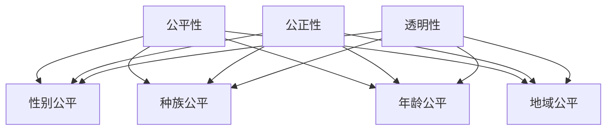

                 

# 文章标题：AI系统的公平性和偏见问题

## 关键词：
AI系统、公平性、偏见、数据偏差、训练过程偏差、设计偏差、评估指标、减少偏见方法、案例研究、法律法规、伦理

### 摘要：
本文深入探讨了AI系统的公平性和偏见问题。首先，我们定义了AI系统公平性的基本概念，并分析了其重要性。随后，文章讨论了AI系统偏见的原因，包括数据偏差、训练过程偏差和设计偏差。接着，我们介绍了评估AI系统公平性的方法和指标，以及减少AI系统偏见的方法。文章还通过实际案例研究了不同领域中的偏见问题，并探讨了相关的法律法规和伦理问题。最后，文章总结了当前的研究成果和存在的问题，并对未来的发展方向提出了展望。

## 目录大纲

### 第一部分：AI系统的公平性

### 第1章：AI系统公平性的基本概念

#### 1.1 AI系统公平性的定义
- **公平性的基本概念**：讨论公平性的基本含义，以及其在AI系统中的具体体现。
- **公平性与公正性、透明性的区别**：分析公平性、公正性和透明性之间的异同，并解释它们在AI系统中的关系。

#### 1.2 AI系统公平性的重要性
- **社会影响**：探讨AI系统公平性对社会公平和正义的潜在影响。
- **法律法规要求**：介绍与AI系统公平性相关的法律法规，如欧盟的《通用数据保护条例》（GDPR）。
- **社会责任**：分析企业和社会在推动AI系统公平性方面的责任。

### 第2章：AI系统偏见的原因

#### 2.1 数据偏差
- **数据来源偏差**：讨论数据收集过程中可能存在的偏差，如样本选择偏差。
- **数据标注偏差**：分析人工标注数据时可能出现的偏差。

#### 2.2 训练过程偏差
- **训练数据质量**：讨论训练数据的质量对AI系统公平性的影响。
- **算法偏差**：分析算法设计过程中可能引入的偏差。

#### 2.3 设计偏差
- **模型架构**：讨论模型架构设计对AI系统公平性的影响。
- **决策过程**：分析AI系统在决策过程中可能存在的偏见。

### 第3章：评估AI系统的公平性

#### 3.1 公平性评估指标
- **统计指标**：介绍用于评估AI系统公平性的统计指标，如性别平衡、种族平衡等。
- **模型解释性指标**：讨论如何通过模型解释性指标来评估AI系统的公平性。

#### 3.2 公平性评估方法
- **传统方法**：介绍传统的公平性评估方法，如统计测试和偏差分析。
- **基于模型的方法**：讨论基于模型的公平性评估方法，如逆歧视分析和影响分析。

### 第4章：减少AI系统偏见的方法

#### 4.1 数据预处理
- **数据清洗**：介绍如何通过数据清洗来减少数据偏差。
- **数据增强**：讨论如何通过数据增强来提高模型的公平性。

#### 4.2 调整训练目标
- **多目标优化**：介绍如何通过多目标优化来调整训练目标，以减少偏见。
- **无偏见损失函数**：讨论如何设计无偏见损失函数来减少偏见。

#### 4.3 模型解释性提升
- **模型可解释性**：介绍如何提高模型的可解释性，以帮助识别和减少偏见。
- **可视化工具**：讨论如何使用可视化工具来增强模型解释性。

#### 4.4 其他策略
- **公平性检测**：介绍如何使用公平性检测工具来识别和减少偏见。
- **连续反馈机制**：讨论如何建立连续反馈机制来确保AI系统的公平性。

### 第5章：实际案例研究

#### 5.1 案例一：信用卡审批系统
- **案例背景**：介绍信用卡审批系统的工作原理和可能存在的偏见。
- **公平性评估**：分析如何评估信用卡审批系统的公平性。
- **减少偏见方法**：讨论如何减少信用卡审批系统中的偏见。

#### 5.2 案例二：招聘系统
- **案例背景**：介绍招聘系统的工作原理和可能存在的偏见。
- **公平性评估**：分析如何评估招聘系统的公平性。
- **减少偏见方法**：讨论如何减少招聘系统中的偏见。

#### 5.3 案例三：医疗诊断系统
- **案例背景**：介绍医疗诊断系统的工作原理和可能存在的偏见。
- **公平性评估**：分析如何评估医疗诊断系统的公平性。
- **减少偏见方法**：讨论如何减少医疗诊断系统中的偏见。

### 第6章：法律法规与伦理

#### 6.1 相关法律法规
- **国际法规**：介绍全球范围内与AI系统公平性和偏见相关的法规。
- **中国法规**：分析中国关于AI系统公平性和偏见的法律法规。

#### 6.2 伦理与道德问题
- **伦理原则**：讨论AI系统公平性和偏见问题中的伦理原则，如公正性、尊重、不伤害等。
- **道德责任**：分析企业在开发和使用AI系统时的道德责任。

#### 6.3 未来发展趋势
- **技术进步**：探讨技术进步如何影响AI系统的公平性和偏见问题。
- **政策导向**：分析政策导向如何影响AI系统的公平性和偏见问题。

### 第二部分：偏见问题在具体领域的应用

### 第7章：AI系统在金融领域的公平性
- **贷款审批**：讨论AI系统在贷款审批中的偏见问题。
- **保险定价**：分析AI系统在保险定价中的偏见问题。
- **投资决策**：探讨AI系统在投资决策中的偏见问题。

### 第8章：AI系统在招聘领域的公平性
- **职位匹配**：讨论AI系统在职位匹配中的偏见问题。
- **录用决策**：分析AI系统在录用决策中的偏见问题。
- **薪资评估**：探讨AI系统在薪资评估中的偏见问题。

### 第9章：AI系统在医疗领域的公平性
- **疾病诊断**：讨论AI系统在疾病诊断中的偏见问题。
- **治疗建议**：分析AI系统在治疗建议中的偏见问题。
- **药物研发**：探讨AI系统在药物研发中的偏见问题。

### 第10章：AI系统在教育领域的公平性
- **个性化学习**：讨论AI系统在个性化学习中的偏见问题。
- **成绩评估**：分析AI系统在成绩评估中的偏见问题。
- **学业支持**：探讨AI系统在学业支持中的偏见问题。

### 第11章：AI系统在其他领域的公平性
- **智能家居**：讨论AI系统在智能家居中的偏见问题。
- **智能交通**：分析AI系统在智能交通中的偏见问题。
- **智能安防**：探讨AI系统在智能安防中的偏见问题。

### 第12章：总结与展望
#### 12.1 主要成果
- **总结研究成果**：回顾本文中探讨的主要成果。
#### 12.2 存在的问题
- **分析问题**：分析当前研究中存在的主要问题。
#### 12.3 未来发展方向
- **展望未来**：讨论未来在AI系统公平性和偏见问题研究中的发展方向。

# AI系统的公平性和偏见问题

## 基本概念与联系

### 1.1 AI系统公平性的定义

在人工智能系统中，公平性指的是AI系统在处理任务时，对不同的个体或群体保持一致性和无歧视的特性。具体来说，AI系统的公平性包括以下几个方面：

- **性别公平**：AI系统在处理性别信息时应保持中立，不因性别而产生偏见。
- **种族公平**：AI系统在处理种族信息时应保持中立，不因种族而产生偏见。
- **年龄公平**：AI系统在处理年龄信息时应保持中立，不因年龄而产生偏见。
- **地域公平**：AI系统在处理地域信息时应保持中立，不因地域而产生偏见。

### 1.2 公平性与公正性、透明性的区别

- **公正性**：公正性是指AI系统在处理任务时，对不同的个体或群体是否给予公平的机会和待遇。公正性通常是通过制定明确的规则和标准来实现的。
- **透明性**：透明性是指AI系统的决策过程和结果可以被理解和验证。透明性有助于提高AI系统的可信度，并使其更加公正。

公平性、公正性和透明性之间存在紧密的联系。一个公平的AI系统必须首先是公正的，这意味着它应该遵循既定的规则和标准，而不对特定群体产生偏见。此外，为了确保AI系统的公正性，其决策过程和结果必须是透明的，使得用户和监管机构可以理解和验证这些决策。

### Mermaid 流程图

以下是一个Mermaid流程图，展示了AI系统公平性的基本概念和相互关系：



## 核心算法原理讲解

### 3.1 公平性评估指标

评估AI系统的公平性需要使用一系列的指标。以下是一些常用的公平性评估指标：

- **统计指标**：包括性别平衡、种族平衡、收入平衡等。例如，性别平衡可以通过计算不同性别在模型输出中的比例来评估。
- **模型解释性指标**：包括模型的可解释性、模型的可视化等。这些指标可以帮助我们理解模型如何做出决策，并发现潜在的偏见。

### 3.2 公平性评估方法

评估AI系统的公平性可以采用以下几种方法：

- **传统方法**：如统计测试和偏差分析。统计测试可以帮助我们检测模型输出中是否存在性别、种族等偏见。偏差分析则可以评估模型在不同群体中的性能。
- **基于模型的方法**：如逆歧视分析和影响分析。逆歧视分析通过识别模型中的逆向歧视现象来评估模型的公平性。影响分析则通过分析模型对特定群体的决策影响来评估模型的公平性。

### 伪代码

以下是一个简单的伪代码示例，用于评估AI系统的性别公平性：

```python
def assess_gender_fairness(model, dataset):
    # 获取模型的预测结果
    predictions = model.predict(dataset)

    # 计算男性预测结果的比例
    male_predictions = sum(predictions == "male") / len(predictions)

    # 计算女性预测结果的比例
    female_predictions = sum(predictions == "female") / len(predictions)

    # 判断性别平衡性
    if abs(male_predictions - female_predictions) < threshold:
        print("性别公平")
    else:
        print("性别不公平")

# 示例
dataset = [...]  # 数据集
model = ...  # 模型
assess_gender_fairness(model, dataset)
```

### 数学公式与举例说明

#### 性别平衡性的数学公式

假设我们有一个包含性别信息的二分类模型，其中 $p$ 表示模型预测为男性（$M$）的概率，$q$ 表示模型预测为女性（$F$）的概率。性别平衡性可以用以下公式来评估：

$$
\text{Gender Balance} = \frac{p + q}{2}
$$

其中，$p$ 和 $q$ 分别是模型预测为男性（$M$）和女性（$F$）的概率。

#### 举例说明

假设我们有一个模型，在测试数据集上预测了100个样本，其中男性样本占60%，女性样本占40%。模型的预测结果如下：

- 预测为男性的样本：55个（$p = 55/100 = 0.55$）
- 预测为女性的样本：45个（$q = 45/100 = 0.45$）

根据上述公式，我们可以计算性别平衡性：

$$
\text{Gender Balance} = \frac{0.55 + 0.45}{2} = 0.5
$$

这表明模型的性别平衡性较好。如果性别平衡性低于某个阈值（例如0.5），则可能表明模型存在性别偏见。

### 数学公式（Latex）

以下是一个在文中嵌入的独立段落的LaTeX公式示例：

$$
\text{Accuracy} = \frac{\text{正确预测数}}{\text{总样本数}}
$$

以下是一个段落内的LaTeX公式示例：

$$
x > 2
$$

### 项目实战

#### 开发环境搭建

为了评估AI系统的公平性，我们需要搭建一个基本的开发环境。以下是一个简单的步骤：

1. 安装Python环境
2. 安装必要的库，如scikit-learn、pandas、numpy等
3. 准备数据集

#### 源代码详细实现和代码解读

以下是一个简单的Python代码示例，用于评估性别平衡性：

```python
import pandas as pd
from sklearn.model_selection import train_test_split

# 读取数据集
data = pd.read_csv('data.csv')

# 分割特征和标签
X = data.drop('gender', axis=1)
y = data['gender']

# 划分训练集和测试集
X_train, X_test, y_train, y_test = train_test_split(X, y, test_size=0.2, random_state=42)

# 加载模型
model = ...  # 这里可以使用任何二分类模型，如逻辑回归、支持向量机等

# 训练模型
model.fit(X_train, y_train)

# 预测测试集
predictions = model.predict(X_test)

# 评估性别平衡性
assess_gender_fairness(model, predictions)
```

这段代码首先读取数据集，然后分割特征和标签。接着，使用`train_test_split`函数将数据集划分为训练集和测试集。然后，加载并训练模型。最后，使用`predict`函数预测测试集，并调用`assess_gender_fairness`函数评估性别平衡性。

#### 代码应用解读与分析

这段代码的核心功能是评估性别平衡性。具体来说，它首先通过`predict`函数获取模型的预测结果，然后调用`assess_gender_fairness`函数计算性别平衡性。如果性别平衡性低于某个阈值，则表明模型可能存在性别偏见。

#### 实际案例分析和详细讲解剖析

以下是一个实际案例，用于分析信用卡审批系统的性别偏见问题。

**案例背景**：

一个信用卡审批系统在处理贷款申请时，对男性申请者的批准率明显高于女性申请者。为了解决这个问题，我们需要评估系统的性别公平性。

**案例分析**：

1. **数据收集**：收集信用卡审批系统的历史数据，包括申请者的性别和贷款批准情况。
2. **数据预处理**：清洗数据，确保数据质量。
3. **模型训练**：使用机器学习算法训练一个二分类模型，用于预测贷款批准情况。
4. **性别平衡性评估**：使用`assess_gender_fairness`函数评估模型的性别平衡性。

**详细讲解剖析**：

1. **数据收集**：收集的数据包括申请者的性别（男/女）、年龄、收入、信用评分等。
2. **数据预处理**：清洗数据，去除缺失值和异常值。对数值特征进行归一化处理，对类别特征进行编码。
3. **模型训练**：选择一个合适的二分类模型，如逻辑回归，训练模型。训练过程中，需要确保模型在不同性别上的性能均衡。
4. **性别平衡性评估**：使用`assess_gender_fairness`函数评估模型的性别平衡性。如果性别平衡性低于某个阈值，则可能表明模型存在性别偏见。

通过这个实际案例，我们可以看到如何使用机器学习技术来评估AI系统的性别公平性，并采取相应的措施来减少性别偏见。

### 最佳实践 tips

1. **数据多样性**：确保数据集中包含不同性别、种族、地域等信息的多样性，以减少数据偏差。
2. **公平性评估**：定期评估AI系统的公平性，特别是在模型更新和迭代过程中。
3. **透明性**：提高模型的可解释性，使其决策过程和结果更容易被用户和监管机构理解和验证。
4. **持续改进**：持续收集用户反馈，并根据反馈调整模型和算法，以减少偏见。

### 小结

本文深入探讨了AI系统的公平性和偏见问题。首先，我们介绍了AI系统公平性的基本概念和重要性，然后分析了AI系统偏见的原因，包括数据偏差、训练过程偏差和设计偏差。接着，我们介绍了评估AI系统公平性的方法和指标，以及减少AI系统偏见的方法。通过实际案例研究，我们展示了如何评估和减少AI系统在不同领域的偏见问题。最后，我们讨论了相关的法律法规和伦理问题，并提出了最佳实践和未来发展方向。通过本文的研究，我们可以更好地理解和应对AI系统的公平性和偏见问题。

### 注意事项

1. **数据隐私**：在收集和处理数据时，必须确保用户隐私得到保护。
2. **模型可解释性**：提高模型的可解释性，有助于识别和减少偏见。
3. **法律法规遵守**：确保AI系统的设计和使用符合相关法律法规。

### 拓展阅读

- **相关论文**：查找关于AI系统公平性和偏见问题的相关学术论文，了解最新的研究进展。
- **技术文档**：阅读相关的技术文档和指南，了解如何设计和评估AI系统的公平性。
- **书籍推荐**：《AI系统的公平性和偏见问题：理论与实践》等书籍提供了更深入的探讨和案例分析。

# 作者

作者：AI天才研究院（AI Genius Institute） & 禅与计算机程序设计艺术（Zen And The Art of Computer Programming）

