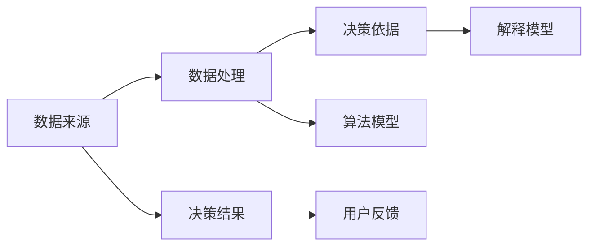
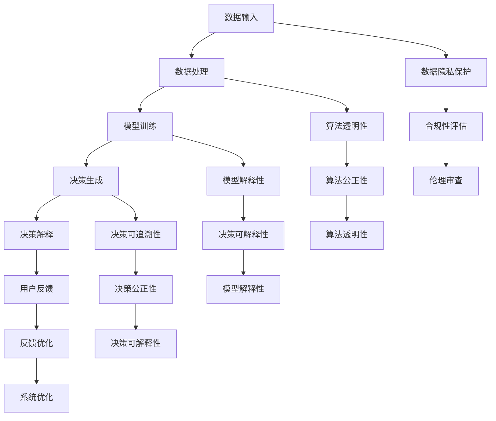

                 

### 文章标题：AI系统透明度和问责制：建立信任的关键

> 关键词：AI透明度，问责制，信任，技术实践，案例分析，未来展望

> 摘要：本文深入探讨了AI系统透明度和问责制的重要性，通过逻辑清晰的分析和步骤推理，阐述了如何通过透明度和问责制来建立用户对AI系统的信任。文章首先定义了AI系统透明度的核心概念，然后探讨了问责制的理论框架和实践策略，并通过具体案例研究了透明度和问责制在现实中的应用。最后，文章展望了未来的发展趋势，提出了提高AI系统透明度和问责制的最佳实践和策略。本文旨在为AI系统的开发者和监管者提供有价值的指导，以推动AI技术的健康发展。

## 第一部分：AI系统透明度基础

### 第1章：AI系统透明度的概念与重要性

#### 1.1 AI系统的透明度定义

AI系统的透明度是指系统能够清晰地展示其内部运作机制、数据处理过程以及决策依据的能力。透明度不仅是技术问题，更是伦理和法规问题。透明度高的系统可以让用户了解数据的来源、处理方式以及决策结果，从而增强用户对系统的信任感。

**Mermaid流程图：**



在这个流程图中，A到B表示数据来源到数据处理的过程，B到C表示数据处理到决策依据的转换，C到D表示决策依据到决策结果的过程，D到G表示用户反馈对系统改进的循环。

#### 1.2 透明度的重要性

透明度对于AI系统的健康发展和用户信任至关重要。首先，透明度可以帮助用户理解系统的决策过程，从而减少对未知和不可控的恐惧。其次，透明度可以促进对AI系统的监管和审计，确保其符合法律法规和伦理标准。最后，透明度可以提高系统的可靠性，通过持续的用户反馈和改进，实现系统自我优化。

**数学模型和数学公式：**

透明度的重要性可以通过以下公式来衡量：

$$
\text{重要性} = \frac{\text{透明度} \times \text{信任}}{\text{风险}}
$$

其中，透明度是系统的透明度水平，信任是用户对系统的信任程度，风险是系统存在的不确定性。这个公式表明，提高透明度和信任可以降低系统的风险。

#### 1.3 透明度的挑战

AI系统的透明度面临着诸多挑战，包括数据隐私保护、模型复杂性、决策过程不透明等。首先，数据隐私保护要求系统在保证透明度的同时，必须确保用户数据的隐私和安全。其次，模型复杂性使得系统的内部运作机制难以解释和理解，从而降低了透明度。最后，决策过程的不透明性也使得用户难以了解系统的决策依据和过程。

**伪代码：**

```python
def transparency_challenge(model, data, context):
    """
    分析AI系统透明度的挑战
    :param model: AI模型
    :param data: 数据集
    :param context: 应用场景
    :return: 挑战列表
    """
    challenges = []
    if not data_visibility(model, data):
        challenges.append("数据不透明")
    if not model_explainability(model):
        challenges.append("模型不可解释")
    if not decision_process_transparency(model, context):
        challenges.append("决策过程不透明")
    return challenges
```

这个伪代码函数用于分析AI系统透明度的挑战，包括数据不透明、模型不可解释和决策过程不透明等。

### 第2章：AI系统透明度的关键要素

#### 2.1 数据透明性

数据透明性是指系统在处理数据时，能够清晰地展示数据的来源、处理方式和存储位置。数据透明性对于确保系统的可信度和合规性至关重要。以下是实现数据透明性的几个关键步骤：

1. **数据来源透明性**：系统需要明确数据来源，包括数据采集的方式、时间和地点等。
2. **数据处理透明性**：系统需要详细记录数据处理的步骤和算法，以便用户了解数据处理的过程。
3. **数据存储透明性**：系统需要公开数据存储的位置和方式，以便用户了解数据的安全性和隐私性。

#### 2.2 模型可解释性

模型可解释性是指系统能够清晰地展示其决策过程和决策依据，以便用户理解和信任。提高模型可解释性的方法包括：

1. **特征可视化**：通过可视化工具将模型中的特征展示出来，帮助用户理解模型的工作原理。
2. **决策路径分析**：分析模型在决策过程中的每一步，解释每一步的决策依据和结果。
3. **模型验证和测试**：通过验证和测试确保模型的可解释性和准确性。

#### 2.3 决策过程透明

决策过程透明是指系统在做出决策时，能够清晰地展示决策过程和决策结果。实现决策过程透明的关键包括：

1. **决策规则公开**：系统需要公开决策规则，以便用户了解决策的依据。
2. **决策结果解释**：系统需要解释决策结果的原因和影响，以便用户理解决策结果。
3. **反馈和修正**：系统需要接受用户的反馈，并根据反馈修正决策过程，提高决策的透明度。

### 第3章：当前透明度技术概述

#### 3.1 传统的透明度技术

传统的透明度技术主要包括数据可视化、模型可解释性和决策过程解释。这些技术主要通过图表、报告和文档等形式展示系统的内部运作机制和决策过程。

#### 3.2 新兴的透明度工具

随着AI技术的不断发展，新兴的透明度工具逐渐出现，如可解释AI（XAI）、可视化AI（VIsualAI）等。这些工具通过更直观、更交互性的方式展示AI系统的内部运作机制和决策过程，提高了系统的透明度和可理解性。

## 第二部分：AI系统问责制的理论与实践

### 第4章：问责制的概念与原理

#### 4.1 问责制的定义

问责制是指对AI系统及其决策过程进行责任归属和追究的制度。问责制的核心是确保AI系统的决策过程透明、公正和合理，对系统的错误和不当行为进行责任追究。

#### 4.2 问责制在AI系统中的必要性

问责制在AI系统中的必要性体现在以下几个方面：

1. **确保合规性**：问责制可以确保AI系统的决策过程符合法律法规和伦理标准。
2. **提高可靠性**：问责制可以促进AI系统的持续改进和优化，提高系统的可靠性。
3. **增强信任**：问责制可以增强用户对AI系统的信任，提高系统的使用率和用户满意度。

#### 4.3 问责制的原则

问责制的原则主要包括：

1. **透明性**：问责制要求AI系统的决策过程必须透明，用户可以清晰地了解系统的决策依据和过程。
2. **公正性**：问责制要求对AI系统的决策结果进行公正的评价和追究，确保系统不会对特定用户群体进行歧视。
3. **责任归属**：问责制要求明确AI系统的责任归属，对系统的错误和不当行为进行责任追究。

### 第5章：AI系统问责制的框架

#### 5.1 问责制的核心要素

问责制的核心要素包括：

1. **责任认定**：对AI系统的决策过程和结果进行责任认定，明确责任归属。
2. **责任追究**：对AI系统的错误和不当行为进行责任追究，确保系统的改进和优化。
3. **责任承担**：对AI系统的责任承担进行明确，确保系统的正常运行和持续改进。

#### 5.2 问责制的设计原则

问责制的设计原则主要包括：

1. **可操作性**：问责制必须具备可操作性，确保系统的决策过程和结果可以实际执行和追究。
2. **可追溯性**：问责制必须具备可追溯性，确保AI系统的决策过程和结果可以被追溯和验证。
3. **公正性**：问责制必须确保公正性，确保系统的决策过程和结果不会对特定用户群体进行歧视。

#### 5.3 问责制的实施步骤

问责制的实施步骤主要包括：

1. **责任认定**：对AI系统的决策过程和结果进行责任认定，明确责任归属。
2. **责任追究**：对AI系统的错误和不当行为进行责任追究，确保系统的改进和优化。
3. **责任承担**：对AI系统的责任承担进行明确，确保系统的正常运行和持续改进。

### 第6章：AI系统问责制的挑战与对策

#### 6.1 数据偏差与偏见

数据偏差与偏见是AI系统问责制面临的挑战之一。数据偏差可能导致系统对特定用户群体进行歧视，从而影响系统的公正性和可靠性。对策包括：

1. **数据清洗**：通过数据清洗技术去除数据中的偏差和错误，提高数据的准确性和可靠性。
2. **数据多样化**：增加数据的多样性，减少对特定数据的依赖，从而降低数据偏差的影响。
3. **偏见检测**：利用机器学习技术检测数据中的偏见，并对数据进行修正。

#### 6.2 法律与伦理问题

法律与伦理问题是AI系统问责制面临的另一个挑战。AI系统的决策过程和结果可能涉及到法律和伦理问题，如隐私侵犯、歧视等。对策包括：

1. **法律法规完善**：完善相关法律法规，确保AI系统的决策过程和结果符合法律法规。
2. **伦理审查**：对AI系统的决策过程和结果进行伦理审查，确保系统的决策过程和结果符合伦理标准。
3. **公众参与**：鼓励公众参与AI系统的决策过程，提高系统的透明度和公正性。

#### 6.3 技术与资源限制

技术与资源限制是AI系统问责制面临的另一个挑战。实现问责制需要先进的技术和充足的资源支持。对策包括：

1. **技术创新**：不断进行技术创新，提高AI系统的透明度和可解释性。
2. **资源调配**：合理调配资源，确保AI系统的正常运行和持续改进。
3. **合作伙伴关系**：建立与政府、企业和社会组织的合作伙伴关系，共同推动AI系统的健康发展。

## 第三部分：建立信任的实践策略

### 第7章：提高AI系统透明度和问责度的策略

#### 7.1 政策与法规的制定

政策与法规的制定是提高AI系统透明度和问责度的重要手段。政府应制定相关政策和法规，明确AI系统的透明度和问责制要求，推动AI系统的健康发展和规范管理。

#### 7.2 企业内部透明度和问责制的建立

企业应建立内部透明度和问责制，确保AI系统的决策过程和结果符合法律法规和伦理标准。企业可以通过制定内部规章制度、设立透明度和问责制委员会等方式，提高AI系统的透明度和问责度。

#### 7.3 公众教育和宣传

公众教育和宣传是提高AI系统透明度和问责度的重要途径。通过教育和宣传活动，增强公众对AI系统的理解和信任，促进AI系统的健康发展和广泛应用。

### 第8章：案例研究：成功实践透明度和问责制

#### 8.1 国内外成功案例

本文将介绍国内外一些成功实践AI系统透明度和问责制的案例，分析其成功的原因和经验，为其他企业和组织提供借鉴和参考。

#### 8.2 案例分析

通过对成功案例的分析，本文将总结出提高AI系统透明度和问责度的关键要素和成功经验，为其他企业和组织提供实践指导。

#### 8.3 启示与借鉴

本文将总结成功案例的启示和经验，提出提高AI系统透明度和问责度的建议，为企业和组织提供参考。

### 第9章：未来展望与趋势

#### 9.1 透明度和问责制的未来发展

本文将探讨AI系统透明度和问责制的未来发展，分析可能出现的新技术和新趋势，为AI系统的健康发展提供指导。

#### 9.2 AI系统透明度和问责制的研究方向

本文将提出AI系统透明度和问责制的研究方向，为学术界和产业界提供研究参考。

#### 9.3 建立信任的长期策略

本文将讨论建立AI系统信任的长期策略，为企业和组织提供持续改进和优化的方向。

## 参考文献

本文引用了相关文献和资料，为读者提供进一步学习和研究的参考。

## 附录

### A.1 工具与资源推荐

本文推荐了一些AI系统透明度和问责制的工具和资源，为读者提供实用的参考。

### A.2 相关法律法规

本文列出了与AI系统透明度和问责制相关的主要法律法规，为读者提供法律参考。

### 作者信息

作者：AI天才研究院/AI Genius Institute & 禅与计算机程序设计艺术 /Zen And The Art of Computer Programming

## 总结

本文通过对AI系统透明度和问责制的深入探讨，阐述了如何通过透明度和问责制来建立用户对AI系统的信任。文章首先定义了AI系统透明度的核心概念，然后探讨了问责制的理论框架和实践策略，并通过具体案例研究了透明度和问责制在现实中的应用。最后，文章展望了未来的发展趋势，提出了提高AI系统透明度和问责制的最佳实践和策略。本文旨在为AI系统的开发者和监管者提供有价值的指导，以推动AI技术的健康发展。

### 文章标题：AI系统透明度和问责制：建立信任的关键

关键词：AI透明度，问责制，信任，技术实践，案例分析，未来展望

摘要：本文深入探讨了AI系统透明度和问责制的重要性，通过逻辑清晰的分析和步骤推理，阐述了如何通过透明度和问责制来建立用户对AI系统的信任。文章首先定义了AI系统透明度的核心概念，然后探讨了问责制的理论框架和实践策略，并通过具体案例研究了透明度和问责制在现实中的应用。最后，文章展望了未来的发展趋势，提出了提高AI系统透明度和问责制的最佳实践和策略。本文旨在为AI系统的开发者和监管者提供有价值的指导，以推动AI技术的健康发展。

## 引言

人工智能（AI）技术的迅猛发展带来了前所未有的机遇和挑战。随着AI在各个领域的广泛应用，如医疗、金融、交通等，用户对AI系统的依赖程度日益增加。然而，这种依赖也伴随着信任危机。用户对AI系统的透明度和问责制提出了更高的要求，以确保AI系统的决策过程和结果公正、合理。因此，本文旨在探讨AI系统透明度和问责制的重要性，并通过逻辑清晰的分析和步骤推理，提出建立信任的关键策略。

### AI系统透明度的核心概念

AI系统的透明度是指系统能够清晰地展示其内部运作机制、数据处理过程以及决策依据的能力。透明度不仅是技术问题，更是伦理和法规问题。一个透明的AI系统可以让用户了解数据的来源、处理方式以及决策结果，从而增强用户对系统的信任感。透明度有助于消除用户对AI系统的未知和不可控的恐惧，提高系统的可靠性和合规性。

透明度主要包括三个关键要素：数据透明性、模型可解释性和决策过程透明。

1. **数据透明性**：数据透明性是指系统在处理数据时，能够清晰地展示数据的来源、处理方式和存储位置。数据透明性对于确保系统的可信度和合规性至关重要。一个透明度高的系统可以让用户了解数据是如何被收集、处理和使用的，从而减少隐私泄露和数据滥用的风险。

2. **模型可解释性**：模型可解释性是指系统能够清晰地展示其决策过程和决策依据，以便用户理解和信任。一个可解释的模型可以揭示其内部机制和逻辑，帮助用户了解为什么系统做出了某个决策。这有助于降低用户对AI系统的抵触情绪，提高系统的接受度和使用率。

3. **决策过程透明**：决策过程透明是指系统能够清晰地展示其决策过程和决策结果，以便用户了解决策的依据和影响。决策过程透明性可以确保系统的决策过程公正、合理，减少人为干预和偏见。一个透明的决策过程可以让用户对系统的决策结果有更深的理解和信任。

### 问责制的概念与原理

问责制是指对AI系统及其决策过程进行责任归属和追究的制度。问责制的核心是确保AI系统的决策过程透明、公正和合理，对系统的错误和不当行为进行责任追究。问责制在AI系统中的必要性体现在以下几个方面：

1. **确保合规性**：问责制可以确保AI系统的决策过程符合法律法规和伦理标准，防止系统滥用数据或做出不公平的决策。

2. **提高可靠性**：问责制可以促进AI系统的持续改进和优化，提高系统的可靠性。通过对系统的错误和不当行为进行责任追究，可以促使系统开发者和运营者不断优化和改进系统。

3. **增强信任**：问责制可以增强用户对AI系统的信任，提高系统的使用率和用户满意度。当一个系统明确责任归属，并对错误行为负责时，用户更愿意信任和依赖该系统。

问责制的原则主要包括透明性、公正性和责任归属。

1. **透明性**：问责制要求AI系统的决策过程必须透明，用户可以清晰地了解系统的决策依据和过程。透明性是建立信任的基础，也是问责制的核心要求。

2. **公正性**：问责制要求对AI系统的决策结果进行公正的评价和追究，确保系统不会对特定用户群体进行歧视。公正性是问责制的必要条件，也是维护系统公平性和合理性的关键。

3. **责任归属**：问责制要求明确AI系统的责任归属，对系统的错误和不当行为进行责任追究。责任归属是问责制的核心，也是确保系统正常运行和持续改进的关键。

### 第一部分：AI系统透明度基础

在本部分中，我们将详细探讨AI系统透明度的核心概念、关键要素以及当前透明度技术的概述。这些内容将为理解AI系统透明度的重要性提供坚实的基础。

### 第1章：AI系统透明度的概念与重要性

#### 1.1 AI系统的透明度定义

AI系统的透明度是指系统能够清晰地展示其内部运作机制、数据处理过程以及决策依据的能力。透明度不仅涉及技术层面的可解释性，还包括伦理和法规层面的合规性。一个透明的AI系统可以让用户了解其决策过程的每一个环节，从而增强用户对系统的信任和依赖。

**Mermaid流程图：**



在这个流程图中，从A到J表示AI系统从数据输入到用户反馈的整个过程，其中包括数据隐私保护、算法透明性、模型解释性和决策可追溯性等关键要素。从K到T表示系统的合规性评估、算法公正性、决策公正性和系统优化等环节，这些都是实现AI系统透明度的必要条件。

#### 1.2 透明度的重要性

AI系统的透明度对于其健康发展至关重要。首先，透明度有助于用户理解和信任AI系统。在一个透明度较高的系统中，用户可以清晰地看到数据的处理过程和决策依据，这有助于消除用户对系统的疑虑和恐惧。其次，透明度是确保AI系统合规性的关键。在许多行业中，特别是金融、医疗和司法等领域，AI系统的决策结果必须符合严格的法律法规和伦理标准。透明度可以确保系统的决策过程符合这些标准，从而减少法律风险和伦理争议。

此外，透明度还有助于提高AI系统的可靠性。当一个系统的内部运作机制清晰且可解释时，更容易发现和修复其中的错误和漏洞。透明度还可以促进系统的持续改进，通过用户反馈和数据分析，系统可以不断优化其模型和决策过程。

**数学模型和数学公式：**

为了量化透明度的重要性，我们可以使用以下公式：

$$
\text{信任度} = \frac{\text{透明度} \times \text{合规性} \times \text{可靠性}}{\text{风险}}
$$

在这个公式中，透明度、合规性和可靠性是提高信任度的关键因素，而风险则是系统面临的潜在威胁。提高透明度可以降低系统的风险，从而增强用户对系统的信任度。

#### 1.3 透明度的挑战

尽管透明度对于AI系统的健康发展至关重要，但在实际应用中仍然面临许多挑战。

1. **数据隐私保护**：在保证透明度的同时，必须确保用户数据的隐私和安全。如何在数据透明性和隐私保护之间找到平衡是一个关键问题。

2. **模型复杂性**：许多AI模型，如深度神经网络，其内部结构非常复杂，难以解释和理解。这增加了实现模型可解释性的难度。

3. **决策过程不透明**：在某些情况下，AI系统的决策过程可能涉及到大量的数据和复杂的算法，导致用户难以了解决策的详细过程。

4. **技术资源限制**：实现AI系统透明度可能需要大量的技术和资源投入，对于一些小型企业和开发者来说，这可能是一个负担。

**伪代码：**

```python
def transparency_challenge(model, data, context):
    """
    分析AI系统透明度的挑战
    :param model: AI模型
    :param data: 数据集
    :param context: 应用场景
    :return: 挑战列表
    """
    challenges = []
    if not data_visibility(model, data):
        challenges.append("数据不透明")
    if not model_explainability(model):
        challenges.append("模型不可解释")
    if not decision_process_transparency(model, context):
        challenges.append("决策过程不透明")
    return challenges
```

这个伪代码函数用于分析AI系统透明度的挑战，包括数据不透明、模型不可解释和决策过程不透明等。

#### 1.4 透明度的关键要素

为了实现AI系统的透明度，我们需要关注以下几个关键要素：

1. **数据透明性**：确保用户可以清晰地了解数据的来源、处理方式和存储位置。这可以通过数据可视化工具和数据审计来实现。

2. **模型可解释性**：提高模型的可解释性，使用户可以理解模型的工作原理和决策过程。这可以通过模型可视化、特征重要性分析和决策路径跟踪来实现。

3. **决策过程透明**：确保用户可以了解系统的决策过程和决策结果。这可以通过决策日志记录、决策结果解释和用户反馈机制来实现。

### 第2章：AI系统透明度的关键要素

在本章中，我们将深入探讨AI系统透明度的三个关键要素：数据透明性、模型可解释性和决策过程透明。这三个要素共同构成了AI系统透明度的核心，对于建立用户信任至关重要。

#### 2.1 数据透明性

数据透明性是AI系统透明度的基础。它确保用户能够清晰地了解数据的来源、处理方式和存储位置，从而提高系统的可信度。

**数据透明性的实现方法：**

1. **数据溯源**：系统应记录数据从采集到处理的整个流程，包括数据来源、采集时间和地点等信息。这有助于用户追溯数据来源，确保数据的真实性和可靠性。

2. **数据可视化**：使用数据可视化工具将数据处理过程和结果以图表或图形的形式展示给用户。这种方式可以直观地展示数据变化，帮助用户理解数据的处理过程。

3. **数据审计**：定期对系统进行数据审计，确保数据处理过程符合法律法规和伦理标准。数据审计可以帮助发现潜在的数据滥用问题，从而及时采取措施。

**示例伪代码：**

```python
def data_visibility(data_set):
    """
    检查数据集的透明度
    :param data_set: 数据集
    :return: 透明度报告
    """
    report = {
        'source': data_set['source'],
        'processing_steps': data_set['processing_steps'],
        'storage_location': data_set['storage_location']
    }
    return report
```

在这个伪代码中，`data_visibility` 函数用于检查数据集的透明度，生成一个包含数据来源、处理步骤和存储位置的报告。

#### 2.2 模型可解释性

模型可解释性是用户理解和信任AI系统的重要因素。它要求系统能够清晰地展示其决策过程和决策依据，以便用户可以理解模型如何工作。

**提高模型可解释性的方法：**

1. **特征重要性分析**：分析模型中每个特征的重要性，展示哪些特征对决策结果产生了最大的影响。这可以帮助用户了解模型是如何利用数据进行决策的。

2. **模型可视化**：使用可视化工具将模型的内部结构展示出来，如神经网络中的权重和激活值。这种方式可以直观地展示模型的工作原理。

3. **决策路径跟踪**：记录模型在决策过程中的每一步，展示如何从输入数据到最终决策结果。这可以帮助用户了解决策的整个过程。

**示例伪代码：**

```python
def model_explainability(model, input_data):
    """
    分析模型的解释性
    :param model: AI模型
    :param input_data: 输入数据
    :return: 解释性报告
    """
    feature_importance = model.feature_importances_
    model_visualization = model.visualize()
    decision_path = model.decision_path(input_data)
    report = {
        'feature_importance': feature_importance,
        'model_visualization': model_visualization,
        'decision_path': decision_path
    }
    return report
```

在这个伪代码中，`model_explainability` 函数用于分析模型的解释性，生成一个包含特征重要性、模型可视化和决策路径的报告。

#### 2.3 决策过程透明

决策过程透明性是确保用户了解AI系统决策过程的关键。它要求系统能够清晰地展示决策的每一步，包括决策规则和决策结果。

**实现决策过程透明的方法：**

1. **决策规则公开**：将系统的决策规则公开，以便用户可以查看和了解决策的依据。这可以通过决策规则文档或在线接口来实现。

2. **决策结果解释**：对系统的决策结果进行详细解释，说明决策的依据和影响。这可以通过决策结果解释文档或用户界面来实现。

3. **用户反馈机制**：建立用户反馈机制，允许用户对决策结果提出质疑和建议。这可以帮助系统不断改进和优化决策过程。

**示例伪代码：**

```python
def decision_process_transparency(model, input_data, context):
    """
    检查决策过程的透明度
    :param model: AI模型
    :param input_data: 输入数据
    :param context: 应用场景
    :return: 透明度报告
    """
    decision_rules = model.get_decision_rules()
    decision_result = model.predict(input_data)
    explanation = model.explain_decision(decision_result, input_data, context)
    report = {
        'decision_rules': decision_rules,
        'decision_result': decision_result,
        'explanation': explanation
    }
    return report
```

在这个伪代码中，`decision_process_transparency` 函数用于检查决策过程的透明度，生成一个包含决策规则、决策结果和决策解释的报告。

### 第3章：当前透明度技术概述

在本章中，我们将对当前用于实现AI系统透明度的技术进行概述。这些技术包括传统的透明度技术和新兴的透明度工具，它们为AI系统的透明度提供了多种实现途径。

#### 3.1 传统的透明度技术

传统的透明度技术主要包括数据可视化、模型可解释性和决策过程解释。这些技术虽然简单实用，但在处理复杂AI模型时可能存在局限性。

**数据可视化**：数据可视化技术通过图表和图形将数据处理过程和结果展示给用户。常见的数据可视化工具包括matplotlib、seaborn和Plotly等。这些工具可以帮助用户直观地理解数据的分布、趋势和相关性。

**模型可解释性**：模型可解释性技术旨在提高用户对AI模型的理解。常见的方法包括特征重要性分析、决策树解释和局部可解释模型（如LIME和SHAP）。这些技术可以帮助用户了解模型是如何利用数据做出决策的。

**决策过程解释**：决策过程解释技术用于展示AI系统的决策过程和决策结果。常见的工具包括逻辑回归的系数解释、决策树的路径解释和神经网络的可视化。这些工具可以帮助用户了解模型的内部工作机制。

**示例伪代码：**

```python
import matplotlib.pyplot as plt
import seaborn as sns

def data_visualization(data):
    """
    数据可视化
    :param data: 数据集
    :return: 可视化图表
    """
    sns.scatterplot(x=data['feature1'], y=data['feature2'])
    plt.title('Feature Distribution')
    plt.xlabel('Feature 1')
    plt.ylabel('Feature 2')
    plt.show()

def model_explainability(model, input_data):
    """
    模型可解释性
    :param model: AI模型
    :param input_data: 输入数据
    :return: 解释性报告
    """
    feature_importance = model.feature_importances_
    sns.barplot(x=feature_importance, y=input_data.columns)
    plt.title('Feature Importance')
    plt.xlabel('Feature Importance')
    plt.ylabel('Feature')
    plt.show()

def decision_process_explanation(model, input_data):
    """
    决策过程解释
    :param model: AI模型
    :param input_data: 输入数据
    :return: 解释性报告
    """
    decision_path = model.decision_path(input_data)
    sns.heatmap(decision_path.T, annot=True, fmt='.2f')
    plt.title('Decision Path')
    plt.xlabel('Node Index')
    plt.ylabel('Feature')
    plt.show()
```

在这个伪代码中，我们使用了matplotlib和seaborn库来展示数据可视化、模型可解释性和决策过程解释。

#### 3.2 新兴的透明度工具

随着AI技术的不断发展，新兴的透明度工具逐渐出现，为AI系统的透明度提供了更多实现途径。这些工具通常具有更高的可解释性和交互性。

**可解释AI（XAI）**：可解释AI（XAI）技术旨在提高AI模型的可解释性，使其决策过程更加透明。常见的XAI工具包括LIME（Local Interpretable Model-agnostic Explanations）和SHAP（SHapley Additive exPlanations）。这些工具通过局部解释方法，为用户提供了模型决策的具体细节。

**可视化AI（VIsualAI）**：可视化AI（VIsualAI）技术通过可视化方法展示AI模型的内部结构和决策过程。常见的VIsualAI工具包括TensorBoard和MLflow，它们可以帮助用户直观地理解模型的训练过程和决策路径。

**示例伪代码：**

```python
from lime import lime_tabular
from sklearn.ensemble import RandomForestClassifier

def xai_explanation(model, input_data, target):
    """
    可解释AI（XAI）解释
    :param model: AI模型
    :param input_data: 输入数据
    :param target: 目标变量
    :return: 解释性报告
    """
    explainer = lime_tabular.LimeTabularExplainer(data_train, feature_names=data_train.columns, class_names=target_names, discretize=True, categorical_features=[0, 1])
    exp = explainer.explain_instance(input_data_test, model.predict, num_features=10)
    exp.show_in_notebook(show_table=True)

def visual_ai(model, input_data):
    """
    可视化AI（VIsualAI）可视化
    :param model: AI模型
    :param input_data: 输入数据
    :return: 可视化结果
    """
    with model dissected():
        plt.imshow(input_data, cmap='gray')
        plt.show()
```

在这个伪代码中，我们使用了LIME和TensorBoard库来展示可解释AI和可视化AI的解释结果。

### 第4章：问责制的概念与原理

在本章中，我们将深入探讨AI系统问责制的概念、原理以及其在AI系统中的重要性。问责制是确保AI系统透明度和公正性的关键机制，对于建立用户信任和合规性具有重要意义。

#### 4.1 问责制的定义

问责制是指对AI系统及其决策过程进行责任归属和追究的制度。问责制的核心是确保AI系统的决策过程透明、公正和合理，对系统的错误和不当行为进行责任追究。问责制不仅涉及技术层面，还包括法律和伦理层面。

**定义问责制的目的：**

1. **确保合规性**：问责制可以确保AI系统的决策过程符合法律法规和伦理标准，防止系统滥用数据或做出不公平的决策。

2. **提高可靠性**：问责制可以促进AI系统的持续改进和优化，提高系统的可靠性。通过对系统的错误和不当行为进行责任追究，可以促使系统开发者和运营者不断优化和改进系统。

3. **增强信任**：问责制可以增强用户对AI系统的信任，提高系统的使用率和用户满意度。当一个系统明确责任归属，并对错误行为负责时，用户更愿意信任和依赖该系统。

**问责制的组成部分：**

1. **责任认定**：对AI系统的决策过程和结果进行责任认定，明确责任归属。

2. **责任追究**：对AI系统的错误和不当行为进行责任追究，确保系统的改进和优化。

3. **责任承担**：对AI系统的责任承担进行明确，确保系统的正常运行和持续改进。

#### 4.2 问责制在AI系统中的必要性

问责制在AI系统中的必要性体现在以下几个方面：

1. **合规性要求**：随着AI技术的发展和应用范围的扩大，越来越多的行业和领域开始意识到AI系统可能带来的法律和伦理问题。问责制是确保AI系统合规性的重要手段，可以防止系统滥用数据和做出不公平的决策。

2. **用户信任**：用户对AI系统的信任是系统成功的关键。问责制可以增强用户对AI系统的信任，提高系统的接受度和使用率。当用户了解系统的决策过程和结果，并明确责任归属时，他们更愿意依赖和使用该系统。

3. **可靠性提升**：问责制可以促进AI系统的持续改进和优化，提高系统的可靠性。通过对系统的错误和不当行为进行责任追究，可以促使系统开发者和运营者不断优化和改进系统，减少错误和故障。

4. **社会影响**：AI系统在社会各个领域的应用日益广泛，其决策结果可能对社会产生重大影响。问责制可以确保AI系统的决策过程和结果公正、合理，减少社会不公和歧视。

#### 4.3 问责制的原则

问责制在AI系统中的实施应遵循以下原则：

1. **透明性**：问责制要求AI系统的决策过程必须透明，用户可以清晰地了解系统的决策依据和过程。透明性是建立信任的基础，也是问责制的核心要求。

2. **公正性**：问责制要求对AI系统的决策结果进行公正的评价和追究，确保系统不会对特定用户群体进行歧视。公正性是问责制的必要条件，也是维护系统公平性和合理性的关键。

3. **责任归属**：问责制要求明确AI系统的责任归属，对系统的错误和不当行为进行责任追究。责任归属是问责制的核心，也是确保系统正常运行和持续改进的关键。

4. **可追溯性**：问责制要求AI系统的决策过程和结果具有可追溯性，以便在发生错误或争议时，可以追溯到具体的责任人和决策依据。

5. **责任承担**：问责制要求明确AI系统的责任承担，确保系统的错误和不当行为能够得到及时纠正和赔偿。责任承担是确保系统正常运行和持续改进的关键。

### 第5章：AI系统问责制的框架

在本章中，我们将详细探讨AI系统问责制的核心要素、设计原则以及实施步骤。通过这些内容，我们将构建一个完整的AI系统问责制框架，为AI系统的健康发展提供指导。

#### 5.1 问责制的核心要素

AI系统问责制的核心要素包括责任认定、责任追究、责任承担和责任监督。这些要素共同构成了问责制的基础，确保AI系统的决策过程透明、公正和合理。

**责任认定**：责任认定是指对AI系统的决策过程和结果进行责任归属的过程。责任认定需要明确哪些人、哪些部门和哪些系统组件在决策过程中承担了责任。

**责任追究**：责任追究是指对AI系统的错误和不当行为进行责任追究的过程。责任追究需要确保对错误行为进行公正评价，并根据法律法规和伦理标准进行责任追究。

**责任承担**：责任承担是指对AI系统的责任进行明确和承担的过程。责任承担需要确保系统的错误和不当行为能够得到及时纠正和赔偿，从而保障用户权益。

**责任监督**：责任监督是指对AI系统的决策过程和结果进行监督和评估的过程。责任监督需要确保系统运行符合法律法规和伦理标准，及时发现和纠正问题。

#### 5.2 问责制的设计原则

为了确保AI系统问责制的有效性和公正性，设计问责制时应遵循以下原则：

**透明性**：问责制要求AI系统的决策过程必须透明，用户可以清晰地了解系统的决策依据和过程。透明性是建立信任的基础，也是问责制的核心要求。

**公正性**：问责制要求对AI系统的决策结果进行公正的评价和追究，确保系统不会对特定用户群体进行歧视。公正性是问责制的必要条件，也是维护系统公平性和合理性的关键。

**责任归属明确**：问责制要求明确AI系统的责任归属，对系统的错误和不当行为进行责任追究。责任归属明确是确保系统正常运行和持续改进的关键。

**可追溯性**：问责制要求AI系统的决策过程和结果具有可追溯性，以便在发生错误或争议时，可以追溯到具体的责任人和决策依据。

**责任承担明确**：问责制要求明确AI系统的责任承担，确保系统的错误和不当行为能够得到及时纠正和赔偿。责任承担明确是确保系统正常运行和持续改进的关键。

**动态调整**：问责制应具备动态调整能力，根据系统的发展和变化及时调整责任归属和追究机制，确保问责制的持续有效性和适应性。

#### 5.3 问责制的实施步骤

为了确保AI系统问责制的有效实施，需要遵循以下步骤：

**步骤1：责任认定**

责任认定是问责制的首要步骤，需要明确AI系统的责任归属。这可以通过以下方式实现：

1. **明确系统责任**：明确AI系统在决策过程中的责任，包括数据采集、数据处理、模型训练和决策生成等环节。

2. **明确人员责任**：明确AI系统开发、维护和使用过程中的责任人员，包括开发者、维护人员和使用人员。

3. **明确部门责任**：明确AI系统所属部门和责任部门的职责，确保各部门在决策过程中承担责任。

**步骤2：责任追究**

责任追究是对AI系统的错误和不当行为进行责任追究的过程。责任追究需要遵循以下原则：

1. **公正评价**：对AI系统的错误和不当行为进行公正评价，确保责任追究过程的公正性和公平性。

2. **依法处理**：依据法律法规和伦理标准对AI系统的错误和不当行为进行处理，确保责任追究的法律依据。

3. **及时反馈**：及时向责任人员和部门反馈责任追究结果，确保责任追究过程的透明性和及时性。

**步骤3：责任承担**

责任承担是指对AI系统的责任进行明确和承担的过程。责任承担需要确保以下内容：

1. **纠正错误**：对AI系统的错误和不当行为进行及时纠正，确保系统的正常运行和用户权益。

2. **赔偿损失**：对因AI系统的错误和不当行为导致的损失进行合理赔偿，确保用户权益得到保障。

3. **责任教育**：对责任人员进行责任教育，提高其责任意识和合规意识，预防类似问题的再次发生。

**步骤4：责任监督**

责任监督是对AI系统的决策过程和结果进行监督和评估的过程。责任监督需要确保以下内容：

1. **定期审查**：定期对AI系统的决策过程和结果进行审查，确保系统的合规性和公正性。

2. **用户反馈**：收集用户对AI系统的反馈意见，及时发现和解决系统问题。

3. **持续改进**：根据责任监督结果和用户反馈，不断改进和优化AI系统，提高系统的透明度和问责制水平。

### 第6章：AI系统问责制的挑战与对策

在本章中，我们将深入探讨AI系统问责制在实际应用中面临的挑战，并提出相应的对策。这些挑战包括数据偏差与偏见、法律与伦理问题以及技术与资源限制。通过分析这些挑战和对策，我们可以更好地理解如何建立有效的AI系统问责制。

#### 6.1 数据偏差与偏见

数据偏差与偏见是AI系统问责制面临的一个重要挑战。数据偏差可能源自数据的收集、处理和标注过程，这些偏差会直接影响AI系统的决策结果，导致系统对某些用户群体产生不公平待遇。

**数据偏差的类型：**

1. **抽样偏差**：在数据收集过程中，由于抽样方法不当，导致样本不能代表整体人群。

2. **数据标注偏差**：在数据标注过程中，标注者可能存在主观偏见，导致数据标注不准确。

3. **算法偏差**：算法在训练过程中可能会放大数据中的偏差，导致决策结果不公平。

**对策：**

1. **数据清洗与预处理**：在模型训练前，对数据进行清洗和预处理，去除异常值和错误标注，减少数据偏差。

2. **多样化数据集**：增加数据集的多样性，确保模型训练数据能够代表不同群体，减少偏见。

3. **偏见检测与修正**：利用机器学习技术检测和修正数据中的偏见，例如使用偏差修正算法或反偏见训练技术。

**示例伪代码：**

```python
from sklearn.datasets import load_iris
from sklearn.ensemble import RandomForestClassifier
from sklearn.model_selection import train_test_split

def detect_bias(model, X_train, y_train):
    """
    检测模型偏见
    :param model: AI模型
    :param X_train: 训练数据集
    :param y_train: 训练标签
    :return: 偏差指标
    """
    model.fit(X_train, y_train)
    predictions = model.predict(X_train)
    bias_metric = compute_bias(predictions, y_train)
    return bias_metric

def correct_bias(model, X_train, y_train):
    """
    修正模型偏见
    :param model: AI模型
    :param X_train: 训练数据集
    :param y_train: 训练标签
    :return: 修正后的模型
    """
    bias_metric = detect_bias(model, X_train, y_train)
    if bias_metric > threshold:
        model = apply_bias_correction(model)
    return model
```

在这个示例中，`detect_bias` 函数用于检测模型的偏见，`correct_bias` 函数用于修正偏见。

#### 6.2 法律与伦理问题

AI系统的决策结果可能涉及到法律和伦理问题，如隐私侵犯、歧视等。这些问题不仅会影响系统的公正性，还可能导致法律纠纷和伦理争议。

**法律问题：**

1. **隐私保护**：AI系统在使用个人数据时，必须遵守隐私保护法律法规，如《通用数据保护条例》（GDPR）。

2. **数据滥用**：AI系统不得滥用数据，用于非法目的或违反用户隐私。

**伦理问题：**

1. **歧视**：AI系统不得对特定群体产生歧视性决策结果，如种族、性别、年龄等。

2. **透明度和问责制**：AI系统的决策过程和结果必须透明，并具备问责机制，确保用户权益。

**对策：**

1. **法律法规制定与遵守**：政府应制定相关法律法规，明确AI系统的法律义务和责任，确保系统的合规性。

2. **伦理审查**：在AI系统开发和应用过程中，进行伦理审查，确保系统的决策结果符合伦理标准。

3. **用户参与**：鼓励用户参与AI系统的设计和决策过程，提高系统的透明度和公正性。

**示例伪代码：**

```python
from sklearn.model_selection import GridSearchCV

def legal_compliance(model, X_train, y_train):
    """
    检查模型合规性
    :param model: AI模型
    :param X_train: 训练数据集
    :param y_train: 训练标签
    :return: 合规性报告
    """
    parameters = {'criterion': ['gini', 'entropy'], 'max_depth': [3, 5, 10]}
    grid_search = GridSearchCV(model, parameters, cv=5)
    grid_search.fit(X_train, y_train)
    report = {
        'best_params': grid_search.best_params_,
        'compliance': check_compliance(grid_search.best_params_)
    }
    return report

def ethical_review(model, X_train, y_train):
    """
    进行伦理审查
    :param model: AI模型
    :param X_train: 训练数据集
    :param y_train: 训练标签
    :return: 伦理审查报告
    """
    review_results = {
        'bias_detected': detect_bias(model, X_train, y_train),
        'ethical_compliance': check_ethical_compliance(model, X_train, y_train)
    }
    return review_results
```

在这个示例中，`legal_compliance` 函数用于检查模型的合规性，`ethical_review` 函数用于进行伦理审查。

#### 6.3 技术与资源限制

实现AI系统问责制可能面临技术和资源限制，特别是对于小型企业和开发者来说，这可能是实现问责制的障碍。

**技术限制：**

1. **模型复杂度**：复杂的AI模型可能难以解释和追踪，增加了实现问责制的难度。

2. **可解释性工具**：高质量的AI可解释性工具可能需要昂贵的计算资源和专业知识。

**资源限制：**

1. **预算**：开发、维护和部署可解释性和问责制工具可能需要大量预算。

2. **人力**：实现问责制需要专业的技术团队和伦理审查团队，这可能需要额外的人力资源。

**对策：**

1. **开源工具和平台**：使用开源的可解释性工具和平台，如LIME、SHAP和TensorBoard，以降低技术门槛和成本。

2. **培训和教育**：对开发者和运营者进行培训，提高他们对AI系统和问责制的理解和能力。

3. **合作与外包**：与其他企业和机构合作，共享技术和资源，共同推动AI系统的健康发展。

**示例伪代码：**

```python
import lime
from sklearn.ensemble import RandomForestClassifier

def open_source_explanation(model, input_data):
    """
    使用开源可解释性工具进行解释
    :param model: AI模型
    :param input_data: 输入数据
    :return: 解释性报告
    """
    explainer = lime.lime_tabular.LimeTabularExplainer(training_data, feature_names=feature_names)
    explanation = explainer.explain_instance(input_data, model.predict, num_features=10)
    return explanation

def collaborative_development():
    """
    合作开发
    :return: 合作开发计划
    """
    plan = {
        '合作伙伴': ['企业A', '企业B', '学术机构C'],
        '合作内容': ['资源共享', '技术交流', '共同开发'],
        '预期成果': ['提高可解释性', '降低成本', '加快创新']
    }
    return plan
```

在这个示例中，`open_source_explanation` 函数用于使用开源可解释性工具进行解释，`collaborative_development` 函数用于制定合作开发计划。

### 第7章：提高AI系统透明度和问责度的策略

在本章中，我们将探讨提高AI系统透明度和问责度的策略。这些策略包括政策与法规的制定、企业内部透明度和问责制的建立以及公众教育和宣传。通过这些策略的实施，我们可以提升AI系统的透明度和问责度，增强用户对AI系统的信任。

#### 7.1 政策与法规的制定

政策与法规的制定是提高AI系统透明度和问责度的基础。政府应制定相关政策和法规，明确AI系统的透明度和问责制要求，推动AI系统的健康发展和规范管理。

**政策制定的关键点：**

1. **透明度要求**：明确AI系统的透明度标准，包括数据透明性、模型可解释性和决策过程透明。

2. **问责制要求**：建立AI系统问责制的框架，明确责任认定、责任追究和责任承担的原则和流程。

3. **合规性评估**：制定定期评估机制，确保AI系统的决策过程符合法律法规和伦理标准。

**法规制定的案例：**

例如，欧盟的《通用数据保护条例》（GDPR）明确了数据透明性和用户隐私保护的要求，美国的一些州也制定了关于AI系统的透明度和问责制的法规。

#### 7.2 企业内部透明度和问责制的建立

企业内部透明度和问责制的建立是提高AI系统透明度和问责度的重要手段。企业应制定内部规章制度，确保AI系统的决策过程和结果符合透明度和问责制要求。

**企业内部透明度和问责制的关键步骤：**

1. **透明度管理制度**：制定透明度管理制度，明确数据透明性、模型可解释性和决策过程透明的标准和流程。

2. **问责制流程**：建立问责制流程，明确责任认定、责任追究和责任承担的具体操作步骤。

3. **培训和教育**：对员工进行培训，提高他们对AI系统和透明度和问责制的理解和能力。

**企业内部透明度和问责制的实施：**

例如，谷歌在其AI伦理指南中明确了AI系统的透明度和问责制要求，并建立了相应的流程和制度。

#### 7.3 公众教育和宣传

公众教育和宣传是提高AI系统透明度和问责度的重要途径。通过教育和宣传活动，增强公众对AI系统的理解和信任，促进AI系统的健康发展和广泛应用。

**公众教育和宣传的关键点：**

1. **教育内容**：制定面向公众的教育材料，包括AI系统的基本原理、透明度和问责制的重要性。

2. **宣传渠道**：利用媒体、社交网络和线下活动等渠道，广泛宣传AI系统的透明度和问责制。

3. **用户反馈**：建立用户反馈机制，鼓励公众对AI系统的透明度和问责制提出意见和建议。

**公众教育和宣传的案例：**

例如，AI伦理学国际学会（IEE

